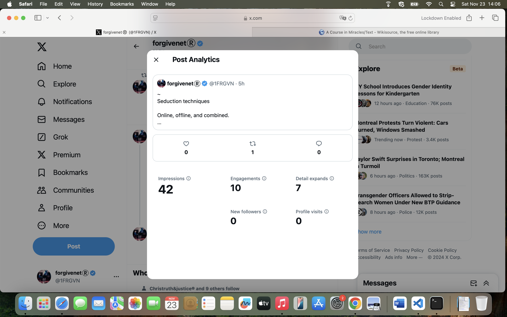

## Going to the night shop

- I go down to the Open 24 Market for some wine in the evening of 2nd November.
- I guess the gang stalkers think I'm going to the Indian because they've put a monstrous full-size figure (Halloween monster) in the seat that Paul usually sits in whenever I "bump" into him.

## Late October/early November

- I'm feeling extremely unwell in my flat. My kidneys are aching. I have suddenly appearing dark circles under my eyes. My eyes are extremely blurry. My mind is confused and I can't remember simple things. I'm sure I'm being poisoned.
- It's impossible for me to go out walking without feeling like I'm going to be attacked in some way; psychological usually.
- When I went shopping to the Carrefour the previous week, a couple parked their car close to mine and as I'm coming back to my car they start shrieking and laughing, and putting their phones up if they're recording me. I don't know who they are. Messages on Twitter fakes accounts that like my posts refer to it later on. It's been like that constantly since September 2023.
- So I don't go out and consequently, if they are poisoning me through the air vents, I'm unable to get out to clean my lungs.
- On Friday 1 November, as I come back from the taking the bin out, I bump into two women coming out of the apartment building, one of whom appears to be Carmen Cano.
- My father is taken to hospital and I have to leave abruptly for London on 3rd November.
- The irony is that if my father hadn't fallen, the poison may well have finished me off.
- Two weeks later and I do feel better, my kidneys are not constantly aching and my mind is getting slowly clearer.
- Last week in Bangkok I had my kidney checked out and all signs are good, except for my anion gap which is excessively low, 6.0 L mmol/L and could mean bromide, iodide, or salicylate ingestion. Common medical diagnostic tests do not consider cases such as mine.
- If I drink one glass of wine, however, I have immediate frothy urine.

## A threat to my brother's life

- On Sunday 10 November, hackers post what I consider a threat to my brother's life.
- The profile pic is clearly my brother, although the bottom part of this person may be someone else.

{width=65%}

- The account details show sniffing dogs (Cano Lopez) and have a clear reference to death: RIP.

{width=65%}

## Bangkok

- Hackers post fake accounts with information from emails I have just written or conversations I have just had.
- I visit Lumpini Park in Bangkok.
- The "Find My" app suddenly appears asking whether I want to remove it or not. I'm still being tracked.
- A man walks past me making porn faces at me.

## Drugs test

- My drugs test over the last 12 months comes back completely negative.
- I can't believe it.
- I ask the test center for the second sample so I can get another lab to retest. They don't have it.

## Fake account

- A fake account called Ligia Betton interacts with me. 

{width=65%}

- I believe this is what is going on, i.e. a porn network (league) has a bet on me. People are making money off me now just like they have been since they made porn of me when I was 16.
- I pray that police will act at some point.

## @jctot19

- I check the `@jctot19` account for the first time in ages, this Wednesday 20th November.

{width=45%}

- He hasn't posted since the 15th January 2024, or he has deleted his posts from then.
- The highlighted post from 9th January, mentioning the *chica*, appears to be referring to me. The account he is replying to is protected so I cannot see the conversation. The implication is that I am chasing him again and again. However, this is undoubtedly what he, Domingo, and their co-conspirators have been setting me up to *appear* to be doing.
- This was after Christmas where I was extraordinarily high, flying is an understatement, and we have plenty of witnesses to that. I was exuberant. 
- I look back and see I must have been drugged with something.
- At that time, there were DM'ed conversations between myself and someone pretending to be him (the American account, Matthew). I relate all this in the [December 2023 section](../2023/december.md).
- Then there was another account in January that chatted with me, pretending to be him.
- I had gone to Dublin on my therapy course that [January 2024](january.md), opened an anonymous account on Twitter, followed `@jctot19` on it, and posted solely to my timeline without interacting with his account directly at all.
- I posted about my therapy, and looked on his timeline for responses, as before.
- The first post I had seen on his timeline during that time had been an angel climbing a ladder to heaven, so I continued.
- I posted one tweet with a sexual connotation and he immediately posts the response from 15th January where he apparently randomly reaches out to a woman he hasn't seen in years.
- I immediately stop communicating with him and delete the twitter account I had created.

!!! important
    - It may be helpful to know that if at any time the trumpet teacher had been honest with me, that would have been that.
    - Instead, he and his teams created convoluted situations in which I was always questioning whether he was interested or not, I was never really sure, and so it kept me hanging on in the attempt to find out what was going on, at a minimum.
    - And on top of that, somehow I was being spiked with drugs or herbs that made me extremely sexually aroused, and led me to masturbate for an unseen audience, while I was also being groomed HEAVILY online with MRA seduction tactics on Twitter and elsewhere.
    - We have to assume that I am the tip of the iceberg with regards to these sorts of honey-trap manipulation techniques and it is highly likely children are being targeted in the same way.

## The landlady

- I spoke to my mother the other day and told her I was thinking about leaving the flat on 15th February 2025 and handing in notice in December.
- I told no-one else this.
- This morning, 21st November, I receive a WhatsApp from Beatriz, my landlady, saying I had said I was leaving the flat.
- I did not at all say this to her at any time and have been planning on staying until 2026.
- I ask her who told her I'd said that.
- I mention there is a problem with the water but we can discuss it later.
- I have raised the issue with the [water pipes](../2023/september.md#the-water-pipes) twice already.

{width=45%}

## Tattoo

- I was on my phone to my mother, telling her I'm going to get a tattoo in Bangkok.
- Two seconds later, a fake account follows me on Twitter with a woman with tattoos.

## Honey trap

- I believe that the `@jctot19` account is fundamentally a honey-trap account.
- Is it possible I blew his cover and that is why the original tweets stopped on 15th January.
- Nevertheless, bizarrely, Google search results related to this account are still active. I notice the newer entries are coming from retweeted posts. I suspect the retweets are automated.
- Carmen and Rocio Vidal still feature. Carmen is obviously Carmen Cano, Domingo's sister.
- I post about [seduction techniques](../../evidence/manipulation.md) on Twitter: https://x.com/1FRGVN/status/1860132157890679006. Immediately, an account interacts with me that has a warning, and suggests the trumpet teacher has an alibi, and not to forget to cross examine Domingo (Camo).

{width=65%}

- I suspect Carmen Cano to be behind most of these, including the threat to my brother's life.
- This is my most translated tweet for ages:

## Sunday 24th November - note

- I have had sufficient messages from hackers on fake accounts at this time to be concerned they will impede this statement-writing process.
- I know they have pretty much full access to all my devices and I'm unable to access internet on my mobile right now for unknown reasons, the behavior is much like when I tried to access the Guardia Civil website and was blocked for doing so. 
- So I have sketched as much important stuff as possible from March 2024 to now just so it's added.
- Please note my mind was so badly affected by all this over this year, it is quite hard for me to get everything together correctly, and I will need to cross check with hotel and travel schedules, and Twitter messages, but this will take some time.
- I have completed up to January 2024 now, and fully drafted February 2024, so it's probably already enough to prove gang stalking, cyber stalking, and sexual grooming.
- Hopefully I will be able to continue as best I can, but nothing would surprise me at this stage.
- I believe I am continually targeted online by Domingo and Carmen Cano, Hazel Smith and her mother probably, and the trumpet teacher whoever he is.
