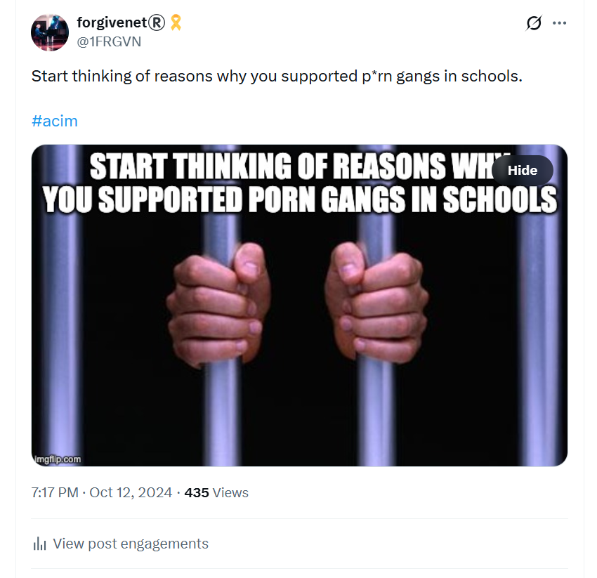
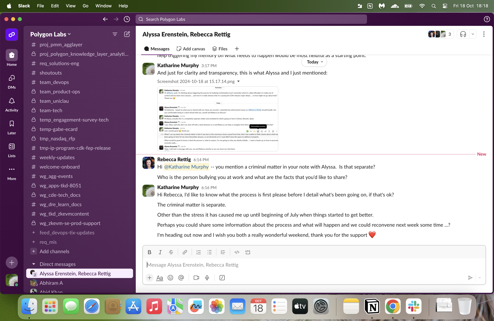
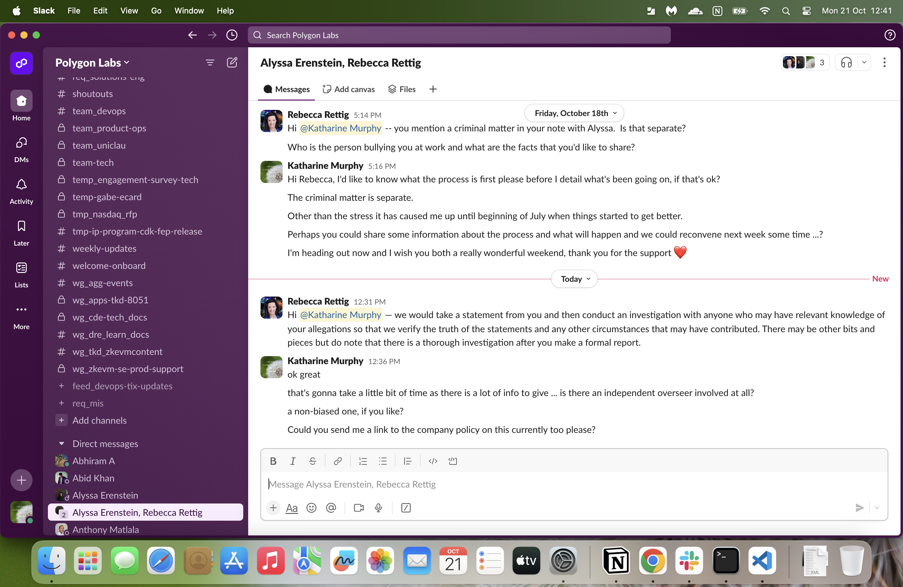
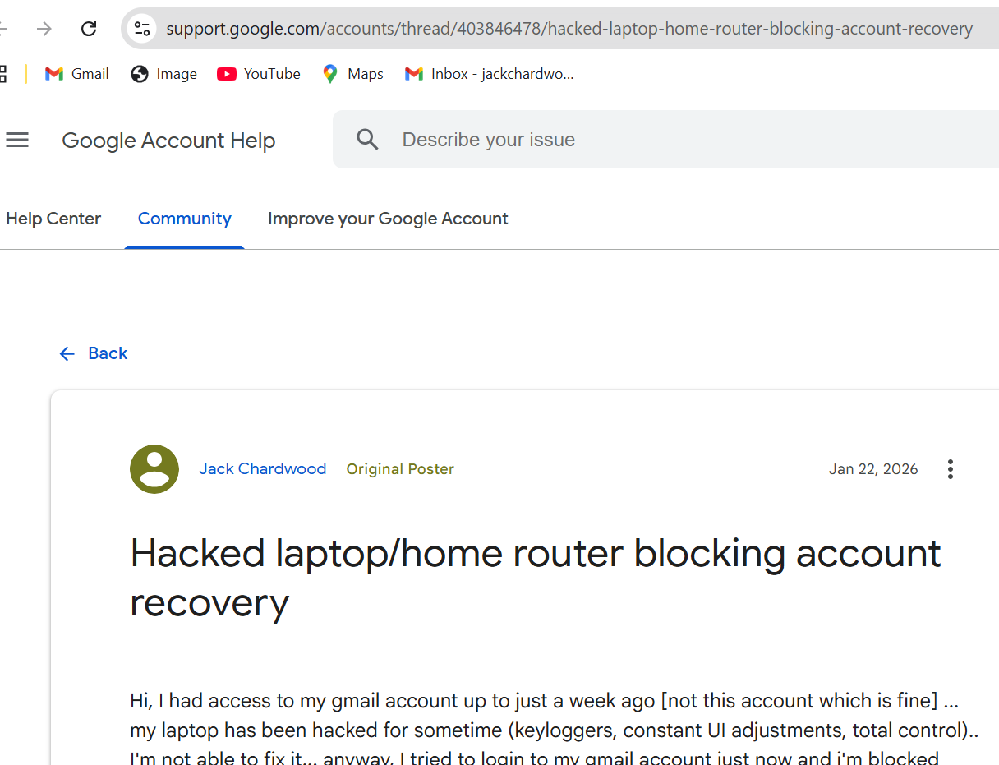
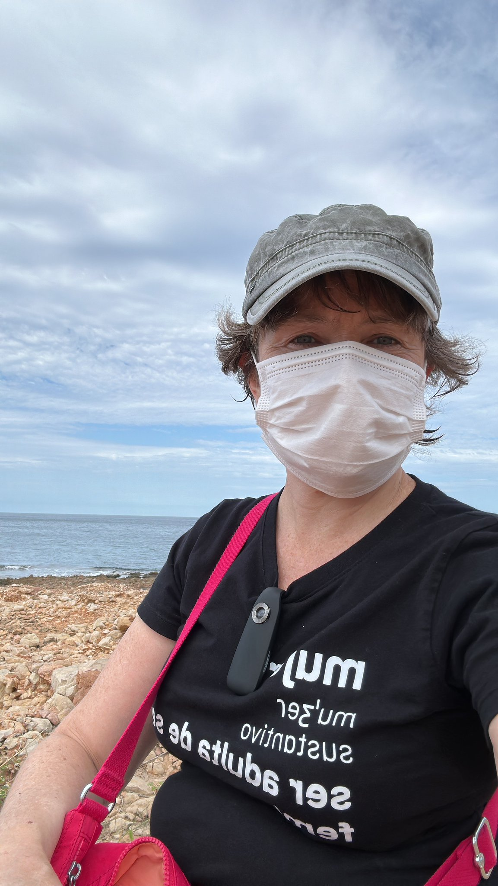
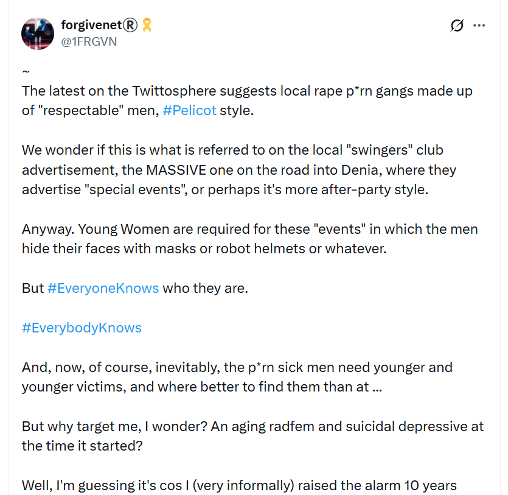
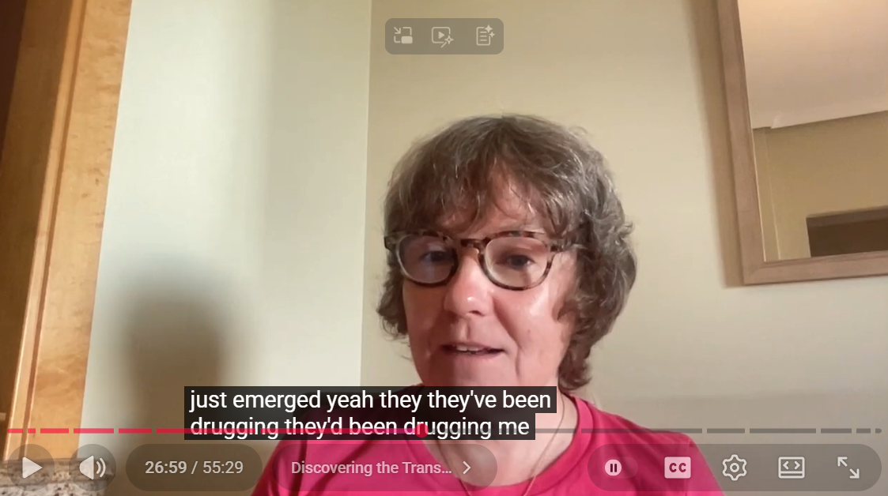

# October 2024

## Poison warnings

- Back in Carrer Furs, I am high every day, all day; I'm even hallucinating - I will realize to what extent when [I return in February 2025](../2025/february.md#paul-helps-me-move-back-to-uk) to collect my belongings.
- My kidneys are screaming and I'm unstable on my feet. 
- My vision is extremely blurry.
- Online, I start to see a lot of references to poisoning.
- Is someone trying to warn me about something?
- The reference to gay men and muscle men in this fake account makes me think of Domingo.

- The profile message says: "Enjoy my homemade poison...".
- I translate the rest of it.

- *The poison prepared by my own family*, to me, points to the Lopez-Canos, including Carmen Cano who will pass me when leaving my apartment building at the end of this month, and smile at me.
- Over the month I see numerous messages about my strength; *you're really strong*, I read regularly. 
- Towards the end of the month, these messages become even more frequent.
- This is when I'm back from [Fatima](#fatima-20-26th-october) and the poison I'm ingesting is worse, and they have also doused all my belongings in pesticides. 
- I'm certain the intention is murder.
- At the time, I'm so high it's difficult to think straight about anything, but I do wonder how other porn-gang targets have fared over the decades if the gangs consider me a strong person.

### Is there a bible in the house?

- I see constant X posts asking whether there is a "bible in the house".
- Incidentally, I had bought a bible during at Lourdes and was reading it regularly. 
- You can see some of my screenshot tabs have the chapter details I was looking at; my bible was in Spanish so I needed to translate everything.
- The constant posts make me think someone is warning me that the gangs intend to murder me; i.e. a bible in the house for the priest to perform the last rights.
- These posts were in English and Spanish sometimes too.

### Porn-gangs in schools

- I fight back, as usual.

## Bullying ramps up at Polygon

- The oppression at Polygon is now fever-pitched and panicky.
- They are very obviously building up to firing me.
- Rather like [refusing to stop my piano studies at the conservatory in June 2023](../2023/june.md#monday-19th-june), I have no reason to leave the job I love and am very good at (brain-damage from years of poisoning notwithstanding).
- However, my colleagues' demeanor towards me at the [Bali offsite](may.md#bali) - which Elon may have briefly attended - solidified in my mind what had been going on since the previous November when I started my job; especially with [Nadim Kobesi](../2023/november.md#nadim-kobesi), [Hans Bodani](../2023/november.md#hans-bodani), and [the military coup on my role by the marketing teams](../2024/may.md#ajay-alicia-aman-pandey-and-mushroom-man-perform-a-military-coup-on-my-job).
- I have no idea I'm being targeted because I'm a sedated Dénia porn-gang sensation and had been starring in [switcheroo porn at the conservatory](../../crimes/protagonists/vidal-sastre.md#four-distinct-men) and live-stream spy-cam porn direct from my apartment for years.
- I had no idea.
- The only possible reason I could come up with for the constant abuse at work were my political views on trans ideology and women's rights.
- Gabriel Silva meets me and I ask him what he's going to do about [Hans's and Anthony's outrageous insubordination](june.md#polygon).
- Gabriel explains he's starting afresh, he's going to forget about the past and move forward.
- It sounds reasonable.
- He then takes away all my work and gives it to Hans and Anthony.
- At a later meeting, I ask Gabriel about his experience with Hans. He says: *oh, he doesn't seem to be doing any work*.
- I wonder if that was the deal with Hans; no work, just a tax-free life in Dubai for significant abuse of the *female-tech-colleague-you-despise* after the [Bali offsite](may.md#bali)... so I'd leave.
- Could they be that messed up?
- Gabriel then ramps up the bullying even more; for example, he tells me he's getting another colleague, Mitch Eger from marketing, to write technical docs for us (my job again, a job which Mitch is not skilled in).
- Mitch, then, repeats verbatim how I have always described the software technical author role, as if he's reading a script taken from a recording of me (hacked Zoom meetings?).
- The most aggressive part of this is that whenever I said those things to Gabriel, he always told me I was wrong and had another immature idea which was better than mine; silencing.
- Gabriel then sets me up to fail again; specifically by giving Anthony tasks he was unskilled for, ensuring he will make a lot of mistakes in a busy sprint cycle with the CDK team.
- Anthony has stopped talking to me as if I'm a normal person whenever I try to help and advise him.
- I see the tripwire and step over it.
- However, I can see Gabriel is very confident with his plans, and Anthony's dismissive communication style says to me: *you're not going to be here in a few weeks anyway, I don't even have to talk to you politely*.
- I have no other choice but to make an official complaint about victimization to save my job.
- I contact Alyssa from HR on Slack and tell her I'm being victimized for my political views and it has been going on since I started.
- I tell her I won't give her a full and complete description of everything that's happened until I understand the company process.
- I request a non-biased mediator also.
- I do tell Alyssa about the [Pakistani Yorkshireman who made sexually violent threats to me at dinner in Bali](may.md#the-pakistani-yorkshire-man) and that I had informed Miriam from Spanish HR about it the following morning.
- I also do tell Alyssa that I'm being viciously stalked and hacked in Dénia by criminal gangs and it has been going on throughout my tenure at Polygon (something Gabriel, Hans, Anthony, Vincent, and numerous others are aware of because I told them).
- At this stage, I'm unaware the two situations are intertwined.
- Rebecca Rettig, Head of Legal, reaches out on Slack - the date on the screenshot is probably a week later, when I started screen-shotting everything.

- I wait some time for a process document which the company doesn't seem to have.
- While this is going on, the HR team has a company-wide meeting in which they mention my experience as a *female-tech-colleague-you-despise* in an underhand way.
- James Dawes (ex-colleague of [Hans Bodani](../2023/november.md#polygon) at Mantle) leads the meeting and alludes to something exciting coming up.
- He starts to mention the word [Fetch](../early-years/interim.md#fetchai) over and over for no particular reason.
- "Remember", Alyssa says laughing later on, "Remember the word Fetch!".
- Fetch is a direct reference to the company in Cambridge UK, Fetch.AI, [where a man flashed his crotch at me in an online meeting](../early-years/interim.md#fetchai) a week after I started.
- When I meet Alyssa again, I tell her about my experience at Fetch without mentioning the company name.
- At our next team meeting, Gabriel Silva makes sure to mention we *must* all watch this meeting if we haven't already, especially me.
- Polygon then hires a [man who targeted me at zkSync](../2023/june.md#work-stress) in April 2023 while the [switcheroo porn at the conservatory](../../crimes/protagonists/vidal-sastre.md#four-distinct-men) was in full swing, Coogan.
- Alyssa tells me Rebecca Rettig wants to talk to me about what's been going on and I agree to talk to her when I understand the process fully.
- We never speak. 
- They fire me first.

!!! tip "Give her a reason to be stressed..."
    - We know that sedated rape makes women depressed and anxious without knowing why.
    - Professional sedating rape-gangs making money on this lucrative genre, therefore, must give women a *reason* to be stressed to avoid suspicion.
    - This explains the outrageous behavior of teachers and staff at the conservatory towards me.
    - It also explains the presence of Nadim, Hans, and the bullying events at Polygon, most especially [the engineer who looked like Jitendra Das making sexually violent threats towards me](../2024/may.md#the-pakistani-yorkshire-man) at dinner in Bali.
    - I assume Spanish gitano misogynist terrorists have known for centuries that a *hysterical*, stressed, depressed, and anxious woman is never believed.

### Criminal investigation data blocked by Google admins

- For this section, I had saved countless Slack screenshots between myself, Polygon HR, Gabriel Silva, Rebecca Rettig, all the conversations on Slack between [myself and Gordon Bishop](march/1-12.md#reporting-hacking-to-polygon-labs) when I reported hacking to Polygon security teams in March, and more.
- Because I was so high all the time (not realizing it), and couldn't focus enough to remember or remind myself about actions I had taken on previous days; I took duplicates, triplicates.. I saved hundreds of Slack screenshots.
- I did this because, at some level, I was aware that my mind was not functioning properly. 
- I wasn't looking forward to collating them there were so many, so I saved them.
- In Bangkok in November 2025, staying near Lupini Park beside the American embassy, I laboriously backed up everything I had onto all my Google drives.
- I had backups in three different places; giant, humongous backups.
- And all the originals I had mailed to myself in my katharinejc Google account.
- Arriving back in London in January 2026, I'm denied access to this Google account and there is no reason for it.
- I'm not asked for a screen-lock, and they don't offer the recovery email option, to gain access as normal.
- I raise [an issue on the Google community help pages](https://support.google.com/accounts/thread/403846478/hacked-laptop-home-router-blocking-account-recovery), but it drifts into silence.

- Today, I go to find my Slack screenshot back ups from October 2024 for writing this section.
- There are none!
- All Google drive information pertaining to this police statement on my other two Google accounts - apart from the larger files I have been linking out to since I started writing - has been deleted.
- It's as if I didn't spend three whole days laboriously backing up multiple gigabytes of data to my Google drives online in Bangkok.
- This sinister activity on my Google accounts happened the moment I arrived back in North London, and I do not think this is by accident.
- I expect there's other backups.

### Recruitment agents contact me

- During this time, I'm contacted by a few different recruitment agents about potential roles; Joel Barden at Hype is one of those recruiters reaching out.
- Does he know I'm about to be fired?

## Activity in the nextdoor apartment, number 18

- The next door apartment at Carrer Furs is barely used. 
- I heard people in there maybe twice, for no more than a week, in nearly three years.
- There may have been people there for the summer holidays, while I was away, so I never thought it odd because that's quite normal in the area.
- Whenever my neighbor at number 16, Marie Carmen, or Pedro the caretaker, referred to the people at number 18, it was always in a derogatory way, with a turned up nose, as if there was something not good about them.
- They told me they were never there.
- However, from the moment I arrive back in Dénia at the end of September 2024, and throughout October, there is constant activity in this apartment.
- People coming and going at all times. 
- People talking loudly day and night.
- It got so unusual that, whenever there was activity outside my front door, I would look to see what was going on.
- I saw a skinny woman with shortish dark curly hair, of about 60 years old, going in and out nearly every day.
- She was always doing something at the water cupboard.

- The woman had a husky smoker's voice that sounded like a slow-motion machine gun.
- One night, I hear her say in Spanish - from behind the wall while I'm in bed - "and nothing was ever good enough for her", and I presumed she was referring to me; a gang-stalker's psychological wounding tactic. 
- I guess that this is the main lie the non-porn-watching people of Dénia (very few I imagine) were told about me, and why they all support the gang stalkers and join in if they're so inclined, or bored. 
- I'm *the uppity foreigner who thought nothing was good enough in Dénia*, which is as far from the truth as possible.
- They only needed a couple of people who I had contentious interactions with over the years to support that. 
- One of those was likely my neighbor from Cami Llavador 5, Charo, who really didn't like me at all (she was a weird woman).
- Another could be a woman Magpie I had been friends with years ago in 2008.
- She was married to the drummer from Wings, Geoff Britton.
- I may have seen them both - been introduced again in 2022 - on a trip with the British walkers, another unusual event that seemed a bit staged. 
- I hope my "friends" weren't demonstrating my brain-damage to them...
- Magpie got extremely angry with me one afternoon after I said something rather innocuous yet truthful to her, something she found extremely hurtful.
- It wasn't intended to be hurtful, at all.
- I guess manipulating a whole small town to hate someone can be really easy.

### Cigarette smoke the first week I move in

- Incidentally, in the first weeks I moved into Carrer Furs in December 2021 I could smell cigarette smoke in my bedroom.
- I assumed it was Marie Carmen next door, who smoked like a chimney, but it was confusing because my bedroom was the room furthest away from her apartment.
- My bedroom wall, and bed, backed onto apartment number 18.
- Not only that, but I could smell the cigarette smoke even with the bedroom door shut.
- I assumed it was coming through the air-conditioning vents and so I blocked up the vent beside my bed with plastic, at which point the smell stopped.
- Furthermore, while wondering about this, I opened the vent to see what was going on behind it, to see if there could be an outlet into the next door apartment.
- I put my phone inside and filmed what was behind the vent.
- It looked like completely unfinished brickwork. 
- There was no smooth air ventilation system, it was just rough broken and damaged brickwork.
- Not only that, but the brick tunnel moved towards the outside wall - away from the air-conditioning system which was on the other side of my bedroom in the bathroom and up onto the roof on the opposite side of the building to where this tunnel was heading.
- And even more concerning, was that, the tunnelling which looked like someone had gone through with a workman's drill and never finished up the job, had an inlet to the right, which was right into the neighbor's apartment at number 18.
- At the time I didn't really know what I was looking at.
- Now, not only do I think the sedation mechanism was probably coming from number 18 through that particular vent which was right beside my bed, I also believe the cigarette smoke at the beginning of my stay was intentional; the way they tell you what they're going to do before they do it (I've demonstrated a lot of that already).
- Is that their weird way of alleviating personal guilt and divine retribution for their evil - we know how devout the gypsies are?
- Or is it just plain evil?

### The housing register

- Just before I escape the poisoned apartment and attempted murder at the end of the month, I have the presence of mind to request the owner's details from [the public register](#nota-simple-from-the-neighbors-flats).
- The property owner is: MANUEL BALLESTEROS LOPEZ; sharing the name of Concha the guitar teacher who [I wrote to asking for help in the beginning when I had no idea what was going on](../2023/july.md#first-letter-to-concha).
- She was bullied relentlessly by Domingo Cano Lopez and his students.
- LOPEZ is of course one of Domingo's surnames.
- I can't imagine in a tiny town like Dénia these people wouldn't be somehow related.
- Of course, I was so badly hacked by Spanish criminal gangs that have the whole area's internet ring-fenced for their sinister purposes, they could have easily rewritten this document to suit themselves before sending it.

## Iceland shopping

- I pop over to Iceland in Benissa to get some British products.
- I'm wearing my face mask.
- I wear it every time I leave the house now.
- At the time of editing this section - January 2026 - I'm not sure if I thought I was *only* being drugged and poisoned when I left my home, and that's why I wore the mask.
- As I mentioned, the drug/poison dose in October 2024 was the highest it had ever been and I was even hallucinating.
- For this reason, and due to my eyesight problems, I wondered if I was ingesting methanol somehow without my knowledge.
- Anyway.
- I'm served at the till by a nice-looking, blond, British woman who is smiling and grinning at me like I'm an idiot.
- She knows who I am.
- When I get home, on X, I see a fake account with a profile pic of the same woman.
- It is morning and she is sitting on an apartment's balcony wall somewhere in the Marina Alta region with a view of the pines and mountains.
- She is wearing a man's shirt, and nothing else.
- It's yet another *after-sex* photo.
- I saw so many of them, hundreds, many with underage girls.
- I don't know why, but I get the feeling the man behind the camera is [trumpet teacher number three](../../crimes/protagonists/vidal-sastre.md#an-unknown-man-i-may-have-a-picture-of).
- I know I said I was perma-high and hallucinating over this period, but a great deal of this is verifiable, which is nice.

## Saturday 5th October

- I go for a walk along Las Rotas.
- I take my analog phone so that I'm not tracked and followed and I can still call the police if necessary.
- I'm tracked and followed.
- Just before I reach the restaurant Sendra, Carmen Lopez Cano passes me on a bicycle.
- She u-turns abruptly and stops to stare at me, grins and cycles off the way she came.
- I know it's her because she looks like her brother Domingo.
- I thought I had her on film; although she may have stayed just out of shot knowing I was wearing my hiker's camera.
- What you can notice is that, after seeing her, I become nervous and start singing a little to self-sooth.
- I tweet about this meeting later on, and it is translated a lot.

- After seeing Carmen a few times this month - she makes no effort to hide herself - I realize with horror that the woman who had turned up to listen to the [chamber music concert in May 2023](../2023/may.md#chamber-music-concert), pretending to be Pablo's mum, the only parent that showed up along with at least two of the [switcheroo-porn trumpet-teacher team](../../crimes/protagonists/vidal-sastre.md#four-distinct-men) pretending to be the same one man, Vidal Sastre Sanchez Hornero, was her too!

!!! tip "The video files"
    - You'll have to wait for access to these because I don't have a good option for content delivery of multiple large files at the current homeless-and-jobless time.

## Sunday 6th October

- I go for a walk along the Las Marinas beach in the afternoon; my regular Sunday walk.
- I am followed by older men the whole way along; men in their 50s and 60s.
- Everything is yellow; I'm hallucinating, hard.
- I feel menace all around.
- I see a man that recognize from [Natalia's posts on Facebook](https://www.facebook.com/natideprati); the older man that we often see skippering the boat.
- Is he the same man that trolls me on X pretending to be the trumpet teacher; a sailor or someone connected to the sea?
- Or is he [Rodrigo who does Vipasana meditation](../2023/december.md#a-mutual-friend)? He looks a lot like him.
- Or is he Ivan's main alibi (switcheroo)?
- I also see a short brown man with curly black hair and a protuberous nose. 
- He's in his 50s but he looks like the adult version of the boy that always shows up in first place on my Google searches.

- I'm wearing my hiking camera.
- I have these two men, and lingering others, on film.
- I can only sit for about 5 minutes before I feel so threatened I decide to leave and go home.
- On the way back along the beach towards home, a couple falls in about two metres in front of me.
- We're walking in step.
- The woman on the left is someone I've seen on a Twitter fake account - I had a screenshot of this prior to losing access to my machine on 1st December 2024 in Bangkok.
- She has a masculine body and I wondered if she was, in fact, a man.
- She has the same tattoo as the [innocent lady groomed into porn](august.md#grooming-an-innocent-girl-into-porn-101) on her arm.
- She's making sure I see it.

- The man on her right smiles at her, and I see his face. 
- His teeth, in profile, make him look like a possum.
- You may remember, inexplicably, [I have been seeing *possums* on my X feed](../2023/may.md#possums) since at least May 2023 when [the switcheroo porn](../../crimes/protagonists/vidal-sastre.md#four-distinct-men) was in production at the conservatory.
- I have these two on camera also.
- I never go to the beach again.
- I never see possums again on my feed either.
- At the laundry that evening drying my clothes, the lovely man there asks, without requiring an answer: "¿Todo claro?". 
- I hear it as: "Is everything clear now?", as if my experience at the beach has explained my situation somehow.
- I mention this in [another section about the laundry](../2023/november.md#the-laundry), scene of many drugged-manipulation and stalker events. I wonder if Sunday, like Monday, was always a *special day* back at mine.
- There was always something happening at [the laundry](#threats-and-a-woman-at-the-laundry); particularly this month.
- Back home that night, a fake account tells me possum man is the boss - the account uses the word Caesar - and that he is looking for developers. 
- The inference is I'm now being [offered a job in tech](#job-offer) by the criminal-gang's boss!
- I do not know what any of this means.
- Is it more tricks to scare me? 
- Is it a way of explaining away everything that's been going on onto a foreign criminal?
- Does possum man run the criminal porn networks I've been starring in?
- Was the deal from back in May 2023 for him to take ownership of the most recent sedated-sex-slave of Dénia once I was drugged and poisoned beyond all and any autonomy?

!!! tip "The video files"
    - You'll have to wait for access to these because I don't have a good option for content delivery of multiple large files at the current homeless-and-jobless time.

## Job offer

- The following day I'm contacted on LinkedIn mails by a yacht company based in Altea.
- They're offering me a job as a tech QA. 
- I'm certain it's a scam.
- I'll be banned for life on LinkedIn in a few week's time, right after I survive another attempt on my life by poisoning.

## Bumping into Paul again

- Later on Sunday 6th October, on my way to the Indian restaurant, I bump into Paul Matthews.
- He is having a beer at the Open 24 Market at Plaza Benidorm, the usual place they tell him to go when they know I'm on my way so I "bump" into him.
- He's been asked to check up on me, yet again.
- Sometimes when I've *bumped into him here* he has been extremely nervous, even chain smoking.
- I didn't know he smoked.
- At least [he's stopped blushing](../2023/october.md#paul-and-alessandra).
- Anyway, he's calm and quiet this evening, although a lot remains unsaid.
- We chat for a bit. 
- He wants to know what I'm up to.
- Am I staying in Dénia? 
- The main question.
- Have they a new target lined up and ready to rent Bea's spy-cam-ridden apartment?
- I tell him I'm thinking about running women's rights activities in Dénia for the following year.
- He sort of mini-rolls his eyes and changes the subject.
- The last time I spoke to him, in exactly the same spot sometime in July, I mentioned that I was offering 500 euros for copies of any films from my hacked devices and the child rape p*rn from 1989.
- I made that offer to Paul Matthews, to UK Paul, and to the caretaker at Carrer Furs Pedro, and I also told the UK rape-gang inquiry lawyer and everyone reading my social media posts.
- No-one mentions it again.
- He had mentioned at that time, however, an English man he knew being very popular with everyone; all the girls coming up to him and saying hello as if they knew him.
- I wasn't sure how this related to what I'd just said.
- Was he pointing out to me a male British ex-pat that had been spy-cammed like I had, for sexploitation maybe?
- I mentioned Halloween was coming up and asked him did he think we should go out again [like the year before](../2023/october.md#halloween).
- He didn't answer.
- I said I would WhatsApp Alex about it.
- I did. She didn't reply.
- On Halloween I text the following:

- There's no reply.
- Everyone in Dénia knows what's been happening, at some dubious level.

## Las Rotas on 9th October

- My first women's rights activity in Dénia - I mentioned it to [Paul the previous Sunday when I bumped into him](#bumping-into-paul-again) - is a walk along Las Rotas to stand up for the children being destroyed by trans ideology.
- I advertise it online.
- No-one turns up.
- I wear my mask and camera, as usual, and tweet about it later on.

- There is significant online activity regarding this walk that appears to be coming from Trish Penny (from her suggestive emails, and in the screenshots I have somewhere in the thousands we've yet to collate).
- Trish or whoever (via the `@january_myth` account) informs me the twin trumpet-teacher brothers can't make the walk because they don't want to be photographed.
- This is where I was at with my manipulated and very faulty understanding of everything that had happened to me by October 2024.
- In my perma-spiked-high perception, there was still only one trumpet teacher I loved, but he had a twin brother that [I'd seen in the street](../2023/december.md#the-trumpet-teacher-has-a-brother).
- This faulty understanding is further reinforced by [the angel picture](../2001-to-2010/2001.md#memories-of-the-past-triggered-on-x) soon to be posted on X, which will remind me of [something even more startling and related](../2001-to-2010/2001.md#amsterdam).
- After I pass the Mena restaurant, I see a family out walking with a young person (clearly part of the trans cult) who looks very unwell.
- I wonder if they've been taking puberty blockers, and it looks like they may have even had top surgery.
- They all look very sad.
- I believe I tweet about this too but can't be bothered to look just now.

!!! tip "The video files"
    - You'll have to wait for access to these because I don't have a good option for content delivery of multiple large files at the current homeless-and-jobless time.

## Threats and a woman at the laundry

- Whenever I go to the La Colada laundry, there is always some stalker activity.
- This has been true since they started the trumpet-teacher scam back in December 2022, or before.
- I always go to dry my clothes as they do not dry on my balcony.
- Spy-cams in my apartment will show me collecting my laundry ready for drying and leaving it at the door.
- The cams will then reveal when I leave my house for the laundry, carrying the laundry bag.
- Stalkers then have five minutes to get ready and into place.
- I mention the laundry activity in more detail in the [November 2023 section](../2023/november.md#the-laundry).
- I also mention [the strange thing the manager said to me](#sunday-6th-october) right after the extraordinary event with possum-man and the woman with the same tattoo as [the innocent girl groomed into porn](august.md#grooming-an-innocent-girl-into-porn-101).
- On two occasions in October, threatening young men are in the laundry while I'm there. 
- The first time, a small group of young men have just come in and are speaking about 4 or 5 different languages. I assume that means they're Roma and they've been sent to keep an eye on me.
- The second time, a group of young Spanish men stare at me menacingly.
- I stare right on back.

### The woman

- The same afternoon as the staring competition, I see a woman chatting with the lovely man there who manages the laundry.
- I know her, but I cannot think how.
- She looks at me, our eyes meet.
- I smile. She doesn't.
- I have no idea how I know her, but I do.
- She has thick lensed glasses, like Domingo and his dad.
- I now wonder if she is a member of the Hospitalite de Lourdes, and does service at the baths, like myself.
- Could that be where I know her from?
- Did I work with her one session in one of the baths sometime between 2014-2018?

## The sedated rape-porn gangs of Spain

- I tweet my suspicions about what is going on.
- I'm getting steadily closer to the truth but I remain confused about things while I still believe at least [four different men](../../crimes/protagonists/vidal-sastre.md#vidal-sastre-sanchez-hornero) are the same one trumpet teacher.
- I'm also not aware that sedating happens *after* you have gone to bed, and this is why they could attack me in the afternoons because I always took a nap.

??? "My understanding of what's going on: 12th October 2024"
    ~
    The latest on the Twittosphere suggests local rape p*rn gangs made up of "respectable" men, #Pelicot style.

    We wonder if this is what is referred to on the local "swingers" club advertisement, the MASSIVE one on the road into Denia, where they advertise "special events", or perhaps it's more after-party style.

    Anyway. Young Women are required for these "events" in which the men hide their faces with masks or robot helmets or whatever.

    But #EveryoneKnows who they are. 

    #EverybodyKnows 

    And, now, of course, inevitably, the p*rn sick men need younger and younger victims, and where better to find them than at ... 

    But why target me, I wonder? An aging radfem and suicidal depressive at the time it started?

    Well, I'm guessing it's cos I (very informally) raised the alarm 10 years ago, and moreover the gang have made it very clear to me they have old gang r*pe child p*rn with me in it from 1989, so perhaps that makes for great marketing and drumming up interest in a repeat session so more sick men can make more money out of my suffering. Seems reasonable given how insane they are.

    And I guess that was the intention for me, and why he was meeting me at Alicante airport on Sunday 18th June off my flight from Dublin, travel information he could NEVER HAVE HAD if they weren't accessing all my online activity. My special event.

    And I guess that was why the acupuncturist gave me a needle, to warn me.

    And yet, here I am still.

    So why would the whole town support such sick and murderous intentions?

    Well, that seems to me to be because one of the p*rn sick gang members may have been unable to pay a debt of some sort and his daughter was/and continues to be most likely (cos they never mean what they say) threatened with sexual grooming and the inevitable results.

    And so the whole town rallied round to save a child which will likely not be saved, unless something big changes.

    So that's where I'm at currently in my investigation.

    #acim
    @thames_pilgrim
    
    @guardiacivil
    
    @reduxx
    
    @WomenReadWomen
    
    @LadySoLucky
    pass it on ....

### We take what we want, they say, we're hunters, they say

- An aggressive message flies by "we take what we want", and the arrogant statement "we're hunters" flies by continuously.
- The implication is that the older men [I saw on the beach](#sunday-6th-october) do whatever they like to women and children in the town, and they're proud of it too.
- Except, it turns out, they have to sedate us first.
- [So, aka Janet, my election volunteer](../2024/june.md#volunteers-not-what-they-seem), posts a random line on X; "Hunters".
- I'm starting to wonder about So.
- She says I must come and stay at her house in London. 
- She posts curious indoor scenes of her home which look exactly like the sort of indoor scenes `@january_myth` and others might post that have a sort of grainy brown/yellow hue.
- I'm finally starting to see what's going on but it's difficult to think straight with the constant drugging and poisoning.

### Porn star outside my house

- I come home from a quick trip to the shop.
- On the bench outside my apartment building, an outrageously dressed woman is sitting.
- I mean dressed ridiculously for a Tuesday evening in October, or whenever it was.
- She looks like she's about to do porn.
- At the time I thought it was extremely weird.
- Now I wonder were they bringing people like this into my apartment while they were sedating and assaulting me to spice up the shows.
- Did they show me who was going to be starring alongside me prior to the event.
- I now have to wonder about the [upstairs neighbor and what I thought was his daughter in the lift](../2022/march.md#upstairs-neighbor-at-carrer-furs); a meeting obviously timed as they knew where I was every second.
- I guess it could have been another porn "actress" come to star with me in the [conservatory switcheroo specials](../../crimes/protagonists/vidal-sastre.md#vidal-sastre-sanchez-hornero).

### English teacher outside my house with a woman

- On another afternoon, I'm walking back to my house from the shop again.
- On the same bench, I see a man I know with a woman I recognize.
- He is one of the British casual-work English teachers that would come and work for LinguaLogic at their summer school.
- I met him in 2008 or so.
- Lorraine knew him well.
- I found him unsavory, and something about him reminded me of Matthew Diamond.
- He seemed to be perma-seething; visually and vocally.
- Martin could have been his name.
- Anyway, there he was on the bench with this woman who reminded me a little bit of Marie Carmen, the owner of the TLC language academy; her daughter maybe.
- She's holding a clipboard and he's answering her questions.
- It sounds like he's detailing a crime or some nuisance, like he's making a complaint, and she's making notes.
- It was extremely weird and appeared to be totally fake.
- I have never seen him in the vicinity of my building before.
- Did he come into my apartment after that? 
- He'll be in the LinguaLogic records and I'd recognize him in an instant.
- I'm guessing at this stage everyone in the town expected me to be dead within weeks so they were getting in quick while they could.

## Driving to Madrid on my way to Fatima

- I head to Madrid on 19th October to stay one night before traveling to Fatima in Portugal. I need to be away from Dénia as much as possible for my nervous system.

!!! warning "Why didn't you leave Dénia?"
    - If I leave, then the story gets buried, the police do not investigate, and it happens again and again, and maybe someone is driven, again?, to suicide, or maybe they, again?, murder someone with poison, and children, again?, could be groomed into goodness knows what.
    - I felt a sense of obligation to the vulnerable and I've been waiting for my intuition to tell me what to do.
    - I was always working so hard, I had to think about that above and beyond everything else.
    - It was never clear where I could go to either. I still don't know. My family home in London is non-optimal.

- Just before I leave on Saturday 19th October, I empty the bins. 
- There is a man in the driver's seat of a car staring at me angrily. 
- His wife is embarrassed and looking down in the passenger seat. 
- They look familiar, and I think they might be part of the Denia TV crowd I've seen online.
- They also remind me of people that attended the [June 2023 piano concert](../2023/june.md#june-9th-piano-concert) and sat in the row in front of us.
- I remain amazed that anyone could be angry at the person they have been terrorizing relentlessly.
- I guess it's guilt. I tweet about it and suggest the man, if he didn't like the porn of me masturbating that everyone has seen, he should take it up with the local porn technicians.
- I tweet about it: https://x.com/1FRGVN/status/1847579824128139602.
- I guess the truth was he expected me to be dead in weeks, and he was concerned about there being an unpleasant investigation, and if he was the TV Denia guy... well I wouldn't blame him.
- As I'm driving to the hotel I've booked in Madrid, all of a sudden, the volume disappears on Google maps so I'm lost on the busy M30/M40 junctions.
- When I stop, it's impossible to see how to fix this, and I try every permutation of getting the Google voice to come back. Nothing works.

## Meeting Inma and Paloma, the Spanish official

- My friend Inma Bascones and I meet Paloma on Sunday 20th October.
- She has flown in from London where she works at the Spanish foreign office.
- I got confused about the dates, but it's definitely this day as I wanted to leave early as I had a five hour drive to Fátima, on unknown roads, with a maliciously-hacked Google maps app.
- Inma told me previously that the woman could maybe help me and had arranged everything with her friend Blanca.
- I'm very grateful and relieved that finally someone is going to help me.
- We meet in a posh area in the North of Madrid near the M30 in a high-end shopping-centre's cafe (I'll remember the exact place at some point).
- Inma, Blanca and her Russian son arrive together.
- There is a lot of talk about how secure Paloma's phone is, how it can pick up any sort of hacking interference and shutdown the whole network in a building.
- Blanca's son leaves.
- They wouldn't talk about anything serious in front of him and shut me down when I mentioned something while he was there.
- Once he's gone, we start talking.
- I tell them that everyone knows me in Denia, and not in a good way.
- Blanca leaves about twenty minutes later. As she leaves, she gives me a dirty look. She looks disgusted with me.
- I file it away.
- I try to explain to Paloma what's been going on.
- Paloma doesn't really listen to me when I speak, she talks directly to Inma.
- They both keep telling me to keep my voice down.
- I tell her about [Irene](august.md#irene-the-plate-lady), about [Rocio Vidal](../2023/october.md#rocio-vidal), about the hundreds of other women.
- I have to push to be heard; although she sort of groans at every new horror I mention, as if none of this is unfamiliar to her.
- She looks at her phone and says, *oh, yes, Rocio Vidal was hacked*.
- I tell her about my trips to the police and how they're ignoring me.
- She tells us both that the police in the whole region are not to be trusted. 
- *You can't go to the police down there*, she says. I knew it already.
- She doesn't seem to be interested in anything I have to say, until one moment when I mention that the trumpet teacher's daughters might be kidnapped if he doesn't do what they say.
- At that moment, her eyes light up and she says, *oh we can do something with that*.
- I'm dismayed.
- A woman can go through years of torture and no-one cares, but the minute one man is in trouble, even a man involved in creating the hell for women and children, they'll spring into action.
- It feels like industrial-scale woman-hating and tacitly-accepted sexual grooming of minors, and worse.
- Her words suggest thousands of ignored complaints.
- No wonder Denia happened.
- I then tell her about Hazel and Sandra Smith and how I have known who and what they are since 2006, about how they've been free to target the ex-pat elderly, about how Hazel is the accountant for maybe hundreds of them, and how she tried to kill me by poison in 2007.
- My friend remembers me mentioning something to her in 2007.
- I had mentioned at the time that I had seen British criminals in the Marina Alta, Las Marinas to be precise, without giving any details.
- I tell her about the [innocent lady groomed into porn](august.md#grooming-an-innocent-girl-into-porn-101) and the [sedated woman in the car](september.md#another-upsetting-targeted-woman), and the many pictures I received that I believe are targeted women, including [a picture of one of Domingo's students](../2023/october.md#choir) Elsa.
- Paloma looks briefly at my friend and says my story sounds like devil worship.
- I'm even more dismayed. 
- I know what this means.
- I know she's not going to help me; she's on a fact-finding mission for any potential cover up required.
- She does say, *it sounds like a chaos doesn't it*, to my friend, and advises I write a timeline.
- Thank you Paloma! 🙏🏼 It was a great idea.
- She tells me she can help me, maybe get Interpol involved.
- She says her sister lives in La Sella, just up the road from Denia, and she will talk to her to find out what's going on there.
- She says once we have the information, we can help [Irene](august.md#irene-the-plate-lady) and the other targeted women.
- I hug her and thank her, but I don't expect to see or hear from her again.
- As I leave, I hand her, written down by hand, the names of [the two little girls that Domingo teaches](../2023/september.md#my-friend-the-german-translator) and I tell her I'm very concerned about them, and their single and wealthy mother who was persuaded to buy a Steinway. 
- Over the next few weeks, accounts fly by with names like *dubious government official*, and similar.
- They know.

## Fatima 20-26th October

- When I arrive in Fatima the following evening, even though my iPhone camera is blocked, I get notifications on fake accounts of items in my hotel room. Of course, only the camera facing me is blocked, not the one looking out.

### The router malfunctions while I'm in Fatima

- On Tuesday 22nd October around 11am, my router at home malfunctions.

{width=55%}

- My home security camera is unavailable.
- I wonder if my home was accessed over the few days before I returned.

!!! danger
    - Given the next week's experience with my health, and the ongoing health problems over the next months, including declining eyesight and a diagnosis of PACS, I believe it is highly likely Domingo the piano teacher's family or associates accessed my home and were able to apply poison to food and even toiletries that I have taken with me.

- Here is the [WhatsApp chat with Movistar](../../content/whatsapps/WhatsApp%20Chat%20with%20Movistar.zip) where I explain I have been hacked and ask them to investigate.
- I also send them a video of what it's doing.

<video controls>
    <source src="/content/vids/router-malfunction.mp4" type="video/mp4">
</video>

### Polygon fires the whole writing team

- I'm fired summarily on 25th October, [as expected](#bullying-ramps-up-at-polygon).
- The constant dehumanizing up to now didn't work so they had to think of something more formal.
- I'm buzzed into a meeting with HR.
- Gabriel Silva reads from a script with Jonathan the HR guy standing beside him.
- Gabe is very *very* nervous. His voice is shaking. He looks terrified.
- Jonathan is extremely aggressive with me when I try to talk to them.
- I'm told the whole team is dismissed as they are no longer required.
- I used to think it was because of my anti-woke, women's rights activities and the extraordinary manner in which an industrial spy was able to cause enormous trouble with the tech systems, and consequently find out about my private political activities and manage to stick the boot in for me, just weeks after I started.
- I now believe this was incorrect, and it was instead due to the [porn fatwa](../2001-to-2010/2003.md#porn-fatwa) which had gotten so out of control everything I did in my life was monitored and manipulated by porn addicts, often working alongside me in tech companies.
- I had just given a public online interview stating I believed I was being drugged and filmed in my flat.
- Furthermore, anyone in Polygon management knowing what was happening to me in Denia will have known I was about to be [murdered by poisoning by Carmen Cano and her associates](#serious-poisoning-with-intent-to-harm-or-kill). 
- They couldn't have me turn up to meetings while that was happening now, could they?
- Did Gabriel know what was coming next for me?
- I wonder if VSSH and the L'Amistat band were also aware of this about to happen.
- The dismissal letter explains the company is aware it is an unlawful dismissal, but I'm supposed to accept it.
- I instruct a lawyer to help me who appears to be on Polygon's side.
- I suspect they continue to hire one of my team, [Hansraj Bodani](../2023/november.md#polygon); a man who was outrageously insubordinate towards me when I was his manager.
- The other member of my team, Anthony, is given work with one of Polygon's strong partners, `gateway.fm`, but doesn't stay long (maybe they found out what I was saying was true).
- Hans appeared to have been instructed to be insubordinate towards me (possibly by James Dawes who he had worked with before, or more like directly from Gabriel Silva and the founders).
- His behavior included shouting me down in meetings, constant heckling, not doing any work at all, complaining about me to my manager, and more.
- Whenever I asked for help from my managers with him, I was ignored.
- Hans clearly knew he could say and do whatever he liked, and he did so.
- Hans was good as gold with Gabriel Silva when he took over.
- I suspect he's working there now still.
- Polygon, and other human resources agents and companies, are beginning to look very suspect.

### Intense online stalking and hacking

- Hackers post pictures of my hotel room seen from the front camera of my phone.
- There is constant X activity.
- tbc.

### VSSH collects his award at the Palau d'Arts

- The L'Amistat band are awarded the *best band in the Valencian region*.
- Extraordinary given every knows what's going on.

## Inma again in Madrid

- On my way home from Fátima, I stop in Madrid and see [Inma again](../2024/march/13-end.md#madrid) on Sunday 26th October.
- As I'm driving into Madrid, the same lethal Google maps app hack fires up.
- They're trying to make me crash the car.
- I meet Inma and ask her what [Paloma the Spanish official](#meeting-inma-and-paloma-the-spanish-official) has said.
- She tells me Paloma thinks we are both in danger.
- She also tells me that Paloma had looked up *Vidal SASTRE SANCHEZ HORNERO* in the Generalitat systems and found no record of a man with that name.
- When I hear that I know I'm being fobbed off.
- Outrageously - I wasn't to know until a lot later - two days before, someone with the name Vidal SASTRE SANCHEZ HORNERO was [picking up a Generalitat-funded prize at the Palau de Arts in Valencia](../../crimes/protagonists/vidal-sastre.md#the-lamistat-quart-band).
- Inma then tells me that Paloma did speak to her sister in La Sella as she said she would and yes, indeed, everyone in Denia knows who I am and not in a good way.
- She does not elaborate on that apart from a suggestion that everyone found me horribly offensive.
- I tell her they [shutdown my security-cam](#the-router-malfunctions-while-im-in-fatima) while I was away and they must have been coming into my apartment.
- I'm concerned for my safety.
- I ask her what am I going to do if they try to murder me by poison when I get home.
- She says, strangely, I should call the police.
- Never mind what Paloma told us about the police in the region, Inma knows I went to the police and was ignored, [she came with me in Madrid in March](march/13-end.md#reporting-the-crimes-to-the-police-in-madrid).
- I'm obviously not going to call the police if they try to murder me by poison, and Inma and Paloma know it.
- They decided to throw me to the wolves. Like everyone else.
- When I start writing this police statement in Thailand and build a website for it, Inma reaches out to ask me if I've built a website. I say yes. She says Paloma told her it'll probably be shut down.

## A little black plastic box

- Somewhere in the house on the floor I see a little, black plastic item.
- I can't figure out what it is. 
- It looks a bit like lego, or a part from some bigger plastic item or machinery.
- I'm wondering now if it was a part off some farming machinery that came in with them when they got the OK to murder me and doused all my belongings in pesticides over those few days while the router was down.
- Or, I also thought that their sedating mechanisms might come in little remote control plastic boxes like these which you could bring in when your target was out, and leave somewhere they won't look, and then trigger from the next apartment when she's gone to bed.
- But that might be a bit risky.

## Couple in hotel room

- Fake accounts post profile pics of couples in hotels rooms.
- I see a young Spanish couple lying down together.
- I know it is a hotel room as the furniture is sparse and the hotel style is very familiar to me.
- I'll see if I can dig this up.

## Serious poisoning with intent to harm or kill

- I arrive back in Dénia on 27th October.
- The DANA hits the Valencian region.
- On waking up on Monday 28th October, I have an inexplicable and excruciating headache at home which lasts a couple of days. 
- While sitting at my desk, on the Monday morning, drinking my coffee, I experience shooting nerve pains all over my face.
- My kidneys start to really ache over the week; the dull aching gets worse and worse, left and right and starts that screaming pain thing.

!!! info "Pain in kidneys"
    - I have experienced pain like this (although not as intense) continuously while I'm in my flat in Dénia since, probably, January 2023.
    - I can describe it as a dull backache at my kidney area on the right and left side that starts about midday and gets worse until I have to lie down for a bit.

- My urine becomes extremely frothy and it was fine the week before in Fatima.

- I really feel like I'm being poisoned over this week in my flat, and quite intensely too.
- Someone wants me to get seriously sick and/or possibly die.
- If my dad did not have an accident on the 1st of November, and I had to rush back to London, I believe that Domingo's family may have made good on their threats and killed me via poisoning.
- I believe everyone knew this was planned and intended; the [angry man and his wife in his car as I'm leaving for Fatima](#fatima-20-26th-october), the [L'Amistat band](#vssh-collects-his-aware-at-the-palau-darts) who may be offering some sort of alibi, even my bosses at [Polygon](#polygon-fires-the-whole-writing-team) who clearly only intended to fire me for dubious reasons.
- How did everyone know? Is that part of the porn-soap-opera too? Did the audience have constant access to my home cameras and see people come in and interfere with my bathroom products?
- I take some samples of water and items related to the air vents to London in the hope that the police will one day find things serious enough to investigate and I will have evidence for them to analyze.
- There is another warning and condemnation about poisoning given via a fake account on Halloween night, the 1st November.

- That day, Friday 1st November, in the afternoon, I'm certain I see Carmen Cano and the woman I have seen going in and out of number 18 leaving the building together. They smile at me as I walk by.
- They were utterly unconcerned about being seen while they tampered with my water pipes or entered my apartment, and seemed to want me to see and hear them, smiling at me when I did, talking about me through the walls at night. 

### Mary breaks

- On one evening over these few days before I left for London, I had my little statue of Mary in my hand and it was if she jumped out and onto the floor, smashing into pieces.
- A sign, but not for me.

## YouTube with Kelly Oliver Dougall

### Wednesday 30th October

- Kelly Oliver Dougall, a woman who also stood for the Party Of Women at the General Election, interviews me for a YouTube video.

!!! tip "Transcript"
    - Here's [the transcript](../../content/vids/kelly-od-transcript.txt) from the video.

- I tell Kelly about:
    - Being targeted by North London rape-gangs in 1989 when I was 16.
    - How I was sedated for most of what happened to me then, so I had no memory of it, but it was obviously brutal due to the intensity of the PTSD.
    - How my PTSD reaction made me a pariah in my social group afterwards.
    - How PTSD took my life from me.
    - The police report I gave in 2006 and the half-hour video they took of me.
    - The incongruous sexism of the detective.
    - The second report I gave 10 years later, how they arrested one of the gang, and how the CPS eventually dropped it.
    - Suicidal depression and intense anxiety (which in retrospect didn't make sense - it didn't happen in 2006. It turns out it was because other similar things had been happening to me sedated without my knowledge in Dénia).
    - Not being able to get involved in relationships, politics, or community because of these reactions.
    - How I joined Childline in 2020 and found out about the cult of trans being forced onto children.
    - How I was still in a suicidal depression in July 2022 when I first went to LWS in London and couldn't speak to people.
    - How I'm completely healed of depression and anxiety...
    - I talk about the porn gangs of Dénia and how they've been drugging me.
    - How the porn gangs hacked my devices and took sensitive and sexual photos and videos of me.
    - How I told my story in Madrid at Let Women Speak (I say April, it's May) and recognizing I was out of my mind at that time (a week before the Polygon offsite in Bali).
    - I explain my experiences with the Dénia porn-gangs since January 2023 as a re-enactment of the 1989 rape-gang events.
    - I tell her about working for crypto-giant Polygon, about Nadim's outrageous behavior and how he turned out to be an actor, and some of the weird stuff that happened there.
    - I give a good description of how the porn-gangs are hacking my X feed.
    - I tell her about Gabriel Silva's behavior towards me without mentioning his name.
    - I tell her about Ajay's teams military coup on my role.
    - I explain the sexual threats at dinner in Bali (I do not make the Jitendra Das connection at this stage, or that the man's actions at the dinner table may have imitated something very evil that happened to me in my apartment while I was sedated on Wednesday 13th March after which I was certain I was going to be murdered).
    - I tell her about Hans's outrageous behavior.
    - I tell her I've started a claim for harassment with Head of Legal at Polygon.
    - I tell her they fired me the Friday before.
    - I tell her I'm looking for a lawyer.
    - She asks me what's next, I tell her I'm going to Thailand.
    - I tell her I feel in danger and that the whole town of Dénia hates me.
    - I explain I have to wear my camera even just going to the post office.
    - I tell her I think it's because I complained about a teacher's inappropriate behavior with children (Domingo, I don't tell her his name).
    - I tell her they targeted and gang-stalked me so badly, I believe their intention was I'd commit suicide.
    - I tell her the stalking had gone on for 2 years at the conservatory, and it included being drugged in class with some aphrodisiac type substance.
    - I tell her how I got rhabdo in January 2023 at chamber music class.
    - I tell her I went to the police in Dénia and they told me to get a civil lawyer.
    - I tell her about going to the police in Madrid. 
    - I say, I expected people to "spring into action" if you tell them things about child safety, and this just did not happen, I got targeted instead.
    - I explain my strong concern for the safety of the children of Dénia.
    - I tell her how it looks like the Generalitat employed a serial sex offender to groom me in class at the conservatory (I won't realize it was actually a switcheroo with multiple men for a year as the brain damage by poison has been so effective).
- When I write this section in February 2026, I'm astonished this video was taken during the week the porn-gangs tried to murder me by poison, the week after they doused all my belongings in pesticides.
- I thought we had made the interview before they tried to kill me, while I was still working at Polygon.
- I thought that this video was the *motivation* for murder by poison in my apartment. It wasn't.
- The true motivation for murder was that I had multiple pictures of the trumpet-teacher switcheroo team, the four men pretending to be the one same man, and they knew that at some point I'd realize they were different people.
- In November when Kelly publishes the video online, I send it to my landlady Beatriz on WhatsApp.
- She *slow claps* back.

## Challenging Sandra Rita Diaz

- I have a WhatsApp chat with Sandra.
- I explain to her I was sacked and she starts writing a genuine and rather horrible curse on the man who sacked me; I have to tell her to calm down.
- She's been gaslighting me for a while too.
- I'm now suddenly sure she's fully involved.
- Her words sound exactly like Carmen Cano is talking to me; the words of an evil person.
- I tell her what I think.
- She says, no Katharine, I am your friend.
- I say no, you're involved aren't you Sandra.
- You work for the police. 
- No, no, I don't work for the police, she says. I don't know why she would deny her actual job is working for the police.
- Yes, you do.
- You kept "popping" up, I say. You have a boyfriend at the border between Spain and Portugal.
- I say, yes, you're involved, aren't you.
- I never hear from her again.

## Nota simple from the neighbors flats

- I'm trying to figure out how they're poisoning me.
- My kitchen, where the water from the mains comes in that I use in tea, coffee, cooking, etc (I never drink it without boiling first) backs onto Marie Carmen's flat, number 16, and there is a big wardrobe in her flat against the joining wall.

!!! danger
    - There is a weird mechanism I always thought strange under the sink where a small plastic extremely dirty pipe comes out and into the water pipe.

!!! danger "Alert, something I just remembered"
    - I remember being in my flat, at work or relaxing, and hearing the water pipes in the kitchen squeaking as if they were moving around.
    - This was during 2022 and 2023, maybe once in 2024.
    - I remember thinking it must have been cockroaches under the sink walking on the water pipe (which is like a hose) and I would go to check and see nothing.
    - I wonder now was Marie Carmen, or someone else, accessing my water pipes from her flat somehow?
    - Another weird sound was a short puff of air I would hear on a regular basis. I thought it was the hot water boiler. Now I'm not so sure.

- Is there some mechanism to access the apartment's drinking water in Marie Carmen's flat?
- I get the paperwork for the flat on the other side, number 18. This apartment backs onto my bedroom and bathroom wall.
    - [Nota simple number 18](../../content/documents/evidence/number%2018%20beside%20me%20bedroom%20wall.pdf).
- And I get the paperwork for the flat above mine, number 23.
    - [Note simple number 23](../../content/documents/evidence/number%2023%20upstairs.pdf).

## Trying to find the cameras

- I'm absolutely sure there are cameras in my flat but they are impossible to find.
- Nevertheless I believe there is one on the ceiling in the living room above the TV; I always noticed a little black dot there.
- I believe there is one on the ceiling in the corner of the bedroom which matches the position of the spy-cam porn posted on my Google search results.
- There is a huge purposeful hole in the wall behind the bathroom mirror also, however.
- There is another one behind the sofa on the wall.
- I'm interested in one particular network I can see on the networks around: **Casa LANister**.

- I'm also very interested in the group of networked devices named **Cascadas** which I believe are the hidden cameras but only an investigative team would be able to confirm this.
- When the man from Telco comes to [fix the router](#the-router-malfunctions-while-im-in-fatima), he has obviously been told to tell me about the spy-cam LAN.
- He asks me to come over to where he is standing, which is underneath where I believe there's a spy-cam and in front of the TV.
- He starts talking about something particularly inconsequential, and while he's doing so he's pointing at the *Casa LANister* connections very slowly, and very pointedly, and looking at me meaningfully as he does while mumbling about something completely irrelevant.

## The police trafficking email

- I send a mail to the `trata@policia.es` email, an anonymous email where I'm told I can send information safely.
- [The email and responses](../../content/documents/emails/trata@policia.pdf).
- I get a response from Dénia police who were [decidedly unhelpful in February](february.md#my-first-trip-to-the-spanish-police-in-denia).
- I do not respond.

## Mercadona

- The last time I visit Mercadona, probably the last week of October just before I leave, I am mass-harassed.
- A woman is pointing and laughing at me.
- People are giving me weird looks.
- The checkout lady looks like the sister of [the second and a half man, Mark](../../crimes/protagonists/vidal-sastre.md#mark-from-english-class-in-2013).
- She's ashamed and won't look at me.
- As I leave the store, the door is shut and won't open.
- I'm pressing the button and they've put the word "pervert" on the LED.
- I hear laughing.
- I find it ridiculous. It's supposed to terrify me.
- Could the whole of Denia know I was a switcheroo porn target, and need to be rid of me because the next batch of targets needs attending to?
- It seems likely, or worse even, perhaps many of the Denia men attended in person.

## Silvia

- The hackers imply that Silvia is the trumpet teacher's daughter and post pictures of a child who is supposed to be her.
- This has been an ongoing theme.
- The implication is that the trumpet teacher had a drug debt that he couldn't pay off and the pornographers had threatened to target his daughter Silvia.
- In order to avoid this, the trumpet teacher had agreed to target and drug me at the conservatory of Dénia.

- The profile pic came through a DM to me on Twitter with a reference to pornography with the child in the photo. I report this to Twitter.

  
 

- I tweet about this and post on Facebook.
- I don't know if it's true or yet another made up intrigue.

## Suspected targets

- There were a lot of minors posted on face accounts this month. 
- I reported all suspected minors to Twitter.

| Some suspected targets posted in October |
|-|
|  
Is this woman and the one below the same person? |
|   
This looks like the woman on the beach with the tattoo.|
|   |
|  
Looks like a minor. |
|   |
|   |
| 
The profile account name references "car lady".  |
| 
The picture above looks like it's coming from a hacked phone.  |
| 
The street is the Calle Loreto in Dénia.  |
|   
Another minor child. |
|  
The profile in which the child is included which references porn. |
|   |
|   |

## Threats

| Threats posted in October |
|-|
| 
This same account had come up in March and I found the message threatening.
|  
|  
|  
| 
|  
|  
|  
|  
|  
|  
|  
|  
|  
|  
Message from Hazel probably.
|  

- At the end of the month, one of these accounts which posted previously about the *rogue government official* posts that they have been asked to behave.

## Fake accounts and tweets

| Fake account activity  |
|-|
|  |
|  |
|  |
|  |
|  |
|  |
|  |
|  |
|  |
|  |
|  |
|  |
|  |
|  |
|  |
|  |

