# October 2024

## Poison warnings

- Back in Carrer Furs, I am high every day, all day; I'm even hallucinating - I will realize to what extent when [I return in February 2025](../2025/february.md#paul-helps-me-move-back-to-uk) to collect my belongings.
- My kidneys are screaming and I'm unstable on my feet. 
- My vision is extremely blurry.
- Online, I start to see a lot of references to poisoning.
- Is someone trying to warn me about something?
- The reference to gay men and muscle men in this fake account makes me think of Domingo.

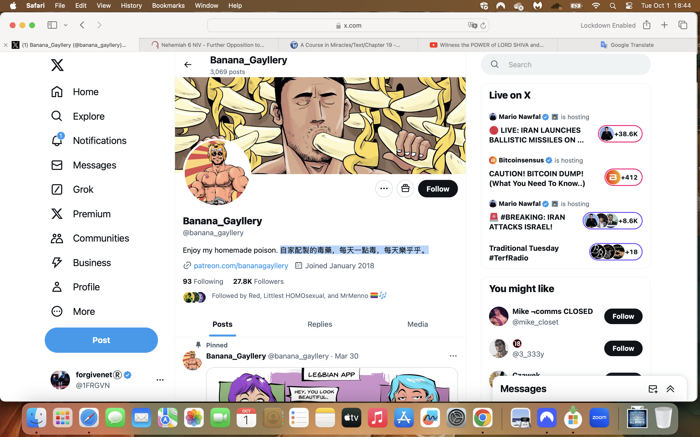

- The profile message says: "Enjoy my homemade poison...".
- I translate the rest of it.

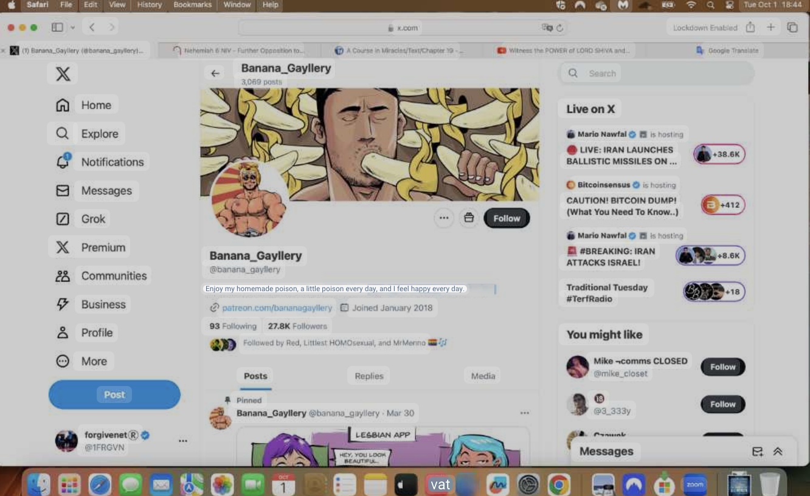
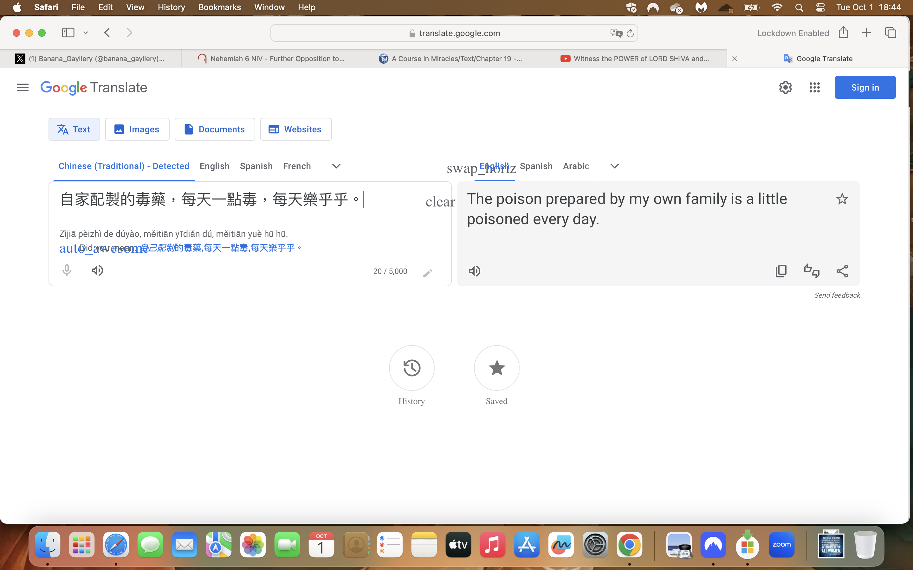

- *The poison prepared by my own family*, to me, points to the Lopez-Canos, including Carmen Cano who will pass me when leaving my apartment building at the end of this month, and smile at me.
- Over the month I see numerous messages about my strength; *you're really strong*, I read regularly. 
- Towards the end of the month, these messages become even more frequent.
- This is when I'm back from [Fátima](#fatima-20-26th-october) and the poison I'm ingesting is worse, and they have also doused all my belongings in pesticides. 
- I'm certain the intention is murder.
- At the time, I'm so high it's difficult to think straight about anything, but I do wonder how other porn-gang targets have fared over the decades if the gangs consider me a strong person.

### Is there a bible in the house?

- I see constant X posts asking whether there is a "bible in the house".
- Incidentally, I had bought a bible during at Lourdes and was reading it regularly. 
- You can see some of my screenshot tabs have the chapter details I was looking at; my bible was in Spanish so I needed to translate everything.
- The constant posts make me think someone is warning me that the gangs intend to murder me; i.e. a bible in the house for the priest to perform the last rights.
- These posts were in English and Spanish sometimes too.

### Porn-gangs in schools

- I fight back, as usual.

[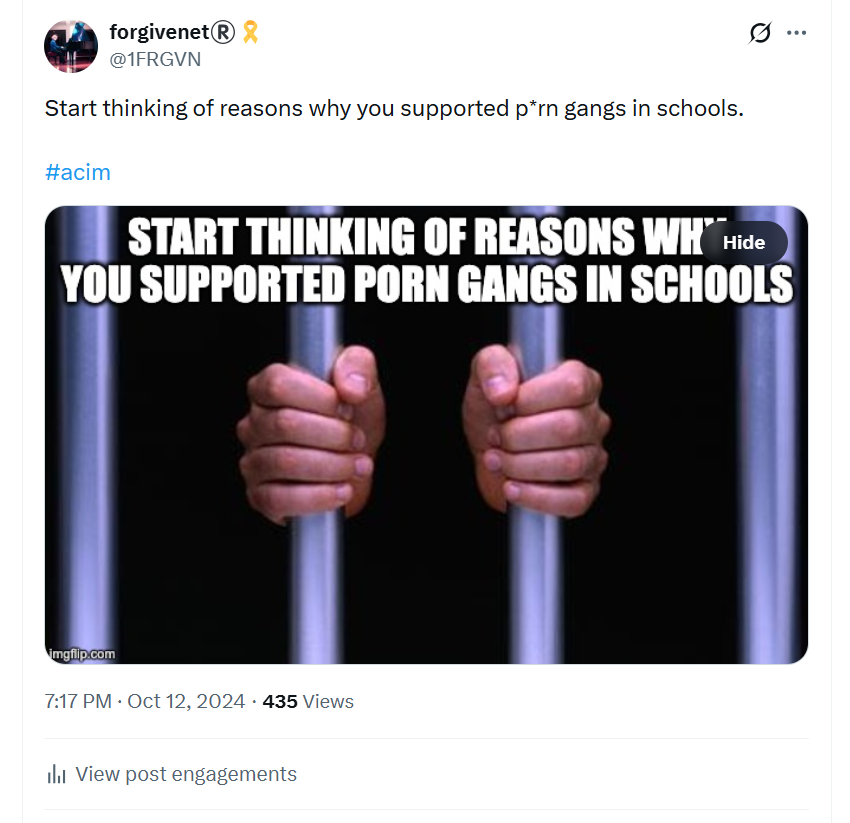](https://x.com/1FRGVN/status/1845076405328937129)

## Bullying ramps up at Polygon

- The oppression at Polygon is now fever-pitched and panicky.
- They are very obviously building up to firing me.
- Rather like [refusing to stop my piano studies at the conservatory in June 2023](../2023/june.md#monday-19th-june), I have no reason to leave the job I love and am very good at (brain-damage from years of poisoning notwithstanding).
- However, my colleagues' demeanor towards me at the [Bali offsite](may.md#bali) - which Elon may have briefly attended - solidified in my mind what had been going on since the previous November when I started my job; especially with [Nadim Kobesi](../2023/november.md#nadim-kobesi), [Hans Bodani](../2023/november.md#hans-bodani), and [the military coup on my role by the marketing teams](../2024/may.md#ajay-alicia-aman-pandey-and-mushroom-man-perform-a-military-coup-on-my-job).
- I have no idea I'm being targeted because I'm a sedated Dénia porn-gang sensation and had been starring in [switcheroo porn at the conservatory](../../crimes/protagonists/vidal-sastre.md#six-distinct-men) and live-stream spy-cam porn direct from my apartment for years.
- I had no idea.
- The only possible reason I could come up with for the constant abuse at work were my political views on trans ideology and women's rights.
- Gabriel Silva meets me and I ask him what he's going to do about [Hans's and Anthony's outrageous insubordination](june.md#polygon).
- Gabriel explains he's starting afresh, he's going to forget about the past and move forward.
- It sounds reasonable.
- He then takes away all my work and gives it to Hans and Anthony.
- At a later meeting, I ask Gabriel about his experience with Hans. He says: *oh, he doesn't seem to be doing any work*.
- I wonder if that was the deal with Hans; no work, just a tax-free life in Dubai for significant abuse of the *female-tech-colleague-you-despise* after the [Bali offsite](may.md#bali)... so I'd leave.
- Could they be that messed up?
- Gabriel then ramps up the bullying even more; for example, he tells me he's getting another colleague, Mitch Eger from marketing, to write technical docs for us (my job again, a job which Mitch is not skilled in).
- Mitch, then, repeats verbatim how I have always described the software technical author role, as if he's reading a script taken from a recording of me (hacked Zoom meetings?).
- The most aggressive part of this is that whenever I said those things to Gabriel, he always told me I was wrong and had another immature idea which was better than mine; silencing.
- Gabriel then sets me up to fail again; specifically by giving Anthony tasks he was unskilled for, ensuring he will make a lot of mistakes in a busy sprint cycle with the CDK team.
- Anthony has stopped talking to me as if I'm a normal person whenever I try to help and advise him.
- I see the tripwire and step over it.
- However, I can see Gabriel is very confident with his plans, and Anthony's dismissive communication style says to me: *you're not going to be here in a few weeks anyway, I don't even have to talk to you politely*.
- I have no other choice but to make an official complaint about victimization to save my job.
- I contact Alyssa from HR on Slack and tell her I'm being victimized for my political views and it has been going on since I started.
- I tell her I won't give her a full and complete description of everything that's happened until I understand the company process.
- I request a non-biased mediator also.
- I do tell Alyssa about the [Pakistani Yorkshireman who made sexually violent threats to me at dinner in Bali](may.md#the-pakistani-yorkshire-man) and that I had informed Miriam from Spanish HR about it the following morning.
- I also do tell Alyssa that I'm being viciously stalked and hacked in Dénia by criminal gangs and it has been going on throughout my tenure at Polygon (something Gabriel, Hans, Anthony, Vincent, and numerous others are aware of because I told them).
- At this stage, I'm unaware the two situations are intertwined.
- Rebecca Rettig, Head of Legal, reaches out on Slack - the date on the screenshot is probably a week later, when I started screen-shotting everything.

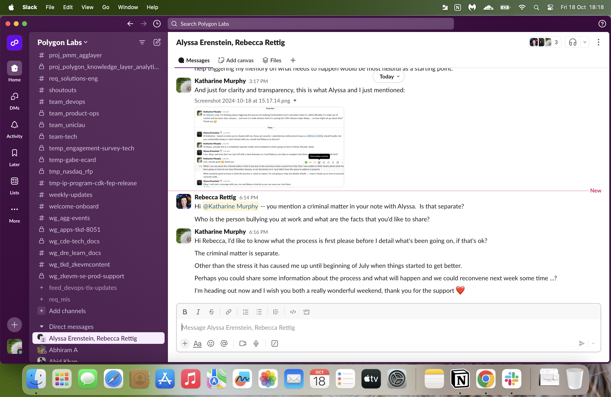
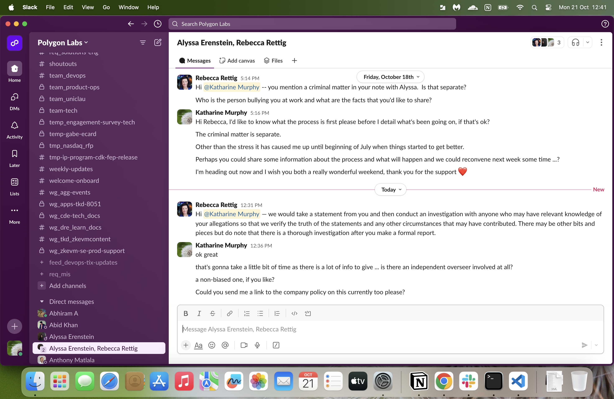

- I wait some time for a process document which the company doesn't seem to have.
- While this is going on, the HR team has a company-wide meeting in which they mention my experience as a *female-tech-colleague-you-despise* in an underhand way.
- James Dawes (ex-colleague of [Hans Bodani](../2023/november.md#polygon) at Mantle) leads the meeting and alludes to something exciting coming up.
- He starts to mention the word [Fetch](../early-years/interim.md#fetchai) over and over for no particular reason.
- "Remember", Alyssa says laughing later on, "Remember the word Fetch!".
- Fetch is a direct reference to the company in Cambridge UK, Fetch.AI, [where a man flashed his crotch at me in an online meeting](../early-years/interim.md#fetchai) a week after I started.
- When I meet Alyssa again, I tell her about my experience at Fetch without mentioning the company name.
- At our next team meeting, Gabriel Silva makes sure to mention we *must* all watch this meeting if we haven't already, especially me.
- Polygon then hires a [man who targeted me at zkSync](../2023/june.md#work-stress) in April 2023 while the [switcheroo porn at the conservatory](../../crimes/protagonists/vidal-sastre.md#six-distinct-men) was in full swing, Coogan.
- Alyssa tells me Rebecca Rettig wants to talk to me about what's been going on and I agree to talk to her when I understand the process fully.
- We never speak. 
- They fire me first.

!!! tip "Give her a reason to be stressed..."
    - We know that sedated rape makes women depressed and anxious without knowing why.
    - Professional sedating rape-gangs making money on this lucrative genre, therefore, must give women a *reason* to be stressed to avoid suspicion.
    - This explains the outrageous behavior of teachers and staff at the conservatory towards me.
    - It also explains the presence of Nadim, Hans, and the bullying events at Polygon, most especially [the engineer who looked like Jitendra Das making sexually violent threats towards me](../2024/may.md#the-pakistani-yorkshire-man) at dinner in Bali.
    - I assume Spanish gitano misogynist terrorists have known for centuries that a *hysterical*, stressed, depressed, and anxious woman is never believed.

### Criminal investigation data blocked by Google admins

- For this section, I had saved countless Slack screenshots between myself, Polygon HR, Gabriel Silva, Rebecca Rettig, all the conversations on Slack between [myself and Gordon Bishop](march/1-12.md#reporting-hacking-to-polygon-labs) when I reported hacking to Polygon security teams in March, and more.
- Because I was so high all the time (not realizing it), and couldn't focus enough to remember or remind myself about actions I had taken on previous days; I took duplicates, triplicates.. I saved hundreds of Slack screenshots.
- I did this because, at some level, I was aware that my mind was not functioning properly. 
- I wasn't looking forward to collating them there were so many, so I saved them.
- In Bangkok in November 2025, staying near Lupini Park beside the American embassy, I laboriously backed up everything I had onto all my Google drives.
- I had backups in three different places; giant, humongous backups.
- And all the originals I had mailed to myself in my katharinejc Google account.
- Arriving back in London in January 2026, I'm denied access to this Google account and there is no reason for it.
- I'm not asked for a screen-lock, and they don't offer the recovery email option, to gain access as normal.
- I raise [an issue on the Google community help pages](https://support.google.com/accounts/thread/403846478/hacked-laptop-home-router-blocking-account-recovery), but it drifts into silence.

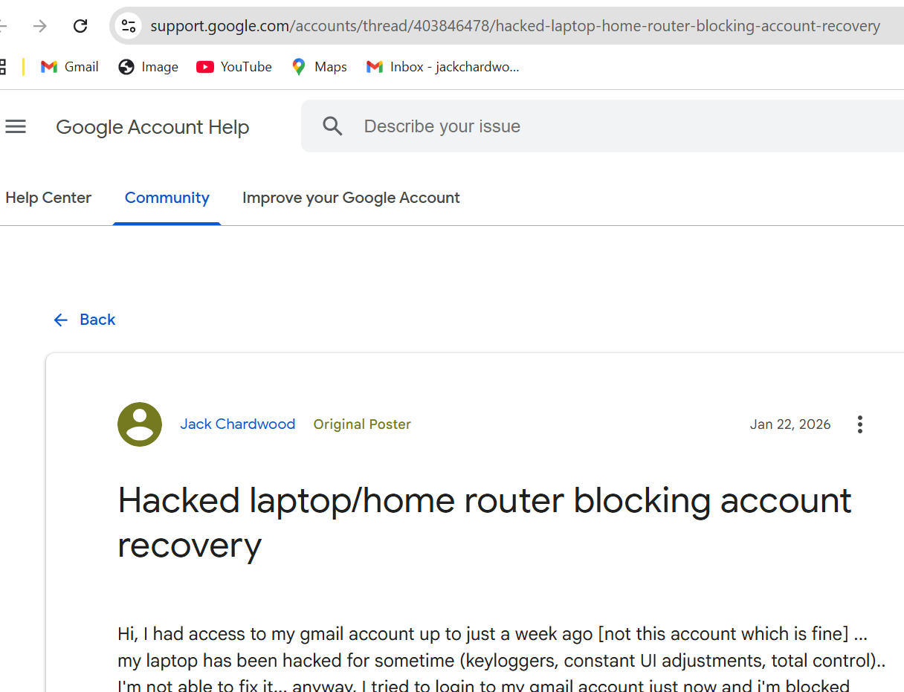

- Today, I go to find my Slack screenshot back ups from October 2024 for writing this section.
- There are none!
- All Google drive information pertaining to this police statement on my other two Google accounts - apart from the larger files I have been linking out to since I started writing - has been deleted.
- It's as if I didn't spend three whole days laboriously backing up multiple gigabytes of data to my Google drives online in Bangkok.
- This sinister activity on my Google accounts happened the moment I arrived back in North London, and I do not think this is by accident.
- I expect there's other backups.

### Recruitment agents contact me

- During this time, I'm contacted by a few different recruitment agents about potential roles; Joel Barden at Hype is one of those recruiters reaching out.
- Does he know I'm about to be fired?

## Activity in the nextdoor apartment, number 18

- The next door apartment at Carrer Furs is barely used. 
- I heard people in there maybe twice, for no more than a week, in nearly three years.
- There may have been people there for the summer holidays, while I was away, so I never thought it odd because that's quite normal in the area.
- Whenever my neighbor at number 16, Marie Carmen, or Pedro the caretaker, referred to the people at number 18, it was always in a derogatory way, with a turned up nose, as if there was something not good about them.
- They told me they were never there.
- However, from the moment I arrive back in Dénia at the end of September 2024, and throughout October, there is constant activity in this apartment.
- People coming and going at all times. 
- People talking loudly day and night.
- It got so unusual that, whenever there was activity outside my front door, I would look to see what was going on.
- I saw a skinny woman with shortish dark curly hair, of about 60 years old, going in and out nearly every day.
- She was always doing something at the water cupboard.

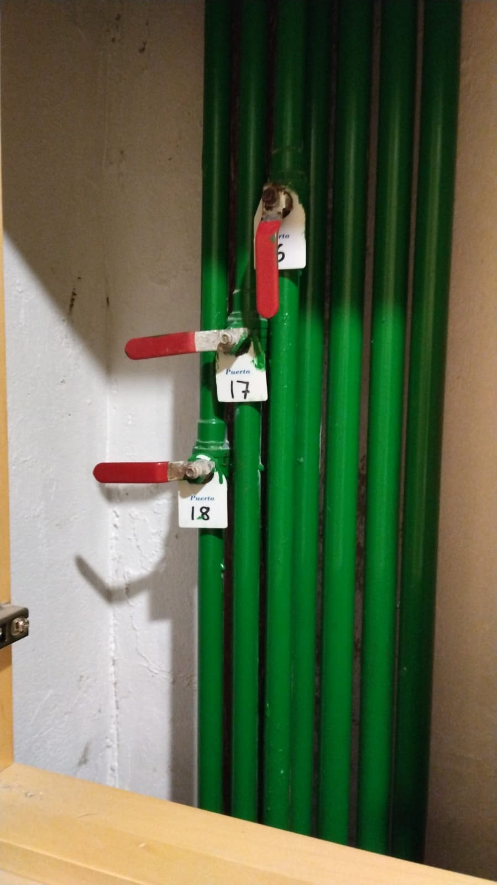

- The woman had a husky smoker's voice that sounded like a slow-motion machine gun.
- One night, I hear her say in Spanish - from behind the wall while I'm in bed - "and nothing was ever good enough for her", and I presumed she was referring to me; a gang-stalker's psychological wounding tactic. 
- I guess that this is the main lie the non-porn-watching people of Dénia (very few I imagine) were told about me, and why they all support the gang stalkers and join in if they're so inclined, or bored. 
- I'm *the uppity foreigner who thought nothing was good enough in Dénia*, which is as far from the truth as possible.
- They only needed a couple of people who I had contentious interactions with over the years to support that. 
- One of those was likely my neighbor from Cami Llavador 5, Charo, who really didn't like me at all (she was a weird woman).
- Another could be a woman Magpie I had been friends with years ago in 2008.
- She was married to the drummer from Wings, Geoff Britton.
- I may have seen them both - been introduced again in 2022 - on a trip with the British walkers, another unusual event that seemed a bit staged. 
- I hope my "friends" weren't demonstrating my brain-damage to them...
- Magpie got extremely angry with me one afternoon after I said something rather innocuous yet truthful to her, something she found extremely hurtful.
- It wasn't intended to be hurtful, at all.
- I guess manipulating a whole small town to hate someone can be really easy.

### Cigarette smoke the first week I move in

- Incidentally, in the first weeks I moved into Carrer Furs in December 2021 I could smell cigarette smoke in my bedroom.
- I assumed it was Marie Carmen next door, who smoked like a chimney, but it was confusing because my bedroom was the room furthest away from her apartment.
- My bedroom wall, and bed, backed onto apartment number 18.
- Not only that, but I could smell the cigarette smoke even with the bedroom door shut.
- I assumed it was coming through the air-conditioning vents and so I blocked up the vent beside my bed with plastic, at which point the smell stopped.
- Furthermore, while wondering about this, I opened the vent to see what was going on behind it, to see if there could be an outlet into the next door apartment.
- I put my phone inside and filmed what was behind the vent.
- It looked like completely unfinished brickwork. 
- There was no smooth air ventilation system, it was just rough broken and damaged brickwork.
- Not only that, but the brick tunnel moved towards the outside wall - away from the air-conditioning system which was on the other side of my bedroom in the bathroom and up onto the roof on the opposite side of the building to where this tunnel was heading.
- And even more concerning, was that, the tunnelling which looked like someone had gone through with a workman's drill and never finished up the job, had an inlet to the right, which was right into the neighbor's apartment at number 18.
- At the time I didn't really know what I was looking at.
- Now, not only do I think the sedation mechanism was probably coming from number 18 through that particular vent which was right beside my bed, I also believe the cigarette smoke at the beginning of my stay was intentional; the way they tell you what they're going to do before they do it (I've demonstrated a lot of that already).
- Is that their weird way of alleviating personal guilt and divine retribution for their evil - we know how devout the gypsies are?
- Or is it just plain evil?

### The housing register

- Just before I escape the poisoned apartment and attempted murder at the end of the month, I have the presence of mind to request the owner's details from [the public register](#nota-simple-from-the-neighbors-flats).
- The property owner is: MANUEL BALLESTEROS LOPEZ; sharing the name of Concha the guitar teacher who [I wrote to asking for help in the beginning when I had no idea what was going on](../2023/july.md#first-letter-to-concha).
- She was bullied relentlessly by Domingo Cano Lopez and his students.
- LOPEZ is of course one of Domingo's surnames.
- I can't imagine in a tiny town like Dénia these people wouldn't be somehow related.
- Of course, I was so badly hacked by Spanish criminal gangs that have the whole area's internet ring-fenced for their sinister purposes, they could have easily rewritten this document to suit themselves before sending it.

## Iceland shopping

- I pop over to Iceland in Benissa to get some British products.
- I'm wearing my face mask.
- I wear it every time I leave the house now.
- At the time of editing this section - January 2026 - I'm not sure if I thought I was *only* being drugged and poisoned when I left my home, and that's why I wore the mask.
- As I mentioned, the drug/poison dose in October 2024 was the highest it had ever been and I was even hallucinating.
- For this reason, and due to my eyesight problems, I wondered if I was ingesting methanol somehow without my knowledge.
- Anyway.
- I'm served at the till by a nice-looking, blond, British woman who is smiling and grinning at me like I'm an idiot.
- She knows who I am.
- When I get home, on X, I see a fake account with a profile pic of the same woman.
- It is morning and she is sitting on an apartment's balcony wall somewhere in the Marina Alta region with a view of the pines and mountains.
- She is wearing a man's shirt, and nothing else.
- It's yet another *after-sex* photo.
- I saw so many of them, hundreds, many with underage girls.
- I don't know why, but I get the feeling the man behind the camera is [trumpet teacher number three](../../crimes/protagonists/vidal-sastre.md#a-man-called-bruno-with-at-least-one-son-called-bruno).
- I know I said I was perma-high and hallucinating over this period, but a great deal of this is verifiable, which is nice.

## Saturday 5th October

- I go for a walk along Las Rotas.
- I take my analog phone so that I'm not tracked and followed and I can still call the police if necessary.
- I'm tracked and followed.
- Just before I reach the restaurant Sendra, Carmen Lopez Cano passes me on a bicycle.
- She u-turns abruptly and stops to stare at me, grins and cycles off the way she came.
- I know it's her because she looks like her brother Domingo.
- I thought I had her on film; although she may have stayed just out of shot knowing I was wearing my hiker's camera.
- What you can notice is that, after seeing her, I become nervous and start singing a little to self-sooth.
- I tweet about this meeting later on, and it is translated a lot.

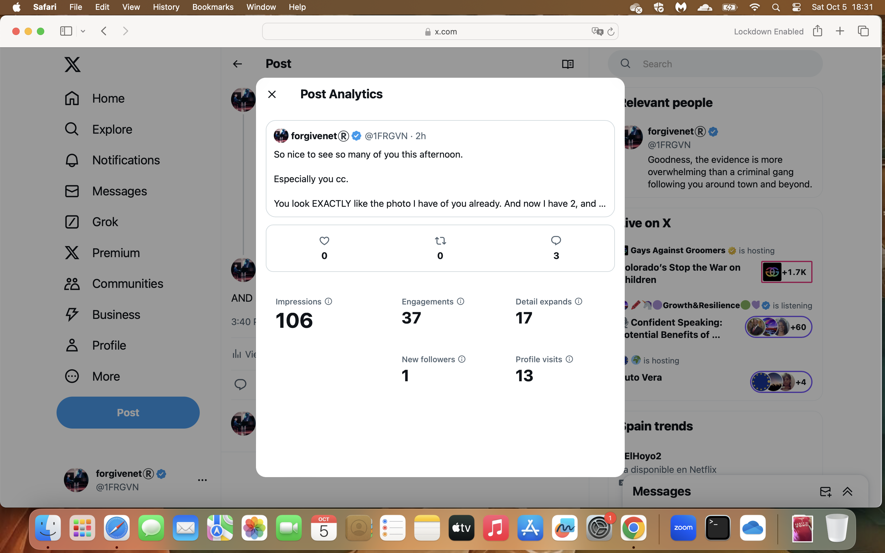

- After seeing Carmen a few times this month - she makes no effort to hide herself - I realize with horror that the woman who had turned up to listen to the [chamber music concert in May 2023](../2023/may.md#chamber-music-concert), pretending to be Pablo's mum, the only parent that showed up along with at least two of the [switcheroo-porn trumpet-teacher team](../../crimes/protagonists/vidal-sastre.md#six-distinct-men) pretending to be the same one man, Vidal Sastre Sanchez Hornero, was her too!

!!! tip "The video files"
    - You'll have to wait for access to these because I don't have a good option for content delivery of multiple large files at the current homeless-and-jobless time.

## Possum man on the beach

- I go for a walk along the Las Marinas beach in the afternoon of the 6th October; my regular Sunday walk.
- I am followed by older men the whole way along; men in their 50s and 60s.
- Everything is yellow; I'm hallucinating, hard.
- I feel menace all around.
- I see a man that I recognize from [Natalia's posts on Facebook](https://www.facebook.com/natideprati); the older man that we often see skippering the boat.
- Is he the same man that trolls me on X pretending to be the trumpet teacher; a sailor or someone connected to the sea?
- Or is he [Rodrigo who does Vipasana meditation](../2023/december.md#a-mutual-friend)? He looks a lot like him.
- Or is he Ivan's main alibi (switcheroo)?
- I also see a short brown man with curly black hair and a protuberous nose. 
- He's in his 50s but he looks like the adult version of the boy that always shows up in first place on my Google searches.

- I'm wearing my hiking camera.
- I have these two men, and lingering others, on film.
- I can only sit for about 5 minutes before I feel so threatened I decide to leave and go home.
- On the way back along the beach towards home, a couple falls in about two metres in front of me.
- We're walking in step.
- The woman on the left is someone I've seen on a Twitter fake account - I had a screenshot of this prior to losing access to my machine on 1st December 2024 in Bangkok.
- She has a masculine body and I wondered if she was, in fact, a man.
- She has the same tattoo as the [innocent lady groomed into porn](august.md#grooming-an-innocent-girl-into-porn-101) on her arm.
- She's making sure I see it.

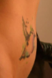

- The man on her right smiles at her, and I see his face. 
- His teeth, in profile, make him look like a possum.
- You may remember, inexplicably, [I have been seeing *possums* on my X feed](../2023/may.md#possums) since at least May 2023 when [the switcheroo porn](../../crimes/protagonists/vidal-sastre.md#six-distinct-men) was in production at the conservatory.
- There was a flurry of possums on my X feed for a few days after seeing him, and probably until I left for Madrid to talk to [the Spanish official, Paloma](#meeting-inma-and-paloma-the-spanish-official-in-madrid).

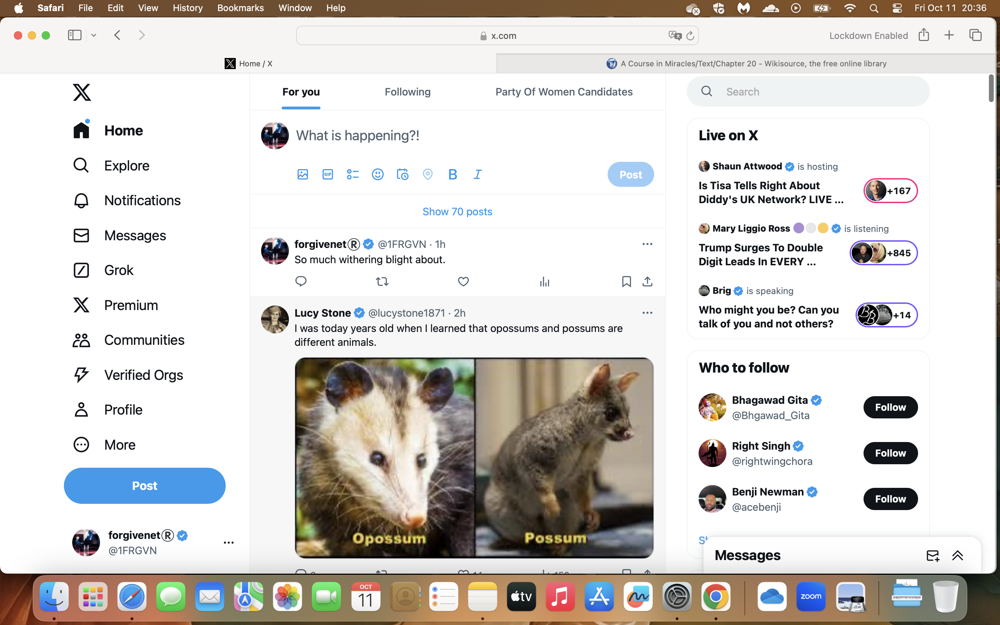 

- I have these two on camera also.
- I never go to the beach again.
- I have not seen possums on my feed since October 2024.
- At the laundry that evening drying my clothes, the lovely man there asks, without requiring an answer: "¿Todo claro?". 
- I hear it as: "Is everything clear now?", as if my experience at the beach has explained my situation somehow.
- I mention this in [another section about the laundry](../2023/november.md#the-laundry), scene of many drugged-manipulation and stalker events. I wonder if Sunday, like Monday, was always a *special day* back at mine.
- There was always something happening at [the laundry](#threats-and-a-woman-at-the-laundry); particularly this month.
- Back home that night, a fake account tells me possum man is the boss - the account uses the word Caesar - and that he is looking for developers. 
- I see [car lady](september.md#another-upsetting-targeted-woman) again with the account name Gutmann Cesar suggesting that he is a good man.

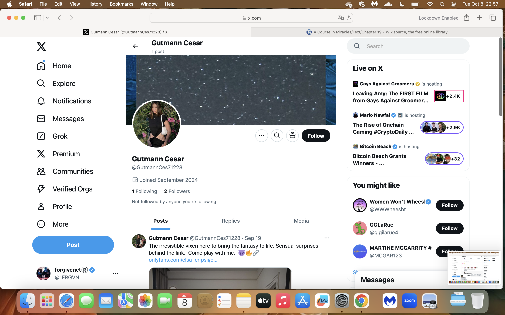 
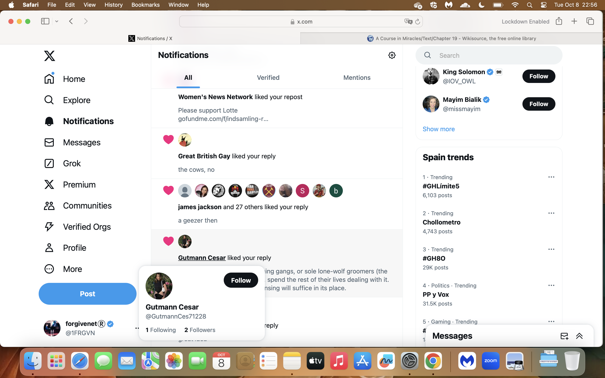 

- The inference is I'm now being [offered a job in tech](#job-offer-declining-and-murder-threat) by the criminal-gang's boss!
- I do not know what any of this means.
- Is it more tricks to scare me? 
- Is it a way of explaining away everything that's been going on onto a foreign criminal?
- Does possum man run the criminal porn networks I've been starring in?
- Was the deal from back in May 2023 for him to take ownership of the most recent sedated-sex-slave of Dénia once I was drugged and poisoned beyond all and any autonomy?

!!! tip "The video files"
    - You'll have to wait for access to these because I don't have a good option for content delivery of multiple large files at the current homeless-and-jobless time.

## Job offer, declining, and murder threat

- The account that talks the most about this *Cesar*, and other threatening things, is `@csonnyb`. 
- The account follows me at very the moment I go online after arriving home from my walk.

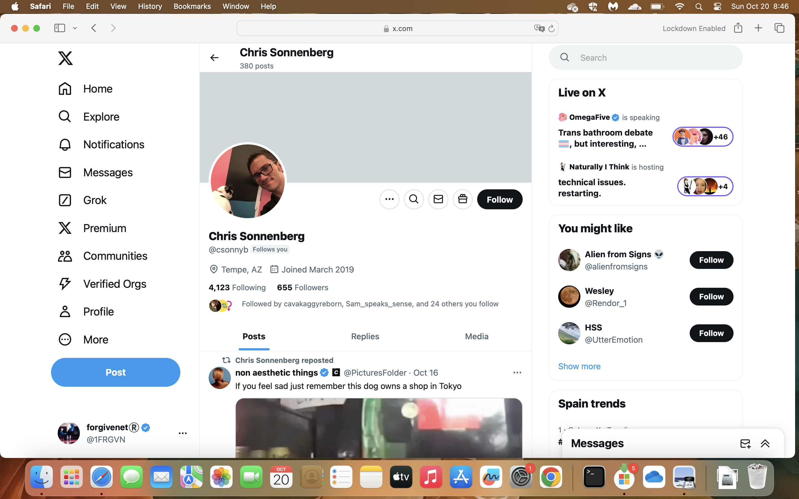

- There is a lot of conversation between myself and this account but it's mostly rubbish, although he references Domingo and gay men a lot, and music teachers, and he tries to convince me he's the trumpet teacher and he wants to help me.
- I don't have those conversations screenshot but I did contact him again when I arrived in Fatima and was *bombarded* with online attacks thinking it was probably him again.

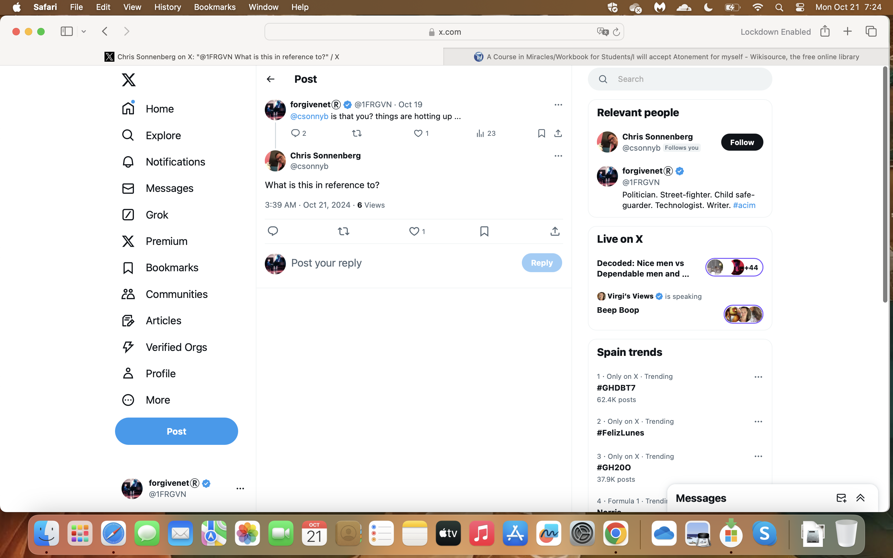 
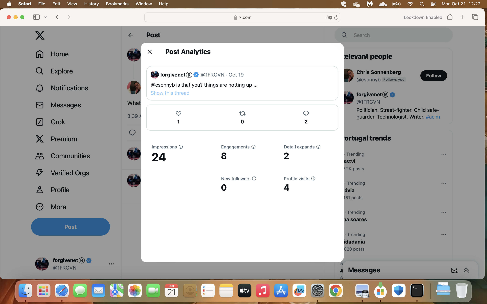 

- The fake account tells me it's better for everyone if I work for possum man.
- I'm not impressed.
- Another account pops up which is apparently the boss and his girlfriend, but they look familiar enough to me to be famous actors; a red herring with a seafaring theme nonetheless.

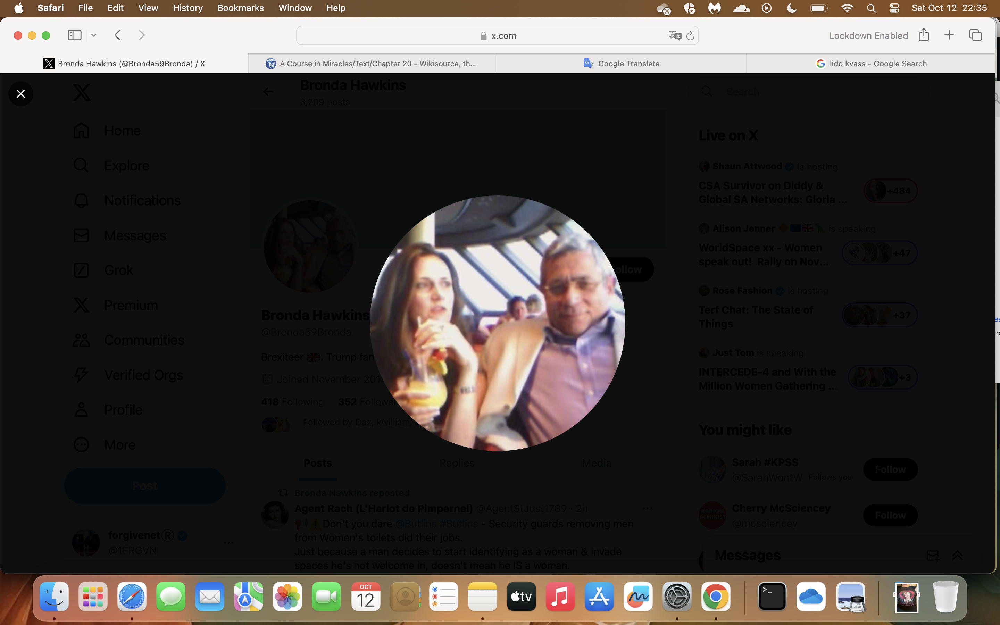 

- The following day, I'm contacted on LinkedIn by a recruiter working for a yachting company based in Altea.
- They're offering me a job as a tech QA. 
- I'm certain it's a scam.
- I decline.
- Moments later, this account pops up.

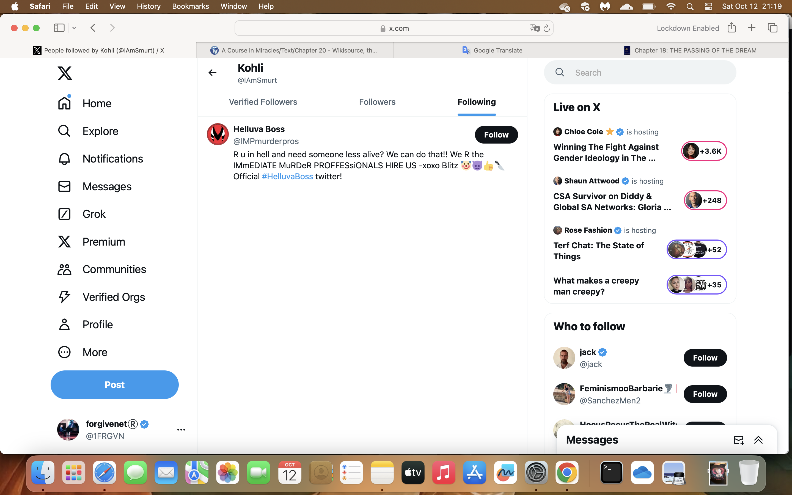

- LinkedIn bans me for life in a few week's time - right after I survive another attempt on my life by poisoning - and by doing so hides the evidence of mass porn-gang stalker activity related to my professional life and the jobs I worked while being hacked, drugged, and living in a spy-cam infested apartment.

## Bumping into Paul again

- Later on Sunday 6th October, on my way to the Indian restaurant, I bump into Paul Matthews.
- He is having a beer at the Open 24 Market at Plaza Benidorm, the usual place they tell him to go when they know I'm on my way so I "bump" into him.
- He's been asked to check up on me, yet again.
- Sometimes when I've *bumped into him here* he has been extremely nervous, even chain smoking.
- I didn't know he smoked.
- At least [he's stopped blushing](../2023/october.md#paul-and-alessandra).
- Anyway, he's calm and quiet this evening, although a lot remains unsaid.
- We chat for a bit. 
- He wants to know what I'm up to.
- Am I staying in Dénia? 
- The main question.
- Have they a new target lined up and ready to rent Bea's spy-cam-ridden apartment?
- I tell him I'm thinking about running women's rights activities in Dénia for the following year.
- He sort of mini-rolls his eyes and changes the subject.
- The last time I spoke to him, in exactly the same spot sometime in July, I mentioned that I was offering 500 euros for copies of any films from my hacked devices and the child rape p*rn from 1989.
- I made that offer to Paul Matthews, to UK Paul, and to the caretaker at Carrer Furs Pedro, and I also told the UK rape-gang inquiry lawyer and everyone reading my social media posts.
- No-one mentions it again.
- He had mentioned at that time, however, an English man he knew being very popular with everyone; all the girls coming up to him and saying hello as if they knew him.
- I wasn't sure how this related to what I'd just said.
- Was he pointing out to me a male British ex-pat that had been spy-cammed like I had, for sexploitation maybe?
- I mentioned Halloween was coming up and asked him did he think we should go out again [like the year before](../2023/october.md#halloween).
- He didn't answer.
- I said I would WhatsApp Alex about it.
- I did. She didn't reply.
- On Halloween I text the following:

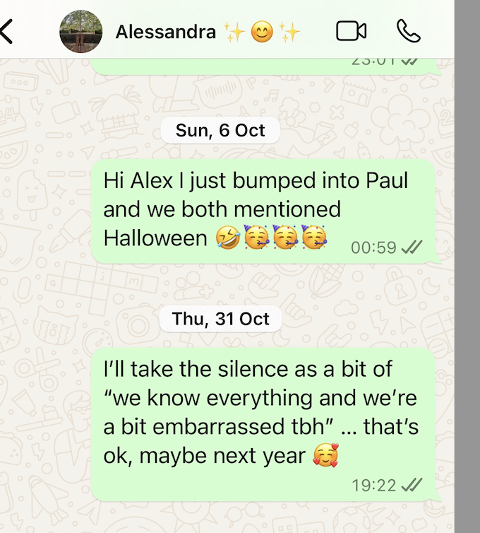

- There's no reply.
- Everyone in Dénia knows what's been happening, at some dubious level.

## Las Rotas on 9th October

- My first women's rights activity in Dénia - I mentioned it to [Paul the previous Sunday when I bumped into him](#bumping-into-paul-again) - is a walk along Las Rotas to stand up for the children being destroyed by trans ideology.
- I advertise it online.
- No-one turns up.
- I wear my mask and camera, as usual, and tweet about it later on.

[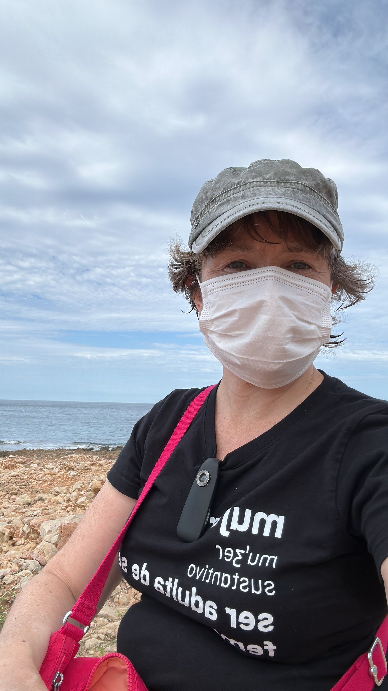](https://x.com/1FRGVN/status/1844468797044052150/photo/1 )

- There is significant online activity regarding this walk that appears to be coming from Trish Penny (from her suggestive emails, and in the screenshots I have somewhere in the thousands we've yet to collate).
- Trish or whoever (via the `@january_myth` account) informs me the twin trumpet-teacher brothers can't make the walk because they don't want to be photographed.
- This is where I was at with my manipulated and very faulty understanding of everything that had happened to me by October 2024.
- In my perma-spiked-high perception, there was still only one trumpet teacher I loved, but he had a twin brother that [I'd seen in the street](../2023/december.md#the-trumpet-teacher-has-a-brother).
- This faulty understanding is further reinforced by [the angel picture](../2001-to-2010/2001.md#memories-of-the-past-triggered-on-x) soon to be posted on X, which will remind me of [something even more startling and related](../2001-to-2010/2001.md#amsterdam).
- After I pass the Mena restaurant, I see a family out walking with a young person (clearly part of the trans cult) who looks very unwell.
- I wonder if they've been taking puberty blockers, and it looks like they may have even had top surgery.
- They all look very sad.
- I believe I tweet about this too but can't be bothered to look just now.

!!! tip "The video files"
    - You'll have to wait for access to these because I don't have a good option for content delivery of multiple large files at the current homeless-and-jobless time.

## Threats and a woman at the laundry

- Whenever I go to the La Colada laundry, there is always some stalker activity.
- This has been true since they started the trumpet-teacher scam back in December 2022, or before.
- I always go to dry my clothes as they do not dry on my balcony.
- Spy-cams in my apartment will show me collecting my laundry ready for drying and leaving it at the door.
- The cams will then reveal when I leave my house for the laundry, carrying the laundry bag.
- Stalkers then have five minutes to get ready and into place.
- I mention the laundry activity in more detail in the [November 2023 section](../2023/november.md#the-laundry).
- I also mention [the strange thing the manager said to me](#possum-man-on-the-beach) right after the extraordinary event with possum-man and the woman with the same tattoo as [the innocent girl groomed into porn](august.md#grooming-an-innocent-girl-into-porn-101).
- On two occasions in October, threatening young men are in the laundry while I'm there. 
- The first time, a small group of young men have just come in and are speaking about 4 or 5 different languages. I assume that means they're Roma and they've been sent to keep an eye on me.
- The second time, a group of young Spanish men stare at me menacingly.
- I stare right on back.

### The woman

- The same afternoon as the staring competition, I see a woman chatting with the lovely man there who manages the laundry.
- I know her, but I cannot think how.
- She looks at me, our eyes meet.
- I smile. She doesn't.
- I have no idea how I know her, but I do.
- She has thick lensed glasses, like Domingo and his dad.
- I now wonder if she is a member of the Hospitalite de Lourdes, and does service at the baths, like myself.
- Could that be where I know her from?
- Did I work with her one session in one of the baths sometime between 2014-2018?

## The sedated rape-porn gangs of Spain

- I tweet my suspicions about what is going on.
- I'm getting steadily closer to the truth but I remain confused while I still believe [there's only one trumpet teacher](../../crimes/protagonists/vidal-sastre.md#vidal-sastre-sanchez-hornero).
- I'm also not aware yet that sedating happens *after* you have gone to bed, and this is why they could attack me in the afternoons because I always took a nap.

[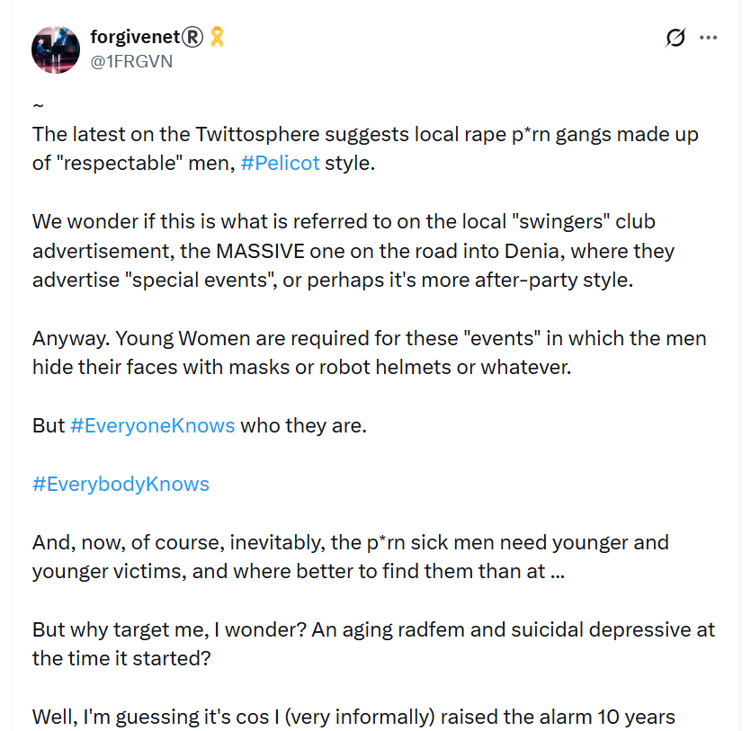](https://x.com/1FRGVN/status/1845101018746343666)

- Nearly half my readers are translating.

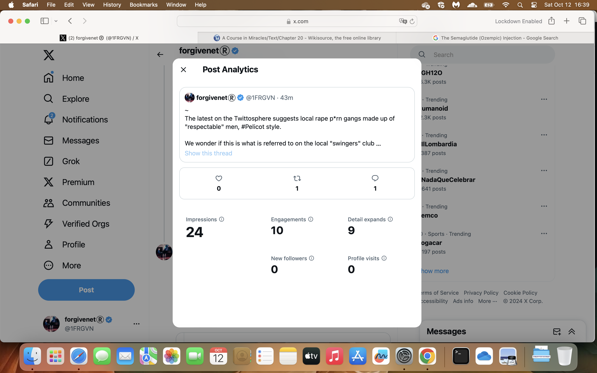 

??? "My understanding of what's going on: 12th October 2024"
    ~
    The latest on the Twittosphere suggests local rape p*rn gangs made up of "respectable" men, #Pelicot style.

    We wonder if this is what is referred to on the local "swingers" club advertisement, the MASSIVE one on the road into Denia, where they advertise "special events", or perhaps it's more after-party style.

    Anyway. Young Women are required for these "events" in which the men hide their faces with masks or robot helmets or whatever.

    But EveryoneKnows who they are. 

    EverybodyKnows 

    And, now, of course, inevitably, the p*rn sick men need younger and younger victims, and where better to find them than at ... 

    But why target me, I wonder? An aging radfem and suicidal depressive at the time it started?

    Well, I'm guessing it's cos I (very informally) raised the alarm 10 years ago, and moreover the gang have made it very clear to me they have old gang r*pe child p*rn with me in it from 1989, so perhaps that makes for great marketing and drumming up interest in a repeat session so more sick men can make more money out of my suffering. Seems reasonable given how insane they are.

    And I guess that was the intention for me, and why he was meeting me at Alicante airport on Sunday 18th June off my flight from Dublin, travel information he could NEVER HAVE HAD if they weren't accessing all my online activity. My special event.

    And I guess that was why the acupuncturist gave me a needle, to warn me.

    And yet, here I am still.

    So why would the whole town support such sick and murderous intentions?

    Well, that seems to me to be because one of the p*rn sick gang members may have been unable to pay a debt of some sort and his daughter was/and continues to be most likely (cos they never mean what they say) threatened with sexual grooming and the inevitable results.

    And so the whole town rallied round to save a child which will likely not be saved, unless something big changes.

    So that's where I'm at currently in my investigation.

### *We take what we want*, they say, *we're hunters*, they say

- An aggressive message flies by "we take what we want", and the arrogant statement "we're hunters" flies by continuously.
- The implication is that the older men [I saw on the beach](#possum-man-on-the-beach) do whatever they like to women and children in the town, and they're proud of it too.
- Except, it turns out, they have to drug and sedate us first.
- [So, aka Janet, my election volunteer](../2024/june.md#so-janet), posts a random line on X; "Hunters".
- I’m starting to wonder even more about So, but I let her speak.
- Her behavior always benefitted those that want to silence me, whoever they may be.
- She says I must come and stay at her house in London. 
- She posts curious photos of rooms in her home that have a grainy brown/yellow hue and look exactly like the twee indoor scenes `@january_myth` and others might post.
- Every post in our conversation is translated multiple times.

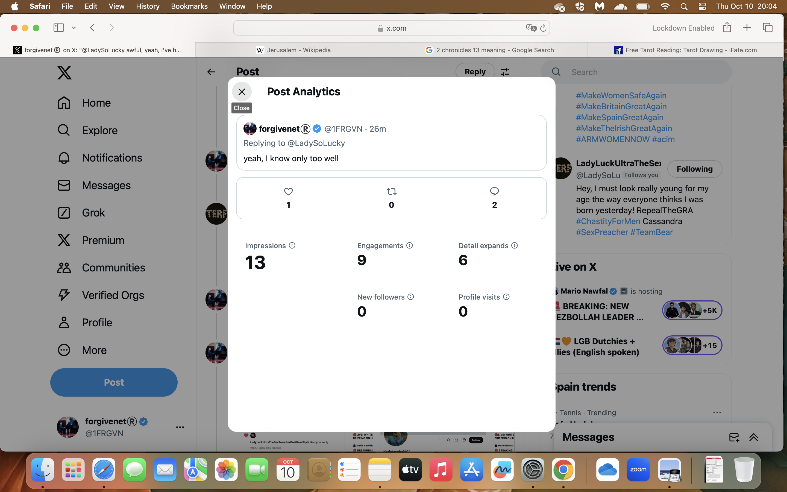 

- Just moments after posting.

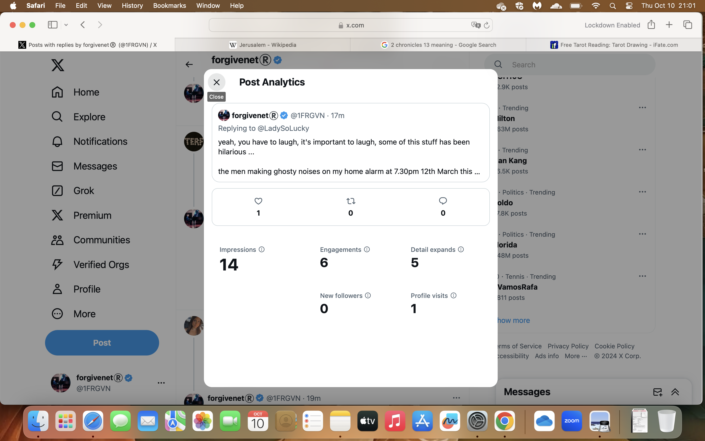

- I'm finally starting to see what's going on but it's difficult to think straight with the constant drugging and poisoning.
- Does `@LadySoLucky` [know Ugly too](august.md#ugly)?
- Nearly every male I've ever known seems to know Ugly.

### Porn star outside my house

- I come home from a quick trip to the shop.
- On the bench outside my apartment building, an outrageously-dressed woman is sitting.
- She looks like she's about to do porn.
- At the time I thought it was extremely weird for a Tuesday afternoon in October.
- Now I wonder were they bringing people like this into my apartment while they were sedating and assaulting me to spice up the shows; audience boredom kicking in.
- Did they get a kick out of showing me who was going to be starring alongside me prior to the event?
- I now have to wonder about the [upstairs neighbor and the young woman I thought was his daughter in the lift](../2022/march.md#upstairs-neighbor-at-carrer-furs); a meeting obviously timed as they knew where I was every second.
- I guess it could have been another porn "actress" come to star with me in the [conservatory's sedated switcheroo specials](../../crimes/protagonists/vidal-sastre.md#vidal-sastre-sanchez-hornero).

### English teacher outside my house with a woman

- On another afternoon, I'm walking back to my house from the shop again.
- On the same bench, I see a man I know with a woman I recognize.
- He is one of the British casual-work English teachers that would come and work for LinguaLogic at their summer school.
- I met him in 2008 or so.
- Lorraine knew him well.
- I always found him unsavory, and something about him reminded me of Matthew Diamond.
- He seemed to be perma-seething; visually and vocally.
- Martin could have been his name.
- Anyway, there he was on the bench with this woman who reminded me a little bit of Marie Carmen, the owner of the TLC language academy who had an apartment in [Joan Fuster](../early-years/2014.md#joan-fuster); her daughter maybe.
- Neither of them acknowledged me although I was right in front of them and he knows me.
- She's holding a clipboard and he's answering her questions.
- It sounds like he's detailing a crime or some nuisance, like he's making a complaint and she's taking notes.
- It was extremely weird and appeared to be totally fake.
- I have never seen him in the vicinity of my building before.
- Did he come into my apartment after that? 
- He'll be in the LinguaLogic records and I'd recognize him in an instant.
- I'm guessing at this stage everyone in the town expected me to be dead within weeks so they were getting in quick while they could.

## Driving to Madrid on my way to Fátima

- I head to Madrid on 19th October to stay one night before traveling on to Fátima in Portugal.
- I need to be away from Dénia as much as possible for my nervous system, and Mary always helps my nervous system.

!!! warning "Why didn't you leave Dénia?"
    - If I leave, then the story gets buried, the police do not investigate, and it happens again and again, always worsening dependent on porn-addict audience boredom levels.
    - I felt a sense of obligation to the vulnerable and I was waiting for my intuition to tell me what to do.
    - More importantly, I was constantly high and terrorized so it was difficult to make sensible decisions about anything.
    - And, I was always working so hard, and the bullying at work was so excessive that I had to think about keeping my job above and beyond everything else.
    - It was never clear where I could go to either. 
    - I still don't know.
    - My family home in London is highly triggering.
    - In any case, regardless of where I was in the world - apart from Israel - the porn-gangs continued to terrorize me, drug me, and try to murder me, and they have not let up for a second to this day, and are *totally protected*, Epstein-level, except I'm only talking about a bunch of music teachers!

- Just before I leave on Saturday 19th October, I empty the bins. 
- A man in the driver's seat of a parked car by the bins is staring at me angrily. 
- His wife is embarrassed and looking down in the passenger seat. 
- How does he know I'll be at the bins so he can glare at me? 
- What's he trying to say to me?
- The two look familiar, and I think they might be part of the Dénia TV crowd I've seen online or even on [terrestrial TV back in the day](../2001-to-2010/2008.md#denia-tv).
- They also remind me of people that attended the [June 2023 piano concert](../2023/june.md#june-9th-piano-concert).
- They sat in the row in front of us.
- I remain amazed that anyone could be angry at the person they have been terrorizing relentlessly for years.
- I guess it's guilt. 
- I tweet about it and suggest that the man, if he didn't like the porn of me masturbating that everyone has seen, he should take it up with the local porn-hack technicians.

[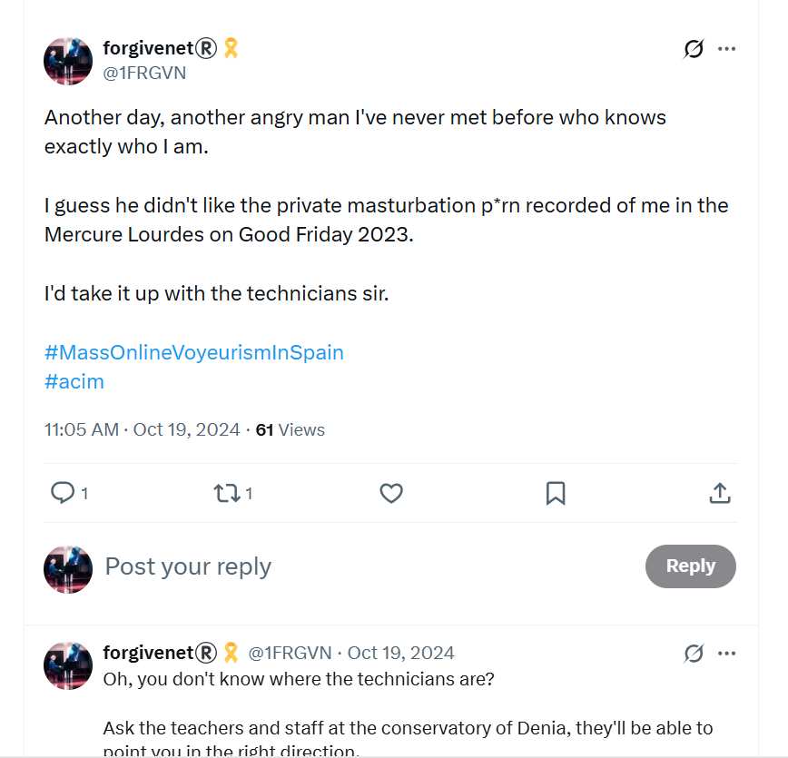](https://x.com/1FRGVN/status/1847579824128139602)

- I guess the truth was he expected me to be dead in weeks, and he was concerned about there being an unpleasant investigation, and if he was the TV Dénia guy... well, I wouldn't blame him.
- As I'm driving into Madrid at rush hour in the dark, on the fast circular roads and complicated junctions, all of a sudden, the volume disappears on Google maps so I'm completely lost on the busy M30/M40 junctions.
- When I stop, it's impossible to see how to fix this, and I try every permutation of getting the Google voice to come back.
- Nothing works.
- Later, I find out it is a deeply embedded setting you would need full admin access to control, and I didn't even know it existed.
- They're trying to cause me to have an accident and crash the car now.

## Meeting Inma and Paloma, the Spanish official, in Madrid

- After receiving [my handwritten letter](august.md#the-handwritten-letters), Inma told me she had spoken to her friend Blanca about me, and they know a woman who can help me.
- I arrange to meet Inma and her friend Blanca, and the woman who can help me, Paloma, who works for the Spanish foreign office, or similar, in London.
- We meet in the cafe of an upscale shopping centre in a posh area in the North of Madrid, close to the M30, around 1pm on Sunday 20th October.
- Paloma has flown in from London.
- I'm so grateful to Inma, Blanca, and Paloma, and I'm truly relieved that finally someone is going to help me, and the women and children in danger throughout Spain.
- Inma, Blanca, and her adopted Russian son arrive together.
- Paloma arrives a little later.
- There is a lot of talk about how secure Paloma's phone is, how it will pick up any sort of hacking interference and shutdown the whole network in the building.
- Blanca's son leaves.
- They wouldn't talk about anything serious in front of him, they made a great fuss of how good looking he is.
- The women shut me down when I mentioned being terrorized in Dénia while he was sitting with us.
- Once he's gone, we start talking.
- I tell them that everyone knows me in Dénia, and not in a good way.
- Blanca leaves about twenty minutes later. 
- As she leaves, she gives me a foul dirty look. She's disgusted with me.
- It's too incongruous to think about. I file it away.
- I try to explain to Paloma what's been going on.
- Paloma doesn't really listen to me when I speak, she talks directly to Inma.
- They both keep telling me to keep my voice down; I can't.
- I tell Paloma I'm totally hacked and every time I reset my devices, they're back in immediately, even on a completely new phone I bought with cash in Lourdes with a new UK SIM.
- She says: *Even on your new phone?*
- I answer: *Yes, they were in immediately.*
- Paloma groans.
- I tell Paloma about [Irene](august.md#irene-the-plate-lady), about [Rocio Vidal](../2023/october.md#rocio-vidal), about the hundreds of other women, about the children Domingo is responsible for.
- I have to push to be heard.
- Paloma groans at every new horror I mention, as if none of this is unfamiliar to her.
- She looks at her phone and says, *Oh, yes, Rocio Vidal was hacked*.
- I tell her about my trips to the police and how they're ignoring me.
- She tells Inma and I that the police in the whole Valencian region cannot be trusted. 
- *You can't go to the police down there, they won't help you*, she says. 
- I knew it already.
- She doesn't seem to be interested in anything I have to say, until one moment when I mention that the trumpet teacher's daughters might be kidnapped if he doesn't do what they say - and that this has been [a repeated online theme](#the-silvia-meme).
- Paloma's eyes light up.
- She says, *Oh we can do something with that*.
- I'm dismayed.
- A woman or child can go through years of torture and no-one cares, but the minute a man is in trouble, even a man involved in the torturing, everyone springs into action.
- It feels like industrial-scale woman-hating and tacitly-accepted sexual grooming of minors, and worse.
- Her words suggest thousands of ignored complaints.
- No wonder Dénia happened.
- I then tell her about Hazel and Sandra Smith, and how I have known who and what they are since 2007, about how they were at the Old Bailey for honey-trapping, poisoning, and murdering wealthy elderly people in London in the 90s and how they were found not guilty, about how they've been free to target the ex-pat elderly in the Marina Alta, about how Hazel is the accountant for hundreds of vulnerable British people, and about how [she tried to murder me by poisoning in 2007](../2001-to-2010/2007.md#hazel-smith).
- I tell Paloma that the Smiths are working with the Spanish criminals based at the conservatory.
- Inma says she remembers me mentioning something in 2007.
- I had told Inma back then that I had seen well-known British criminals in the Marina Alta, Las Marinas to be precise, without giving any details.
- I tell Paloma about the [innocent lady groomed into porn](august.md#grooming-an-innocent-girl-into-porn-101) and the [sedated woman in the car](september.md#another-upsetting-targeted-woman), and the many pictures I received that I believe are targeted women, including [a picture of one of Domingo's students](../2023/october.md#choir) Elsa.
- I tell her about the [ugly man](august.md#ugly) following me in France. I forget I had not sent Inma the supplementary page describing him for some reason.
- Paloma looks briefly at Inma, and then at me, and says my story sounds like devil worship.
- I'm even more dismayed. 
- I know what this means.
- I know she's not going to help me; she's on a fact-finding mission for her bosses.
- She does say, *It sounds like a chaos doesn't it*, to Inma, and advises I write a timeline.
- Thank you Paloma! 🙏🏼 It was a great idea.
- She tells me that with a timeline, she can help me, and maybe get Interpol involved.
- She says her sister lives in La Sella and she will talk to her to find out what's going on.
- La Sella is just a few kilometers up the road from Dénia. It’s where the [Scottish woman lives, close friends with Zoe BJ, the woman with chronic cystitis who runs a charity](../early-years/2016.md#the-scottish-woman).
- Paloma tells me that once we have the timeline, we can help [Irene](august.md#irene-the-plate-lady) and the other women and children.
- I hug her and thank her, but I don't expect to see or hear from her again.
- As I leave, I give her, written down by hand on a piece of paper, the names of [the two little girls from Madrid that Domingo teaches](../2023/september.md#my-friend-the-german-translator) and I tell her I'm extremely concerned about their safety, and the safety of their wealthy single mother who he had persuaded to buy a Steinway. 
- Over the next few weeks, I see fake accounts fly-by online with names like *dubious government official*, and similar.
- They know.

### Cullera

- Paloma advised me to leave my apartment and go to Cullera to find a new place to live.
- She said not to look for a place online, but to go into the estate agents there directly.
- Is Cullera a neighbor-poisoning paradise and spy-cam hot-spot too?
- Or is there something about Cullera that exempts it from the porn-gangs?

## Fátima 20-26th October

- I arrive in Fátima on the evening of the 20th and stay at the Mercure.
- Even though I have blocked my iPhone camera from hackers, I see photos of fake accounts of items in my hotel room. 
- I realize that only the camera facing me is blocked, not the one looking out.
- The week I'm in Fátima the online stalking is fever-pitched and relentless.
- I remain high and in retrospect I'm sure I was being topped-up with something I had brought with me from my home in Dénia.

### The router malfunctions

- On Tuesday 22nd October at around 11am, my home router in Carrer Furs malfunctions.

{width=55%}

- My home security camera is unavailable.
- I'm concerned that criminals are accessing my apartment and I text Inma about it immediately and ask her to tell Paloma.
- When I arrive back home the following week, I become unwell and it feels like I'm being poisoned.
- My duvet seems to be toxic.
- When I bring my toxic belongings back to the UK in February, I realize that while my security camera was down, they must have entered my property and doused all my belongings with pesticides or similar.
- My view is that Paloma had told her superiors that the information I had was not actionable; and furthermore that no-one would believe me because I was a child rape survivor and I had been raped by predominantly black men (Blanca's dirty look).
- I believe criminals then knew they were free to murder me, and this is why [Carmen Lopez Cano made no attempt to hide herself coming and going from my apartment](#serious-poisoning-with-intent-to-kill) and, indeed, seemed to take pleasure in me seeing her do so.
- When I arrive back home on 27th October, I report the router problem to Movistar.
- Here is the [WhatsApp chat with Movistar](../../content/whatsapps/WhatsApp%20Chat%20with%20Movistar.zip).
- I explain I have been hacked and I ask them to investigate. They ignore this.
- I send them a video of the router to show them the error.

<video controls>
    <source src="/content/vids/router-malfunction.mp4" type="video/mp4">
</video>

- When the technician comes from Telco, he finds that the connection has been cut at the main telecommunications box to the building on the ground floor.
- (Did the new caretaker have a telecommunications background? Is this why they fired Pedro. I believe Pedro got his job back once I'd left...)
- He fixes the connection.
- He also appears to [point out the spy-cam LAN network to me](#trying-to-find-the-cameras) in a surreptitious way.

### Polygon fires the whole writing team

- I'm fired summarily on 25th October, [as expected](#bullying-ramps-up-at-polygon).
- The constant dehumanizing hadn't forced me out and I had a harassment and intimidation case in progress with HR.
- Clearly, something made them fire me really quickly.
- I'm buzzed into a meeting with HR.
- Gabriel Silva reads from a script with Jonathan Tamblyn the HR guy standing beside him.
- Gabe is very *very* nervous.
- His voice is shaking.
- He looks terrified.
- Jonathan is extremely aggressive with me when I try to reason with them.
- I'm told the whole writing team is dismissed as we are no longer required.
- I used to think it was because of my anti-woke, women's rights activities and the extraordinary manner in which an industrial spy (Nadim) was free to cause enormous trouble with the backend tech systems, and find out about my private political activities and stick the boot in for me, just weeks after I started.
- I was wrong about Nadim.
- [He was an actor](../2023/november.md#nadim-kobesi), hired to abuse me for a criminal porn-addict community.
- The [porn fatwa](../2001-to-2010/2003.md#porn-fatwa) had made me part of a very lucrative porn genre; the *female-tech-colleague-you-despise* genre.
- Everything I did in my life was monitored and manipulated by hackers for the paying porn addicts, and these were often men working alongside me in tech companies.
- Furthermore, anyone at Polygon who knew what had happened to me at [the Bali offsite](may.md#bali), and what was happening to me at the hands of criminal gangs in Dénia, will have probably known I was going to murdered soon; it's what they do.
- Did they get a tip off via Paloma or the criminals, advising them to fire me before I was murdered?
- The Polygon firing turned out to be the working day before I was supposed to start dying by poisoning at my home.
- They couldn't have me turning up to meetings while that was happening now, could they?
- Do the criminal porn-networks announce the murder of hacked targets who they assume will never be missed?
- Do they offer one-off subscriptions for this version of their newest snuff-porn genre maybe?
- Did Gabriel know what was coming next for me?
- The dismissal was unlawful, as per my solid Spanish contract.
- The dismissal letter even explains the company is aware it is unlawful, but I'm supposed to accept it anyway.
- I don't.
- I instruct a lawyer in Madrid to help me who quickly appears to be on Polygon's side... but may turn out to be on mine, which is nice.
- Even though they said they had fired the whole team, I suspect  [Hansraj Bodani](../2023/november.md#polygon) kept his job.
- The other member of my team, Anthony, is given work with one of Polygon's strong partners, `gateway.fm` a few months later.
- As you can imagine, I'm devastated, and I know the whole thing is rotten to the core.
- Again, while criminal gangs stalk me, poison and drug me, and continually attempt to finish me off, it's hard to think clearly about anything and make solid decisions a normal person having a normal peaceful life might.
- The dismissal at Polygon was the last link I had to an *apparently* lawful existence with a bunch of assumed human rights.
- Since then, I've just been trying to stay alive.

### Vidal Sastre Sanchez Hornero collects a Generalitat award at the Palau d'Arts in Valencia

- On the same day I meet Paloma in Madrid, a man called Vidal Sastre Sanchez Hornero - the man Paloma will tell me does not exist in the Generalitat teacher databases, the man I have seen countless records for on the Generalitat webpages, the man who came in (well, four of them did) having the function of trumpet teacher for students, mostly children, at the conservatory of Dénia, the man who marked my work in the Generalitat databases - collects an award at the Palau d'Arts in Valencia.
- The man is, apparently, the chair of L'Amistat band who have been awarded the *best band in the Valencian region* award, and he even receives an *honorable mention*.
- They make the press.

[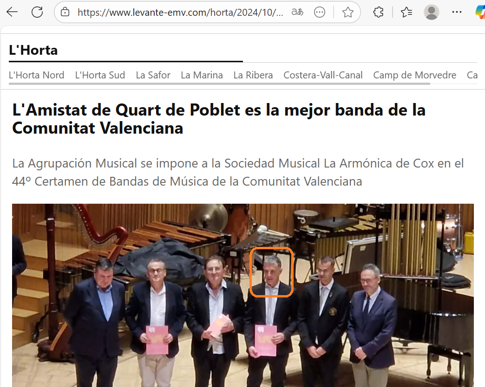](https://www.levante-emv.com/horta/2024/10/21/amistat-quart-de-poblet-mejor-banda-comunitat-valenciana-109945426.html)

- It's not clear which of the men in the photo is Vidal Sastre Sanchez Hornero.
- It's possible that the man standing at the centre-right of the other five is [the first trumpet teacher](../../crimes/protagonists/vidal-sastre.md#the-older-slimmer-greyer-man) from the switcheroo porn special, the man I still have good feelings for.
- If so, then one of the other men must be Vidal Sastre Sanchez Hornero, unless the name is a fake name and *only* exists to support the mass grooming of students in the conservatory system.
- Does this award ceremony and publicity ensure that the first man will take the blame for it all, brain-damaged students remembering him alone, in the absence of the others, as the teacher they fell in love with?

## Visiting Inma again in Madrid

- On my way back from Fátima, I stop in Madrid for the night.
- As I'm driving into Madrid, the same Google maps hack fires up that they've been using on me for years.
- Except, instead of just inconveniencing me, they're trying to make me crash the car.
- I text a friend in Finchley & Golders Green about that, while it's happening. 
- She's worried about me and tells me to come home.
- I arrive in Madrid and meet with Inma on Sunday 27th October.
- She has updates from [Paloma, the Spanish official we met the week previous](#meeting-inma-and-paloma-the-spanish-official-in-madrid).
- Inma tells me that Paloma said we are both in danger.
- She also tells me that Paloma looked up *Vidal SASTRE SANCHEZ HORNERO* in the Generalitat databases and found no record of a man with that name.
- When I hear that I know for sure Paloma is not going to help me.
- Neither Inma nor I knew that, on the very day we met Paloma, someone with the name Vidal SASTRE SANCHEZ HORNERO was [picking up a Generalitat-funded prize at the Palau de Arts in Valencia](#vidal-sastre-sanchez-hornero-collects-a-generalitat-award-at-the-palau-darts-in-valencia).
- If Paloma knew about that, she didn't think I'd ever find out.
- Inma then tells me that Paloma did speak to her sister in La Sella, as she said she was going to and yes, indeed, everyone in Dénia knows who I am, and not in a good way.
- She does not elaborate on that apart from suggesting, without details, that everyone finds me horribly offensive... (is that the townsfolk's coping mechanism for any foreigner targeted for sedated spy-cam porn).
- I remind Inma that the gangs [shutdown my security-cam](#the-router-malfunctions) while I was away and must have done so to gain unfettered access to my apartment.
- I tell Inma I'm extremely concerned for my safety in Dénia.
- I ask her what am I going to do if they try to murder me by poison when I get home.
- Inma says, strangely, that I should call the police.
- I'm a little shocked at her reply.
- Never mind what Paloma told us about the police in the region, Inma knows [I went to the police in Dénia](february.md#my-first-trip-to-the-spanish-police-in-denia) and they refused to take my name or record my visit, and [she came with me to report the matter in Madrid in March](march/13-end.md#reporting-the-crimes-to-the-police-in-madrid) when I was ignored again.
- I'm obviously not going to call the police if the gangs try to murder me by poison, and Inma and Paloma know this very well.
- In retrospect, it seems to me that, after [I wrote to everyone by hand](august.md#the-handwritten-letters), someone ordered my murder and everyone had to first make sure there'd be no serious repercussions, and once they were confident and certain that no-one would care if I was murdered - after a quick call to the Met maybe - they cast me off.
- When I start writing this police statement in Thailand a few weeks later - after I survive [the poisoning attempt at my home](#serious-poisoning-with-intent-to-kill) - and I build a website for it, Inma emails to ask me if I've built a website.
- I understand she's been told to contact me with this question.
- I say yes.
- She says Paloma told her it'll probably be shut down.
- It wasn't, obviously, which told me that I am not entirely without friends.

## Serious poisoning with intent to kill

- I arrive back in Dénia on Sunday 27th October.
- The storm that kills hundreds in the Valencian region, the DANA, has started.
- As I'm driving along the coast, the weather becomes extremely stormy.
- It feels like I'm racing to keep in front of the wind, or it will scoop me and the car up and carry us both off.
- Somehow, the severity of the DANA passes over the Dénia area.
- I arrive home, do a few things online, and go to bed.
- On waking up on Monday 28th October, I have an inexplicable and excruciating headache which lasts a few days. 
- It seems to be something to do with my duvet, so I eventually swap it for a thin blanket and the headache dissipates.
- While sitting at my desk, on the Monday morning, drinking my coffee, I experience shooting nerve pains all over my face.
- Over the week, my kidneys start to ache more than they ever have.
- The aching gets worse and worse; it's on both sides now, left and right, and always screaming at me.
- I feel like I'm being poisoned.
- It's difficult to know what to do.

!!! info "Pain in kidneys"
    - I have been experiencing this sort of kidney pain, although not as intense, continuously in my apartment in Dénia since January 2023, but likely from before too.
    - I remember being unwell like this in Lindisfarne in July 2022, which means they had been accessing my bathroom products for far longer than I originally assumed.
    - I'm guessing they need at least six months to properly brain-damage a person with poison.
    - I can describe the feeling as a dull ache at my kidney area on the right and left side.
    - In my spy-cam infested home, it would usually start around lunchtime, and get worse until I went to lie down for a bit!
    - In January 2023, when they got the dose wrong and gave me rhabdo at music class, I believe they caused serious injury to my right kidney.
    - In October 2023, on Halloween, I believe they intended to cause me serious harm with anti-freeze in the water, and my right kidney took the hit then too.
    - This week, I believe they intended to kill me outright.

- My urine becomes extremely frothy, every sitting, and it was fine the week before in Fátima.

- My eyesight has become extremely blurry and my eyes also ache.
- I'm being poisoned, intensely, in my own home.
- Someone is trying to kill me and I know who it is.
- I'm only due to stay at home until 7 November. However, I end up having to leave sooner because my elderly father has a serious accident.
- I believe if I had stayed the few extra days, I wouldn't have survived.
- I also believe everyone was aware this was planned for me: the [angry man and his wife in his car as I'm leaving for Fátima](#fatima-20-26th-october), the [L'Amistat band](#vidal-sastre-sanchez-hornero-collects-a-generalitat-award-at-the-palau-darts-in-valencia) who were offering up a scapegoat; the founders at [Polygon](#polygon-fires-the-whole-writing-team), even [Paloma, the Spanish foreign-office representative](#meeting-inma-and-paloma-the-spanish-official-in-madrid). 
- How did everyone know?
- Is murder (snuff) a well known part of the Dénia porn-gang repertoire too?
- Did the audience, and others, have constant access to the spy-cams in my home and, as well as the sex-offending, witness people coming in and interfering with my belongings, food, water, and bathroom products?
- When I leave, I take water samples and items related to the air vents to London for passing to law enforcement.
- I see more warnings online about poisoning via fake accounts on Halloween night.

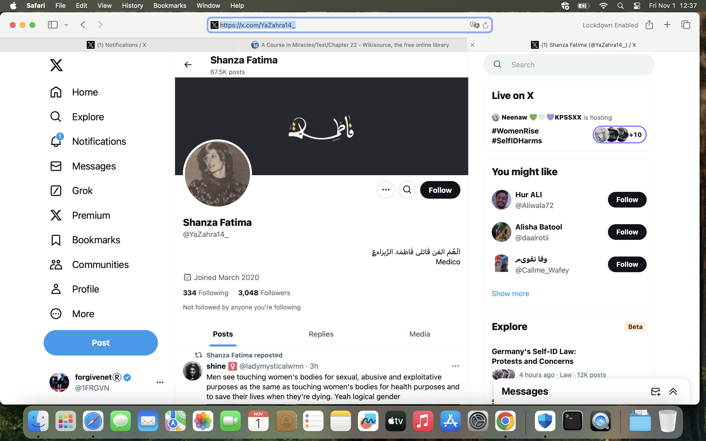
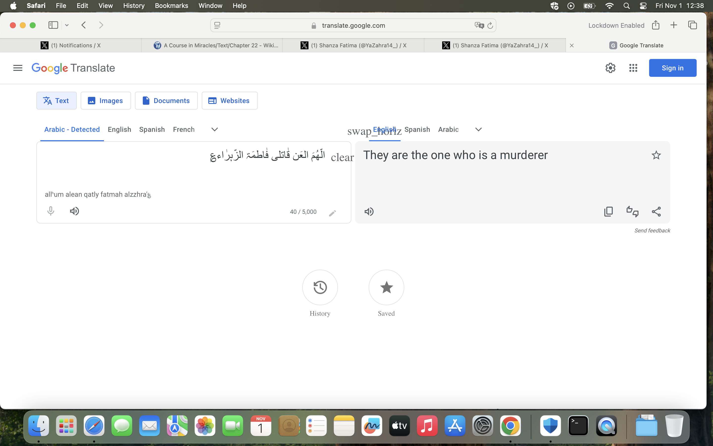

- On Friday 1st November, in the afternoon, I see Carmen Lopez Cano and [the woman I have seen going in and out of number 18 and constantly fiddling with the water mains pipes](#activity-in-the-nextdoor-apartment-number-18) leaving the building together just as I'm coming home.
- Are they upping the dose because I just refuse to die for them?
- They both smile at me as I walk by.
- My eyesight is so damaged and blurry at this stage that I can hardly see anyone until they're right up close, but I would never mistake these two.

### The upstairs neighbor

- On the Monday evening I'm back in my apartment, the upstairs neighbor makes loud vomiting noises continually.
- It's an act, he's not sick.
- He's warning me about the pesticides and the poison.
- He doesn't want me to die, but he'll be in danger if he formally helps me.

### A small black plastic or rubber item

- Somewhere in the house on the floor I find a small black plastic or strong-rubber item.
- I can't figure out what it is. 
- It looks like a bit of lego, or a part that fell off some larger object; like the rubber feet on kitchen chairs might.
- I'm wondering now if the item was from farming machinery that they used in my apartment to douse all my belongings with pesticides.
- Or, I also wondered if their remote-control sedating mechanisms might come in little plastic boxes like these which you could get the conspiring neighbor to leave under a victim's bed just before they come home.
- I guess thousands do know what it was; and maybe even saw it come off.

### Mary breaks

- One evening this week, I had my little statue of Mary from Lourdes in my hand, and it was if she jumped out and onto the floor, smashing into pieces.
- A sign, but not for me.

### Couple filmed by hotel room spy-cam

- I start seeing really concerning and obvious spy-cam photography on fake accounts.
- These are views of people in hotels rooms.
- It seems like the cameras are installed high up in a corner of the room so they have a full view.
- I see a young Spanish-looking couple lying down together on the bed about to have sex.
- I know it is a hotel room, as the furniture is sparse and the hotel style is very familiar to me.
- Someone is telling me everything that the porn-gangs of Spain are doing freely and with no fear of getting caught.

## YouTube with Kelly Oliver Dougall

- On Wednesday 30th October, Kelly Oliver Dougall, a woman who also stood for the Party Of Women at the General Election, interviews me for a YouTube video.

[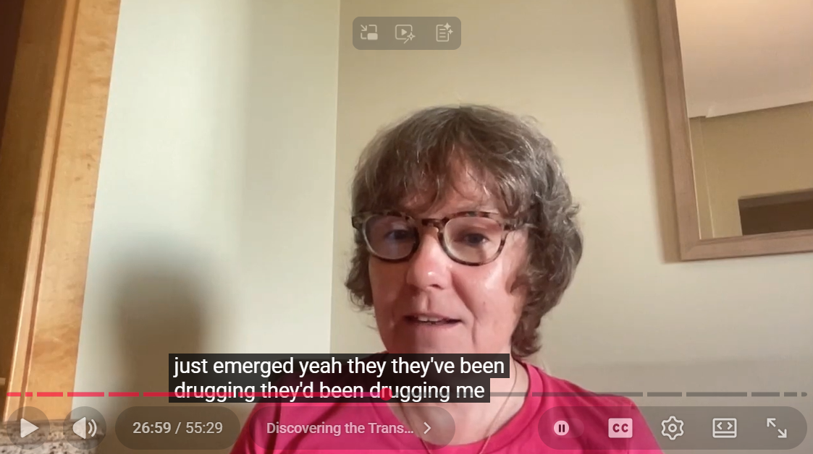](https://www.youtube.com/watch?v=VIYsj4OgiYA)

!!! tip "Transcript"
    - Here's [the transcript](../../content/vids/kelly-od-transcript.txt) from the video.

- I tell Kelly about:
    - Being targeted by North London rape-gangs in 1989 when I was 16.
    - How I was sedated for most of what happened to me then, so I had no memory of it, but it was obviously brutal due to the intensity of the PTSD.
    - How my PTSD reaction made me a pariah in my social group afterwards.
    - How PTSD took 35-years of my life from me.
    - The police report I gave in 2006 and the half-hour video they took of me.
    - The incongruous sexism of the detective.
    - The second report I gave 10 years later, how they arrested one of the gang - the ringleader [Winston May](june.md#winston-may), and how the CPS eventually dropped it.
    - Suicidal depression and intense anxiety (which in retrospect didn't make sense, it didn't happen in 2006. It turns out it was because other similar things had been happening to me sedated without my knowledge in Dénia).
    - Not being able to get involved in relationships, politics, or community because of these reactions.
    - How I joined Childline in 2020 and found out about the cult of trans being forced onto children.
    - How I was still in a suicidal depression in July 2022 when I first went to LWS in London and couldn't speak to people.
    - How I am now completely healed of depression and anxiety... (she didn't believe it possible).
    - I talk about the porn gangs of Dénia and how they've been drugging me.
    - How the porn gangs hacked my devices and took sensitive and sexual photos and videos of me.
    - How I told my story in Madrid at Let Women Speak (I say April, it's May) and recognizing I was out of my mind at that time (a week before the Polygon offsite in Bali).
    - I explain my experiences with the Dénia porn-gangs since January 2023 as a re-enactment of the 1989 rape-gang events.
    - I tell her about working for crypto-giant Polygon, about Nadim's outrageous behavior and how he turned out to be an actor, and some of the weird stuff that happened there.
    - I give a good description of how the porn-gangs are hacking my X feed.
    - I tell her about Gabriel Silva's behavior towards me without mentioning his name.
    - I tell her about Ajay's teams military coup on my role.
    - I explain the sexual threats at dinner in Bali (I do not make the Jitendra Das connection at this stage, or that the man's actions at the dinner table may have imitated something very evil that happened to me in my apartment while I was sedated on Wednesday 13th March after which I was certain I was going to be murdered).
    - I tell her about Hans's outrageous behavior.
    - I tell her how I started a claim for harassment with Head of Legal at Polygon.
    - And how they fired me the Friday before.
    - I tell her I'm looking for a lawyer to help me with a claim for unfair dismissal and harassment.
    - She asks me what's next, I tell her I'm going to Thailand.
    - I tell her I feel in danger and that the whole town of Dénia hates me.
    - I explain I have to wear my camera even just going to the post office.
    - I tell her I think it's because I complained about a teacher's inappropriate behavior with children (Domingo, I don't tell her his name).
    - I tell her they targeted and gang-stalked me so badly, I believe their intention was I'd commit suicide.
    - I tell her the stalking had gone on for 2 years at the conservatory, and it included being drugged in class with some aphrodisiac type substance.
    - I tell her how I got rhabdo in January 2023 at chamber music class.
    - I tell her I went to the police in Dénia and they told me to get a civil lawyer.
    - I tell her about going to the police in Madrid. 
    - I say, I expected people to "spring into action" if you tell them things about child safety, and this just did not happen, I got targeted instead.
    - I explain my strong concern for the safety of the children of Dénia.
    - I tell her how it looks like the Generalitat employed a serial sex offender to groom me in class at the conservatory (I won't realize it was actually a switcheroo with multiple men for a year as the brain damage by poison has been so effective).
- When I write this section in February 2026, I'm astonished this video was taken during the week the porn-gangs tried to murder me by poison, the week after they doused all my belongings in pesticides.
- I thought we had made the interview before they tried to kill me, while I was still working at Polygon.
- I thought that this video was the *motivation* for murder by poison in my apartment. It wasn't.
- The true motivation for murder was that I had multiple photos and videos of the trumpet-teacher switcheroo team - the four men pretending to be one man - and they knew that at some point I'd realize they were different people and tell everyone.
- In November when Kelly publishes the video online, I send it to my landlady Beatriz on WhatsApp.
- She *slow claps* back.

## Challenging Sandra Rita Diaz

- One night, I have a WhatsApp chat with Sandra.
- I seem to have four numbers for Sandra now; it used to be just two: a work phone and a personal phone.
- When I eventually find the right number, or one that someone answers, I tell her I was sacked from my job.
- She starts writing a genuine and rather horrible curse on the man who sacked me.
- I have to tell her to calm down.
- Her curse uses the exact words and phrases I have read on stalking X accounts; such as from `@Susan_E_J_USA` with Gloria's face in the profile pic.
- She's been gaslighting me for a good while too; not listening to anything I say, pretending interest then blanking, telling me I should see a therapist...
- I'm now certain she's fully involved in the conspiracy.
- I tell her what I think.
- She says, "No Katharine, I am your friend".
- I say, "No, you're involved aren't you Sandra?".
- "You work for the police."
- "No, no, I don't work for the police", she says.
- I don't know why she would deny that when her actual job is working for the police amongst other public services - at least that is what she told me - and she told me about situations in which she had to translate for Portuguese-speaking victims of crime at a police station in France.
- Interestingly, those few times she told me about what she had been doing at work, it always involved traumatic details about a prostituted or sexually abused woman.
- "You do work for the police", I repeat.
- "No no", she says.
- "I worked for them at the Charles de Gaulle airport in Paris."
- The information keeps changing, but I knew about this job that she was doing via an agency with a very dodgy boss when I met her. 
- She hadn't worked for them in years. I was not talking about them.
- "You kept 'popping' up", I say. 
- She pretends to not know I'm talking about how she was always in the right place at the right time; directed.
- "You have a boyfriend at the border of Spain and Portugal you like to tell me about."
- I say, "Yes, you're involved, aren't you?".
- I never hear from her again.

!!! tip "Sandra D curios"
    - It's curious the name Sandra comes up so much amongst honey-trapping conspirators.
    - I have mentioned my thoughts before about the name coming from ["throwing sand in the eyes"...](march/1-12.md#i-make-a-donation-on-x).
    - I now notice that this Sandra is *Sandra D*, star of summer loving, a classic honey-trapping meme.
    - When I first met her in [2014](../early-years/2014.md#sandra-rita-diaz), just before starting as Domingo Lopez Cano's piano student, she was simply Sandra D.
    - She added the Rita in a lot later.

## Nota simple from the neighbors flats

- The nota simple document for properties in Spain gives legal information concerning owners, debts, property details, etc.

### Who is involved in poisoning and drugging me at my home in Carrer Furs?

- It's obvious to me that something in my apartment has been causing me to feel inexplicably sexually aroused at lunchtimes on working days. 
- Moreover, I also feel really unwell and in unusual ways that don't make any sense to me.
- The [migraine and shooting pains in my face while drinking my coffee](#serious-poisoning-with-intent-to-kill) make me wonder if I'm ingesting methanol.
- It's hard to think straight about anything but nevertheless I try to figure out how the porn-gangs are drugging and poisoning me at my home.
- In my kitchen - under the sink where the water from the main supply comes in that I use in tea, coffee, cooking - there is a weird mechanism I always thought peculiar.
- A small, thin, plastic and extremely dirty pipe is connected to the water pipe in an unusual way.
- It's something I have never seen before in a kitchen, and I always thought it weird.
- When [Paul comes to help me move](../2025/february.md#paul-helps-me-move-back-to-uk) in February 2025, I ask him about this. 
- Paul has spent his life in the building trade.
- Like everything else I ask him about (except the air-conditioning system), he says, "Oh no, that's completely normal, that's just a filter for ... blah blah", or something similar.
- He's unconvincing.
- The mechanism backs onto Marie Carmen's apartment wall, number 16.
- When I visited her one afternoon, I noticed an unusual antique furniture item, an ornate mini-cabinet, set against the joining wall at exactly that point.
- I start to wonder about Marie Carmen.
- Have they built some mechanism for accessing my apartment's drinking water directly from Marie Carmen's property?
- As well as number 16, I'm suspicious about number 18's coming and goings this week, especially [the woman I see every day fiddling around at the water-pipe cupboard](#activity-in-the-nextdoor-apartment-number-18).
- I get the [paperwork for number 18](../../content/documents/evidence/number%2018%20beside%20me%20bedroom%20wall.pdf).

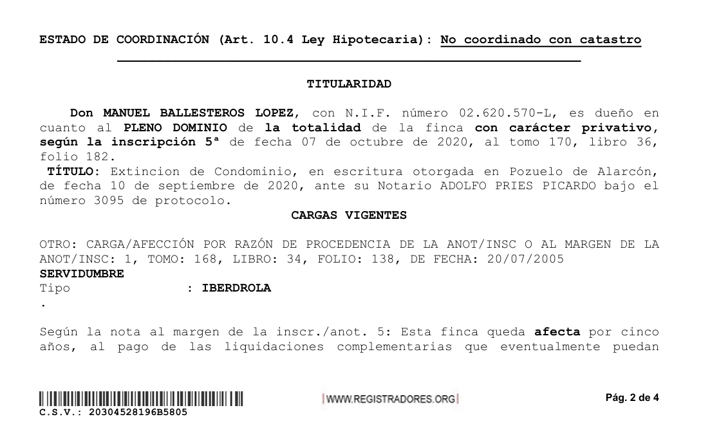

- I'm also suspicious about the apartment above mine, number 23; the apartment where they seemed to meet every [Monday evening after chamber music class, carrying on long into the next morning](../2023/january.md#noises-upstairs-after-mondays-chamber-music-classes); a suspicion further solidified by comments made by stalker account `@FixationAural` when the gangs were very confident in my apparent vulnerability and weakness, and assured demise.

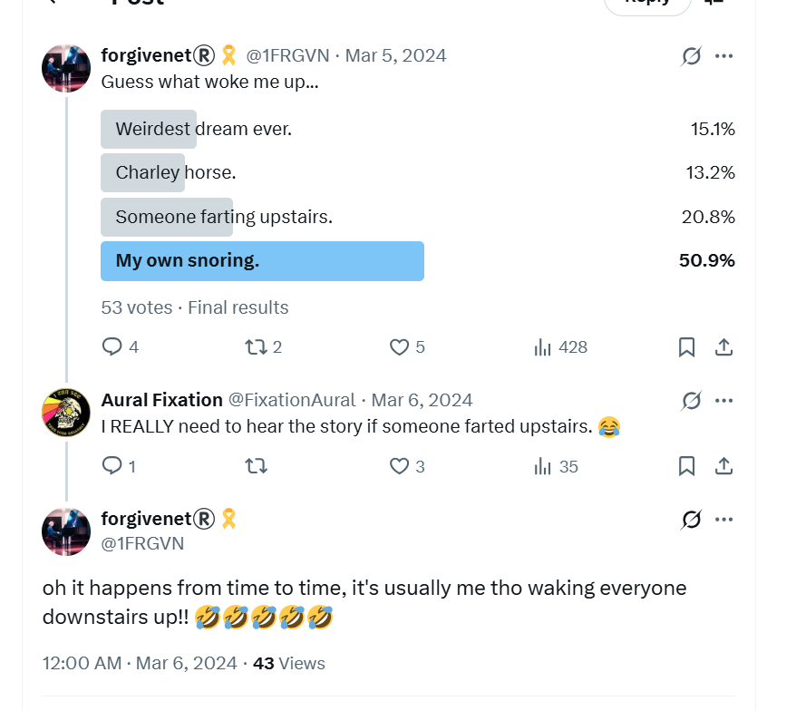

- So I request [the paperwork for number 23](../../content/documents/evidence/number%2023%20upstairs.pdf) also.

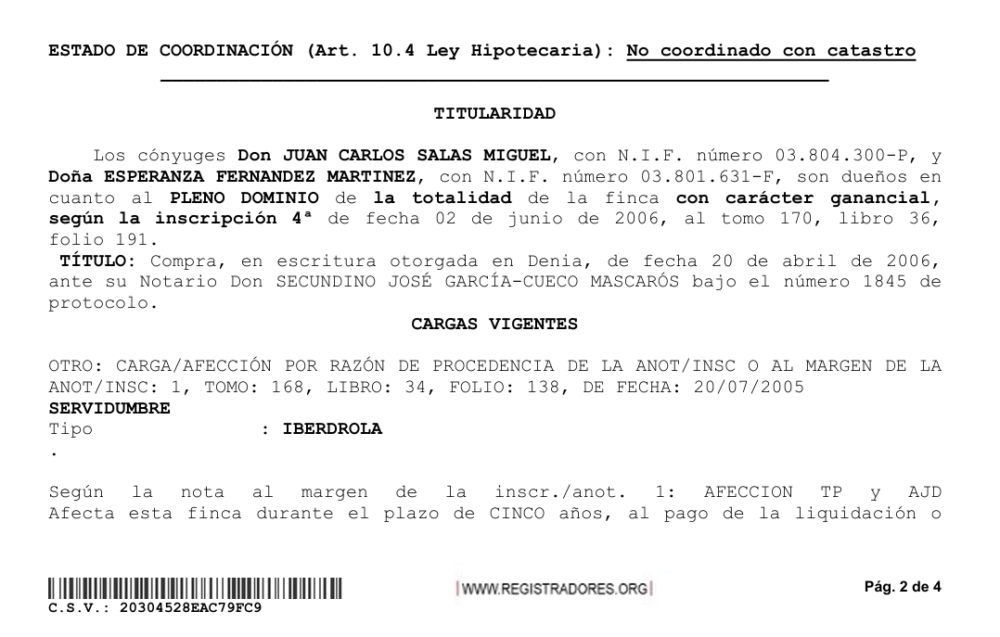

#### Squeaking pipes

- I would be at home, at work or relaxing, and I would hear the water pipes in the kitchen squeaking as if they were moving around.
- I tested it by moving those pipes myself, and it was that exact noise.
- I remember this happening during 2022 and 2023, and maybe again in 2024.
- Was this how the brain-damaging herbs were administered?
- It was so common, and concerning, I remember thinking it must have been cockroaches under the sink walking on the water pipes.
- I would go to check and see nothing and forget about it.
- This makes me even more suspicious about Marie Carmen and her ornate cabinet which I remember seeing specifically (i.e. it was pointed out to me so I would remember it later).

#### Puffs of air 

- Another weird sound I heard regularly was a short puff of air.
- I thought it was the hot water boiler, it seemed to be coming from that direction (the same area as the air-conditioning outlet).
- Now I'm not so sure.
- Could this be the sedating and sexual arousal drug administering mechanism?

## Summary of poisoning and drugging at Carrer Furs

- The effects of drugging and poisoning in my apartment caused me permanent brain-damage, frequent sedation, timed sexual arousal, and permanent effects of hallucinogens.
- Let's assume the poisoners use different techniques for different outcomes.
- My guess is the following:

    1. Brain-damaging herbs coming into the water direct from some mechanism built into the joining wall with number 16.
    1. A sedating mechanism at the air-conditioning vent close to my bed, triggered after I had gone to bed and in the afternoons in the main room.
    1. The timed sexual arousal is very clever; especially in the car. I'm wondering if this is psychological triggering manipulation via social media, and hacked phone sub-audio apps *together with* the ingestion of constant low-to-high-dose hallucinogens. I believe the hallucinogens were added directly to food, the bottled water I drank, and my bathroom products: face wash, shower gel, shampoo, toothpaste, etc.

- Of course, all avenues of administration converge for the eventual outcome of murder.

| Desired outcome                                 | Poison used                           | Administrating technique                                 |
|-------------------------------------------------|---------------------------------------|----------------------------------------------------------|
| Brain-damage for switcheroo porn                | Poisonous herb: mandrake?             | Direct into drinking water from adjoining wall mechanism |
| Sedating a victim                               | Anaesthetic gas                       | Via the air-conditioning system                          |
| Drugging a victim: hallucinatory/sexual arousal | Mushrooms/hallucingens/extasy     | Direct into the mains water via the pipe cabinet, my food, water bottles, and bathroom products   |
| Murder                                          | Methanol, pesticides, brake-fluid etc | All the above once the order is given, including a spraying machine for dousing clothes and belongings            |

## Trying to find the cameras

- The drugging and poisoning techniques *cannot* work without constant surveillance in my apartment.
- They need to know when I'm going out so they can enter, when I've ingested something toxic, when I'm overwhelmed with sexual arousal and, most importantly, when I go for a nap or to bed at night.
- I'm certain there are spy-cams all over my home, and I believe I mentioned to [Kelly Oliver Dougall](#youtube-with-kelly-oliver-dougall) after she had stopped recording that I was going to continue looking for them. Someone probably has a copy of that.
- I looked hard for the cameras, but they are impossible to find.
- When I think about how they secretly filmed [Irene over 30-years ago](august.md#irene-the-plate-lady), and she did not notice, I'm aware that the spy-cam tech they use currently must be extremely advanced and practically invisible to the naked eye.
- Nevertheless, I believe there is a spy-cam on the ceiling in the living room above the TV; I always noticed a little black dot there while I was doing yoga and I examined it once and it was not dirt.
- I believe there is one on the ceiling in the corner of the bedroom, close to the window, which matches the position of the spy-cam porn posted on my Google search results of me asleep in bed with my fluffy bed-socks on and a large naked man hovering over me.
- I always felt I was being watched at the mirror in my bathroom, especially when I was feeling overwhelmingly sexually aroused.
- I found a huge purposeful hole in the wall behind the mirror after doing the interview with Kelly, and it looked like it was so big I could fit my hand into it. I told many people this.
- It's curious because when I had tried to look behind the mirror prior to them [dousing my belongings with pesticides](#the-router-malfunctions) I was not able to move it at all.

!!! danger "I said "huge" when I first wrote this section in November 2024"
    - This is amazing to me.
    - When I showed Paul [the hole behind the mirror in the bathroom in February 2024](../2025/february.md#paul-helps-me-move-back-to-uk), it was tiny.
    - This was shocking!
    - I had obviously been hallucinating extremely hard during this last week of October in my apartment, and it made me even more convinced of methanol poisoning.
    - Paul played it down as nothing, as usual, but the hole, though small, was certainly big enough for a fairly large spy-cam.

- There is another hole on the wall behind the sofa.
- I was also suspicious about the television, and Pedro the caretaker had made weird comments about the TV previously. 
- Furthermore, Paul was *extraordinarily enthusiastic* about there being no possibility of a spy-cam in the television and he gave numerous reasons for it too.
- So I guess I was right about the TV.
- I believe the spy-cam network hub was called **Casa LANister** and you could see it on the available networks.

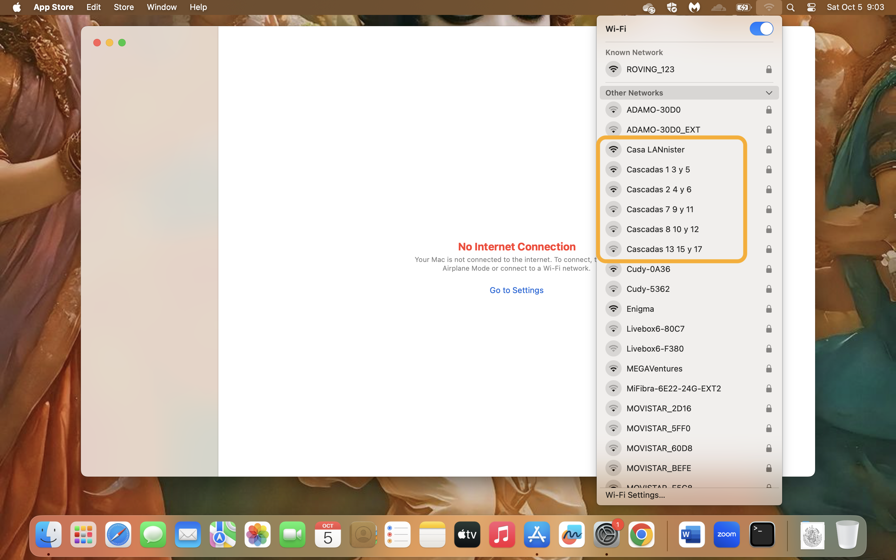

- The group of networked devices named **Cascadas** I believe to be the hidden cameras.

### Confirmation from the telecommunications engineer 

- When the man from Telco came to [fix the router](#the-router-malfunctions), he had obviously been told to tell me about the spy-cam LAN (so I'd leave my home before dying, I guess).
- He asks me to come over to where he is standing, which is underneath the black dot which believe is a spy-cam and in front of the TV.
- He starts talking about something inconsequential, and while he's doing so he's pointing at the *Casa LANister* connections very slowly, and very pointedly, and looking at me meaningfully as he does while mumbling about something completely irrelevant.

## The police trafficking email

- Inma gives me the email for reporting suspected sex trafficking to the Spanish police.
- She tells me it's anonymous and safe for me to use. 
- I send an email to `trata@policia.es`.
- I tell them about the [innocent woman](august.md#grooming-an-innocent-girl-into-porn-101), the [woman in the car](september.md#another-upsetting-targeted-woman), and I even mention [Elsa from choir](august.md#18) at the conservatory.

[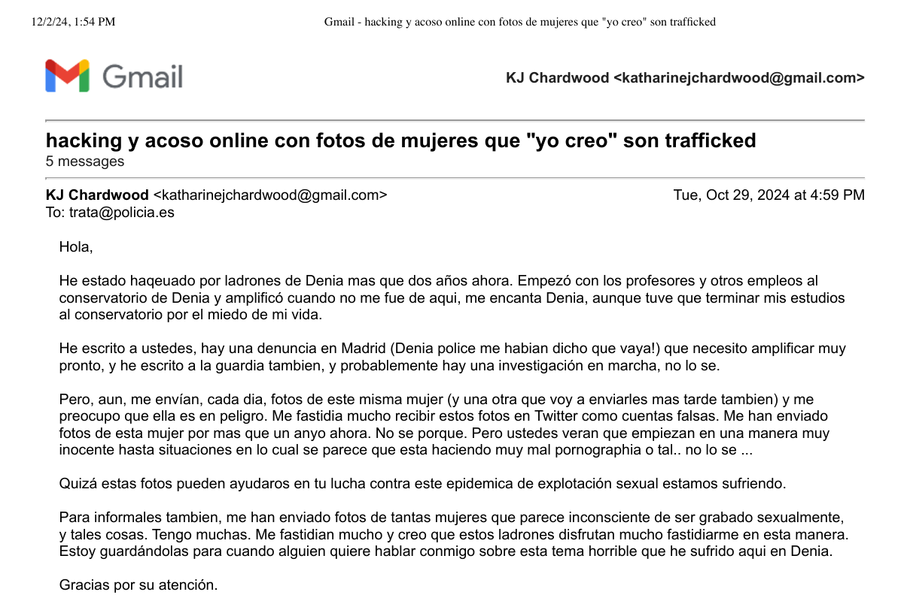](../../content/documents/emails/trata@policia.pdf)

??? info "Translated email"
    TITLE: Hacking and online harassment with photos of women that "I think" are being trafficked
    5 messages
    KJ Chardwood <katharinejchardwood@gmail.com> (note this account is completely blocked since I returned to the UK and I had full access in Thailand)
    To: trata@policia.es
    Hello,
    Tue, Oct 29, 2024 at 4:59 PM
    I have been hacked by thieves from Denia for more than two years now. It started with the teachers and other jobs at the Denia Conservatory and escalated when I didn't leave. I love Denia, although I had to finish my studies at the conservatory because I was afraid for my life.

    I have written to you; there is a complaint in Madrid (Denia police told me to go!) that I need to escalate very soon, and I have also written to the Guardia Civil, and there is probably an investigation underway, I don't know.

    But, still, they send me, every day, photos of this same woman (and another one that I will send you later as well) and I am worried that she is in danger. It really bothers me to receive these photos on Twitter from fake accounts. I've been getting photos of this woman for over a year now. I don't know why. But you'll see that they start in a very innocent way, progressing to situations where it seems she's doing very bad pornography or something... I don't know... Perhaps these photos can help you in your fight against this epidemic of sexual exploitation we're suffering. Also, I've been sent photos of so many women who seem unaware of being sexually recorded, and things like that. I have many. They really bother me, and I think these thieves really enjoy bothering me this way. I'm saving them for when someone wants to talk to me about this horrible thing I've been dealing with here in Denia. Thank you for your attention. Please also excuse my terrible Spanish. Dr. Katharine Murphy
    Denia, Alicante

    Thank you.
    Here's the other woman who always sends me photos (there's a photo of her in the previous email, also here). I see this new woman sending nudes to her partner or boyfriend/girlfriend, or whatever... and he/she takes normal photos of her on the street... and then, she's in a car, she looks drugged, and with less and less clothing, and finally, no clothes at all... and I think something very violent has happened to her... I hope not, but she doesn't want these photos published.

    Thank you for your attention. Katharine

    Also, this X account seems to belong to a student at the Denia Conservatory, someone who was in the choir class with me, and possibly with others who are "preparing"...
    Thanks

- Remember: I had not started writing my statement at this point and I was in a very precarious state of health and mind at my home in Carrer Furs.
- Eventually I receive a short response from Dénia police who were [extremely unhelpful in February](february.md#my-first-trip-to-the-spanish-police-in-denia), refusing even to take my name and make a record of my visit.
- They ask me to contact them directly.
- I do not.
- I tell Inma what happened, and that I'm angry that the email did not seem to be anonymous at all.

## Mercadona

- The last time I visit Mercadona near my house, during the last week of October just before I leave, I am mass-harassed.
- A woman is standing still, pointing and laughing at me.
- People are giving me weird looks.
- The checkout lady looks like the sister of [the second trumpet teacher, Mark](../../crimes/protagonists/vidal-sastre.md#mark-from-english-class-in-2013).
- She's ashamed and won't look at me.
- As I leave the store, the door slides shut and won't open for me.
- I'm pressing the button, and I see the word "pervert" printed on the LED where it usually says "open".

- I hear laughing.
- I find it ridiculous.
- It's supposed to terrify me.
- Does the whole town of Dénia know I starred in a switcheroo porn special filmed mostly on location at the conservatory?
- Do they know I have no idea about what happened there because they gave me brain-damage by adding deadly drugs and herbs to the water in my home?
- Do they know that - because I refuse to be terrorized and leave the town (to be murdered quietly on live-stream elsewhere, I assume) - the criminals are now administering methanol or similar via the water in my home?
- Is the town itching to view the next batch of targets ready to rent my spy-cam infested apartment?
- I feel nauseated when I think that many men from the town (the dentist, the doctors, the music teachers..) must have entered my apartment without my knowledge while I was sedated, and this explains the constant snickering and sniggering from the men, and the nasty looks and fearful attacking reactions from the women.
- How many women have lost their lives to the perverts of Dénia over the last decades?

## The Silvia meme

- I'm still not sure what they meant when they used the name *Silvia*.
- I heard it said again and again, from very early on in-person at classes in the conservatory, and continuously online.
- One of the strongest suggestions was that Silvia is the trumpet teacher's daughter.
- In early October, they post pictures of a child who is supposed to be the daughter, Silvia.

- The implication is that the trumpet teacher had a drug debt that he couldn't pay off and the pornographers had threatened to target his daughter Silvia.
- In order to avoid this, the trumpet teacher had agreed to target and drug me at the conservatory of Dénia.
- The profile pic came via a DM to me on X with a reference to pornography with the child in the photo. 
- This flew in just after significant references on X to Silvia, drug debts, trumpets, daughters, etc.
- I reported the account to X.

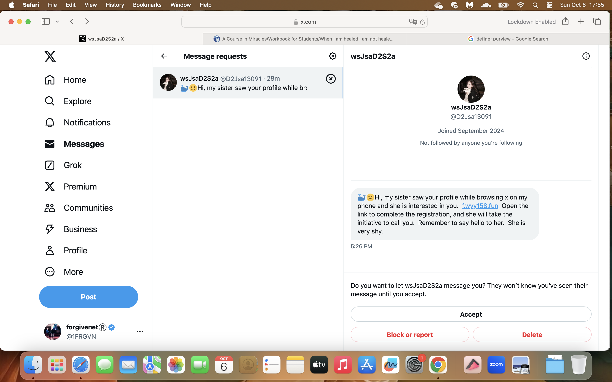  
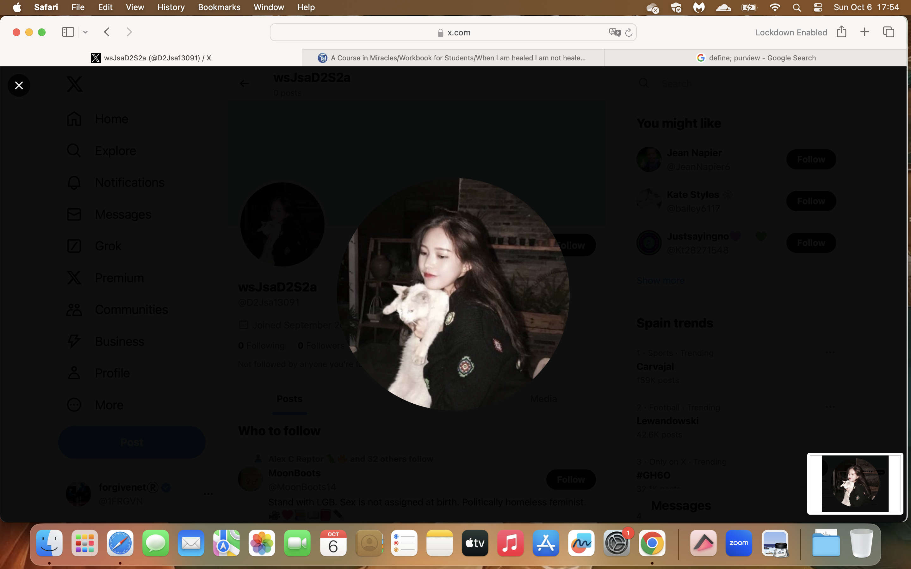 

- At the time, I was conscious of there being only one trumpet teacher but I guess it's possible the daughter of the man that has been helping me was threatened.
- It seemed a little far-fetched given the intensity of the attacks and the jeering tone of the information.
- Moreover, it wasn't the only suggestion around what they meant by *Silvia*.
- I eventually wondered if the name was *code* for a targeted-woman as it is a pun on the Spanish word for *whistle*.
- I then remembered my [French friend Sylvie](../early-years/2015.md#greek-man-with-a-twitch-and-sylvie) who was clearly surrounded by perverts back in 2015, and I wondered if that was really her name or they'd told her to use it when dealing with me.
- Also, the photo of the child reminded me of the photo that [Sandra Diaz used on her WhatsApp in 2014](../early-years/2014.md#sandra-rita-diaz) when I met her. 
- Its salaciousness took me aback, like many of her antics.
- She was dressed in a skintight jeans and a leopard-print top and she was holding a cat in exactly the same manner as the child in the photo.
- I added the [Sylvia meme information](../../evidence/memes-and-triggers.md#sylvia) to the evidence section.
- I guess we'll be finding out what they really mean by *Silvia* very soon.

## Suspected targets

- I saw a lot of minors on fake X accounts this month, many more than previously. 
- It was a bombardment.
- All the fake accounts with minors referenced porn in some manner.
- I reported everything I saw to X for child sex trafficking.
- I heard nothing back.
- As before, it was impossible to screenshot everything sent to me with the intention of helping me.
- As usual, there was a bunch of red herring accounts sent by criminals to confuse things.
- For info, I saw similar numbers of targeted women and girls every day online, but I only took screenshots at one moment, not continuously, which is why they all have the same or similar dates.

### Victims posted in October

##### 1.

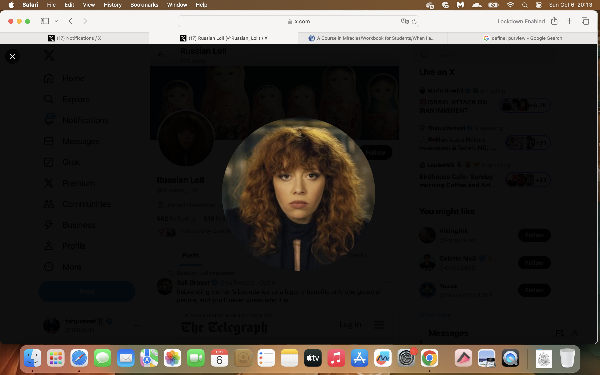 

- I'm aware this profile pic comes from a Netflix show, Russian Doll.
- The account is still fake, however, and an intended wind-up of some variety.

- The dolls in the profile pic reminded me of [a very early dream](../2022/december.md#dreams-and-premonitions) I had about the trumpet teacher.
- What is this account supposed to tell me?

##### 2.

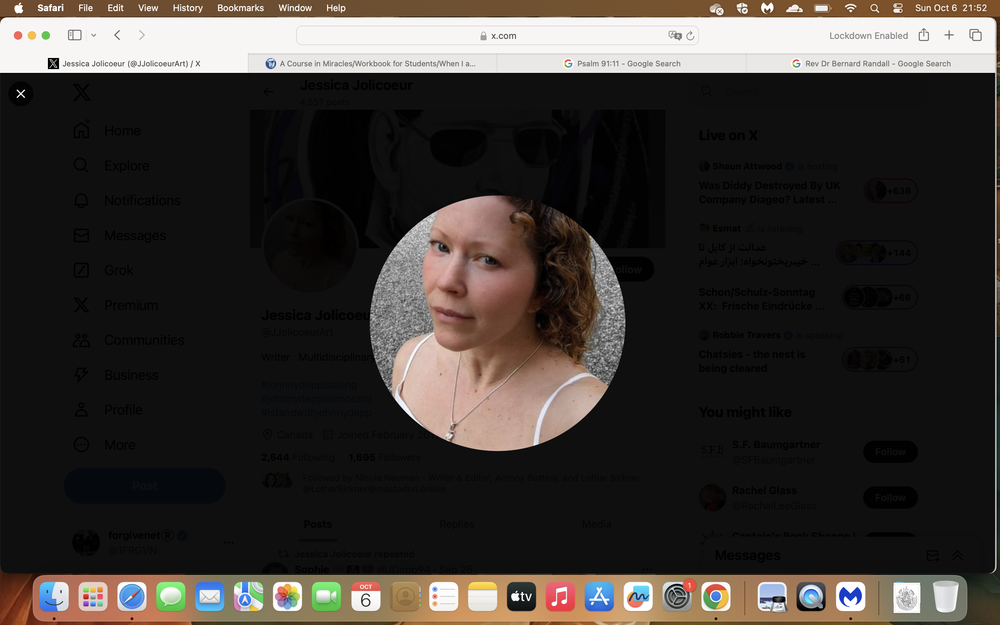 

- Is this woman and the one above the same person? 
- She looks like [the woman I saw on the beach with the possum-man](#possum-man-on-the-beach); the one with the tattoo.
- Her expression concerns me; I felt it was supposed to.
- Who is she?

##### 3.

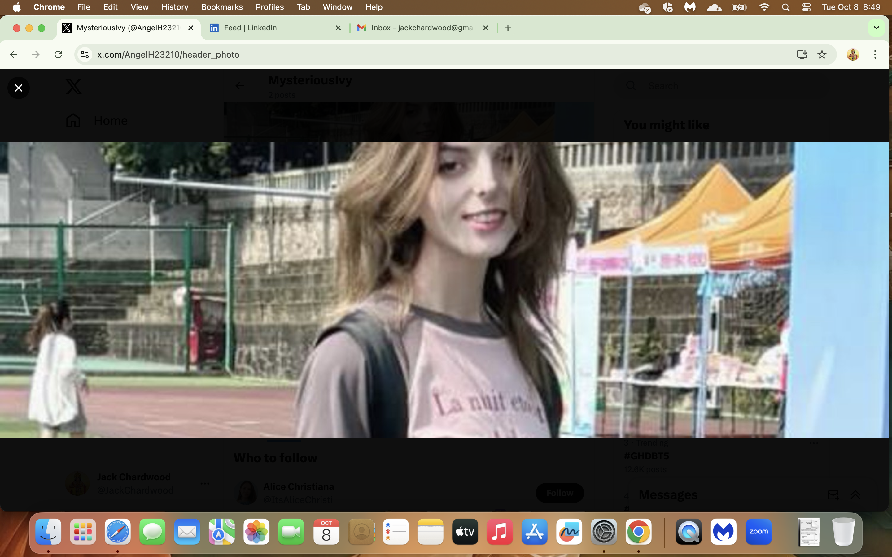 

- Looks like a minor. 
- Is she French?
- She reminds me of another girl I saw and had numerous photos of ... which I inexplicably cannot find anymore in my storage.
- The girl was severely malnourished and photographed in various unsettling situations.
- I think photos of this girl became similarly concerning but this one is prior to or at an early stage of grooming.
- Who is she?

###### Update

- Here is the girl I meant; I'm not sure it's the same girl as above after all, although the series of photos from a pre-grooming state through grooming and then into prostitution or porn was the same.
- Note the account name *LovelyQuentina*, and the porn references.

 

- Who is she?

##### 4.

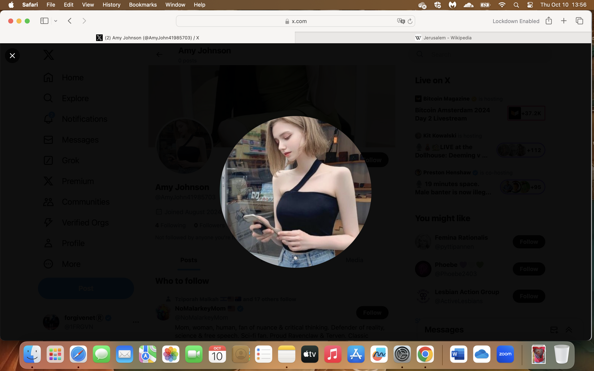 

- This girl looks extremely young.
- Who is she?

##### 5.

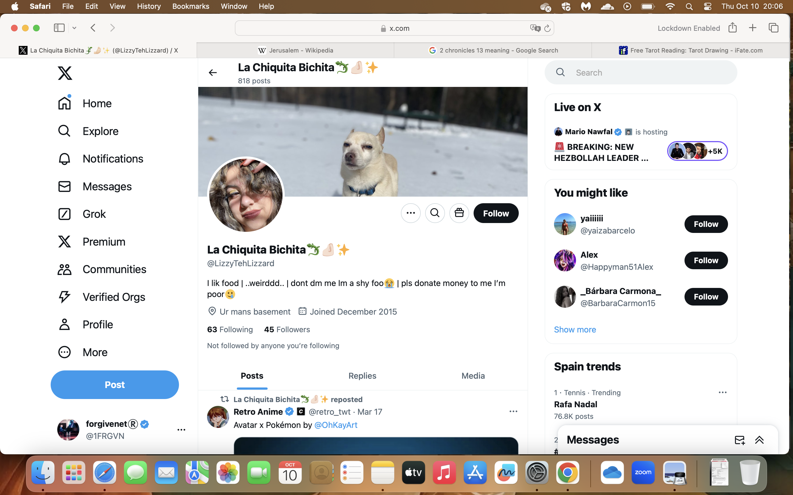 

- Wind-up account.
- Who is she?

##### 6.

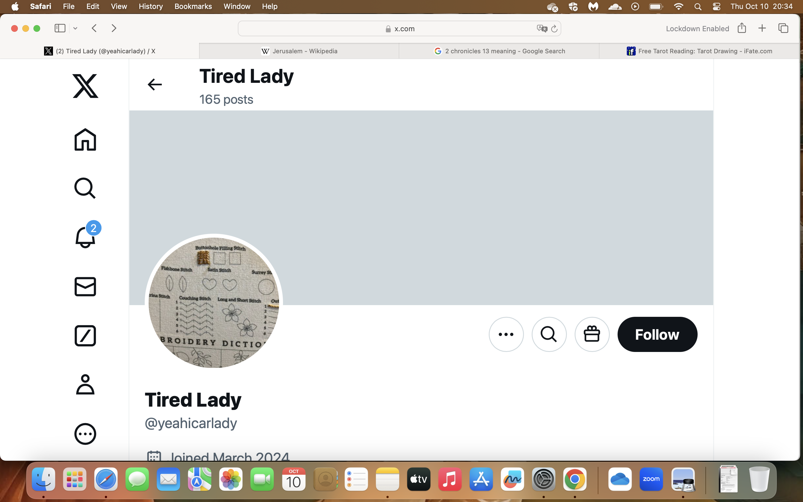

- The profile account name references ["car lady"](september.md#another-upsetting-targeted-woman): *yeah I car lady*, a message for me.
- I suspect *Tired Lady* confirms my suspicions the woman I saw continuously online was sedated in the car.
- Embroidery is in reference to my sense that all the women of the town were sitting around knitting, or sewing, and wishing death on me; something I told Sandra Diaz and Alessandra about, and no-one else, but it quickly emerged as a stalker meme.

##### 7.

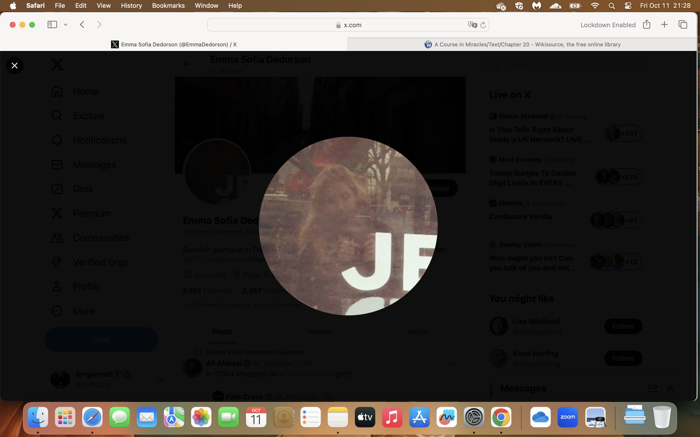

- The picture above looks like it's coming from a hacked phone.
- The young girl (minor?) is taking a photo of something in the window of the shop and not a selfie.

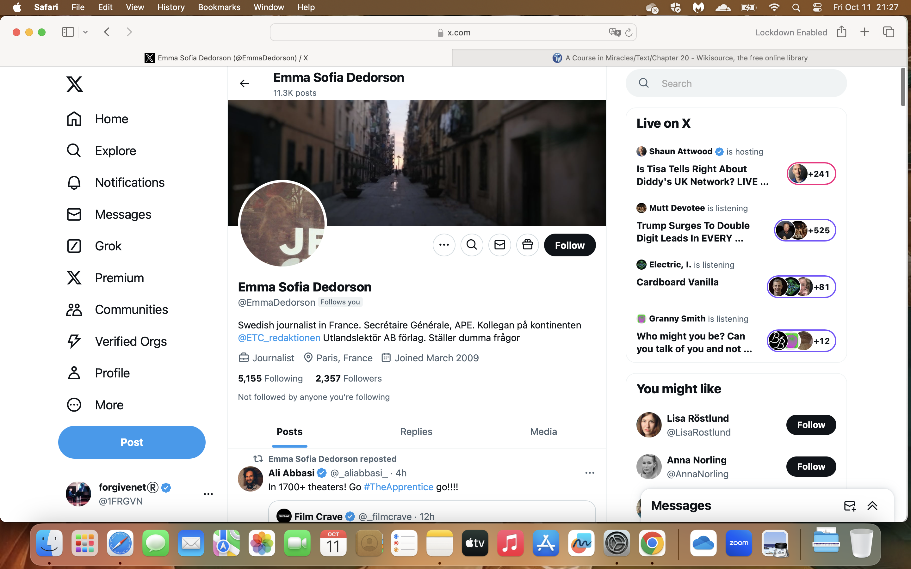

- The street looked like the Calle Loreto in Dénia to me when I first saw this account, but it isn't.
- The street *is* very similar looking, however, and easy to mistake under the influence of whatever was making me hallucinate back then.
- Who is she?

##### 8.

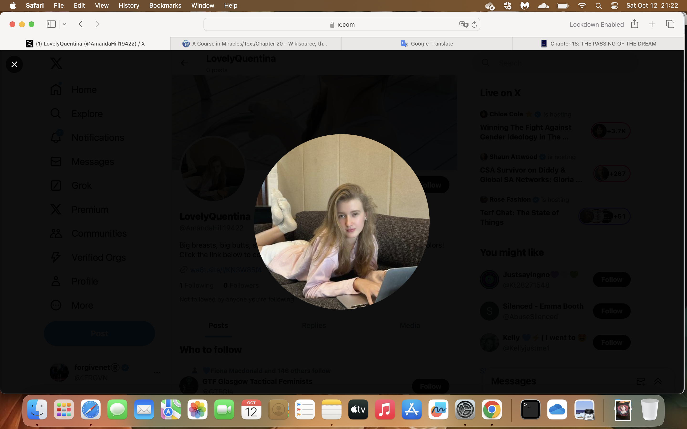  

- Another minor child. 
- Note the account name: *LovelyQuentina*, exactly the same name as the [malnourished and groomed minor above](#3).

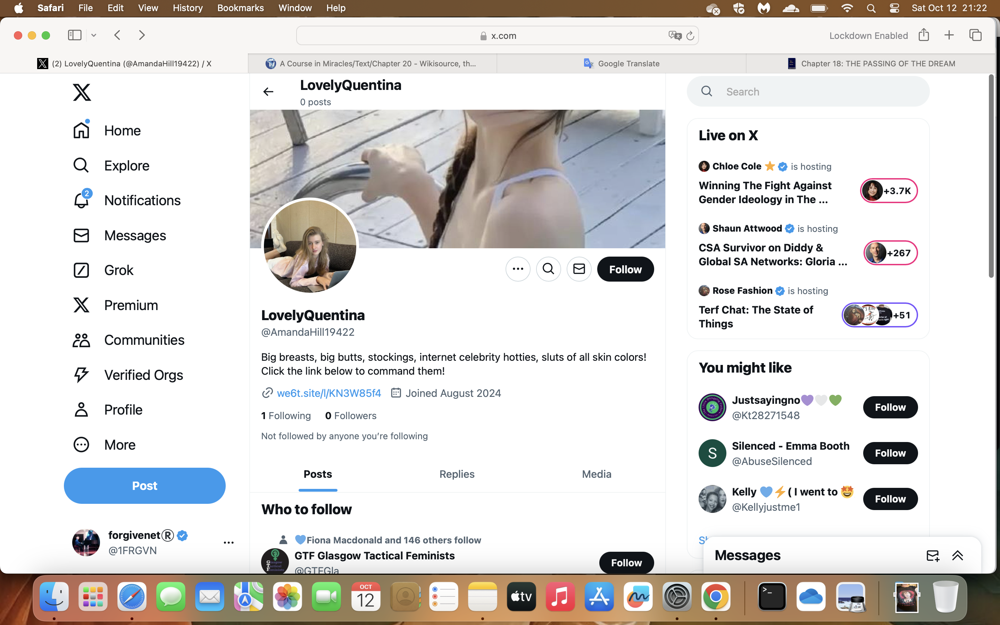 

- Do the porn account generating systems get all muddled up when overused?
- Who is she?

##### 9.

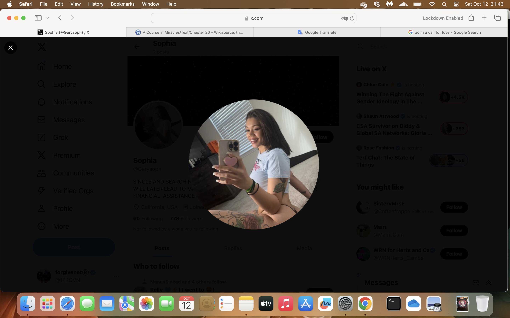  

- This is a private photo that I should not be seeing on X.
- Who is she?

##### 10.

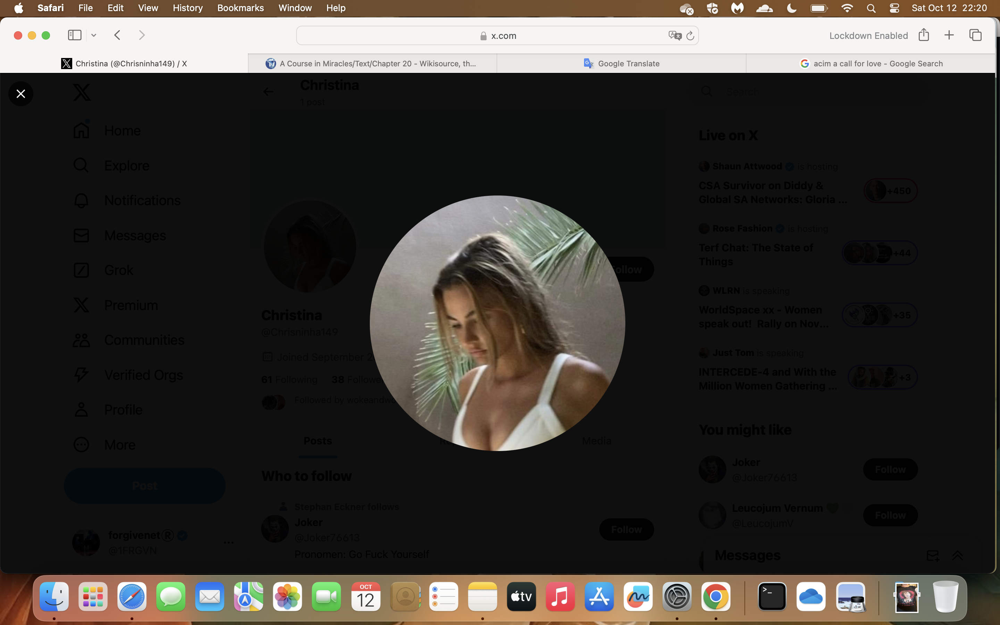  

- This is another private photo.
- I believe this girl is totally unaware she is being photographed.
- Is she a minor?
- Who is she?

## Threats

- Here's a selection of threats I received this month.

##### 1.

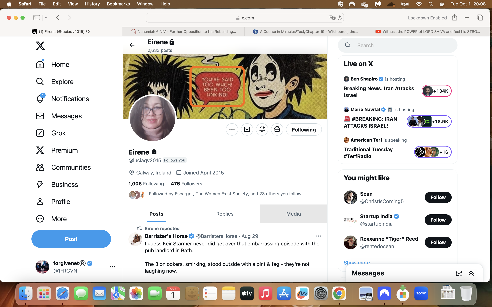

- This account would "pop up" every time I made a comment about the outrageous behavior of teachers and staff at the conservatory and, in this case, about something going on at the beach or in the town.
- Note the name: *Eirene* suggestive of [Irene the plate lady](august.md#irene-the-plate-lady).
- The profile photo looks like me.
- A strong inference is around "boys don't cry", the song the lyrics come from.
- There's a whole bunch of refs here.

##### 2.

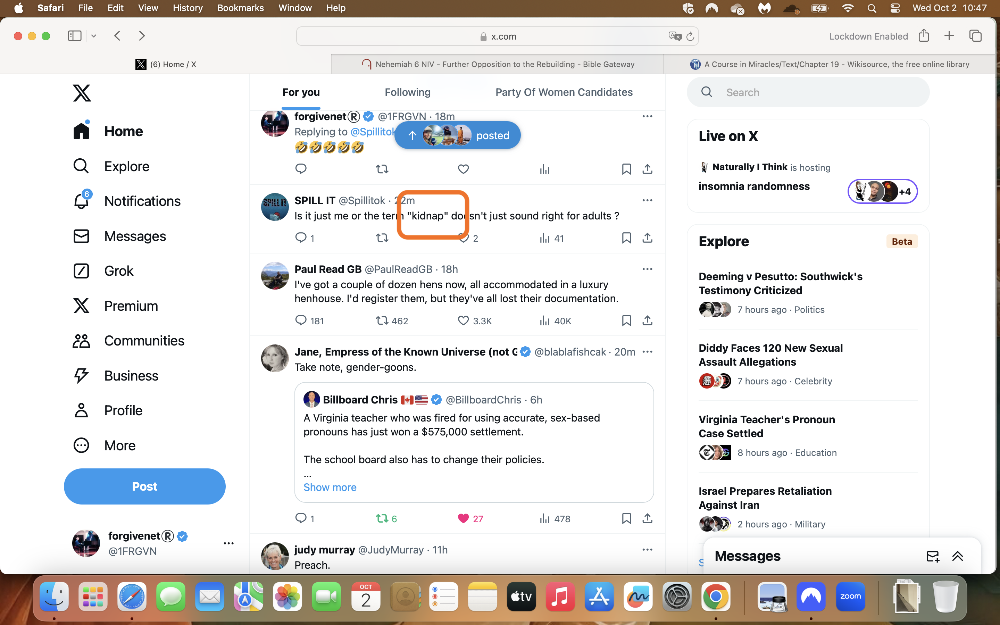 

- There would often be a *flurry* of threatening language in notifications or on the UI thread itself.
- It would be part of apparently normal posts too, as if the criminal software could pull in multiple posts with threatening language at the press of a button.

##### 3.

 

- This account is obviously referring to Domingo.

##### 4.

 

- Initially, as I was drafting this section up, I was not sure why I screenshot this one.
- Then I saw it was the sole account that this account was following.


 

- The Lydia Edge porn account had DM'ed me, in fact.


- The name is a reference to me as I had called myself Detective Lydia at one stage while hunting down the stalkers.
- *Edge* is a reference to an opening in my internet communication that allows multiple hackers to access my UI and tailor its content.
- Often, hackers would access huge accounts like this one with 2.4M followers, appearing to have owner-rights, as if there's a master-login which gives unfettered admin access to the whole X platform.
- My guess, it being 18 months later, is that the translated text was indeed threatening - as part of a CSS hack (see [an example of that here](#3-translation-hack-example)) - but I did not screenshot the translation at the time so it is innocuous now.
- Directing me to an account which has heaps of foreign text they can use to write a message to me via CSS when I translate it was a common misuse of my machine.

##### 5.


 

- Pretty sinister.

##### 6.


- This is exactly how I used to look in 2006-2009, and earlier.
- Obviously, the account name is a play on words with my name, *Katie*, the Spanish say *Kati*.
- As usual, an account with a "message" for me like this likes a post of mine and I see it in notifications.

 

- This is exactly how the conversation with Hazel Smith and others begins in earnest in December 2024, unbeknownst to them watched by multiple agencies.

##### 7.

 

- The repeated threat from Hazel (I assume) that I mentioned seeing in [March](march/1-12.md#online-stalkers) when the threats were intended to kill.

##### 8. 

 

- This fake account references the top-hat meme.
- I wonder if Hazel came into my apartment wearing a top-hat.
- I’ve a vague memory of something like this actually happening.
- I guess there's a copy of the film somewhere.

##### 9.

- In a DM with someone, they urge me to leave the town.
- I explain why I feel I cannot leave.

 

- Something was indeed keeping me there, even during [the serious poisoning with the intent to murder](#serious-poisoning-with-intent-to-kill).
- I can only say that whatever it was protected me and kept me alive so that I could tell the story; which is the same story for countless voiceless souls.
- At the end of the month, one of the accounts which posted previously about the [*rogue government official*](#meeting-inma-and-paloma-the-spanish-official-in-madrid) posts that they have been asked to behave; my assumption is by the police.
- Do the police tell Hazel and co. to calm down when they get out of control?
- Does anyone expect these people to calm down and behave?

## Fake accounts, tweets, and Google searches

##### 1.

- Let's see what was "popping up" on Google search results using the "`@jctot19` X" search term in early October 2024.


- The first entry is indeed interesting, translating as: *Two weeks ago, a child prostitution network walked free from court with the support of the Spanish national police.*
- Does the fact that there are just two relevant results, and one of them is Rocio Vidal, again, suggest that those responsible for hacking, and whatever else they did to [Rocio Vidal](../2023/october.md#rocio-vidal), are the very same gang?

##### 2.

 

- `@SisterKaff` is an obvious reference to me.
- This account was used to gain my sympathy, I believe.
- The patchwork design started to come up in various guises; one was a painting the trumpet teacher was doing that I had apparently inspired which in retrospect was obviously [the three siblings](../../crimes/protagonists/vidal-sastre.md#a-man-called-bruno-with-at-least-one-son-called-bruno) that may well be Gloria the conservatory receptionist, Ivan the terror of the Marina Alta, and [the man that blew in my face in March](march/13-end.md#wednesday-13th-march) on the evening I became convinced I was going to be murdered. 
- Is Ivan a painter?
- The painting I was shown repeatedly had these three sitting reading comics and the background was like a patchwork quilt of comic book titles.
- I liked it.
- I may have screenshot this somewhere.
- There was a big vacant space in the trumpet teacher's lap which I wondered about.
- Is this his usual game with targets?
- The other curious thing about this particular account is that the woman looks like Grace from Polygon, and a woman who was [following me in Lourdes in August](august.md#interview-with-the-hacker).

##### 3. Translation hack example

 

- This is a good example of a threatening CSS translation hack.

##### 4.

- Google search results on my account.
- The suspected targets I posted are coming up primarily.

 

##### 5. Drugs in the toothpaste

- I realize that I had ingested something that had made me feel overwhelmingly sexually aroused in the car on [Hanuman Jayanti in April 2023](../2023/april.md#hanuman-jayanti).
- I'm trying to figure out if it was something I had taken before I left my apartment (toothpaste maybe) or whether something had been added to the air system in my car.

 

- Indeed, it was about one hour after I set off that morning when I felt the effects kicking in.
- Another X user is understandably horrified by my question, but I don't want to divulge my reasoning.
- Two users confirm the hour duration.
- I'm guessing it must have been in my toothpaste as that is *always* the last thing I do before I leave the house - which they will know very well having been under constant surveillance for over a year already.
- I took the toothpaste with me, of course, which will explain the continued sexual arousal while I was away too.
