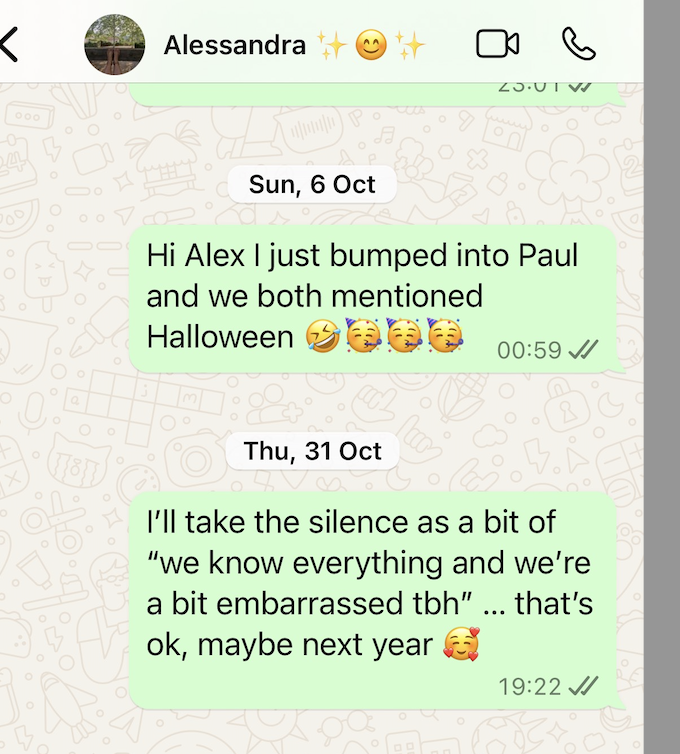

## Bump into Paul again

- On 6th October, my way to the Indian restaurant, I bump into Paul who is having a beer at the Open 24 Market at Plaza Benidorm, the usual place I "bump" into him.
- We chat a bit, I tell him I'm thinking about running women's rights activities in Denia.
- There is a lot unsaid as the last time I spoke to him, in the same spot, I mentioned that I was willing to pay EUR 500 for copies of the hacked sexual videos.
- I mentioned Halloween was coming up and did he think we should go out again. I said I would WhatsApp Alex about it.
- I did. She didn't reply.
- On Halloween I text the following:

{width=55%}

- There's no reply.

## Fatima

- I head to Madrid to stay one night before moving onto Fatima in Portugal. I need to be away from Denia as much as possible for my nervous system.

!!! warning "Why didn't you leave?"
    - If I leave, then the story gets buried, the police do not investigate, and it happens again and again, and maybe someone is driven, again?, to suicide, or maybe they, again?, murder someone with poison.

## Poisoning

- I travel to Fatima in Portugal over 19th - 27th October.
- On Friday 25th October, in Fatima, I'm made redundant from my job.
- I arrive back in Denia on 27th October.
- On Monday 28th October, I get an excruciating headache at home. 
- While sitting at my desk, I experience shooting nerve pains all over my face.
- My kidneys start to ache over the week, worse and worse.
- My urine becomes extremely frothy and it was fine the week before in Fatima.

{width=65%}

- I feel like I'm being poisoned over this week in my flat.
- I take some samples of water and items related to the air vents to London in the hope that the police will one day find things serious enough to investigate and I will have things for them to look at.

## Trying to find the cameras

- I'm absolutely sure there are cameras in my flat but they are impossible to find.
- There is a huge hole in the wall behind the bathroom mirror, however.
- I'm interested in one particular network I can see on the networks around: **Casa LANister**.

- I'm also very interested in the group of networked devices named **Cascadas** which I believe are the hidden cameras but only an investigative team would be able to confirm this.

## The police trafficking email

