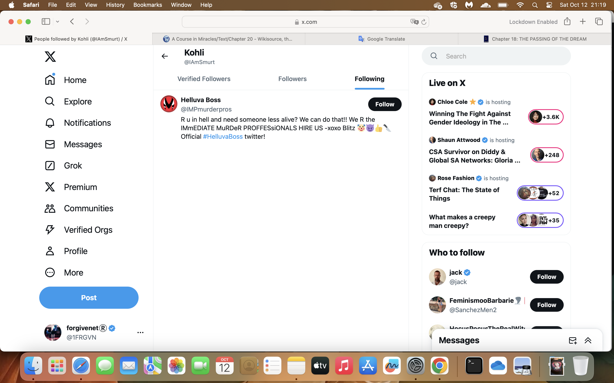

# October 2024

## Poison warnings

- I start to see references (warnings?) about poisoning.
- The reference to gay men and muscle men here makes me think of Domingo.

- The message says: "Enjoy my homemade poison. The poison made by my own family..".

## Is there a bible in the house?

- I start to see continued X posts that refer to whether there is a "bible in the house".
- This is usually written as a question.
- I bought a bible during this time.
- I believe someone was trying to warn me that the poison dose was going up and murder was the intention. Hence, a bible in the house for the priest to perform the last rights.
- These posts were in English and Spanish sometimes too.

## Activity in apartment number 18 next door

- The next door apartment is barely used. I've heard people in there maybe twice for no more than a week in nearly three years.
- There may have been people there for the summer holidays, while I was away, so I never thought it odd.
- Whenever my neighbor Marie Carmen, or Pedro the caretaker, referred to the people at number 18, it was always in a derogatory way, with a turned up nose, as if there was something not good about them.
- However, from the moment I arrive back in Dénia at the end of September 2024, there is a lot of activity in this apartment. People coming and going at all times. People talking loudly at night.
- I saw a slim woman with shortish dark curly hair, of about 60 years old, going in and out every day nearly.
- One night, I hear a woman say in Spanish, loudly enough for me to hear, "and nothing was ever good enough for her", and I presumed she was referring to me. 
- I guess that this is the main lie the people of Dénia have been told about me and why they all support the gang stalkers and join in if they're so inclined. The foreign woman who thought nothing was good enough in Dénia, which is as far from the truth as possible.
- They only needed a couple of people who I had contentious interactions with over the years to support that. 
- One of those could possibly be my neighbor from Cami Llavador, Charo, who really didn't like me at all.
- Another could be a woman Magpie I had been friends with years ago in 2006, someone who got extremely angry with me one afternoon after I said something rather innocuous yet truthful, something she found extremely hurtful.
- I guess manipulating a whole town to hate someone can be really easy.

## Iceland

- I pop to Iceland in Benissa to get some British products.
- I wear my mask.
- I'm served at the till by a nice-looking blond woman who smiles at me like I'm an idiot.
- When I get home, on X, I see a fake account with with the woman in it.
- She is sitting on a balcony wall somewhere in the Marina Alta region with a view of the sea and mountains.
- She is wearing a man's shirt.

## Saturday 5th October

- I go for a walk along Las Rotas.
- I take my analog phone so I'm not tracked and followed.
- I'm tracked and followed.
- Just before the restaurant Sendra, Carmen Cano passes me on a bike, u-turns abruptly and stops to stare at me, grins and cycles off.
- I have this on camera.
- I tweet about this later on and it is translated a lot.

## Sunday 6th October

- I go for a walk along Las Marinas beach in the afternoon.
- I am followed by older men the whole way along, men in their 50s and 60s.
- On the way back home a couple starts walking in front of me.
- The woman on the left is someone I've seen on a Twitter fake account and I had a screenshot of this prior to losing access to my machine on 1st December. She has quite a masculine body.
- She has the same tattoo as the [innocent lady who gets into porn](august.md#photos-of-abused-women-and-girls) on her arm and she takes pains to show me.
- The man on her right smiles and shows me his face. He looks like a possum.
- I have this on camera.
- I never go to the beach again.
- Back home that night a fake account says possum man is looking for developers. The inference is I'm being offered a job in tech.

!!! warning
    - Something I realize now is that throughout the intense cyber stalking period, I would say September 2023 to May 2024, accounts about possums would regularly pop up on my Twitter feed; e.g. a possum of the day account came up regularly for ages.
    - Like other accounts I saw with great regularity, violence and porn specifically, I never followed any of these accounts and it never made any sense for me to see them.

- I do not know what any of this means. Is it more tricks to scare me? Why would they put so much effort into it. I don't understand. The whole thing makes no sense.
- And how is anyone supposed to know what's going on if no one ever talks to you and if they can only lie anyway?

## Job offer

- The following day I'm contacted on LinkedIn by a yacht company based in Altea with a job offer which I refuse because I'm certain it's a scam.

## Bumping into Paul again

- On 6th October, on my way to the Indian restaurant, I bump into Paul who is having a beer at the Open 24 Market at Plaza Benidorm, the usual place I "bump" into him.
- He's clearly been asked to check up on me.
- We chat a bit. I tell him I'm thinking about running women's rights activities in Dénia.
- There is a lot unsaid. 
- The last time I spoke to him, in the same spot probably sometime in July, I mentioned that I was willing to pay EUR 500 for copies of the hacked sexual videos.
- He had mentioned another guy at that time, an English man, being very popular with everyone, all the girls coming up to him and saying hello as if they knew him.
- I wasn't sure how this related to what I'd just said.
- I mentioned Halloween was coming up and did he think we should go out again. I said I would WhatsApp Alex about it.
- I did. She didn't reply.
- On Halloween I text the following:

- There's no reply.

## Threats at the laundry

- Whenever I go to the laundry, there is some stalker activity or another.
- This has been true since they started to drug me back in December 2022.
- Of course, they know where I'm going and what I'm doing so they can spring into action whenever they like.
- On two occasions in October, threatening young men are in the laundry while I'm there. The first group are speaking about 4 or 5 different languages. 
- The second group stares at me menacingly. I stare right on back.

## Rape porn gangs

- I tweet about my suspicions about what is going on: https://x.com/1FRGVN/status/1845101018746343666, and include some fake accounts to describe what I'm seeing.

## Bullying at work

- Polygon are more obviously building up to firing me.
- Colleagues' demeanor towards me in [Bali](may.md#bali) really solidified what had been going on since the previous November.
- I have requested an investigation done with regards to being targeted continually for my [women's rights activism](june.md#uk).
- The HR team has a meeting in which they mention me specifically in a underhand way. They mention the word 'Fetch' over and over for no reason. Fetch is a direct reference to when I was working at a company in Cambridge and a man flashed at me in an online meeting.
- HR professionals share stories like these so that women will eventually be driven out of tech for good. They've very nearly achieved this goal.
- Gabriel Silva makes sure to mention we all watch this meeting if we didn't attend, especially me.
- Polygon hires the [man who isn't very competent](../2023/june.md#work-stress) and doesn't like women who correct his mistakes, but has a very loud voice, that I had worked with before.

## Fatima

- I head to Madrid to stay one night before traveling to Fatima in Portugal. I need to be away from Dénia as much as possible for my nervous system.

!!! warning "Why didn't you leave Dénia?"
    - If I leave, then the story gets buried, the police do not investigate, and it happens again and again, and maybe someone is driven, again?, to suicide, or maybe they, again?, murder someone with poison, and children, again?, could be groomed into goodness knows what.
    - I felt a sense of obligation to the vulnerable and I've been waiting for my intuition to tell me what to do.
    - I was always working so hard, I had to think about that above and beyond everything else.
    - It was never clear where I could go to either. I still don't know. My family home in London is non-optimal.

- Just before I leave on Saturday 12th October, I empty the bins. 
- There is a man in the driver's seat of a car staring at me angrily. 
- His wife is embarrassed and looking down in the passenger seat. 
- I remain amazed that anyone could be angry at the person they have been terrorizing relentlessly. I guess it's guilt. I tweet about it and suggest the man, if he didn't like the porn of me masturbating that everyone has seen, he should take it up with the local porn technicians.
- I tweet about it: https://x.com/1FRGVN/status/1847579824128139602.
- As I'm driving to the hotel I've booked in Madrid, all of a sudden, the volume disappears on Google maps so I'm lost on the busy M30/M40 junctions.
- When I stop, it's impossible to see how to fix this, and I try every permutation of getting the Google voice to come back. Nothing works.
- When I arrive in Fatima the following evening, even though my iPhone camera is blocked, I get notifications on fake accounts of items in my hotel room. Of course, only the camera facing me is blocked, not the one looking out.

## The router malfunctions while I'm in Fatima

- On Tuesday 22nd October around 11am, my router at home malfunctions.

{width=55%}

- My home security camera is unavailable.
- I wonder if my home was accessed over the few days before I returned.

!!! danger
    - Given the next week's experience with my health, and the ongoing health problems over the next months, including declining eyesight and a diagnosis of PACS, I believe it is highly likely Domingo the piano teacher's family or associates accessed my home and were able to apply poison to food and even toiletries that I have taken with me.

- Here is the [WhatsApp chat with Movistar](../../content/whatsapps/WhatsApp%20Chat%20with%20Movistar.zip) where I explain I have been hacked and ask them to investigate.

## Polygon fires the whole writing team

- I'm fired summarily on 25th October, [as expected](#bullying-at-work).
- The constant dehumanizing up to now didn't work so they had to think of something more formal.
- I'm told the whole team is dismissed as they are no longer required.
- I know it's because of my anti-woke, women's rights activities and the extraordinary manner in which an industrial spy was able to cause enormous trouble with the tech systems, and consequently find out about my private political activities and managed to stick the boot in for me, just weeks after I started.
- The dismissal letter explains the company is aware it is an unlawful dismissal, but I'm supposed to accept it.
- I instruct a lawyer to help me who appears to be on Polygon's side.
- I suspect they continue to hire one of my team, Hans; a man who was outrageously insubordinate towards me when I was his manager.
- Hans appeared to be instructed to be subordinate towards me which included shouting me down in meetings, constant heckling, not doing any work at all, complaining about me to my manager, and more.
- Whenever I asked for help from my managers with him, I was ignored.
- Hans was good as gold with Gabriel Silva when he took over.
- I suspect he's working there now still.

## Serious poisoning with intent to harm or kill

!!! danger
    - It is a crime to poison people with the intent to harm or kill.
    - It is a crime to access someone's home without their permission in order to do so.

- I arrive back in Dénia on 27th October.
- On Monday 28th October, I get an inexplicable and excruciating headache at home which lasts a couple of days. 
- While sitting at my desk, on the Monday morning, drinking my coffee, I experience shooting nerve pains all over my face.
- My kidneys start to really ache over the week; the dull aching gets worse and worse.

!!! info "Pain in kidneys"
    - I have experienced pain like this (although not as intense) continuously while I'm in my flat in Dénia since, probably, January 2023.
    - I can describe it as a dull backache that starts about midday and gets worse until I have to lie down for a bit.

- My urine becomes extremely frothy and it was fine the week before in Fatima.

- I really feel like I'm being poisoned over this week in my flat, and quite intensely too.
- Someone wants me to get seriously sick and/or possibly die.
- If my dad did not have an accident on the 1st of November, and I had to rush back to London, I believe that Domingo's family may have made good on their threats and killed me via poisoning.
- I take some samples of water and items related to the air vents to London in the hope that the police will one day find things serious enough to investigate and I will have evidence for them to analyze.
- There is another warning and condemnation about poisoning given via a fake account on Halloween night, the 1st November.

- That day, Friday 1st November, in the afternoon, I'm certain I see Carmen Cano and the woman I have seen going in and out of number 18 leaving the building together. They smile at me as I walk by.

## Nota simple from the neighbors flats

- I'm trying to figure out how they're poisoning me.
- My kitchen, where the water from the mains comes in that I use in tea, coffee, cooking, etc (I never drink it without boiling first) backs onto Marie Carmen's flat, number 16, and there is a big wardrobe in her flat against the joining wall.

!!! danger
    - There is a weird mechanism I always thought strange under the sink where a small plastic extremely dirty pipe comes out and into the water pipe.

!!! danger "Alert, something I just remembered"
    - I remember being in my flat, at work or relaxing, and hearing the water pipes in the kitchen squeaking as if they were moving around.
    - This was during 2022 and 2023, maybe once in 2024.
    - I remember thinking it must have been cockroaches under the sink walking on the water pipe (which is like a hose) and I would go to check and see nothing.
    - I wonder now was Marie Carmen, or someone else, accessing my water pipes from her flat somehow?
    - Another weird sound was a short puff of air I would hear on a regular basis. I thought it was the hot water boiler. Now I'm not so sure.

- Is there some mechanism to access the apartment's drinking water in Marie Carmen's flat?
- I get the paperwork for the flat on the other side, number 18. This apartment backs onto my bedroom and bathroom wall.
    - [Nota simple number 18](../../content/documents/evidence/number%2018%20beside%20me%20bedroom%20wall.pdf).
- And I get the paperwork for the flat above mine, number 23.
    - [Note simple number 23](../../content/documents/evidence/number%2023%20upstairs.pdf).

## Trying to find the cameras

- I'm absolutely sure there are cameras in my flat but they are impossible to find.
- There is a huge purposeful hole in the wall behind the bathroom mirror, however.
- There is another one behind the sofa on the wall.
- I'm interested in one particular network I can see on the networks around: **Casa LANister**.

- I'm also very interested in the group of networked devices named **Cascadas** which I believe are the hidden cameras but only an investigative team would be able to confirm this.

## The police trafficking email

- I send a mail to the `trata@policia.es` email, an anonymous email where I'm told I can send information safely.
- [The email and responses](../../content/documents/emails/trata@policia.pdf).
- I get a response from Dénia police who were [decidedly unhelpful in February](february.md#policia-nacional).
- I do not respond.

## Silvia

- The hackers imply that Silvia is the trumpet teacher's daughter and post pictures of a child who is supposed to be her.
- The implication is that the trumpet teacher had a drug debt that he couldn't pay off and the pornographers had threatened to target his daughter Silvia.
- In order to avoid this, the trumpet teacher had agreed to target and drug me at the conservatory of Dénia.

- The profile pic came through a DM to me on Twitter with a reference to pornography with the child in the photo. I report this to Twitter.

  
 

- I tweet about this and post on Facebook.
- I don't know if it's true or yet another made up intrigue.

## Suspected targets

- There were a lot of minors posted on face accounts this month. 
- I reported all suspected minors to Twitter.

| Some suspected targets posted in October |
|-|
|  
Is this woman and the one below the same person? |
|   
This looks like the woman on the beach with the tattoo.|
|   |
|  
Looks like a minor. |
|   |
|   |
| 
The profile account name references "car lady".  |
| 
The picture above looks like it's coming from a hacked phone.  |
| 
The street is the Calle Loreto in Dénia.  |
|   
Another minor child. |
|  
The profile in which the child is included which references porn. |
|   |
|   |

## Threats

| Threats posted in October |
|-|
| 
This same account had come up in March and I found the message threatening.
|  
|  
|  
| 
|  
|  
|  
|  
|  
|  
|  
|  
|  
|  
Message from Hazel probably.
|  

## Fake accounts and tweets

| Fake account activity  |
|-|
|  |
|  |
|  |
|  |
|  |
|  |
|  |
|  |
|  |
|  |
|  |
|  |
|  |
|  |
|  |
|  |

