# September 2024

## In Cauterets

- I spend most of September in Cauterets.
- I am highly sexually aroused and I think about the trumpet teacher constantly.
- When I'm scheduled to be away from my room, I see young "gypsy-looking" men dressed in black with pale skin and black hair, (techs), entering my hotel building and going to the elevator I just got out of with a look of intent in their eyes.
- I'm suspicious of them. They've timed it so I see them.
- I see [Rocio Vidal](../2023/october.md#rocio-vidal) in the cafe with a bunch of Spanish men. They ensure she stands up so I see her as I pass.
- The walking guides I use talk about how the *Spanish are crazy* in a way that makes me think of the Pelicot men and their total lack of concern towards a targeted woman as if they forgot women are also human (the whole point of porn).
- My "friend" [Sandra Rita Diaz](../early-years/2014.md#sandra-rita-diaz), a woman who signed up to serve Mary at the baths with the Hospitalite of Lourdes in 2014 and was in my intake group, visits my room for five minutes and uses my bathroom.
- I have always had my suspicions but something's not right with Sandra. 
- She is constantly talking about the old women she sings with in the choir; in particular one woman, Mireille, who is apparently evil, *everyone says so*, giggle.
- Sandra says she thinks Mireille is poisoning her.
- She also says, contradicting herself, that Mireille loves her so much she wants her to live in the flat next door and look after her when she's old.
- She constantly talks about devil worship at Lourdes.
- She talks about the magic spells her family does on people.
- She visits Cauterets for a few days and spends a lot of time with me. I didn't ask her to come.
- I tell her about the trumpet teacher, how I'm still hopelessly in love with him, that he's the love of my life, that I don't care if he did gay porn, he must have been groomed and coerced if not outright blackmailed, and how I'm still being terrorized by Domingo's family and others in Denia.
- I tell her about [Irene](august.md#irene-the-plate-lady) and [the handwritten letters](august.md#the-handwritten-letters).

### The Royalty

- We go for dinner one Sunday evening at the Royalty restaurant.
- We drink wine.
- Sandra is talking about men again and giggling as if she's embarrassed and naive.
- It seems like an act.
- I can't remember the exact words of our conversation, but I said something that implied I didn't trust Sandra.
- She picked up on it immediately.
- She wanted to know what I meant.
- She was insistent.
- I told her I'd tell her in 20 years.
- She asks again and again.
- I repeat my answer and say nothing more.
- She asks to use my toilet again on the way home.
- When we're in my room, I show her one of the letters.
- She reads a bit and then she says, in her giggly naive voice, "are you starting studies again at the conservatory when you get back?"
- I am AMAZED! 
- I shout, "Are you insane?"
- She keeps her head down and doesn't say anything.
- After about a minute, she says softly, no I am not insane.
- The next day she is upset with me, different, anxious.

### The hairdresser

- I'm having my haircut in Cauterets.
- I ask if Sandra wouldn't mind explaining to the hairdresser what I need to have done because my French is so appalling.
- She does, but I see Sandra telling the woman something else too, in low tones.
- I wonder what it was.
- Whatever it was [rears its ugly head](../2025/august.md#haircut) in August 2025.

### Random messages

- I get a bunch of random messages on Signal, Telegram, and WhatsApp.
- Here's one from a [random Peruvian](../../content/whatsapps/WhatsApp%20Chat%20with%20random%20Peruvian%20+51%20943%20801%20768.zip) who is asking for lodgings for the night.

## Who Is This?

- I start a Twitter hashtag [#WhoIsThisSeries](https://x.com/hashtag/WhoIsThisSeries?src=hashtag_click&f=live) and post some of the pics I've been seeing of women who look like they're being abused.
- Example: https://x.com/1FRGVN/status/1838259385233002736.
- Patricia sends an email around with the subject "Who Is This".
- I consider this more confirmation that Patricia knows exactly what is going on.

- The [email sparks off some conversations between us](../../content/documents/emails/who-is-this.pdf) and I get a chance to express my anger at Chris BJ who I believe knew exactly what was happening and how much danger I was in.
- Her email responses seem to suggest this was indeed the case too.
- She only lies about the "porn" reference which I 100% remember her saying.
- A few fake accounts give opinions on the email and what was said. 
- One said they liked what I said at the end, that "we're all in porn".

## Another upsetting targeted woman

- I start to see another woman, over and over, every day.
- It's the same pattern [as before](august.md#grooming-an-innocent-girl-into-porn-101). 
- The woman appears to be innocently on a date, then she is sending nudes. 
- There are a whole bunch of "nearly nudes" where she is in see-through lingerie and taking selfies of herself probably in her sitting room: https://x.com/StantonHan27273/status/1837180521790546020/photo/1.
- Finally, I saw a whole series of pics where she is in the passenger seat of a car. You can see people (men) close by to her that are not the person with the camera. 
- I saw a small man crouching down near the driver's seat.
- I wonder if it started as a regular date.
- She is being photographed with clothes, then less clothes, then naked, and she looks like she's likely sedated and can't do anything about her situation.
- The inference is that something very dreadful and violent happens to her in the back of the car with a bunch of men around her.

| Car woman |
|-|
|  |
| 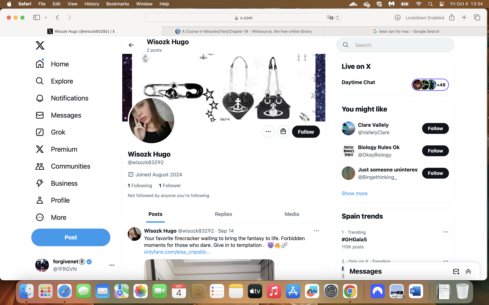 |
|  |
|  She looks like she is doing a ballet pose and I wonder if she was a dancer in the Generalitat's conservatory systems. |
| 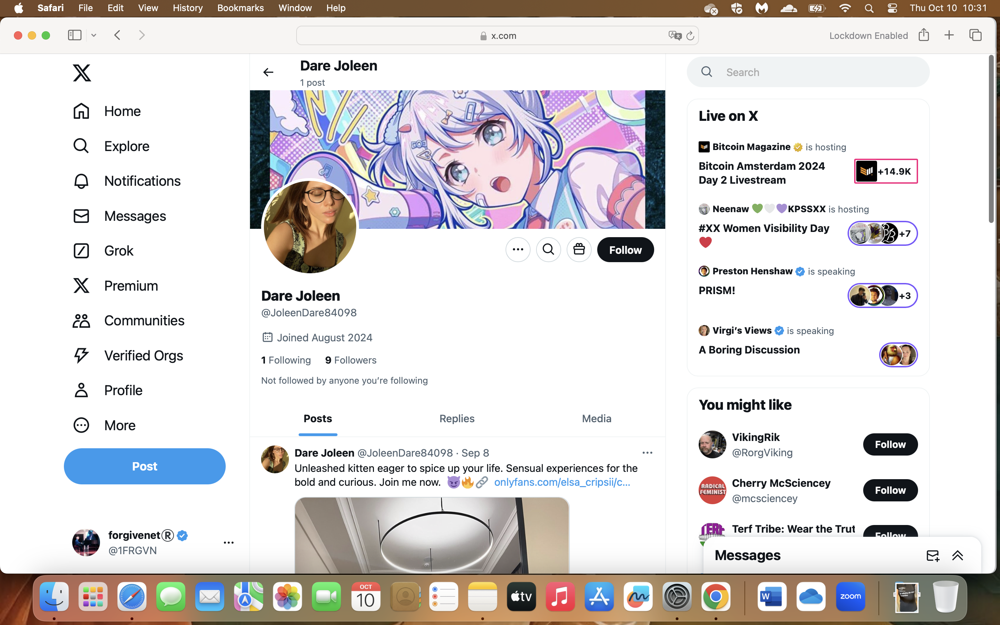 |
| 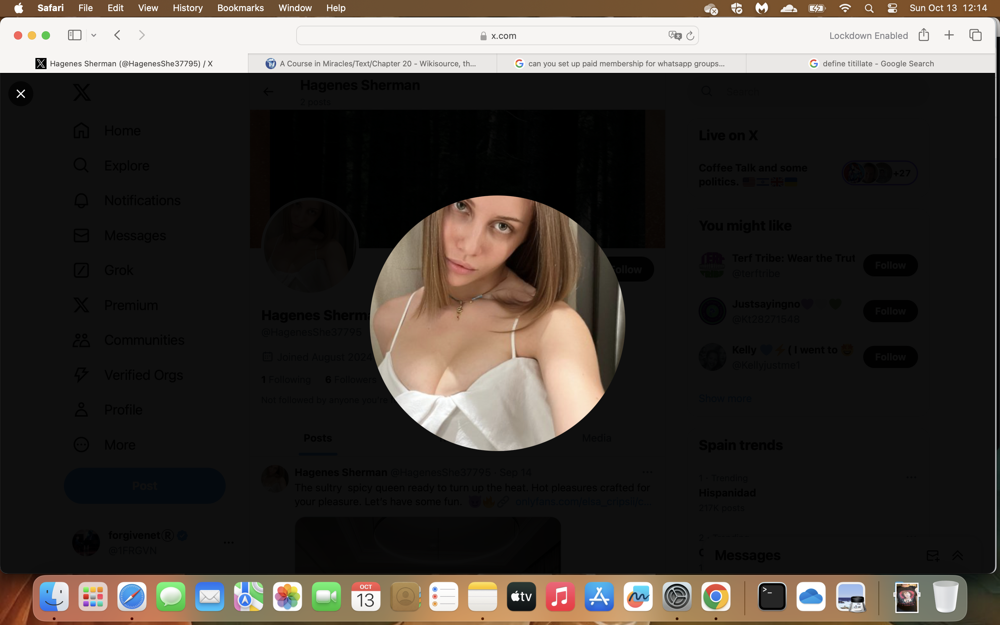 |
|  |
|  |
| 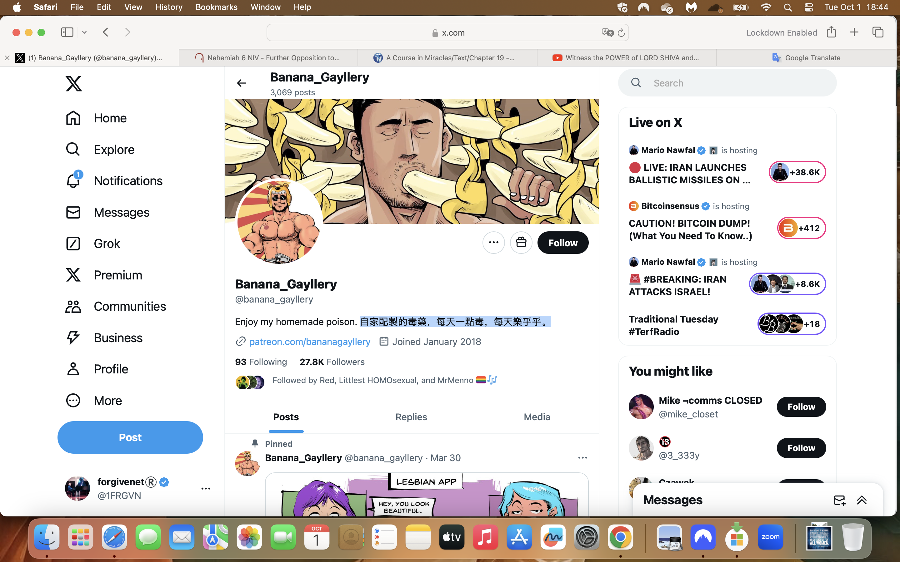 
This picture has the bananas and reminds me of the nude the woman sends while eating a banana. This fake account was sent to me at the beginning of October and references "home made poison". |

## TEB in Dublin

- The reason I see Inma in Madrid is because I'm traveling to Dublin for TEB so I drive to Madrid and fly from there.
- One of the participants alludes to this woman.

## The conversation continues

- The conservation with the hacker continues while I'm in France up until the 21st September.
- However, it is not as intimate as before, and the threats and porn are back again.

## Letters

- I send as many letters as I can while I'm in France to as many people as possible.
- The reason I do this is because this is the only way I can communicate with anyone without the hackers and the whole criminal gang being aware of it.
- I add photos that he has sent to me too, even thought I'm not sure if they are legit or not.
- Certainly the screenshot of the concert I see in [June 2023 on Youtube](../2023/june.md#another-young-girls-funeral) is legit and I send a copy of that in the pack.
- At some point back in Dénia, I see a giant message come up on my screen "thank you", and then it's gone.

### Rocio Vidal

- My eyesight's not very good so I don't really trust it too much, but I swear to God I thought I saw Rocio Vidal in Cauterets while all this was going on.
- Could she have been there?

## Lourdes with dad

- My dad was aware of everything that was going on, I had explained everything to him in September 2024 in Lourdes and he appeared to understand the nature of my situation and how much danger I was in.
- As I told him my story, he kept saying: *heavy*, *heavy*,; I thought it was just him taking the piss, as he usually does. He then told me to be careful as I could be beaten by a man and made to be a prostitute.
- Did he pretend to understand the nature of what was going on, and be supportive to me, and then tell my mother and brother I was not to be believed?
- One evening we took a walk through the sanctuary. As we passed the baths, at the men's side, one of the doors was completely open and you could see all the way into a bathing chamber.
- This was unprecedented, something you *never* see in Lourdes.
- I took it to mean Mary was extending my father an invitation to bathe, to cleanse, to redeem himself.
- He did not accept the invitation.
- I made sure to remind him the invitation is always open; doing the right thing is always an option.

## Driving back to Dénia

- As I drive into Dénia I notice the huge billboard for the swinger club, Hedonia.
- I've seen it before.
- I tweet about it in October: https://x.com/1FRGVN/status/1845101018746343666.
- Something on it strikes me this time, however, which is the pictures of robot masks which I have seen on Google searches, and the mention of "special events".
- I mention it to the hacker. I wonder if "special events" includes groomed and sedated women that aren't really consenting, and well know men in the community hidden behind masks.
- I ask the hacker/trumpet teacher if that was his intention when meeting me at Alicante airport on [18th June 2023](../2023/june.md#sunday-18th-june-alicante-airport); my very own "special event".

## Suspected targets

| Suspected targets posted in September |
|-|
|   
|  |
|  |
|  |
|  |
|  |
| 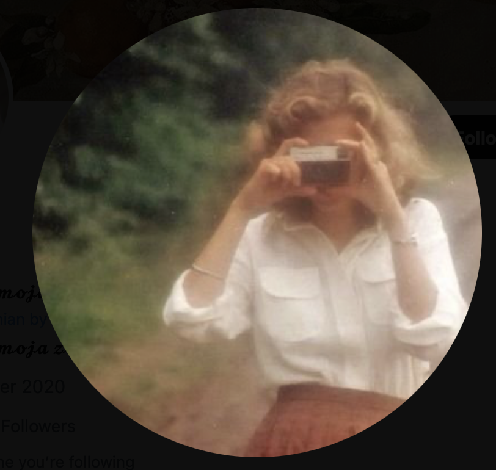 |
|  
I think the above pic is probably a well-known Spanish actress but it came up on a fake account. |
| 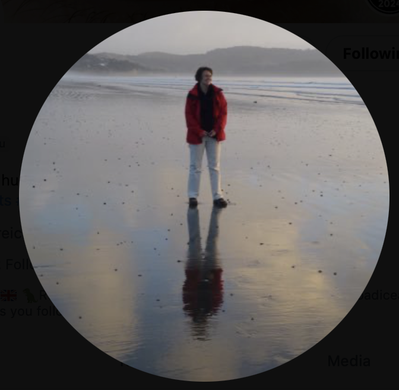  |
| 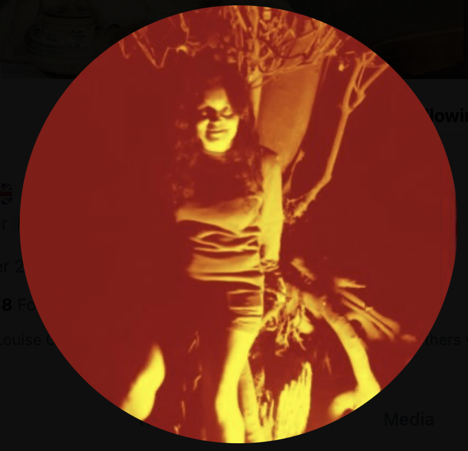  |
|   |
|   |
|  
Is the pic above hidden camera footage? Over a bathtub? |
| 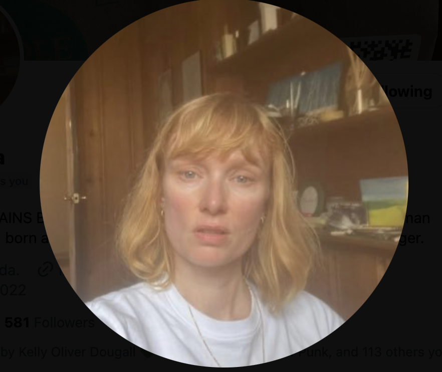 
This picture must be of a woman seeing evidence of herself being filmed without her knowledge.  |
| 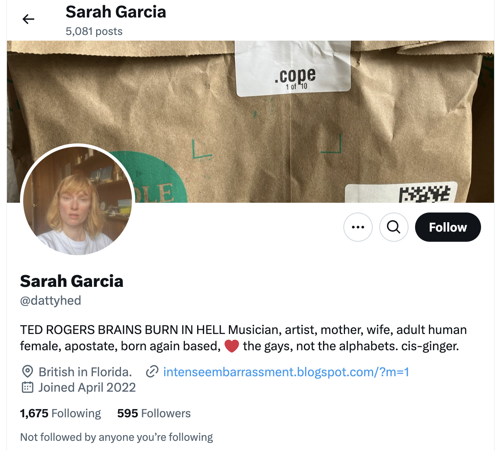 
The full profile mentions "intense embarrassment" and I wonder if I'm seeing the shocking moments of when targets "find out" prior to blackmailing or sexual exploitation. I wonder if the men delight at these moments and roar with laughter at the tricked and suffering women. |
| 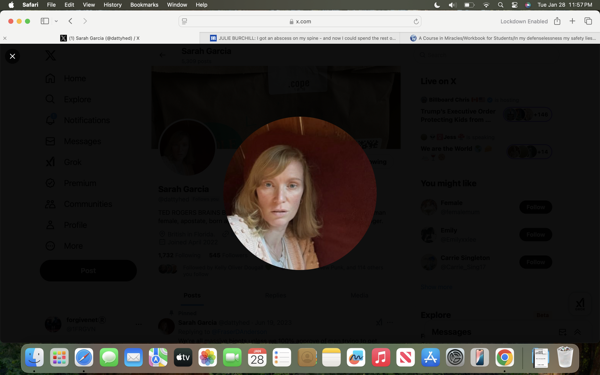 
New profile pic of this one posted January 2025 |
|  
Curious pic, it's not clear what/where the camera is that the woman is looking at |
| 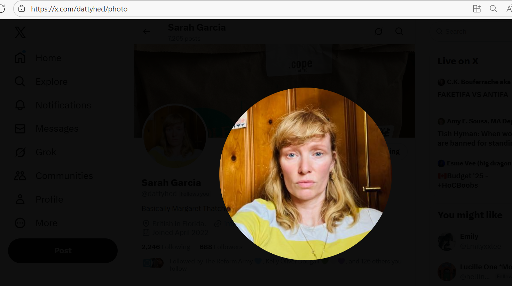 
This view of her looks like a face that has been AI'ed into other stalker accounts |
| 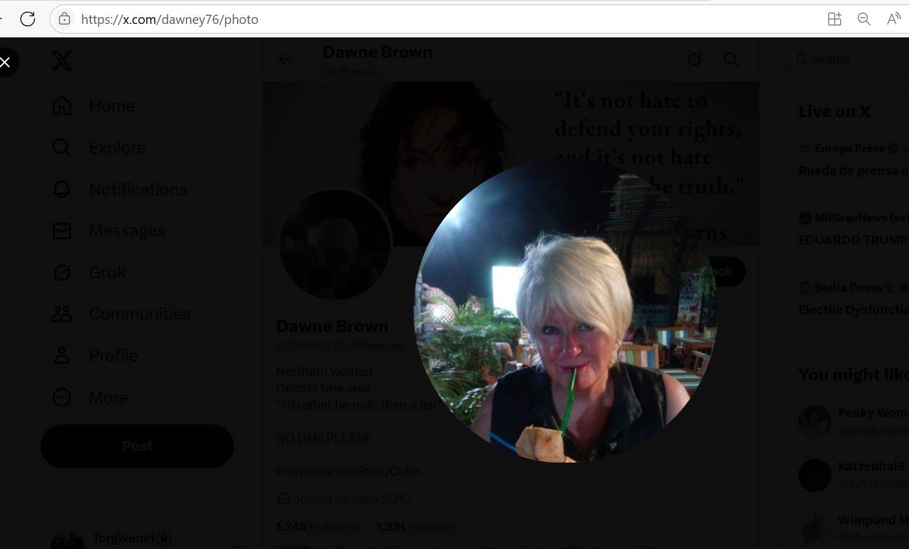  |
| 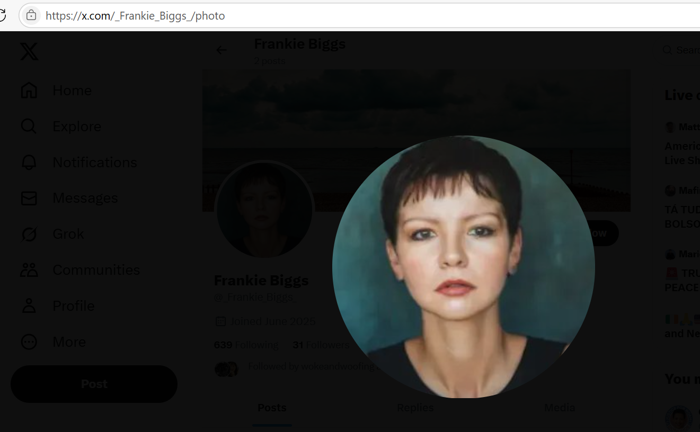 
Feels like a red herring or AI mix. |

- I must mention that I also saw a woman crying in her bedroom, crouched down against the wall. I wish I'd screenshot this pic as it looked like it came from a secret camera probably around the air vents, maybe in a screw?

## Threats

- At some point I see this pic in Google search.

- It reminds me of a response to a tweet in March, probably when the [cyber stalking and threats were most intense](march/1-12.md#tuesday-12th-march) just before or after the piano concert.
- I tweet about it: https://x.com/1FRGVN/status/1835765992556818662.
- At that moment, a monster face like the one in the pic simply appeared in the middle of my Twitter timeline, completely out of nowhere.
- It was shocking and I realized they had total control of everything I could see on Twitter but I was so stressed I had to file it away to think about later.

### Murder

- Here's a threatening message example.

- And a warning to me about murder maybe. 
- I was going back to my flat at the end of September and I think they really intended to poison me to get rid of me seeing as I just wouldn't leave Dénia.
- It must have been extremely annoying that I never left, but I'm conscious, even now, that leaving Dénia means I'm open to being targeted out of sight, in a far worse manner probably.

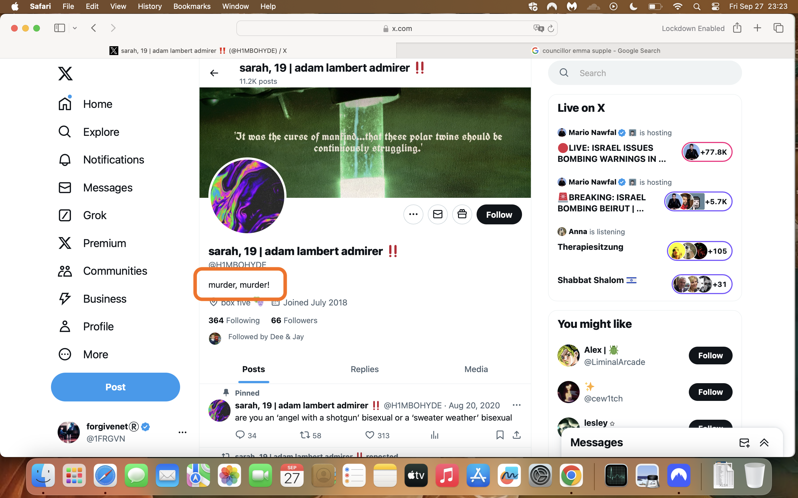

### Poisoning

- I wonder if this fake account contains an explanation of how they managed to drug me in class at the conservatory, some sort of "cat ear medicine" meaning did they manage to put a puff of powder in my ear?
- Could that have happened while going into the conservatory before class and being surrounded by a crowd of people while going up the stairs?

- I tweet about how people could be being spiked over long periods with drugs. The tweet is translated a lot.

- I post an example of my proteinuria which has been bad since I had a chest infection at the end of August.

- The cat ear medicine account says they are so sorry.

## Google searches

| Google searches from September |
|-|
| 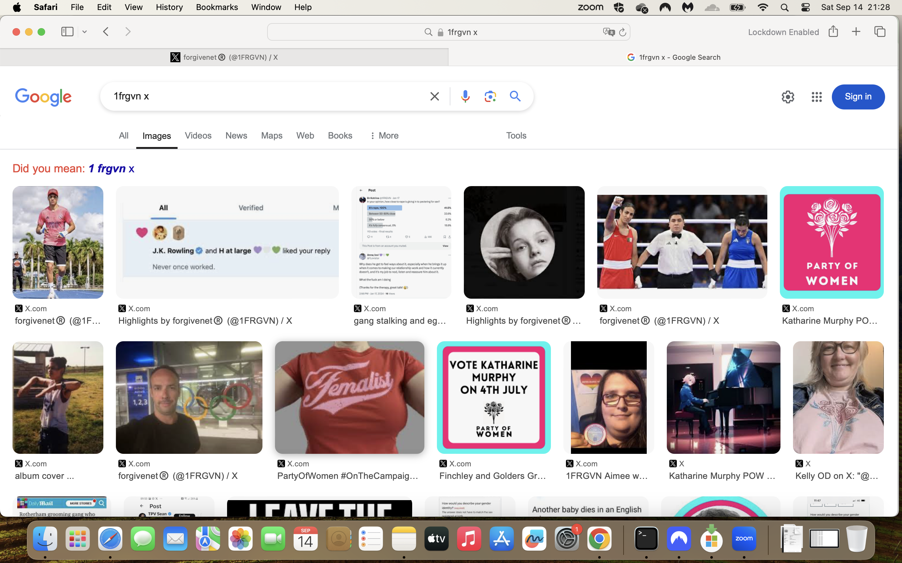
Paqui Fornet Pastor still coming up. |
| 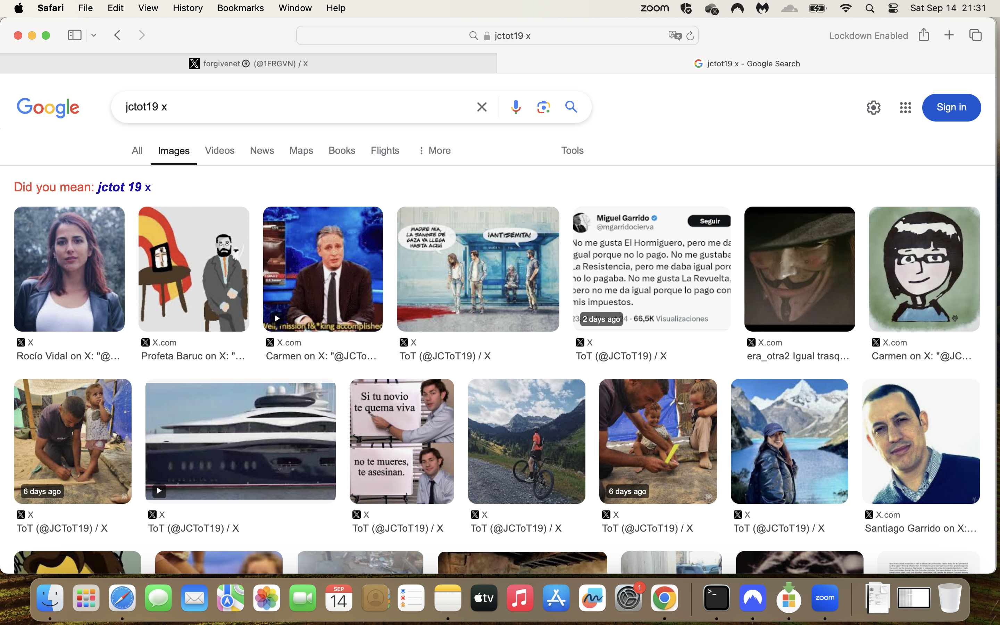
Carmen still coming up. |
| 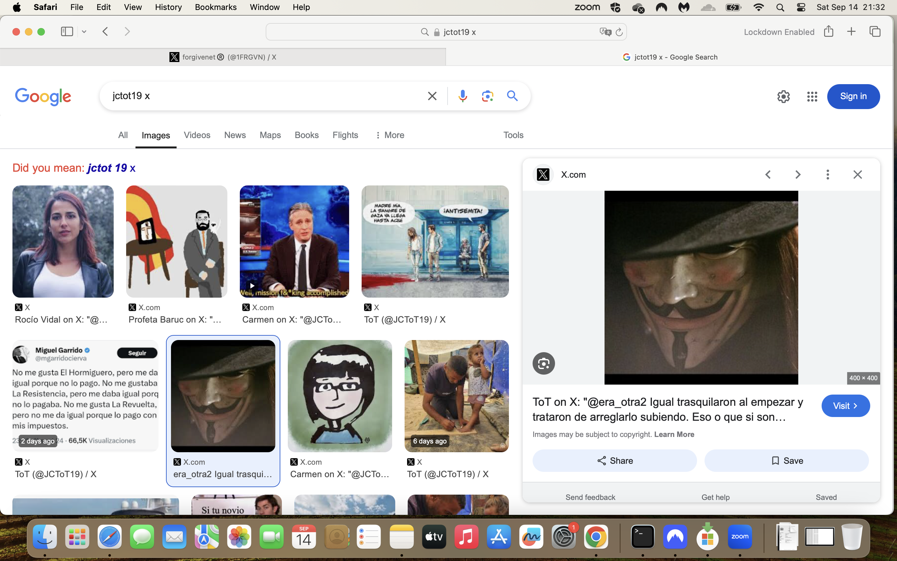 
The message coming up again that I [showed Alessandra in December 2023](../2023/december.md#meeting-alessandra). |
| 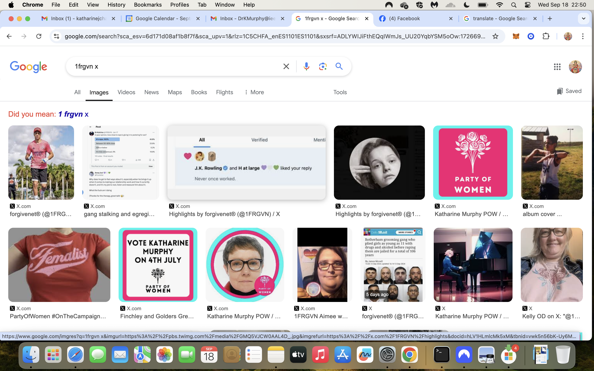 |
|  
The pic of Jack Nicholson here was significant. |
| 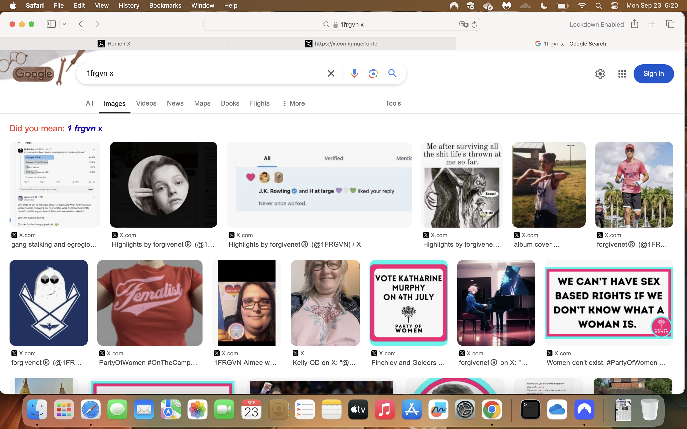 
The [stalker gaslighting message from March](march/1-12.md#aniloviator) still coming up and in first place, next to Paqui. Wow. |

