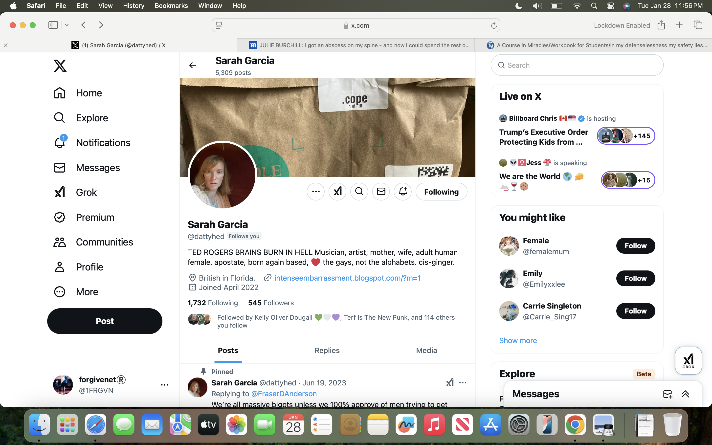
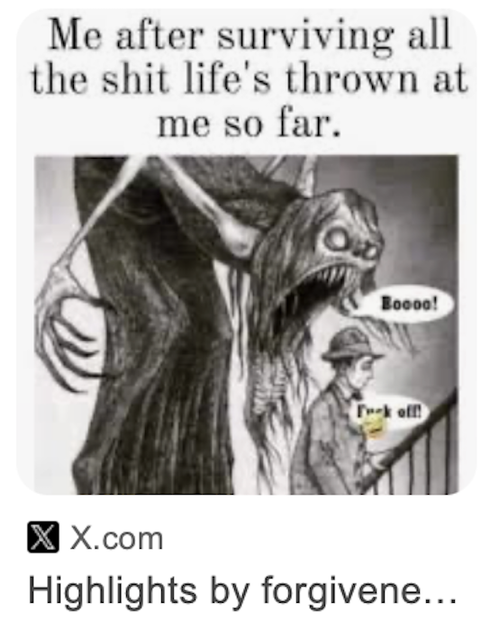
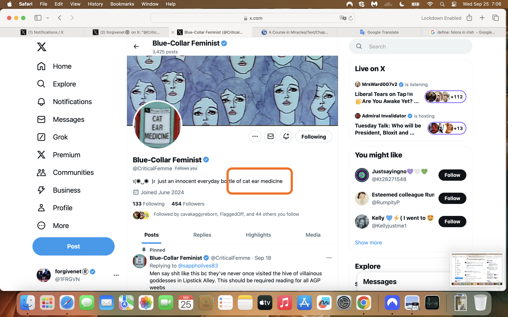

# September 2024

- I spend most of the month in Cauterets.
- At the beginning of the month, my dad visits and we stay in Lourdes together for a few days.
- I leave Cauterets around the third week of the month and drive to Madrid where I fly to Dublin for my Transforming Touch course.
- When I'm in Madrid, I see Inma who has already received [her letter](august.md#the-handwritten-letters).
- She tells me she thinks she knows someone who can help me.

## Lourdes with dad

- At my suggestion, dad visits Lourdes for a few days at the beginning of the month and we stay in the Hotel Saint Sauveur.
- I tell dad everything.
- I tell him I'm being stalked constantly wherever I am in the world, physically and online.
- I tell him again how teachers and staff at the conservatory threatened my life and I had to stop my studies.
- I tell him about my love the gypsy trumpeter.
- I tell dad that I believe I'm in serious danger.
- I tell him that if anything happens to me, I've prepared a pack for him containing a copy of [the handwritten letters](august.md#the-handwritten-letters), including the supplementary page, and a memory stick with archives of both my X accounts: `@1frgvn` and `@jackchardwood`, and he is to give it to the police.
- I tell dad that Domingo Lopez Cano and his family are behind everything that's happening to me and I make sure that [he remembers meeting Domingo in 2014](../early-years/2014.md#trip-to-london) at Christmas.
- As I tell him my story, what I know at the time, dad keeps saying; *heavy, heavy*.
- I ask him why he keeps saying this.
- He tells me about an African leader who was so fat, they called him *heavy*, and once when he was giving a speech he fell through the stage as they were shouting *heavy, heavy*.
- It's a funny story.
- I don't notice it doesn't really relate to him saying *heavy* as I tell him my story.
- Dad is the first person in the world I tell that [Hazel Smith poisoned me in 2007](../early-years/2007.md#hazel-smith).
- He says; *heavy, heavy*.
- Dad then tells me I need to be careful as I could be beaten by a man and put into prostitution.
- It's a little incongruous, and unhelpful.
- He's telling me things without telling me, and I'm not seeing it.
- One evening we take a walk through the sanctuary. 
- As we pass the baths, at the men's side, one of the bath entrances is completely open, both doors swung wide, and we could see all the way into a bathing chamber.
- This is unprecedented; something you *never* see in Lourdes.
- I took it to mean Mary was extending my father an invitation to bathe, to cleanse, to redeem himself.
- He did not accept.
- I made sure to remind him the invitation is always open; that doing the right thing is always an option.
- I told Sandra Diaz about Mary's invitation to my dad. She was unusually reticent. I guess she knew too.

## In Cauterets

- I am highly sexually aroused and I think about the trumpet teacher constantly.
- Often, when I leave the hotel I'm staying at, I see young men dressed in black with pale skin and black hair, (techs), entering my hotel building and going to the elevator I just got out of with a look of intent in their eyes.
- I'm suspicious of them. 
- They time it so I see them.
- I'm also suspicious of the hotel cleaning staff who come once-a-week, they're Spanish. Normally I don't let people come in my room but this year I did for some reason.
- The walking guides I use talk about how the *Spanish are crazy* in a way that makes me think of the Pelicot men and their total lack of concern towards a targeted woman as if they completely forgot women are also human beings.
- Do some of the men in Cauterets know who I am?
- My "friend" [Sandra Rita Diaz](../early-years/2014.md#sandra-rita-diaz), often visits my room for five minutes and uses my bathroom.
- I have always had my suspicions but something's not right with Sandra. 
- She is constantly talking about the old women she sings with in the choir at Lourdes; in particular one woman, Mireille, who is apparently evil, *everyone says so*, giggle.
- Sandra says, repeatedly, that she thinks Mireille is poisoning her.
- She also says, contradicting herself, that Mireille loves her so much she wants her to live in the flat next door and look after her when she's old.
- She constantly talks about devil worship at Lourdes.
- She talks about the magic spells her family does on people.
- She visits Cauterets for a few days and spends a lot of time with me. I didn't ask her to come.
- I tell her about the trumpet teacher, how I'm still hopelessly in love with him, that he's the love of my life, that I don't care if he did gay porn, he must have been groomed and coerced if not outright blackmailed, and how I'm still being terrorized by Domingo's family and others in Dénia.
- I tell her about [Irene](august.md#irene-the-plate-lady) and [the handwritten letters](august.md#the-handwritten-letters).

### Letters and a thank you

- While I'm in Cauterets, I post as many of the [handwritten letters](august.md#the-handwritten-letters) as I can.
- I believe it is the only way I can communicate with law enforcement without my persecutors being aware of it.
- A few days after I get back to Dénia in October, I see a giant message come up on my screen saying "thank you".
- And then it's gone.
- It's not like the porn-gang tech activity, my whole screen is taken over for a few seconds.
- It gives me hope.
- I tell Inma about it.

#### Rocio Vidal

- One afternoon, while I'm going back and forth from my hotel room to the library to photocopy the letters and photos, I think I see [Rocio Vidal](august.md#6).
- A group of young Spanish men is chattering away in the cafe as I pass.
- A woman stands up in the middle of them and faces me.
- I think it was Rocio Vidal.

### Sandra Diaz at the Royalty

- Sandra Diaz and I go for dinner one Sunday evening at the Royalty restaurant in Cauterets.
- We drink some wine.
- Sandra is talking about men again and giggling as if she's embarrassed and naive.
- It seems like an act.
- I can't remember the exact words of our conversation, but I said something that implied I knew a lot more about what was going on that she thought I did.
- She picked up on it immediately.
- She wanted to know what I meant.
- She was insistent.
- I told her I'd tell her in 30 years.
- She asks again and again, *what did you mean?*
- I repeat my answer, *30 years*, and say nothing more.
- She asks if she can use my toilet again on the way home so I let her come up again.
- When we're in my room, I show her one of [the handwritten letters](august.md#the-handwritten-letters).
- She reads a page or two for a while; she's very quiet, thinking.
- She doesn't know what to say.
- Then she says, in her giggly naive-little-girl voice, "are you going to study again at the conservatory when you get back?"
- I am AMAZED! 
- I shout, "Are you insane?"
- She keeps her head down and doesn't say anything.
- After about a minute, she says softly, "no I am not insane".
- The next day she is upset with me, different, anxious.
- Has she finally realized, after a decade of interactions, that I'm not as stupid as she's been told I am?

#### The hairdresser

- A few days later, I'm having my haircut in Cauterets.
- I ask Sandra if she wouldn't mind explaining to the hairdresser what I need to have done because my French is so appalling.
- She does so, but I see Sandra telling the woman something else too, in low tones.
- I know it's poison.
- Whatever she says [rears its ugly head](../2025/august.md#haircut) in August 2025, not unexpectedly.

### Random messages

- As usual, I receive random messages on Signal, Telegram, and WhatsApp; some threatening.
- Here's one from a [random Peruvian](../../content/whatsapps/WhatsApp%20Chat%20with%20random%20Peruvian%20+51%20943%20801%20768.zip) who is asking for lodgings for the night.

- I have to wonder if they were coming into my apartment in Cauterets.
- Did they bring Rocio Vidal in with them?

### Sainte Bernadette

- Before I leave Cauterets, I go to the church where Saint Bernadette used to pray when she came to Cauterets to take the healing waters.
- I pray for better days to come.
- I'm sitting in front of the altar with the statue of Mary she used to pray with, the little menorah, and a picture of the saint.

- I can't remember for sure but I was doing back-to-back novenas in those days so it may have been the end of a series.
- I am high, without realizing it.
- I have the sensation the trumpet teacher is with me.
- It's not like in [May when I felt trumpet teacher number four was in my hotel room with me](may.md#madrid) in Madrid.
- I can see no figure, just a sensation he is with me.
- We're very close.
- Someone says: *we'll be meeting here again this time next year*, I think it was me.
- Suddenly I can feel an overwhelming sense of *no way, not possible*.
- Incredulity.
- I'm so surprised at the change in emotion. It came out of nowhere.
- I kept the faith that we would be meeting, I may have posted a profile message that I no longer have...

## Who Is This?

- I start a Twitter hashtag [#WhoIsThisSeries](https://x.com/hashtag/WhoIsThisSeries?src=hashtag_click&f=live) and post some of the pics I've been seeing of [women who look like they've been targeted by the porn gangs](august.md#suspected-targets).
- A few weeks later, Trish sends an email round with the subject "who is this?".
- I consider this more confirmation that Patricia knows exactly what is going on, but I also realize she's likely been told to do this by someone controlling her.

- Her suggestion is, of course, Cindy has been targeted.
- This would be unsurprising knowing some of Cindy's medical background and given she is a single woman living alone.
- Cindy was prescribed heart medicine (digitalis I believe) for a sudden-onset inexplicable heart condition.
- It began when she woke up on three or more different occasions in the middle of the night - weeks or months apart, you can ask her - with a panic attack which she thought was a heart attack.
- She had the ambulance out every time, and the first few times the doctors told her nothing was wrong with her.
- But she was insistent, something was wrong.
- So they found something, and medicated her.

- The [email sparks off some conversations between us](../../content/documents/emails/who-is-this.pdf) and I get a chance to express my anger at Chris BJ who was supposed to be my friend. (She lies about the "porn" reference which I 100% remember.)
- Fake accounts on X give their salient and unwanted opinions on my email after I've sent it. 
- One said they liked what I said at the end, that *we're all in porn*, which is probably true.

## Another upsetting targeted woman

- I start to see another woman on fake X accounts; over and over, every day.
- It's the same pattern [as the innocent woman I saw previously](august.md#grooming-an-innocent-girl-into-porn-101); a chronology of what seems to start off as a normal relationship which is then steadily groomed into something evil. 
- In the beginning, the woman appears to be innocently on dates with someone who takes photos of her.

- She also takes selfies.

- I then see her sending nudes. 
- There are a whole bunch of "nearly nudes" where she is in see-through lingerie and taking selfies of herself in what looks like a sitting room while she's eating a banana.
- I cut off those pictures but you can see the ceiling of the room, and I snipped a close up of her eating the banana.

 
 

- In the profile pic below, she looks like she is doing a ballet pose, and I have to wonder if she was a dancer in the Generalitat's conservatory systems. 

 

- Finally, I saw a whole series of pics where she is in the passenger seat of a car.
- She looks sedated.
- I saw people (men) close by to her that are not the person with the camera; a small chubby hispanic looking man crouching down in the drivers footwell, for example.

- I cannot believe she is conscious of what's happening to her with all these men around.
- First, she is in her clothes, next she is in her underwear (the picture above).
- Then she has no clothes on at all and someone has placed car seat belts over her breasts.
- Then we see her in the back of the same car.
- Fake accounts suggest that something very dreadful and violent happens to her in the back of the car with a bunch of men around her.
- All I can do is repost the images in the hope that someone knows her.

- And I disagree with `@blahblahfishcakes` who didn't think I should be posting these photos sent to me by the porn-gangs.
- This is the mass and *very hidden* immolation of young women, now children and babies, and the only reason it goes on without hindrance is because it stays hidden from anyone who might care. 
- Remember: pics like these are *not hidden* from a billion porn addicts; those men we work shoulder-to-shoulder with, travel with, live with, shop with, eat with, our family members, our leaders, our sons, fathers, brothers, the bus driver; 75% of all men everywhere who, statistically, would rape their daughters if they thought they'd get away with it.

### A TT participant in Dublin mentions the woman

- An Irish woman who attended two successive cycles of Transforming Touch - one in Galway and another in Dublin - seemed to be running distractions and class disruptions and it only recently occurred to me she may have been asked to do so.
- Given it took nearly three years for me to see four very different-looking men were *not* the same man, you might expect criminal gangs making millions on [switcheroo porn filmed in a Spanish school with Spanish school children starring](../../crimes/protagonists/vidal-sastre.md#four-distinct-men) to be doing their very best to make sure I didn't get clear about this in my mind, and running interference on Steve's healing courses seems like a good place to start.
- This woman spoke to me repeatedly about the 1989 rave scene in breaks, about telepathic masturbation, and she also seemed to know very personal information about me that only people who had been watching my every move online for twenty-odd years would know.
- I thought nothing much of it at the time. 
- I was still perma-high and incessantly cyber-stalked those days so it was difficult to gather my thoughts about anything in a normal way.
- On the September 2024 session in Dublin, she says something apparently random and meaningless to the whole class, that suggests, to me at that moment, that she is talking about this woman in the car; something like *in the back of the car they beat and violated her*, or similar.
- I filed it away.

## The conversation continues until I leave for Madrid

- The conservation with the hacker continues while I'm in France.
- On or around the 21st I leave Cauterets and I drive to Madrid.
- I meet Inma.
- She's received her letter.
- She says she knows a woman who works for the Spanish government who can help me.
- She asks when I'm going to be back in Madrid.
- I tell her I'll be back on my way home to Dénia in about a week, as I'm going to my Transforming Touch therapy course in Dublin and flying from Madrid.
- She says it's too soon.
- I tell her I'm coming through again on my way to Fatima in mid-to-late October.
- Inma says that will probably work; she'll let me know and confirm.
- Themes from our conversation are repeated back to me on X account profiles when I get back to my hotel.

## Suspected targets

- Photos of suspected Spanish/British p$rn-gang targets continue to fly intentionally onto my X UI this month via fake accounts.
- ***Remember***: the fake account around the photo usually, if not always, has an advert for Only Fans, Pornhub, or similar, and this is how I originally became aware that there was something unusual and incongruent about the photos I was seeing; they did not match the porn theme.
- During the month, I started to notice the odd photo which looks like a red-herring; someone famous maybe, a Spanish actress, a still from a film, a scene from the television?
- Have the p$rn-gangs realized that someone is helping me?
- Are they doing their best to muddy the waters?
- As before, I list all these women - every last one of them - as suspected targets without knowing for sure whether they were targeted or not, although some do look extremely vulnerable.
- The last set - from 17. onwards - I have been seeing more recently; however, I remember them from before and I did ask Hazel, good-hackers, et al. to send any outstanding ones I might have missed.

### Victims posted in September 

##### 1.

  

- Seems to be an old picture; maybe decades old.
- Who is she?

##### 2.

 

- Who is she?

##### 3. 

 

- This looks like someone Lorraine Blackbourn knew from Chester, UK.
- I could be wrong but I think I've seen her before in private photos Lorraine showed me.
- Who is she?

##### 4.

 

- This one feels like a red-herring.
- Who is she?

##### 5.

- Again, possibly a red-herring.
- If not, this woman is likely being filmed without her knowledge.
- Who is she?

##### 6.

 

- This one troubles me.
- It feels like a sneak photo of someone who's just learned or experienced something horrible.
- I could be wrong of course.
- Regardless, who is she?

##### 7.

 

- A really old photo of a target?
- Or a porn-gang red-herring?
- Regardless, who is she?

##### 8.

 

- This one feels to me like a well-known Spanish actress, but it came up on a fake account as usual.
- Regardless, who is she?

##### 9.

  

- Who is she?

##### 10.

 

- Who is she?

##### 11.

  

- Who is she?

##### 12.

  

- Who is she?

##### 13.

 

- This looks like spy-cam footage.
- Where is this?
- Who is she?

##### 14. `@dattyhed`

- The `@dattyhed` fake account has been stalking me for well over a year, perhaps even since [19th June 2023 (the pinned tweet's date)](../2023/june.md#sunday-18th-june-alicante-airport), the day after Gloria the school receptionist's brother, the [third trumpet teacher](../../crimes/protagonists/vidal-sastre.md#an-unknown-man-i-may-have-a-picture-of), attempted to take physical control over me.
- The account owner, still party to everything I do online, even liked a post of mine this morning (the time of writing being 8th January 2026).

 

- My view is that Hazel Smith controls this account and has been using it to either muddy the waters, or to demonstrate how little she cares about the results of her murderous activities in the world.
- The woman's face also looks like it could have been AI'ed into the photos of the `@BertDalziel` stalker account holder, along with [Samuel from harmony class](../2022/september.md#harmony) and the [crazy yoga teacher](../early-years/2015.md#nati-de-prati-yoga) from 2015 who, along with multiple other conspirators, military-couped Natalia's professional life into the porn-gang's hands.
- Like the other targeted-women accounts, the account profile is bogus but the profile pic is genuine and thoroughly incongruent.
- I was initially startled to see an expression that looks shocked and upset while viewing something on a computer screen.

 

- My suspicion is she is viewing footage of herself filmed sexually or otherwise without her knowledge.  
- When you look at the full profile, you see a URL to a site named *intenseembarrassment*.

 

- I did click this link one time and it redirected to porn.
- *Cope* is also derogatory, to me and all victims, and, moreover, unbelievably arrogant.
- My view is that not only is spy-cam porn used to blackmail and exploit victims, the *big reveal* may be in and of itself a *porn genre*.
- Knowing very well the sick state of minds of porn-addicts the world over, and how much they're willing to pay for their addictions, I assume they delight at seeing a target's expression when she is humiliated.
- Perhaps this was going on continuously during my online professional life.
- The snickering will be undoubtedly off the scale.
- But this account kept coming back, with new pictures and messages for me; a stalker's personal favorite, or someone known personally to Hazel perhaps?
- Here she is again, away from her computer screen; are there spy-cams all over her house?
- It's not clear what she's looking at; maybe the networked-up doorbell?

 

- In January 2025, when I'm back at home in East Finchley, the account is still stalking me.

 

- Shortly afterwards, perhaps a couple of months later, the profile message changes to: *Basically Margaret Thatcher*.

- I believe this message relates to top-secret information (that most of the Labour Party in East Finchley know about) that my father gave Domingo Lopez Cano and his gang in 2014, and by extension Hazel Smith and the British porn gangs; unless they already knew via the Red Lion pub connection from 1989, which is also not unlikely.
- Regardless of how this woman has been misused by the porn-gangs, who is she?

##### 15.

 

- I'm 90% sure this profile pic was part of a fake porn account originally.
- It looks like it's been cleaned up; they can do that you know.
- I could be hugely wrong about this, however, and I'm aware of it and hope I am.
- Who is she?

##### 16.

 

- This lady feels familiar to me and for that reason I suspect a red-herring or AI mix. 
- Nevertheless, who is she?

##### 17.

 

- Another extremely legit-looking account.
- Who is she?

##### 18.

 

- This lady looks very familiar; a bit like Zoe BJ and her mum.
- Is she a relation?
- Who is she?

##### 19.

 

- Could this woman be sedated in this photo?
- Who is she?

##### 20.

- I believe this fake account references two targets: Cindy and Lynn from the British walkers.
- Who is the woman in the photo?

##### 21.

 

- This fake account, and similar ones with the same message, popped up in September 2023 while [I was being followed and stalked daily on the Las Marinas beach](../2023/september.md#rape-gang-reminders), and I would smile at the stalkers, and they'd get very visibly fearful.
- And I'd know.
- I never stopped doing that; and they'd *always* get scared when I did.
- Guilt.
- Just the tiniest nudge for this lot and the whole thing is going to collapse in on them.
- Who is this woman?

##### 22.

 

- Who is she?

## Driving back to Dénia

- After Transforming Touch in Dublin, I fly back to Madrid, meet Inma briefly, and then drive back down to Dénia and home in Carrer Furs.
- Inma tells me that the woman she knows will visit Madrid in about three weeks to meet me when I stop on my drive to Fatima.
- On my way home, driving through the countryside, I suddenly remember something peculiar about the hotel I stayed in on the March morning in 2014 when [Mike Wenham's wife emails everyone to ask for help because he's been arrested for murder](../early-years/2014.md#mike-wenham-murders-a-woman).

### Remembering the woman in the picture with the scissors

- That was the first morning of my first service to Mary at Lourdes.
- I had stayed in the Best Western in Lourdes for one night and was moving to the hospitalite's accommodation that day.
- In my bedroom, was an unusual painting of a woman in a conservatory.
- She was holding garden sheers in a sinister manner.
- It was a threatening painting and I didn't get much sleep that night either.
- I have [written about this before](../early-years/2014.md#mike-wenham-murders-a-woman).
- Remembering this in the car was startling; specifically the implication of the sheers in relation to Mike Wenham's botched penis enlargement surgery.
- I tweet about it when I got home; initially in reply to a stalker account's tweet, now deleted.

### The swingers club

- As I drive into Dénia, I once again notice the huge billboard for the swingers club, Hedonia.
- Zoe BJ went on about the swingers club, a lot, one of her excruciating topics.
- It's very distasteful and I have noticed every time I drove in.
- However, something on the billboard strikes me this time.
- It is the pictures of robot masks.
- I have seen the same on Google searches.
- The billboard also mentions of "special events".
- I tweet about it in early October:

- I wonder if "special events" includes groomed and sedated women that aren't consenting, even if their eyes are open; women who know the men in the community hidden behind masks.
- I ask the hacker/trumpet teacher if that was his intention when meeting me at Alicante airport on [18th June 2023](../2023/june.md#sunday-18th-june-alicante-airport); my very own "special event".
- I'm not aware at the time that I'm addressing [the third man of the four conservatory-porn-gang trumpet-teacher actors](../../crimes/protagonists/vidal-sastre.md#an-unknown-man-i-may-have-a-picture-of) and probably Gloria the receptionists brother Ivan.
- I look the club up online and see the same robot masks.
- I also see a strange skinny woman with her back to the camera in a blond wig.
- She's wearing a top hat.
- I'm reminded of Hazel.
- All these images are gone from the website today.
- As I'm tweeting about the club, messages fly past on my UI; *Oh we're not going there anymore, hahahaaa*.

## Threats

- At some point I see this pic in Google search.

- It reminds me of a response to a tweet in March, probably when the [cyber stalking and threats were most intense](march/1-12.md#tuesday-12th-march) just before or after the piano concert.
- I tweet about it: https://x.com/1FRGVN/status/1835765992556818662.
- At that moment, a monster face like the one in the pic simply appeared in the middle of my Twitter timeline, completely out of nowhere.
- It was shocking and I realized they had total control of everything I could see on Twitter but I was so stressed I had to file it away to think about later.

### Murder

- Here's a threatening message example.

- And a warning to me about murder maybe. 
- I was going back to my flat at the end of September and I think they really intended to poison me to get rid of me seeing as I just wouldn't leave Dénia.
- It must have been extremely annoying that I never left, but I'm conscious, even now, that leaving Dénia means I'm open to being targeted out of sight, in a far worse manner probably.

### Poisoning

- I wonder if this fake account contains an explanation of how they managed to drug me in class at the conservatory, some sort of "cat ear medicine" meaning did they manage to put a puff of powder in my ear?
- Could that have happened while going into the conservatory before class and being surrounded by a crowd of people while going up the stairs?

- I tweet about how people could be being spiked over long periods with drugs. The tweet is translated a lot.

- I post an example of my proteinuria which has been bad since I had a chest infection at the end of August.

- The cat ear medicine account says they are so sorry.

## Google searches

| Google searches from September |
|-|
| 
Paqui Fornet Pastor still coming up. |
| 
Carmen still coming up. |
|  
The message coming up again that I [showed Alessandra in December 2023](../2023/december.md#meeting-alessandra). |
|  |
|  
The pic of Jack Nicholson here was significant. |
|  
The [stalker gaslighting message from March](march/1-12.md#aniloviator) still coming up and in first place, next to Paqui. Wow. |
