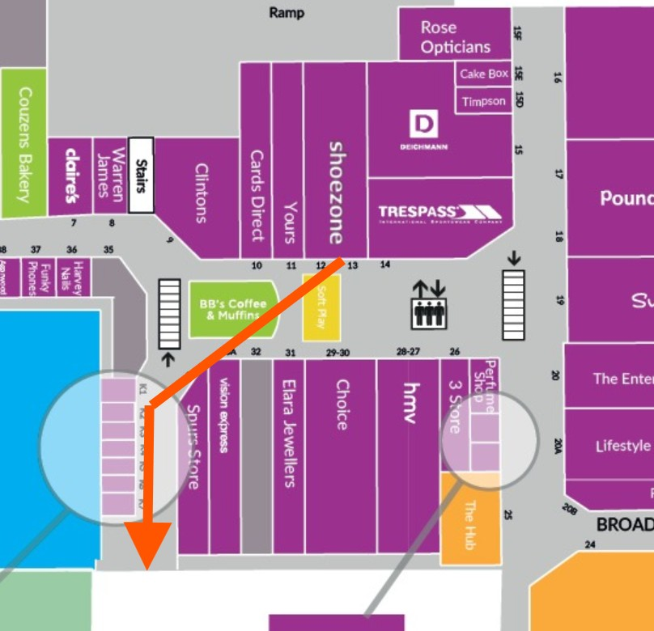
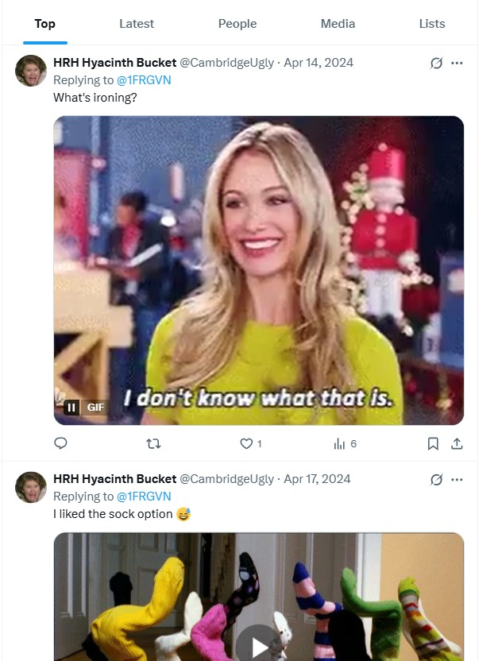
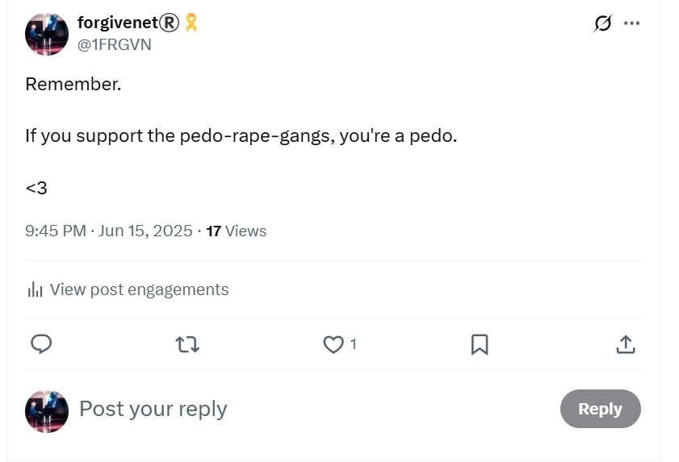

# April 2025

## Goaded online

- I continue to be goaded online, specifically about illnesses related to pesticide poisoning.
- It's nothing like it was though. 
- Everything is pretty quiet online.
- I suspect it's Carmen Cano, as they like you to know who they are, and this name and her picture keeps coming up in the way they used to.
- Sources tell me this woman has been waiting for me to die for some time. She'll need eternity for that I expect.

## Fridges

- At one point, there is communication online with regards to how I've had enough and I'm not playing anymore.
- The following day, I do a Google search on my X name and all I see is fridges.
- I'm reminded of Domingo Cano telling everyone at the conservatory I was [frigid](../early-years/2014.md#poisoned-aunts) and wonder if that's something his other targets are very familiar with on their social media?
- I showed my mother this page of fridges on Google search.
- She was sitting beside me at the time.

## Shoe Zone Harlow, Essex

- I take my dad to a rehearsal near Harlow in Essex for the afternoon.
- I go off and do some shopping.
- It's Tuesday 15th April.
- I buy some shoes at Shoe Zone in the Harvey Centre.
- As I'm leaving the shop to head back outside via the theatre square, two very rough looking blond women, one older one younger, do the *bump-into-and-distract* thing exactly like I see [the woman I recognize do to the waitress in Lourdes](../2025/july.md#lourdes) in July.
- I'm walking in the direction I show on the map towards the exit.
- They are standing together and they are not in my way initially.
- The space is open, there's no-one else around.
- As I walk, they draw closer, then one woman, the older one, sort of walks right into me.

- I giggle politely as if she didn't mean it, say sorry in that British way, and whirl a bit backwards as she does it, just like [the waitress does in Lourdes](../2025/july.md#lourdes).
- I see her face very clearly.
- She is blond, about 50, and she looks like she's had an extremely hard life.
- The younger one is also blond, but much younger; could be a daughter.
- I don't realize the significance of it at the time but I'm sure they did it on purpose.
- I'm certain British criminal porn-gangs sent them to stalk and upset me, perhaps even Hazel herself asked them.
- It's obvious everyone knows where I am and what I'm doing minute-by-minute.
- It's extraordinarily stressful, you cannot imagine.
- However, the whole distract-and-drug thing did not occur to me.
- Were they keeping me *topped up*, as it were?
- Is this why it took me so long to remember the [most obvious switcheroo men](../../crimes/protagonists/vidal-sastre.md#four-distinct-men)?
- Why would these women be interested in me *not* remembering these men were different?
- It reminded me of another incident back in maybe 2010 or 2011 when my mum and I would go to the Finchley Lido cinema on a Saturday night together and drive down and park outside.
- One night, two women who had a similar appearance to these Cambridge women; blond, oldish, sort of Cell Block H types, tried to get into the back seats of our car while we were in the car and getting ready to leave.
- I got out and roared at them, I literally roared, I had no idea where it came from, and they wandered off a bit surprised-looking.
- We reported it to the Metropolitan police at the time.
- It also reminded me of something else, no wait, something else more recently, online stalking, reminded me of this.
- Probably in October 2025, just before I left N2, I was threatened online with the *Cambridge women* who were gonna *come down and get me* or something ridiculous like this.
- I answered back some nonsense.
- Another account `@CambridgeUgly` interacted with me [around those days in April I went to Shoe Zone](https://x.com/search?q=cambridge%20(%401frgvn)&src=typed_query).

## There's something in the water

- I take my father to play a jazz gig at the Elephant pub in North Finchley.
- He has been unwell so we have a blue badge and I can park right outside the pub.
- He finds walking hard since he was a little paralyzed by a pain-killing injection he received after falling last October.
- I leave him there, and go to collect him at about 11pm.
- We're walking out of the pub and towards the car.
- A couple of people, a youngish short woman with blond hair who was with someone else, steam past us. 
- She is saying loudly, "There's something in the water. There's something in the water."
- I think I recognize her.
- It's [Lucy](january.md#pauls-friend-lucy).
- Paul's "friend".
- I recognize her because he showed me her picture on his phone.
- The jeering is, obviously, a reference to the poisoning at my Spanish apartment.

## Let Women Speak April

- I go to Hyde Park Let Women Speak on 27th April.
- Susan and Sandra are there.
- I had seen them both in [Aberdeen in March](march.md#let-women-speak-aberdeen).
- Sandra was an [electoral volunteer](../2024/june.md#volunteers-not-what-they-seem) of mine in 2024.
- Between the previous time I saw them in March, and this event, I had remembered that Susan Hamill had [repeated a significant phrase from my police statement](../2023/may.md#chamber-music-concert) exactly like teachers and staff had done at the conservatory of Denia while terrorizing me.
- I felt a little uneasy.
- The first thing Susan says to me is, "oh do you want an icecream?", and she goes to get icecreams for her and Sandra.
- I declined and thought there was something weird going on.
- We went to the pub.
- I buy Susan a pint for her birthday, and one for me.
- We sit down.
- I'm talking to other people.
- I have drunk a few sips of my pint and suddenly Susan says, "do you want a chaser?".
- I'm a bit surprised and say no.
- A few minutes later, while I'm chatting with someone, she puts a full pint down before me which I don't really want but I feel I've no choice but to accept.
- Susan and Sandra leave. 
- When I get home that night I become extremely unwell.
- I spend two days in bed vomiting profusely.
- My whole family also get sick in the same way which is particularly concerning.
- My father was first to get sick, on the Friday evening after we had fish and chips in Muswell Hill.
- The following Monday, Susan posts a picture of a single pint on a pub table with no-one around on the LWS WhatsApp group chat.
- The next time I see Sandra at LWS in May, I'm extremely standoffish.
- On X, I see a post that evening, "Don't be rude".
- I respond a week later after thinking about it.

- It feels to me that certain vested interests are very keen for me to not attend Let Women Speak rallies, to be afraid to go, to feel in fear for my safety.
- I assume those vested interests must be somehow protecting the pedophile rape gangs that stole my life from me and countless other women and girls, and men and boys too no doubt.
- Sometimes, at Let Women Speak rallies, it feels like the only people attending are spies.

## Ireland

- I set off early in the morning to make the long drive to the ferry to Ireland.
- I'm off to do a TEB advanced training focusing on the lymphatic system.
- I get to the top of my road and there is a huge mean looking man standing glaring at me from across the road.
- I ignore him.
- He thinks I don't see him.
