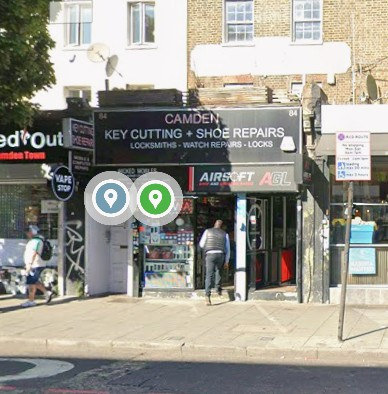
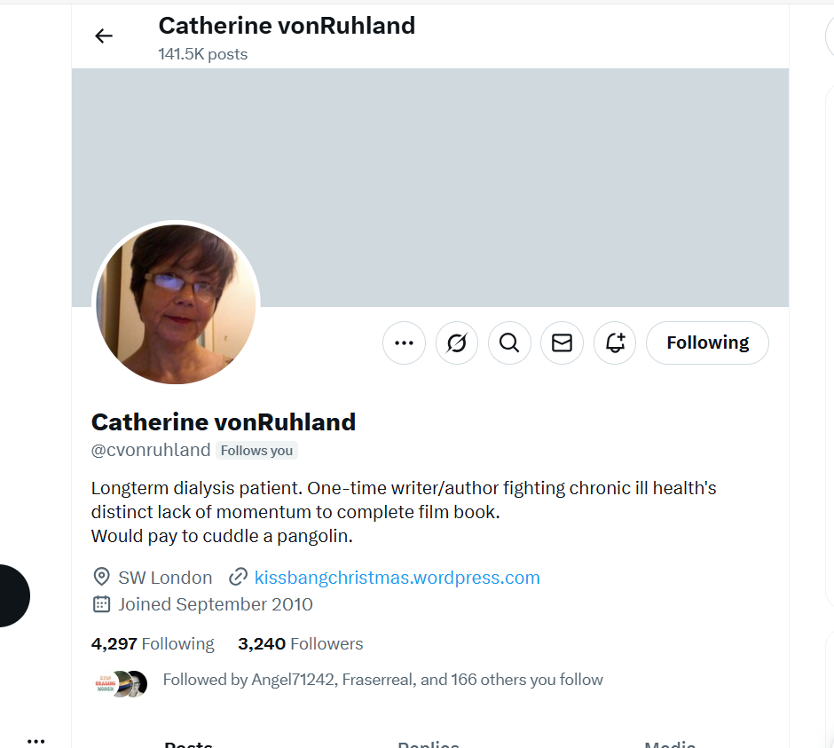
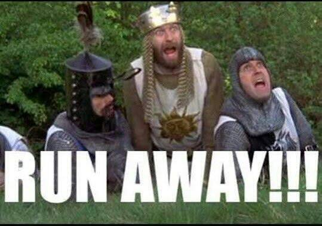
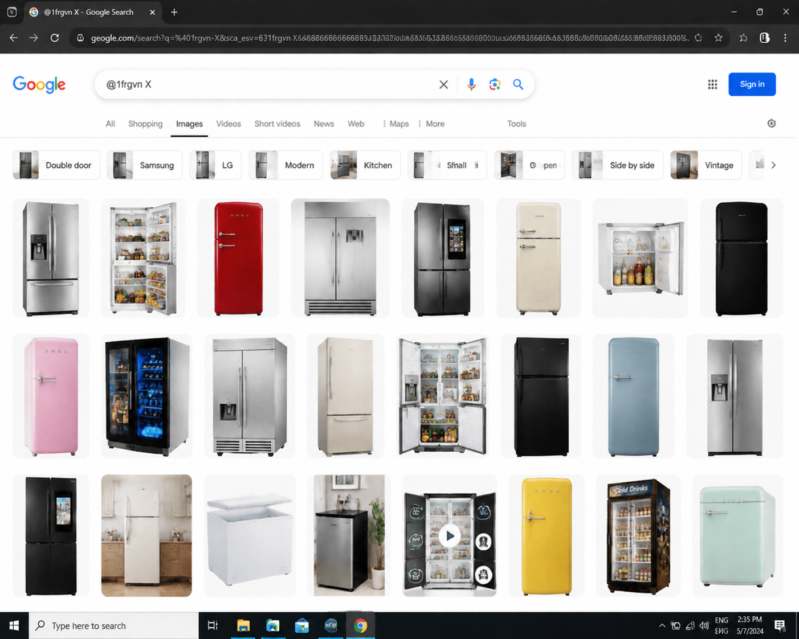
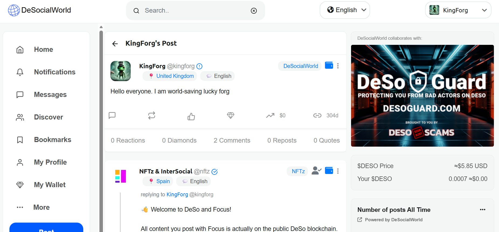
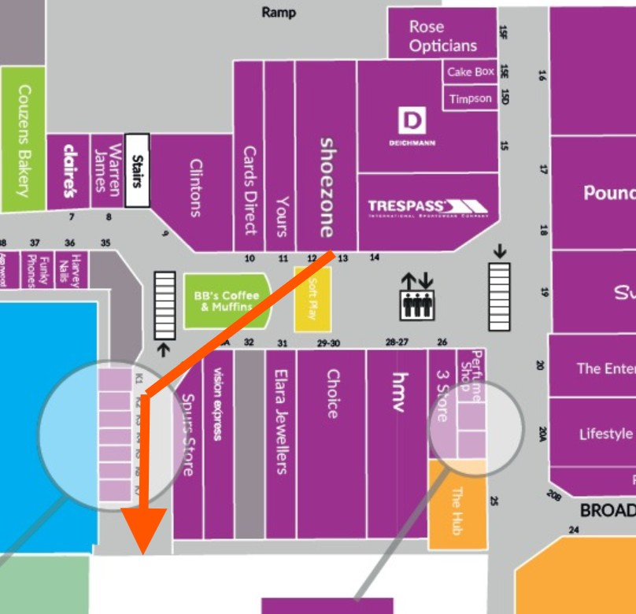
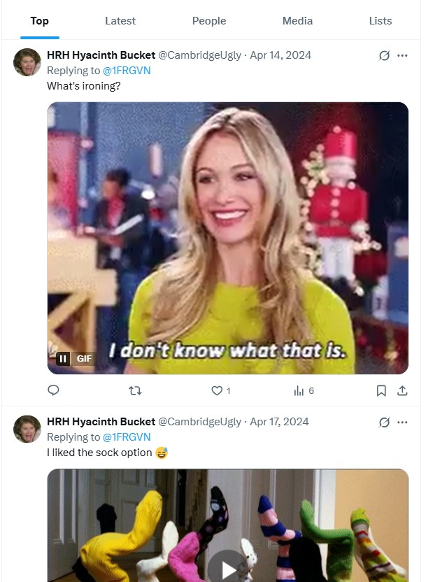
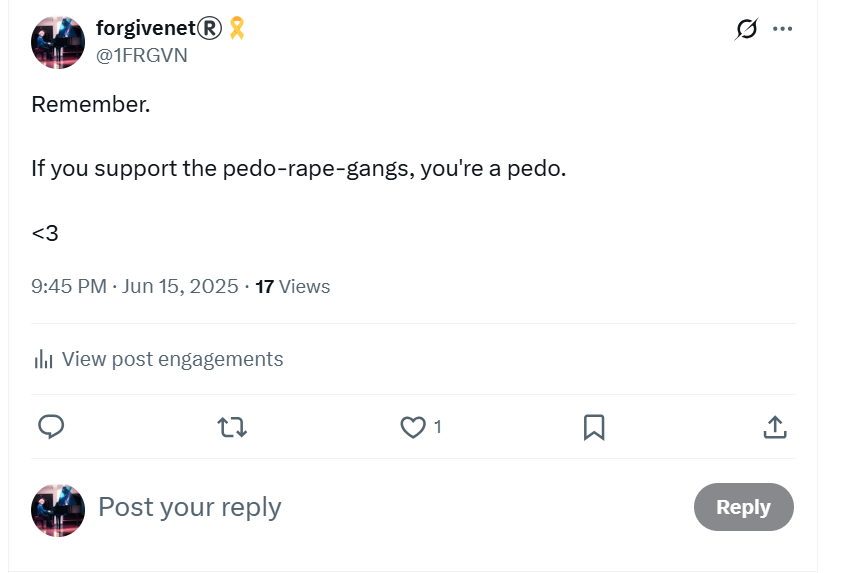

# April 2025

## Dad makes me take him to his dodgy Islamic phone specialist on Camden High Street

- Dad wants to get his mobile fixed, or something.
- He has about ten mobile phones, none of which he ever uses, so I know it's nonsense, but I humor him and take him.

- The man in the shop has seen me before, he knows me, and he's uncomfortable about it.
- He keeps glancing at me.
- When we're back in the car, dad's says how much he likes his friend.
- He's overdoing it too. 
- He's pressing for me to say something.
- I tell dad that these people hate women.
- Dad has an ulterior motive for taking me here.
- I believe he was told to go there by North London's finest via the folk at the Red Lion.
- Were they offering this man and his business up?
- Is the man a prolific criminal porn-collector-and-distributor?
- Or is he into something even more interesting to law enforcement (who don't care about women, children, and babies after all, do they)?
- I wonder what it could be.
- The man was nervous.

## I promise Leah everything is going to be OK

- Leah, my cousin on my dad's side, phones the house a lot but no-one speaks to her usually because she is unstable and difficult to talk to.
- My guess is that the gangs got her to stalk me on X back in late 2023/early 2024 via her "friends", maybe her mother too, and they are also getting her to try and talk to me on the phone while I'm back at 31.
- It's not clear what their purpose is in doing this, maybe they thought I would give her information about why everything is starting to go catastrophically wrong for them.
- If so, the irony here is they have so successfully mashed her brain up for the goal of relieving her of her Lockerbie compensation, it really is impossible to have a normal conversation with Leah.
- Anyway, one day I pick up the phone and it's Leah.
- It's hard to make sense of what she is saying, but I manage to promise her that everything is going to be OK.
- And I meant it, viscerally.
- And the hacking porn-gangs will have heard it too, which is good.

## Goading and taunting online

- I continue to be goaded online, specifically about illnesses related to pesticide poisoning and kidney damage.
- This account likes my posts *relentlessly*.

- I'm sure Hazel or Carmen Cano is behind this one.
- I have screenshots of other accounts suggesting Carmen Cano with similarly unpleasant statements about my health and wellbeing.
- When I drafted this section, I was obviously looking at one, but I seem to have lost the reference to it.
- You may imagine that the overwhelm of evil information I was trying to collate and make sense of would have been hard to manage *without* the constant clandestine drugging I was enduring!
- I'll add all and any of these missing fake accounts when I have the time or inclination to look for them; it may not matter now anyway.
- Sources told me that Carmen Lopez Cano had been waiting for me to die for some time.
- My continued survival must have been a dreadful disappointment for her.

## Runcorn with Sarah Pochin

- I attend an event with political party Reform where we travel from London to Runcorn in Merseyside to help canvas for Sarah Pochin who is standing in a by-election.
- I'm also considering standing for Reform in the 2026 local elections.
- Politics, for me in my unenviable position, became more of a means to stay alive rather than anything else, although I am horrified by the state of the country and world.
- I feel very strongly about not sterilizing children, so my reasons for standing for Party Of Women at the UK General Election in 2024 were authentic but the experience made me realize that I had become safer, albeit just a little, by standing.
- Standing for election also unraveled a whole load of other evils I was not aware of... so really it was a very good thing I stood in July 2024, and I thoroughly recommend standing it if you're the target of porn-gangs and sedating-abusers.
- It felt like the more people know who you are and what's going on with you, the less safe the abusers feel.
- That's why the porn-gangs (and abusive and violent men generally) require total isolation of their victims, so they are without help.
- They're essentially cowards, you see.
- Anyway, you meet a lot of agents, as you might imagine.
- I was getting used to this by then as well, and this time they spoke to me, which was nice.
- And I met an extremely interesting agent who was applying a total honesty approach, and I thought, wow that is so cool! 
- I never saw that again, but they so rarely talk to me - and sometimes when they do talk to me they're often told to stop talking to me mid-chat, which is amusing - but I did find it rather unique and wonderful.
- Anyway.

### Recoiling on meeting a violent man

- James McMurdoch was there; an MP at the time for Reform.
- He was quite famous in that he had done no campaigning at all in his constituency in Essex somewhere and won a seat in the GE with a landslide (the sort of thing that happens when the country and world are going to..).
- In Runcorn, he was surrounded by young men and they were all a bit snickery in general, and very much so with me, which today (July 2026) makes me wonder.
- I was quite keen to meet this person I'd never heard about before.
- I was introduced to him and I stretched out my hand to shake his, and the moment our hands touched something inexplicable happened.
- I recoiled quickly, snatched my hand away, and I felt panic.
- He noticed this and was upset by it.
- I think we mumbled some formalities and sat down far away from each other.
- I was feeling like I was going to have a full-on panic attack, it was so strange and inexplicable, I hadn't felt like that with no obvious reason for it in a long time.
- I always felt like this whenever I saw any of the trumpet teachers in Dénia - apart from number 1 trumpet teacher who didn't seem to be involved in this aspect of the terrorism - and I would run away!!!!

- I've documented some of those times: for example when I saw one of the tall ones [outside the health food shop](../2023/september.md#rosa-vidal-follows-me-around) sitting with Rosa Vidal on a Sunday evening just before the monk visited, when I saw one of the thick set ones [kerb-crawling in the violin teacher Ana's car outside my house](../2023/october.md#the-trumpet-teacher-drives-past-me-in-his-car) as I was returning home, and when I saw [Bruno waiting for me at the airport](../2023/june.md#sunday-18th-june-alicante-airport).
- Apart from Bruno who was clearly about to stake his claim on my considerable savings, they needed to make sure you saw them in person just before or after they came round while you were unconscious and brutalized you sexually.
- I assume they must have been missing the fear of *aware* rape-victims... so terrorizing in this way was as close to that as they could get because the body always remembers the attacks.
- Probably the porn-network (local TV channel?) published a "look she's running away again" special scene with silly music right before the sedated-rape live-stream, amiright?
- The porn-gangs were so interestingly very aware of visceral terror arising from sexual trauma. In a parallel universe they'd all be trauma therapists!
- Anyway, back at Runcorn, I had to sit and do some breathing exercises, and the honest agent was beside me and he was quite good for my nervous system so I calmed down pretty quick.
- Whenever I looked over at MacMurdoch during this experience, it looked like he was having similarly intense emotions that he didn't understand. 
- A month or so later it comes out he was in juvenile detention for attacking a girlfriend. He resigned from parliament because of this.
- Later, I found out he was part of the Rape Gang Inquiry process with Rupert Lowe and I wasn't happy about that.
- You have to question people's motivations, and their ability or inability to heal. 
- Speaking of snickering, at September's Reform Conference another "landslide" MP, a young man from Essex again, stood up in a meeting about *what's happening to young men* in which a conservative politician I really like (Miriam Cates) had spoken about the documented and unarguable detrimental effects of porn on young people, and an audience member had even spoken about her experience of sexual abuse, and this young man stood up and defended porn with a snicker, literally a snicker - that'll be on video somewhere.
- I was going to ask him what his favorite genre was (and if it includes rape, it always does you see)... but I didn't. 
- That's the question to ask them.
- Porn-addicts are not interested in consent and it's helpful to point out to everyone how outrageous this is.

## Chris tells me nearly all his N8 records have sold

- I see my friend-for-life (we used to say) Chris Ludwick, from [the N8 band](../pre-2001/1990.md#n8) back in the 90s, a few times this year.
- One weekend, probably in April or May maybe, I visit him in Stevenage.
- We go out for lunch, a walk, and have a long chat somewhere nearby where there's a small farm, a shop, a cafe, and some woodland.
- I'm telling him what's going on for me, as far as I understand it at the time (pre-switcheroo-porn realization).
- It's so good to be able to talk to someone about all this without them shutting me down, and I trust Chris.
- He stays quiet and mostly let's me speak.
- I think it was this day he told me about all his N8 records nearly having sold and that, after no interest in them for three decades, suddenly people have been requesting them off ebay from all over the world: Australia, Portugal, etc.
- He's only got two or three left.
- I'm amazed, and suspicious it's connected to me somehow.
- He makes sure to tell me the buyers were only interested in the instrumental B-side.

## Tether job interview

- I apply for a senior technical writer role with Tether.
- The pre-interview stage has a test that turns out to be at an advanced web-developer level.
- The role is not as described.
- Nevertheless, I decide to give the test a go, as I am a web dev for my own crypto app and have been working in the field for 25 years.
- I do have a PhD in computer science after all.
- My mind is not up to the task in the way it used to be and I cannot make head-nor-tail of what I'm doing.
- I back out of the process.
- I'm now wondering if this was yet another tech-bro set up to check and see if my brain was still functioning as well as it did prior to the switcheroo-porn brain-damaging.
- I wonder if that's why [the chess came out at dinner in Bali](../2024/may.md#chess-with-the-head-of-security-mudit) too. 
- Were they making sure I had lost sufficient cognitive function from the continuous drugging for live-streamed sedated-rape experiences they were all delighting in?
- I had thrashed the men at a chess tournament in 2018 at Goldman Sachs, even while depressed and using valium to calm my nerves.
- Did the tech-bro community find my once-advanced cognitive skills mortally offensive; a justification for murder?

## Fridges

- At one point, there is communication online with regards to how I've had enough and I'm not playing anymore.
- The following day, I do a Google search on my X handle (search:"@1frgvn X") and all I see is fridges.
- I'm reminded of [Domingo Cano Lopez telling everyone at the conservatory I was frigid](../2011-to-2020/2014.md#poisoned-aunts), and I wonder if that's something his other targets - and all porn-targets internationally - are familiar with seeing on their social media?
- I showed my mother this page of fridges on Google search (this is a replica).

- She was sitting beside me at the time.

## Deso

- Deso was a bonafide miracle of Love.
- On Saturday 12th April, I create a DESO account for Forg: the world-saving lucky frog that can't spell.

- Connect with him here: https://desocialworld.com/u/KingForg?tab=posts 

- We will find out, in due course, that the true identity of the tiny world-saving lucky frog is hugely unexpected, quite the outlier.
- While I'm still high (they managed to keep me topped up even while I was in London - see next section for an example of how), the KingForg account becomes another manner of communicating truly with the original trumpet teacher I have unassailable good feelings about and thus, unavoidably, the maelstrom of evil forces that surround him.

## Shoe Zone Harlow, Essex

- I take my dad to a rehearsal near Harlow in Essex for the afternoon.
- I go off and do some shopping.
- It's Tuesday 15th April.
- I buy some shoes at Shoe Zone in the Harvey Centre.
- As I'm leaving the shop to head back outside via the theatre square, two very rough looking blond women, one older one younger, do the *bump-into-and-distract* thing exactly like I see [the woman I recognize do to the waitress in Lourdes](../2025/july.md#lourdes) in July.
- I'm walking in the direction I show on the map towards the exit.
- They are standing together and they are not in my way initially.
- The space is open, there's no-one else around.
- As I walk, they draw closer, then one woman, the older one, sort of walks right into me.

- I giggle politely as if she didn't mean it, say sorry in that British way, and whirl a bit backwards as she does it, just like [the waitress does in Lourdes](../2025/july.md#lourdes).
- I see her face very clearly.
- She is blond, about 50, and she looks like she's had an extremely hard life.
- The younger one is also blond, but much younger; could be a daughter.
- I don't realize the significance of it at the time but I'm sure they did it on purpose.
- I'm certain British criminal porn-gangs sent them to stalk and upset me, perhaps even Hazel herself asked them.
- It's obvious everyone knows where I am and what I'm doing minute-by-minute.
- It's extraordinarily stressful, you cannot imagine.
- However, the whole distract-and-drug thing did not occur to me.
- Were they keeping me *topped up*, as it were?
- Is this why it took me so long to remember the [most obvious switcheroo men](../../crimes/protagonists/vidal-sastre.md#six-distinct-men)?
- Why would these women be interested in me *not* remembering these men were different?
- It reminded me of another incident back in maybe 2010 or 2011 when my mum and I would go to the Finchley Lido cinema on a Saturday night together and drive down and park outside.
- One night, two women who had a similar appearance to these Cambridge women; blond, oldish, sort of Cell Block H types, tried to get into the back seats of our car while we were in the car and getting ready to leave.
- I got out and roared at them, I literally roared, I had no idea where it came from, and they wandered off a bit surprised-looking.
- We reported it to the Metropolitan police at the time.
- It also reminded me of something else, no wait, something else more recently, online stalking, reminded me of this.
- Probably in October 2025, just before I left N2, I was threatened online with the *Cambridge women* who were gonna *come down and get me* or something ridiculous like this.
- I answered back some nonsense.
- Another account `@CambridgeUgly` interacted with me [around those days in April I went to Shoe Zone](https://x.com/search?q=cambridge%20(%401frgvn)&src=typed_query).

## There's something in the water

- I take my father to play a jazz gig at the Elephant pub in North Finchley.
- He has been unwell so we have a blue badge and I can park right outside the pub.
- He finds walking hard since he was a little paralyzed by a pain-killing injection he received after falling last October.
- I leave him there, and go to collect him at about 11pm.
- We're walking out of the pub and towards the car.
- A couple of people, a youngish short woman with blond hair who was with someone else, steam past us. 
- She is saying loudly, "There's something in the water. There's something in the water."
- I think I recognize her.
- It's [Lucy](january.md#pauls-best-friend-lucy).
- Paul's "friend".
- I recognize her because he showed me her picture on his phone.
- The jeering is, obviously, a reference to the poisoning at my Spanish apartment.

## Let Women Speak April

- I go to Hyde Park Let Women Speak on 27th April.
- Susan and Sandra are there.
- I had seen them both in [Aberdeen in March](march.md#let-women-speak-aberdeen).
- Sandra was an [electoral volunteer](../2024/june.md#volunteers-not-what-they-seem) of mine in 2024.
- Between the previous time I saw them in March, and this event, I had remembered that Susan Hamill had [repeated a significant phrase from my police statement](../2023/may.md#chamber-music-concert) exactly like teachers and staff had done at the conservatory of Denia while terrorizing me.
- I felt a little uneasy.
- The first thing Susan says to me is, "oh do you want an icecream?", and she goes to get icecreams for her and Sandra.
- I declined and thought there was something weird going on.
- We went to the pub.
- I buy Susan a pint for her birthday, and one for me.
- We sit down.
- I'm talking to other people.
- I have drunk a few sips of my pint and suddenly Susan says, "do you want a chaser?".
- I'm a bit surprised and say no.
- A few minutes later, while I'm chatting with someone, she puts a full pint down before me which I don't really want but I feel I've no choice but to accept.
- Susan and Sandra leave. 
- When I get home that night I become extremely unwell.
- I spend two days in bed vomiting profusely.
- My whole family also get sick in the same way which is particularly concerning.
- My father was first to get sick, on the Friday evening after we had fish and chips in Muswell Hill.
- The following Monday, Susan posts a picture of a single pint on a pub table with no-one around on the LWS WhatsApp group chat.
- The next time I see Sandra at LWS in May, I'm extremely standoffish.
- On X, I see a post that evening, "Don't be rude".
- I respond a week later after thinking about it.

- It feels to me that certain vested interests are very keen for me to not attend Let Women Speak rallies, to be afraid to go, to feel in fear for my safety.
- I assume those vested interests must be somehow protecting the pedophile rape gangs that stole my life from me and countless other women and girls, and men and boys too no doubt.
- Sometimes, at Let Women Speak rallies, it feels like the only people attending are spies.

## Ireland

- I set off early in the morning to make the long drive to the ferry to Ireland.
- I'm off to do a TEB advanced training focusing on the lymphatic system.
- I get to the top of my road and there is a huge mean looking man standing glaring at me from across the road.
- I ignore him.
- He thinks I don't see him.
