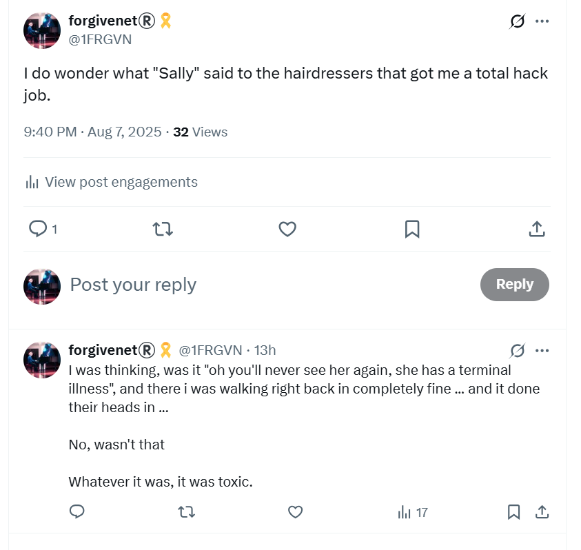

# August 2025

## A song to the mountains

- The mountains give me time to reflect and get my head straight.
- They whisper their secrets, as usual.

- My health is a shadow of what it was last year due to the poisoning but I'm still here so I'm grateful.
- I continue to notice my peripheral [eyesight deterioration](july.md#moorfields). 
- Nevertheless, I give every breath I have to God and thank Him for His grace.
- I do some high-altitude hiking to build up strength and fitness again.
- I'm certain I will be well again.
- I throw away a lot of stuff I think the [gypsy woman poisoned at Lourdes](july.md#eyes-and-kidneys-again-and-heart-now-too), but something is still giving me RA in my hands, I'm not sure what it could be.
- It stopped for a few days when I was serving Mary, and then started up again.
- Could it be my computer keyboard?

## Haircut

- I go for my regular haircut with the exceptionally good hairdressers here in Cauterets.
- I wonder if [whatever Sandra told them](../2024/september.md#the-hairdresser) the year before will be *in the air*.
- It is.
- The male hairdresser gives me a hack-job and appears to be angry with me.
- I'm amazed.
- I was wondering if maybe Sandra was so sure I'd never return, she told them I was terminally sick or something like that.
- But no, I think it was something more insidious.
- I tweet about it.

- A message flies by "Oh we know what it was, we know, we know!"
- It makes me wonder about the November 2024 hack-job in Bangkok, which curiously ended up being one of the best haircuts I ever had.

## Recruitment agents

- Having just had a couple of back-to-back, too-good-to-be-true headhunts from recruitment agencies (I have had zero queries in months and months, and only about two in total since I left Polygon last October/November), I'm wondering if the global tech porn elite, those who have known about the [porn fatwa on my head](../early-years/2003.md#porn-fatwa) commonly use recruitment agents to manipulate porn targets who might be working in tech.
- Could there be a female tech-colleague porn category these days?
- The emails remind me of the [Torus](../2023/august.md#head-hunted-by-ex-polygon-director) job which never existed and seemed to be part of the hacking I was enduring at the time, and the reason why I pulled out of the process.
- They also remind of the eventual [Polygon job interview and offer](../2023/november.md#polygon) and how an actor, Nadim, seemed to have been recruited to terrorize me, and then again in [Bali](../2024/may.md#bali) where an actor may have been recruited to be filmed having sex with me at a company offsite gathering.
- I'm also reminded of a job offer from a company I received just as I started to write out this statement. I had a really great chat with the Spanish CTO of a company: https://www.nexera.network/ or Alliance Block, perhaps another company that doesn't really exist. The Spanish CTO who lived in Alicante I believe was a member of the Kadampa Buddhist community and had been to the Merseyside temple. My suspicions came from the interview task I was expected to undertake which was easily a five day writing task. I told them I didn't have time as I had a writing task that was taking precedence but I could get back to it in a week or so. They said they weren't interested in continuing and stopped the process. 
- The recruiter was Joel Barden at Hype Talent who had also got me an interview right in the middle of the extreme persecution I was suffering in Denia, probably September 2023 sometime, with a company who treated me at the interview as if I was dirt. The interviewer had put a ridiculous grinning face on his zoom welcome and I was not impressed by them at all.
- I wouldn't be surprised if all of these circle back to Polygon, David Schwarz and Jordi, Denia hackers and porn production and broadcast companies.
- If this is true, then I have literally been working with men who have watched me while I was raped sedated; possibly as a child and maybe even live if they're prepared to pay for it.
- It's remarkable I managed to have any sort of career at all!
- Is this what the billions of dollars funding for crypto is really paying for? Female tech colleague-porn subscriptions?
- It would not surprise me.
- Do I have to be suspicious of everyone I have worked for over the last twenty years now as well?
- Let's see if the recruiters come back now.
