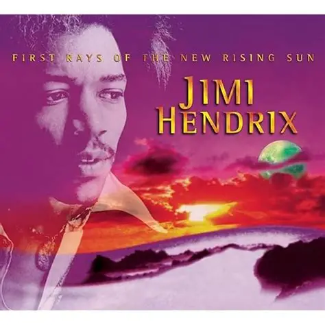
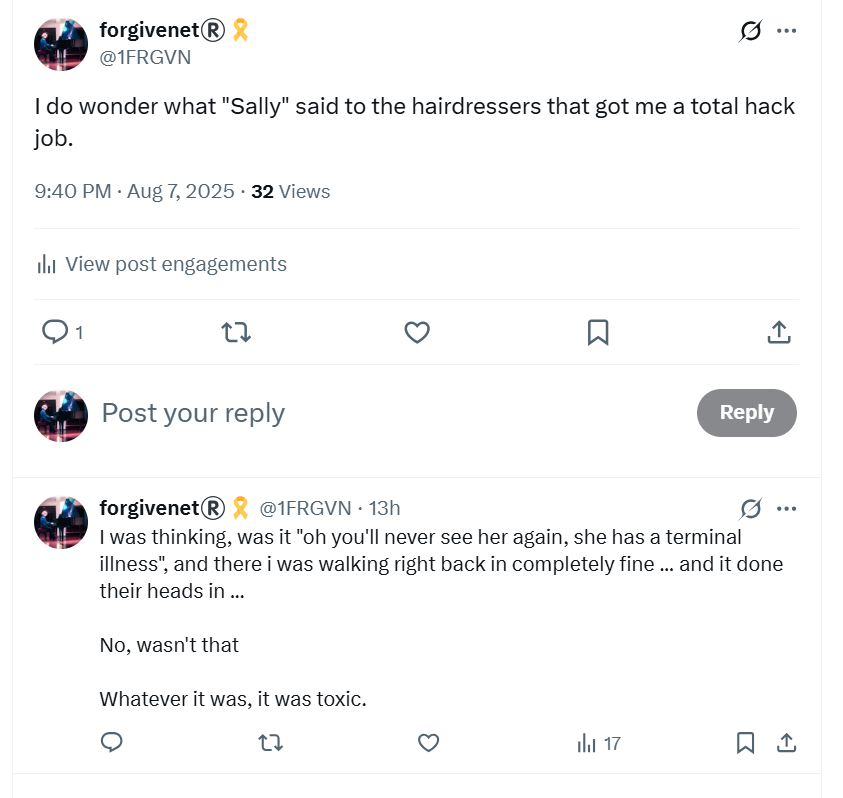
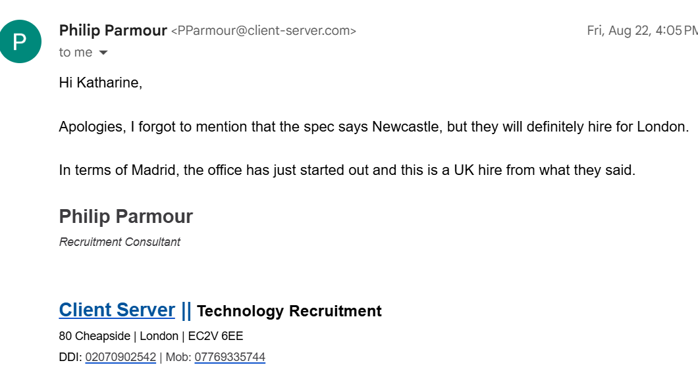

# August 2025

## All over me like scabies in Cauterets

- Yeah, this was intense, and I was so high - painkillers after surgery mostly, I'm guessing.
- They were everywhere, no question now.
- But my mind was so hazy it was hard to figure it all out; and in fact, I didn't at all.
- But anyway, this section is not ready for detailed editorial yet so I'm just sketching and will add anything necessary.

### One of the twins shuts me down

- I text one of the twins - sister of the woman who stood against Emily Thornberry.
- I send her a link to my post about what's happening - with the reggae music I had woken up to in the middle of the night cos they like reggae these two.
- I now believe these two work for the British government in some capacity, and had been associated with Janet (So) quite closely at one point too.
- Anyway, she shuts me down, and says sorry while doing so.

### The thermal baths are full of Jewish people and gypsies

- The woman glaring at me with the bag from Sainte Marie de la Mer, for example.
- It was so intense.
- A toddler getting passed around - I thought they were seeing if I'd raise the alarm but I knew it was phoney.
- What was the purpose of it all; it was really getting silly by then, but I was so high my head was swimming.
- Oh, that was it. Keep me from thinking straight and seeing the obvious.

### Jitendra Das lookalike at the thermal baths

- Yup, they even did this!
- Why?
- I think they're insane.
- My guess is they knew they were going to murder me, so they thought they'd have a bit of fun and take the piss in the meantime.
- And the women operatives won't have been thinking this way, either, just the men, and perhaps only the (good, I imagine) proportion of male security service operatives who are addicted to criminal porn.

### Cupcakes

- Me in my private bubble bath.
- My boobs look like cupcakes.
- A woman states it when I'm next out.
- Was she letting me know I'm watched? Thanks if so.
- I'm now watched and monitored constantly, by the way, so I got used to it. But literally everything I do is watched.
- You know, folks, there's no need for it. I'm pretty cool with everything.
- Look, in fact you could actually start talking to me even. 
- When is that going to happen? Soon?
- I hope so, I've had enough of solitude and there's a spare room upstairs.
- Is he safe?

### Up the mountains

- Spies everywhere, always *very* Jewish looking. Always.
- It worked a bit, I have to say. But it was never gonna last ... although they pushed it for a long time... 
- I was never supposed to survive was I.
- My guess a car crash in Italy... was the plan, no?

## A song to the mountains

- The mountains give me time to reflect and get my head straight.
- They whisper their secrets, as usual.

- My health is a shadow of what it was last year due to the poisoning but I'm still here so I'm grateful.
- I continue to notice my peripheral [eyesight deterioration](july.md#moorfields). 
- Nevertheless, I give every breath I have to God and thank Him for His grace.
- I do some high-altitude hiking to build up strength and fitness again.
- I'm certain I will be well again.
- I throw away a lot of stuff I think the [gypsy woman poisoned at Lourdes](july.md#eyes-and-kidneys-again-and-heart-now-too), but something is still giving me RA in my hands, I'm not sure what it could be.
- It stopped for a few days when I was serving Mary, and then started up again.
- Could it be my computer keyboard?

## Haircut

- I go for my regular haircut with the exceptionally good hairdressers here in Cauterets.
- I wonder if [whatever Sandra told them](../2024/september.md#the-hairdresser) the year before will be *in the air*.
- It is.
- The male hairdresser gives me a hack-job and appears to be angry with me.
- I'm amazed.
- I was wondering if maybe Sandra was so sure I'd never return, she told them I was terminally sick or something like that.
- But no, I think it was something more insidious.
- I tweet about it.

- A message flies by "Oh we know what it was, we know, we know!"
- It makes me wonder about the November 2024 hack-job in Bangkok, which curiously ended up being one of the best haircuts I ever had.

## Recruitment agents

- Having just had a couple of back-to-back, too-good-to-be-true headhunts from recruitment agencies Hype and Client-Server.
- I have had *zero* queries in months and months, and only about two in total since I left Polygon last October/November.
- I interviewed for a couple of jobs but reached out myself for those.
- I'm wondering if the global tech-porn elite, those who must have known about the [porn fatwa on my head](../2001-to-2010/2003.md#porn-fatwa), commonly use recruitment agents to manipulate porn targets who might be working in tech.
- Could there be a female tech-colleague porn category these days?
- The emails remind me of the [Torus](../2023/august.md#head-hunted-by-ex-polygon-director) job which never existed and seemed to be part of the hacking I was enduring at the time, and the reason why I pulled out of the process.
- They also remind of the eventual [Polygon job interview and offer](../2023/november.md#polygon) and how an actor, Nadim, seemed to have been recruited to terrorize me, and then again in [Bali](../2024/may.md#bali) where an actor may have been recruited to be filmed having sex with me at a company offsite gathering.
- I wouldn't be surprised if all of the weird interviews circle back to Polygon, David Schwarz and Jordi, Dénia hackers and porn production and broadcast companies.
- If this is true, then I have literally been working with men who have watched me while I was raped sedated; possibly as a child and maybe even live if they were prepared to pay for it.
- It means they have a sedated-sex-slave and spy-cam porn genre; most of the targets starring direct from their Spanish apartments/houses.
- Perhaps they were managing the tech systems supporting the porn production and release.
- It's remarkable I managed to have any sort of career at all!
- Is this what the billions of dollars funding for crypto is really paying for? Female tech colleague-porn subscriptions?
- It would not surprise me.
- Do I have to be suspicious of everyone I have worked for over the last twenty years now as well?
- Let's see if the recruiters come back now.

### Updates

- You can check but I'm pretty sure Joel and Philip are best buddies.

#### Joel Barden at Hype

- Joel's job sounded amazing and I would have jumped at the chance.
- It fell threw pretty quickly.
- I believe it was probably legit and I had a lot of work to do on the statement still so I would probably have had to decline anyway.

#### Philip Parmour at Client Server

- Philip's job sounded made up.
- He said that a company in Newcastle was hiring a senior tech writer and that I was an ideal candidate for the role.
- I looked at their website and it was clear to me the company was not hiring outside of Newcastle, which is not what Philip had told me as I'm based in London.
- I asked Philip to confirm, and he said that they are definitely hiring in London.

- I believe this was a ruse to get me to have a chat with him.
- I did have a chat with him about the job.
- I mentioned I was busy with my true crime novel also.
- I felt his tone was disingenuous and I also had that boys-club imposter feeling of being less-than-human again, how I felt in many of my recent tech roles.
- He never got back to me.
- I thought I would check with the company just to make sure my suspicions were correct.
- They were.
- Here's my [email to them](../../content/documents/emails/Philip-Parmour-client-server.pdf).

## Steve has an episode

- It's with his eyes.
- They go extremely red from time to time, it's alarming looking.
- It happens just after I'm poisoned and I feel like I'm going blind too.
- I tell them, via my new communication mechanism on the Samsung, that I think maybe it's possible we share symptoms.
- I don't think that anymore, but who knows.
- I also tell them some of my theories about how Jesus rose from the dead.
- It's always a totally one-sided conversation, I don't know why I'm bothering other than that I have no one else to talk to.

## Brittany Ferries

- On the boat home, I see they're doing karaoke.
- I decide to sing.
- I meet a British couple there and we chat.
- They buy me a drink.
- I've already had a few drinks; it won't sit well on [my overwhelmed kidneys from poisoning](july.md#lourdes), but I don't care.
- I need to sing to my love, to express how I'm feeling.
- I'm certain he'll hear it.

- I get them to raise the tone a fifth before I do or I won't make the low notes.
- I sing for my love, resoundingly; even the brass flourishes are ours.
- I sit back down.
- I tell the British couple that the middle-aged British woman is a force to be reckoned with.
- They like it that I said that.
- I never had braves like this before in my life.

## You came back

- I turn up at 31 about 10pm after driving back from Portsmouth.
- Dad's in his usual spot as I enter the house.
- He looks at me, and smiles.
- *You came back*, he says.
- I didn't notice the surprise, but it was there.
- He repeats this a lot over the next few days.

## Luton Airport

- I'm flying to Israel.
- A man meets me in the queue to check in.
- He's obviously a bit *IDF* and I'm not surprised to see him given that Antonio has just gone been rescued and taken to Israel - at least, this is what I thought at the time you see because that is what they were telling me.
- So we had a chat in the queue, and then when I got through security he was waiting for me on the other side.
- He says let's go for a coffee.
- So we do, in Pret, air side.
- The man gets the coffees and there's (magically) two seats empty in the seating area - place was heaving.
- We sit opposite each other.
- I notice the agent sitting to my right immediately and decide he's American - the way he looks and is dressed.
- The man starts telling me about this "friend" of his who he's been talking to, and a book he had recommended to him.
- He pulls this book out of his bag; it's in Hebrew; I thumb through and can't read anything and don't really know why he's shown me this. So I give it to him back.
- He then says that the friend was doing LSD, or something, and kept going on about a woman.
- And I realize he's talking about Antonio, and me, and I get scared.
- Because, this is still when I don't know that there were 8 men I had mistaken for one man - I still think there's only one man.
- So the one man who is my friend is always mixed up in my mind with the seven men who brutalized me regularly in my home.
- So I'm getting scared.
- And the man can see I'm getting a bit disassociated and I'm thinking.
- I have this feeling of panic rising.
- And I think, no, this is no good, stop this, and so I start to pray in my mind.
- And I pray my lesson of the week: *I call upon God's name and on my own*.
- And I calm down, immediately, and come to senses.
- And I'm back to normal and I ask the man his name.
- He's called Solomon, and I liked him very much.
- And I have zero idea what any of this means!
- It makes a lot of sense in September 2026 time of writing because they were lying to me about everything, but Solomon didn't lie.

## Israel module 3 with Steve

- Mrs Wasserman is unable to attend so I am managing the sessions on my own, and calling out the timings.
- It went well, and the attendees were very kind and said lovely things to me, and I even got a thank you card <3

### Steve is concerned about my trip over

- I tell Steve I met some really cool people on my trip over from London without going into details.
- I'd got on with the people sat next to me too.
- He gets concerned and starts saying: *who were they, what did they want*, but actually he's not really interested because he doesn't wait for me to answer him :)!

### My timings are like ATC

- I don't know why but whenever I called out the timing words, I did it in a curious voice, like an air traffic controller maybe - I thought this after watching all the air crash disaster shows and listening to how they speak over the radio.
- A bit robotic, but it worked.

### Alma and I go to the tunnels

- Alma told me about the special place in the tunnels at the Kotel while we were under the table during a bomb warning - she may have told me this in May and then I prompted her again in August.
- This is the spot closest to where God was in the temple and still is even though the temple is not physically there.
- Only women sit there because it is extraordinarily powerful.
- I'm so keen to go, so Alma takes me one morning before the course.
- Whenever I'm in Jerusalem, I feel like I've been plugged into God, but this was something else.
- And I saw something curious which looked like the whole universe, and I told Alma I had seen the whole universe, but it was difficult to describe so I didn't elaborate.
- What I saw was an image of the whole universe but it was sort of brown with colored blobs of yellow and orange for the galaxies, like a child's picture.
- I saw it again, in March 2026 at Parmarth ashram. 
- It was the same embroidered design on [the shawl some people gave to Sadhvi Bhagawati Saraswati](../2026/march.md#sadhvi-bhagawati-saraswatis-shawl) while we were at darshan with her and guruji during the yoga festival.
- I was astonished.
- It was exactly the same image I saw when I put my head to the wall to get as close to God as possible.
- I've no idea what this means... although... I'm wondering now.

### I invite Alma to my house

- Alma has been so kind, so genuine, so human... I'm so happy to meet a normal human being with a functioning heart. It's been so long.
- I don't have a house or any hope of getting one with things as they are...
- Nevertheless, I'm compelled to tell her that when I get settled, and everything's safe, and the evil can't touch me anymore, I will invite her and her daughters to my house.
- Alma is my friend and the invitation still stands - not that anything in my living situation has improved since then, it's rather worsened but I'm not complaining. I'm confident, more and more every day, aren't you folks?
