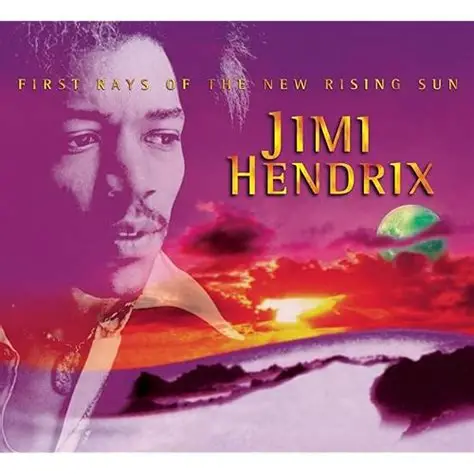

# August 2025

## A song to the mountains

- The mountains give me time to reflect and get my head straight.
- They whisper their secrets, as usual.

- My health is a shadow of what it was last year due to the poisoning but I'm still here so I'm grateful.
- I continue to notice my peripheral [eyesight deterioration](july.md#moorfields). 
- Nevertheless, I give every breath I have to God and thank Him for His grace.
- I do some high-altitude hiking to build up strength and fitness again.
- I'm certain I will be well again.
- I throw away a lot of stuff I think the [gypsy woman poisoned at Lourdes](july.md#eyes-and-kidneys-again-and-heart-now-too), but something is still giving me RA in my hands, I'm not sure what it could be.
- It stopped for a few days when I was serving Mary, and then started up again.
- Could it be my computer keyboard?

## Haircut

- I go for my regular haircut with the exceptionally good hairdressers here in Cauterets.
- I wonder if [whatever Sandra told them](../2024/september.md#the-hairdresser) the year before will be *in the air*.
- It is.
- The male hairdresser gives me a hack-job and appears to be angry with me.
- I'm amazed.
- I was wondering if maybe Sandra was so sure I'd never return, she told them I was terminally sick or something like that.
- But no, I think it was something more insidious.
- I tweet about it.

- A message flies by "Oh we know what it was, we know, we know!"
- It makes me wonder about the November 2024 hack-job in Bangkok, which curiously ended up being one of the best haircuts I ever had.

## Recruitment agents

- Having just had a couple of back-to-back, too-good-to-be-true headhunts from recruitment agencies Hype and Client-Server.
- I have had *zero* queries in months and months, and only about two in total since I left Polygon last October/November.
- I interviewed for a couple of job but reached out myself for those.
- I'm wondering if the global tech-porn elite, those who must have known about the [porn fatwa on my head](../early-years/2003.md#porn-fatwa), commonly use recruitment agents to manipulate porn targets who might be working in tech.
- Could there be a female tech-colleague porn category these days?
- The emails remind me of the [Torus](../2023/august.md#head-hunted-by-ex-polygon-director) job which never existed and seemed to be part of the hacking I was enduring at the time, and the reason why I pulled out of the process.
- They also remind of the eventual [Polygon job interview and offer](../2023/november.md#polygon) and how an actor, Nadim, seemed to have been recruited to terrorize me, and then again in [Bali](../2024/may.md#bali) where an actor may have been recruited to be filmed having sex with me at a company offsite gathering.
- I'm also reminded of a job offer from a company I received just as I started to write out this statement. I had a really great chat with the Spanish CTO of a company: https://www.nexera.network/ or Alliance Block, Sebastian Galimberti Romano, perhaps another company that doesn't really exist. The Spanish CTO who lived in Alicante I believe was a member of the Kadampa Buddhist community and had been to the Merseyside temple. We had a great chat. My suspicions came from the interview task I was expected to undertake which was easily a five day writing task. I told them I didn't have time as I had a writing task that was taking precedence but I could get back to it in a week or so. They said they weren't interested in continuing and stopped the process. 
- Were they trying to distract me from writing?
- The recruiter at that time was Joel Barden at Hype Talent who had also got me an interview right in the middle of the extreme persecution I was suffering in Dénia, probably September 2023 sometime, with a company who treated me at the interview as if I was dirt. The interviewer had put a ridiculous grinning face on his zoom welcome and I was not impressed by them at all. It must have been a set up. He wasn't this person, I don't think, but he looked like this:

- I wouldn't be surprised if all of these circle back to Polygon, David Schwarz and Jordi, Dénia hackers and porn production and broadcast companies.
- If this is true, then I have literally been working with men who have watched me while I was raped sedated; possibly as a child and maybe even live if they were prepared to pay for it.
- Perhaps they were managing the tech systems supporting the porn production and release.
- It's remarkable I managed to have any sort of career at all!
- Is this what the billions of dollars funding for crypto is really paying for? Female tech colleague-porn subscriptions?
- It would not surprise me.
- Do I have to be suspicious of everyone I have worked for over the last twenty years now as well?
- Let's see if the recruiters come back now.

### Updates

- You can check but I'm pretty sure Joel and Philip are best buddies.

#### Joel Barden at Hype

- Joel's job sounded amazing and I would have jumped at the chance.
- It fell threw pretty quickly.
- I believe it was probably legit and I had a lot of work to do on the statement still so I would probably have had to decline anyway.

#### Philip Parmour at Client Server

- Philip's job sounded made up.
- He said that a company in Newcastle was hiring a senior tech writer and that I was an ideal candidate for the role.
- I looked at their website and it was clear to me the company was not hiring outside of Newcastle, which is not what Philip had told me as I'm based in London.
- I asked Philip to confirm, and he said that they are definitely hiring in London.

- I believe this was a ruse to get me to have a chat with him.
- I did have a chat with him about the job.
- I mentioned I was busy with my true crime novel also.
- I felt his tone was disingenuous and I also had that boys-club imposter feeling of being less-than-human again, how I felt in many of my recent tech roles.
- He never got back to me.
- I thought I would check with the company just to make sure my suspicions were correct.
- They were.
- Here's my [email to them](../../content/documents/emails/Philip-Parmour-client-server.pdf).

## Dad tells me he's a spy cop

- Not a spy cop exactly, a spy robber would be a better term.
- He tells me he married my mother on request by the British government.
- He suggests it could have been any woman but he picked her for some reason.
- I don't know why he's telling me. It's high treason. Unless he's told someone else already and he's worried about it coming out.
- It was tense times in Belfast Northern Ireland when they met and they were both studying at Queen's University.
- He doesn't say if he was paid or if he had to do it to avoid jail for some perversion they had him on.
- I tell him I get it, it's what countries do to protect themselves. I can't imagine they got anything from him though and this vile act of deception destroyed us all.
- The news is unsurprising, rather liberating in fact.
- Suddenly, my life experiences make total sense.
- What he doesn't say is if he told the porn gangs of Dénia stating that no-one would ever investigate anything that happened to me.
- Is that why he's worried about it coming out now. 
- He knows they tried to murder me again in Lourdes and still I'm here.
- Did he very literally throw me, and my mother too, to the wolves?
- I wonder if they already knew anyway because the porn gangs of North London were well aware of it.
- Did my dad boast about it to the wrong people over the years, about how his daughter would have no humans rights if anything happened to her?
- When I think back to 1989, it does seem we were targeted, prepped, and groomed for a few months on the run up to the production of repeated sedated rape-gang porn with groups of black men on their mothers' kitchen tables and elsewhere in London.
- They must have made millions on the films and, like in Dénia, the massive resources spent on producing this porn would have been well worth it for a criminal enterprise.
- Did the rape-gangs of North London know it was safe to target me because of my dad's secret life?
- Did the people at the Red Lion share the porn with him afterwards?
- Is that why when I was broken and suffering from PTSD as a child, and would come home at night devastated after being bullied yet again by my friends, he would sit there, drunk, and giggle, as if he knew something about what had happened and it delighted him somehow?
- Is this why he and my mother blamed my black friend for everything that had happened to me?
- Not everyone knew about this, of course, or they wouldn't have bothered trying to punish him for his various evils through targeting me.
- It clears up why everyone is warned off me more recently, notably when [I stood for election in June 2024](../2024/june.md#election-campaign) and it was obvious I had been massively discredited and I no idea why.
- The truth is liberating but very upsetting at times.
