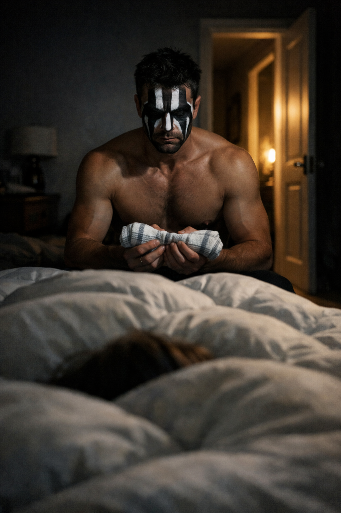
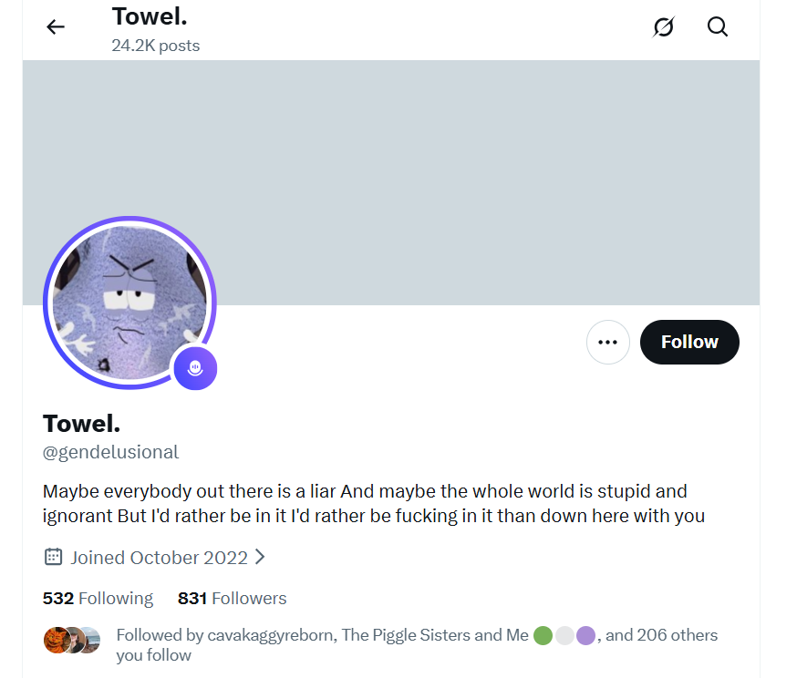

# December 2025

## Thailand fasting and detox clarity

- It's day seven of the fast and detox program.
- I'm peaceful.
- I'm feeling well too; free of a lot of the year's poison and toxins.
- I go for a nap in the afternoon.
- I'm not tired, I just need to rest for a bit.
- I've been lying down a short while and I suddenly see something in my mind's eye which causes me unease...
- I'm in my bed at Carrer Furs.
- Sitting on the left side of the bed to me is a man.
- He has no shirt on.
- I can't see if he is wearing anything on his bottom half as my duvet is in the way.
- He has the build of the swimmer in the [`@jctot19` profile](https://x.com/JCToT19/), but older and with a more defined musculature.

- He would match most closely the build of [Marc, number two trumpet teacher](../../crimes/protagonists/vidal-sastre.md#mark-from-english-class-in-2013), the man who turned up to chamber music class at the conservatory the most.
- He is wearing a face paint mask.
- The top-half of his face is painted with demonish black and white, vertical thin white stripes coming down his from the top of his head. 
- He is screaming and shouting and shaking his head around in a most bizarre manner.
- In his hand he has what looks like one of my kitchen tea towels.

- Is this where we get [the towel meme](../2024/march/13-end.md#an-account-i-believe-is-run-by-domingo-cano-the-piano-teacher) they've been using since 13th March 2024?

- He holds it taut at both ends, stretching and twisting it.
- He slaps the bed with it.
- Just like the [Jitendra Das](../early-years/2010.md#why-i-decided-to-be-celibate-for-the-rest-of-my-life) lookalike did with his napkin at dinner one night at the [Polygon conference in Bali](../2024/may.md#the-pakistani-yorkshire-man).
- It feels too distressing to witness.
- I ask for guidance.
- I start thinking about [Winston May & Nicky](../../crimes/protagonists/winston-may-and-nicky.md) and remember that in 1989 he had told me they'd both recently traveled to Spain.
- I get up and write about it.
- I lose my sense of peace for a good few hours.
- Something tells me that what I saw was related to events on [13th March 2024](../2024/march/13-end.md#wednesday-13th-march) when I woke up certain I was going to be murdered and texted everyone I knew (Chris BJ, Alessandra, Brenda, Sandra, maybe others) to that effect.

## The cockney geezer with the emotionless young women

- A cockney geezer is hanging out on Lamai beach every day.
- He's about 60, black hair probably dyed, geezer.
- He has two young women with him who don't speak.
- He speaks.
- A lot.
- He's always shouting on his phone.
- One day, I walk past him, and he says: *you mean all the way from twenty years ago*.
- Seems like he's referring to me.
- I think: *twenty-five*.
