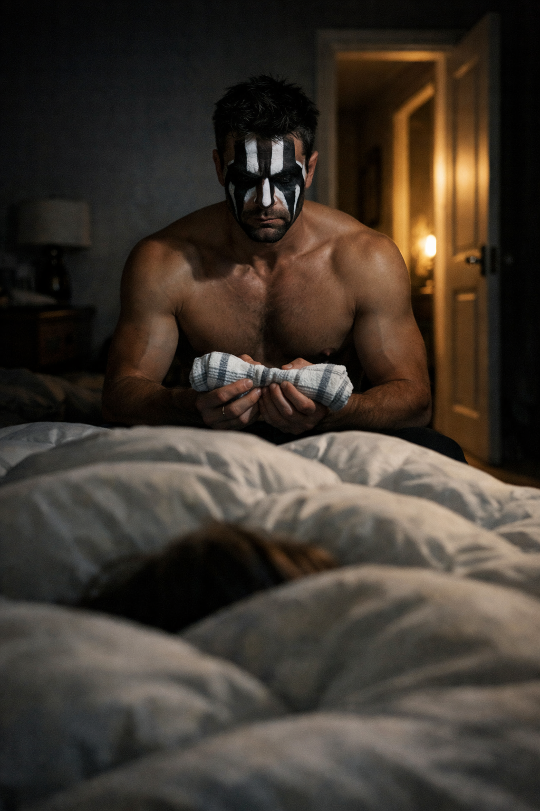
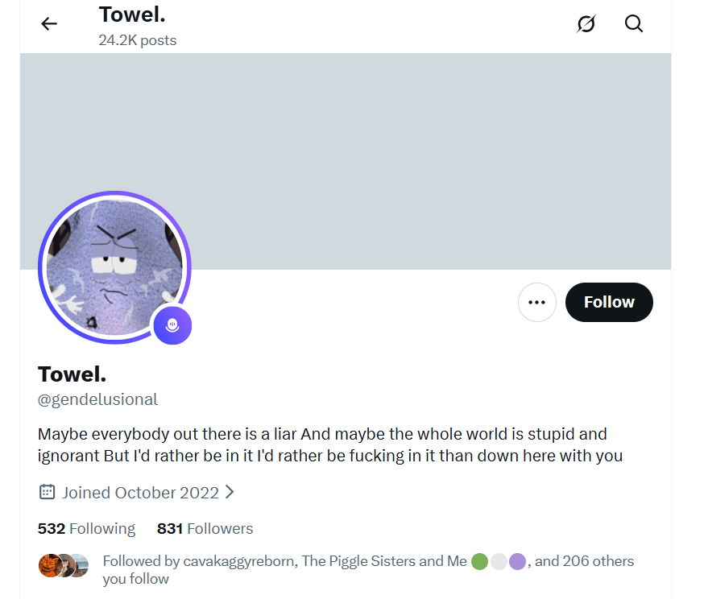

# December 2025

## Thailand fasting and detox clarity

- It's day seven of the fast and detox program.
- I'm peaceful.
- I'm feeling well too; free of a lot of the year's poison and toxins.
- I go for a nap in the afternoon.
- I'm not tired, I just need to rest for a bit.
- I've been lying down a short while and I suddenly see something in my mind's eye which causes me unease...
- I'm in my bed at Carrer Furs.
- Sitting on the left side of the bed to me is a man.
- He has no shirt on.
- I can't see if he is wearing anything on his bottom half as my duvet is in the way.
- He has the build of the swimmer in the [`@jctot19` profile](https://x.com/JCToT19/), but older and with a more defined musculature.

- He would match most closely the build of [Marc, number two trumpet teacher](../../crimes/protagonists/vidal-sastre.md#mark-from-english-class-in-2013), the man who turned up to chamber music class at the conservatory the most.
- He is wearing a face paint mask.
- The top-half of his face is painted with demonish black and white, vertical thin white stripes coming down his from the top of his head. 
- He is screaming and shouting and shaking his head around in a most bizarre manner.
- In his hand he has what looks like one of my kitchen tea towels.

- Is this where we get [the towel meme](../2024/march/13-end.md#an-account-i-believe-is-run-by-domingo-cano-the-piano-teacher) they've been using since 13th March 2024?

- He holds it taut at both ends, stretching and twisting it.
- He slaps the bed with it.
- Just like the [Jitendra Das](../2001-to-2010/2010.md#jitendra-das-yoga-teacher-porn-star) lookalike did with his napkin at dinner one night at the [Polygon conference in Bali](../2024/may.md#the-pakistani-yorkshire-man).
- It feels too distressing to witness.
- I ask for guidance.
- I start thinking about [Winston May & Nicky](../../crimes/protagonists/winston-may-and-nicky.md) and remember that in 1989 he had told me they'd both recently traveled to Spain.
- I get up and write about it.
- I lose my sense of peace for a good few hours.
- Something tells me that what I saw was related to events on [13th March 2024](../2024/march/13-end.md#wednesday-13th-march) when I woke up certain I was going to be murdered and texted everyone I knew (Chris BJ, Alessandra, Brenda, Sandra, maybe others) to that effect.

!!! tip "Thoughts on this"
    - I think this probably did happen, but not on 13th March 2024.
    - That event was a bunch of teachers and perverts [suffocating me with my pillows and duvet in my bedroom while I was sedated](../2024/march/13-end.md#the-pillow-game) to make sure I left my studies at the conservatory.
    - It worked too; I quit the next day.
    - I guess I was holding up the next session of switcheroo porn for one of the minor girls...
    - Probably [the British girl](../2024/february.md#the-britishrussian-girl-at-the-conservatory) given we Brits seem to be the main source of feed for these animals; the feed that *no-one* will do anything to help.
    - Must have been really annoying for them, all that delay.

## Someone dresses up as Gabriel Silva from Polygon

- I'm relaxing by the beach a couple of days after arriving.
- An American is standing at the posh hut nearest the beach talking to someone.
- He has dressed up to look like [Gabriel Silva](../2024/august.md#gabriel-silvas-first-team-meeting-as-manager); cap, shorts.
- Is he putting on his accent too; he sounds a bit like him also?
- He's talking to the other person about how he's just got divorced.
- I wonder why they would be winding me up like this?
- Is it so I include the matter here?
- I guess so.
- Are they still doing the *who goes to prison* deals?
- I guess so.
- I see the man a few days later, and he looks *completely* different and appears to be with a bunch of other Americans and his accent is nothing at all like Gabriel's.

## The cockney geezer with the emotionless young women

- A cockney geezer is hanging out on Lamai beach every day.
- He's about 60, black hair probably dyed, geezer.
- He has two young women with him who don't speak (are they policewomen?).
- He speaks.
- A lot.
- He's always shouting on his phone.
- One day, I walk past him, and he says: *you mean all the way from twenty years ago*.
- Seems like he's referring to me.
- I think: *twenty-five*.

## I'm having a detrimental effect on the local economy

- I seem to be under house arrest of some sort.
- When I go to have a massage at the pier near the resort, a very serious looking older Thai couple walk past me and the woman says, *you should stay at home*, as she passes me.
- I feel like everyone knows who I am.
- I don't go back to the pier for a massage.
- The only reason I went there was because there is a strange feeling at the usual place I go to.
- It's like they close the shop to all other customers when I turn up.
- It's very strange, and I don't like it.
- The owner who was very friendly towards me the year before, is now distant.
- They're calling me *khun-khun* too, which I think is a little derogatory.
- If I'm so famous everywhere, why hasn't anyone been nicked yet?
- I guess we had to get *every last one of them*, innit.
