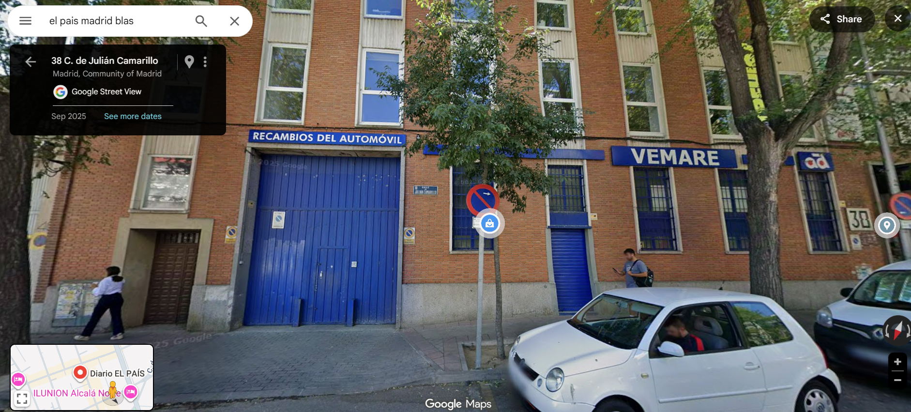

## Car detailing in Madrid 

- I am getting continuous warnings on X not to drive the car.
- They started while I was in Thailand in December 2024 while I was getting ready to return to Europe.
- When I pick up the car from the carpark at Madrid airport, I immediately have that feeling of toxicity in the air and things I'm touching.
- My mouth and throat is dry and scratchy the whole night.
- I suspect criminals accessed the car while it was in the carpark in Madrid airport and sprayed pesticides all over the upholstery and plastics, just as [they did in my apartment](../2024/october.md#the-router-malfunctions).
- I wonder if they're able to add continuous doses of toxins through the air vents too.
- [I picked Paul up at the same time](january.md#paul) and I ask him what to do about this as he works on cars.
- I already asked him to bring industrial masks and gloves from London.
- He says to find a detailer and get it cleaned.
- I search for a car detailer online.
- I find [a detailer near the El Pais offices in San Blas](https://garagedetail.es/) in Madrid.

- There's a hotel just a step away also.
- I book the car in for detailing and book a few days at the hotel while they do it.
- Obviously, my online search results are controlled by criminal gangs, and I'm aware of this, but I have no choice.
- When I pick up the car from the detailers and start driving, it feels like the whole dashboard section has been moved closer inwards.
- I'm not able to put the same things back in the glove compartment that were there previously without issue; they don't fit!
- My feet are misfiring as they step on the clutch because it's in a different place; it's too close and it's not the position of the car seat
- I wonder about this with Paul, and suggest the gangs might have got the detailers to put something in the car, or create a space in the car between the engine and the dashboard.
- I suspect a poisoning system or drugs.
- Paul, curiously, spends a great detail of energy in talking me down from my fears about this, and indeed everything criminal I have suspicions about with regards to the car and my apartment.

## El Pais

- TBC
- Batman

## Paul helps me move back to UK

- I have no one else to help me, so I ask [Paul](january.md#paul) if he would like an all expenses paid trip to Spain and back to help me collect my stuff.
- He agrees.
- I meet Paul at Madrid airport and we drive down to Denia to collect my stuff.
- I ask him if he will have a look around the flat for anything suspicious and I tell him about the hole in the wall behind the mirror.
- When we look, there's no massive hole in the wall; its a rather tiny hole in fact.
- I realize I was hallucinating *hard* in October 2024 to have seen a fist-sized hole in the wall.
- I'm horrified.
- I ask Paul to look around to see if there is any evidence of tampering with the plumbing or the TV.
- He tells me everything is normal, but he is unconvincing.
- He is especially unconvincing regarding the TV and tells me that if he takes the back off it it'll break it and he won't be able to get it back on.
- I don't believe him.
- It feels like he's doing and saying what he's been told to do and say.
- He tells me the odd-looking piping in the kitchen is normal.
- Paul shows me messages from his friend Lucy about her new girlfriends.
- He even shows me a rather pornographic photo that she's sent him.
- I'm rather appalled and don't really know what's going on but know it's all very uncool.
- He says things that sound like they came out of my police statement from 2015.
- He tells me he told his family I made "grands a day", on my crypto business. I'm furious.
- He keeps telling me about his urinary symptom of "diabetes" that matches exactly my urinary symptom from poisoning.
- I believe he is keeping an eye on me for the Adams family and will be paid for his services in cocaine.
- I believe the medication he takes every day is either cocaine or something similar to keep him going.

### Child gang-rape porn

- I tell Paul the whole story about what's been going on in Denia and how it is related to when I was sexually abused as a child.
- He asks me; "How didn't you go mad?"
- I tell him I think the Adams family are involved.
- He tells me he went to school with one of them; a male who committed suicide.
- I tell him I was right to be suspicious of him.

### Lourdes

- We stop at Lourdes.

### London

- We arrive back in London.
- I'm driving Paul back to his car where he lives.
- It's late and we're both tired.
- As we pull up to the junction at the bottom of Muswell Hill, the light goes green but it is not signalling right so I don't go. 
- There's a feeder light usually. At least there was the last time I drove here, over 5 years previously.
- Paul says, go go, it's green, so I move forward, but there is oncoming traffic so I can't turn right.
- I break and ride the clutch a little bit but the car won't move, it is revving hard, but not moving, and I'm trying to go in and out of first, and I can smell this awful smell.
- Paul pulled the handbrake button without my knowledge.
- "What's that smell?" I say.
- "You hammered the clutch," Paul says.
- It's too late to think about this more but I know something's wrong.
- I leave Paul at his car and thank him for saving my life.
- I drive home alone.
- At some point a car pulls out in front of me and I end up following it all the way to Church Lane N2.
- It's number plate is XXXX WTF. (The Xs are numbers I can't remember.)

## Moving back to UK

- I spend most of February moving my stuff back to my house in London.
- It's all rather traumatic.
- I start to find evidence that all my belongings have been tampered with and this could only have happened if people had access to my apartment.

### My belongings have been doused in pesticides

- I realize all my belongings have been doused in pesticides or similar.

### My conservatory papers

- All formal conservatory notifications for the years 2022-23, and 2023-24, are missing from my files.
- Fortunately, I have kept copies of everything.
