# February 2025

## Car detailing in Madrid 

- I have been getting continuous warnings on X not to drive the car.
- They started when I was in Thailand in December 2024, not long after I had parked it at Madrid airport, and while I was getting ready to return to Spain.
- When I go to pick up the car from the carpark at Madrid airport in early January, I immediately have that feeling of toxicity in the air I'm breathing and on the things I'm touching.
- My mouth and throat is dry and scratchy the whole night.
- I'm perma-high at that time so I don't notice any change in perception.
- I suspect criminals accessed the car while it was in the carpark at Madrid airport and sprayed pesticides all over the upholstery and plastics, just like [they did with all my belongings, clothes, shoes, linen, bed clothes, furniture items, everything in my apartment](../2024/october.md#the-router-malfunctions), just like they do to all their criminal porn-targets and others who don't play nice, and/or when they've finished with them.
- I wonder if they're able to add continuous doses of toxins and drugs through the air vents too?
- I remember getting high in the car on long drives - from Lourdes to Dénia for example - and it would always be about an hour after setting off I'd notice a significant change in perception, often including sexual arousal too.
- [When I pick Paul up](january.md#paul) at Madrid, I ask him what to do about the toxicity in my car.
- Paul works on cars, you see.
- I already asked him to bring industrial masks and gloves from London, which he did but he's not taking me seriously.
- He says to find a detailer and get the car professionally cleaned.
- I search for a car detailer online.
- I find [a detailer near the El Pais offices in San Blas](https://garagedetail.es/) in Madrid.

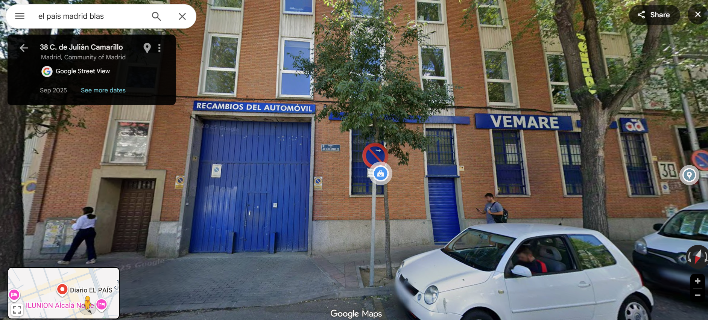

- There's a hotel just a step away also.
- I book the car in for detailing in early February, and book a few days at the hotel while they do it.
- I arrange for Paul to fly to Madrid from London again after I have had the car cleaned, and I plan we drive down to the Marina Alta together to get my belongings.
- Obviously, my online search results are controlled by criminal gangs, and I'm aware of this, but like all their porn targets relying on the Internet - and with zero help from law enforcement, that I'm aware of at the time - I have no choice in this at all.
- Perhaps this means they've continually dropped themselves in it, for decades.
- Amazing!

### My car has been massively altered somehow

- When I pick up the car from the detailers and start driving, it feels like the whole dashboard section has been moved closer inwards.
- I'm not able to put the same items back in the glove compartment that I removed while they worked on the car (they were important documents in a folder, and a stack of CDs I didn't want nicked, some other things that I removed from the car before I took it in - probably no-one believed me, did they).
- These items fit previously in the glove compartment without issue, and leaving a little space too; and now they don't fit at all! The CDs are under the front seat instead now.
- My feet are misfiring also as they step on the clutch because it's in a different place; the pedal is too close and it's not the position of the car seat that's changed.
- I wonder about this with Paul, and suggest the gangs might have got the detailers to put something in the car, or create a space in the car between the engine and the dashboard.
- I suspect a poisoning/drugging system, or a compartment for drugs, and I am seriously concerned I'm gonna be arrested for drug trafficking on the way back to London.
- Paul, curiously, spends huge amounts of energy in talking me down from my fears about this, and indeed everything criminal I have suspicions about with regards to the car and my apartment and my belongings and my personal safety, in fact.
- He often just changes the subject when I'm describing these things.
- I won't know till October that Paul is aware of everything that's been happening to me since 1989 at the hands of thousands of men who thought they'd get away with raping sedated women, children, and babies, or enjoying the films of it on the criminal and not-so criminal porn networks, isn't it.

### I think Toby lives in his car, Trish tells me

- Back in late 2022, when Trish and I were talking about Toby on a Saturday hike just before the start of [the switcheroo porn extravaganza running live and direct from the music school, children starring, and my apartment, the population of Dénia starring](../../crimes/protagonists/vidal-sastre.md#at-least-six), and everyone stopped talking to me so I'd be fully isolated from the normal world, she told me she thought Toby, her adult son, lives in his car in the UK.
- She wasn't sure though.
- She then expressed concern about his safety in the UK, and a wish that he would return to Spain where, she seemed to believe, he'd be safer.
- I'm not so sure about that.
- I guess Toby had aired his suspicions about the gangs, and his step-father even, and been targeted, probably from even when he was back in school out there.
- But at least they left Toby his car to live in!
- With me - and most women and children they target I guess - they fully intended my total demise; personal, professional, taking breaths, everything; knowing no-one would ever help me, a British and Irish national, a foreigner, and they can do what they want with the foreigners.
- I certainly surprised them, didn't I.
- That's why they poisoned my car; so I could not live in it when the need may arise - with the help of porn-addict conspiring males of the family - if they didn't manage to *get me* beforehand, and by this time it was looking sketchy with the ole poisoning attempts...
- It's curious they didn't give up; that must be the way of homicidal psychopathy.
- I guess, however, the ole poisoning has been 100% effective on the thousands of other mass porn-stalking victims, that they must have thought there'd been an accident in the administering process, or something.
- They should have spoken to the super-duper poisoners who must have been *very surprised* by February 2025, if not a while before, not that it helped any mass porn-stalking victims whose lives are in peril, then or now.
- Did they sedate and rape Toby too?
- Have they been sedating and raping and filming the foreign kids at the schools for decades?
- Seems likely dunnit.
- God is good and He can't believe what we've been doing to each other, it's so awful.
- *Oh, I never meant to hurt any children and babies*, the nuts-and-bolts financiers of the Dénia baby-raping empire will cry out..

## El Pais

- One evening while I'm staying in San Blas, I get back to my hotel quite late.
- It's dark.
- I think I probably met Inma for dinner that night but I can't remember as I'm perma-high from spiking, and they did such a good job of drugging and poisoning me I'm pretty sketchy about the whole of 2025 until November.
- I guess feeling like you're going to be murdered all the time makes for pretty sketchy too.
- I take a different route from the Metro and follow the road that the El Pais offices are on.
- There's a giant picture of Batman on the wall of the El Pais offices.

- In 2026, as I draft this section, the criminals try to tell me online that [it was only spiderman that they dressed up as](../2024/march/13-end.md#spider-man) before coming round to my house after I had gone to bed and been sedated while sleeping.
- And I say nonsense.
- A whole community of porn-addicts knows very well about [*Batman and little girl*](../../evidence/memes-and-triggers.md#batman-and-little-girl), an early meme from the very famous [switcheroo days](../../crimes/protagonists/vidal-sastre.md#a-dashing-heathcliff-sort-good-looking-younger-man-with-lots-of-black-hair) where Batman was one of the taller more muscular men pretending to be a school teacher at the conservatory, a genuinely good looking man, but a total twat in his behavior.
- Was he the dummy good-looking trumpet teacher who was a little bit thick who seemed to have never spoken to a woman in his whole life; someone they always relied on for the film star element of the love affair trick?
- I have this man down in [second place, one of at least four potentials](../../crimes/protagonists/vidal-sastre.md#at-least-four-more), next to [the first man](../../crimes/protagonists/vidal-sastre.md#an-older-man-maybe) who does seem like he could be some sort of relation.
- I can state, categorically, that I will remember each and every one of the men that turned up to classes at the conservatory when I see pictures of them again, and certainly even some of the men that turned up in my bedroom too, some of whom I was familiar with from [over twenty-five years ago](../2001-to-2010/2001.md#amsterdam).
- Even Maria Hontanilla would mention *Batman and little girl* at piano classes while the switcheroo porn was being filmed live at the conservatory.
- I do a double take when I see the Batman mural on the El Pais office wall and I decide to go into the offices the following day to talk to a reporter.
- I go in and I explain I have a major story and ask to speak to a reporter.
- I speak to two reporters.
- Firstly, a man who I explain a little about Dénia porn-gangs, sexploitation, corruption, murder, spy-cam porn, etc.
- He gets me a woman to talk to me.
- I explain everything to the good-looking young woman who comes out to talk to me with long curly brown hair.
- She was sort of bored, looking out of the window, I was crying a little.
- I never heard from her again although I emailed her a bunch of times.
- Her name was... Lola.
- No joke.
- Remember: the porn-gangs know exactly where I am and what I am doing at any moment. 
- They have probably got the man with a porn-subscription to talk to me - and what man in Spain doesn't have a criminal porn subscription these days - and got him to bring a donut out, or a woman who has been told I'm an idiot.
- I sent Lola, and another woman reporter at El Pais - possibly Isabel Valdes - copies of all the letters I sent to the British consulate offices in Madrid that I detail in the next section.
- I think this is probably where I refer to the criminal gangs deleting my emails before they get sent.
- I now believe Spain is utterly broken by criminal porn, top to bottom - they have infiltrated the schools after all - and the gangs were more than happy, proud even, for me to see Batman on the wall of El Pais, because they clearly own the media as well as the government school-board and police.

## Visiting the British embassy in Madrid on 7th February

- I'm in Madrid and I'm scared.
- Paul is due to arrive on Saturday 8th February in the afternoon when we plan to drive down to Dénia and stay in the Marriott for two nights and on the Sunday collect my belongings from Carrer Furs.
- I have a British removal man coming on the morning of the 9th who will shift the big stuff for me.
- I know very well that there's something about me personally, or me characteristically (I'm British and female) that means the British government do not care about my safety and have been trying to throw me to the wolves since I first complained to them in February 2024, if not before.
- Even so, Paul is coming to Spain now and we'll be in the war zone itself.
- He's British and male. 
- I feel I have a responsibility towards his safety, and I'm concerned he will not be safe, like myself and many others in Dénia.
- There's a lot I haven't figured out about Paul and his connection to North London British criminals gangs at this stage, although I am suspicious of him.
- Nevertheless, he's a friend and I feel obliged to somehow do my best to ensure his safety in Spain.

### I write a long letter to the British ambassador

- I decide the best thing to do is to approach the ambassador himself directly.
- I have been ignored multiple times on email, I lost count how many times I tried to get help via messages to their X account `@ukinspain`, and whenever I called the British embassy in Madrid I was fobbed off, so I figure my best bet is to go along in person and hand-deliver a letter so they cannot deny they have the information I have been collating with the help of friends about serious crimes against British, Irish, Argentinian, Czech, and other foreign women and children and babies living, holidaying, and studying, often disappearing and/or ending up murdered in Spain, and in case anything bad happens to me and Paul in Dénia at the weekend.
- Here is the letter that I write by hand (due to hacking) in my hotel room in San Blas the night before I visit the embassy.

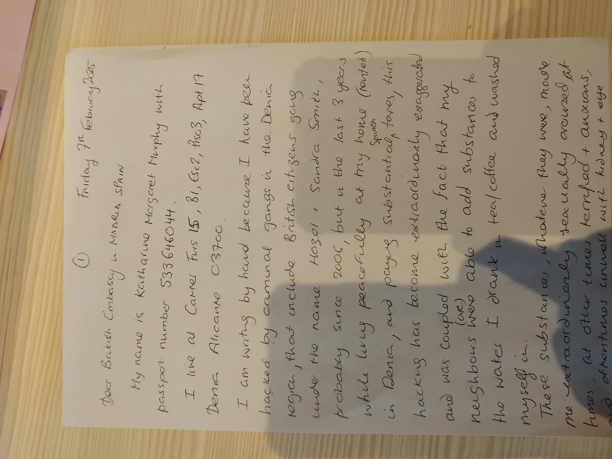
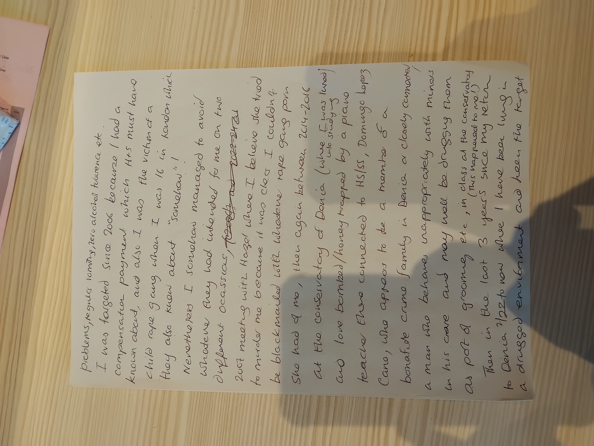
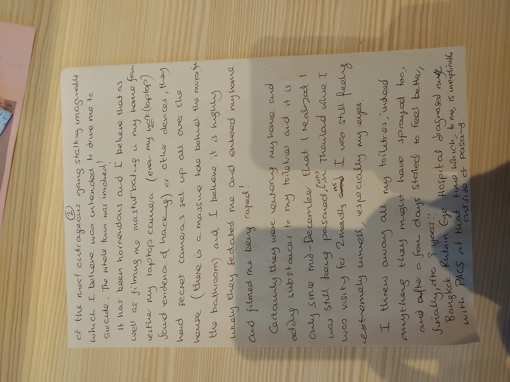
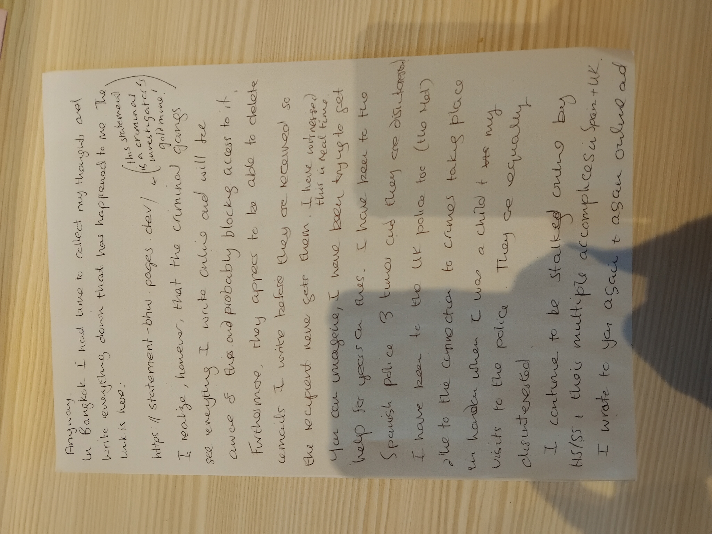
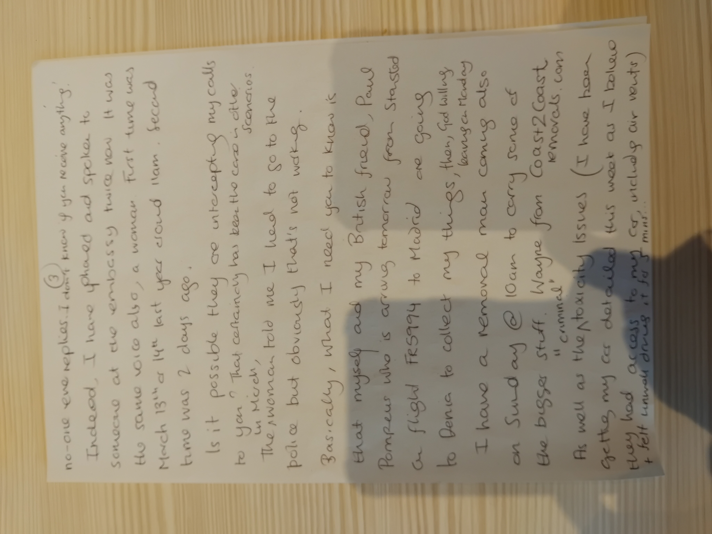
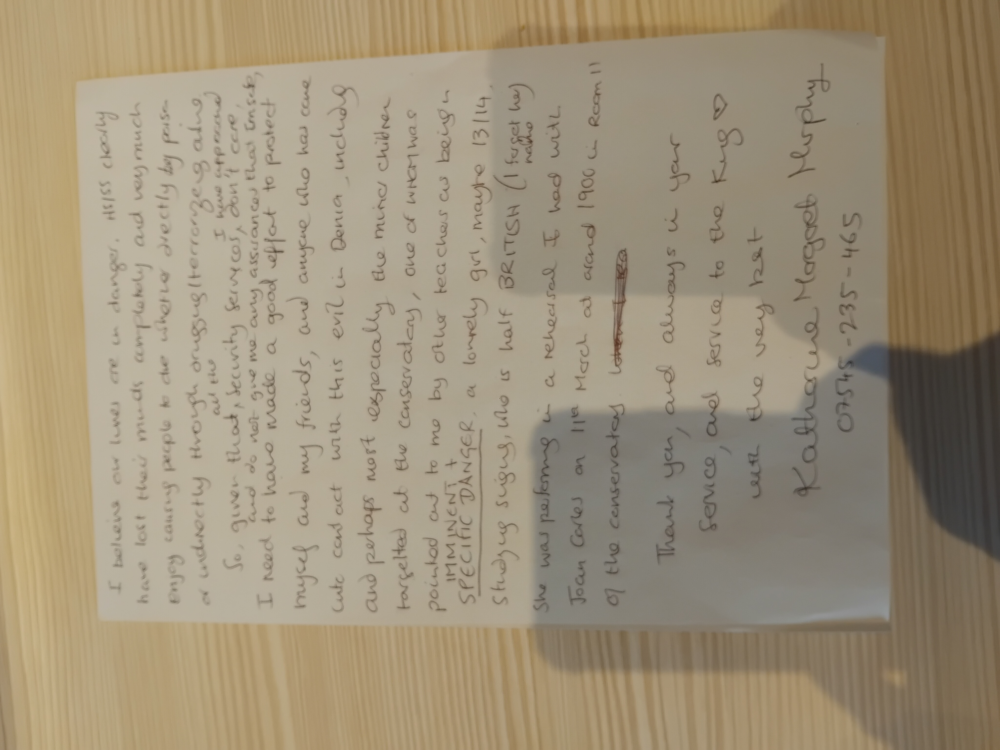

#### Transcript of the original letter

##### Page 1 front

Friday 7th February 2025
Dear British Embassy in MADRID SPAIN
My name is Katharine Margaret Murphy with passport number 533646044.
I live at Carrer Furs 15, B1, Esc2, Piso3, Apt 17 Denia Alicante 03700.
I am writing by hand because I have been hacked by criminal gangs in the Denia region, that include British citizens going under the name Hazel & Sandra Smith, probably since 2006, but in the last 3 years while living peacefully at my home (rented) in Denia, and paying substantial taxes, this hacking has become extraordinarily exaggerated and was coupled with the fact that my neighbours were/are able to add substances to the water I drank in tea/coffee and washed myself in. 
These substances, whatever they were, made me extraordinarly sexually aroused at times, at other times terified & anxiouss, and oftentimes unwell with kidney and eye

##### Page 1 backside

problems, regular vomiting, zero alcohol tolerance, etc.
I was targeted since 2006 because I had a compensation payment which H&S must have known about, and also I was the victim of a child rape gang when I was 16 in London which they also know about "somehow"!
Nevertheless, I somehow managed to avoid whatever they had intended for me on two different occasions, 2007 meeting with Hazel where I believe she tried to murder me because it was clear I couldn't be blackmailed with whatever rape gang porn she had of me, then again between 2014-2016
at the conservatory of Denia (where I was lured into studying) and love bombed/honey trapped by a piano teacher there connected to HS/SS, Domingo Lopez Cano, who appears to be a member of a bonafide crime family in Denia or closely connected, a man who behaves inappropriately with minors in his care and may well be drugging them as part of grooming etc, in class at the conservatory (this happened to me!)
Then in the last 3 years since my return to Denia 2/22 to now where I have been living in a drugged environment and been the target

##### Page 2 front

of the most outrageous gang stalking imaginable which I believe was intended to drive me to suicide. The whole town was involved!
It has been horrendous and I believe that as well as filming me masturbating in my home from either my laptop camera (even my work (laptop) found evidence of hacking) or other devices, they had secret cameras set up all over the house (there is a massive hole behind the mirror in the bathroom) and I believe it is highly likely they sedated me and entered my home and filmed me being raped!
Certainly they were entering my home and adding substances to my toiletries and it is only since mid-December that I realized I was still being poisoned. I was in Thailand where I was visiting for 2 months and I was still feeling extremely unwell, especially my eyes.
I threw away all my toiletries, indeed anything they might have sprayed too, and after a few days started to feel better finally, after 3 years!!
Bangkok Rutnin Eye Hospital diagnosed me with PACS at that time which to me, is inexplicable outside of poisoning.

##### Page 2 backside

Anyway.
In Bangkok I had time to collect my thoughts and write everything down that has happened to me. The link is here.
https://statement-bhw.pages.dev
This statement is a criminal investigator's goldmine! 
I realize, however, that the criminal gangs see everything I write online and will be aware of this and probably blocking access to it. Furthermore, they appear to be able to delete emails I write before they are received so the recipient never gets them. I have witnessed this in real time.
You can imagine, I have been trying to get help for years on this. I have been to the Spanish police 3 times and they are disinterested. I have been to the UK police too (the Met) due to the connection to crimes taking place in London when I was a child and my visits to the police.
They are equally disinterested.
I continue to be stalked online by HS/SS + their multiple accomplices in Spain + UK.
I wrote to you again and again online and

##### Page 3 front

no-one ever replies. I don't know if you receive anything.
Indeed, I have phoned and spoken to someone at the embassy twice now. It was the same voice also, a woman. First time was March 13th or 14th last year, second time was 2 days ago.
Is it possible they are intercepting my calls to you? That certainly has been the case in other scenarios. The (in March) woman told me I had to go to the police but obviously that's not working.
Basically, what I need you to know is that myself and my British friend, Paul Pompeus who is arriving tomorrow from Stansted on flight FR5994 to Madrid are going to Denia to collect my things, then, God willing leaving on Monday.
I have a removal man coming also on Sunday @ 10am to carry some of the bigger stuff. Wayne from Coast2Coastremovals.com
As well as the criminal toxicity issues, (I have been getting my car detailed this week as I believe they had access to my car, including air vents) and felt unwell driving it for 5 mins.

##### Page 3 backside

I believe our lives are in danger, HS/SS clearly have lost their minds completely and very much enjoy causing people to die, whether directly by poison or indirectly through drugging/terrorizing online. So, given that all the security services I have approached don't care, and do not give me any assurances that I'm safe, I need to have made a good effort to protect myself and my friends, and anyone who has come into contact with this evil in Denia including and perhaps most especially the minor children targeted at the conservatory, one of WHOM was pointed out to me as being in IMMINENT AND SPECIFIC DANGER, a lovely girl, maybe 13/14 studying singing who is half British (I forget her name). She was performing in a rehearsal I had with Joan Carles on 11th March at around 19:00 in room 11 of the conservatory.
Thank you, and always in your service, and service to the King with the very best ♡
Katharine Margaret Murphy
07545-235-465

### Supplementary pages

- I put the letter in an envelope and add the address and delivered-by-hand instructions.
- A short while later, I realize I haven't finished, and I write two more supplementary pages.
- I do my best to explain [the trumpet-teacher switcheroo-porn scam](../../crimes/protagonists/vidal-sastre.md#at-least-six) even though there's still a good while before October 2025 when I figure out what happened myself.
- I still think it is just one man!

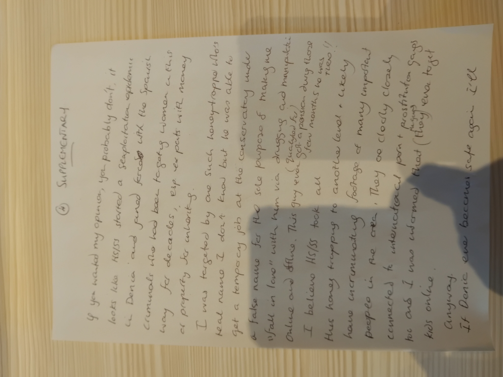
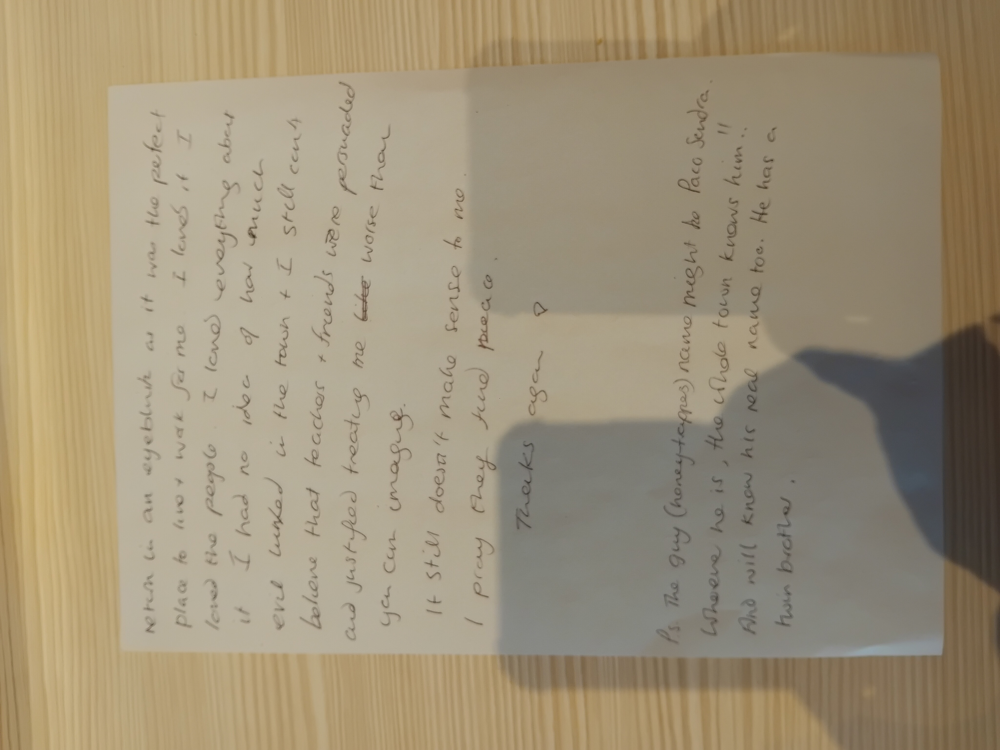

- It's just extraordinary to me the amount of evil they piled onto me.
- It seems to never ever stop.
- If it was just me, it wouldn't be a big deal, but these people have been murdering and scamming women, girls, and babies for porn for decades.
- It's time it stopped.

#### Transcript of the supplementary letters

##### Page 4 supplementary front

SUPPLEMENTARY
If you wanted my opinion, you probably don't, it looks like HS/SS started a sexploitation epidemic in Denia and joined forced with the Spanish criminals who had been targeting women in this way for decades, esp ex pats with money or property for inheriting.
I was targeted by one such honey-trapper who's real name I don't know but he was able to get a temporary job at the conservatory under a false name for the sole purpose or making me "fall in love" with him via drugging and manipulation online and offline. This guy even (qualified for) got a pension during those few months he was there.
I believe HS/SS took all this honey-trapping to another level and likely have incriminating footage of many important people in the area. They are clearly closely connected to international porn + prostitution gangs too and I was informed that they even target kids online.
Anyway.
If Denia ever becomes safe again I'll

##### Page 4 supplementary backside

return in an eye-blink as it was the perfect place to live wak for me, I loved it, I loved the people, I loved everything about it
I had no idea how much evil lurked in the town & I still cant believe teachers and friends were persuaded and justified treating me worse than you can imagine.
It still doesn't make sense to me. I pray they find peace.
Thank you again
Ps. The guy (honey-trapper's) name might be Paco Sendra. Whoever he is, the whole town knows him!! And will know his real name too. He has a twin brother.

### I take the letter in person to the embassy

- The next morning, I take the letter in person to the embassy at the tower on the Paseo de la Castellana.
- It's raining and cold.
- I go to reception and ask the receptionist if I can deliver a letter to the British embassy.
- She says no, I cannot. They do not have a post service at the reception.
- She says I can take it downstairs to the basement to the post department, but that sounds like a bad idea to me.
- She says that I can call them from her phone, and she picks up the phone and dials the embassy.

#### Speaking to the UK foreign office

- The phone is ringing.
- I hear an automated message and I'm asked to dial numbers (I can't remember the specifics) but I am put through to the British Foreign Office in London.
- A woman answers the phone. 
- Her name is Anna, she says.
- I explain what's going on.
- Specifically, I tell her I have a letter for the ambassador because I'm afraid for my life and the life of my British friend who is coming to help me.
- She asks me to explain more about what's happening.
- I tell her I've been gang stalked by the people of Dénia, including my neighbours, and that they have been poisoning and drugging me, adding poisons to my water, filming me, and coming into my house to douse my belongings with pesticides.
- The woman is *horrified*!
- I cannot understate how horrified Anna is.
- She gives me a foreign office number and says she has opened a case.
- I start to cry.
- I always cry when people act normally about all this, or show any empathy at all, it's so unusual. 
- I've had to be so hard, so unemotional, to survive all this.
- I wonder if I'll just collapse into a heap for years if anything ever gets done.
- My view is that if I had have been treated well at any point in my life by anyone that mattered, I would never have survived any of this.
- So I'm weeping, and I notice there's a gypsy woman hovering around.
- I tell the woman at the foreign office I believe there's a woman listening to our call.
- I am having this conversation in public at the reception table at the tower, and I'm obviously very upset.
- I notice the long-blond-haired woman in her 60s is texting...
- The woman in London tells me not to worry, and to continue to talk to h...

#### I'm cut off

- The phone call cuts off completely.
- They've put the phone down on me.
- I had written the foreign office case number on a little piece of paper the receptionist gave me, which I consequently lost or it was stolen from me.
- Maybe Paul got rid of it on instruction.

#### I call back

- I call back.
- A man answers, his name is David he says when I eventually ask him for it.
- He's very officious and he wants *nothing* to do with me.
- He gives me the police officer *Lauren Ott* special; *you have to call the police*, he says, *we can't help you*.
- I give him the number the woman gave me, and I tell him more or less exactly what I told the woman in London.
- He is totally uninterested.
- I cannot understand it.
- It's utterly incongruous.
- He's trying to get rid of me.
- I explain I have a letter for the ambassador and I ask him if he is embassy staff.
- He says yes, he is embassy staff, but no-one is going to come down and collect my letter.
- It's inexplicable.
- I get annoyed with him and ask him if there is anyone at the office at all.
- He suggests not, that they're all working from home.
- This gives me some sense of an explanation; some sense of not being left to the pleasure of Spanish poisoners and murderers by my own country.
- I get cross with him and ask him what might happen if there's an emergency.
- It's a ridiculous conversation anyway; the man has been told to get rid of me, to have nothing to do with me.
- I put the phone down.

### I write a few more pages describing these events to add to my letter

- I'm amazed, as usual, by the total lack of interest from the UK government into British citizens, especially minors, in imminent danger in their homes, schools, and going about their daily lives in Spain.
- Are the British government well aware of what's going on and have decided to brush it all under the carpet?
- It seems likely; or they're heavily involved in criminal porn distribution.
- It means hundreds maybe thousands of victims ignored over many decades.
- I go for lunch at El Corte Ingles and write a couple more angry pages to add to my letter.
- Here they are.

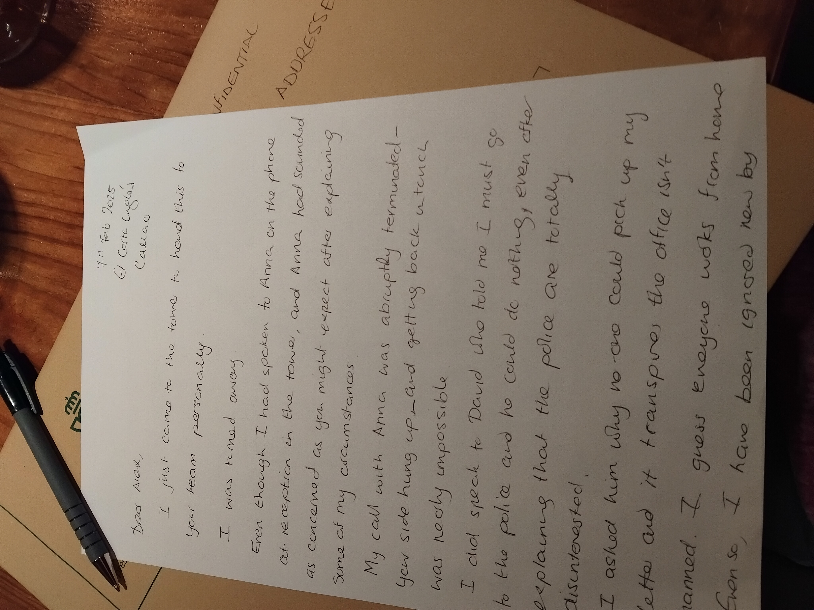
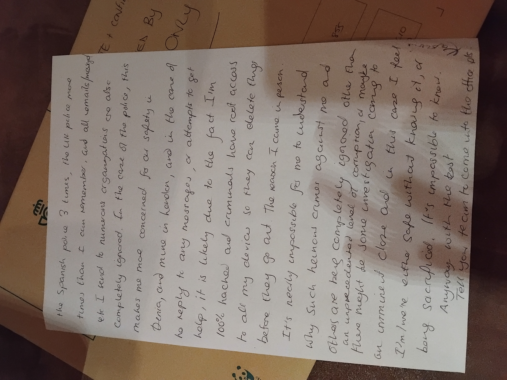

#### Transcript of the further supplementary letters

##### Supplementary front

7th Feb 2025
El Corte Inglés
Callao
Dear Alex
I just came to the tower to hand this to your team personally.
I was turned away.
Even though I had spoken to Anna on the phone at reception in the tower, and Anna had sounded as concerned as you might expect after explaining some of my circumstances.
My call with Anna was abruptly terminated - your side hung up - and getting back in touch was really impossible.
I did speak to David who told me I must go to the police and he could do nothing, even after explaining that the police are totally disinterested.
I asked him why no-one could pick up my letter and it transpires the office isn't manned. I guess everyone woks from home. Even so, I have been ignored now by

##### Supplementary backside

the Spanish police 3 times, the UK police mere times than I can remember, and all emails/messages etc I send to numerous organizations are also completely ignored. In the case of the police, this makes me more concerned for our safety in Denia, and mine in London, and in the case of no reply to any messages or attempts to get help, it is likely due to the fact I'm 100% hacked and criminals have root access to all my devices so they can delete things before they go out. The reason I came in person. It's nearly impossible for me to understand why such heinous crimes against me and others are being completely ignored other than an unprecedented level of corruption, or maybe there might be some investigation coming to an imminent close and in this case I feel I'm/we're either safe without knowing it, or being sacrificed. It's impossible to know.
Anyway. With the best. Tell your team to come into the office pls.

#### Something I find interesting reading these back...

- I'm always looking for a way to explain things so that everyone apparently *normal* comes out looking *normal*.
- I literally cannot believe what is happening to me, how I'm being ignored and silenced, and I'm constantly trying to find ways to understand it that make rational and reasonable sense.
- Is this the state that all the women, girls, and child victims find themselves in in Spain, if they survive long enough to complain about it?
- I don't do this so much nowadays (time of writing June 2026) - because it's obvious the gangs are protected at the highest level - but at the time I could only understand these horrendous reactions to me being due to the gangs intercepting all my messages and deleting them.
- I don't think they did that at all now.
- They don't have to, for some horrible **HORRIBLE** reason that puts everyone traveling to Spain in porn-gang peril, and everyone deciding to move there in even more.

### Proof of delivery

- Here are the letters I bound up.
- I also sent this registered/signed for at the Callao post office just after I wrote the previous two pages.
- The letter was successfully delivered to the embassy a day or two later.

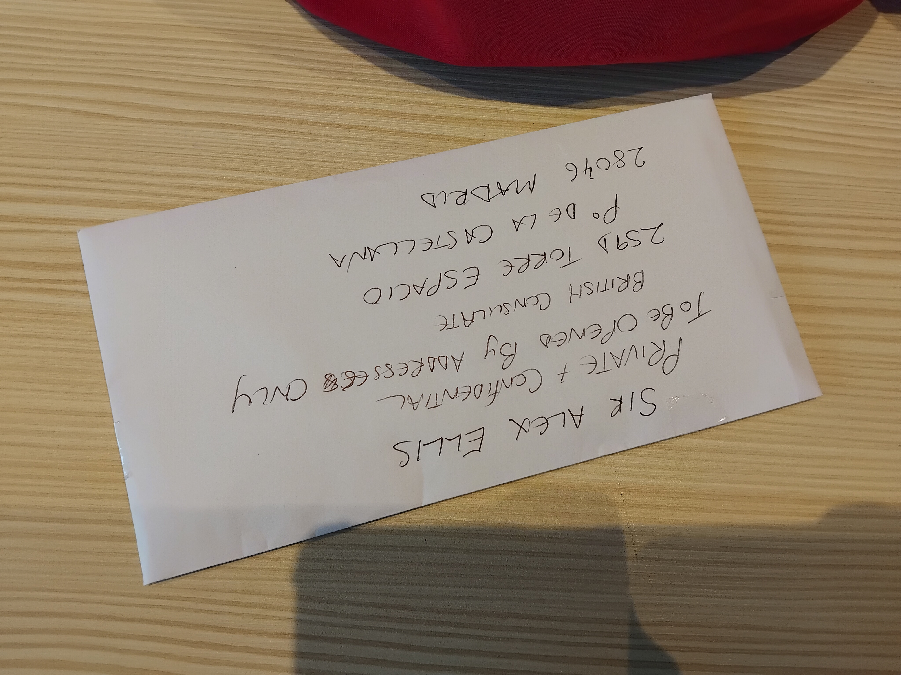
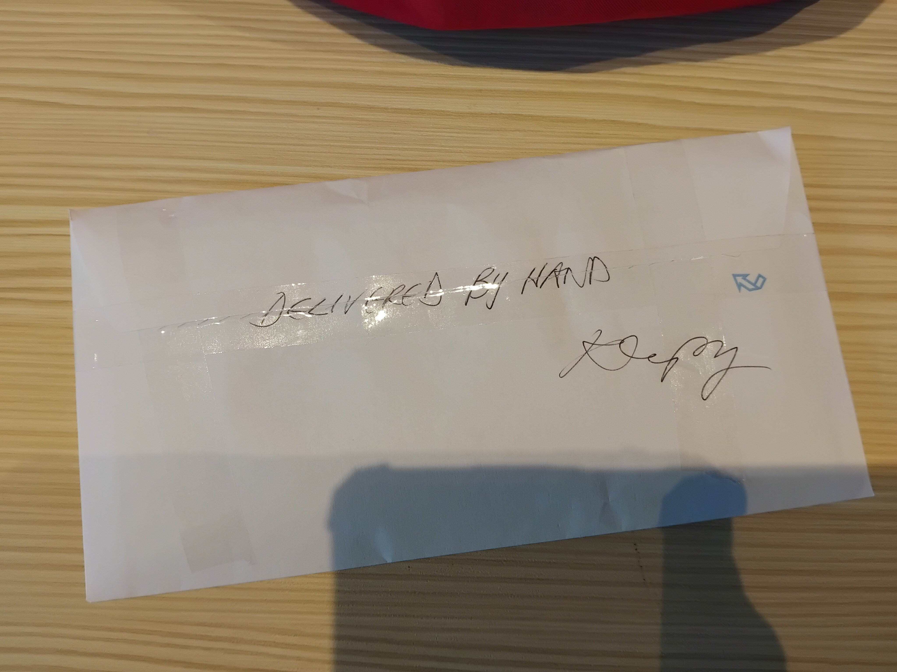

## Reply?

- There was none.

## Paul helps me move back to once-Great Britain

- I have no one else to help me, so I ask [Paul](january.md#paul) if he would like an all expenses paid trip to rape-porn-obsessed-Spain and back to help me collect my stuff from baby-rape, bestiality and snuff-murder capital of the world.
- No point in mentioning the bestiality or the snuff really, everyone thinks that's OK, normal; the baby-rape now... are they fiercely protecting that too? 
- The way the British judiciary treats the baby-rape-porn financiers these days, it certainly seems so.
- He agrees.
- I meet Paul at Madrid airport and we drive down to Dénia.
- We stay two nights at the Marriott.
- On the Sunday morning we go to Carrer Furs to meet Wayne from Coast2Coast and to collect my belongings.
- I ask Paul, handyman and odd-job man, if he will have a look around the flat for anything suspicious.

### The hole behind the mirror in the bathroom

- I tell him about the hole in the wall behind the mirror in the bathroom - where I had often felt overwhelmed with sexual arousal and masturbated - and how you could fit your hand in it.
- This is what I had seen in [October 2024, the week after I was fired from Polygon so that the gangs could get on and murder me by poisoning, and I was surviving this murder-attempt (without realizing it), giving interviews on YouTube, and looking for the spy-cams](../2024/october.md#trying-to-find-the-cameras) in my apartment.
- I must have been ingesting some seriously toxic substances that made me hallucinate all that because when I go to look behind the mirror with Paul, there's no massive hole in the wall; its a rather tiny hole in fact.
- There is a hole there that shouldn't be there, big enough for a spy-cam, and something was definitely wired up there at some point in the past, but...
- I realize I was hallucinating *hard* in October 2024 to have seen a fist-sized hole in the wall.
- I'm horrified!
- Paul gets it.
- He knows very well about the effects of drugs.
- But he deflects, *this is just the wires for a light that was there before they put the mirror up*... nonsense, there was no light there in the original design which included the same size mirror which would totally obscure a light in that position, and the apartment had not been amended since it was built in 2007 or so.
- He then looks at the mirror and says, *this is not a two-way mirror*.
- I'm aware of this.
- I believe they swapped the mirror over, and removed a lot of other evidence when they broke the Internet router and doused all my belongings in pesticides, and even while [they thought I was dying in my own apartment](../2024/october.md#activity-in-the-nextdoor-apartment-number-18).
- I had tried to get the mirror off the wall previously, probably in June of that year, and it was stuck tight. I could not shift it at all.
- I took the mirror right off in February 2025 with Paul standing beside me, no problem.
- My view is the gangs poisoned me with methanol that week in October, and the police in UK and Spain could have analyzed the samples I took of the water from the mains supply to give them, the supply that the Cano Lopez's and my neighbor Marie Carmen were [tampering with every day that week](../2024/october.md#who-is-involved-in-poisoning-and-drugging-me-at-my-home-in-carrer-furs), and the police in two countries refused to do so.
- My guess is they refused because of the thousands of people already dispatched in this way; murders fully protected by the police and documented as normal-deaths by conspiring porn-gang medics and judiciary.

### Tampering with the plumbing, water mains, air-conditioning vents, TV, etc

- I ask Paul to look around to see if there is any evidence of tampering with the plumbing, the TV, or other installations.
- He tells me everything is normal, but he is unconvincing.
- He is especially unconvincing regarding the TV - which Pedro suspiciously told me he would have nothing to do with if it went wrong - *don't ask me to fix the TV* he said in December 2021 as I was moving in.
- Paul tells me that if he takes the back off the TV it'll break it and he won't be able to get it back on.
- I don't believe him.
- The TV is ancient, no-one cares if it breaks.
- It feels like he's doing and saying what he's been told to do and say.
- He has *too much* to say about the TV that I suspect there's a massive camera in there.
- He tells me the odd-looking water-piping system - something I have never seen before anywhere - in the kitchen under the sink is normal.
- Paul changes the subject a lot.
- He often starts talking about things related to my horrific experiences over the years, such as talking about his urinary symptom of "diabetes" that matches exactly my urinary symptom from poisoning and kidney damage - or, I'm wondering now if it's a symptom of constant stress.
- Is Lucy prompting him continuously on WhatsApp?
- I believe Paul is keeping an eye on me for the Adams family and is being paid for his services in cocaine and other drugs.
- I believe among the stack of tablets he takes every day is something they've given him, all dressed up as regular meds - just like my mother's sedating drugs she buys on the Internet and receives by Royal Mail - either cocaine or something similar to keep him going.
- He doesn't shut up much though... and he repeatedly shows me his medication packets too - *this is for diabetes, this for ... etc* as if he's proud of them, or perhaps he's trying to convince me he's not perma-high like he seems to be.

#### Paul admits something about the air-conditioning units that he'd previously vociferously denied possible

- Paul had previously told me, repeatedly and loudly, that there was no chance of being drugged with the air-conditioning system.
- I had told him I wasn't able to get up to the roof to check the other side of the system or the storage room, it was always locked.
- He then, suddenly, changed his story, after receiving a text, and quietly said actually, no, they could add something to the air-conditioning system on the roof which could gas the inhabitants of an apartment.
- Where did he get this new information?
- Was Adams dropping the Lopez-Cano's in it?
- My view is that the gassing was going on with some venting system from next door, like I had seen with the [unusually built tunneling into number 18 from my bedroom's air-conditioning vents](../2021/december.md#something-not-right-with-the-air-conditioning-unit) but I guess it's possible they fix a controlled output mechanism to the outside units they have access to, to be able to administer sedating gas to anyone in the apartment in the bedroom or living room whenever they want to.
- They always need a few conspirators living in the same apartment building, don't they, someone to manage the spy-cam network and press the gassing button when they can see the victim has safely gone to bed, or to apply the hallucinogenic/happy gas just after the victim awakes after sedated-rape, or whatever.
- Who told him to tell me this, while denying everything else that was more likely? 
- Lucy maybe?

### Child gang-rape porn and the Adams Family

- Like I mentioned previously, I tell Paul the whole story about what's been going on in Dénia and how it is related to when I was sexually abused as a child by North London's Jamaican rape-gangs.
- I tell him more and more of the story I can remember as we spend so much time together during this trip.
- He only ever said, [*How didn't you go mad?*](january.md#telling-paul-whats-been-going-on-for-me).
- No words of comfort, anger, a shocked demeanor, concern for women and children.
- Does he think this is a normal thing for a woman, or child, to experience?
- Does he know of countless victims more who did go mad?
- I tell him I think the Adams family are involved.
- I mention Adams a lot and he knows I'm suspicious of his connection to them.
- He eventually tells me he went to school with one of them at Highgate Wood; a male who committed suicide.
- Did someone tell him to say something in the hope it'll stop me being suspicious?
- I don't know anything about these people but I tell him at that moment that I believe more than ever I am right to be suspicious of him and his criminal connections.
- He says nothing.

### Wayne from Coast2Coast

- Wayne's a geezer.
- When he comes into my apartment, Paul lies on the sofa and pretends to be asleep the whole time he's there.
- I tell Wayne about the conservatory teachers and how the kids are in peril in Spanish schools.
- He has a teenage daughter living with him in Spain.
- I warn him in no uncertain terms that his daughter is in danger.
- He's not worried, he's a geezer.
- I tell him, look, Wayne, your daughter inherits everything from you, she's a massive target and they don't care if we live or die, no-one helps the Brits.
- He gets thoughtful.
- A good guy.
- His mate who delivered my stuff to 31 about a week later was similarly cool and I shared my website with him because I'm concerned about everyone's kids in Spain and elsewhere, as the *whole world* should be.

### Lorraine's ex-daughter (trans son Jayden) at the Chinese restaurant

- I take Paul for dinner at the Chinese restaurant on the Sunday night.
- A bunch of the Moors & Christians group are having dinner there at the same time.
- I recognize a few of them; there's some conservatory parents amongst them, particularly the fat man (Dénia TV is it, or [the guy that was angry outside my apartment](../2024/october.md#driving-to-madrid-on-my-way-to-fatima)) who is sitting with a good view of me and Paul.
- It would not surprise me if the Moors & Christians organization was a major introduction agent for criminal porn and relieving-people-of-their-health-property-and-wealth activities in the region.
- We've sat down for about ten minutes when Lorraine's trans child, Jayden walks in.
- When she was 13, or earlier, she was targeted online massively by the porn-gangs on Hazel Smith's instruction. Hazel won't deny it.
- No doubt they sucked her into the self-harming porn circles at that time, and I wonder if they flashed some of that up to Lorraine in her last days, the way they did with [the porn of me when I was a kid](../2023/november.md#first-time-they-flash-up-my-naked-16-year-old-body-on-x).
- I'd put money on it.
- The gangs have obviously requested Jayden's attendance at that very moment in the restaurant so that we see each other.
- Jayden looks a bit surprised walking in, bemused, as if Jayden wasn't expecting such a large group of people to be there.
- I'm not sure if Jayden sees me; although the Moors & Christians are looking over at us repeatedly, and they're bound to have pointed us out.
- When we go to leave, the woman who owns the Chinese restaurant wants to know why I'm in the town.
- It's an odd question from a random person who isn't supposed to know anything about you.
- How does she know I'm not living there anymore?
- I would come in regularly for a while, then not for months when I was traveling. There was nothing unusual about me being there.
- Does she know I was being sedated and raped in my apartment?
- Do they all watch Dénia TV for the latest on the multiple spy-cam sex slaves they've set up in the region?
- Did she assume I'd left Dénia because she hadn't seen me on [the sedate-and-rape-specials](../2001-to-2010/2008.md#denia-tv) for months?
- You know, if it wasn't because of the obvious animosity between Hazel and Lorraine back in 2008 or earlier, and Lorraine finding out things (Hazel sedating young famous good-looking Spanish men and then blackmailing them with sex films most likely), and the vindictiveness of Hazel generally, they might have had me at "trans kids"... but not a chance in hell that isn't fully part of their hypno-tech.
- Of course it is, something arising from sick porn genres that they grabbed onto and ran with, and then the lie spreads and other evil groups realize its value to them, and so it grows and grows and apparently normal people are totally fooled by it, and no-one knows how to contain it anymore... and it is such a sick and twisted lie; an obvious world-destroying whopper.
- It's amazing how so many believe it... but they should maybe have a look inside, especially at the stomach and heart emotions whenever someone says something against the lie, and perhaps notice how angry they are... violently angry, often, ready to kill, and know that this is how it starts, murderous mass-psychosis.

## Lourdes

- We stop at Lourdes for a few days on the way home.
- I take Paul to see Mary.
- His reaction to Her reminds me of my dad's reaction [the Autumn before](../2024/september.md#lourdes-with-dad).
- Quietness, reluctance to meet Her properly, a little shame perhaps, but we don't talk about it.
- As we walk through the grotto, we both smell a very powerful perfume and he tells me it was the perfume his aunt wore, or someone close to him.
- I thought this was marvelous.
- I had planned to drive all the way through France back to the UK but I change my mind about it because Paul is driving me mad and taking the piss.
- It's hard work.
- My brain has a limit of how much it can put up with people who take the piss, or shout constantly about nothing, (or who have wronged you in an extraordinary manner and are pretending they didn't), so I decide we'll get the boat home from Bilbao instead of spending days getting a massive druggy ear bashing through France which is a long drive.
- On the boat, Paul fills every pocket he has with bottles from the bar.
- He has a lot of deep pockets, I notice.
- He's making a chinking sound as he walks.
- He's stocking up for when I leave him and stop buying him his meals.
- It's a total tragedy.
- Did Adams target Paul the same way they did my brother with his Lockerbie compensation - really-nice-geezer friends, a lovely looking lady, etc - knowing his mum was giving him tens of thousands to do the house up in Clovely Road?
- Do they have a list of people who have been sexually assaulted as children - they know cos they sold the child porn of them at the time - and they target those people when they get some money because of how easy it is to manipulate a person with unhealed sexual trauma?
- It's the whole shame thing, isn't it (...we're going to be sorting that out completely and pointing it in the right direction, finally).
- What's interesting to me is how the criminals maintain the reverence their robbed-and-abused helpers have for them.
- Of course, a druggy has an unquestionable reverence for the drug-deliverer... but my brother seems to have a reverence for their woman-hating... like that made them more special and worthy of bowing and scraping (snickering).. shared hatred, isn't it.
- Did they rape my brother violently causing him extreme sexual trauma (he went to bed for over a year or more after getting home from Thailand in 2011)? Then carefully pulling him out of trauma, bit by bit, while maintaining his fierce hatred for women to ensure he'll do whatever they tell him to if it's gonna hurt a woman, especially a family member...
- Did they manage to get him to blame me for whatever they did to him in Thailand?
- It would not surprise me. In fact, it explains everything rather well.
- There'll be porn of it too, i.e. evidence.
- Someone's already gotten a hold of it, ChatGPT told me.
- Mary always has a miracle for us.
- Thank you Mary.

## London

### I release Paul

- When we arrive back in the UK, I tell Paul he is released from his obligations.
- It's a huge relief for me.

### Paul is furious with me though... raging

- ..for releasing him from his obligations, I guess, and the obligation on my side to feed him.
- A total tragedy.
- We arrive back in North London.
- I'm driving Paul back to where he's parked his car, his home.
- It's late and we're both tired.
- As we pull up to the junction at the bottom of Muswell Hill to turn right towards Hornsey, the light goes green but it is not signalling right, so I don't go. 
- There's a feeder light usually. At least there was the last time I drove here, over 5 years previously or more even.
- Paul says, *go go, it's green*, and I'm tired and I don't expect him to take that much of the piss, so I move forward, but there is oncoming traffic so I can't turn right.
- I break and ride the clutch a little bit but the car won't move, it is revving hard, but not moving, and I'm trying to go in and out of first, and I can smell this awful smell.
- (Paul been pulling the handbrake button up without my knowledge.)
- "What's that smell?" I say.
- "You hammered the clutch," Paul says.
- It's too late to think about this more but I know something's wrong with this picture.
- Exhausted now, I leave Paul at his car and thank him for saving my life.
- "You saved my life Paul", I say and I'm very grateful.
- We hugs.
- I drive home alone.
- The next day or a few days later I noticed someone has glued the paintwork on my car.
- Was it Paul? 
- Was he *that* angry with me? 
- I don't really care about things like this anyway, but I guess it could have been anyone instructed to, or Paul, and I am to find out there are willing porn-stalkers literally everywhere I go in London, every time I step outside of the house away from the very willing porn-stalkers at 31.

### WTF

- After I leave Paul in Hornsey, I carry on back to N2.
- At some point, a car pulls in front of me and drives in step with me.
- I think it has pulled out of Summerlea Avenue or Durham Road maybe.
- I notice the woman driver a little.
- I end up following it all the way along Fortis Green then East End Road to Church Lane N2 where I pull off to the right.
- The car's number plate is XXXX WTF. (The Xs are numbers I can't remember.)
- The woman driver looks a bit like [Hala](../2023/july.md#hala), but much more like [the woman I will see in the waiting room at the doctors surgery](september.md#rutland-house-surgery-muswell-hill) when I go in to report all the poisoning symptoms over many years I have listed for them, and they're all hopping around, making sure the network's down so they can't add it to the system, etc....
- I will see a few more interesting number plates over the next few months that seem to be very specifically for me to see.

### Paul and my brother

- Paul is around a bit still.
- After meeting my brother briefly, he keeps saying how he *wants to help my brother*, like be a mentor of some sort.
- It's weird.
- Why have they asked him to do that?
- Shared sexual trauma and hatred of me?
- Or are they suspicious of some of my brothers posher friends and want more information?

### Paul invites me on holiday to Malta

- Paul's desperate to keep seeing me.
- But he hates me so much, it's inexplicable.
- One day I buy him lunch and we go for a short walk afterwards.
- He wants me to go swimming with him regularly, something we used to do in the 90s.
- I decline.
- He wants us to go on holiday together, to Malta, with his son.
- He knows how much it costs and he's really trying to sell it to me.
- It's even more inexplicable. 
- Paul has no money.
- He lives in his car.
- All the money he gets goes on drugs.
- How is he going to afford a holiday to Malta? 
- It's impossible unless there is an ulterior motive.
- Did the porn-gangs ask him to invite me to Malta for a holiday?
- Interestingly, Malta is where [Qredo](../2021/march.md#qredo) are based.
- Paul knows Anita Diamond too and often talks about her, how she was bullied by another girl (but he's actually talking about me, it's very boring of him...).
- Anyway.
- Was this an attempt to get me back on the porn-networks as soon as possible; the porn-gangs having lost one of their most lucrative revenue streams, sedated naked me?

### Reminding Paul about the money I'm offering for films

- I remind Paul that I'm offering a lot of money for any porn with me in it.
- It seems like Paul would find it very easy to get hold of such films and images; he used to be obsessed with sex and was extremely lewd all the time.
- He doesn't say much when I tell him I'm offering £1000 for a film.
- I figure he's not interested in helping me.
- I ask him to ask Matthew about any porn with me in; Matthew Copeland.
- Paul speaks at this point.
- He says: *you want me to ask Matthew Copeland if he can find any porn with you in it*.
- It's like he's repeating what I said so someone else can hear it.
- I say yes.
- It's highly likely Matthew Copeland could find the porn with me in it.
- Will you ask him? I say to Paul.
- He says yes.
- I never hear another word about this.
- Seems like a person who *really needs the money* would be all over this very lucrative and honest task, unless, of course... you're in some of the porn, and everyone else whose in it says they'll tell on you, and you'd be telling on them, and everyone'd be telling on each other...
- Isn't it.

### Fatbergs

- I'm curious about something.
- Paul's an odd-job man.
- I ask Paul if he's ever had to clear a fatberg from someone's drain.
- He tells me yes.
- I ask him how.
- He says he gets the rod, sticks it down into where the fatberg is blocking everything, and just keeps poking on it with the rod.
- *You just keep poking at it and eventually it gives*, he says.
- In the Autumn of this year, I will ask [Lea Batton](../pre-2001/1991.md#lea-batton), life-long friend and compadre of Paul on Facebook to tell Paul - who has blocked me since I found out about [Ugly and the gang](../2001-to-2010/2001.md#amsterdam) - my story is like a fatberg, *you just keep poking at it for long enough and eventually it gives*.
- Paul, Lea, Matthew Copeland, and all their mates, most of North London it transpires, including my boyfriend Brian and his family (probably not his sister, you know the way they are) from 2001, know [Ugly - sedating and rapist ex-friend of the Dénia porn-gangs](../2024/august.md#ugly) - pretty well by all accounts.
- Let the fatberg release.

- The most marvelous irony about the fatberg is how for years I was terrorized by men on social media who seemed to be obsessed with insulting me via my body shape-and-size.
- It's what men do, isn't it, certainly that's the only sort of thing my father ever said to my mother; shaming statements about her body, her cooking, everything she did.
- I mean it would make an already crazy person even crazier wouldn't it, especially if they had to assiduously pretend it was not happening.
- They did the same to me online, as if they had AI'ed my father and got him to insult me via thousands of fake accounts, just like he would do my mother.
- It's what porn does to them, isn't it.
- Idiots.
- It is ironic though.
- Let the fatberg release.

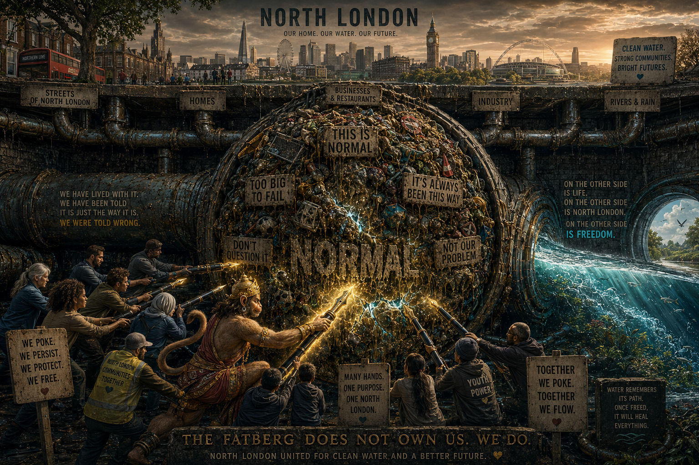

## Moving back to UK

- I spend most of February moving my stuff back to my house in London.
- It's all rather traumatic.
- I start to find evidence that all my belongings have been tampered with and this could only have happened if people had access to my apartment.

### My belongings have been doused in pesticides

- I realize all my belongings have been doused in pesticides or similar.
- I notice this starkly as I sleep under my own bedding for about two weeks after bringing my stuff home and leaving for Israel to attend the Transforming Touch course as an assistant on Module 2.
- Over this time, my whole body starts to ache and the pain is bone-deep.
- For some reason, I just put up with it, don't think about it, but everything aches, my neck, back, hip, legs, hands, everything.
- It's weird I don't do something about it until I get to Israel and I'm in a hotel for two days when I realize all the pains have ceased completely, apart from my feet which start getting worse.
- I wonder if it's because I'm surrounded by people who are ignoring what's going on for me completely, pretending it's not happening; a murderous stance indeed.
- I contact my mother from Israel and tell her to bag up my duvet and put it in the loft as it has been doused in pesticides.
- For some reason, she throws it away - gets Robert to because that's what he does most days for some reason.
- I end up throwing nearly all my belongings away as they are poisoned.
- I'm horrified that they're going to the public dump and it's all good stuff and my fear is people will take it home with them thinking it's good decent stuff, no idea it's doused with pesticides, and they might let their kids sleep under my duvets, I mean it's just horrific.
- I have explained that all my stuff is doused in pesticides and this is what I'm going to have to do with it to the [two policewomen who turn up to disappoint me](january.md#i-report-hacking-drugging-poisoning-illicit-filming-and-everything-else-contained-in-this-statement-to-the-metropolitan-police).
- I tell this to the police and the Baroness too, in one of my many missives.
- I get no response.
- No-one cares.

### My conservatory papers

- All formal conservatory notifications for the years 2022-23, and 2023-24, are missing from my files.
- Fortunately, I have kept copies of everything.

## Release the fatbergs

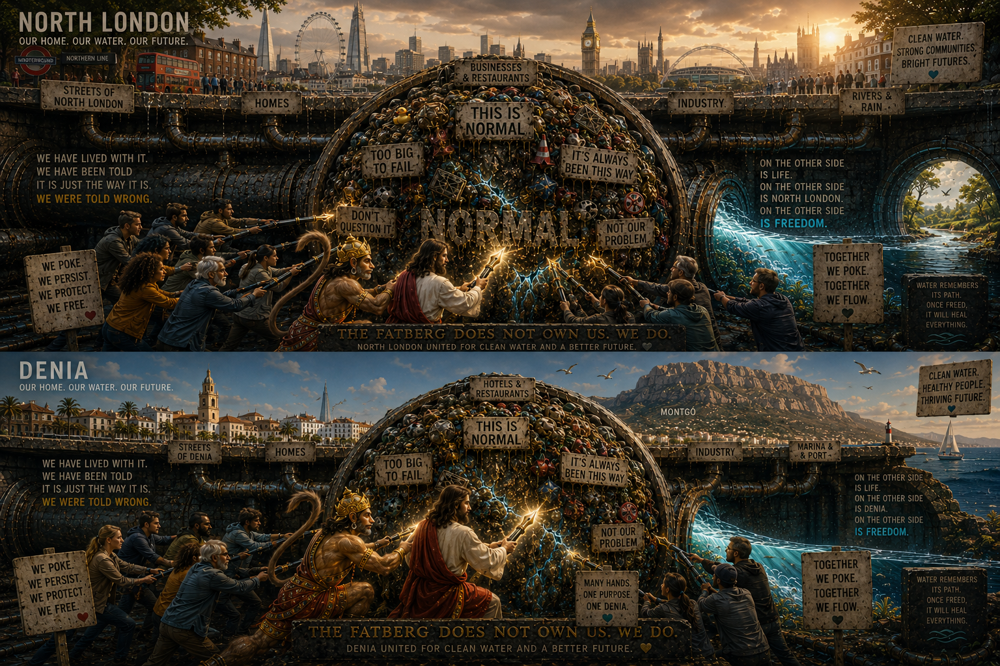
