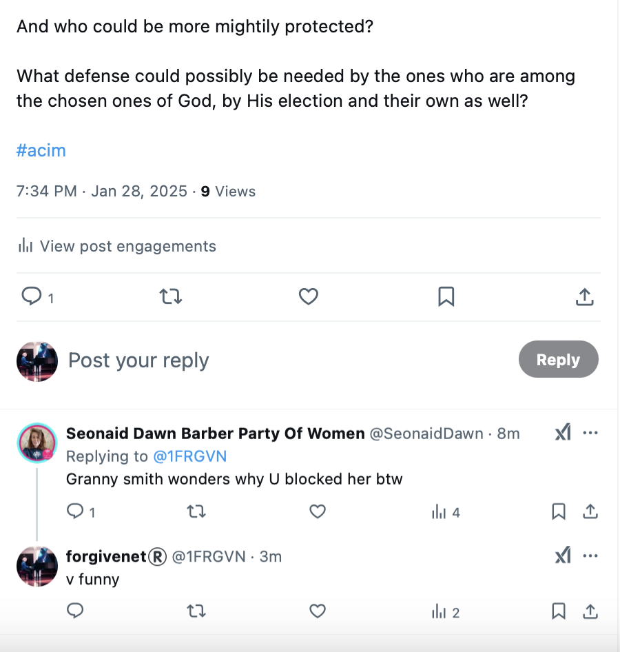
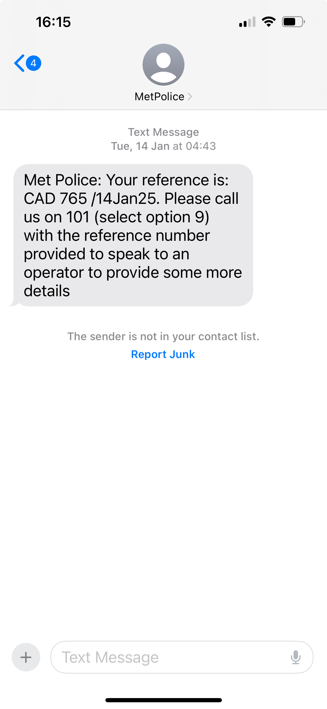
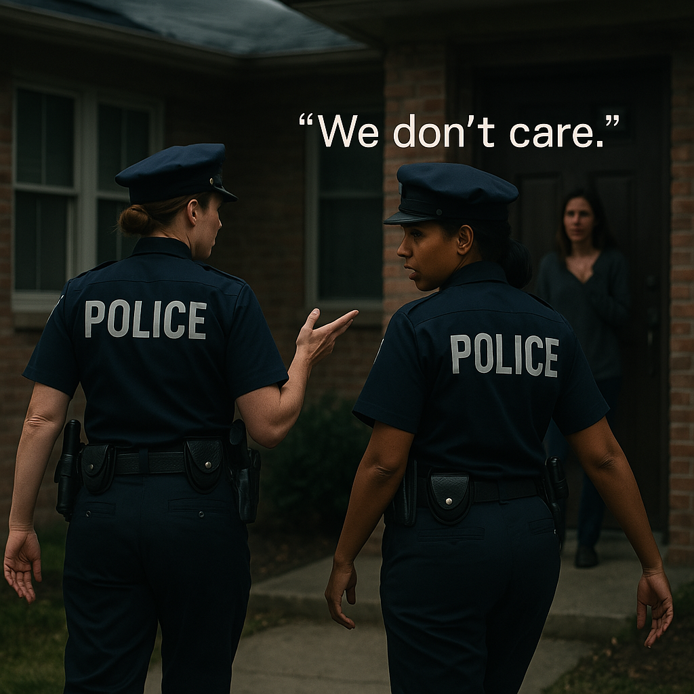

# January 2025

## Samui

- The man that looks like the fraudster from H Samuels in 1989 bares his teeth at me.
- Is he the same man [my brother spoke about in 2010](../early-years/2010.md#christmas-with-jitendra) that advised him how to get really high all the time, and he lost his mind in the process?

## Thoughts getting straight

- After three years, and having got rid of my toiletries, I am suddenly starting to see things more clearly.
- I realize that probably I'm going to be murdered by either Domingo the piano teacher and Hazel Smith's organizations, gitano and British criminal gangs, or the Spanish police, or even the British police for their possible collusion.
- I reach out to a Baroness at the House of Lords who supports women and girls in our fight against the abuses of trans ideology.
- I have had some communication with [Baroness Nicholson](https://en.wikipedia.org/wiki/Emma_Nicholson,_Baroness_Nicholson_of_Winterbourne) previously.
- She responds with an [email](../../content/documents/emails/the%20witch%20must%20drown-3-6.pdf) saying I'm hysterical.
- So I'll just accept that I'm gonna be murdered or disappeared next week or sometime in the future.

## Twitter translators

- Currently all my tweets are getting few views as usual and a lot of translations.

## Trumpet teacher

- I now believe the trumpet teacher's name is Paco Sendra, the married man [Hazel Smith told she was having an affair with](../early-years/2007.md#hazel-smith) back in 2007.

!!! tip "Correction"
    - Paco Sendra is most likely not the man's name as this is the name of a famous footballer. Possibly Hazel Smith would not have known that at the time.
    - This really is a long game isn't it.

## Max Power

- I get continual info on Twitter over January and late December informing me that the porn brand they are using to distribute whatever porn they make is Max Power, which makes [Samuel's email](../2022/october.md#sam-shares-some-files-with-me) from 2022 quite interesting.
- Indeed, when I do a Google search on this, I notice many of the links that I can see on 1frgvn x google search videos are related to Max Power.

## Paul

- I need someone to help me move from Denia but I struggle to ask people for help, for obvious reasons.

!!! danger "Asking for help"
    - When a sexual abuse victim asks for help they are typically ignored, fastidiously disbelieved, sometimes even attacked, rarely heard.
    - It gets to the stage you realize you have to do everything for yourself.
    - You stop asking for help as it is a waste of time.

- I'm telling my story online and it is alarming some friends.
- A Belgian friend is extremely concerned and says he'll come and help me but he then doesn't contact me for a few days.
- I ask Paul, my [old friend who connected with me the previous June](../2024/june.md#social-media-and-paul), if he will help me go to the police in Madrid, and help me move too.
- He agrees.

!!! danger "Grooming and the CB radio"
    - Paul and a group of boys were groomed over the CB radio by a gay man called Dennis in the 70s.
    - CB radio was the first ever social media and, as you might imagine, pedophiles and predators immediately made use of it to get close to targets.
    - The mass online grooming going on today would have blown their minds.
    - Dennis convinced the boys that he was a decent replacement for their parents, convincing Paul of the utter uselessness of his own father.
    - This group of 14 year old boys would go and hang out with this gay adult male at his house and elsewhere.
    - Paul's parents were horrified, and rightly so, but groomers know very well which children to target and whatever they tried to do about it failed.
    - Paul never got over it and, to this day, he believes Dennis was a force for good in his life.
    - In fact, I believe this is what drew me and Paul together and made drugs and alcohol so appealing; our shared child sexual grooming experiences.

- I meet Paul at Madrid airport.
- He is emaciated; skin and bone.
- He looks like he has been doing seriously hard drugs for decades.
- He reminds me of Winston May's accomplice I saw outside [Rape Crisis Hornsey](../early-years/interim.md#rape-crisis-hornsey).
- Bizarrely, Paul did not come through to the arrivals hall at Madrid airport. Instead, he waits at the shuttle train station for about an hour.
- When I arrive, I call him.
- He's been there over an hour and he sort of pretends he doesn't know where he is or how to get out, and I tell him to come to arrivals as I'm collecting my bag.
- Paul is far from stupid so this behavior concerns me enough to write about it in an earlier commit on the same evening.
- I delete the content later on as Paul does help me a lot and I feel a bit guilty about thinking badly of him.
- I comment on the deletion.

!!! tip "Deleted commit content"
    - Regarding deleted commit content, I'm now unsure of who I can trust anywhere in the world.
    - I believe my fears are exacerbated but given my experience over the last 3 years literally anything could happen.
    - Anything that might be a risk to my life, I have to take measures against, even if the risk appears to be low.

- Paul talks non-stop like a machine gun.
- He seems to be on drugs.
- I'm convinced he's doing serious drugs and has drugs on him, and that he didn't want to come through to arrivals in case he was stopped.
- I'm convinced he waited for me so that he would look more legit walking through with me.
- I wonder if he was given advice about that because it seems an odd thing to think up if you didn't have anything to worry about.
- Paul looks like one of the drug ghouls that used to roam around in a junkie shoal around the Oudekerk in Amsterdam.
- I tell him this and rebook his return flight to go home the next day.
- He is not coming to the police in Madrid with me looking like this.
- He is offended. 
- He has already told me he has diabetes which I believe, but diabetes doesn't make you look like he does, or shout incessantly about nothing.
- He is doing my head in. 
- I'm trying to think.
- I tell him to shut up.
- I feel like someone has told him to distract me constantly so that I do not have a minute to think or collect my thoughts about anything.
- He tells me he is sharing a flat with a man in North London. It turns out he's sleeping on the sofa and the owner is an opium addict.
- I find out later he's living in his car and has been for years.
- He tells me he is not a heroin addict.
- I have to take his word for it.
- Nevertheless, I have no choice but to send him home and go to the police in Madrid without him.
- I give him my coat and a decent woolen jumper and tell him not to sell them.
- I think about the many good people I know in North London whose lives were destroyed by drugs.

### A child sexual abuse survivor gets retraumatized

- I tell Paul later that it is extraordinarily common for people who have been groomed and abused as children to become retraumatized as adults and have breakdowns; specifically when their same-sex kids get to the same age they were when they were groomed by a predator.
- I believe this is what happened to Paul.
- Paul denied the abuse and repeatedly stood up for this random man who had destroyed the relationship these boys had with their parents.
- I told him there wasn't a planet in the universe where what Dennis had done was OK.
- Paul was a great guy, one of the best. 
- He, like me, never had any real support from family as they didn't seem to know what was going on for him, and, like me, he was blamed by them for everything that was happening to him that his child's mind couldn't really comprehend.
- It was unfair for him, and me.
- Paul went to pieces around about the same time his second son who he was parenting reached the age that Paul was groomed.
- Paul told me a lot of stories, most of them lies I expect, I hope.
- He did mention that he had met both Charles and Diana because his grandfather had been the chief librarian at the Times and they came in when he was there and knew his grandfather by name.
- He told another story about Diana bumping into him in Camden High Street somewhere when she was hounded by paparazzi and he had caught her and she remembered him by name.
- Paul told a great deal of porkies while we were together. Some were really nasty stories about people you could tell he was "getting back" for something.
- The stories he told about his grandfather, mostly, I really wanted to be true.

### Paul's friend Lucy

- Paul tells me how I'm one of his best friends in the whole world, that he has only three best friends in the whole world, and I'm one of them.
- He tells me this repeatedly.
- It's weird.
- I haven't seen the man in twenty years.
- Is he trying to butter me up?
- One of the other best friends of Paul's in the whole world is a woman called Lucy.
- He mentions her even more.
- I don't know who she is, but something rings suspicious.
- Something reminds me of [Lucyfer Adams](../2024/december.md#lucyfer-adams).
- I ask Paul how long he's known Lucy. 
- He says a few years.
- He talks about how they go on 50k bicycle rides up to Cheshunt and back, stopping at the pub to drink a few pints.
- Lucy would drink three pints and carry on. Paul would only manage one.
- The thing is, Paul couldn't walk more than about twenty metres without his ankles giving way and he was talking about these bike rides happening just a year or so before.
- He seems to be in constant communication with Lucy on WhatsApp, and he calls her too.
- Paul shows me a picture of Lucy on his phone. It's her WhatsApp profile pic.

### The gay bar

- When I'm back in London prior to going to get my stuff I see Paul a lot.
- One day, we're in the Old White Lion in N2.
- He gets a WhatsApp and suddenly says, let's go somewhere else.
- We head to a bar in Highgate Village which is apparently a gay bar.
- There's no reason for this.
- He explains it's a place he often goes to with [Lucy](#pauls-friend-lucy).
- I'm certain he has been instructed to take me there so I can be "viewed".

### Harassment in UK

- I'm targeted a fair bit when I'm back in UK as you will read across these next months.
- Just like in Denia, it seemed that every time I left the house some rare event occurred.
- I'm certain it was criminal gang activity, especially considering Paul's sudden "popping up".
- Was the frenetic activity from criminal gangs in London... even getting a junkie involved - the most disloyal people in the universe - and all the harassment at that time early in the year, and during the general election the year before… is it because they know my dad, and my family in fact, would see me dead before helping me?

## Madrid policia 

- I send Paul home because his drug-addiction has made him a beggar man and I can't possibly bring him to the police station with me.
- I had wanted a man to come with me for support, but Paul needs more help than anyone else.
- He also seems to be on something because he cannot shut up; or the North London porn gangs, still panicking about my continued survival, have instructed him to distract me, to not let me think, and so he's shouting continuously at me.
- I buy him a plane ticket and send him home.
- Later, he tells me that UK border police give him a DNA test at the airport in the UK on arrival; a cheek swab.
- I find that extremely interesting.
- So, only Inma and I attend the police station in Calle Huertas on 7th January to report malicious poisoning and bring samples and a timeline of events; our [second visit](../2024/march/13-end.md#reporting-the-crimes-to-the-police-in-madrid).
- They're totally disinterested.
- I tell them I have samples of poisoned items for testing.
- Just like they told me I had to pay to privately prove hacking before they'd investigate hacking, they tell me I have to pay a private laboratory to confirm poisoning before they'll investigate poisoning!
- I hand them my 200 page printed report (an early draft of this statement and the original intention for writing it)...
- The chief throws it on the table in disgust, and instructs his officer to "send it to Dénia".
- But not before flicking through it and pointing to some of the women - photos I have printed in high resolution - including [Elsa](../2024/august.md#18) and the [innocent women](../2024/august.md#grooming-an-innocent-girl-into-porn-101) groomed (and drugged) into doing porn.
- The chief says, "who's that?", pointing to them.
- I tell him that Elsa is Domingo Cano Lopez's piano student at the conservatory and I don't know who the innocent woman is.
- The chief says nothing.
- They want nothing to do with me.
- I suspect the report goes in the bin once we've left.
- Later that evening over tea, Inma talks about how I used to be interested in Haitian spiritual practices ([I wrote a novel in Lourdes using Haiti as a theme](https://www.amazon.co.uk/Life-Without-Liar-Margaret-Murphy/dp/1500734381)) in a semi-condemning manner.
- I explain that Mother Mary had introduced me to the practice and it turned out to be a strong psychological protective barrier against my fear of the Jamaican rape-gangs from 1989.
- She goes into the kitchen and returns after a while with a slice of Reyes cake.
- I bite into something hard. It's a little figure of the black wise-man of the three kings.
- She's telling me something... 
- I think it is that everyone believes I'm the guilty one because I was raped by black men when I was a child.
- Is she really telling me that whatever I have uncovered about porn-industry infiltration of Spanish schools is irrelevant because I was sedated and raped as a child by groups of Jamaican men in North London?
- A few days later, Inma tells me that the poisoning laboratory told her they would not test my samples without an order from the police.

## Seonaid Dawn and Granny Smith

- Both suspect accounts, mentioned in [fake account list](../../evidence/twitter-account.md#fake-accounts), [Hazel Smith references from May 2024](../2024/may.md#hazel-smith-pretends-to-be-esteve-online), and elsewhere.

- I've now started to block the criminal gang members and porn accounts, including these.

## I call the police

- On my return to London, I call the police to report the numerous crimes I'm aware of that have been committed on my person while living in Spain at the pleasure of British and Spanish criminal gangs, and others, as advised by my contacts in the Met.

- Two female constables turn up to my house the following morning: PC Richardson 1990NW and PC Patel 2669NW.
- They are totally dismissive in a rather aggressive manner.
- I tell them I was drugged and poisoned and I have samples. They said it happened in Spain so they're not interested.
- I tell them all my devices are hacked and I have been surveilled continuously for years. They say it happened in Spain so they're not interested.
- I explain it was happening all over the world. They don't care.
- I explain it is happening now, in England. They don't care.
- I tell them I've been to the police numerous times in Spain and they don't care.
- Not our problem, they say.
- I tell them I have been shown flashed images of rape-porn I was in as a child.
- They say, "show us", and obviously I can't.
- I tell them, "they're not stupid, they're not going to give me evidence for that but I know it was me."
- If you can't show us, we're not interested.
- I tell them I'm being continually threatened online on X.
- I show them some of the online threats I've endured, including the picture of my brother with RIP below it. They tell me nothing I have shown them is a threat.
- The blond one keeps cutting me off and saying, forcefully, "You haven't shown us anything, just show us something".
- I try to but everything I say is cut off as not being criminal.
- Whenever I try to slow them down and deal with what I do have methodically, they start to rush me, demanding I show them something, and changing the subject when I'm trying to explain something to them.
- It's very unpleasant.
- I tell them British children are in danger in Spain. They're not interested.
- I tell them I was stalked by North London rape-gang members I had already told the police about while I was campaigning for election in July.
- They want to know who I stood for in the election. I tell them; Party of Women. 
- They tell me the criminal gang members can go wherever they like. It's not a crime.
- It's so incongruent, I ask them if they've been told to dismiss everything I'm saying by someone.
- They get annoyed.
- I take their numbers down on my hacked laptop. The blond one says, "Oh, wait, we'll write it down for you." I say, no no, let me put your numbers in here. She still wants to write the numbers down for me. I wonder why she doesn't want me to write their details into my hacked laptop.
- I realize they are going to do nothing for me, as usual, so I let them leave. They were trying to get away from the minute we started to speak. They stayed 20 minutes.

## Seeking asylum in another country

- I am clearly unsafe in the United Kingdom as well as in Spain and France, and especially in North London where my family live.
- I was followed in Thailand also.
- I'm not safe at home, it's an extraordinarily toxic environment and totally unsupportive.
- I've spent my whole life being gaslit by people pretending nothing has ever happened to me and my mother's attitude towards me is especially upsetting.
- My dad was aware of everything that was going on, I had explained everything to him in September 2024 in Lourdes and he appeared to understand the nature of my situation and how much danger I was in.
- As I told him my story, he kept saying: *heavy*, *heavy*,; I thought it was just him taking the piss, as he usually does. He then told me to be careful as I could be beaten by a man and made to be a prostitute.
- Did he pretend to be supportive to me and then tell my mother and brother I was not to be believed?
- I had told my brother everything I knew in June 2024 about what was going on for me and how much danger I was in. We were tracked in the pub at that time by *operatives*, police I expect.
- He speaks to me like he thinks I'm a little fool imagining things. Is that what dad told him too?
- I access the Israel website for asylum seekers and try to make an application.
- My web access is continuously blocked.
- I give up.
