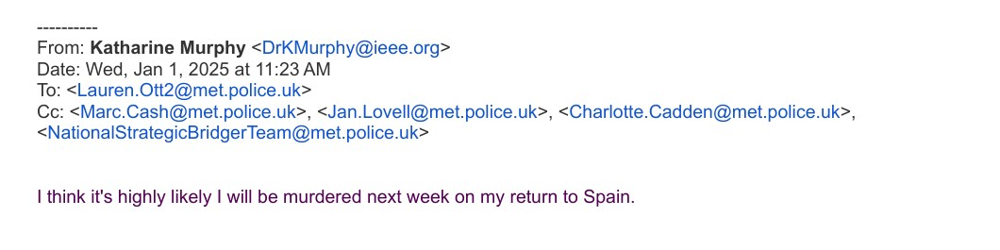
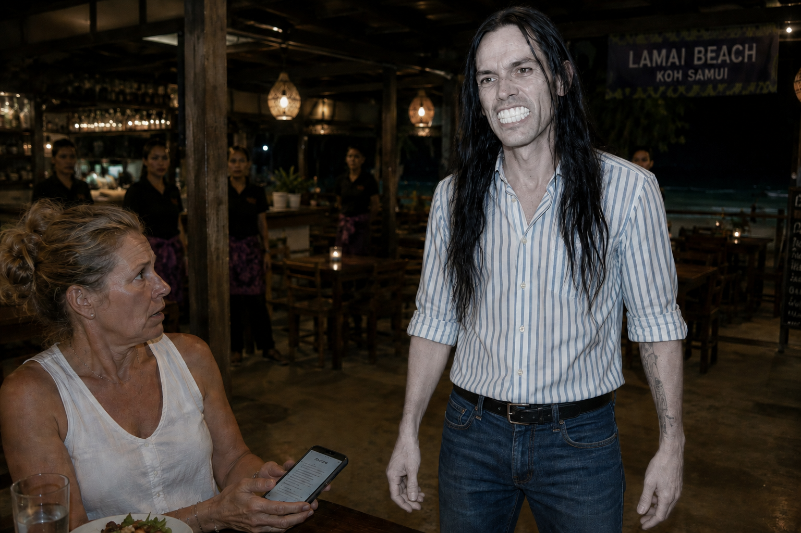
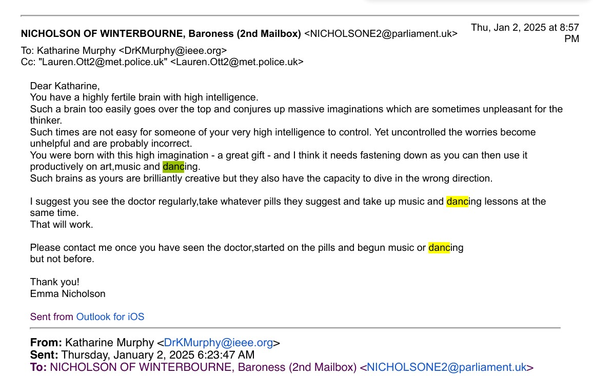
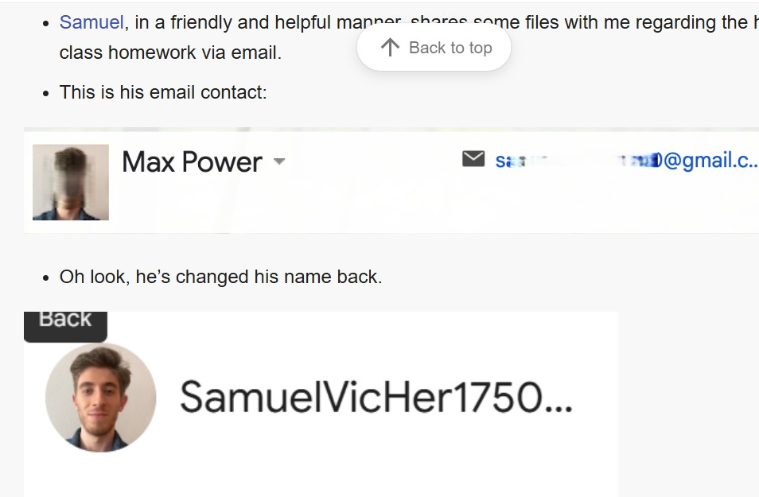
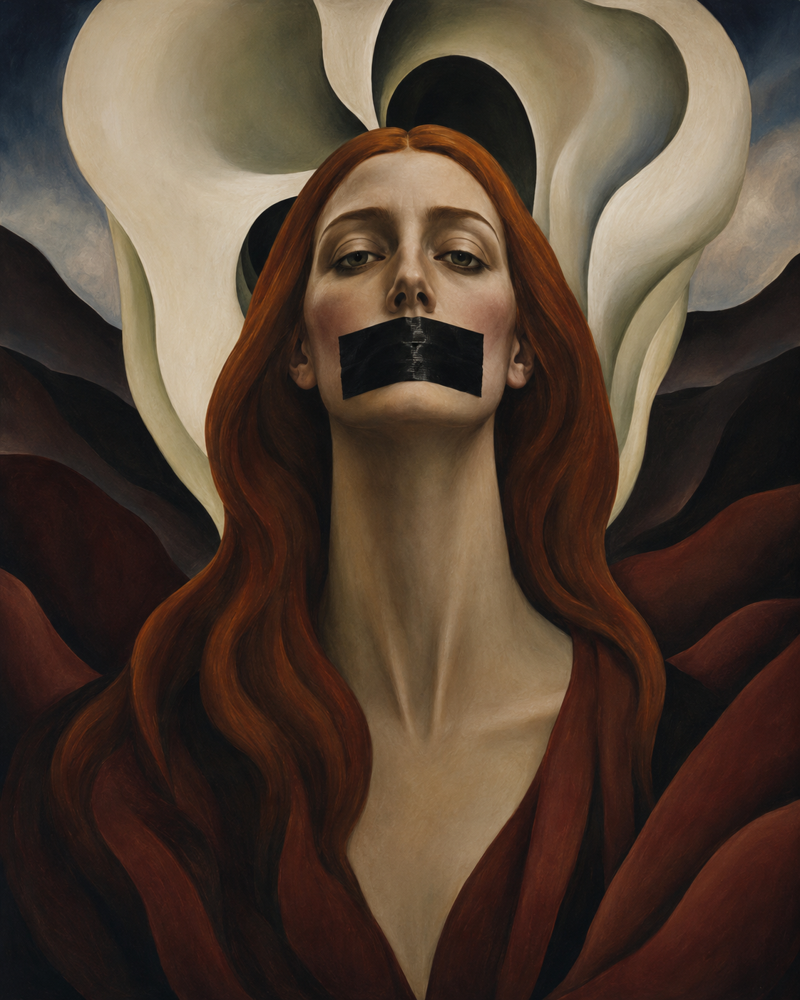
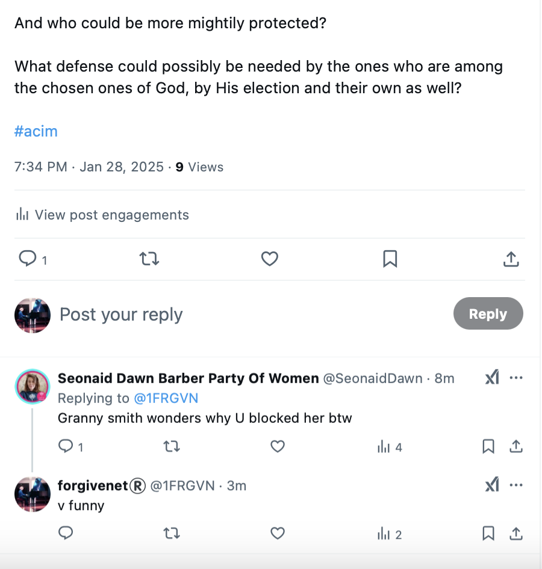
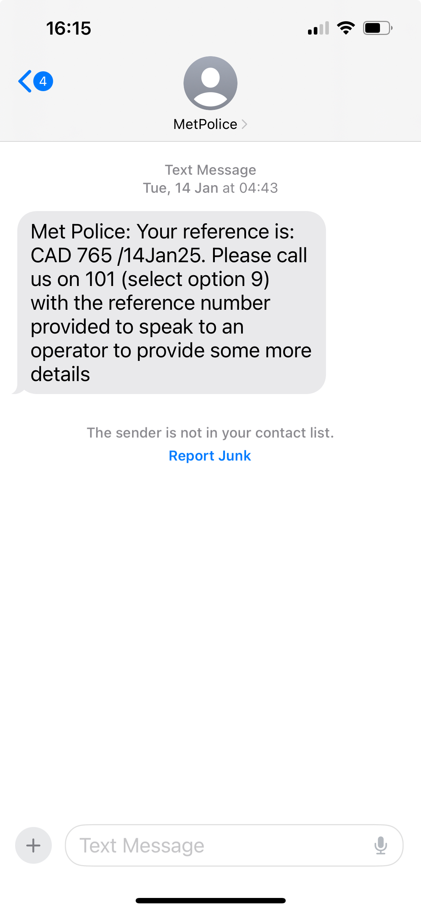
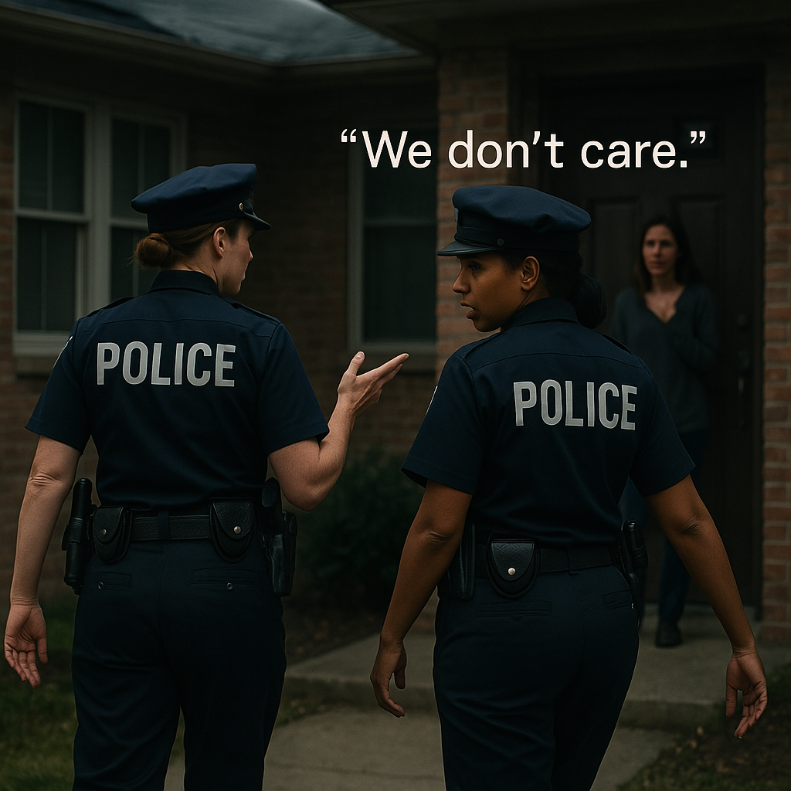
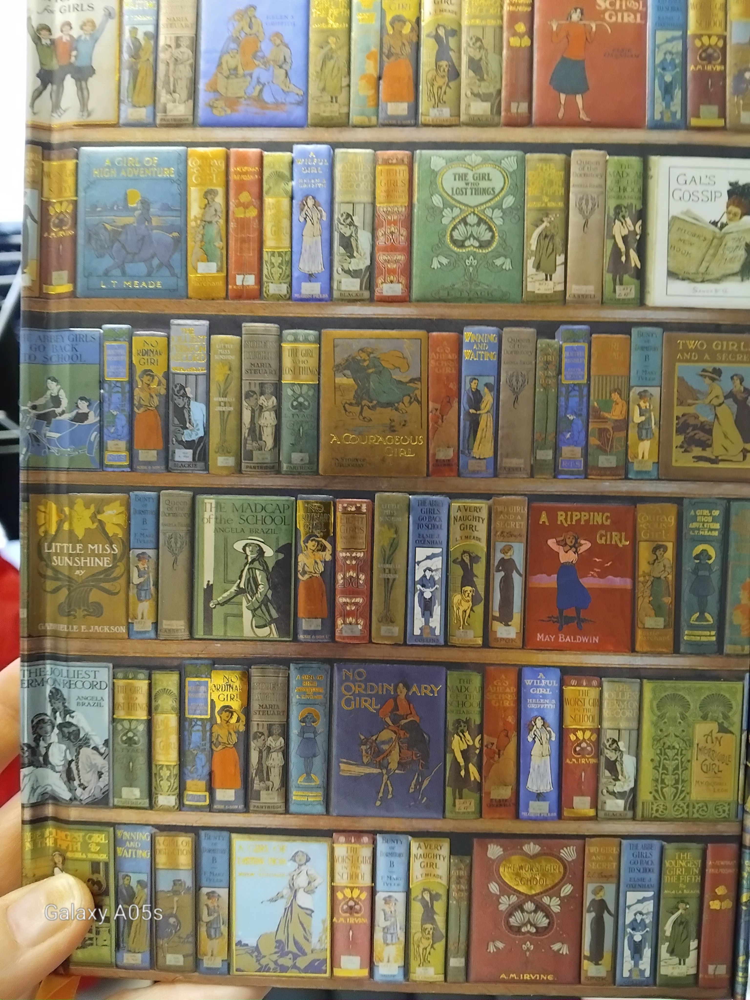

# January 2025

## Furious emails to the UK police, and texts to the British embassy

- I'm terrified about returning to Spain on 5th January with Qatar airways from Bangkok to Madrid.
- It's clear I'm stalked by some very dangerous people who want me dead, but it's even more clear that no-one cares.
- In fact, the powers that (used to) be are communicating directly with the criminal gangs via my X activity, as if I'm not even human.
- Is this how British women, children, and babies end up murdered for porn; with every security service helping the criminals as much as they can?
- Even though my heart is dismayed at the lack of activity from law enforcement, and my stomach turns in fear of the fate intended for me at everyone's pleasure, I never give up trying to get help.
- I write to the British embassy in Spain on X yet again, and to the police on email explaining how much danger I'm in.
- Like all my emails and communications asking, not unreasonably for help, I receive no reply.

- It's as obvious to me 18-months later as it was at the time that, if I did not attempt to get help, and in writing too, the British and Spanish porn-gangs that run our countries in place of our elected governments and our police services would have done away with me very quickly indeed.

### Email examples

- Here are a few examples of emails I wrote to the police in the UK, Baroness Nicholson, and the British press in 2024-2025 asking for help.

    1. [Email asking for help](../../content/documents/emails/emails-to-police-in-the-uk/forgive%20me%20the%20spam,%20something%20you%20might%20find%20interesting.eml).
    1. [Email asking Lauren Ott for help](../../content/documents/emails/emails-to-police-in-the-uk/Hi%20Lauren.eml).
    1. [Long email thread asking for help](../../content/documents/emails/emails-to-police-in-the-uk/numerous-requests-for-help.pdf).
    1. [Another email asking for help](../../content/documents/emails/emails-to-police-in-the-uk/Party%20Of%20Women%20-%20Finchley%20and%20Golders%20Green.eml).
    1. [The widow's continued disappointments](../../content/documents/emails/emails-to-police-in-the-uk/the-widows-continued-disappointments.pdf).

- Lauren Ott was one of the investigating officers from 2015 who looked into my complaint against Winston May and the North London rape-gangs - all pertaining communications being read online by British and Spanish criminal gangs who had hacked me since at least 2003.
- Jan Lovell is the East Finchley community officer who I complained about nearly being robbed (no doubt by a British criminal gang member who had access to my phone camera and knew I - unusually - had a wad of cash in my handbag).
- Jan was tasked with stalking me in East Finchley after I had written these desperate emails whereby she would show up at the library, for example, and glare at me without speaking.
- On one occasion, I decided to introduce myself to her, and I went over and said hi, and mentioned I had been writing to her and others (of course she knew), and she totally ignored me.
- I wonder if she was taking instruction directly from Adams at that stage, like they all were it seems.
- I never gave up trying to get help from the police in the UK.
- I was always wasting my time, however.
- British gangs such as the Adams family were obviously telling the police to ignore me, at best.
- I wonder what the motive behind the constant stalking in 2025 was; the confirmations of being watched online, the continued drugging, the vomiting bug seemingly set up by a gang member, the relentless attempts by Paul at getting me in another dangerous situation, etc.
- Were they hoping I'd get depressed and kill myself before I had a chance to remember the switcheroo scam at the music school in Spain, or the Bali work-colleague-rape-fest events they must have made a fortune on?
- It seems likely.

### Qatar airways

- I upgrade to business class.
- On the Bangkok to Doha portion of the trip, I sit next to a man who appears to recognize me and takes video footage of me the whole flight.
- On the Doha to Madrid portion of the flight, the steward also appears to know me.
- It's all too much to take.

### An official checking up on me at Madrid airport

- Somehow, officials have been reading my multiple emails asking for help, but it appears they prefer to answer to the criminal gangs instead of their victims.
- On my arrival in Madrid, a government official appears to make sure I'm on the plane.
- Did the criminal gangs request this service from British embassy staff?
- The gangs, who believe they own me, have ordained I'm to go home, to the UK, where no-one will help me and, I guess, they expect they can persuade me to kill myself online like they do, or maybe they'll make good on some of their threats of having me stabbed in the street, or whatever.
- Whatever the story, the criminal gangs are calling the shots and no-one is going to help me or the countless other victims of the porn-gangs.
- In fact, they're so safe and comfortable with how things are - clearly certain of my demise and disappearance into obscurity along with the many thousands of other British nationals murdered without consequence - they tell me even more horrors that they're involved with, as if they're proud of themselves.
- They're a bit stupid, I think.

### Twitter translators

- Currently all my tweets are getting just a few views as usual and a large proportion of those views are translating the text.
- It seems that Spanish speakers are very interested in what is being said online.
- It's obvious that the multiple English speakers (international law enforcement agencies and criminals) are simply reading everything going on with my hacked X feed directly.

## A man I recognize bares his teeth at me

- The afternoon I'm getting ready to leave the Spa Resorts in Lamai and travel back to Madrid where I will meet my friend Inma who's going to come with me to the gender-violence police department to augment [the complaint I already made to them](../2024/march/13-end.md#reporting-the-crimes-to-the-police-in-madrid) back in March.
- I've also organized that [Paul will accompany me too](../2025/january.md#paul) because, perhaps if I bring a man along with me, the Spanish police might actually do something.
- I'm sitting in the restaurant having some food and reading the set of Psalms I've been reading every Sunday on my mobile phone.
- I become aware of a man hovering around.
- I'm immediately suspicious of him.
- He's pale, white, British - I can hear him speaking with the waiters. They know him.
- He has long, very greasy black hair, and what seems to be a Spanish wife (from the accent) and a daughter of about eight-years-old.
- He glares at me baring his big, shining-white, well-dentistried teeth.

- It's very threatening.
- But, I realize I know this man.
- He's the man who tried to rob H. Samuel the jewelers with a fake credit card while I was on the till in Brent Cross in ... you guessed it ... the summer of 1989, just before the North London rape-gangs got hold of me.
- I knew that immediately; what I didn't realize until later is he is also the man [I dreamt about when I was seven](../pre-2001/1980.md#a-nightmare-about-my-brother), the man who imprisoned my brother with an evil matchbox mechanism that grabbed his forearm.
- Could he also be the same *really nice geezer* my brother met in Lamai in 2010?
- The man who gave my brother the drugs and instructions on how to buy them at the pharmacy, just before he totally lost his mind.
- The same man who it was *really important* my brother told me about having met - while he was grinding his teeth, still furious with me, when he popped into the Spa the last time I would see him relatively conscious in Thailand.
- My guess is the whole scam with my brother over the years with his new *mates* was about ensuring his woman-loathing was so intense, his disgust with my femaleness would mean he would never think once about helping me when, as it was so planned, I would really need it.
- Perhaps they felt they needed something even more given that, even though my brother was going through this woman-hating, pay-to-rape hell in Thailand, when I met him to hang out that Christmas we were friendly; the connection is strong and I don't take things personally.
- In fact, my brother would be instrumental in doing as he was told by the gangs to ensure my return to Spain and the criminal porn-machine, and my eventual utterly assured murder.
- What was the evil matchbox mechanism, I wonder, and how does it relate to my brother's forearm?
- Oh, and I see the same woman the following year when I visit, and she's not Spanish and doesn't appear to have a daughter either.
- She's Brazilian maybe, and she smiled and said hello to me in a pleasant and familiar way.
- I think she was doing deals with my international security teams.
- I love these Miss Marple sections, don't you!

## The persistent widow

- After having thrown my toiletries away and completed an intense seven-day fast and detox in Samui, I am suddenly starting to see things more clearly.
- It's obvious how badly my mind has been affected by drugs and poisons, and for how long too.
- I'm seriously concerned I'm going to be murdered by either Domingo Lopez Cano's family working alongside Hazel Smith's British criminal organization, or gitano and British criminal gangs anywhere in the world, or the Spanish police when I get back to Spain, or even the British police and UK government because they seem to be throwing me to the wolves.
- I'm scared and I don't know what to do.
- I reach out to a Baroness at the House of Lords who is a strong support for women and girls in the fight against the abuses of trans ideology.
- I have had some communication with [Baroness Nicholson](https://en.wikipedia.org/wiki/Emma_Nicholson,_Baroness_Nicholson_of_Winterbourne) previously.
- Significantly, I emailed her probably sometime in March 2024 after teachers and staff suffocated me with pillows and my own duvet while I was sedated at home and [I became afraid for my life](../2024/march/13-end.md#choir).
- At the time she responded with a note that I understood to mean we should expect certain cultures to behave in the way the people of Dénia have been behaving towards me, which perplexed me but I had no capacity to think about it further.
- This month, we have a long correspondence where I explain how scared I am, and why, and how I believe I'm going to be murdered.
- Here is [most of the email thread](../../content/documents/emails/the%20witch%20must%20drown-3-6.pdf).
- After she has a word with Lauren Ott from the Metropolitan Police - who I explained was the investigating officer on my North London rape-gang case from 2015 - she basically tells me I'm hysterical!

- I'm angry about her reply, and I tell her what I think.
- Later on, after some prayer and reflection, I decide that she *must* be telling me - without telling me - that there is a big investigation going on into the Spanish conservatories (music and dance) where children are in peril, and also into the medical professionals colluding with the gangs (doctor's pills).
- I hold onto this dwindling certainty, without which my reasonable moral expectations for our world are in tatters.
- I reply to her, apologizing for getting cross.
- This is just one of a bunch of emails I sent to the Baroness and to the police in the UK, the last one dated February 2026.
- I've added [some more of my communications in an earlier section](#email-examples) on this page.
- Whenever things got really overwhelming for me, I would reach out to the police.
- After the first few times I got no response, I stopped expecting a response, but still felt compelled to try again to get help as any normal tax-paying upstanding citizen would do with the reasonable expectation that help would be forthcoming.
- As well as the Baroness, the emails went to Lauren Ott, a policeman sent to assist me while I was campaigning at the UK general election in June 2024, the election police lead involved in protecting candidates for general election in London, the local community police officer in N2 Jan Lovell, and anyone and everyone I had details for that I thought might care or be able to help.
- I received no reply from anyone.. ever.. apart from a couple of vague but pleasant responses from the Baroness, and Lauren Ott responding to me once directly telling me to call 999 when I get home to London, which I do: another [spectacular disappointment](#i-call-the-police) for the widow.

### A parable from brother Jesus Christ

- The persistent widow is [a parable of Jesus](https://www.biblegateway.com/passage/?search=luke%2018:1-8&version=NIV) about a widow who went to the judge again and again to get help with her *adversary*, and he ignored her again and again, but eventually did something about her problem because he was worried she might cause him a lot of trouble if he didn't.
- Jesus points out that the judge eventually relents and helps the widow, worried about the woman's predicament coming back to haunt him somehow.
- Jesus then asks what more might happen when the judge is God Himself and, indeed, I have been going to my God again and again asking for help with my *adversary*, which turns out to be thousands of rapists who thought sedating women meant they'd get away with it.
- My prayer today is that every single one of those men's penises just withers away and drops off, testicles along with them.
- Oh, and even the penises belonging to the *helper* men who may have thought themselves safe because they didn't partake.
- No, even those penises too, and sometimes especially if they've been paying for their expensive holidays by sharing the porn around.
- That outcome would be AMAZING!
- Thank you in advance Father, they don't seem to care do they, perhaps a shock is what they need.
- May they experience the stress of being threatened with constant murder, and no-one giving a damn, at the very least.

## The trumpet teacher's real name

- The original commit of this section is when a sudden memory returned about something Hazel Smith told me [in 2007](../2001-to-2010/2007.md#hazel-smith) at dinner with her *mum* the night we went out dancing, a few nights before she tried to murder me by poisoning.
- At the moment I remembered this, I believed the trumpet teacher's real name must be Paco Sendra, the married man [Hazel Smith told she was having an affair with](../2001-to-2010/2007.md#i-put-people-in-boxes) back in 2007.
- I still believe there is only one trumpet teacher at this stage; not the six or seven, or more that I have been recognizing as the same one man due to brain-damaging poisons.
- It turns out Paco Sendra is the name of a famous footballer, but probably Hazel Smith would not have known that at the time.
- Sendra, it turns out, is the name of one of the crime families in the region involved in destroying women and children and babies for porn, and is likely the name of the trumpet teacher who has been helping me all these years too.
- I added this section as a sort of eureka moment when it happened, but it wasn't really exciting other than I remembered correctly something very specific Hazel Smith said nearly twenty years previously.
- This, on it's own, shows the veracity of my memory function and was the beginning of more memories returning about things that had happened to me, even while sedated, that I have added to this police statement and should have been taken very seriously and not ignored in the hope that ... they'd eventually murder me and everyone could get on with their criminal porn addictions in peace.
- It is the *only* explanation for the total lack of British police and government action against serious crimes against British citizens in Spain and North London, and against humanity in general - as I see it and no doubt others do too.

## Max Power

- I am continually informed on X while I'm in Thailand, and on into January, that one of the porn brands they are using to distribute whatever porn they make of sedated women in their own homes in Spain is *Max Power*.
- This makes [Samuel's email](../2022/october.md#sam-shares-some-files-with-me) from 2022 even more interesting than it first appeared.
- They were telling me, as early on as September 2022, that I was starring on criminal porn networks live and sedated from my own home.
- They were also telling me, in that foolish way they seem hopelessly addicted to, that an adult male student at the conservatory who spends *a lot* of time with minor girls works for porn distribution networks.

- Again, the only way these criminals would be so stupid as to tell me everything, is if they were certain of my murder, or demise some other way, just like the hundreds of British and Irish women, and other foreign nationals already dealt with over many decades.
- Google searches confirm the Max Power theme in January 2025, with multiple results on the search term *1frgvn x* related to porn channel Max Power.
- It's worth considering that these references were just another attempt to throw someone under the bus, in this case a petty porn distribution company, suggesting that the more mainstream companies such as PornHub, etc, are up to their necks in criminal porn content produced in Dénia and Las Marinas, maybe even brokering *special requests* for victims from their loving tech-bro audiences.

!!! tip "How pissed I am!"
    - It's extraordinary that I have detailed hundreds of British and Irish, and other nationalities, murder victims targeted over many many decades, with photos, and it's years later, and I'm still alive (up yours British and Spanish police and governments!) and I'm still writing about the blatant criminality in Dénia and North London and nothing has been done!
    - Extraordinary!
    - The scoop of the millennia gets scoopier and scoopier with every delay.
    - Feels like the total collapse of society is coming when we find out what men are doing to women, and have been doing to women for decades, and how, apart from some token arrests, they are totally protected indeed urged to carry on regardless.
    - Feels to me like the UK is worse than Afghanistan for women and girls.
    - At least there you never bump into the evil bastards cos you're not allowed out of the house, or to speak to anyone either.
    - I'm thinking about developing mutism for myself.
    - I might as well be mute, don't you think.

    

## Paul

- Paul Pompeus is an old friend of mine and I hadn't seen him since I was living in Hastings with my ex-boyfriend Brian in the Autumn of 2001.
- I'm terrified, however, and desperate for someone to accompany me to the police in Madrid and help me move my belongings from Dénia, but I struggle to ask people for help, for obvious reasons.
- [After Nicos says he'll help me then ghosts me](../2024/december.md#my-belgian-friend-says-he-will-help-me), Paul seems like a good option.
- Nicolas made a huge fuss of being concerned about me.
- He's the man [I visited during EthCC](../2024/july.md#meeting-my-belgian-friend), a family friend of my dad, in fact, who incidentally became ridiculously jealous about my mother and Nicos' father Patrick on an occasion they visited. 
- Now that the mask has slipped, never to return, I do wonder what was really behind that.
- When I message him a few days later to ask if he's coming like he said he would be, he says something vague about having to take his children to school.
- Are the Belgian family-friends criminal-porn subscribers too?
- Have they all masturbated over me being raped by groups of black men when I was a child?
- It would not surprise me one bit.
- You might like to check on how he makes his money (i.e. masses of European funds paying for a rock band no-one's ever heard of..).
- Anyway, I did mention I'm pissed off.

!!! danger "Asking for help"
    - When a sexual abuse victim asks for help they are typically ignored, fastidiously disbelieved, sometimes even attacked, rarely heard.
    - Before it became obvious to me that I had been mass-targeted by British and Spanish criminal gangs for decades, I used to think that [Hazel had tried to poison me back in 2007](../2001-to-2010/2007.md#hazel-tries-to-kill-me) as an unconscious and irrational attack on a similarly sexually abused person.
    - This urge would have come from her belief in the lie that attacking someone just like her would somehow help her heal from her own experience - or deflect the guilt rather - the human mind is very insane after all.
    - I told people I had been physically attacked by someone because I was a victim of sexual abuse for that reason - without telling anyone the fuller story. 
    - This was how I understood what had happened to me at her hands in 2007; criminal psychopathy triggered by someone reminding her of her own experience of sexual abuse.
    - I guess I'm still right about that - without the fuller story.
    - It gets to the stage you realize you have to do everything for yourself.
    - It's exhausting, but can you imagine how exhausted I am, the most sedated-and-raped woman that ever walked the planet?
    - You just stop asking for help, as it is a waste of time.
    - It seems like the cult of the sexual predator is so powerful, so thoroughly protected, and controls everyone's minds, that even your own family ends up despising you, even when the men in your family are complicit.
    - They probably believe their own BS.

- I'm not enjoying any of this, by the way.
- Paul was *very* friendly with me online in June 2024 when I was campaigning for the UK general election and fighting the British criminal gangs who endlessly stalked me at that time, with the help of the police and government, but I never saw Paul in person at that time or I probably wouldn't have bothered asking him for help.
- Nevertheless, there is no-one else, so I ask [Paul](../2024/june.md#social-media-and-paul) if he will help me go to the police in Madrid in the first week of January, and if he will help me move my belongings back to London from Dénia in February too.
- He agrees.
- What I don't know immediately is that he's working for the British criminal gangs, in fact, and they are paying him in drugs to keep an eye on me and keep me topped up with hallucinogens too so I don't remember the switcheroo scam or any of a plethora of other sexually-humiliating events directed by the gangs for me over many years in my homes, at my jobs, everywhere.
- I do suspect him however, especially once he starts telling me about his *very best friend* Lucy, who I suspect is one of the Adams family, but I let him dig his own grave and he obliges most kindly.

### Paul is a victim of sexual grooming too

- And everyone knows it, except Paul.
- Paul and a group of his mates were groomed over the CB radio by a gay man called Dennis in the 70s.
- CB radio was the first ever social media and, as you might imagine, pedophiles and predators immediately made use of it to get close to their chosen targets.
- The mass online grooming going on today would have blown their minds.
- Dennis groomed the boys into believing that he was a replacement for their parents, convincing Paul of the utter uselessness of his own father.
- This group of 14 year old boys would go and hang out with this gay adult male at his house and elsewhere.
- Paul told me they would masturbate each other, and that a pedophile tried to get into bed with one of the other boys.
- He said these things as if they proved nothing was wrong with the situation, but I was truly horrified at what he was telling me.
- Paul's parents were horrified too, and rightly so, but groomers know very well which children to target and whatever they tried to do about the situation failed.
- Dennis had turned the boys' minds against their parents.
- Paul never got over it and, to this day, he believes Dennis was a force for good in his life.
- In fact, I believe this is what drew me and Paul together as friends in the 90s - aside from the pedophile porn I was starring in that everyone knew about except me.
- Our shared child sexual grooming experiences made escape with drugs and alcohol very appealing.
- I wasn't to know until late 2025 that Paul knew all about [Ugly and my ex-boyfriend Brian's criminal sex-offending activities in Amsterdam in 2001](../2001-to-2010/2001.md#amsterdam) (Paul and Brian were very close mates at the time), and I suspect there was a potential repeat of the sedating-and-raping in Hastings with the boys not long after.
- In fact, the last time I ever saw Paul was that night [he turned up with the boys](../2001-to-2010/2001.md#the-boys-come-round) and Brian became apoplectic with jealousy about something he wouldn't tell me about, and the boys left before anyone else got up and I never saw any of them again.
- Did they scurry away ashamed; unable to face looking me in the eye the next morning?
- Seems likely.
- It is a common MO with these sedating rapists after all, cos, mainly, they're total cowards.

#### A child sexual abuse survivor gets retraumatized

- I tell Paul later that it is extraordinarily common for people who have been groomed and abused as children to become retraumatized as adults and have breakdowns; specifically when their same-sex kids get to the same age they were when they were groomed by a predator.
- I believed this is what happened to Paul, propelling him into a ravaging drug addiction that took his life from him.
- Paul denied the abuse and repeatedly stood up for this random man who had destroyed the relationship these boys had with their parents.
- I told him there wasn't a planet in the universe where what Dennis had done was OK.
- Paul was a great guy, one of the best I had thought. 
- He, like me, never had any real support from family as they didn't seem to know what was going on for him, and, like me, he was blamed by them for everything that was happening to him that his child's mind couldn't really comprehend.
- It was unfair for him, and me.
- Paul went to pieces around about the same time his second son who he was parenting reached the age that Paul was groomed.
- However, Paul also lost his bearings at the same time as my ex-boyfriend Brian and his family and friends were sedating and raping me.
- Brian never recovered from the evil secret-he-couldn't-tell either.
- I guess that sort of evil-doing has disastrous outcomes too.

## Ritzy

- I call Paul from Thailand the night before I fly back to arrange to meet him at Madrid airport.
- He says he's with Ritzy.
- He's laughing and exuberant over the phone.
- It's the first time I've spoken to him in nearly 25 years, and so I don't understand this to be unusual.
- I don't know who Ritzy is, however, and I worry it sounds like a gang name and could be someone dodgy.
- I expect Lucy has told Paul to tell me about Ritzy. 
- Ritzy was a nightclub in Tottenham where the rape-gangs would go looking for little white girls.
- I tell Paul not to speak to anyone at all.
- He laughs and says, *oh, it's just Ritzy*.
- She's in her 90s and he does odd jobs for her, *all the time*.
- Paul will do a few odd jobs for my elderly parents over January and February.
- His exuberance quickly shifts into seething, I think when he realizes I'm not going to be giving him any drugs money.
- He deliberately does his own thing, and breaks things, then charges £100 an hour.
- He really pissed my mother off.
- Is he taking advantage of Ritzy too?
- It seems likely.

## Meeting Paul at Madrid airport

- I meet Paul at Madrid airport.
- He looks like an Ouderkerk ghoul, like someone who has chosen drugs over food for many years, like someone who does a lot of seriously hard drugs all the time.
- He's borrowed clothes from the man he is apparently living with (it's a lie, he lives in his car) and it looks like the man leant him rags.
- He reminds me of [how Busby, Winston May's rape-gang partner, looked outside the Rape Crisis centre in Hornsey in 2017](../2011-to-2020/2017.md#rape-crisis-hornsey).
- I tell Paul he looks like a beggar man.
- The day before I meet Paul at the airport, I collected the car which I had parked in car park B close to departures.
- My car was at the airport garage in Madrid for two months.
- Hackers had been warning me not to get in the car at the airport, not to drive, and when I do get in the car after two months I immediately start feeling symptoms of unwellness: scratchy throat, rheumatic pains in my hands.
- This hand-pain becomes a recurrent theme from criminal gang members stalking me in 2025, and the wheel and gearstick appear to *still* be poisonous to the hands even in March 2026.
- I book a Eurostars hotel on the outskirts of the city for a few nights.
- I go to pick up Paul the next evening.
- I bought him his ticket with British Airways from London.
- I asked Paul to bring masks and gloves because I believe the car is poisoned with pesticides.
- He does so, but he's not taking anything I'm telling him seriously.
- In fact, when I meet him he won't shut up, as if he's speeding, hard.

### Paul avoids coming through to arrivals on his own

- Bizarrely, Paul did not come through to the arrivals hall at Madrid airport.
- Instead, he waits at the shuttle train station for about an hour until I phone him.
- When I arrive, I call him.
- He's been there over an hour and he sort of pretends he doesn't know where he is or how to get out, and I tell him to come to arrivals as I'm collecting my bag.
- Paul is far from stupid so this behavior concerns me enough to write about it - informing the law enforcement agencies who are also hacking me - in an earlier commit on the same evening.
- I delete the content later on as Paul does help me a lot and I feel a bit guilty about thinking badly of him.
- This tendency has been problematic for me and I wonder if I just hated everyone like normal people do in this world, things might be very different.
- I make a comment on the text I delete.

!!! tip "Deleted commit content"
    - Regarding deleted commit content, I'm now unsure of who I can trust anywhere in the world.
    - I believe my fears are exacerbated but given my experience over the last 3 years literally anything could happen.
    - Anything that might be a risk to my life, I have to take measures against, even if the risk appears to be low.

- I'm justifying to myself why I don't trust Paul, as if it was needed.
- I'm also horrified to notice how much I gaslight myself, and understand this is mostly caused by attitudes from the people around me and anyone I ask for help.
- Paul talks non-stop like a machine gun.
- He seems to be on drugs.
- I'm convinced he's doing serious drugs and has drugs on him, and that he didn't want to come through to arrivals on his own in case he was stopped.
- I'm convinced he waited for me so that he would look more legit walking through with me.
- I also believe he was told to do that by the gangs, cos I'm pretty sure he wouldn't think up such a scheme himself.
- Paul looks like one of the drug ghouls that used to roam around in a junkie shoal around the Oudekerk in Amsterdam.
- I tell him this, that I cannot have him at the police looking like he does, and I rebook his return flight to return to London the next day.
- He is offended. 
- He has already told me he has diabetes which I believe, but diabetes doesn't make you look like he does, or shout incessantly about nothing.
- He is doing my head in. 
- And I'm trying to think.
- I tell him to shut up.
- I feel like someone has told him to distract me constantly so that I do not have a chance to think rationally or collect my thoughts about anything.
- I'm right about that. Lucy.
- I tell him I believe the gangs plan on raping me to death and live-streaming it throughout the criminal porn networks.
- I'm pretty sure that was their end goal from way back in 2007 even.
- He calls them the *c* word.
- From time to time, he seems to be on my side, but never for too long.
- He tells me he is sharing a flat with a man in North London. It turns out he's sleeping on the sofa, the flat owner is an opium addict, and he's really been living in his car for years.
- I find out later he's living in his car and has been for years when he starts telling me about how he manages not getting cold at winter, about avoiding the police, about where he can use the free wifi, etc; he kept his car-house quiet for as long as he could.
- He tells me he is not a heroin addict but everything about him screams otherwise.
- Nevertheless, I have to take his word for it, but it's hard to believe.
- Even so, I have no choice but to send him home and go to the police in Madrid without him.
- I give him my coat and a decent woolen jumper and tell him not to sell them.
- I think about the many good people I know in North London whose lives have been destroyed by rampant criminal gang activity that the police will do nothing about.

#### Paul promises me he's not doing heroin

- It seems obvious to me Paul has been doing heroin, but he's adamant he is off the drugs since July 2024 and was only doing crack then, no heroin.
- Even so, I take my handbag to the toilet when I go I'm so concerned about him.
- I explain I'm sending him home because he looks like a drug addict and I wanted someone to be there for me who would command a bit of respect.
- He goes into a massive meltdown about how he's never done heroin and it's all my fault for suggesting it, and how I'm always telling lies about everyone, and how dare I.. that sort of thing.
- It's quite a performance, so I tell him fair enough, and I let it go, and immediately change his flight.

#### Writing about Paul's weird behavior

- I take the opportunity to write a few notes in here about Paul (knowing that everyone is reading them and assuming there's a massive investigation going on) because I'm so concerned about him.
- I commit a description of him arriving at Madrid airport on his BA flight but not going through to arrivals and instead waiting where the little train stops until I call him.
- It's the sort of thing you'd do if you didn't want to walk through customs/border control on your own looking like he does.
- I wonder if he had some drugs on him.
- Did someone tell him to do that; to wait for me?
- After I send Paul home, he tells me when I next see him that police at Heathrow had searched him and even taken a DNA swab from his mouth.
- I take this as more proof of the big investigation going on, but perhaps he's lying about this too.

## Dinner at the hotel in Madrid

- Paul and I sit down to a late supper at the hotel.
- He won't shut up talking.
- For some reason I decide to call home, and talk to dad for a while. He's not long out of hospital I guess.
- Dad tells a racist(ish) joke about Indians and tells me to tell Paul who is of Sri Lankan heritage.
- I find myself giggly, high.
- I'm laughing inappropriately.
- I apologize to Paul for being giggly.
- Why was I giggly?
- I think Paul managed to spike me at some point.
- I also think there was some *understanding* between my dad and Paul that kind of emerged over the dinner table that night, in that curiously intuitive way things happen to me when criminal gangs are spiking me with drugs.
- Was Paul aware of what my dad had done in Dénia to me and my mother?
- The better question is, is any male porn-addict worth his subscription unaware of it?

## Paul tells me he's proud of his ten-year-old son telling him he's bisexual

- At dinner, and over the next couple of months, we talk about family a little.
- Paul is upset with his family because they wrote him out of the will because he spent 10k (possibly a low estimate just for me) on drugs that was supposed to be for doing his parent's house up and selling it.
- It seems he's always involved in one scam or another to drum up drugs-funds.
- I understand why he lives in his car now... money for drugs.
- His older son was living with a violent crackhead over twenty years his senior, apparently.
- I'm even more concerned about his attitude towards his younger son and how *proud he was* when his son told him he was bisexual.
- I think Paul said the boy was 8 at the time.
- No-one seems to realize that they've all been manipulated by North London and Spanish criminal gangs into believing the most outrageous things concerning sex and children, just so these non-humans can sell more criminal porn to even more broken minds at extortionate prices.
- And they're mostly gonna be too arrogant to admit they were tricked!
- Makes me despair.

### Paul's lies about the Royal Family, and other things

- Paul tells me a lot of stories, most of them lies I expect, I hope.
- He mentioned repeatedly that he had met both Charles and Diana because his grandfather had been the chief librarian at the Times and they came in when he was there and they knew his grandfather by name.
- He told another story about Diana bumping into him in Camden High Street somewhere when she was hounded by paparazzi and he had caught her and she remembered him by name.
- Paul told a great deal of porkies while we were together. 
- Some were really nasty stories about people I knew, and you could tell he was trying to "get them back" for something.
- The story he told about Niall Higgins dressed in stockings and suspenders was a bit upsetting.
- The stories he told about his grandfather, mostly, I really wanted to be true.
- He told those again and again, especially to my dad for some reason.

#### Paul the famous chef

- It's another one of his scams.
- I realize he wants to cook everywhere and talks about cooking as if he's a famous chef so he'll be able to eat.
- He clearly chooses drugs over food and has done for years.

## Madrid policia 

- In Madrid on 6th January, without Paul.
- I picked Paul up the evening before at the airport but he's alarmed me so much I have to send him home.
- I send Paul home because his drug-addiction has made him look like a beggar man and I can't possibly bring him to the police station with me looking like he does.
- I had wanted a man to come with me for support, but Paul needs more help than anyone else.
- He also seems to be on something because he cannot shut up; or the North London porn gangs, still panicking about my continued survival, have instructed him to distract me, to not let me think, and so he's shouting continuously at me.
- I buy him a plane ticket and send him home.
- Later, he tells me that UK border police give him a DNA test at the airport in the UK on arrival; a cheek swab.
- I find that extremely interesting.
- So, only Inma and I attend the police station in Calle Huertas on 7th January to report malicious poisoning and bring samples and a timeline of events; our [second visit](../2024/march/13-end.md#reporting-the-crimes-to-the-police-in-madrid).
- They're totally disinterested.
- I tell them I have samples of poisoned items for testing.
- Just like they told me I had to pay to privately prove hacking before they'd investigate hacking, they tell me I have to pay a private laboratory to confirm poisoning before they'll investigate poisoning!
- I hand them my 200 page printed report (an early draft of this statement and the original intention for writing it)...
- The chief throws it on the table in disgust, and instructs his officer to "send it to Dénia".
- But not before flicking through it and pointing to some of the women - photos I have printed in high resolution - including [Elsa, Domingo's minor student in clear peril](../2024/august.md#18) and the [innocent women](../2024/august.md#grooming-an-innocent-girl-into-porn-101) groomed (and drugged) into doing porn by Gloria the school receptionist's brother Bruno.
- The chief says, "who's that?", pointing to them.
- I tell him that Elsa is Domingo Cano Lopez's piano student at the conservatory and I don't know who the innocent woman is.
- The chief says nothing.
- They want nothing to do with me.
- I suspect the report goes in the bin once we've left.
- Later that evening over tea, Inma talks about how I used to be interested in Haitian spiritual practices ([I wrote a novel in Lourdes using Haiti as a theme](https://www.amazon.co.uk/Life-Without-Liar-Margaret-Murphy/dp/1500734381)) in a semi-condemning manner.
- I explain that Mother Mary introduced me to the practice, and it turned out to be a strong psychological protective barrier against my fear of the Jamaican rape-gangs from 1989.
- The gospel of Mary Magdalene talks about Mother Mary sending her angels to help people and I firmly believe that is what happened with the lwa, and with Archangel Michael, and with Hanuman too.
- Inma goes into the kitchen and returns after a while with a slice of Reyes cake.
- I bite into something hard. It's a little figure of the black wise-man of the three kings.
- She's telling me something... 
- I think she is trying to tell me that everyone believes I'm the guilty one because I was raped by black men when I was a child!
- It's astonishing.
- Is she really telling me that whatever I have uncovered about porn-industry infiltration of Spanish schools is irrelevant because I was sedated and raped as a child by groups of Jamaican men in North London?
- A few days later, Inma tells me that the poisoning laboratory told her they will not test my samples without an order from the police.
- They're just ignoring the fate of their own children by blaming a victim. It's more than astonishing and it was around this time I started to realize that the Spanish are sacrificing their own children and babies to porn; Topheth style.
- God cannot let this go on. Please God sort them out IMMEDIATELY!!!!!

!!! tip "Inma still tries to contact me regularly"
    - I'm never sure what exactly she wants.
    - It seems clear that back in October 2024, [her and Paloma's interaction with me](../2024/october.md#meeting-inma-and-paloma-the-spanish-official-in-madrid) was to decide whether to tell the gangs to go ahead and murder me, which they attempted immediately once I was also fired from my job at Polygon a few days later.
    - They failed, of course.
    - The other times I heard from her, it seems like someone was about to try to murder me again; certainly in July 2025 in Lourdes that is *exactly* what [the Spanish woman calling herself Taya who also appears to be involved in multiple other murders](july.md#eyes-and-kidneys-again-and-heart-now-too) intended for me.
    - What could Inma want by continually contacting me?
    - I hope it's Spanish government anxiety.
    - That would be most welcome.
    - Pervert and pedophile protectors!

## Paul's best friend Lucy

- Paul tells me again and again about how I'm one of his best friends in the whole world, that he has only three best friends in the whole world, and that I'm one of them.
- He tells me this repeatedly.
- It's weird.
- I haven't seen the man in twenty-five years.
- Is he trying to butter me up?
- One of the other best friends of Paul's in the whole world is a woman called Lucy.
- He mentions her even more.
- I don't know who she is, but something rings suspicious.
- Something reminds me of [Lucyfer Adams](../2024/december.md#lucyfer-adams) and I suspect this woman Lucy, Paul's best friend who I have never heard of, is one and the same.
- In early 2026, this is confirmed online that she is the youngest Adam's daughter.
- I ask Paul how long he's known Lucy. 
- He says a few years.
- He talks about how they go on 50k bicycle rides up to Cheshunt and back, stopping at the pub to drink a few pints.
- Lucy would drink three pints and carry on. Paul would only manage one, he said.
- The thing is, Paul couldn't walk more than about twenty metres without his ankles giving way and he was talking about these bike rides happening just a year or so before, maybe even the previous summer.
- He's talking shite, but why?
- Is she telling him to tell me things, with a promise of some drug or other?
- He seems to be in constant communication with Lucy on WhatsApp while I'm with Paul, and he calls her too and chats laughingly and exuberantly.
- Paul shows me a picture of Lucy on his phone.
- It's her WhatsApp profile pic.
- The same woman [stalks me outside the Elephant pub in North Finchley](april.md#theres-something-in-the-water) later in the year shouting, *there's something in the water*, repeatedly; a reference to the Cano Lopez's adding drugs and poisons to the water mains at their victim's flats in Las Marinas and elsewhere.

### Lucy gets Paul to show me her new girlfriend

- Lucy texts Paul instructing him to show me her new girlfriend.
- I have no idea why anyone might think I would be interested in such a thing, but Paul does what he is told.
- I'm shown a photo of a long dark haired woman who is semi or fully naked in front of a full length mirror beside a bed.
- There is plastic sheeting covering the floor, and I'm reminded of Mike Wenham murdering Carolina.
- I wonder what this woman is about to do; it seems like some sort of self-harming is about to go on.
- I realize this *Lucy* is manipulating this woman into doing porn for her, and I feel quite unwell.

### The gay bar

- I return to London for about a week before going to get my stuff from Spain in early February.
- I also have a Transforming Touch course to attend in Dublin.
- When I'm back in London, I see Paul a lot.
- We use his car as mine is in Madrid.
- I pay him to take me to the airport and pick me up.
- I buy him meals; he's obviously not eating.
- He's helpful.
- He's around a lot. 
- One Sunday, we're in the Old White Lion in N2.
- There's a menacing bloke at an opposite table.
- He gets a WhatsApp and suddenly says, let's go somewhere else.
- We head to a bar in Highgate Village which is apparently a gay bar.
- There's no reason for us going there.
- He explains it's a place he often goes to with his best friend [Lucy](#pauls-best-friend-lucy) who's a lesbian.
- He suggests we sit on the raised table in the window.
- I say no.
- Two women sit close by us.
- I'm pretty sure one of them is his friend Lucy, I recognize her from the WhatsApp profile pic Paul showed me.
- I'm told online in early 2026 that this Lucy is the youngest Adams' daughter and that she has been stalking me online since September 2023 with varying X accounts `@LucyInBetween` being one such account.
- How does Paul really know her?
- At the time, I'm certain he has been instructed to take me to this pub so I can be "viewed".
- Does he get a payment for his services while I'm in the toilet?
- He did seem to go quiet that night, which wasn't unwelcome.

## Harassment in UK

- I'm targeted a fair bit when I'm back in UK as you will read across these next months until October.
- Somehow, also, I'm totally high, all the time.
- Apart from a few obvious moments, such as [the two women in Harlow](april.md#shoe-zone-harlow-essex), it's not clear how they're managing to spike me.
- I realize later that they're powering up the dosage too.
- Did my job ensure they kept the dosage down to barely obvious?
- Just like in Denia, it seems that every time I leave the house some rare event occurs.
- I'm certain it was criminal gang activity, especially considering Paul's sudden "popping up" and his erratic behavior, dishonesty, and obvious hard drug addiction.
- Was the frenetic activity from criminal gangs in London... even getting a junkie involved - the most disloyal people in the universe - and all the harassment at that time early in the year, and during the general election the year before… is it because they know my dad, and my whole family in fact, would see me dead before helping me?
- Or were they panicking and drugging me harder to make sure I didn't remember [the switcheroo men](../../crimes/protagonists/vidal-sastre.md#at-least-six), perhaps also holding out on the hope they might be able to get me into a situation where I'd part with my money?

## Michael from Wearyall Hill

- I contact Michael to tell him I've written about [the dream I had while I was staying at his house](../2022/july.md#crystal-dreaming) in July 2022.
- He is FURIOUS with me.
- He wants to know why I'm telling him this.
- His rage is irrational, unsettling, and very, very curious.
- I try to explain it to myself as pure misogynistic gaslighting, but there's something more to it than that
- I start to wonder about Michael's poor health and body paralysis.
- I explain, gently, to Michael that perhaps if a reporter was to come and do detox with him, he might like to mention my book which includes a short description of my stay at the end of July 2022.

## Seonaid Dawn and Granny Smith

- Both suspect accounts, mentioned in [fake account list](../../evidence/twitter-account.md#fake-accounts), [Hazel Smith references from May 2024](../2024/may.md#hazel-smith-pretends-to-be-esteve-online), and elsewhere.

- I've now started to block the criminal gang members and porn accounts, including these.

## I call the police

- I've left the car in Madrid at the airport again.
- The day after my brief return to London, I call the police to report the numerous crimes I'm aware of that have been committed on my person while living in Spain at the pleasure of British and Spanish criminal gangs, and others, as advised by my contacts in the Met.

- Two female constables turn up to my house the following morning: PC Richardson 1990NW and PC Patel 2669NW.
- They are totally dismissive in a rather aggressive manner.
- I tell them I was drugged and poisoned and I have samples. They said it happened in Spain so they're not interested.
- I tell them all my devices are hacked and I have been surveilled continuously for years. They say it happened in Spain so they're not interested.
- I explain it was happening all over the world. They don't care.
- I explain it is happening now, in England. They don't care.
- I tell them I've been to the police numerous times in Spain and they don't care.
- Not our problem, they say.
- I tell them I have been shown flashed images of rape-porn I was in as a child.
- They say, "show us", and obviously I can't.
- I tell them, "they're not stupid, they're not going to give me evidence for that but I know it was me."
- If you can't show us, we're not interested.
- I tell them I'm being continually threatened online on X.
- I show them some of the online threats I've endured, including the picture of my brother with RIP below it. They tell me nothing I have shown them is a threat.
- The blond one keeps cutting me off and saying, forcefully, "You haven't shown us anything, just show us something".
- I try to but everything I say is cut off as not being criminal.
- Whenever I try to slow them down and deal with what I do have methodically, they start to rush me, demanding I show them something, and changing the subject when I'm trying to explain something to them.
- It's very unpleasant.
- I tell them British children are in danger in Spain. They're not interested.
- I tell them I was stalked by North London rape-gang members I had already told the police about while I was campaigning for election in July.
- They want to know who I stood for in the election. I tell them; Party of Women. 
- They tell me the criminal gang members can go wherever they like. It's not a crime.
- It's so incongruent, I ask them if they've been told to dismiss everything I'm saying by someone.
- They get annoyed.
- I take their numbers down on my hacked laptop. The blond one says, "Oh, wait, we'll write it down for you." I say, no no, let me put your numbers in here. She still wants to write the numbers down for me. I wonder why she doesn't want me to write their details into my hacked laptop.
- I realize they are going to do nothing for me, as usual, so I let them leave. They were trying to get away from the minute we started to speak. They stayed 20 minutes.

## Seeking asylum in another country

- I am clearly unsafe in the United Kingdom as well as in Spain and France, and especially in North London where my family live.
- I was followed in Thailand also.
- I'm not safe at home, it's an extraordinarily toxic environment and totally unsupportive.
- I've spent my whole life being gaslit by people pretending nothing has ever happened to me and my mother's attitude towards me is especially upsetting.
- My dad was aware of everything that was going on, I had explained everything to him in September 2024 in Lourdes and he appeared to understand the nature of my situation and how much danger I was in.
- As I told him my story, he kept saying: *heavy*, *heavy*,; I thought it was just him taking the piss, as he usually does. He then told me to be careful as I could be beaten by a man and made to be a prostitute.
- Did he pretend to be supportive to me and then tell my mother and brother I was not to be believed?
- I had told my brother everything I knew in June 2024 about what was going on for me and how much danger I was in. We were tracked in the pub at that time by *operatives*, police I expect.
- He was spectacularly disinterested at the time, as if what I was telling him was nothing.
- He speaks to me like he thinks I'm a little fool imagining things. Is that what dad told him too?
- I access the Israel website for asylum seekers and try to make an application.
- I understand Israel to be the only country I'm safe in.
- My web access is continuously blocked.
- I give up.

## Glastonbury with Paul

- I want to update my will.
- I have a will registered in Glastonbury which I want to formally delete - although I already made a new one.
- I want a will which will leave the forgivenet to the whole world (I changed my mind on this now too so need to update the one I registered with the UK public will database), and leave all my wealth to the Hospitalite of Lourdes.
- I would now like to leave the forgivenet to the country of Israel, if that's possible, because with Israel it will be safe for the whole world.
- I do not want anyone evil inheriting from me and I'm aware that if I die and my money goes to family members, criminal gangs will target them if they haven't already.
- I ask Paul to accompany me to Glastonbury as I feel unsafe everywhere (ironic innit).
- We travel down 16-18 January.

### Telling Paul what's going on for me

- At a service station on the M3, finally, Paul stops talking for five minutes.
- I have the chance to tell him what's been going on.
- I explain what teachers and staff at the conservatory had done.
- He asks quietly: *How didn't you go mad?*
- At the time I thought a statement like this was not entirely appropriate, but couldn't really figure out why.
- I think if I had been in Paul's position, I would have reacted differently, alarmed, shocked, angry, upset, trying to think of ways to help.
- Paul's quiet statement perhaps reflects a sense of knowing exactly what had been going on, the severity of the attack, and not caring much.
- Did Paul have a subscription to my sedated sex-slave stardom, or know someone who showed him?
- Was *going mad* a betting outcome for me for the addicts worldwide?

### No ordinary girl, or boy

- While in Glastonbury we wander around the bookstores.
- I'm looking for a new note book.
- I find one.

- While I'm looking at the images on the notebook of a bookshelf containing hundreds of books about superhero girls, I'm reminded of the artist trumpet-teacher's painting of the three pedophile-porn-horror siblings: Bruno trumpet-teacher with a gaping vacuum around his lower chakras, Gloria music-school secretary, and their brother [who blew in my face outside the tunnel](../2024/march/13-end.md#did-they-rob-my-crypto-account), all reading comic books.
- The painting's background was this notebook; except the superhero was male.
<!-- This notebook will feature in extraordinary miracles later on in the year. -->

### An excited bookseller

- While we're in the shop with the notebook, the bookseller from the shop over the road runs in excitedly, hopping around like they do, breathing hard, and looking at me in glances.
- Another horror-porn fan.

## Transforming Touch in Dublin

- It's Module 3 again at the Avila centre.
- Something prompts me to ask Steve if he needs an assistant for Israel.
- He says yes.
- I book my flights immediately.
- I believe God gave me a little nudge on that, and I'm so happy to be returning after all these years.
- I also tell Steve that I believe I'm an international porn star and have been for decades.
- He laughs.
- Not just a little laugh; a resounding bellow that gets larger which each guffaw.
- I'm utterly horrified, and I do not understand it at all.
- Later, at the hotel, he appears to tell me in a roundabout way that he has a large penis.
- Again, I do not understand any of this and I'm rather horrified, but I love Steve so give him a hug and say goodnight.
- I cannot believe men have become so lost that they think sedating and raping women in their own homes is OK, normal, what they do!
- But, there is yet another lie propagated by the British and Spanish manipulators to the whole wide world, just like the preposterous idea that sterilizing children is a good thing, a vile lie that supports this irrational and hateful view of women and children as porn fodder.
- And that lie is, *sex work is work*, yet another piece of BS in support of criminal porn and sterilizing children.
- Yes, it's that lot once again.
- They're not denying it.
- Is it possible to lose the arrogance that ensures this belief is never questioned, even though just ten years ago no-one in their right minds would have believed it in the same way they would have never bought into the *born in the wrong body* whopper.
- There is another explanation for Steve's reactions towards me which is somewhat, no, a whole lot biblical; but I'll leave that for the ponderers but just to say it involves a whole lot of jealousy and two thousand years of severely psychopathic woman-hating that has not abated in any way at all.
- I wonder who Helen was. Marta maybe?
- To quote Helen... I believe this section is important concerning the *right message* and the vile lies that have taken over our world - you didn't notice?

### An early dream about Helen and BKS

- Some time after I had been drugged, attacked, and made famous in pedo-rape-porn in 1989, I started to get into spiritual stuff; Castaneda that sort of thing.
- I had no memories of what had happened to me while sedated with Winston May but clearly the trauma was huge as my daily life was nearly impossible.
- I practiced dreaming techniques from Castaneda's instructions, it was quite interesting and experimental.
- I was also getting interested in Hinduism (without realizing it) from some of the books I was reading. 
- I read spiritual books voraciously (I don't read at all now, apart from ACIM, and we know why.. brain-damage ahem.)
- Anyway, one night I asked for a dream (you can do that) to show me my gurus. 
- Two people turned up.
- The first was an old Indian man at the front door, which I opened. I didn't recognize him at the time but he was, in fact, BKS Iyengar and I wasn't to get into yoga practice with him for 10 years and I only realized it was him in the dream much later (cos my yoga practice was fiercely non-woo-woo for years).
- The other woman was Helen Schucman. I also had no idea who this woman was until probably 20 years later when I saw a picture of her and slowly remembered she'd popped her head around my bedroom door to see me sleeping.
- Cool, innit.

## I've been injected somehow

- In my bedroom one night at 31 Trinity, I notice a bump on my right arm close to my elbow.
- I scratch it, just a little, and it starts to bleed.
- Not a little, a whole lot; in fact it does not stop bleeding rather profusely for hours.
- I have a whole bin of bloody tissues I was using to try to staunch it, which didn't work at all.
- It was so bloody I felt I had to show someone; and I did. I showed my parents but we understand now they are 100% working for the porn-gangs so they're utterly unreliable.
- It feels like I was stuck here, injected I mean, without my knowledge.
- Could Paul have done this?
- Could it explain my mind's continued fogginess?
- Was it another failed attempt to murder me?
- In June 2026, there is still a little raised bump at this spot on my arm.

## Justice is a miracle

- For all those many millions of men self-harming with porn, and destroying our beautiful world in the process, a reckoning is due, and that is a loving act, i.e. a miracle because it is unloving to let people hurt themselves through total madness.
- For all those many many millions of men and women who believe the lies fed to us by porn-gangs interested in making money off the misery of humanity, it's time to get your heads straight.
- Yes, it might be painful, but that is just egocentric fear, and a very dangerous sort of fear as JC puts it in the course.
- Well, he's right isn't he.
- He came back in the nick of time, but I guess we needed a full demonstration of how mad our hatred of each other can get, not that we needed one having had so many recent examples.
- But these lies we believe today are something else, aren't they, don't you agree?
- The lies that we cannot mention or people will go quite mad and maybe get violent towards us.
- Are we gonna let it go on?
- Haven't we had enough yet?
- Will the world be destroyed by bare arrogance?
- Does the lack of order in miracles mean we can save the world, easily, if we really want to?
- I need your help though.
