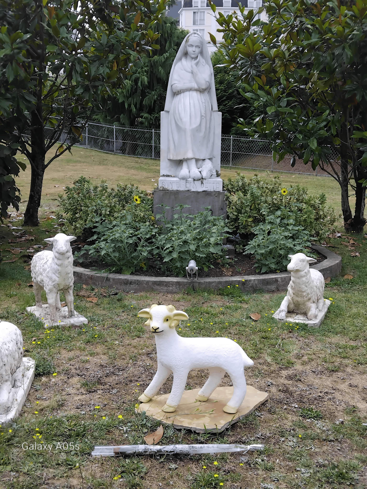
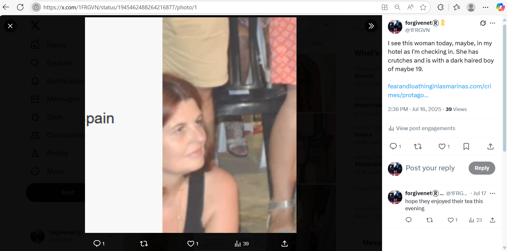
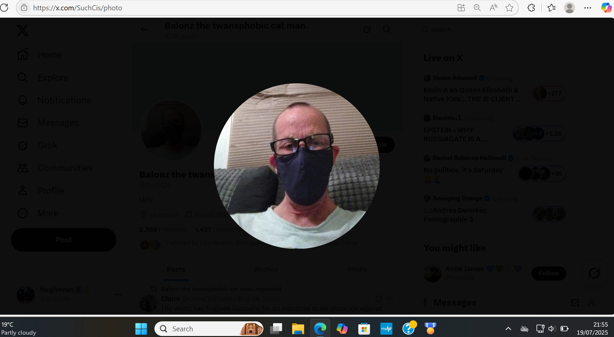
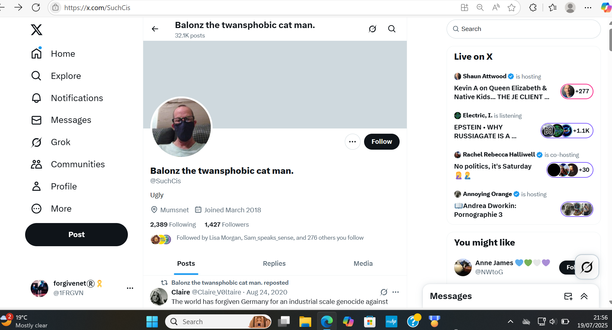
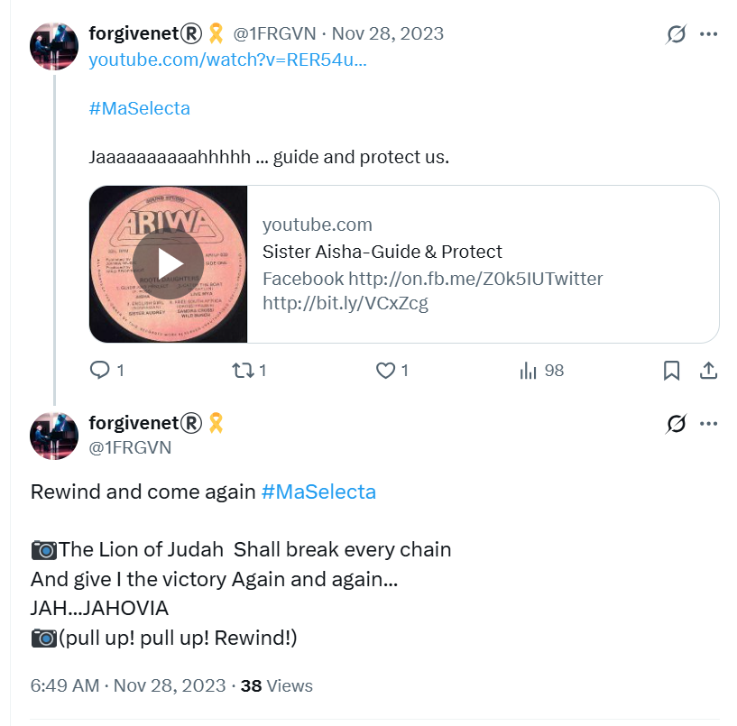
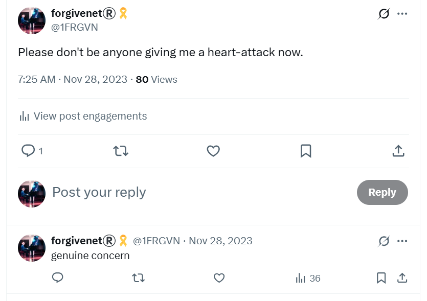
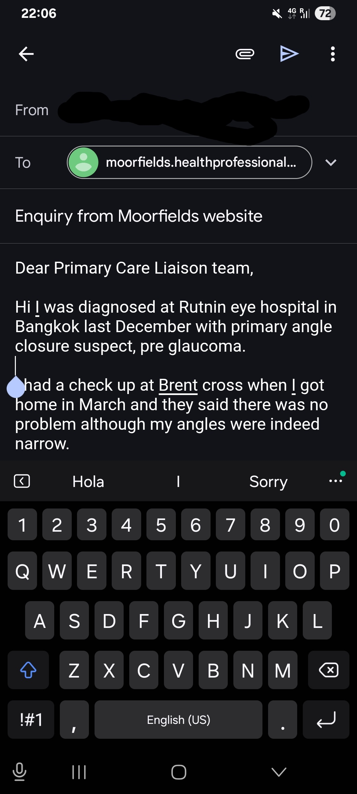
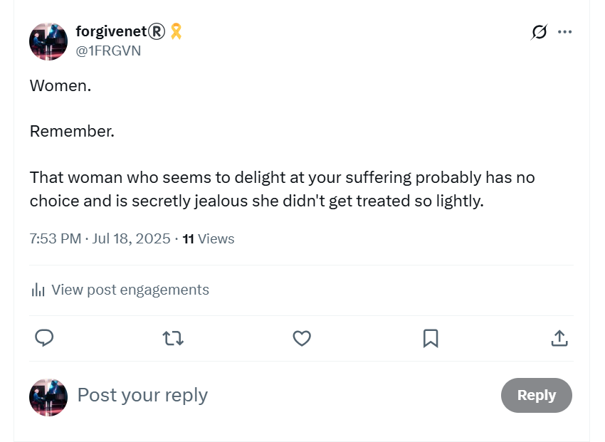
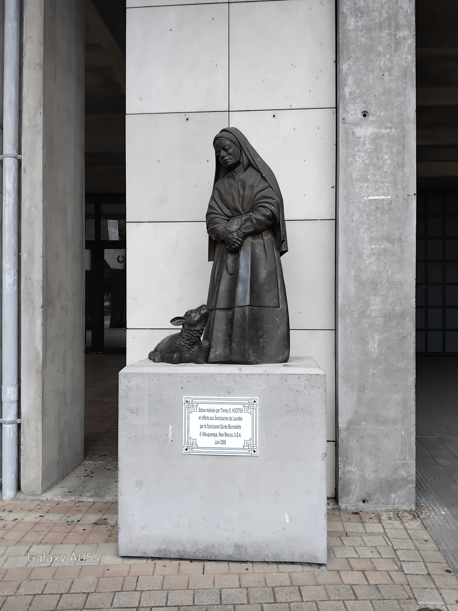

# July 2025

## Delivery man sniggers at me

- A delivery man brings a package for a family member.
- I answer the door.
- He's holding his phone in one hand and the package in the other, which he hands to me.
- He looks at me, grinning and sniggering in a perverted way.
- It's as if he knows who I am.
- Does he have a dark-web porn subscription to live-target action genres?

## ChatGPT

- ChatGPT breaks for me whenever I'm drawing something explosive.
- Whenever ChatGPT draws an image as if it was there at the time, such as with the [smug guy at the conservatory](../../timeline/2023/november.md#weird-guy-at-the-conservatory), I get weird responses online, or I am denied access to ChatGPT for 720 hours.
- This is on desktop only.

## The woman at the Red Lion

- Dad and I go to the Red Lion in High Barnet for a Sunday dinner.
- We sit down in the empty seating area.
- A woman comes in right behind us and sits close by to us while I'm getting dad sat down.
- She's blond, late 50s, pale, chatty.
- She talks *at* us.
- She is over-talkative, in fact, but not in a friendly way.
- She reminds me of the [white man interrogating the group of British Islamic Asian men](march.md#a-man-who-reminds-me-of-domingo) that had sat right next to us in March in another completely empty seating area.
- They could be related; her son maybe, or younger brother?
- They have the same manner of speaking.
- I go and get our drinks first, then dinners, leaving dad alone with the woman twice.
- It's possible something was added to my drink while I was away.
- When I bring the dinners back, the waitress is taking her order.
- She calls the woman by her first name; Claire maybe.
- Dad seems cowed, a bit scared of her.
- He tells me that she kept saying things to him he didn't like.
- He says he thinks she's the boss.
- I tell him not to worry about her, and that I won't leave him alone with her.
- I start feeling high again at that moment...
- As dad and I leave, we have to walk past the woman.
- As I pass her, she makes an unnecessary hand-gesture to me; the prayer gesture that the Thai's and Indian's make to each other after speaking; a specific thing I did often at the conservatory that teachers and staff jeered at and persecuted me about.
- I note it.
- Just like the man from March, she had the air of someone who only speaks to people who are very afraid of her.

## Dad is unable to go to Lourdes with me

- Dad was booked up to go to Lourdes with me.
- A few days later, he poos himself disastrously and I tell him I can't deal with it.
- We cancel his trip and I decide to go alone instead.

## Dad tells me he's a spy cop

- The Sunday before I leave on my own for Lourdes, dad and I go for a dinner at the Claddagh Ring.
- He's very candid with me this evening.
- He tells me he thinks his brother abused my aunt Bernadette and I've had enough of hearing about this sort of lets-blame-Jo-for-everything-I-did and get angry with him.
- He tells me he's a spy cop.
- Not a spy cop exactly, a spy robber would be a better term.
- He tells me he married my mother on request by the British government after an army major gave him a lift to Belfast from Dublin when he first went to university.
- I don't believe him. It's a lie.
- If it were true, it'd be high treason the consequences of which are worse than any sex crime.
- I think he's made this up because he knows they're planning on murdering me in Lourdes because the woman at the Red Lion had told him so, and he's not going to help me.
- It's an excuse.
- And not the truth.
- The truth is he won't help me because he's an incest-porn star; filmed running out of my bedroom when I woke up out of sedation when he injured me while violently anally raping me.
- He'd let his daughter go to her death before confessing this.
- So he's making something up that's on a parallel to explain it, but not quite as bad - in his mind - as admitting he's sexually abused me while I was sedated.
- It's a sick, fake apology; in advance.
- Actually, it's not even that. It's something else. He's saying something to someone, not me, and not the right thing.
- I think he knows we're bugged; something happened at Costa Coffee which told him they're watching him.
- He can't think the British have anything to do with it, or he would have made something else up.
- He's finding a way to save himself from the porn-truth, in advance if he needs it.
- It's unfathomable to me.
- You'll have to ask him.
- Nonetheless, whatever he was doing, he could have saved me then and there, told me not to go, told me I was in extreme danger.
- And he didn't.
- This is how ashamed the sedating, raping porn-addicts truly are; and it only takes a tiny poke of their gargantuan stinking fatberg for it to show.
- Bast&rd. Throw the book at him.

## Lourdes

- I visit Lourdes.

### The baby Ram

- On my first walk around the sanctuary, I'm stunned to see a baby Ram with my favorite statue of Saint Bernadette.

- I have been thinking a lot about Ram's horns, and trumpet players who might be born in Spring, about Hanuman and his strength and devotion to Ram, and things like this, for some time, in a tearful way.
- I remain stunned.
- I visit the little Ram every day.
- When I next return to Lourdes, the little Ram has gone.
- Bonafide Catholic Church involvement in the conspiracy as the trick to keep me distracted - and [steal my eggs](../../crimes/egg-theft.md) - ramps up.

### Poisoning ordered by the Americans

- As I check into my hotel, the Arcades, two people walk past me after speaking with reception.
- One of those people is the woman to the left of this pic.
- She speaks perfect French to the receptionist.
- She is walking on crutches.

- Later, on X, someone introduces her as Taya.
- At the hotel, she is with a tech I suppose; a man of about 20 with black hair and very pale skin. 
- He is dressed in black.
- The following day, they come to the restaurant for dinner, just after I have arrived to eat.
- She no longer has crutches.
- As she walks past the waitress, she says something like "oh, I don't need my crutches anymore, it must be a miracle".
- I see the waitress sort of whirl backwards a bit as they brush past her.
- The waitress goes off sick and doesn't return. 
- It is now 7 days she is off sick. She had a very bad cough. This might be irrelevant.
- These two were tasked to enter my room (possibly with the black maid's help because she couldn't look me in the eye) and add poison to my toiletries.
- My eye health deteriorates massively this week in Lourdes.
- There is a lot of activity on X, especially after I post a response to all this.

- Some threatening follows also.

- I have seen this profile photo before during menacing communications.
- I check the profile message.

- The message, "Ugly", I presume to be reference to being followed the previous summer in Lourdes and Cauterets, something [I already wrote about](https://fearandloathinginlasmarinas.com/timeline/2024/august/#followed-by-the-gypsy-in-france), and maybe posted about, we will see.
- The poisoners will also add deadly substances to the food and drink I left in my car that I planned to consume in Cauterets.

### Constant confirmation I'm being watched

- Over these 10 days in Lourdes I see posts and account messages confirming I'm being watched, and very closely too.
- I see posts referring to my belly size which makes me think they've installed a spy-cam in my room.
- I see posts related to how I look, what I'm wearing, things in the town, decorations at the hotel, the amount of mosquitoes in the hotel.
- It's endless.
- I got some videos of the poisoners at dinner.

!!! tip "Videos"
    - I tried to get videos of them at dinner.
    - I added the videos I did get to the repo:
        - [1](https://drive.google.com/file/d/1flFEbVj4ekoadj2ptsBCY2fn8fRb1xbq/view?usp=sharing) 
        - [2](https://drive.google.com/file/d/1ZdSf9KXYfJRfW4zpJ01d7vWHOIoamtoC/view?usp=sharing)
        - [3](https://drive.google.com/file/d/1hZvMgg0z0DzZbERC9se5HlvDEzWi5AUt/view?usp=sharing)

### The man with Alzheimer's

- One afternoon while serving at the bath, I ask Mary to give me a sign about my love.
- *If he exists, Mother, please tell me a little bit about what he's like. Give me a partner just like him*.
- I am partnered with the most delightful Spanish woman and we get on famously.
- A very sick man comes in with Alzheimer's.
- I have my hand on his shoulder, and he calms and we both look at Mary together.
- My partner takes the holy spring water and gently applies it to his lips.

### Saint Anne & Saint Joachim's feast day

- On my last day's service, I attend mass.
- It's Saint Anne and Saint Joachim's feast day.
- They are Mother Mary's parents and they had her very late on in life; they were elderly even.
- I'm comforted to read that she was looked after by the widows in the temple.
- It's a really good service and I very much enjoy the sermon given by a priest who is unusually sane in this crazy world of transvestite nuns.

### Spy cam

- I bought a spy cam for my trip so that I can see if anyone unusual is coming into my hotel room.
- It has no network connectivity so it cannot be hacked, I assume.
- The date setting of videos defaults to 2017. 
- I cannot change the `date.txt` file as it is in Chinese.
- I test the device for a few days and it works well, maintaining the 2017 date.
- It picks up the cleaners coming in for 10 minutes and doing a quick towel change and making the bed.
- The evening after I see [these two in the hotel restaurant](#lourdes), I check the device.
- There is a video of me leaving the room, as normal, and coming back, as normal.
- The cleaners didn't come that day.
- During an hour's period while I'm out, there are 10 new videos.
- Each one is a still of the room, there is no movement in it at all.
- I assume this is when those two came in.
- Also, the date has been changed on the device to 27th November 2023.
- I check this date online.
- It is a Monday during the dizzy heights of intense drugging, cyber-stalking, and terror at the conservatory.
- Notably, on this day I do not post at all in the evening.
- I do post first thing on Tuesday morning with a song in my head.

- Was 27th December an evening in which I was sedated and people came into my apartment to abuse me on camera?
- Was my choice of song afterwards significant?
- I'm obviously feeling extraordinarily stressed.

- Having spent a few days in the mountains struggling to walk, I now believe they picked this date to inform me they had gone for my heart this time.

### Eyes and kidneys, again, and heart now too?

- In service at the baths at Lourdes, I startlingly notice how poor my left peripheral vision has become.
- I'm just not seeing things I should be seeing; someone's coat dropping to the floor right beside me, movement of pilgrims in the baths, and other things.
- Not only that, but I missed seeing a giant crack on my left windshield that was caused by something falling during rough seas on the boat.
- Even though the Brittany Ferries operative came over with a clipboard - I now realize to take the information - I hadn't seen the crack yet so I didn't know why he was hovering around looking like he wanted to talk to me, and then just sort of wandered off looking a bit silly. 
- I noticed the crack in the bright sunlight about an hour later on the road.
- It's even more surprising because Moorfields gave me a *somewhat* clean bill of health just a couple of months ago.
- I write to them, concerned.
- As I'm writing to Moorfields, a hacker says sorry in the spell check options.

- I write about this in the [August 2024 section](../2024/august.md#i-realize-i-have-been-poisoned-and-drugged) the first time a hacker said sorry to me when I mention being poisoned.
- On my last day of service to Mary, I have a really big headache which feels like it is going to become a migraine and is effecting my eyes and vision.
- I have to come back to my room and skip the afternoon service.
- Curiously, this is right after a [very bizarre meeting with a member of the British hospitalite](#more-transvestites-at-lourdes).
- The following day, I feel a little better, but after about an hour in the car on my way to Cauterets, I can feel both kidneys are screaming just like they did when I was sitting peacefully in my apartment in Dénia around lunchtimes.
- The next day, my kidneys are still aching, my eyes are blurry, and my vision is extremely poor. 
- I can hardly look at bright lights, including a clear sky.
- And that [private symptom Ana Girbes had such fun jeering at](../2024/january.md#ana-and-ana-and-paqui) has returned - frequent urination and dribbling - actually I believe this symptom is mostly due to repeated rape.
- They certainly got me, yet again.
- Toiletries, toothpaste, moisturizer? Who knows.
- Perhaps they even got into the car where I was keeping water and food.
- What a nightmare.
- I wonder what on earth they get out of it.
- I suspect the woman and her assistant are just following orders, but whose, and for what purpose?
- I suspect the woman has suffered things I couldn't dream of.

- By my current inability to walk uphill, it appears they went for my heart this time around, and I certainly saw a couple of fake accounts flying by with names or messages containing the words; "finger injections", i.e. injecting digitalis into my bathroom products or water.

#### Why now?

- Is whatever sedating rape-gangs use to drug women a powerful hallucinogenic plant, like ayahuasca which, also like ayahuasca, has a full come-back-down-to-normal duration of around six-to-eight months.
- This is what I noticed about the effects of the plant when I tried ayahuasca around 2005 to help me access blocked memories from sedated experiences in 1989.
- Did criminal gangs *have* to dose me up again, or finish me off, so I wouldn't remember, or get clear about, the [four distinct men](../../crimes/protagonists/vidal-sastre.md#eight-distinct-men-posing-as-trumpet-teacher) posing as one man, the trumpet teacher, *Vidal Sastre Sanchez Hornero*?
- When I look over this statement, I realize that I have been looking at photos of these very different men since June 2023 and believing them to be one man until I [got suddenly clear-headed in September 2025](october.md#thunderbolt-clarity).
- It wore off, didn't it.
- I guess targets rarely get free for long enough for it to wear off.
- Is that why targets end up long-term on something from their GP which is, perhaps, not what it says it is on the label?

#### Moorfields

- I write to Moorfields extremely concerned about the sudden onset vision loss in my left peripheral.
- I'm walking in the mountains, like I do every year, and I simply can't see things on the left side.
- Even the right side is different than before.
- When I compare my sight to a year before in September when I was doing the same thing, it's obvious my eyes have suffered some serious harm.
- I believe this eye problem comes from [poisoning in my apartment by my neighbors at Carrer Furs, and Carmen Cano and her associates in October 2024](../2024/october.md#serious-poisoning-with-intent-to-kill).
- I mention the [appointment with Moorfields in March](march.md#moorfields-eye-hospital) and that I felt unconvinced by the results.
- I mention the [diagnosis at Rutnin from November 2024](../2024/november.md#pre-glaucoma-diagnosis).
- They are giving me the run around; they can't find my files now.
- Does the global spy-cam porn conspiracy extend so far that even the British government are prepared to cover up the systematic targeting of women and children for porn and worse for decades in Spain?
- Do they think that, perhaps, once society is totally immoral no-one will care anyway and they won't have to worry about ignoring 1000s of complaints, probably [Lorraine Blackbourn's too](../2021/july.md#lorraine-blackbourn-commits-suicide).
- Is the conspiracy wrapped up in the [medical-transitioning of children](../2011-to-2020/2013.md#lorraines-trans-child) scandal too?
- Is this why whenever I desperately tried to get help from the UK embassy or foreign office, they ignored me, even put the phone down on me?
- Is this why the [Metropolitan Police](../2025/january.md#i-report-hacking-drugging-poisoning-illicit-filming-and-everything-else-contained-in-this-statement-to-the-metropolitan-police) might as well have told me I'm an idiot, knowing full well I'm a rape-gang survivor?
- Is this why Spanish gangs feel 100% completely safe, and don't even care about leaving an evidential trail that a blind cat on catnip could follow?
- Do they know they are protected at the highest level?
- They must know it can't go on forever.
- Will I simply end up dead in suspicious circumstances, like Lorraine, like everyone else who complains?
- My heart says I will survive even this.
- I hope so, we've lots to get through and the world is insane in very dangerous ways now and something has to change.

### Mexican Mary

- I'm wandering around the grotto, and I'm thinking of Steve and our recent Israel trip.
- I stumble across a statue of Mary from New Mexico which I had never noticed before and I'm interested because I know Steve lives near New Mexico.
- I send a photo of Her to him.

### More transvestites at Lourdes?

- I'm serving at Lourdes and as part of service you have to fulfil a few formalities and training.
- I have two trainings assigned.
- On the Tuesday of service, I go to the training centre for the first training.
- A woman called Kathleen is running the trainings for the English-speakers this week. It rotates depending on who is in Lourdes at the time.
- She is an enormous woman in her seventies probably. Huge.
- She reminds me of an orangutan.
- I'm about 2 minutes late and there is some discussion about lateness being disrespectful.
- Myself and a young man who works at M&S (I forget his name but he volunteers on the main plateau and I saw him standing there one afternoon and said hi) attend and it's a great meeting.
- Kathleen explains there is now some safeguarding protocol at the baths.
- I'm delighted to hear this and express it.
- She waves a leaflet at us but doesn't really go into how we might report concerns.
- I ask her if there is any way to report concerns anonymously to someone prior to reporting formally. The reason I ask is because of my experiences with men in the women's baths over the years, and being forcibly kissed by a male volunteer one summer.
- Kathleen says, certainly there is such a function in the French side of the hospitalite, but not yet in the British.
- After the meeting, Kathleen and I chat a bit about how AI might help the hospitalite with video tasks which have been historically time-consuming and difficult to manage.
- I go for my second and last training on the Friday morning.
- Kathleen is 10 minutes late to the meeting, I'm waiting outside. It seems I'm the only attendee.
- She arrives and we go in.
- I'm not sure where to sit, so I bring a chair a bit closer to her otherwise we'd be at opposite ends of the room.
- Kathleen says: "You can sit on my knee if you like."
- I say, strongly: "That won't be necessary," and move to the opposite side of the room.
- I see her grin.
- I suddenly start wondering about Kathleen.
- Next, a young British Indian woman comes into the meeting, sits next to Kathleen, and starts talking in an outrageously posh manner.
- It's a bit weird.
- Kathleen says to me, oh, this lady is in tech, she understands AI etc.
- I explain what I know about an exemplary AI video platform I recently saw demoed.
- The Indian lady shuts me down with some ideas about how processing power is a real issue for AI systems and I'm sure she means privacy.
- I note it.
- Kathleen talks about people feeling inferior. 
- I note it.
- Kathleen then asks me about my experience this week regarding reverence for Mary and the sanctuary.
- I notice the Indian woman is looking a little nervous.
- I say: "I believe the sanctuary is sacred space, and from the moment you enter, anything that happens is important and governed by Mary."
- The Indian woman's legs are shaking so hard she puts her bag in front of the chair.
- I give an AI platform recommendation to the Indian woman and ask her to write it down, and explain that she can get a contract lawyer to go over any privacy details (which is probably what she was trying to say).
- The meeting ends and I get an immediate headache and start feeling unwell; symptoms of poisoning rising to the surface.
- Later, I realize that Kathleen could very well be a man and therefore his/her comment about sitting on her/his knee was even more toxic.

### Serving at the baths

- While all this craziness was going on, I went into the baths, morning and afternoon, to serve Our Lady and assist the sick and faithful.
- It was beautiful and I felt like I was existing in a world very close to Heaven.
- The evil around me could not get in until that [last meeting](#more-transvestites-at-lourdes), at which point I started to notice effects of poisoning, although most likely I had been ingesting the same poison for the whole week.
- Prior to that, every second in the baths was a blessing.
- The little bird that flew in and needed rescuing.
- The beautiful team from Napoli who I adored.
- Every woman I worked with.
- My appalling attempts at leading the Spanish prayers.
- My less appalling attempts at leading the English prayers.
- Everyone I met and interacted with.
- Singing in the choir on St Mary Magdalena's feast day.
- My Spanish partner one afternoon who gently put the holy water on the Alzheimer sufferer's lips, and for a moment he went calm and looked at me as we prayed.
- The Hindu lady who came to see Mary and ask for healing.
- The families, the single people, the man who had been cured miraculously in 2021 and now sings in the choir and tells everyone his story.
- I asked Mary for guidance, for clarification on the love I feel for this man who has taken over my daily thoughts since December 2022.
- Could such a powerful feeling that never lets up be all from drugs and manipulation, I asked her?
- She replied no, not all.

## Everything changes

- I won't realize until August 2026, but this marks the moment that criminal gangs are *officially* replaced by security services - not even then... way earlier.
- I do notice something has changed, but it's not clear to me in my drugged (constant invasive-surgery recovery - pain killers was it?) state exactly what or why.
- In fact, I've been so effectively drugged during this time, I don't realize that the constant agent activity around me since July 2025 is not about law-enforcement bringing down the largest international criminal gang ever known at all.
- No, it's all about stealing a *superhero's* eggs, while planning the murder of the superhero once they feel they got enough of them.
- I won't know any of this till August 2026, when God tells me everything at the Kotel.
- Up until then, I am stalked relentlessly by security services that seem desperate to bite chunks out of me.
- They make a few more attempts at murder; including [a really good try in Tibet in June](../2026/june.md#everest-base-camp-and-sickness).
- I survive.
- Agent numbers increase exponentially after each failed attempt, and now I rarely meet people who aren't agents or bought locals.
- In total, I'm told they tried to murder me with poison seven times and stole countless eggs in a similar number of sedated internal operations which left me injured and totally without help or support.
- In July 2025, I can see that the blatant sex offending, pedophilia, serial-killing, and industrial scale baby-rape in Spain continues unabated, and I find this weird but assume - like a  normal private tax-paying citizen would in this unique situation - that international police and governments have a very good reason for the inactivity.
- They do, but it's never the reason we naively believe we would pay for.
- In August 2026, I realize with horror that not only have they been allowing the baby-rape to continue unabated, they have also been sedating me and performing internal invasive operations while I'm sedated since [May 2025 in Dublin](may.md#transforming-touch-intensive-in-dublin) for even more sinister purposes than rape-porn.
- They want my eggs, they think they can create humans who survive poisoning.
- They're insane. It's a gift from God and He decides who gets it and why.
- It's His Plan and He can take it away whenever He likes too - a short review of the bible will confirm all this, and what happens to those who lose their minds to power, influence, wealth, and evil.
- If one needed more confirmation, any incorruptible religious person from any of the religions in the world will also confirm it.
- I guess they didn't bother asking anyone; it is such a sickening move, they would have made sure never to mention it in incorruptible circles.

| Criminal gang type                            | Budget                                                     | Core process           | End goal                                                                                                     | Methods                                                                                      | Finest hour                 |
|-----------------------------------------------|------------------------------------------------------------|------------------------|--------------------------------------------------------------------------------------------------------------|----------------------------------------------------------------------------------------------|-----------------------------|
| Porn gang                                     | €/£ Thousands - as little as possible, slave labour mostly | Violence and violation | Criminal porn production by any means necessary, always worsening in step with porn-addict appetites         | Sedation, drugging, poisoning, psychological torture, hacking, murder, serious sex offending | Industrial-scale baby-rape  |
| Security services aka The Mayor of Shark City | $/£ Multi-millions, thousands of salaried individuals      | Violence and violation | Whatever they want, often nothing to do with security, mostly coming from insane logic based on core process | Sedation, drugging, poisoning, psychological torture, hacking, murder, clandestine surgeries | Industrial-scale baby-theft |

### Industrial-scale baby-theft

- My guess is they got a viable pregnancy from April 2025 in Dublin, and the Americans requested to kidnap squirrel at that time for his sperm. But the UN needed full proof I survive poisoning, which they got, so they started to bite regular chunks out of me on American order with UN backing. Sickening!
- The baby-theft is obviously a running clandestine security program as it is, again just like in Dénia and Bali, a well-oiled machine.
- There must be masses of salaried individuals from all over the world  ready to drop everything and race to the nearest CIA-HQ-cum-hotel to perform surgery on a sedated individual.
- And - although I imagine they have numerous sick goals behind this evil - it totally explains their lookalike program which, I guess, they do relentlessly on a target so that when the real person turns up, the target doesn't believe it's them, such as with [Elon at the Holiday Inn in Bali, again, in June 2026](../2026/june.md#elon-is-at-the-hotel) who may have been at the Loka Yoga centre a week later for even more trophy hunting.
- Who knows what else they're up to.
- Perhaps they're trying to create a master race! That's it, isn't it!

## Cauterets

- After Lourdes I stayed in Cauterets for three weeks.
- The whole town was rammed with agents.
- Everywhere I went, agents.

### Rescuing Antonio and taking him to Israel

- I was contacted constantly about the impending "rescue" of Antonio Ruiz and how he was going to be taken to Israel and be finally safe.
- It was relentless; days, times, afterwards, when it was done.
- And all of it was lies.
- Instead, the UN kidnapped a whole bunch of (I'm assuming) his associates and indeed took them to Israel, but he wasn't among them.
- Was it on ransom that he give himself up? I bet it was.
- The lie was repeated to me endlessly for over a year, until God told me the truth at the Kotel in August 2026.
- I couldn't understand why they would have rescued him and not me. It never made good sense. And so it was always doomed, but I expect they thought I'd be dead before I ever found out anyway.

### Another surgery in Cauterets

- I'm pretty sure they must have extracted an egg/eggs here.
- This was the first time I noticed some pain in my left groin area (I had thought hip before by mistakenly associating it with a very minor inconsequential misstep in the mountains) which ended up being a (repeated?) stich that snapped at FitKoh in Samui.
- And I was high for days, weeks even - painkillers?
- Imagine performing surgery like that and letting the patient carry on normally which included intense treks up in the high mountains.
- Is that why there were always agents around? Making sure I didn't fall or collapse or whatever?
- And to distract me was this constant story, this lie about what had happened to Antonio.

### The Indians are listening

- So I started to communicate directly on the Samsung via email - which I continued doing right up to Loka Yoga in Bali in July 2026.
- And one time, suddenly, the screen goes to Hindi and they're telling me, no no, you must stop talking now the Indians are listening.
- They've set them up as *enemies*... which was utterly ridiculous and I even knew it then.

### Massive farts up the mountain

- The day after surgery, I believe it must have been, I went up into the high mountains.
- I was farting like a hippo.
- I think the farting is to do with the CO2 in the abdomen for keyhole surgery and it wasn't the first or last time this happened.

## More threats

- I also see threatening pics on my mobile device which remind me very much of [the violent threats I received on X in March 2024](../2024/march/13-end.md#online-stalking-and-threats-over-this-period).

- I can't describe how exhausting it is to be constantly stalked by multiple gypsies who probably don't even know the why of it anymore.
- If I didn't have God, I'd fear their murderous and vile intentions, and from time to time I do fear it.
- I pray all this is over soon.

## The Benijembla woman

- In November 2022, while walking with the English ladies, a choreographed scene was set up for my benefit.
- I write about it [here](../2022/november.md#walking-in-benijembla-with-the-english-ladies).
- I noticed a woman with the trumpet teacher on that afternoon.
- I see pictures of her on X, again and again, in profile photos and elsewhere.
- Even in July 2025, hackers post her pic.
- Here's a couple.

- I'm led to believe it is TT's wife - the dangerous TT - but it's never clear what they want me to think.
- The implication is usually that she's been doing porn.
- I may even have an X account with a profile picture of her as a young girl of about 13 maybe. 
- Could this be her too?

- Could her name be Maggie Harrington?

## Viscos

- I see the Viscos peak from [my temporary chair](https://drive.google.com/file/d/1W92R2v8QAsAzDaAs1oIg99ozWLrcuqJ4/view?usp=sharing) in Cauterets.
- The lightning feels like a wave back; "I noticed you too". (It was a clear sky, no clouds).
- Genuine Light episode folks.
- What the H+*&*&*& were you all thinking?
- Oh wait, I know. *I'm God, I'm God, I'm God, forget the Bible, who's Jesus again?...*, like that, no?

## Damning updates

- I write a number of damning updates such as [Alessandra's fake illness](../2001-to-2010/2009.md#alessandra-gets-sick-or-does-she) and [Lorraine's daughter's online grooming](../2011-to-2020/2013.md#lorraines-trans-child).
- An account follows me immediately afterwards.
- Note they are even able to manipulate the date of the follow to two days previous.

- Phonetically, and translated from French, this sounds like an admission of guilt; "evil us".
