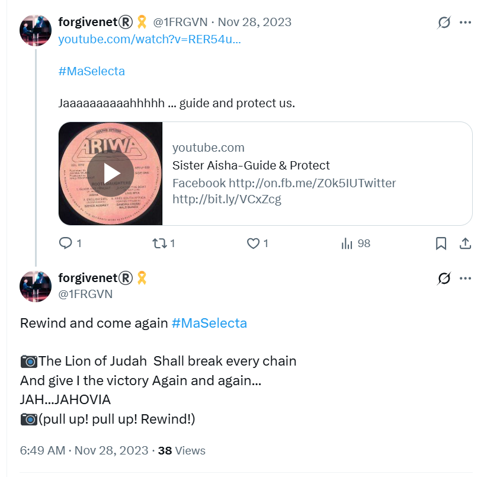

## ChatGPT

- ChatGPT breaks for me whenever I'm drawing something explosive.
- Whenever ChatGPT draws an image as if it was there at the time, such as with the [smug guy at the conservatory](../../timeline/2023/november.md#weird-guy-at-the-conservatory), I get weird responses online, or I am denied access to ChatGPT for 720 hours.
- This is on desktop only.

## The woman at the Red Lion

- Dad and I go to the Red Lion in High Barnet for a Sunday dinner.
- We sit down.
- A woman comes and sits next to us.
- She is over-talkative but not-friendly.
- She reminds me a little of the [white man interrogating the Asians](march.md#a-man-who-reminds-me-of-domingo) from before.
- As we leave, she makes an unnecessary hand-gesture to me which is just one of a million things I did that the teachers and staff at the conservatory jeered at.
- The bar staff address the woman by name.
- We thought she might be the boss. 
- Just like the guy from March, she had the air of someone who only speaks to people who are very afraid of her.

## Lourdes

- I visit Lourdes.
- As I check into my hotel, the Arcades, two people walk past me after speaking with reception.
- One of those people is the woman to the left of this pic.
- She speaks perfect French to the receptionist.
- She is walking on crutches.

- Later, on X, she introduces herself as Taya.
- At the hotel, she is with a tech I suppose; a man of about 20 with black hair and very pale skin. 
- He is dressed in black.
- The following day, they come to the restaurant for dinner, just after I have arrived to eat.
- She no longer has crutches.
- As she walks past the waitress, she says something like "oh, I don't need my crutches anymore, it must be a miracle".
- I see the waitress sort of whirl backwards a bit as they brush past her.
- The waitress goes off sick and doesn't return. 
- It is now 7 days she is off sick. She had a very bad cough. This might be irrelevant.
- I believe it is *highly* likely these two came into my room to add substances to my toiletries or whatever it is they do.
- They must be *going equipped* at all times.
- My eye health has deteriorated massively this week in Lourdes.
- Having been to police and doctors all over Europe about being stalked and poisoned over the last years, my sudden-onset pre-glaucoma condition amongst other things, and literally no-one wants to help me, I have no other option but to write it down.
- Are they trying to blind me so that I can't continue to write?
- There is a lot of activity on X, especially after I post a response to all this.

- Some threatening follows also.

- I have seen this profile photo before during menacing communications.
- I check the profile message.

- The message, "Ugly", I presume to be reference to being followed the previous summer in Lourdes and Cauterets, something [I already wrote about](https://fearandloathinginlasmarinas.com/timeline/2024/august/#followed-by-the-gypsy-in-france), and maybe posted about, we will see.

### Constant confirmation I'm being watched

- Over these 10 days in Lourdes I see posts and account messages confirming I'm being watched, and very closely too.
- I see posts referring to my belly size which makes me think they've installed a spy-cam in my room.
- I see posts related to how I look, what I'm wearing, things in the town, decorations at the hotel, the amount of mosquitoes in the hotel.
- It's endless.

!!! tip "Videos"
    - I tried to get videos of them at dinner.
    - I added the videos I did get to the repo:
        - [1](https://drive.google.com/file/d/1flFEbVj4ekoadj2ptsBCY2fn8fRb1xbq/view?usp=sharing) 
        - [2](https://drive.google.com/file/d/1ZdSf9KXYfJRfW4zpJ01d7vWHOIoamtoC/view?usp=sharing)
        - [3](https://drive.google.com/file/d/1hZvMgg0z0DzZbERC9se5HlvDEzWi5AUt/view?usp=sharing)  

### Spy cam

- I bought a spy cam for my trip so that I can see if anyone unusual is coming into my hotel room.
- It has no network connectivity so it cannot be hacked, I assume.
- The date setting of videos defaults to 2017. 
- I cannot change the `date.txt` file as it is in Chinese.
- I test the device for a few days and it works well, maintaining the 2017 date.
- It picks up the cleaners coming in for 10 minutes and doing a quick towel change and making the bed.
- The evening after I see [these two in the hotel restaurant](#lourdes), I check the device.
- There is a video of me leaving the room, as normal, and coming back, as normal.
- The cleaners didn't come that day.
- During an hour's period while I'm out, there are 10 new videos.
- Each one is a still of the room, there is no movement in it at all.
- I assume this is when those two came in.
- Also, the date has been changed on the device to 27th November 2023.
- I check this date online.
- It is a Monday during the dizzy heights of intense drugging, cyber-stalking, and terror at the conservatory.
- Notably, on this day I do not post at all in the evening.
- I do post first thing on Tuesday morning with a song in my head.

- Was 27th December an evening in which I was sedated and people came into my apartment to abuse me on camera?
- Was my choice of song afterwards significant?
- I'm obviously feeling extraordinarily stressed.

- Having spent a few days in the mountains struggling to walk, I now believe they picked this date to inform me they had gone for my heart this time.

### Eyes and kidneys, again, and heart now too?

- In service at the baths at Lourdes, I startlingly notice how poor my left peripheral vision has become.
- I'm just not seeing things I should be seeing; someone's coat dropping to the floor right beside me, movement of pilgrims in the baths, and other things.
- Not only that, but I missed seeing a giant crack on my left windshield that was caused by something falling during rough seas on the boat.
- Even though the Brittany Ferries operative came over with a clipboard - I now realize to take the information - I hadn't seen the crack yet so I didn't know why he was hovering around looking like he wanted to talk to me, and then just sort of wandered off looking a bit silly. 
- I noticed the crack in the bright sunlight about an hour later on the road.
- It's even more surprising because Moorfields gave me a *somewhat* clean bill of health just a couple of months ago.
- I write to them, concerned.
- As I'm writing to Moorfields, a hacker says sorry in the spell check options.

- I write about this in the [August 2024 section](../2024/august.md#i-realize-i-have-been-poisoned-and-drugged) the first time a hacker said sorry to me when I mention being poisoned.
- On my last day of service to Mary, I have a really big headache which feels like it is going to become a migraine and is effecting my eyes and vision.
- I have to come back to my room and skip the afternoon service.
- The following day, I feel a little better, but after about an hour in the car, I can feel both kidneys are screaming just like they did when I was sitting peacefully in my apartment in Dénia around lunchtimes.
- The next day, my kidneys are still aching, my eyes are blurry, and my vision is extremely poor. 
- I can hardly look at bright lights, including a clear sky.
- And that [private symptom Ana Girbes had such fun jeering at](../2024/january.md#ana-and-ana) has returned.
- They certainly got me, yet again.
- Toiletries, toothpaste, moisturizer? Who knows.
- Perhaps they even got into the car where I was keeping water and food.
- What a nightmare.
- I wonder what on earth they get out of it.
- I suspect the woman and her assistant are just following orders, but whose, and for what purpose?
- I suspect the woman has suffered things I couldn't dream of.

- By my current inability to walk uphill, it appears they went for my heart this time around, and I certainly saw a couple of fake accounts flying by with names or messages containing the words; "finger injections", i.e. injecting digitalis into my bathroom products or water.

#### Moorfields

- I write to Moorfields extremely concerned about the sudden onset vision loss in my left peripheral.
- I'm walking in the mountains, like I do every year, and I simply can't see things on the left side.
- Even the right side is different than before.
- When I compare my sight to a year before in September when I was doing the same thing, it's obvious my eyes have suffered some serious harm.
- I believe this eye problem comes from [poisoning in my apartment by my neighbors at Carrer Furs, and Carmen Cano and her associates in October 2024](../2024/october.md#serious-poisoning-with-intent-to-harm-or-kill).
- I mention the [appointment with Moorfields in March](march.md#moorfields-eye-hospital) and that I felt unconvinced by the results.
- I mention the [diagnosis at Rutnin from November 2024](../2024/november.md#pre-glaucoma-eye-condition).
- They are giving me the run around; they can't find my files now.
- Does the global spy-cam porn conspiracy extend so far that even the British government are prepared to cover up the systematic targeting of women and children for porn and worse for decades in Spain?
- Do they think that, perhaps, once society is totally immoral no-one will care anyway and they won't have to worry about ignoring 1000s of complaints, probably [Lorraine Blackbourn's too](../2021/july.md#lorraine-blackbourn).
- Is the conspiracy wrapped up in the [medical-transitioning of children](../early-years/2013.md#lorraines-trans-child) scandal too?
- Is this why whenever I desperately tried to get help from the UK embassy or foreign office, they ignored me, even put the phone down on me?
- Is this why the [Metropolitan Police](../2025/january.md#i-call-the-police) might as well have told me I'm an idiot, knowing full well I'm a rape-gang survivor?
- Is this why Spanish gangs feel 100% completely safe, and will only get worse and worse, if it's possible to get any worse, because they know they are protected at the highest level?
- They must know it can't go on forever.
- Will I simply end up dead in suspicious circumstances, like Lorraine, like everyone else who complains?
- My heart says I will survive even this.
- I hope so, we've lots to get through and the world is insane in very dangerous ways now.

## More threats

- I also see threatening pics on my mobile device which remind me very much of [the violent threats I received on X in March 2024](../2024/march.md#twitter-screenshots).

- I can't describe how exhausting it is to be constantly stalked by multiple gypsies who probably don't even know the why of it anymore.
- If I didn't have God, I'd fear their murderous and vile intentions, and from time to time I do fear it.
- I pray all this is over soon.

## The Benijembla woman

- In November 2022, while walking with the English ladies, a choreographed scene was set up for my benefit.
- I write about it [here](../2022/november.md#walking-in-benijembla-with-the-english-ladies).
- I noticed a woman with the trumpet teacher on that afternoon.
- I see pictures of her on X, again and again, in profile photos and elsewhere.
- Even in July 2025, hackers post her pic.
- Here's a couple.

- I'm led to believe it is TT's wife - the dangerous TT - but it's never clear what they want me to think.
- The implication is usually that she's been doing porn.
- I may even have an X account with a profile picture of her as a young girl of about 13 maybe. 
- Could this be her too?

- Could her name be Maggie Harrington?

## Viscos

- I see the Viscos peak from [my temporary chair](https://drive.google.com/file/d/1W92R2v8QAsAzDaAs1oIg99ozWLrcuqJ4/view?usp=sharing).
- The lightning feels like a wave back; "I noticed you too".
- So nice.

## Damning updates

- I write a number of damning updates such as [Alessandra's fake illness](../early-years/2009.md#alessandra-gets-sick) and [Lorraine's daughter's online grooming](../early-years/2013.md#lorraines-trans-child).
- An account follows me immediately afterwards.
- Note they are even able to manipulate the date of the follow to two days previous.

- Phonetically, and translated from French, this sounds like an admission of guilt; "evil us".
