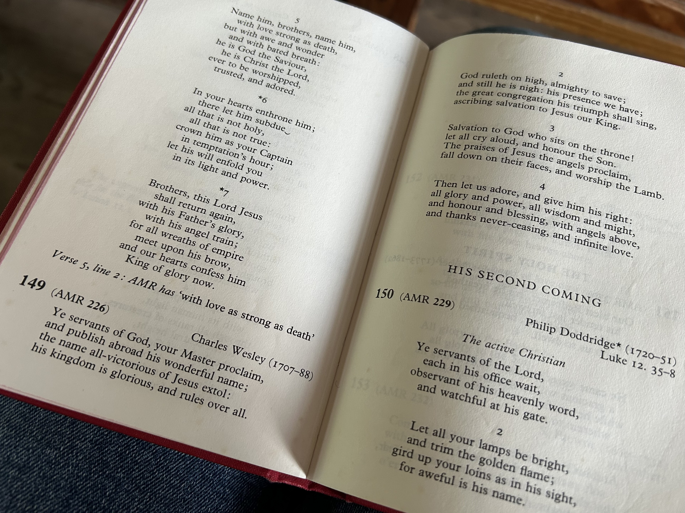

# June 2025

## Murdered by the gypsies in Madrid

- I meet a man whose mother was likely murdered by gypsies in Madrid for her jewels.
- They set it up like she had commit suicide and there was no investigation.
- I tell him I'm doing it all for her too.

## St Michael's church Minehead

- The organist.
- The candle.
- The hymn.

- TODO:

## Snout or world-saving lucky-frog-missus

- After a long time, I randomly do a google search on `1frgvn x` on my mobile.
- I see the following sole X reference as a result:

- This was a profile message from late 2023 or early 2024.
- There is very little else in results.
- Two days later, and this result is gone.

## My dad's a "legend"

- I take my dad to a gig where he plays piano.
- He's unstable on his feet.
- As he's getting up onto the stage, a man who looks a bit wild runs up to us.
- *You're a legend*, he tells my dad repeatedly.
- I think, at the time, it's because my dad is so frail yet still out and about doing his hobbies, except this wild man keeps looking at me in a strange way, snickering.
- I now think the man, like millions more, had seen the incest porn and was referring to my dad being a "porn legend"...
- I wonder how famous he actually is in porn...?
- Pretty famous, I expect.

## Jan Lovell blanks me at East Finchley library

- Who's told her I'm going to be there.
- Who told her to glare at me angrily and blank me when I mention my emails.
- Adams?
- Probably... little Lucy was so desperate to meet me in January/February, and was so excited about showing me her new "girlfriend" who had put plastic down and was clearly about to self-harm for porn (I guess Lucy manipulating it all the way)... maybe even kill herself, who knows.
- Nice lot.
- Aren't they.
