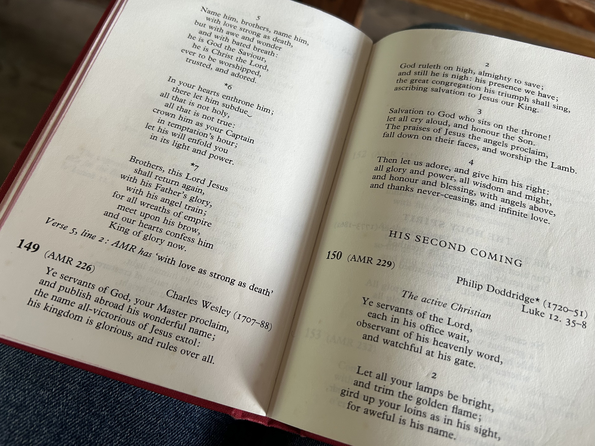

# June 2025

## Detox

- Spies everywhere: woman bullied at work, over-chatty woman, etc.
- I'd be surprised if there were any normal people on this retreat.
- Just sketching now, will edit later

### Louis Theroux lookalike and his wife give me a hard time

- What a set up.
- God told me he'd put the wipes back, and where they were too.
- Extraordinary business.

### Murdered by the gypsies in Madrid

- A therapist on the retreat is someone I know from the US trauma world.
- He was assisting at the Somatic Experiencing (SE they call it) trauma introductory course I went to in Edinburgh I think in 2017 but found it not for me - actually people had been particularly unpleasant towards me when I was looking for help.
- In February 2020 at TT in Cork, a woman tells me the man's son committed suicide.
- He doesn't tell me this when we have a chat but he does tell me his mother was likely murdered by gypsies in Madrid for her jewels.
- He told me that it had looked like suicide - head in the oven - and there was no investigation.
- I tell him I'm doing it all for her too, which I most certainly am if she was another mousse-patsy sent in and never expected to come out alive, like me - unless of course he was lying about his mum.
- I saw him in Glastonbury the last time I was there... when was that, oh yeah, while I was staying in another temporary mousse-operating-theatre in Dorset in February 2026... I was walking and saw him, but he kept his distance... very far off he was but I could see it was him.
- Incidentally, Levine's program is closely connected to the US military.
- Another incidentally, is that neither Levine nor Steve have set up any courses in England (I might be wrong about Levine), which seems strange. Always Ireland for Steve, and Northern Ireland/Scotland for Levine.

## St Michael's church Minehead

- The organist.
- The candle.
- The hymn.

- TODO:

## Writing to the Baroness, again

- wip

## Snout or world-saving lucky-frog-missus

- After a long time, I randomly do a google search on `1frgvn x` on my mobile.
- I see the following sole X reference as a result:

- This was a profile message from late 2023 or early 2024.
- There is very little else in results.
- Two days later, and this result is gone.

## My dad's a "legend"

- I take my dad to a gig where he plays piano.
- He's unstable on his feet.
- As he's getting up onto the stage, a man who looks a bit wild runs up to us.
- *You're a legend*, he tells my dad repeatedly.
- I think, at the time, it's because my dad is so frail yet still out and about doing his hobbies, except this wild man keeps looking at me in a strange way, snickering.
- I now think the man, like millions more, had seen the incest porn and was referring to my dad being a "porn legend"...
- I wonder how famous he actually is in porn...?
- Pretty famous, I expect.

## Jan Lovell blanks me at East Finchley library

- Who's told her I'm going to be there.
- Who told her to glare at me angrily and blank me when I mention my emails.
- Adams?
- Probably... little Lucyfer Adams was so desperate to meet me in January/February, and was so excited about showing me her new "girlfriend" who had put plastic down in front of a full length mirror beside a bed and was clearly about to self-harm for porn (I guess Lucy manipulating it all the way)... maybe even kill herself for the porn, who knows.
- Nice lot.
- Aren't they.
