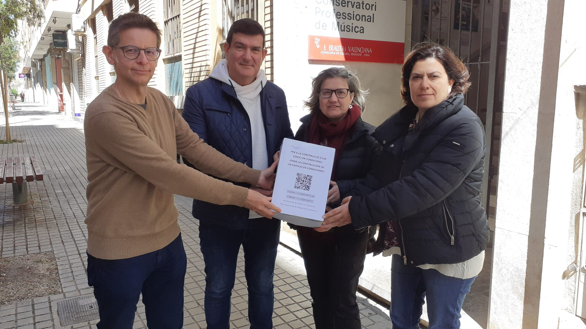

## Researching the book

- It's time to knuckle down and finish editing this statement in preparation for publishing it as a novel.

## Conservatory news

- On [Dénia.com](https://www.Dénia.com/wp-content/uploads/2025/03/firmas-recogidas-para-un-nuevo-conservatorio-de-musica-en-Dénia-scaled.jpg) there is a report on a petition raised regarding a new building for the conservatory.

- From left-to-right, Joan Carles piano teacher, Jaume Signes trumpet teacher and director of the school, Paqui Fornet piano teacher, and Rosa Vidal vice director.
- All of them will be aware of what happened to me, how I was targeted and why and by whom, and they all played their own little parts in tormenting a student, commendably.
- One wonders how a small town's music school could cope with a major scandal related to grooming and terrorizing students.

