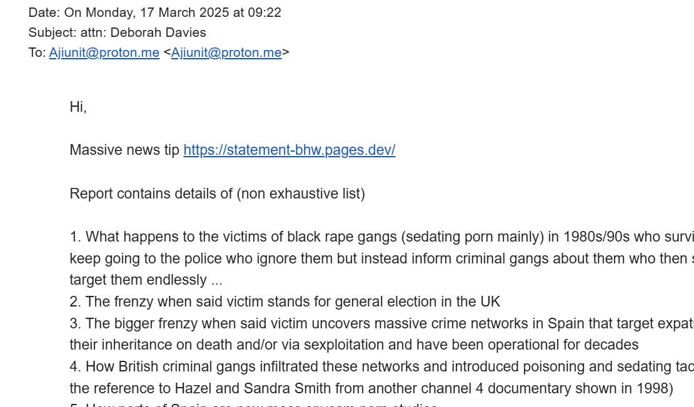

# March 2025

## Researching the book

- It's time to knuckle down and finish editing this statement in preparation for publishing it as a novel.

## Bunny-girl nose-ring woman

- I go to Brent Cross one afternoon for something.
- When I get back to my car, I see a car parked beside, or in front maybe, of mine.
- In the driver's seat is a black woman, and I think I know her.
- She was the accomplice of the man that tried to rob H Samuels in Brent Cross with a fake credit card, my summer job when I was 16, the week before I was targeted by the Jamaican rape-gangs!
- The same man that [bared his teeth at me](../2024/december.md#man-bares-his-teeth-at-me) at the Spa in December 2024.
- She looked exactly like her, just a bit older.
- She has aged well.
- Was she an "introduction agent" for the rape gangs? 
- Thinking back, another man who worked at H Samuels in Brent Cross that summer was at the Camden Palace the very night we meet Winston May and his cohort.
- I believe he was Scottish.

## Reaching out to journalists

- I reach out to multiple journalists with my story; none gets back to me.
- I found out that Deborah Davies made a [documentary film about the black Caribbean rape-gangs in 1998](https://en.wikipedia.org/wiki/List_of_Dispatches_episodes).

!!! quote "Teenage Gang Rape, a film by Deborah Davies"
    12 November Teenage Gang Rape, a documentary about teenage gang rape, finds that most cases of gang rape in UK are committed by black youths; some perpetrators were aged no more than 11; reported by Deborah Davies; on 19 November 1998, there was a protest outside the headquarters of Channel 4 by the National Assembly Against Racism.

- The film sparked a huge row and protest which Diane Abbot and others attended and so the matter was successfully suppressed just like the Pakistani rape-gang phenomena has been.
- Here's the Independent [making light of it all](https://www.independent.co.uk/arts-entertainment/rape-race-and-fragments-of-truth-1186539.html) at the time.
- I thought Deborah might be interested in my story.
- I sent her an email.

- This is the kind of email I have sent to scores of journalists and interested parties.

??? tip "Email to Deborah Davies"
    Hi,

    Massive news tip https://statement-bhw.pages.dev/

    Report contains details of (non exhaustive list) 

    1. What happens to the victims of black rape gangs (sedating porn mainly) in 1980s/90s who survive and keep going to the police who ignore them but instead inform criminal gangs about them who then stalk and target them endlessly ...
    2. The frenzy when said victim stands for general election in the UK
    3. The bigger frenzy when said victim uncovers massive crime networks in Spain that target expats for their inheritance on death and/or via sexploitation and have been operational for decades
    4. How British criminal gangs infiltrated these networks and introduced poisoning and sedating tactics (see the reference to Hazel and Sandra Smith from another channel 4 documentary shown in 1998)
    5. How parts of Spain are now mass spycam porn studios
    6. How these criminal gangs have infiltrated schools and learning establishments to target minors either for preparation for porn etc or worse now.

    Feel free to get in touch anytime. I have just moved back to uk and believe my things have been sprayed in pesticides as I am suffering a sudden onset rheumatoid arthritis of some variety and it is their MO ...

    I'm updating this statement constantly as I remember things. Obviously police are keen to discredit and ignore me for obvious reasons.

    Thanks

    Katharine 

## Let Women Speak Aberdeen

- I travel to [Let Women Speak in Aberdeen](https://www.letwomenspeak.org/event-details/let-women-speak-aberdeen).
- Sandra, one of my [electoral volunteers](../2024/june.md#volunteers-not-what-they-seem) and her sister Susan are there.
- Susan and I spend some time talking over drinks at the party.
- She tells me she would be pearly queen if they still existed as they are her ancestors.
- I have forgotten Susan owns an X account which *significantly* repeated a phrase from my sexual abuse statement as I was reporting it, on December 5th, Winston May's birthday, in 2024.

- If you have forgotten about the "Are you OK" significance, please reread the [chamber music concert](../2023/may.md#chamber-music-concert) section from May 2023.
- Susan tells me she has had kidney failure for over 10 years but her doctors only just told her.
- She also recommends her personal trainer and shows me a photo of him.. and he's trans.

## A man who reminds me of Domingo

- My father and I go to the Red Lion pub in Barnet for a meal.
- It is a Wednesday evening and very quiet.
- We sit at a table for two.
- No-one else is around.
- Suddenly, a man comes and sits at the round table right beside us.
- There are ample empty tables throughout the pub he could have sat at, but he chose to sit next to us.
- He is with a couple of British Muslim men who sit with him.
- The man is a little camp and I assume he's gay.
- He barks questions at the men, relentlessly.
- They answer him assiduously in a semi-scared manner.
- More British Muslim men turn up and sit with them.
- I know they're Muslim by their accents.
- There's probably about five British Muslim men sitting with the interrogating white man while dad and I eat.
- The white man's posture is straight and upright, while the Asian men are a bit cowed; he's above them somehow.
- His questions are banal and meaningless; he's disinterested in the answers. 
- He's already asking the next question before the one before is answered.
- How are your children? What's your wife doing now? Are you still studying? How's so-and-so? Each question delivered like a bullet firing.
- The men are below him in rank, somehow, and they all answer him respectfully, reverently even, cowed.
- I assume this is preliminary chat before he gets to the real business.
- The bar staff address the man by name, which I have forgotten.
- The interrogator reminds me of someone, but I don't place it for a few weeks.
- It's Domingo.
- The whole scene reminded me of the time we went out for dinner at the Japanese restaurant in Dénia in 2014 (before [he came to London](../early-years/2014.md#trip-to-london))and he kind of *performed* for the people sitting around the table, as if he knew them, and they had to respect him, even though his loud behavior was terribly ignorant.
- The way Domingo spoke at that time was as if everyone had no choice but to listen to him, and smile, and agree, and that was exactly what I was seeing at the Red Lion.
- Who was this overbearing, slightly camp 50-year-old white man with a moustache presiding over a table of British Muslim Asian men who may well have been second-generation Pakistanis?
- And why did they sit right beside us instead of in one of the more private areas elsewhere?
- Was he trying to understand what was going on with my continued survival from the Dénia porn-gang's brain-damaging, poisoning, drugging, and sedated rape; knowing full well my history with the Jamaican rape gangs and their connections to Islamicist rape gangs?
- Did his attempt at communication inadvertently reveal a far more sinister connection between the caliphate and gitano mass-manipulation AI tech?
- As we left, another British Muslim man turned up and walked past me, and I possibly recognized him.
- He was either Alkesh from North Finchley who went to prison for theft; or, more likely, he was the father of Winston May's sister's twins; the man that had brought down a bunch of Northern Pakistanis to sedate and rape us back in 1989.

## Moorfields Eye Hospital

- Given I've had a diagnosis of pre-glaucoma from [Rutnin Eye Hospital in Bangkok](../2024/november.md#pre-glaucoma-diagnosis), I need the same in the UK so it's on my NHS record.
- My vision continues to be permanently blurred without reading glasses and I'm worried.
- I've stopped doing headstand in yoga.
- I arrange an appointment at Moorfields in Brent Cross.
- Something weird is going on at the appointment.
- I'm met by a male clinician who talks to me in an extremely strange way, like he's acting.
- He speaks in a low voice, hurriedly, and repeats himself over and over.
- They're only going to do a basic eye exam without the in-depth tests.
- I brought my mum because the letter said they were going to dilate me.
- I tell him I have a pre-glaucoma condition, out of the blue, and worryingly high eye-pressure readings over the last three years only.
- He tells me that it doesn't matter, we're not going to do the in-depth tests, we don't need to dilate my eyes or look closely inside.
- I'm surprised.
- I say I was expecting to have the full investigation like in Bangkok, and the letter told me to expect that.
- He tells me he doesn't understand why the letter says this, it shouldn't have said this, he says something silly about things never getting updated and giggles.
- I'm surprised by all this, more so his behavior.
- It's tiring having to think the worst of everyone all the time, and I don't want to do that, so I assume everything's OK with what they're going to test.
- Another man takes me through the series of tests.
- There's something going on though.
- These two men are a bit snickery and giggly with each other, like they're winking and grinning at me.
- Something's happening that they're not telling me about, and it's important I should know.
- When I get the results, a few weeks later, they say I'm fine and I don't need any further investigation; but they do make a point of saying my angles are indeed narrow.
- It turns out, one of the probably multiple vision issues I have - which I was unaware of until after I remembered the [switcheroo at the conservatory](../2025/october.md#thunderbolt-clarity) - is neurological, brain damage from poisoning, which means I struggle to recognize objects out of context.
- The porn gangs of Denia damaged my brain in this way so that I would believe four or more completely different men were the same one man, which I did.
- Did they know about the switcheroo and how it requires brain and not vision damage?
- Is that why they didn't do the in-depth test as arranged?
- Is that why they were snickering?
- In September 2025, after [another murder-by-poisoning attempt at Lourdes which failed](../2025/july.md#lourdes), my vision was battered yet again.
- I can feel my eye pressure levels are way up and I'm really really concerned about it.
- I go to Vision Express in Tesco's Colney Hatch to ask them to check my pressures; they're up in the 19, 20s.
- I tell the ophthalmologist that my normal pressures are 12/13.
- She looks alarmed.
- I eventually tell her I was poisoned. 
- She advises getting another appointment at Moorfields, and says she is organizing it for me.
- I'm never called for an appointment.

## Conservatory news

- On [Dénia.com](https://www.denia.com/wp-content/uploads/2025/03/firmas-recogidas-para-un-nuevo-conservatorio-de-musica-en-denia-scaled.jpg) there is a report on a petition raised regarding a new building for the conservatory.

- From left-to-right, Joan Carles piano teacher, Jaume Signes trumpet teacher and director of the school, Paqui Fornet piano teacher, and Rosa Vidal vice director.
- All of them will be aware of what happened to me, how I was targeted and why and by whom, and they all played their own little parts in tormenting a student, commendably.
- One wonders how a small town's music school could cope with a major scandal related to grooming and terrorizing students.

