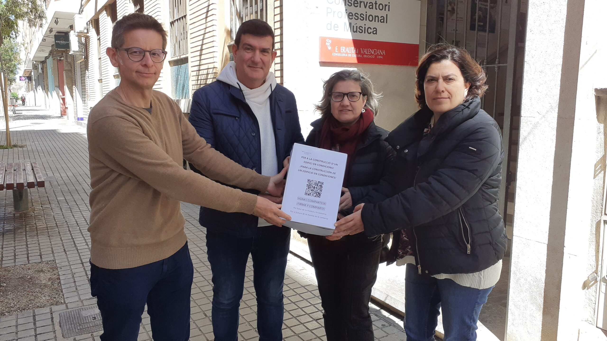
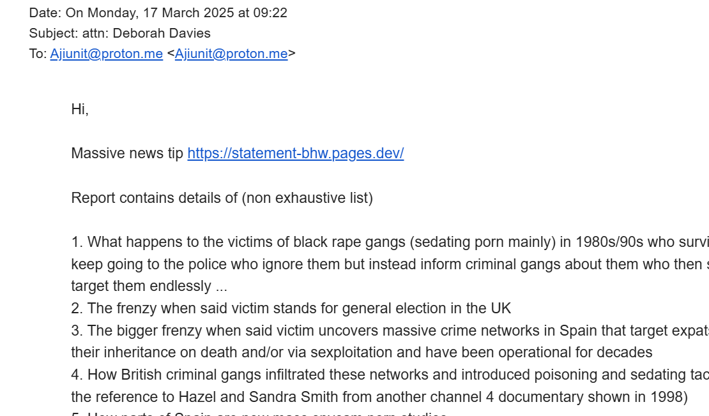
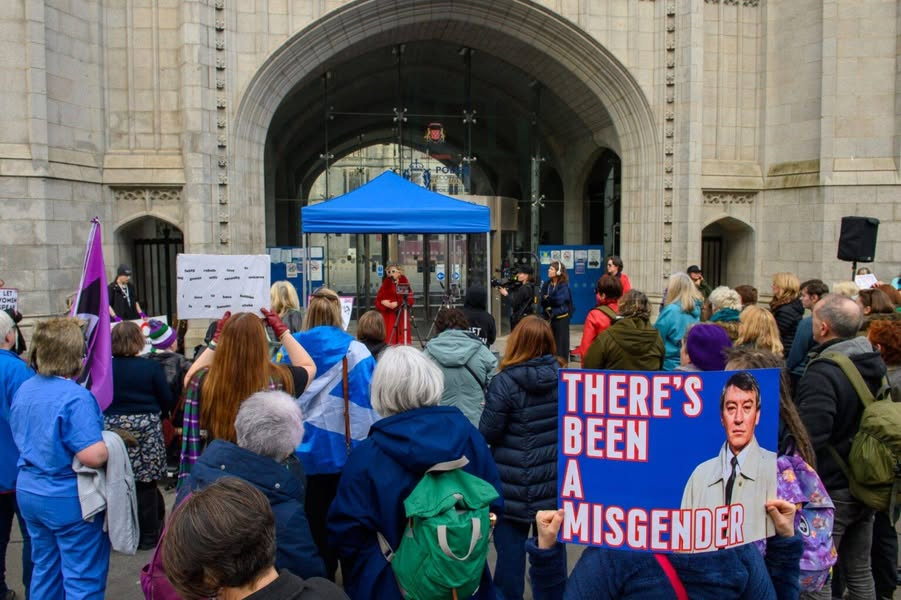
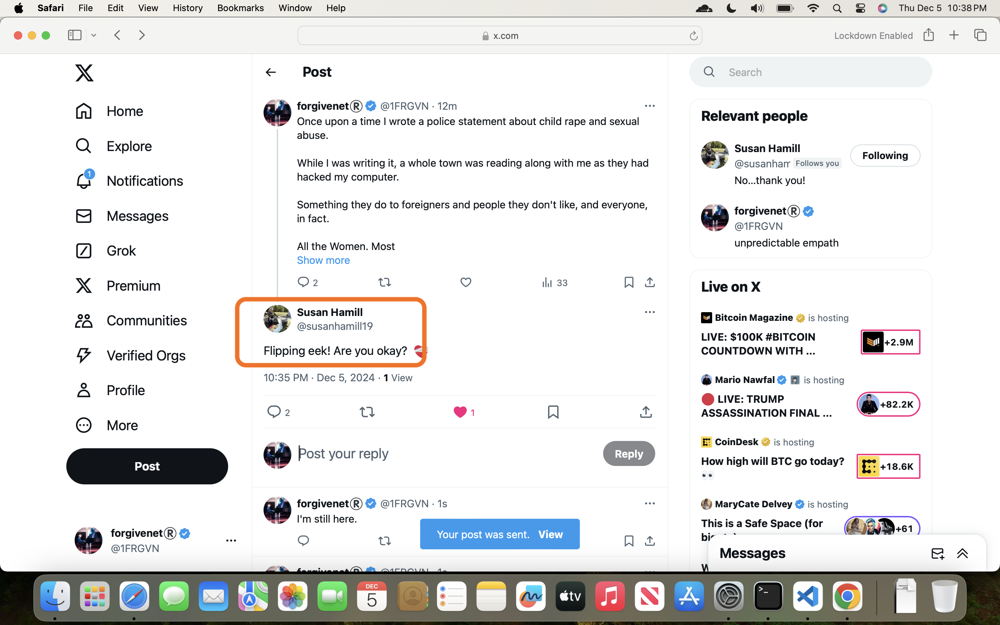
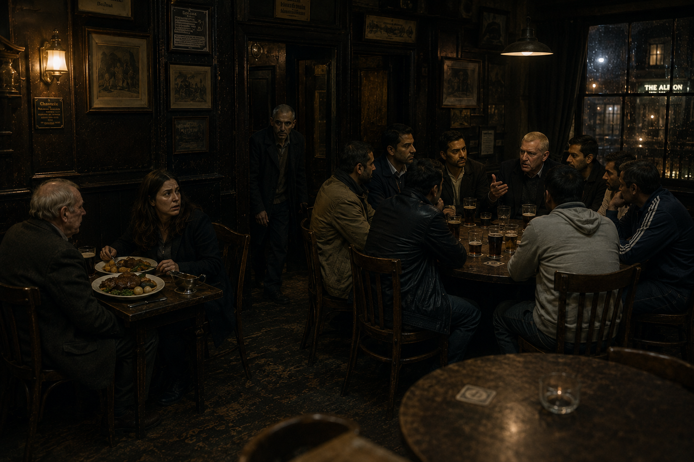
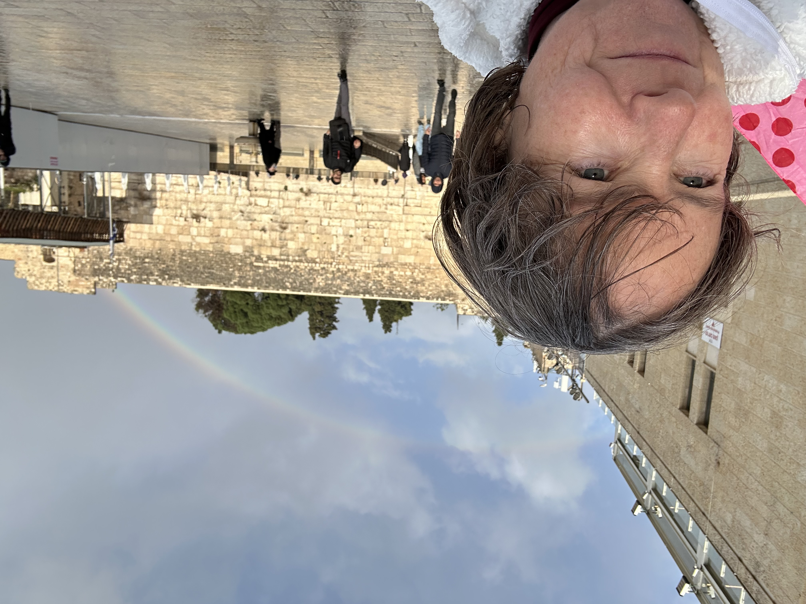

# March 2025

## Researching the book

- *It's time to knuckle down and finish editing this statement in preparation for publishing it as a novel*.
- I wrote the title of this section and the first sentence in March 2025.
- In June 2026 while editing, this statement strikes me as a little strange coming from someone who criminal gangs have been trying to murder, repeatedly, after having sedated-and-raped them endlessly for years, even in her own homes, and by doing so made me famous in criminal porn internationally (probably even on PornHub they were so sure of my early demise)?
- Shouldn't I be a little stressed, not cheerful surely?
- It's two things.
- It's the mind/brain's (a very smart organ) self-protective denial mechanism for continued survival, and Jesus.
- The stress of knowing that the most outrageous crimes are being committed against innocent people, including children and babies, and no-one who could do something about it cares, is enormous.
- The fact that it has been going on so long, so egregiously, and no-one cares did almost break me, but a little gallows-humor has been helpful now and then.
- And that is why I'm thinking about this police statement in novel form, maybe someone might actually read it!
- It has felt to me like the world is going to rape-porn hell, and everyone is making absolutely sure that nothing could possibly stop that happening; no women and children survivors, thus no survivors.
- (A *motherless* porn-hell is what apparently normal men want for a  world. I can't think of anything more self-harming and destructive and utterly, utterly insane.)
- No-one is paying any attention to what I'm saying, all my attempts to get help are ignored, everything that has happened to me and other students, mostly minors, at the conservatory is business as usual... it's just incredible.
- I know that Jesus is shouldering most of the stress and I rely on his strength.
- Without him, I wouldn't have made it.
- So what else can I do but stay cheerful, keep praying, and trust God.

## Bunny-girl nose-ring woman

- I go to Brent Cross one day for something.
- Actually, I'm going back and forward to the Apple Store in Brent Cross to try and fix my hacked devices.
- Apple reformats my phone and laptop to factory settings; but the criminals are in again as soon as I'm back online.
- Must be a chip-level hack, I'm thinking.
- When I get back to my car, I see a car parked beside mine, or in front maybe; close enough to see the driver.
- In the driver's seat is a black woman, and I recognize her.
- She was the accomplice of the man that tried to rob H. Samuels in Brent Cross with a fake credit card in August 1989.
- Working at H. Samuels in Brent Cross was my summer job after GCSE's, when I was 16, and the man came in the week before I was targeted by the Jamaican rape-gangs directly at the Camden Palace, although they'd had their operatives out grooming me for a few weeks, months, maybe years already.
- There had been something wrong with the card, the phone rang, and I didn't know what was going on, and the woman - of Jamaican heritage, she told us, and I think whose name was Denise - stepped in to sort it out, picking up the phone, and the man grabbed the card off the counter (where I'd left it) and ran out.
- I was working fulltime at H. Samuels throughout that time (£99 a week pay I bought £79 trainers with that last week) until the week Winston May raped me at his house, then I left my job.
- Did they time the attack to commence with the day I left my job?
- I remember Winston May was keen for me to take him to H. Samuels; he kept saying he'd go in there with me to get my week-in-hand (which they didn't pay me for weeks on end).
- I was due to start A Levels very soon: Maths, English, Music, and CS.
- Marvelously, the man that came in with the stolen credit card, and made a beeline for me to serve him, was the same man that [bared his teeth at me](january.md#a-man-i-recognize-bares-his-teeth-at-me) at the Spa in Koh Samui in January 2025 the day I was leaving.
- The same [really nice geezer](../2001-to-2010/2010.md#my-brother-loses-his-mind-in-thailand) that got my brother to do terrible things in Samui in 2010; things that would justify, for my brother, throwing me to the lions.
- He can confirm, of course, they both can.
- The woman in the car at Brent Cross looked exactly like the black woman Denise who worked with me at H. Samuels - she was on the gold section - just a bit older.
- She has aged well.
- Are they testing my memory recall, or offering her up?
- Was she an "introduction agent" for the rape gangs back in 1989? 
- Was H. Samuel serving as an "introduction agent" for girls coming to work Saturday or summer jobs, where Denise and the gang could do whatever they do; drug maybe, gypsy style?
- Why did none of my other friends get a job there; they came with me to fill out the application form?
- Did someone suggest I go work there, or was it just coincidence that I ended up working there?
- Thinking back, another man who worked with me at H. Samuels in Brent Cross that summer was at the Camden Palace *the very night* we meet Winston May and his cohort!
- I believe he was Scottish. Could he have been called Fraser?
- I believe the whole Winston May rape-gang-spectacular had been planned for me months in advance of me even meeting Winston May by a massive industrial pedophile-porn empire operating out of North London and having an extreme-criminal-porn studio out in the Marina Alta region of the Community of Valencia in Spain, and they had a very well-oiled recruitment machine going on.

## Conservatory news

- On [Dénia.com](https://www.denia.com/wp-content/uploads/2025/03/firmas-recogidas-para-un-nuevo-conservatorio-de-musica-en-denia-scaled.jpg) there is a report on a petition raised regarding a new building for the conservatory.

- From left-to-right, Joan Carles piano teacher, Jaume Signes trumpet teacher and director of the school, Paqui Fornet piano teacher, and Rosa Vidal vice director who nearly bowed in reverence to *Vidal Sastre* (whichever of [the rape-pornographers was playing the role of trumpet-teacher at that time](../../crimes/protagonists/vidal-sastre.md)) when she was tasked with [coming into the chamber music classes with Ana Requena](../2023/february.md#ana-the-violin-teacher) to create love-triangle intrigue, anxiety, and, later that evening, sedated-rape-terror.
- I'm certain Paqui was at my house [when they all suffocated me sedated](../2024/march/13-end.md#the-pillow-game) and that's why [she popped up on fake accounts on X just after](../../crimes/protagonists/domingo-et-al.md#paqui-fornet-pastor)... and then again in September, to make sure I didn't return to my piano studies.
- She had to be there, and she would have definitely enjoyed it - didn't she delightedly tell everyone about the experience afterwards?
- The reason I can say that with such authority is because Paqui Fornet would have been exceptionally furious with me for totally ignoring [her terror spectacular that must have taken months to set up](../2024/march/1-12.md#the-piano-concert) and coming into practice the piano the following morning.
- My fearlessness forced them into officially murderous activity instead of their usual cowardly intrigues+drugging.
- All of them were fully aware of what was happening to me, how I was targeted and why and by whom, and they all played their own parts in tormenting a student destined for the porn-slab commendably, as if they'd done it hundreds of times before.
- In fact, these people are knowingly running a pedophile porn studio direct from their classrooms; something that requires them to drug students, mostly minors, with aphrodisiac-type substances amongst other unbelievable acts of violence and sexual assault, all filmed for the historical record.
- They look so normal don't they.

## Reaching out to journalists

- I reach out to multiple journalists with my story; none gets back to me.
- I'm also trying to find the documentary starring Hazel and Sandra Smith that described the elderly people they had drugged and poisoned and got to change their wills, and how they were arrested and charged by the British police (the Met I think), and then - somewhat inexplicably - they were found not guilty at crown court (The Old Bailey), all happening in the mid-90s sometime, and then off they went to safely murder probably close to a thousand vulnerable ex-pats and others living in Spain over nearly thirty years, hundreds is a low estimate in my view.
- I mean, these people ran suicide-manipulation social-media apps targeting anyone they liked, for decades, for fun?!
- So I'm specifically searching for records of the Channel 4 documentary I had seen in the 90s - I was pretty sure it was shown on a series like Dispatches or similar - but it's like all reference to these two has been totally wiped off the face of the earth.
- During my search, however, I come across a [documentary film about the black Caribbean rape-gangs in 1998](https://en.wikipedia.org/wiki/List_of_Dispatches_episodes) made by Deborah Davies and the furore it caused at the time.

!!! quote "Teenage Gang Rape, a film by Deborah Davies"
    12 November Teenage Gang Rape, a documentary about teenage gang rape, finds that most cases of gang rape in UK are committed by black youths; some perpetrators were aged no more than 11; reported by Deborah Davies; on 19 November 1998, there was a protest outside the headquarters of Channel 4 by the National Assembly Against Racism.

- The film sparked a huge row and protest which Diane Abbot and others attended and so the matter was successfully suppressed just like the Pakistani rape-gang phenomena was/is.
- Here's the Independent [making light of it all](https://www.independent.co.uk/arts-entertainment/rape-race-and-fragments-of-truth-1186539.html) at the time.
- I thought Deborah might be interested in my story.
- I sent her an email.

- This is the kind of email I have sent to scores of journalists over the last few years about my experiences and this police statement, including:
    - Journalists at The Times, one of whom (Sanchez Manning) even reached out briefly in person, then never got back to me after speaking to her editor.
    - Journalists at El Pais (a woman called Lola and Isabel Valdés).
    - Journalists at GB News (Charlie Peters).
    - All the news desks that received a copy of [the handwritten letters and supplementary page](../2024/august.md#the-handwritten-letters) (New York Times, Washington Post, Le Monde, El Pais, The Telegraph, The Irish Times, and many many more).
    - Hundreds, probably. 
    - They'll be popping up all over the place at some point...

??? tip "Email to Deborah Davies"
    Hi,

    Massive news tip https://statement-bhw.pages.dev/

    Report contains details of (non exhaustive list) 

    1. What happens to the victims of black rape gangs (sedating porn mainly) in 1980s/90s who survive and keep going to the police who ignore them but instead inform criminal gangs about them who then stalk and target them endlessly ...
    2. The frenzy when said victim stands for general election in the UK
    3. The bigger frenzy when said victim uncovers massive crime networks in Spain that target expats for their inheritance on death and/or via sexploitation and have been operational for decades
    4. How British criminal gangs infiltrated these networks and introduced poisoning and sedating tactics (see the reference to Hazel and Sandra Smith from another channel 4 documentary shown in 1998)
    5. How parts of Spain are now mass spycam porn studios
    6. How these criminal gangs have infiltrated schools and learning establishments to target minors either for preparation for porn etc or worse now.

    Feel free to get in touch anytime. I have just moved back to uk and believe my things have been sprayed in pesticides as I am suffering a sudden onset rheumatoid arthritis of some variety and it is their MO ...

    I'm updating this statement constantly as I remember things. Obviously police are keen to discredit and ignore me for obvious reasons.

    Thanks

    Katharine 

- It amazes me when I read these things back... and it feels something like serendipitous that I pick it up again today.
- Imagine totally ignoring hundreds of messages just like this one containing an investigator's goldmine... it's extraordinary!
- I had been thinking that Hazel and co in Las Marinas could be behind the Epstein child trafficking, but it just occurred to me that there *is* an even stronger link to all this silence to the lack of action (silence) on Epstein's client-criminal list, isn't there.
- Remember: those boys have all just gotten away, en masse, with murdering children for their boners!
- Silence breeds silence.
- Just extraordinary.

## Let Women Speak Aberdeen

- I travel to [Let Women Speak in Aberdeen](https://www.letwomenspeak.org/event-details/let-women-speak-aberdeen) by train and I stay up there for the weekend.

- There are agents on the train up; one of whom sits beside me and looks surprisingly like Hazel Smith.
- Sandra, one of my [electoral volunteers](../2024/june.md#volunteers-not-what-they-seem) and her sister Susan Hamill are there.
- After the event, they pop into where I'm staying, and (after some looks back-and-forth between them) Susan uses my toilet.
- Susan and I spend some time talking over drinks at the party later that evening.
- She tells me she would be a pearly queen if they still existed as they are her ancestors.
- I'm quite impressed.
- I have forgotten Susan owns an X account which *significantly* repeated a phrase from my [2015 North London rape-gang sexual abuse statement](../2011-to-2020/2015.md#statement-to-the-metropolitan-police) as I was tweeting about it, on December 5th, Winston May's birthday, in 2024, when I was being battered endlessly online by criminals communicating with law enforcement.

- I love my response.
- If you have forgotten about the "Are you OK" significance, please reread the [chamber music concert](../2023/may.md#chamber-music-concert) section from May 2023, and multiple other terror vignettes I describe that come directly from that police statement and which were performed by the people of Dénia in order to terrify me when I didn't leave my studies at the conservatory after the last [chamber music/switcheroo-porn class with the trumpet-teacher gang on the 12th June 2023](../2023/june.md#monday-12th-june-2023) - my funeral, apparently.
- Susan tells me she has had kidney failure for over 10 years but her doctors only just told her - I believe this is a direct message to me about my poisoning-injured kidney, they got [quite vindictive about my poisoning injuries](april.md#goaded-online) for a while.
- She also recommends me her personal trainer and shows me a photo of him.. she takes ages finding a photo of him on her WhatsApp... and he's obviously trans.
- Someone is telling her what to say. Who?
- On the train back down to London, I'm high again, notably. 
- I start to create the pictures for this book with ChatGPT, notably the front pages, and I create an X account for the star of the show, the little frog I'm calling *Forg*.

- I can't find this account on X now. 
- *Frog* was a massive meme throughout the terror I endured in my little apartment in Las Marinas after I gave the trumpet teacher [a little wooden frog on 12th June 2023](../2023/june.md#at-the-conservatory), that I had bought in Thailand at Christmas, as a parting gift and to thank him for the classes.
- I was blocked pretty much immediately from using the `@KingForg` X account, as in I lost access to it very early on after posting just a few things, he'd been to Aberdeen and London, silly things like that..
- Somehow, someone else has taken ownership of the profile name now!
- My guess is they blocked the account immediately because criminal gangs own X and I'd be vulnerable again.
- In any event, I'm high in a creative and hallucinatory way and I do wonder what, if anything, may have been added to my bathroom products to cause this.
- Forg becomes a whole series of photos and posts, and I eventually build a [DESO](april.md#deso) account for him.
- My posts are nearly always biblical as I pull a passage from the bible at random and create a story around the little Forg that went wrong.

## Taking dad out

- wip

## A man who reminds me of Domingo

- My father and I go to the Red Lion pub in Barnet for a meal.
- It's one of his favorite places to eat and he asks me to take him there for the carvery dinner quite regularly.
- It is a Wednesday evening and extremely quiet.
- We sit at a table for two.
- No-one else is around.
- Suddenly, a man comes and sits at the big round table right beside us.
- There are ample empty tables throughout the pub he could have sat at, but he chose to sit next to us.
- He is with a couple of British Muslim men who sit with him.

- The man is loud, and a little camp, and I assume he's gay.
- He barks questions at the men, relentlessly.
- They answer him assiduously in a semi-scared manner.
- More British Muslim men turn up and sit with them.
- I know they're Muslim by their accents.
- It seems like they were called out in a hurry.
- There's probably about five or six British Muslim men sitting with the interrogating white man while dad and I eat.
- The white man's posture is straight and upright, while the Asian men are a bit cowed; he's above them somehow.
- His questions are banal and meaningless; he's disinterested in the answers. 
- He's already asking the next question before the one before is answered.
- How are your children? What's your wife doing now? Are you still studying? How's so-and-so? Each question delivered like a fired-bullet.
- I assume this is preliminary chat before he gets to the real business.
- The bar staff address the man by name, which I have forgotten.
- The interrogator reminds me of someone, but I don't place it for a few weeks...
- Then it comes.
- It's Domingo.
- The whole scene reminded me of the time Domingo and I went out for dinner at the Japanese restaurant in Dénia in 2014 (just before [he came to London](../2011-to-2020/2014.md#trip-to-london) and my dad seemed to, gulp, recognize him) and he kind of *performed* for the people sitting around the table, as if he knew them, and they had to respect him, even though his loud behavior was terribly ignorant.
- The way Domingo spoke at that time was as if everyone had no choice but to listen to him, and smile, and agree, and that was exactly what I was seeing at the Red Lion.
- Who was this overbearing, slightly camp 50-year-old white man with a moustache presiding over a table of British Muslim Asian men who may well have been second-generation Pakistanis?
- And why did they sit right beside us instead of in one of the more private areas elsewhere?
- Was the man trying to communicate with me, to understand what was going on with my continued survival from the Dénia porn-gang's relentless brain-damaging, poisoning, drugging, and sedated rape; knowing full well my early rape-porn history with the Jamaican rape gangs and their connections to Islamicist rape gangs?
- Did his strange attempt at communication inadvertently reveal a far more sinister connection between the caliphate and gitano mass-manipulation AI tech?
- Did my dad know him?
- When I went to the toilet and left my dad alone with them, did they talk?
- As we left, another British Muslim man turned up and walked past me, and I think I recognized him.
- He was either Alkesh from North Finchley who went to prison for theft who was at [the party in 1991](../pre-2001/1991.md#a-party-in-hornsey); or he could have also been the father of Winston May's sister's twins - the man that had brought down a bunch of Northern Pakistanis to London to sedate and rape us back in 1989, that Willow does not remember but I do.
- He looked unwell.
- In an earlier draft of this section I had wondered if the man was trying to do deals with whoever he thought was interested at the time, just like they seemed to be doing constantly online.
- I deleted that comment for some reason but I think the question still stands, and perhaps more firmly today.
- Was he the brother of [the woman who sits right next to us again, in a similarly odd manner in an empty pub, that will tell my dad to not go to Lourdes with me in the summertime](../2025/july.md#the-benijembla-woman) so their Spanish friends can murder me in peace?

## Israel

- The next day, I believe, I travel to Israel.
- I'm visiting to assist my trauma therapy teacher, Stephen Terrell, who is giving module two of the Transforming Touch course.
- When I saw him in January for training in Dublin, I asked him if he needed an assistant for Israel.
- I wasn't going to include any of this because I didn't think it relevant to the main story, but perhaps it is...
- Anyway, he said yes.
- So, delighted, I immediately made my travel arrangements.
- I hadn't visited Israel since 2012 when [I fell in love with the country and its people](../2011-to-2020/2012.md#tiferet).
- It's Purim.
- At the last minute, Steve has to cancel his course because of health issues.
- I'm unable to cancel my travel plans and it's not clear when he's rescheduling, so I go on my own and have a blissful time wandering around Jerusalem and taking it all in; visiting The Wall every day and praying.
- I had a lot to pray about.
- And, I have never felt safer in my whole life than I did/do in Jerusalem and in Israel which you might find surprising but there it is.
- I was not constantly stalked or threatened online or in person, which is my experience everywhere else in the world.
- I meet some of the people that would have been assisting, or have taken Steve's courses previously in the US, and we do some Transforming Touch trauma therapy shares... this might be when I first notice my eye-twitching and I remember things about that from the past...
- Anyway, the reason I'm adding this now is because of the Course in Miracles lesson I was studying that week which was awesome.
- The lesson was [Lesson 160: I am at home. Fear is the stranger here](https://en.wikisource.org/wiki/A_Course_in_Miracles/Workbook_for_Students/I_am_at_home._Fear_is_the_stranger_here).

### I realize, again, all my stuff is toxic

- I'd been back in UK with my stuff for about three weeks before I traveled to Israel.
- I'd started getting pains all over my body; in the neck and shoulders, back, hips, everywhere during this time.
- I was still high on something, confused, so I didn't really notice.
- When I got to Israel, the pains disappeared and I realized, with a start, that all my stuff was poisonous, but particularly my duvet.
- And the weird thing is I should have known that already from [when I got back to my flat in October 2024 after Fatima](../2024/november.md#another-attempt-on-my-life) and numerous other events.
- It's difficult to understand why I would have stopped "knowing" what was really obvious other than that Paul was babbling on about everything being normal, and mum and dad were telling me I was hysterical...
- More significant is when all the police forces and security services under the sun ignore you or dismiss you when you tell them you're being poisoned, I guess.
- The other thing I noticed massively in Israel was that my shoes and hat were so toxic they were causing me headaches and bone ache.
- Unfortunately, I was not able to change my shoes (I guess I could have, my decision making at that time was really rubbish... drugs I’m sure of it, I just couldn't think straight at all) so I continued wearing them even though every time I put them on I felt aching deep in the bones of my feet and lower shins!
- Anyway.
- I got clear enough to “write” my mother an email of instructions to urgently get the duvet off my bed, put it in a plastic bag, and ask Robert to put it in the attic.
- She said she would.
- The instructions were unambiguous.
- It was important we kept the duvet.
- It was evidence and I told her that.
- When I got home a week later, I asked her if she had put the toxic duvet in the attic.
- She said no, she'd thrown it away.
- I thought this was very strange and I'm still wondering why she wouldn't have followed my instructions and done something orthogonal instead.
- Did my brother insist she throw it away?
- Was he getting conflicting instructions which he was unable to not follow?

## Dom Halloran

- I contact Channel 4 about the documentary starring Sandra & Hazel Smith.
- The archive manager is called: *Dom Halloran*.
- They can't help me.
- Here's [my original email](../../content/documents/emails/dom-halloran-2.png) and [the reply](../../content/documents/emails/dom-halloran-1.png). 
- The name immediately reminded me of Domingo, and also the name of the psychic caretaker in the film, The Shining.
- I'm so horribly hacked, it felt like they tailored this message just for me in an "up yours" kind of way, like they've been doing with everything else.
- Or perhaps it was a most marvelous coincidence.
- This is how I felt on 15th March 2025.
- However, while editing this section in March 2026, I realize that my concern about the name *Dom Halloran* was somewhat over the top.
- And I also realize this is more proof that prior to [remembering the different switcheroo-porn trumpet teachers](../2025/october.md#thunderbolt-clarity) in October 2025, I was perma-high on something; perhaps not to the extent I was while living in Spain but nonetheless high, and with a very suggestible perception.
- March 2025 was a period when I was in a state of extreme nervous tension, I had only just got my stuff back from Spain, and realized that everything was toxic and I did not know what to do about that.
- No-one was interested when I reported it.
- The baseball cap I wore for an afternoon around the time I wrote the email gave me another headache like no other, and the trainers I was wearing made the bones in my feet and legs ache badly.
- I had realized my duvet was extremely toxic and asked my mother to put it in the attic for the police.
- She ended up throwing it away.
- A few weeks later, on advice, I start washing all the clothes I keep 10 times to get the toxicity out.
- I throw out everything I can't wash, and some of my shoes never lose the toxicity no matter how much I wash them so I end up throwing out all my shoes.

## Moorfields Eye Hospital

- Given I've had a diagnosis of pre-glaucoma from [Rutnin Eye Hospital in Bangkok](../2024/november.md#pre-glaucoma-diagnosis), I need the same in the UK so it's on my NHS record.
- My vision continues to be permanently blurred without reading glasses and I'm worried.
- I've stopped doing headstand in yoga.
- I arrange an appointment at Moorfields in Brent Cross.
- Something weird is going on at the appointment.
- I'm met by a male clinician who talks to me in an extremely strange way, like he's acting.
- He speaks in a low voice, hurriedly, and repeats himself over and over.
- They're only going to do a basic eye exam without the in-depth tests.
- I brought my mum because the letter said they were going to dilate me.
- I tell him I have a pre-glaucoma condition, out of the blue, and worryingly high eye-pressure readings over the last three years only.
- He tells me that it doesn't matter, we're not going to do the in-depth tests, we don't need to dilate my eyes or look closely inside.
- I'm surprised.
- I say I was expecting to have the full investigation like in Bangkok, and the letter told me to expect that.
- He tells me he doesn't understand why the letter says this, it shouldn't have said this, he says something silly about things never getting updated and giggles.
- I'm surprised by all this, more so his behavior.
- It's tiring having to think the worst of everyone all the time, and I don't want to do that, so I assume everything's OK with what they're going to test.
- Another man takes me through the series of tests.
- There's something going on though.
- These two men are a bit snickery and giggly with each other, like they're winking and grinning at me.
- Something's happening that they're not telling me about, and it's important I should know.
- When I get the results, a few weeks later, they say I'm fine and I don't need any further investigation; but they do make a point of saying my angles are indeed narrow.
- It turns out, one of the probably multiple vision issues I have - which I was unaware of until after I remembered the [switcheroo at the conservatory](../2025/october.md#thunderbolt-clarity) - is neurological, brain damage from poisoning, which means I struggle to recognize objects out of context.
- The porn gangs of Denia damaged my brain in this way so that I would believe four or more completely different men were the same one man, which I did.
- Did they know about the switcheroo and how it requires brain and not vision damage?
- Is that why they didn't do the in-depth test as arranged?
- Is that why they were snickering?
- In September 2025, after [another murder-by-poisoning attempt at Lourdes which failed](../2025/july.md#lourdes), my vision was battered yet again.
- I can feel my eye pressure levels are way up and I'm really really concerned about it.
- I go to Vision Express in Tesco's Colney Hatch to ask them to check my pressures; they're up in the 19, 20s.
- I tell the ophthalmologist that my normal pressures are 12/13.
- She looks alarmed.
- I eventually tell her I was poisoned. 
- She advises getting another appointment at Moorfields, and says she is organizing it for me.
- I'm never called for an appointment.
