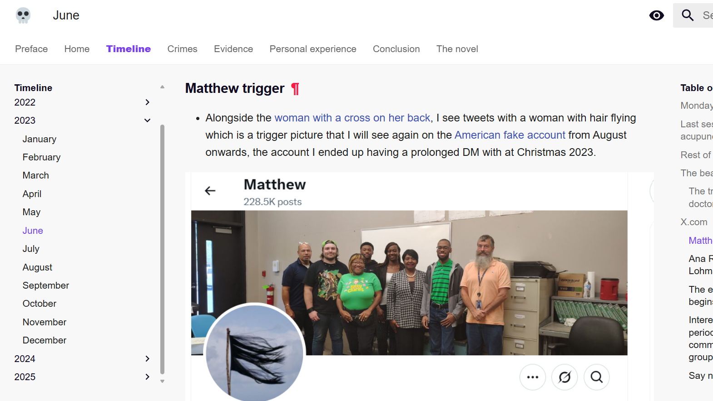
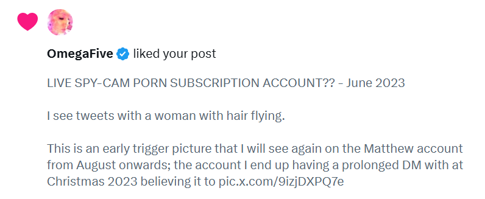
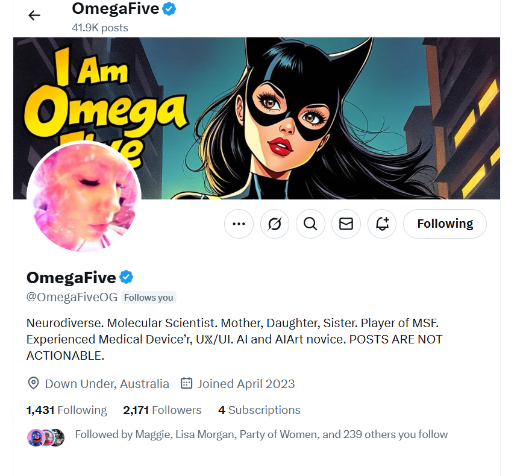
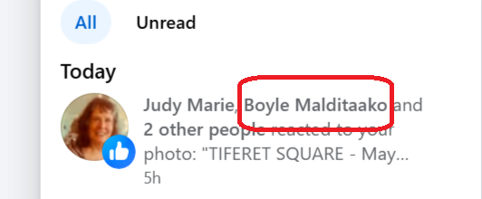

# May 2025

## Response to new content

- As I undertake a first laborious and extremely triggering copy edit, I post new content describing what appear to be bona fide stalker accounts, possibly having live spy-cam-porn subscriptions, such as the Matthew account.
- It appears that a trigger image - the hair flowing in the wind - was set up early on for me to recognize this account as being significant.

- A fake account I've seen before in similar circumstances likes the tweet. 

- Note the message about "POSTS ARE NOT ACTIONABLE".

!!! danger "Please note"
    - I post about 1% of this kind of interaction I receive on a daily basis.

## Constant threats online and in-person

### Are you Welsh?

- I send some content to an interested party, someone who works in education for the Generalitat Valenciana.
- I start the email with a greeting in Welsh. I have never ever done that before in my life.
- I do that because it's the day after I return from Ireland and I stayed in Wales one night and that's how they say good morning, bore dar.
- Later that day, I take my dad out.
- As we arrive at the library, we see an extremely weird guy sitting outside. He has an orange old bashed-up car with him.
- The minute I open the door of my car, he jumps up and starts saying, "Oh, are you Welsh, are you Welsh".
- I do not feel safe in North London.

### Dancing man

- I pull into my road in the car late one evening.
- As I'm driving up, a man suddenly jumps into the middle of the road.
- He is wearing black ear phones like the ones I used to have and he is dancing [exactly like I did around my room sometimes](../2023/august.md#fighting-back) when I was being drugged and hacked in Spain and France.
- He grins at me wildly and doesn't move so I have to slow down.
- He side steps away.
- He lives at the bottom of the road (or did at the time), I saw him again being a normal person.
- Is he one of those with a porn-subscription that can be relied upon?

## Spy-cams in London N2 also??

- I arrive home from a trip to Israel.
- I'm tired and I sleep well.
- In the morning, I notice a massive boil in my groin which has a lot of puss. Obviously, when I notice it I am in a very private state of undress.
- I open my laptop. On my Facebook account, an account with an extremely specific name has liked my post from the night before.

- "Bad boil a-knock-out"?
- Does this mean my home in London N2 has somehow also been fitted with spy-cams? If so, since when and by whom?
- Perhaps in [November 2024](../2024/november.md#spy-cams-at-my-london-address).
- A fake account follows me on my `@jackchardwood` account. The name is interesting and sounds a bit like "camera on gawk zany".

- Bear in mind I have no activity on this account at all anymore and the last interaction on here was over 40 days ago.

## Meeting Chris & Desa before I fly to Israel

- I meet old friends Chris Ludwick and Desa.
- I'm flying to Israel the following morning to assist Steve on a TT module 2 in Jerusalem.
- Desa repeatedly says to me, "you saved my life" regarding a weekend up North in 2019.
- I ask her why.
- She doesn't explain.

## A woman in Israel reacts normally to my story

- I attend a TT course in Israel where I'm assisting.
- At one point, a woman and I are chatting in the kitchen, it's a break time, and she just so happens to ask me about my life and how I am, what's going on.
- And I tell her.
- I've no reason to lie.
- She's horrified.
- In fact, I really upset her with my story and she has to take time out.
- I'm amazed because for the first time someone has reacted normally to what's going on for me.
- I'm normally surrounded by totally unhelpful people, all the time, and it is somewhat inexplicable to me.
- Her reaction is so powerful, it prompts me to write again to the police and the Baroness when I'm on detox in a few weeks time in Devon.
