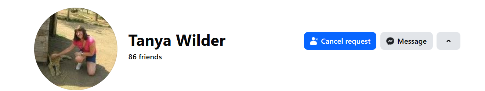

# May 2025

## Transforming Touch intensive in Dublin

- I get the car ferry over to Dublin from Liverpool and stay from 30th April to 5th May.
- On the way back, I stay on Anglesey in Wales for one night and learn, for the first time in my life, how to say good morning in Welsh: *bore da*.
- The intensive is two days (Saturday and Sunday) at the Avila centre and I stay at the Anantara for a few extra days because I want to relax away from the toxicity at home, and I would like to visit Newgrange with the car.
- I'm high throughout this time, obsessing about the trumpet teacher, not feeling particularly relaxed, and feeling exposed.
- I feel like there's people all around me in the hotel rooms beside mine who know me and are up to something. I can feel it very strongly.
- Since I now know that this is *exactly* what they do, and have been doing very openly since after July 2025's poisoning attempt, I can say with certainty that there were mousse agents all over me like scabies at the Anantara.
- At the time, I assume in my ignorance that it is criminal gangs.
- I'm meant to.

### Tanya Wilder is in reception 

- One morning, I see Tanya Wilder in reception.
- She is sitting with a bunch of other Americans as if part of a tour group.
- She looks at me intently but does not say anything.
- I note this.
- She does it in exactly the same way the [Naama Levy lookalike looked at me in Bangkok in November 2024](../2024/november.md#a-woman-who-looks-like-naama-levy-is-in-reception), as if they've both attended the same formal training course on this.
- Me and mum met Tanya on the [eclipse tour of 2006 in Egypt](../2001-to-2010/2006.md#total-eclipse-of-the-sun) and I told mum I had seen her in Dublin when I got back to London.
- Tanya and I had gone to dinner together in Cairo and shared personal stories on sedated rape; and her experience, she said, had been on a dinner date in Italy.
- I believe that this is where I was first signed up without my knowledge or consent for the CIA's intuitive program whose main goal was to keep an eye on the criminal gangs of Dénia, some of whom have been a major thorn in their side.
- Mum still has Tanya on her Facebook. Here she is: 

- I'm interested that Tanya's name is Tanya; rather like Tonia. Coincidence? Or have the Americans been after him all along too? If so, why. So interesting. Rich Freed is involved.
- At the Anantara, I wonder if her popping up like this is a sign from the FBI to tell me they're working on my case, but it's so top secret they can't speak to me directly.
- Tanya had told us she lived in a town (did she say Langley, I don't think it was that but it was somewhere in Virginia) which I immediately linked to the FBI. 
- I think I even told my mother this.
- I believe now that the first surreptitious egg-extraction surgery took place at the Anantara.

!!! tip "Prepping putting the blame on Israel"
    - It never really made any sense to me why she would be there - I don't think like a spy - until I found out I had been operated on while sedated a bunch of times.
    - Tanya was here staring at me to add to the intrigue and conspiracy, just in case it went tits up for them, as it always does, and they could blame Israel, again.
    - When Tanya (or whatever your name is) finds out... I expect she'll do the right thing, like many millions more will too.

    

    - It wasn't just a warning Tone was it; it was a vision.

### 40th birthday party

- In the spa one day I hear a lot of women speaking Hebrew.
- They are in Dublin celebrating a 40th birthday party.
- I'm amazed because it's so rare to hear Hebrew spoken in Ireland.
- I don't think I ever heard it before outside of my Hebrew lesson at Queen's in Belfast in 2020 before Covid hit.
- I ask them if they're from Israel, they confirm, and I tell them how nice it is to hear Hebrew in Ireland.
- I had to wonder about these ladies too.
- This was early days in my *how-spies-operate* intensive training and I was being drugged continuously still so I really had no idea what was going on.
- I felt extremely comforted seeing these women at the hotel, however, and it made me feel much safer against the unease with my neighbors on the 8th floor.
- Also, in August 2026, I realize that all these spy games means there is photographic and video evidence of *all* evildoing - we'll see Tanya, and the medical team, and the birthday party - and this is going to be true of every evil mousse-machination I've detailed in this police statement.

### Seagulls nesting

- From my room, I can look out onto the roof of another building.
- Seagulls have made their nests on the air outlets on the roof.
- The female seagulls are sitting snugly in their giant nests, while the male is standing guard, or off to get dinner.
- I find this marvelous, wonderful.
- I'm enthralled by them.

### Can I leave my stuff in the centre

- I remember asking Yvonne on the first day of the intensive if I could leave my stuff overnight in the Avila centre, and everyone looking at each other - she's looking at Steve to get confirmation - and then saying no.
- I said, *oh has there been some theft here*, and they all looked at each other intently again, Yvonne and Steve, one of the others, and she said quietly, *yes*.

### Yvonne tells me Steve is giving her a hard time

- Yvonne sits next to me in the circle.
- At some point she complains about Steve giving her a hard time.
- I can see that he is doing this, but I'm not sure what's going on with them.
- I don't know how to help her, so I say nothing.

### Stopping the intolerable political diatribes at break times

- Normally on these courses, it's apparent that the majority of attendees are politically left-leaning.
- Fine, no issue, except sometimes at break times you have to sit and listen to them going on about the poor immigrants, or whatever.
- And I had just been up to Runcorn with Reform and at least half the people on the bus were immigrants, or the descendants of immigrants, including me!
- So here we are at tea time, and it's the poor immigrants again, and I'd just had enough of hearing about it so I said something.
- And I was shaking (cos you're not allowed to have a different view from them, or you can lose your job, get attacked, etc.) and my voice was quivering, but I said something like: *oh you mean the thousands of fit young men who hate women coming into the UK every day?*
- And I could see faces contorting as I mentioned the obliteration of women's rights by the left, as if they agreed with me but it was not safe for them to support me or say anything.
- And there was some discussion, and politics was never spoke of again.
- Although, incidentally, in April 2026 in Dublin on the second course where they were all agents and had started to bully me (*roasting* they called it online - not a word I'd ever use), politics came up quite a lot at tea times.
- One woman even said, forcefully, that she wanted to murder Trump - and I was thinking, that's a bit strong.. I was shocked actually.. even more so because no-one else at the table seemed to disagree with her.
- So I said something like, *wow, people are really divided contentiously aren't they* and went for a walk.
- Then, the very next day, someone actually did try to kill him!

### God save the King!

- During the course, I start thinking of King Charles, over and over.
- He has become a theme in my mind.
- It is so strange, there's no reason for it, and I don't understand it.
- It's not like some of the other curious ideas I have at all. 
- I feel like it's a foreign idea, so in my attempts to figure it out I wonder if I'm picking it up from someone else.
- I decide that my partner who has a practice in Harley Street must treat the royals - it wouldn't be unusual for that to happen - and I leave it there.
- Nevertheless, I kept having these bizarre thoughts about the King throughout the course, but there was always something much stronger telling me just to note it and not to worry about it. 
- And the ideas stopped once the course had ended.
- Interestingly, I have always had rather good feelings about the King, warm feelings, and when this happened strongly once again - in Dorset in early 2026 - I thought he actually might be coming to visit and I was quite excited about that.
- It all clicked into place in [Bali in July 2026](../2026/july.md#loka-yoga) on the CIA psychological-torture intensive where foreign ideas were planted in my mind second by second! 

### Hearing the bell in her earpiece

- A Swedish woman is doing the work on her partner while the rest of us sit in a circle around the table - this is how the intensive course functions, 90% of the two days you're sitting quietly in a circle watching the others work.
- She has set her timer bell to go off in her earpiece, and I can hear it.
- After she's finished, Steve wants to know how on earth she managed to keep time without a bell - because he didn't hear it.
- Six of the others, bar one, say the same thing; *yeah, how did you do that?*
- She tells us she's set it to go off in her earpiece.
- I tell everyone I could hear it clearly.
- Another woman, a Polish acupuncturist living in Peterborough, also says she could hear it and she's surprised about it too because the majority of the room couldn't hear it.
- It was, however, very audible and I don't have super hearing.
- Are they all wearing earpieces which would block them from hearing subtones like this while someone is chattering away giving instructions?
- I would never have thought such a thing [pre-Bali July 2026](../2026/july.md#loka-yoga).

### Adam has pain in his hands

- I've been suspicious of Adam since the first course he attended.
- I always assumed he was working for the porn gangs and had been sent to spy on me, just like some other course participants I already mentioned.
- My car has been doused with pesticides and this seeps into the plastics and won't come out.
- Whenever I drive without gloves, I start feeling that bone ache I had in my body when I was wearing pesticide-soaked clothes and shoes, and sleeping under the toxic duvet I brought to London with me from Spain.
- I complain about this online, a lot, so everyone knows.
- Furthermore, I have mentioned this to law-enforcement in multiple communications.
- It's quite bad after driving from London to Wales and forgetting to wear gloves.
- I often forgot to wear them, which is strange to me writing in safety nearly 18 months later; I believe this is due to constant gaslighting around me and no-one helping me so I just gave up on myself and went along with the liars in certain respects, thankfully not all.
- Close to the end of the two days, I notice Adam is on his phone while we're talking, and then Steve asks if anyone has any questions and he suddenly puts his hand up and tells Steve he's having aches in his hands.
- Steve asks him to come over and has a look at them for a few minutes, then Adam sits down again.

### Steve says he doesn't know when the courses are scheduled

- I ask Steve on the last day when the next intensive is planned.
- There has maybe been one other intensive I heard about him doing like this in five years of study. It's not a regular thing at all.
- He says *I have no idea*, in a manner in which it sounds like he has no input whatsoever into his schedule.
- I say goodbye and tell him I look forward to seeing him in Israel in a couple of weeks.

## Constant threats online and in-person

- Criminal gangs had been requested by the salmon mousses to harass and upset me online and in-person; and information had been shared with them about what words to use, or what actions to perform so that I would continue to think I was being targeted by criminal gangs alone, and never suspect international security services which included my trauma therapy group.

### Are you Welsh?

- When I get back to London from my trip to Ireland, I write to Ana Requena, the violin teacher at the conservatory.
- The email is from my `katharinejchardwood@gmail.com` account which was shut down in January 2026 when I returned to the UK from abroad, which made me suspect a hack by North London's finest yet again, with British mousse consent, and was meant to.
- I can see why the gangs might want to protect their interests at the music school; fish in a barrel.
- I write to Ana quite frequently, just for fun really.
- I start the email with a greeting in Welsh: *bore da*.
- I have never ever done that before in my life.
- I do that because I have just returned from Ireland, and on the way back I stayed in Wales one night, and that's how they all said good morning to me, *bore da*.
- Later that day, I take my dad to East Finchley library.
- As we arrive at the library, we see an extremely weird guy sitting outside. He's old and has an orange old bashed-up car, wild hair, trampy clothes, and he looks very dodgy indeed.
- The minute I open the door of my car, he jumps up and starts saying to me, "Oh, are you Welsh, are you Welsh".
- I do not feel safe in North London!

### Dancing man

- As I pull into my road in the car late one evening, a man suddenly jumps into the middle of the road.
- He is wearing black headphones like the ones I used to have, until they went missing in Samui, and he is dancing [exactly like I did around my room](../2023/august.md#fighting-back) when I was being drugged and hacked in Spain and France.
- He grins at me wildly and he doesn't move so I have to slow down.
- He side steps away, grinning and dancing.
- He lives at the bottom of the road (or did at the time), and I saw him at a later time being an apparently normal person.
- I'd put money on him being a criminal porn subscriber, and therefore at the porn-gang's beck-and-call on request from the mousses.

### Tricking me into believing criminal gangs are the only ones stalking and hacking me is still working

- As I undertake a first laborious and extremely triggering copy edit, I post new content describing stalker accounts that may have live spy-cam-porn subscriptions to my home in Spain, such as the *Matthew* account from summer 2023.
- It appears that a trigger image - the hair flowing in the wind - was set up early on for me to recognize the *Matthew* account as significant later on.

- I wonder if this is Lorraine Blackbourn's hair from the torture porn they made of her.
- A fake account I've seen before in similar circumstances likes my tweet. 

- Note the message about "POSTS ARE NOT ACTIONABLE".

- I always felt that this was saying, *we can do whatever we like, we don't care*, but were they worried just a little? 
- They might be if it is Lorraine's hair and we can match it to the footage.

!!! danger "Please note"
    - Only about 1% of these interactions with hackers and stalkers that I was dealing with every day for years get into the book.

## Boil porn?

- I have suffered from boils in my genital and anal region since 2006.
- I believe it is my body's alarm system and they emerge after sedated sexual abuse.
- My belief is they are well-known as part of my porn-circuit stardom too.
- One morning, I notice a massive boil in my groin and it has a lot of puss.
- Obviously when I'm examining it, I am in a very private state of undress.
- I looked at it in my bedroom, and in the bathroom too.
- Afterwards, I go downstairs and open my laptop.
- On my Facebook, an account with an extremely specific name has liked my post from the night before.

- "Bad boil a-knock-out"?
- Does this mean my home in London N2 has somehow also been fitted with spy-cams? If so, since when and by whom?
- Perhaps the man my mother employed to fit the stair lifts did it in [November 2024](../2024/november.md#spy-cams-at-my-london-address).
- At the same time, a fake account follows me on my `@jackchardwood` account. The name is interesting and sounds a bit like "camera on gawk zany".

- Bear in mind I have no activity on this account at all anymore and the last interaction on here was over 40 days ago.
- I still can't figure out what the purpose behind all this online harassment is, but then again I expect no-one realized quite how robust I am, and how other people's infantile behavior really has no effect on me.
- I'm with dad in the kitchen and I'm telling him about all this.
- I say the words, *boil porn*.
- He laughs. It's not funny.

## Meeting Chris & Desa before I fly to Israel

- I meet old friends Chris and Desa Ludwick who live in Stevenage near Luton airport.
- I was in [the N8 band with Chris Ludwick in 1990](../pre-2001/1990.md#n8) and we've been great friends ever since.
- For a long time, they were the only friends I had in the world.
- I'm staying at a hotel in Luton the night before I fly out because the flight is so early.
- We meet for dinner, drinks, a chat and a walk in the grounds of the hotel.
- Desa does her usual thing, jokingly telling us she thinks Chris is a psychopath; she always does that (I always thought she was joking when she did that).
- He never says anything when she insults him, which she does, a lot.
- In fact, I always found Desa rather unpleasant because of the way she talks to Chris; putting him down all the time.
- And Chris is my friend, so I don't like it.
- I explain all this over dinner this evening because it all comes up again - Desa explaining how much she likes Matthew Copeland.
- Some backstory required.
- Early on in their relationship, I tell Matthew Copeland that I don't really like Desa very much and I tell him why - she's always putting him down.
- We all go to dinner one time, the four of us. I'm guessing this is 2007 when I visit Matthew, but it could have been a lot earlier. I can't remember well. They weren't yet married at the time so it may have even been around 2002.
- We have dinner near the old snooker club (or maybe in a restaurant that replaced the snooker club) in Tottenham Lane opposite the YMCA.
- We're having dinner, and Matthew declares: *Kate doesn't like you*, to Desa.
- I'm horrified. Why would he do such a thing. He's such a brute.
- Since then she always brings this story up - I guess it's a giggle for her - I'm embarrassed and I'm reminded how much of a nightmare Matthew always was.
- Desa always says how much she likes Matthew.
- He certainly gave her a good reason for her very obvious dislike of me, which I never really figured out properly.
- So, it comes up again in Luton, and I explain, annoyed, as if I have to, why I don't like people who insult my friends, and she should be happy that Chris has friends who will defend him this way.
- She says nothing.
- I can't figure her out.
- Another thing she said to me on that day was, "you saved my life" - apparently with regards to a weekend in Scarborough I went on with them all in 2019.
- I ask her why she says that.
- She doesn't answer.
- She also gives me a gift from the second-hand shop she works at that evening; a little money purse - I wonder if it had a tracking device from Adams inside - which I didn't keep.

### Des and Nikki 

- We talk about Des and Nikki too.
- Des was Chris Ludwick's great friend from school and Nikki was his wife.
- They lived in Woodgreen and were both black taxi drivers.
- Anyway, all a bit of a tragedy, they did a lot of drugs over the years, and Nikki found out she had breast cancer, and not thinking clearly they both decided they'd kill themselves in South America.
- So they went to Chile, went out into the desert, and Des chickened out at the last minute but Nikki died.
- So he ended up in prison in Lima for murdering his wife.
- I had started to wonder if Des knew what had happened to me with Winston May through friends of his (no idea about the wider story).
- The last time I saw Des, at Chris and Desa's wedding, he was ashamed and could not look me in the eye.
- I had just remembered one instance of gang rape in Tottenham in 1989 (so it was probably around 2007 or 2008) so it occurred to me by his reaction to me that he must have known!
- I guess he knew about *everything*, like they all did.
- A rare declaration of shame is quite unique in this story, isn't it.
- He'd be good to talk to, if you haven't already.

### When they were dating

- Chris met Desa online.
- He had previously been honey-trapped by a woman online from America who never sent him a photo but he was ready to fly out to Carolina to see her.
- I know this because it was all going on when I visited him one weekend in Stevenage and we went out clubbing with one of his local mates.
- He didn't have a photo to show me, and I even spoke to her online and thought it was all very suspicious. 
- So I wasn't surprised it all went tits up for him.
- So then he meets Desa. And I'm talking to him about her, and he says the only thing he doesn't like about her is that she's overweight, and he doesn't like fat women.
- And I'm pretty horrified he would be so ignorant like that, so I automatically quite like Desa before I even met her.
- When I do meet her I'm amazed because she is obese; so I think Chris must have done the right thing and got out of his ignorance about women's bodies.

## Israel TT

- I attend a Transforming Touch course in Israel where I'm assisting Steve.
- wip.

### Steve gets upset with me

- wip, he's angry at me because of what I said regarding [political views](#stopping-the-intolerable-political-diatribes-at-break-times) in Dublin.
- And he's been laying into me all day.
- On the way back to our hotel, Mrs Wasserman, Steve and I are walking and he says something political again, and I say something back.. maybe about suicidal empathy, not sure, and he goes ballistic and walks off.
- Mrs Wasserman and I are dumbfounded!

### Mrs Wasserman puts up her hands and tells me to stop talking

- We're sitting next to the Spanish house, wondering what happened.
- I'm explaining a little bit about how I worry that people who think that sterilizing children is OK are working with children and I'm worried about Steve getting in trouble.
- I tell her there's *always* a time limit on child abuse.
- She doesn't disagree.
- In context with our chat, I start to tell her about how I fought the Spanish porn-gangs, etc, etc...
- And she shouts *STOP* and puts her hand up.
- "Don't speak", she orders.
- So we talk a bit again, and I have to explain some of the things that have been going on as part of the chat, and she reacts in exactly the same way.
- She says: *because of the work we're doing, I'm very sensitive, and it's too much*... I hadn't told her anything, did she know already what I was going to say?
- So I sigh - I'm used to this bizarre indifference to absolute horror - and instead I try to tell her what I want to say another way without provoking alarm.
- So I tell her that "because of the things that have been happening to me over the last few years", without giving any examples, "I'm very confident about the future and doing something about the child abuse epidemic".
- Mrs Wasserman tells me she's going to speak to Steve.

### Steve's suddenly inexplicably OK

- The next time I see Steve, it's like nothing happened.
- I ask Mrs Wasserman what happened when she spoke to him.
- She said she didn't say anything to him, he was just OK, and she didn't know why or how.

### Alma

- The following day, at lunch, I'm chatting in the kitchen with a woman called Alma.
- She asks me about my life.
- I tell her what's been going on for me.
- She is utterly horrified, I see tears in her eyes.
- She's determined to help me, *you must be able to do something*, she's really upset.
- I'm amazed, because this is the first time ANYONE! has reacted normally to what's been going on for me.
- I'm surrounded by totally unhelpful people, all the time, and it was somewhat inexplicable to me until I realized they are either spies with a remit to not care for sinister reasons, or are involved somehow and hiding something.
- Her reaction is so powerful, and so healing, it prompts me to write again to the police and the Baroness when I'm on detox in a few weeks time in Devon.
- The second time someone reacts normally to my story is in April 2026 on another TT course I'm attending as a student in Dublin, and this is really interesting because this lady *was* a spy, and they *allowed* her to do TT shares with me online, so they must have realized how damning their indifference is.
- There has not yet been a third time.

### Alma goes upstairs 

- My story has upset Alma so much that she has to take time out from the group sessions.
- She goes upstairs.
- Mrs Wasserman asks me where Alma is, at which point I tell her that I told her my story after she had asked about my life, and it upset her.
- Mrs Wasserman goes upstairs and sits for some time with Alma.

### Alma is crying

- Later, Alma is crying and being consoled by one of the other women.
- Steve tells me they're doing it for him.. and I wondered at the time if this means he's surrounded by unhelpful spies all the time too.
- Today I wonder if Mrs Wasserman told Alma something that upset her even more than my story.

### Steve falls

- One night, Steve and I are out walking; I think we're heading for the Wall.
- Steve says, come this way and starts heading to New Gate to enter the old city that way.
- At that moment, a cockroach is running around my feet.
- The way the cockroach is running around my feet makes me think that we should not go the New Gate way.
- I tell Steve that I think we should go in via Jaffa Gate instead.
- He says, no, no, it's fine, let's go to New Gate.
- The cockroach is still running around my feet, I'm not kidding it was very peculiar.
- I tell Steve I think the cockroach is telling me we shouldn't go that way.
- He says don't be silly or something like that so off we go.
- We enter the city at New Gate and we're walking through the narrow streets towards the Kotel and at one point Steve slips and falls.
- I'm horrified, it's a hard fall, and I race over to see if he needs help.
- He doesn't want help, he doesn't want to be touched.
- We're both upset.
- He gets up and we carry on as if none of it happened.

### Mrs Wasserman is the Rebbe's niece

- Steve and I are at dinner in Mamilla one evening with Mrs Wasserman.
- Over dinner they start talking about kabbalah, and Chabad - I'm actually counting the omer at that time using the Chabad website to do so.
- Steve (feigns?) ignorance by seeming to only know about Kabbalah from Madonna.
- I tell everyone I had written to the Rebbe twice.
- Mrs Wasserman tell us she's his niece.
- I gasp! I'm very impressed.
- When Steve and I are talking later on about these things, he tells me that yeah, Mrs Wasserman is Jewish royalty.

### Signs and signals of fertility and pregnancy

- I was getting this from Mrs Wasserman, her nephew Jonathan, and even Steve throughout the course.
- It was surprising, I didn't understand it though so I just watched.
- I think now it's possible they got a viable pregnancy going from one of my eggs they extracted in Dublin at the Anantara... I wonder if it is this one that Steve is the father of because squirrel was still a free man in Spain.
- Anyway. We'll soon find out for sure.
- Steve kept saying, repeatedly to me, and markedly too, *Jonathan has 8 children you know*, so I don't feel that he was necessarily in full agreement with however they were deciding without my knowledge or consent - and had just already done in Dublin - to chop me up and divvy me out.
- There was a small baby Ruth attending, who was gorgeous, her mother was older and single and very inspiring actually.
- Another one of the women was desperate to get pregnant, and nothing was happening, but this all seemed normal to me.
- However, the signals with regards to my potential motherhood were very clear to me; hints and signs, the way spies do.
- So I ignored them.
- But it did get me thinking, and indeed since summer 2024 I have been desirous of offspring but I always believed that was the porn-gang manipulation tech demo to describe how women are tricked into producing the product for the baby-rape industrialists.
- Nevertheless, whenever they turned this online manipulation off, I still felt like I wanted to be a mother, and I thought that was marvelously ironic.
- Could the mousses have set this up for themselves, essentially? Knowing from 2007 that I survive poisoning?
- More coming up on this for this session, and September as I go through my todo: list.

### Feeling sick on my return

- I throw up in the street.
- Steve was pretty unwell too in Jerusalem.
