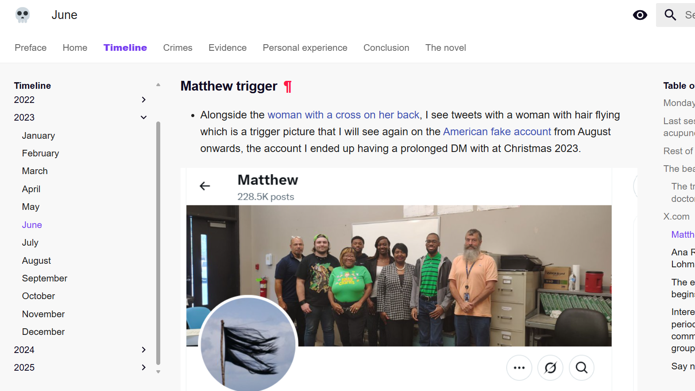
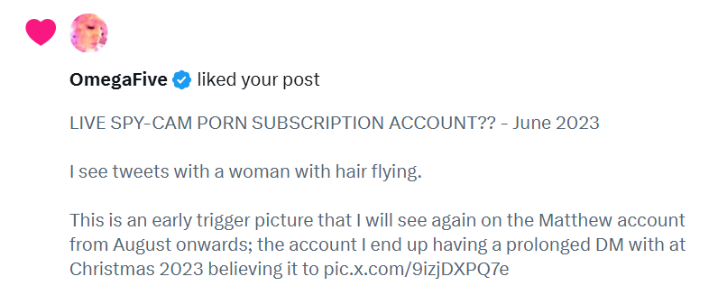
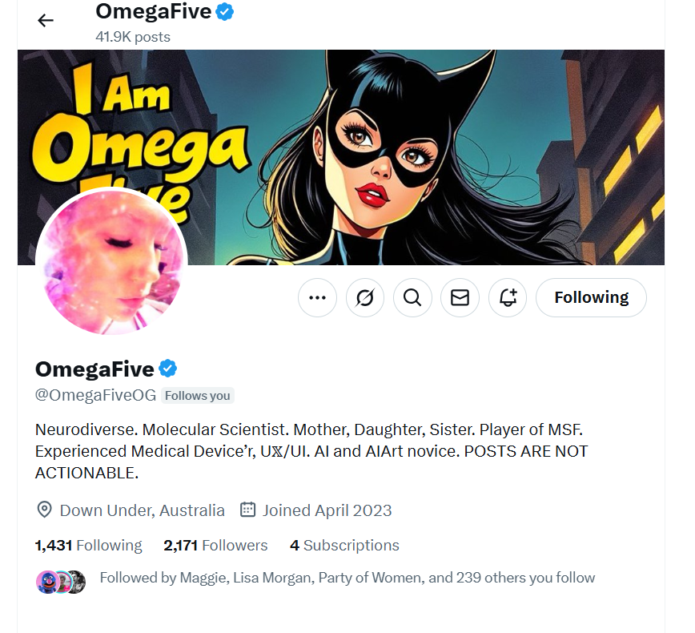
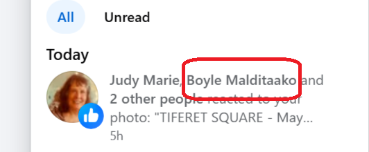
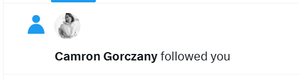

# May 2025

## Pure evil

How many children do I have? Or are on the way? HOW DARE THEY!!!! I would have been TOTALLY OK with all this, instead, they make it a crime of the century. This is bad karma like none other. Why would they do that unless they intend to murder me. Why do they think so little of me? Is it because of my political baggage, they don't want to upset anyone just like everyone else? There is no other explanation unless they think I'm stupid and I'd never know... and then in 20 years all these lookalike-mes start popping up with genetic proof and rage and law suits, ... how do you keep that secret? How to fuck things up catastrophically 101. Unbelievable. I'm so sad and angry. I don't think I'll get over this one. It's too obscene. It's as obscene as Elon's trip to Mars with everyone and no women arrive because they all went mad on the way and raped and killed them, and any they didn't murder committed suicide. Well, I can tell you something, offspring is an ABSOLUTE SECURITY AGAIN SUICIDE... so think again if you were planning something like that...

i was curious about this being God's Way of getting all permanently and obsessively unhelpful folk OUT OF THE WAY!

## TT intensive in Dublin

- Ferry over from Liverpool.
- On the way over I stay one night somewhere because the drive is so long.
- On the way back, I stay in Wales one night and learn from the first time in my life how to say good morning in Welsh, bore da.

### Hearing the bell in her earpiece

- Of 8 of us in the circle, plus Steve, all said they were not able to hear the bell.
- One other, including me, heard it.
- wip

### Adam has pain in his hands

- So do I.
- It's constant after driving long distances and I don't always wear gloves at this stage.
- I'm still suffering from aches and pains from my pesticide-ridden clothing.
- I complain about this online.
- I've always thought Adam was working for Adams, since he turned up the year before and was seething.
- He looks at his phone and then suddenly complains about the aches in his hands.
- Steve asks him to come over and has a look at them.

### They're putting ideas in my head

- Sick ideas they want me to write about and get killed for doing so.
- I don't.
- Is that the true nature of the *intensives*?
- I didn't know this at the time, but I kept have these bizarre thoughts throughout the course, and something stronger telling me to note it and not to worry about it.
- It all clicked into place in [Bali in July 2026](../2026/july.md#loka-yoga) on the CIA psychological-torture intensive which also had very little effect on me and, I think now, rather helped me enormously.

### Steve says he doesn't know when the courses are scheduled

- I ask Steve on the last day when the next intensive is.
- He says *I have no idea*, in a manner in which it sounds like he has no input whatsoever into his schedule.
- I say goodbye and tell him I look forward to seeing him in Israel in a couple of weeks.

## Response to new content

- As I undertake a first laborious and extremely triggering copy edit, I post new content describing what appear to be bona fide stalker accounts, possibly having live spy-cam-porn subscriptions, such as the Matthew account.
- It appears that a trigger image - the hair flowing in the wind - was set up early on for me to recognize this account as being significant.

- A fake account I've seen before in similar circumstances likes the tweet. 

- Note the message about "POSTS ARE NOT ACTIONABLE".

!!! danger "Please note"
    - I post about 1% of this kind of interaction I receive on a daily basis.

## Constant threats online and in-person

### Are you Welsh?

- I write to Ana Requena at the conservatory.
- The email is from my `katharinejchardwood@gmail.com` account which North London's finest managed to get shutdown in January 2026 while deleting all my backups at the same time.
- I can see why they might want to protect their interests at the music school; fish in a barrel, isn't it.
- I've written to Ana quite frequently on other accounts.
- I start the email with a greeting in Welsh: *bore da*.
- I have never ever done that before in my life.
- I do that because it's the very day after I return from Ireland, and I stayed in Wales one night on the way back, and that's how they were saying good morning to me, bore da.
- Later that day, I take my dad to the library.
- As we arrive at the library, we see an extremely weird guy sitting outside. He's old and has an orange old bashed-up car, wild hair, trampy clothes, and he looks very dodgy.
- The minute I open the door of my car, he jumps up and starts saying to me, "Oh, are you Welsh, are you Welsh".
- I do not feel safe in North London!

### Dancing man

- I pull into my road in the car late one evening.
- As I'm driving up, a man suddenly jumps into the middle of the road.
- He is wearing black ear phones like the ones I used to have and he is dancing [exactly like I did around my room sometimes](../2023/august.md#fighting-back) when I was being drugged and hacked in Spain and France.
- He grins at me wildly and doesn't move so I have to slow down.
- He side steps away.
- He lives at the bottom of the road (or did at the time), I saw him again being a normal person.
- Is he one of those with a porn-subscription that can be relied upon?

## Spy-cams in London N2 also??

- I arrive home from a trip to Israel.
- I'm tired and I sleep well.
- In the morning, I notice a massive boil in my groin which has a lot of puss. Obviously, when I notice it I am in a very private state of undress.
- I open my laptop. On my Facebook account, an account with an extremely specific name has liked my post from the night before.

- "Bad boil a-knock-out"?
- Does this mean my home in London N2 has somehow also been fitted with spy-cams? If so, since when and by whom?
- Perhaps in [November 2024](../2024/november.md#spy-cams-at-my-london-address).
- A fake account follows me on my `@jackchardwood` account. The name is interesting and sounds a bit like "camera on gawk zany".

- Bear in mind I have no activity on this account at all anymore and the last interaction on here was over 40 days ago.

## Meeting Chris & Desa before I fly to Israel

- I meet old friends Chris Ludwick and Desa.
- I'm flying to Israel the following morning to assist Steve on a TT module 2 in Jerusalem.
- Desa repeatedly says to me, "you saved my life" regarding a weekend up North in 2019.
- I ask her why.
- She doesn't explain.
- She also angrily tells me I must never, ever go back to Spain. I guess it's the manner of her caring.
- I wasn't planning on it.
- I wonder what Chris's mates Des and Nikki would have said about all this.

## A woman in Israel reacts normally to my story

- I attend a Transforming Touch course in Israel where I'm assisting.
- At one point, a woman and I are chatting in the kitchen, it's a break time, and she just so happens to ask me about my life and how I am, what's going on.
- And I tell her.
- I've no reason to lie.
- She's horrified.
- In fact, I really upset her with my story and she has to take time out.
- I'm amazed because for the first time someone has reacted normally to what's going on for me.
- I'm normally surrounded by totally unhelpful people, all the time, and it is somewhat inexplicable to me.
- Her reaction is so powerful, it prompts me to write again to the police and the Baroness when I'm on detox in a few weeks time in Devon.
- The second time someone reacts normally is in April 2026 on another TT course I'm attending as a student in Dublin.
- There has not yet been a third time.
