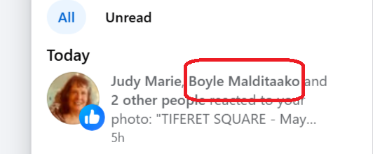

# May 2025

## Response to new content

- As I undertake a first laborious and extremely triggering copy edit, I post new content describing what appear to be bona fide stalker accounts, possibly having live spy-cam-porn subscriptions, such as the Matthew account.
- It appears that a trigger image - the hair flowing in the wind - was set up early on for me to recognize this account as being significant.

- A fake account I've seen before in similar circumstances likes the tweet. 

- Note the message about "POSTS ARE NOT ACTIONABLE".

!!! danger "Please note"
    - I post about 1% of this kind of interaction I receive on a daily basis.

## Constant threats online and in-person

- I send some content to an interested party, someone who works in education for the Generalitat Valenciana.
- I start the email with a greeting in Welsh. I have never ever done that before in my life.
- Later that day, I take my dad out.
- As we arrive at the library, we see an extremely weird guy sitting outside. He has an orange old bashed-up car with him.
- The minute I open the door of my car, he jumps up and starts saying, "Oh, are you Welsh, are you Welsh".
- I do not feel safe in North London.

## Spy-cams in London N2

- I arrive home from a trip to Israel.
- I'm tired and I sleep well.
- In the morning, I notice a massive boil in my groin which has a lot of puss. Obviously, when I notice it I am in a very private state of undress.
- I open my laptop. On my Facebook account, an account with an extremely specific name has liked my post from the night before.

- "Bad boil a-knock-out"?
- Does this mean my home in London N2 has somehow also been fitted with spy-cams? Is so, since when and by whom?
- Or have some of my belongings I brought back from Dénia been fitted with spy-cams?
