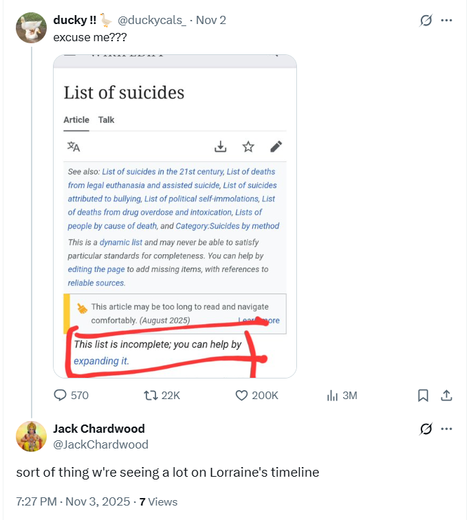

# November 2025

## Hip/groin injury starts paining me

- I'm campaigning for a local election with Reform.
- Myself and another woman who is now standing somewhere in Barnet for Reform - I'm assuming agent now as, since I survived poisoning in July, I'm not allowed anywhere without them - are going house to house in Hendon talking to people and delivering leaflets.
- I've been walking all day - apart from a few hours when I had a hairdresser appointment scheduled.
- I'm perhaps starting to limp a bit, or I maybe mentioned a pain coming on.
- The woman I'm with starts to walk really, *really* slowly. 
- There's no reason why she would do that.
- We were racing around at the beginning of the day.
- I'm wondering if she was told to slow down by someone who knew I had stitches in my groin region and had heard I was complaining about feeling pain.
- This is the same stich which will snap and crunch at FitKoh in December after just a couple of paces jogging - I expect after another incision in the same place in Bangkok or Samui.

### Haircut disaster on the same day

- I had had a long break from walking that day when I went to the hairdresser - if you're thinking I might have tired myself out or something.
- And don't forget I was walking full 12 hour days in the Pyrenees not long before.
- In total that day I was probably out walking, and standing, and talking for about 6/7 hours no more and a good deal of standing.
- The hairdresser *mullered* my hair, and I mean on purpose he gave me the worst haircut in the world.
- It's nearly a year later (time of writing September 2026) and hair is still uneven on the sides of my head.
- I had written about this already as an aside to [a similarly disastrous (but quite stylish) haircut in Bangkok the year before](../2024/november.md#another-inexplicably-bad-haircut-in-n10-in-2025).

## Suicide content on my `@JackChardwood` account

- You may remember in [January 2024](../2024/january.md#the-jackchardwood-x-feed-changes-completely), my `@JackChardwood` X feed went from one content type to another, literally over night.
- This also happened with my `@1frgvn` account repeatedly, but not so starkly; the account has much more activity anyway.
- Nevertheless, I would notice sudden [excessive and inexplicable porn content](../2023/june.md#the-excessive-porn-on-x-begins) on both timelines on a regular basis, often during the evenings.
- On these occasions, the *only* accounts posting anything else on my timeline seemed to be aggressive stalker fake-accounts; her [flying monkeys](../2024/march/1-12.md#online-stalkers), as it were.
- Clearly, the social media feeds on a device's hacked browser can be 100% manipulated, and the manipulation can take multiple forms.
- I can practically see a bunch of criminal stalker apps targeting each social media platform; now probably rolled into one single application that criminal gangs use.
- Hacking a device is pretty easy, and young boys studying CS do it *all the time*; making sure the girls never find out how it works.
- After accessing a device, and jumping into an open session as owner, manipulating everything the true owner sees must be very easy.
- However, it's one thing a youngster doing it with a simple hacker application, it's quite another to have access to these AI-based process-heavy highly professional distributed applications that bypass safeguarding censorship completely.
- It also appears that X (the only platform I'm familiar with) has some leaky code on the backend which allows criminals to tweak the algorithm for targeted users. Sounds like an inside job.
- Criminals must prompt the application to post the triggering content required.
- Here's an idea of how prompts like these might read:
    - Animated, non-hostile porn with fellatio and post-coitus bliss ensuring man is [add particular size, shape, coloring] and woman is [add here].
    - Insipid Indian self-help bro content.
    - Wild out-there hallucinogen-type content from space bros.
    - Cat posts with messages that read like a true romance; with 5% of those posts having a random threat towards a female user.
    - Violent porn with aggression and threat towards a viewer we assume is female.
    - Subtle sexual grooming content for [add gender and age] who likes animals.
    - Show target biblical posts only. (I rather like this one).
    - Etc.
- Once prompted, the target's timeline changes completely. 
- It's very clever, quite obvious too, unless you're a kid, I guess.
- A smart target might notice and wonder what was going on.
- There may be adjustable subtlety levels; I suspect the less obvious it is the more powerful hold it has.
- If you happen to be able to drug a target at the same time, or perhaps know that they're a pothead or similar, then this triggering mechanism will have even more potency.
- So, why am I mentioning this here?
- Well, since I remembered the [anal fissure I noticed when my dad visited me in 2015](../2011-to-2020/2015.md#inexplicable-anal-fissure) about two weeks ago, my `@JackChardwood` account has undergone another of these transformations.
- Suicide content. A bunch of tweets about suicide from accounts as far from my graph as you can imagine, hiding in amongst everything else. Something I've never ever seen before.

- I take this as confirmation from the criminal porn gangs of Dénia that, just like [Alicia said about Bali](../2024/may.md#alicia), the *worst thing in the world* happened.
- The townsfolk and one other were the *only* ones who knew the real reason I became suicidally depressed in 2015; perhaps they're hoping for a bit of that again.
- Sorry-not-sorry folks. Not going to happen.
- Furthermore, this suicide content on my feed I have never seen before supports my suspicion that Lorraine Blackbourn, and others in the area and at the conservatory, may have been manipulated online into committing suicide.
- Another view of some of the less unpleasant of these changes in content is that someone was/is doing a bit of show-and-tell for my benefit.
- Thank you, whoever you are. It has helped enormously.
- But seriously, you should all be done for mass murder and mass attempted murder.
- Today, time of writing, I believe the suicide manipulation content is run by the Americans too.

## BAU at the conservatory

- Today, it is business as usual at the conservatory.

## Flight from Heathrow to Bangkok

- Agents, everywhere.
- One sitting at the end of my row, leaving a space in the middle.
- One I meet outside the toilet when my stomach starts relaxing over India.
- Others I cannot mistake.
- Incredible.
- It feels like protection, but I wonder if it was, rather, declaration of ownership.
- Protection, for me, makes a nice change.

## Anantara

- I've left earlier than planned so I stay at the Anantara for a bit.
- Agents, everywhere.
- They even set up a squirrel lookalike at the pool, which upset me and made me hopeful at the same time.
- At the cafe they were serving a dessert called: *I love you strawberry much.*

## Staying next to the American Embassy in Bangkok

- I stay for about 10 days in a lovely hotel right beside the embassy, booked online, of course, and in advance.
- I feel a little safer, a little bit looked-after shall we say.
- There are discrepancies but nevertheless it's somewhat comforting after trudging many circles of seemingly endless criminal hell.
- On the room service menu there seems to be only pages and pages of Caesar salad on offer. Very amusing.
- I get a wound on my left groin which doesn't behave like a normal boil. In fact, if I had been pierced there, it would be problematic because that was a boil area and so I used skin-thinning cream on it.
- This wound reopens in July 2024.

## Google Analytics suddenly showing activity

- They set it up so that I'm seeing a lot of activity on my Google Analytics for the website whenever I make updates.
- This goes on till April 2026 when it completely stops; it's shut down.
- It confirms my suspicions that someone (the Americans) wants me to think people are reading my content, when they're not at all.

## India - a bridge collapses

- At the end of the month, beginning of December, I visit Gujurat from Bangkok for jyotirlinga pilgrimage.
- On the way back from Ahmadabad to BKK, there is a "team" waiting for me airside.
- Quick aside: every time I fly now there are agents assigned to sit with me. However, this is a particularly unusual team. 
- Three "very" Jewish looking American men are shepherded by a couple of Indian officials.
- I'm sitting in the front pretty much alone (the first few rows are clear apart from me, and one Indian official woman sitting directly in front of me).
- These three get on and they're mucking around and being quite funny, I mean they're behaving like giggly children, and they're making me laugh too, the stewardess tells them to behave. 
- Everyone stretches out to sleep (the rest of the plane is full), they went on about the pillows endlessly.
- When everyone's settled down, one of them sitting behind me says: *you're safe now* or things of that nature.
- I know this is all for me and I'm expected to think it's a rescue team.
- They do not rescue me.
- It is events like this (yes, there are more just like it) that make me certain, as in KNOWING certainty, of how far up India's arse the mousses are.
- What's your favorite color?

- Um... what? Wait..
- WRONG!!!!
- Aaaaaaaahhhhhhhhhhhhh.

## Steve gets really sick

- Steve gets very sick around now - I can't remember the date.
- I'm attending all and every Thursday consultation during this time.
- He loses tons of weight.
- I have to wonder if they tested the poisoning thing out with him and it didn't really go as planned.
- There really is no need for that by the way. It's not a physical thing.
- Sigh.
- I find out in April 2026 that after his "illness" his physician tells him he has a rare disorder which is not cancer but requires weekly chemo. 
- Are they testing his reaction to chemo?
- What in the world *are* they doing to Steve?
- Do they even know themselves?
- I doubt it.
