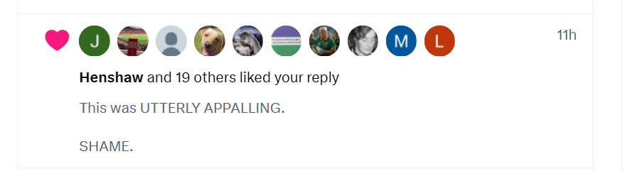

# October 2025

## Communication example

- Here's a good example of how cyber-stalkers communicate with me.
- I will post something in this statement that annoys them, and they will pick one of my posts that can be used as a way to communicate with me (via the wording) and have all their fake accounts like it and repost it.
- This happened yesterday with this post dated 16th June 2024: 

- I had just updated detailed information on the [four distinct men](../../crimes/protagonists/vidal-sastre.md#four-distinct-men) who came to the conservatory under the name Vidal Sastre Sanchez Hornero posing as a peripatetic trumpet teacher for the Generalitat Valenciana.
- It must have annoyed them.
- This has been happening to me very obviously since [June 12th 2023](../2023/june.md#monday-12th-june-2023).
- In the profile messages, I will see related messages and names will reflect people I know from the area.
- They will try to tempt me into believing they are the man I love, and I admit it worked for a long time - but I did have to be high on whatever was in my water or toiletries for that to happen. 
- Nevertheless, me falling for their tricks ensured they would share their patterns and secrets with me, so I could write them down.
- Sometimes, I believe, they are so insane, they will even post pictures of previous targets in profile pics, perhaps even deceased ones.
- It is as it is.
- I believe this activity comes from the Smiths primarily as the language always follows their obvious patterns of communication.
