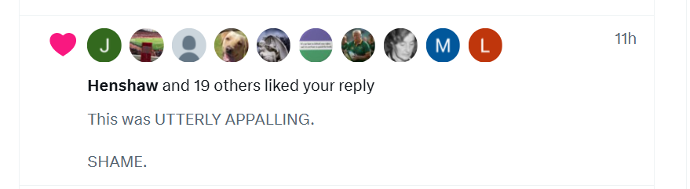

# October 2025

## Thunderbolt clarity

- Right after getting home from Ireland, I suddenly become clear about who the trumpet teacher was.
- A miracle.
- The four men I remember as playing the role of *trumpet teacher* become clear in my mind and I realize I can detail them and may even have some pictures of them.
- It is possible there are many more men involved.
- I detail the [results of my new and sudden clarity](../../crimes/protagonists/vidal-sastre.md#six-distinct-men).
- The gangs stop drugging me.

## Communication example

- Here's a good example of how cyber-stalkers communicate with me.
- I will post something in this statement that annoys them, and they will pick one of my posts that can be used as a way to communicate with me (via the wording) and have all their fake accounts like it and repost it.
- This happened yesterday with this post dated 16th June 2024: 

- I had just updated detailed information on the [four distinct men](../../crimes/protagonists/vidal-sastre.md#six-distinct-men) who came to the conservatory under the name Vidal Sastre Sanchez Hornero posing as a peripatetic trumpet teacher for the Generalitat Valenciana.
- It must have annoyed them.
- This has been happening to me very obviously since [June 12th 2023](../2023/june.md#monday-12th-june-2023).
- In the profile messages, I will see related messages and names will reflect people I know from the area.
- They will try to tempt me into believing they are the man I love, and I admit it worked for a long time - but I did have to be high on whatever was in my water or toiletries for that to happen. 
- Nevertheless, me falling for their tricks ensured they would share their patterns and secrets with me, so I could write them down.
- Sometimes, I believe, they are so insane and arrogant, they post pictures of previous targets in profile pics, perhaps even deceased ones.
- It is as it is.
- I believe this activity comes from the Smiths primarily as the language always follows their obvious patterns of communication.
- I will be, in due course, detailing all the women I believe have been targets of the gangs, many of whom I have photos.

## FiLia

- A Spanish woman sits next to me.
- We say hello and chat briefly.
- Her two friends sit with her.
- The woman leans over and tells her friends, in Spanish, that I am the one they've been looking for, 100% it's me, she says.
- I wonder if I've misheard her.
- They leave soon after the talk finishes and do not engage with me further.

## My father the pervert amongst all this other horror as if there wasn't enough already

- Along with the switcheroo team, I remember something awful about [when my father visited me in 2015](../early-years/2015.md#inexplicable-anal-fissure) which likely precipitated a suicidal depression.
- I ask dad about it.
- I remember he came out with mother too, and she'd had a massive panic attack in the same hotel I had a massive panic attack the first day I had a piano lesson with Domingo.
- He's ashamed, angry, incandescent actually.
- He only lies in front of my mother who takes his side without question.
- I'm devastated.
- Later, when we are alone, he says: *did I wake you up?*
- He's trying to really really upset me, to unbalance me, to murder me again.
- It's what they do, and how they do it.
- I guess he's wishing [they'd succeeded](july.md#lourdes) now.
- Later, I remember he recommended visiting Denia to my cousin - my apartment in Ricardo Ortega specifically - and insisting he visited with his family; wife, son, and daughter, the kids around 7 and 8.
- My cousin Igor mentioned this again and again to me, very unusually.
- I mention this to dad with horror.
- He gets so angry.
- He says: *I'm gonna phone Igor and talk to him*, in an extremely threatening way.
- They get angry, the women shut up, they do what they like, they think.
- Not any more.
- Mother supports him 100%.
- It's sickening.
- It's no coincidence my social media feeds are [suddenly full of suicide content](november.md#suicide-content-on-my-jackchardwood-account).
- I get a sudden onset chronic constipation and quite bad genital boils again.
- I'm numb with horror.
- Later, in December, I hurt my hip badly in an unusual manner and I wonder if it is like a projection of the pain... or something else.
