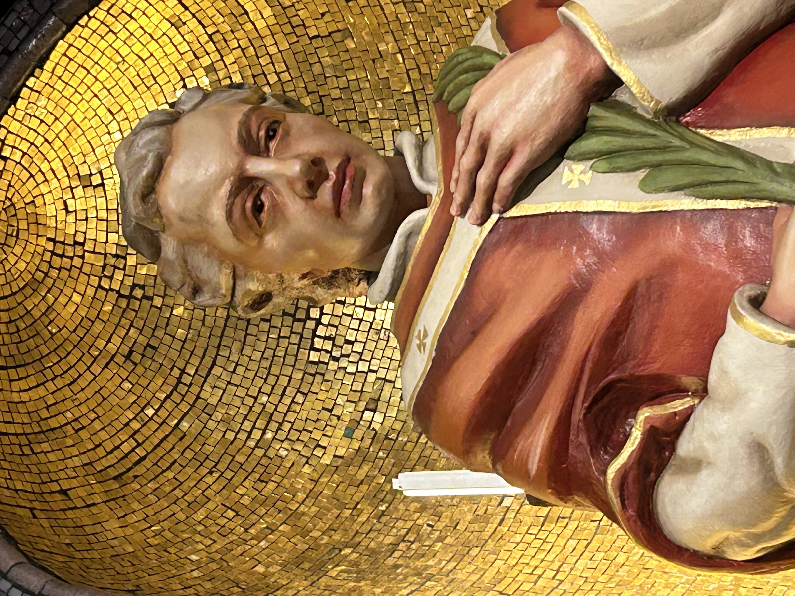
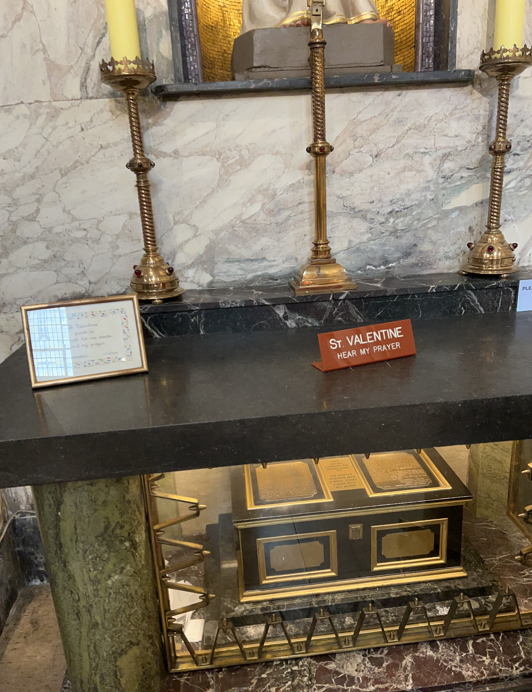

# September 2025

## The Red Lion Barnet with dad

- Dad likes to go to the Red Lion Barnet.
- There's something fishy going on up there, though.
- Every time I have taken him up for the carvery dinner, some weird event has taken place.
- For example: the [Muslim men display](march.md#a-man-who-reminds-me-of-domingo) at the table right next to us in March.
- Or the [woman who seems to know me](july.md#the-woman-at-the-red-lion) in July.
- As we walk from the car to the pub, dad suddenly needs a wee. He stands in the middle of the pavement, in broad daylight, and pisses on the Red Lion pub's wall.
- I'm pretty embarrassed actually, but he is 84, I guess.
- At the same time, a fast expensive car speeds up to us very noisily, stops, waits, then reverses away as if they were looking at us.
- While we're in the carvery, I see men peering into look at me.
- My presence is clearly antagonizing.
- I tell dad we have to stop coming here, I don't want to antagonize anyone.

## 13th Day of Elul, Saturday 6th September

!!! quote "The ultimate purpose of technology"
    Parenthetically, the ultimate purpose of technology is that it be used for holy matters, as stated: *All that the Holy One blessed be He created in this world was solely for His glory,* and *The only glory is Torah.* Thus we see that modern technology is to be used for increasing in the dissemination of Torah.

    Although it is possible to utilize it for worldly matters (and even things antithetical to sanctity), this is only because man is given free choice. Indeed, when others use technology for undesirable purposes, Jews must rectify this by using it for holy purposes; and then the sanctity produced is that much greater, coming as it does from previous *darkness*.

    Ref: https://www.chabad.org/therebbe/article_cdo/aid/2537558/jewish/13th-Day-of-Elul-5742-1982.htm
    
- This talk feels like it is describing the [forgivenet](https://1frgvn.com/).
- When there is no reasoning with arrogance and evil, what can you do?
- Maybe just supply the means for healing and make them available, and leave the rest to God.

## Thunderbolt clarity

- Around the middle of this month, I suddenly become clear about who the trumpet teacher was.
- The four men I remember as playing the role of *trumpet teacher* become clear in my mind and I realize I can detail them and may even have some pictures of them.
- It is possible there are many more men involved.
- I detail the [results of my new and sudden clarity](../../crimes/protagonists/vidal-sastre.md#four-distinct-men).

## Current health

### Eyes

- My eyes remain blurry and painful since [July's poison attack](july.md#eyes-and-kidneys-again-and-heart-now-too) and I'm having a lot of headaches.
- I can feel my eye pressure is high.
- I go in for a reading to Vision Express in Tesco's Colney Hatch Lane and indeed my eye pressure is high.
- I'm worried about sudden onset glaucoma after the diagnosis of [PACS from Rutnin last November](../2024/november.md#pre-glaucoma-diagnosis).
- Moorfields has [not got back to me](july.md#moorfields) since I noticed severe deterioration in my left peripheral and asked for help.
- I book an eye test at Colney Hatch on 17th September.
- I explain I'm concerned about glaucoma.
- The optometrists ask me if I have been hit on the head.
- My sight prescription has not changed at all; even the peripheral test is OK.
- I don't understand it and ask to speak to the optometrist in private.
- I tell the optometrist Zoha Hemraj I think I have been poisoned.
- She's shocked but it seems like my situation and narrow angles make more sense to her now.
- She tells me she is going to nudge Moorfields for further investigation and I should expect to hear from them.
- She also advises I tell my GP.
- I'm reluctant but I make an appointment in any case.

#### Reform UK conference

- I attended the Reform UK conference early this month.
- This was when I really noticed I could not at all look at bright lights.
- I'd be in the audience, watching the show and listening to the speakers, and in between each person the lights would roll around the conference hall and I literally had to cover my eyes and close them till it was finished.
- This is another thing that sparked my further concern.
- I was reminded of the [first time I went to the optician about this weird and inexplicable problem](../early-years/2013.md#boots-opticians-north-finchley), probably sometime in 2013.

### Rutland House Surgery Muswell Hill

- On 18th September I visit my GP.
- I speak to Dr Shirshana Davis.
- I tell her I believe I was poisoned; low level and continuously over years at my apartment, and then twice maliciously with the intent to kill at the [end of October 2024](../2024/october.md#serious-poisoning-with-intent-to-harm-or-kill) and about [a month before in France](july.md#eyes-and-kidneys-again-and-heart-now-too) in July this year.
- I also tell her that all my stuff was toxic when I brought it home from France in February this year as if it had been doused in pesticides or similar and it made me very unwell until I chucked it out or washed it multiple times.
- I write a timeline of symptoms for her as it is so much to explain.

- The only thing I missed on here was the snapped rib which happened three times and I believe due to weakened bone mass by poisoning.
- Also, the fact that since the PACS diagnosis, I have had to stop practicing inversions in yoga, something I have been doing without issue since 2000.
- Also, a skin lesion on my nose which appeared while living at Carrer Furs and I believe due to using toxic substances on my skin and standing under the shower in the morning where poisons in the water will have accumulated. Hackers mentioned this online to make sure I knew I was being watched. I looked at this lesion a lot in the mirror.
- I also give her the [PACS diagnosis](../../content/images/health-diagnosis-timeline/PACS-diagnosis.jpeg) and [kidney check result](../../content/images/health-diagnosis-timeline/kidney-check-BKK.jpeg) from BKK.
- She listens and hears me.
- She suggests immediately the mental health team.
- I explain that I have no more PTSD at all and that my suicidal depression is completely healed and I have no depression at all either.
- I explain that something happened to me while I was fighting for my life in Denia in 2023 that unleashed an inner strength I never knew I had.
- I tell her about my Transformational Touch work with Steve Terrell and how much it has helped me heal from trauma.
- I also explain that I have asked numerous agencies; police, embassies, etc, for help and I have been ignored by everyone.
- I tell her I do not feel safe in North London due to this.

!!! tip
    - RA symptoms in my hands come and go.
    - I expect a good detox will eliminate this, along with a better environment.

- She tells me to give my notes to the receptionist who will scan them into my file.
- I do that.
- As the receptionist is scanning my notes in, she suddenly remarks, "Oh, that's weird, the scanner's not working!"
- Her tone sounds like the scanner *always* works.
- I'm unsurprised at this development.
- I ask her to please get these notes into my file in any way she can.
- She photocopies them and tells me she'll do it later.
    
## Dublin trauma therapy

- I travel to Dublin for trauma therapy: Transforming Touch.
- The day before the course starts, on Wednesday 24th September, a friend and I visit [Whitefriars Church](https://whitefriarstreetchurch.com/) in Dublin city centre.
- My friend tells me he was drawn to visit the day before and was surprised to find relics of St Valentine there.
- I found this information triggering for some reason and vowed to visit myself on the 29th September, my one free day after the course and before I head home.
- It turned out we ended up there on our walk anyway.
- To my surprise, I found that the statue of St Valentine reminded me of the trumpet teacher somehow.
- I thought it was just because the psychological attack had been so intense, I was triggered by the idea of romance, but there was something more.
- The statue looked, to me, like it was real; a real human being.
- At the time, it was so weird I didn't understand it.
- A few days later, on the therapy table, I realized.
- Valentine reminded me of [all the trumpet teachers](../../crimes/protagonists/vidal-sastre.md#four-distinct-men) in fact, but [one of them](../../crimes/protagonists/vidal-sastre.md#the-older-slimmer-greyer-man) way way more than all the others.
- There is, in fact, a true and uncanny resemblance.
- The statue in Whitefriars Church looks like the trumpet teacher who had [cried in my arms in my bed](../2023/march.md#valentine) in what I had thought was a dream but I am now pretty sure it wasn't a dream.
- On the 29th September, Michaelmas, I visit again and take some photos.

- Like the mandrake, which looks like it was working for God and very much on my side, Valentine stood behind and beside me too, supporting me, on God's side, and very much against his misuse, and healing plant misuse by evil lost  minds … it’s kind of a divine comedy … imagine him looking like that… it’s as if it was all written hundreds of years ago.
- I keep a picture close by my heart, especially when I do my ACIM study.
- I believe my heart is finally healing now. Thank God in Heaven.

### Healing process

- On the TT table I have been extremely still for the five full years I have been doing the therapy practice. 
- I do not move at all.
- Since March this year, while doing TT shares at Purim-time, my therapy process has changed.
- I started experiencing eye-twitching very slightly, and I assumed this was something from 1989.
- In June, on a TT intensive, this eye-twitching became more pronounced.
- On the course this month, the eye-twitching is now quite extreme. It's as if some physical shocks are happening to the body and I'm registering it in the eyes alone.
- The changes also include fierce high-frequency head-shaking like I'm saying no repeatedly but can't vocalize or move my body.
- I see this as confirmation of repeated sedated rape and/or worse.
- I'm looking forward to more healing and peace.
- I guess I might remember a whole bunch of things now.
- I remain assured it will be nothing I can't handle.

!!! info "Remembering a whole bunch of things"
    - Yes, it happened.
    - Update: [I'm handling it](../early-years/2015.md#colitis-symptoms), but there is no doubt the information, and my family's reactions to it, would have killed me outright not that long ago.
    - The betrayal is immense, incomprehensible.
    - I was thrown to the wolves and left for dead by my own family, again and again.
    - At any moment, my father could have told the police what was going on, and at the very least warned me about what was happening so I could stop it.
    - At any moment, my father could have told the police what Domingo showed him in the toilet at the Casa Cultura.
    - The emotional wound from what happened undoubtedly caused my suicidal depression from 2016-2023 and would have killed me outright.
    - It's curious that going back to that situation in 2022 somehow healed me of it. God was with me, every second, and still is.
    - I'm reminded, yet again so no big surprises, of how evil the people closest to me are after my mother blamed me once again for apparently *choosing* to be a multiple rape-gang victim which now possibly includes my father's involvement - he has not denied it - and my brother called me a *tart* repeatedly looking at me as if I was dirt on his shoe.
    - Again, BAU for the people here whenever the unwelcome truth pops up...
    - I pray the whole truth emerges unhindered for me and other victims, and for the rape-apologists too who might be finally held to account by people they can't simply insult and silence.
    - I myself am fully done with them.
    - I've been waiting for apologies for years already.
    - There's more important stuff to be getting on with than pandering to perverts and their supporters.
    - I make ask him stuff though. That seems to be a good idea.
