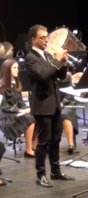
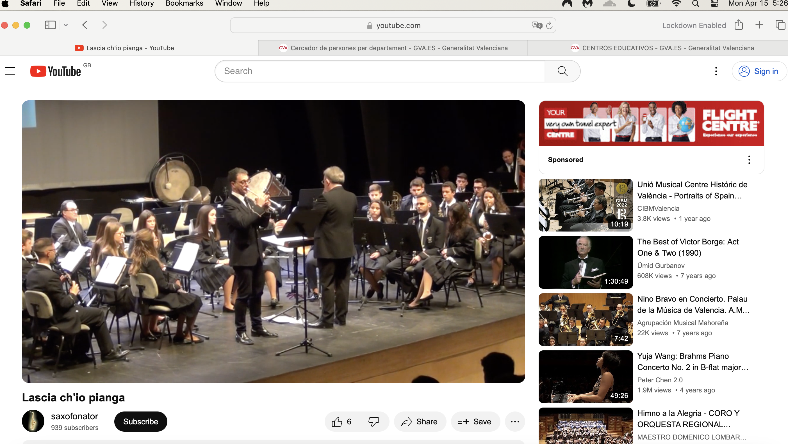
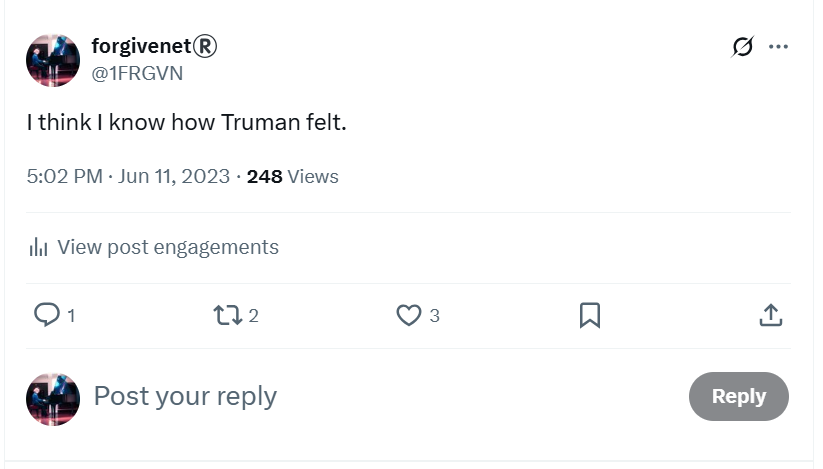
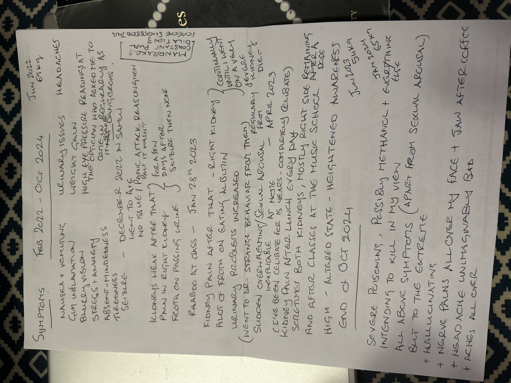
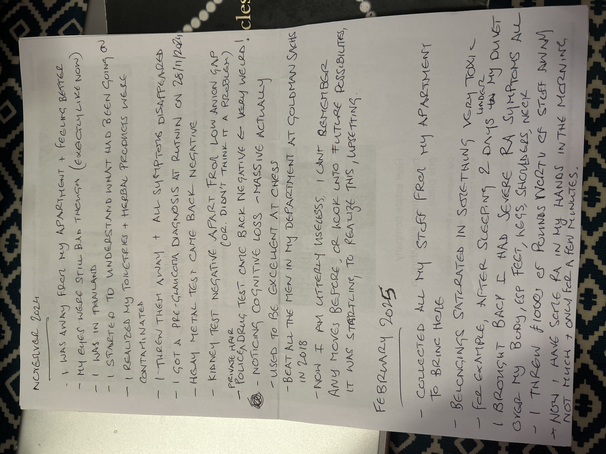
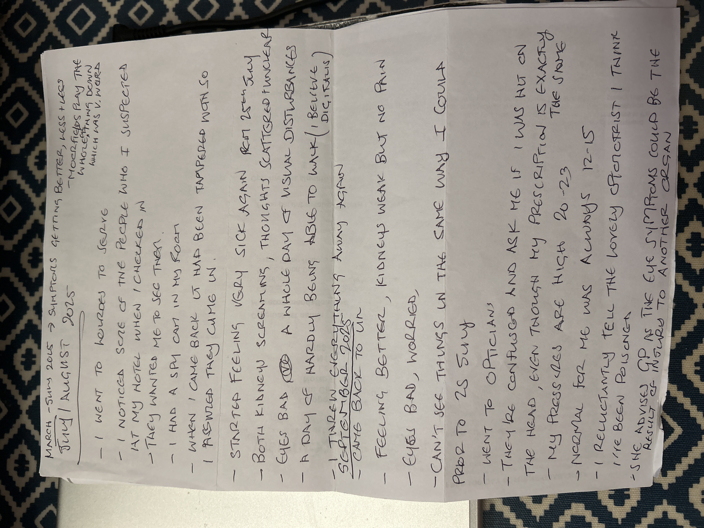

# September 2025

## Four distinct men 

- As my mind clears and my heart heals from decades of abuse at the hands of the Canos, the Smiths, and their associates in Dénia, France, and North London, clearer memories of what happened to me and by whom are returning.
- I realize now that the *trumpet teacher* was made up of four distinct men who came to the conservatory of Dénia under the role of teacher and using the name Vidal Sastre Sanchez Hornero.
- As I suspected, the fact that there were so few chamber music classes that year must have been due to the unavailability of some or all of the men on certain nights, while it was *essential* they all turned up at my apartment after class while I was sedated.

### The older, slimmer, greyer man

- He may have been the first of these men I saw at class before a switch took place.
- I never stopped having an extremely good feeling about this man.
- I only have four solid memories of him where I'm not confusing him with someone else:

    - The time we sat together in class and [I believed he was fundamentally on my side and conspiring with me against Domingo](../2023/february.md#plot-awareness). My words on that evening upset him; he understood what I was doing and the way I rewrote the nature of the conspiracy felt right to him.
    - The time not long after when I remember waking up in my bed at home and he was [crying in my arms](../2023/march.md#dreaming-of-the-trumpet-teacher).
    - There was another time I saw him in class for a minute or two, and I was delighted to see him again - now I understand it was unexpectedly - and I smiled and he ignored me, looking sad and downwards, as I said goodbye and left for the evening.
    - Then, when the attraction-trick stopped working so well, I guess, and they decided to [wheel him out again](../2023/december.md#the-trumpet-teacher-has-a-brother) so I could be re-triggered, and I thought it was the trumpet teacher's twin brother!

- This is the man I was convinced I loved and who loved me back. 

    

- This is an old picture, the man is about 10 years older now. However, this younger picture demonstrates the likeness between him and the [next bloke I mention](#mark-from-english-class-in-2013) who must be a family relation of some sort.
- I wonder if the gypsies made sure that one of the men would be someone I was strongly attracted to in order for the trick to work?
- Did they examine our astrological charts or consult a witch?
- It would not surprise me.
- Regardless, the fact is that without these extremely good feelings I had for this man, and still do, and these short moments in time, we probably wouldn't be where we are today which is becoming something rather marvelous in my view.
- It is my view that this man made a mistake being involved with these criminals and is innocent. Perhaps he doesn't feel this way. That would be normal.

### Mark from English class in 2013

- This man certainly reminded me of Mark from English class in 2013.
- He was the larger, taller, darker, more lumbering man that looked enough like the [older, slimmer man](#the-older-slimmer-greyer-man) for me to mistake them after what I assume had been some sort of [sedated psychological mistaking-people training](#sedated-training-for-recognizing-faces).
- He was someone I had [found attractive when I met him in 2013](../early-years/2008.md#working-for-lorraine-blackbourn) in my English class when I worked for Lorraine Blackbourn.
- It's likely this man is related to Lorraine Blackbourn's ex-husband and indeed was of the same size and shape, and facial features.
- He was the man I saw most often at the conservatory, and I was always anxious around him.
- I remember seeing this man numerous times, including but not limited to the following examples:

    - He was the man [Patricia Penny *introduced* me to in Benijembla](../2022/november.md#walking-in-benijembla-with-the-english-ladies) the week before he turned up at class.
    - He was the man that [stalked me at Lourdes](../2021/july.md#the-portuguese-man-next-door).
    - At the first class in [November 2022](../2022/november.md#the-trumpet-teacher) there he was hovering over Ana Requena after timing a meeting at the toilet.
    - He was the man involved in [poisoning me by overdose](../2023/january.md#serious-poisoning-at-chamber-music-class) with the doctor who had a class scheduled before ours, but only came twice.
    - He was the man who brought the music sheets from Gloria and [handed me his phone](../2023/march.md#the-trumpet-teacher-hands-me-his-phone).
    - The man who [was angry at me](../2023/april.md#back-in-chamber-music-class) after I followed the `@jctot19` account.
    - The man who switched with [the other large man](#an-unknown-man-i-may-have-a-picture-of) right at the end of the [May 2023 concert](../2023/may.md#chamber-music-concert).
    - The man who led my *funeral* on [12th June 2023](../2023/june.md#monday-12th-june-2023).

- I don't have a picture of this man but would recognize him immediately.

### An unknown man I may have a picture of

- There was a similarly tall but even larger lumbering man that I remember seeing a few times.
- He was the man who organized and managed the [chamber music concert](../2023/may.md#chamber-music-concert) where Carmen Cano was in the audience (masquerading or not) as Pablo's mum.
- He had a soft pleasant voice and he was the man who left any messages on my phone.
- He was the man I spoke to who [mentioned a *double session* in a perverted way](../2023/may.md#teb-with-robin) the night before I saw possible evidence of being anally raped.
- He did look like an older version of the young man in the middle of this picture with his arms around two siblings (I assume).

- The younger brother in the pic looks like the man who came out of the tunnel and [blew at me in the face in March 2024](../2024/march.md#wednesday-13th-march) right before I became convinced I was going to be murdered.
- I'm not sure I have any more solid memories of this man at the conservatory.

### Dark thick-curly-haired deep-set man

- There was another man I have a few memories of which I have already documented.
- I don't remember him ever being at the conservatory.
- I remember him [in my bed calling my name](../2023/april.md#dreaming-of-the-trumpet-teacher).
- He was the man I saw in the banged up Peugeot on the 11th June 2023, [the day before my *funeral*](../2023/june.md#sunday-11th-june) and [driving past me at the beach with the doctor in the passenger seat](../2023/june.md#the-trumpet-teacher-and-the-doctor-joan-drive-past-me), and [driving Ana Requena's blue car slowly past me](../2023/october.md#the-trumpet-teacher-drives-past-me-in-his-car).
- He was also reminiscent of [Patricia Penny's husband](../2021/december.md#christmas) and the [man who came out to terrorize me on Halloween](../2023/october.md#halloween) but not exactly the same - those two men could well be the same man.
- This trumpet player, at the *funeral* of the young girl behind him, looks like him. 

- You'll notice Carmen Cano was in attendance here too. She gets around doesn't she.

- I'm pretty sure these films they're so happy and safe to publish are the porn-genre adverts.
- Could this be him as a young man?

- Although I did think I saw the grown-up version of this person on the beach on [6th October 2024](../2024/october.md#sunday-6th-october) and have a body cam image of that man who was very different looking, short and quite ugly. Perhaps they're related.
- I believe this is also the man who [interviewed me for a tech job where I'd be looking at genitals all day](../early-years/2016.md#march) in 2016; a man I saw online and in-person.
- They are certainly the man depicted on the [book cover](../../index.md).

## Sedated training for recognizing faces

- The question is, of course, how did I manage to mistake four separate men for a single person?
- Let's examine that.
- I was living alone and had no social life.
- I was being drugged continually with substances that blurred my vision and made my thoughts extremely unclear.
- I was being sedated and likely sexually assaulted, except … 
- Is it possible that the four of them treated me very nicely, sweetly, intimately but non-sexually, while I was sedated at home prior to 12th June 2023, with the intention of sexual abuse happening on that night as a kind of *grand finale*?
- Was the enormous and exaggerated anxiety I felt after the attack on the 12th June 2023 in fact (and it makes much more sense to be) due to the grand rape-gang finale having occurred at my house that night?
- Could part of the mind training and manipulation (*rehearsals* he called it at class) have included staring at me full in the face while I was sedated and my eyes were open and I was looking straight at them so I would recognize their faces in real life?
- If they had assaulted me prior to June 12th 2023, I would have found them frightening in real life, and I didn’t, although they gave me a bad feeling that made me anxious and recoil… apart from the first older man who I never stopped having an extremely good feeling about.
- From 12th June 2023, I *did* find him frightening, and ran away when [I saw one of them at Alicante airport](../2023/june.md#sunday-18th-june-alicante-airport); I believe this one was the [unknown man that led the chamber music class](#an-unknown-man-i-may-have-a-picture-of) so it is likely sedated rape had begun.
- This whole process is so professional, so finely-tuned; none of them felt they were taking *any risk at all*. They must have done the same to hundreds, perhaps thousands of women and girls.

## The Truwoman Show or Please Turn My Wife into a Porn Star

- I’m guessing this is a porn genre and many millions of men and porn addicts internationally know about it, particularly in Spain.
- A great deal of police will be subscribers.
- They will live stream the whole thing most likely, as a kind of porn-reality show.
- The series probably includes a live-streamed gang-rape as  grander-grand finale in which the target is not sedated and recognizes all the men that have been *training* her.
- They must charge exorbitant fees for this.
- I wouldn't be surprised if this has killed women and girls outright with the shock; something the pornographers hope for probably as it makes a lot more money.
- Women like [Rocio Vidal](../2023/october.md#rocio-vidal) and the sports woman I mentioned in [my handwritten letters](../2024/august.md#the-letters) are likely viable targets requested by paying viewers and maybe blackmailed into participating rather than sedated (especially if they're famous).
- It must be common knowledge across the world, and that’s fundamentally why all my complaints are ignored.
- The perverts have certainly evolved over the years from targeting wealthy women with body-cams to setting up a kind of Truwoman Show in people's homes… just another sickly-inventive way men have found to delight and get boners at the destruction of women and now children too.
- This is the *only explanation* for the enormous resources spent on terrorizing me. They were earning far more for doing so than not.

### Is this why the McCann case continues to falter?

- The sedating MO is exactly like the McCann case.
- Could this be why the case stalled so badly in the beginning, and why they're trying to pin an extremely professional kidnap job onto an obvious opportunist?
- You only have to look up spy cam porn online to see millions of people unaware they’re being filmed and my guess is a lot of this is coming from Spain and Portugal.

### Sedating porn is normal now

- We were all horrified at the Gisele Pelicot case; but perhaps this is considered completely acceptable by pornographers and billions of porn viewers.
- I guess the paying viewers feel like they've not quite reached the vileness of child or baby rape but at least they're still getting a sexual hit off something equally abhorrent towards women and girls.
- I wonder if the audiences can request the gangs target their wives or girlfriends, or colleagues maybe, a sort of evolved *reader's-wives*.
- Is this what happened to [Mrs Lara](../../evidence/maybes.md#alice-lara), and Lorraine found out somehow… and reported… and was ignored... and was then targeted online and manipulated into killing herself?
- Was Mike Wenham manipulated into everything he did too? If so, for what purpose.
- Is this the backdrop to many of my professional experiences, especially [Polygon](../2023/november.md#polygon)?

## My role

- And running through all this evil and vileness is my journey through it.
- I must have been judged just another *silly little girl*, ready for targeting.
- When they found out I was already a child rape victim, with the films to prove it, they must have thought me non-human and from there it was very easy for everyone to justify my assured demise.
- They must have thought me an easy target with no friends or family, completely isolated, and yet something was going on that no one could have imagined and, once the divine trap was operational - set in motion decades before - there was no escape, and even as the bear teeth tightened down on the conspiring fools, they still had so little respect for women, girls, children, and babies, they didn’t feel until it snapped shut.
- Miracles.

## Future optimisms 

- The Rape Gang Inquiry has suggested that they might be able to get the police to re-investigate my original Tottenham rape gang case from 1989.
- Except, now, they cannot possibly investigate those crimes without casting an eye on the decades long international conspiracy against me.
- How exciting!
- Some amazing investigatory team will be winning official awards for their career-case work ensnaring the nastiest, vilest, pedo-porn gang and serial-killing international online community of perverts and homicidal maniacs the world has ever known.
- May it be very very soon.
- And I myself will buy them all a non-toxic pint.

## Current health

### Eyes

- My eyes remain blurry and painful since [July's poison attack](july.md#eyes-and-kidneys-again-and-heart-now-too) and I'm having a lot of headaches.
- I can feel my eye pressure is high.
- I go in for a reading to Vision Express in Tesco's Colney Hatch Lane and indeed my eye pressure is high.
- I'm worried about sudden onset glaucoma after the diagnosis of [PACS from Rutnin last November](../2024/november.md#pre-glaucoma-eye-condition).
- Moorfields has [not got back to me](july.md#moorfields) since I noticed severe deterioration in my left peripheral and asked for help.
- I book an eye test at Colney Hatch on 17th September.
- I explain I'm concerned about glaucoma.
- The optometrists ask me if I have been hit on the head.
- My sight prescription has not changed at all; even the peripheral test is OK.
- I don't understand it and ask to speak to the optometrist in private.
- I tell the optometrist Zoha Hemraj I think I have been poisoned.
- She's shocked but it seems like my situation and narrow angles make more sense to her now.
- She tells me she is going to nudge Moorfields for further investigation and I should expect to hear from them.
- She also advises I tell my GP.
- I'm reluctant but I make an appointment in any case.

### Rutland House Surgery Muswell Hill

- On 18th September I visit my GP.
- I speak to Dr Shirshana Davis.
- I tell her I believe I was poisoned; low level and continuously over years at my apartment, and then twice maliciously with the intent to kill at the [end of October 2024](../2024/october.md#serious-poisoning-with-intent-to-harm-or-kill) and about [a month before in France](july.md#eyes-and-kidneys-again-and-heart-now-too) in July.
- I also tell her that all my stuff was toxic when I brought it home from France in February this year as if it had been doused in pesticides or similar and it made me very unwell until I chucked it out or washed it multiple times.
- I write a timeline of symptoms for her as it is so much to explain.

- The only thing I missed on here was the snapped rib which happened three times and I believe due to weakened bone mass by poisoning.
- I also give her the [PACS diagnosis](../../content/images/health-diagnosis-timeline/PACS-diagnosis.jpeg) and [kidney check result](../../content/images/health-diagnosis-timeline/kidney-check-BKK.jpeg) from BKK.
- She listens and hears me.
- She suggests immediately the mental health team.
- I explain that I have no more PTSD at all and that my suicidal depression is completely healed and I have no depression at all.
- I explain that something happened to me while I was fighting for my life in Denia in 2023 that unleashed an inner strength I never knew I had.
- I tell her about my Transformational Touch work with Steve Terrell and how much it has helped me heal from trauma.
- I also explain that I have asked numerous agencies; police, embassies, etc, for help and I have been ignored by everyone.
- I tell her I do not feel safe in North London due to this.
