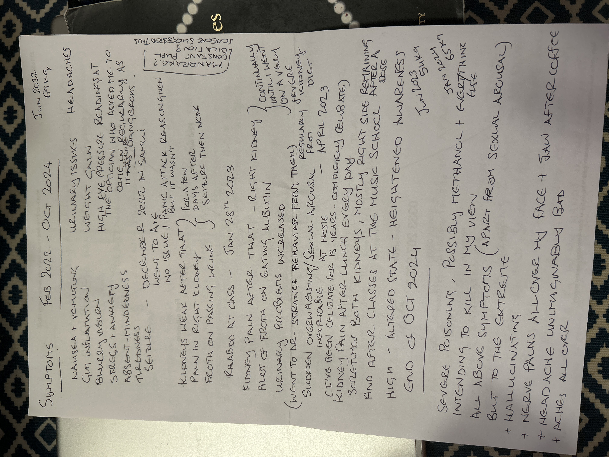
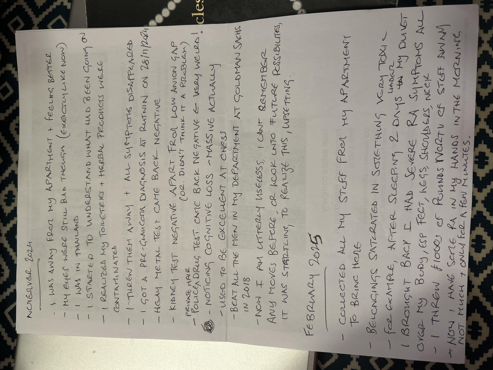
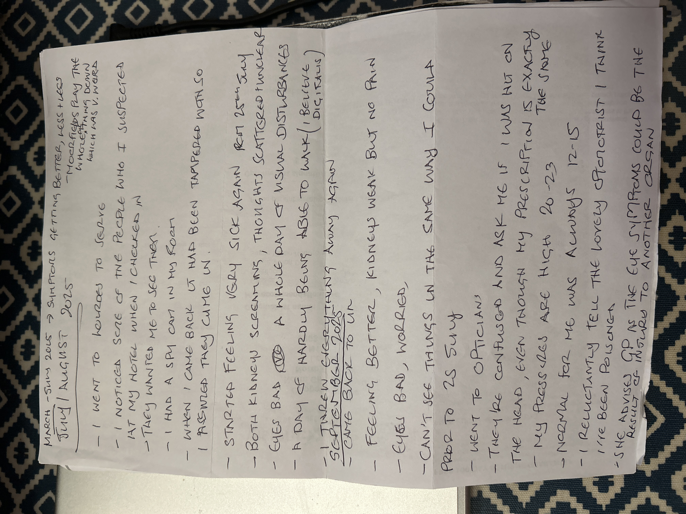
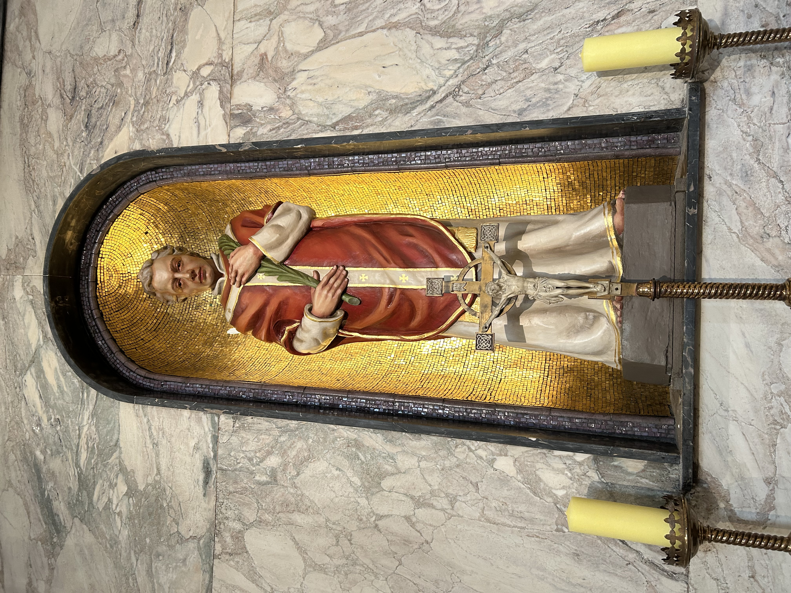
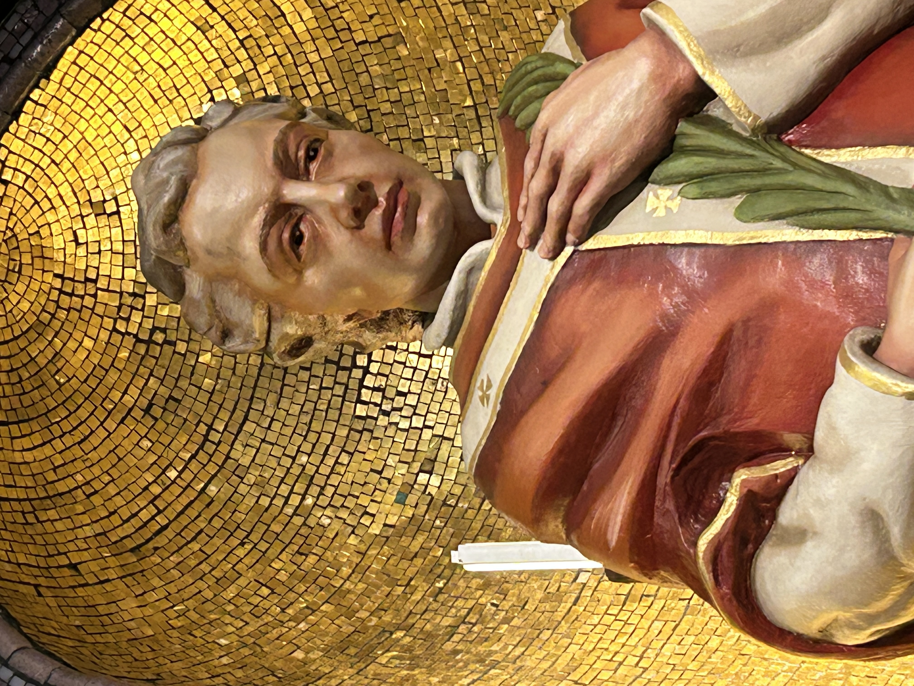
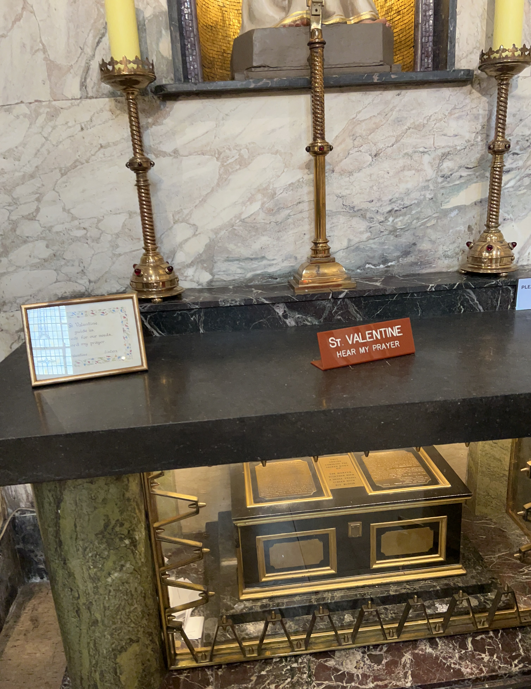
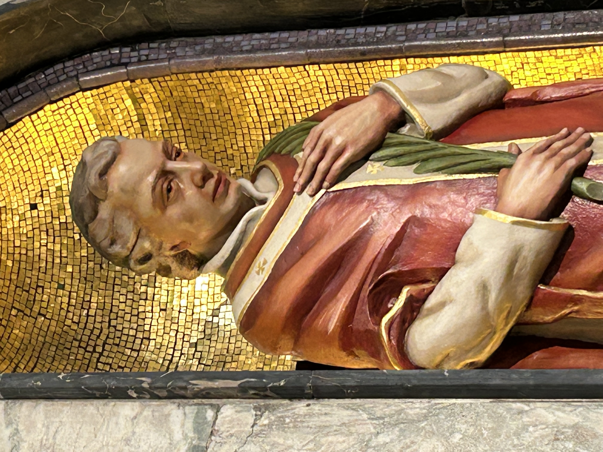

# September 2025

## The Red Lion in High Barnet with dad

- Since I got back in February, dad insisted we went regularly to the Red Lion in High Barnet for the carvery.
- I usually paid, of course.
- I started to realize something fishy was going on up there pretty much immediately.
- Every time I took him up for the carvery dinner, some weird event occurred.
- For example: the [Islamicist display](march.md#a-man-who-reminds-me-of-domingo) at the table right next to us in March.
- Or the [woman who seems to know me](july.md#the-woman-at-the-red-lion), and dad, in July.
- He wants to go again.
- I don't like going but I take him because he wants to go; I mean, it's OK, apart from the weird events, but it's way too much food for me.
- Anyway, off we go and park close to the pub.
- We are walking from the car to the pub.
- In a disastrous error of judgment, for him, dad suddenly needs a wee. 
- He stands in the middle of the pavement, in broad daylight, and pisses on the Red Lion pub's wall.
- He even waggles his penis and sprays the urine up and down.
- He does something even more despicable too. He pulls back his foreskin and it appears he even has an erection while he's pissing up the wall of the Red Lion.
- I'm really embarrassed.
- I stand aside and sort of put my head in my hand.
- While he's doing this, a fast, red expensive car speeds up to us noisily, engine growling and screeching.
- It stops, the driver and passenger look at us for a few moments, then it reverses away and drives off.

!!! tip "Thoughts on this"
    - He's saying "up yours" to the pornographers, for events he hasn't understood very well.
    - It's disgusting, I don't think I've ever been so disgusted with someone.
    - A level down, even though in some way he's happy I'm alive, the constant remains: his daughter is not human nor deserves basic human rights.
    - Repentance - his statement - is the only thing that can save him.
    - I hope they got the whole thing on film, please God.
    
- While we're in the carvery, I see men peering in the window to look at us.
- Our presence is clearly antagonizing.
- I tell dad we have to stop coming here, I don't want to antagonize anyone.
- After finding out that my dad is likely horribly connected with these people and the porn-gangs of Denia, and that the woman at the Red Lion probably told him to stay away from Lourdes while they [*finished me off*](july.md#lourdes), and I was not finished off; this act, to me, is even more appalling than it already was.
- And he still let them feed him.

## Reform UK conference

- Agents everywhere; in the next room at the hotel, wherever I go. This is becoming the norm for me now.
- I attended the Reform UK conference early this month.
- This was when I really noticed I could not at all look at bright lights.
- I'd be in the audience, watching the show and listening to the speakers, and in between each person the lights would roll around the conference hall and I literally had to cover my eyes and close them till it was finished.
- This is another thing that sparked my further concern.
- I was reminded of the [first time I went to the optician about this weird and inexplicable problem](../2011-to-2020/2013.md#boots-opticians-north-finchley), probably sometime in 2013.

## 13th Day of Elul, Saturday 6th September

!!! quote "The ultimate purpose of technology"
    Parenthetically, the ultimate purpose of technology is that it be used for holy matters, as stated: *All that the Holy One blessed be He created in this world was solely for His glory,* and *The only glory is Torah.* Thus we see that modern technology is to be used for increasing in the dissemination of Torah.

    Although it is possible to utilize it for worldly matters (and even things antithetical to sanctity), this is only because man is given free choice. Indeed, when others use technology for undesirable purposes, Jews must rectify this by using it for holy purposes; and then the sanctity produced is that much greater, coming as it does from previous *darkness*.

    Ref: https://www.chabad.org/therebbe/article_cdo/aid/2537558/jewish/13th-Day-of-Elul-5742-1982.htm
    
- This talk feels like it is describing the [forgivenet](https://1frgvn.com/).
- When there is no reasoning with arrogance and evil, what can you do?
- Maybe just supply the means for healing and make them available, and leave the rest to God.

## Current health

### Eyes

- My eyes remain blurry and painful since [July's poison attack](july.md#eyes-and-kidneys-again-and-heart-now-too) and I'm having a lot of headaches.
- I can feel my eye pressure is high.
- I go in for a reading to Vision Express in Tesco's Colney Hatch Lane and indeed my eye pressure is high.
- I'm worried about sudden onset glaucoma after the diagnosis of [PACS from Rutnin last November](../2024/november.md#pre-glaucoma-diagnosis).
- Moorfields has [not got back to me](july.md#moorfields) since I noticed severe deterioration in my left peripheral and asked for help.
- I book an eye test at Colney Hatch on 17th September.
- I explain I'm concerned about glaucoma.
- The optometrists ask me if I have been hit on the head.
- My sight prescription has not changed at all; even the peripheral test is OK.
- I don't understand it and ask to speak to the optometrist in private.
- I tell the optometrist Zoha Hemraj I think I have been poisoned.
- She's shocked but it seems like my situation and narrow angles make more sense to her now.
- She tells me she is going to nudge Moorfields for further investigation and I should expect to hear from them.
- She also advises I tell my GP.
- I'm reluctant but I make an appointment in any case.

### Rutland House Surgery Muswell Hill

- On 18th September I visit my GP.
- I speak to Dr Shirshana Davis.
- I tell her I believe I was poisoned; low level and continuously over years at my apartment, and then twice maliciously with the intent to kill at the [end of October 2024](../2024/october.md#serious-poisoning-with-intent-to-kill) and about [a month before in France](july.md#eyes-and-kidneys-again-and-heart-now-too) in July this year.
- I also tell her that all my stuff was toxic when I brought it home from France in February this year as if it had been doused in pesticides or similar and it made me very unwell until I chucked it out or washed it multiple times.
- I write a timeline of symptoms for her as it is so much to explain.

- The only thing I missed on here was the snapped rib which happened three times and I believe due to weakened bone mass by poisoning.
- Also, the fact that since the PACS diagnosis, I have had to stop practicing inversions in yoga, something I have been doing without issue since 2000.
- Also, a skin lesion on my nose which appeared while living at Carrer Furs and I believe due to using toxic substances on my skin and standing under the shower in the morning where poisons in the water will have accumulated. Hackers mentioned this online to make sure I knew I was being watched. I looked at this lesion a lot in the mirror.
- I also give her the [PACS diagnosis](../../content/images/health-diagnosis-timeline/PACS-diagnosis.jpeg) and [kidney check result](../../content/images/health-diagnosis-timeline/kidney-check-BKK.jpeg) from BKK.
- She listens and hears me.
- She suggests immediately the mental health team.
- I explain that I have no more PTSD at all and that my suicidal depression is completely healed and I have no depression at all either.
- I explain that something happened to me while I was fighting for my life in Denia in 2023 that unleashed an inner strength I never knew I had.
- I tell her about my Transformational Touch work with Steve Terrell and how much it has helped me heal from trauma.
- I also explain that I have asked numerous agencies; police, embassies, etc, for help and I have been ignored by everyone.
- I tell her I do not feel safe in North London due to this.

!!! tip
    - RA symptoms in my hands come and go, I believe it is due to the car being toxic.
    - I expect a good detox will eliminate this, along with a better environment.

- She tells me to give my notes to the receptionist who will scan them into my file.
- I do that.
- As the receptionist is scanning my notes in, she suddenly remarks, "Oh, that's weird, the scanner's not working!"
- Her tone sounds like the scanner *always* works.
- I'm unsurprised at this development.
- I ask her to please get these notes into my file in any way she can.
- She photocopies them and tells me she'll do it later.

### Yet another weird woman

- Tiringly, another weird woman is sent to make sure I know my movements are still being watched by UK criminal porn-gangs.
- She is about the same age as me, a bit overweight, black hair, pale skin, short like me.
- She arrives just after I arrive for my appointment and sits in the waiting room.
- She does that talking about nothing thing which is supposed to make them look normal but is totally phoney.
- She states her appointment is not for another hour-and-a-half but thought she'd come anyway because she's feeling anxious.
- She quickly launches into a fake speech about nothing; the way they do.
- I sense darker intentions.
- I wonder if this is [Verity's weird roommate](../2011-to-2020/2013.md#traveling-back-to-uk-at-christmas-with-verity-sawyer)?
- I stand up tall and straight and bang my massive English Heritage umbrella on the ground loudly.
- She shuts up and puts her head down.
- That's true. I couldn't believe it.

## Aunty Paddy pops a note through the door

- Paddy, dad's sister, Leah's mum, sends a little handwritten note to mum and dad.
- In it, she basically says, and very extraneously, Leah's boyfriend Chris is a wrong un.
- I knew this already and they'd already offered him up in October 2024, except [I lost the pic when they rendered my machine unaccessible](../2024/december.md#losing-significant-online-communications-sent-by-the-porn-gangs).
- I wonder if Paddy is instructed to say this.
- The last few times I saw her, sporadically, like once every five years maybe, she always has *something* to say to me and the energy of it is always *shaming*, somehow.
- I wonder about her.
    
## Dublin Transforming Touch therapy with Steve

- I travel to Dublin for trauma therapy, Transforming Touch with Steven Terrell.
- It's module one of a new cohort.
- All the participants are agents this time, and they've started to be really obvious about it too.
- I suspect it's because of my [survival of yet another poisoning attempt at Lourdes](july.md#lourdes).
- Every time there's an attempt, and I survive, the number of agents stalking me increases.
- The numbers became overwhelming [in June 2026 after Tibet](../2026/june.md#kailash) where I suspect they used the most poisonous poisons ever known!
- A German woman on the course even calls me *Saint Katharine* when she first meets me in a sort of point-at-the-freak type manner.
- One of the men makes an extremely dodgy romantic move on me which he is tremendously embarrassed about the next time I see him in April 2026 - post switcheroo memories returning.
- I feel very exposed, and not in a good way.
- I'm starting to get clear about these people's budget for "me" which has become literally in the millions; but they won't lift a finger to actually help me personally, to ensure my safety, to help me out with healthcare, to tell me what's going on, nothing!
- The inconsistency is disturbing and much like the activity of the porn-gangs of Dénia if not exactly the same but with a different end goal.
- At this stage, I'm still trying to figure out what these people's end goal actually is.
- Do they want me to be a spy? Is that it?
- I struggle to understand why they would treat me so badly if they wanted to own me. It doesn't make sense.

### Richard at Newgrange 

- The day before the course starts, on Wednesday 24th September, I take Steve in my poisoned and toxic car to visit the [Newgrange monuments](https://www.newgrange.com/); a place I love which I like to visit as much as I can when I'm in Ireland.
- As we're walking up into the Knowth site on the tour, Steve tells me that the weirdest thing has just happened; one of the women on our tour looks *exactly* like someone who practices TT in the US. 
- Seconds after he tells me this, after we pass through the small yet significant constructions around the main mound, I see someone I recognize. 

- It's Richard, the man who [popped up in Glastonbury](../2001-to-2010/2005.md#richard-works-for-the-criminal-gangs) way back in 2005 just after I had received the Lockerbie compensation and the [porn fatwa](../2001-to-2010/2003.md#porn-fatwa) had begun in earnest.
- The man who had been tasked with stalking me by North London criminal gangs.
- I'm so startled; I'm staring right at him.
- It's his profile, exactly.
- He's the right age, about 60.
- Same height, same build.
- Everything about the man is Richard, except when I look at him head-on, his face is rounder - cotton wool in the gums maybe.
- I also think that could happen over the years.
- But then I hear him talk.
- He has a wild Irish accent and it throws me completely off guard; too wild perhaps though.
- Richard, although apparently Welsh, had spoken the King's English, well.
- He is with a couple of German people, a man and a woman.
- I can't figure it out. We see him hugging them from time to time. They're quite intimate with each other.
- The three are always deep in conversation.
- From what I can tell, he seems to be telling them about the myths and legends of the place, as if he knows more than the official guide.
- I wonder if he's working as a surreptitious guide.
- In the queue at the cafeteria, he is right in front of us.
- It could be Richard, apart from the accent. Could he be putting it on?
- I ask him; "Are you a guide?"
- He looks at me and starts to appear nervous.
- He says, grinning, "No, I'm not a guide, I just like talking a lot."
- It's Richard.
- They've done this countless times with protagonists in this police statement and in August 2026 I know why.
- They've been distracting me endlessly, pretending they're investigating crimes, to keep me from thinking about the inconsistencies in their behavior.
- They have shown ZERO interest in my health and wellbeing, and obviously couldn't care less if I died, and perhaps would find this preferable to my continued survival.
- My life has been like this since after [the poisoning attempt in July 2025](july.md#lourdes) - as if one criminal gang replaced the other - but the new one had millions to spend and has power over the bonafide criminals I am describing here, and can cart them round the world at the drop of a hat to show me to make me believe they give a shit, when they obviously don't.

### We talk about the forgivenet, the Golden Rule, and the disciples

- I want to know if Steve has a strong connection with any of the disciples.
- The reason I ask this is because just after being poisoned, and while I was on a hike up to the auberge Oulettes at the mountain, I had a really strange sensation of being cut in half.
- I also felt like God was as close to me as He could possibly be, so I was thinking the feeling might be biblical in nature.
- When I got back to my holiday let in Cauterets, I looked up if any of the disciples had been cut in half, and indeed one of them is said to have been, Simon the Zealot.
- So I wondered if Steve had had any similar thoughts.
- He said immediately, Peter.
- Of course it is!
- Later, I found out Isaiah was also cut in half.
- We've been so horribly violent with each other for so long haven't we.
- We also spoke about the forgivenet and the Golden Rule and I explained the app is *rock-solid* on Golden Rule.
- This is important to Steve, but I wondered if he realizes how most of what everyone in the world - including him - thinks and believes comes from anti-Golden Rule manipulation techniques.
- I often try to talk about these things with Steve, but something often blocks me.

### Whitefriars Church

- After we return to Dublin in my toxic vehicle, Steve and I go for a walk in Dublin.
- Steve had told me he was drawn to visit [Whitefriars Church](https://whitefriarstreetchurch.com/) the day before and was surprised to find relics of St Valentine there.
- I had found this information triggering for some reason, and quietly vowed to visit myself on the 29th September, my one free morning after the course ends and I head home, incidentally Saint Michael's feast day.
- It turned out Steve and I ended up there on our walk anyway.
- To my surprise, I found that the statue of St Valentine reminded me of [the trumpet teacher](../../crimes/protagonists/vidal-sastre.md#the-older-slimmer-shorter-greyer-man-the-angel); but I could look straight at him - not in glances like the animal-training they had subjected me to under sedation so that I would only be able to look at [the seven devils](../../crimes/protagonists/vidal-sastre.md#seven-devils) in glances, and they could therefore easily add a horse into the mix at the stage they were ready to finish me off.
- At Whitefriars, I was still under the impression that there was only one trumpet teacher, not [eight](../../crimes/protagonists/vidal-sastre.md#eight-distinct-men-posing-as-trumpet-teacher).
- As I stood looking at the statue of St Valentine, while having this powerful remembering of the Dénia conservatory trumpet teacher, I thought it was because the psychological attack had been so intense, I was triggered by the idea of romance... but there was something more.
- The statue looked, to me, like it was real; a real human being.
- At the time, it was so weird I didn't understand it.
- I told Steve the statue reminded me of a real human; *it's a real human*, I told him and went back to look again at it.
- A few days later, on the therapy table, I realized.
- Valentine reminded me of [all the trumpet teachers](../../crimes/protagonists/vidal-sastre.md#eight-distinct-men-posing-as-trumpet-teacher) in fact, but [one of them](../../crimes/protagonists/vidal-sastre.md#the-older-slimmer-shorter-greyer-man-the-angel) way way more than all the others.
- There is, in fact, an uncanny resemblance. 
- The statue in Whitefriars Church looks like the trumpet teacher who had [cried in my arms in my bed](../2023/march.md#valentine) in what I had thought was a dream but I am now certain it was not.
- On the 29th September, Michaelmas, I visit again, attend St Michael's mass, and take some photos.

- In the last photo above, he appears to be crying.

#### St Michael's mass on 29th September

- It feels to me like the end of Archangel Michael's mission; [the task he gave me in Lourdes in 2020](../2021/january.md#archangel-michael-gives-me-an-assignment).
- I write a note for Anthony in the church book beside the statue, and I leave a red Kotel thread in the page.
- Like the mandrake and hallucinogens - plants and substances which switcheroo-ed to work for God alone - Valentine stood behind and beside me, supporting me, on God's side.
- Imagine him looking like that… it’s as if the story was written hundreds even thousands of years ago; drawing in sculptors, musicians, and filmmakers on the way. #GreatRay
- I keep a picture close to my heart, especially when I do my ACIM study, for months on end until [they batter me psychologically so effectively online while I'm in Thailand in December](https://github.com/kailash-manasarovar/statement/commit/9da7b22e6291892ee020ae1b1503f966caf638c2), I decide to remove this section.
- That was a mistake; except it never is a mistake is it.
- The timing is always spot on.

### Weddings at the church

- We leave Whitefriars, me a bit amazed, and Steve and I start walking again and end up at another church.
- Mass starts the moment we arrive.
- The mass time is wrong though; the one we're at isn't listed and it's outside the normal mass times.
- It's a special mass.
- A whole bunch of people are renewing their marriage vows, that's the *theme* of the mass.
- There must have been at least twenty couples who stood up when the American priest asked *who here would like to renew their vows?*.
- It seems like a set up to me, a bit of a clunky one too.
- I've been followed round endlessly already, and this morning's business at Newgrange was very *purposeful*.
- It's funny because Steve thinks so too without telling me that or necessarily being aware of it.
- As we're sitting in the pew watching the priests leave when the mass is over, he knows that one of them, the one at the front, doesn't know which way he's going, and off he goes in the wrong direction as if he's never been in the church before in his life and one of the others has to race back to get him.
- Steve says, right before he does it, *he doesn't know where he's going*.

### Healing process

- On the therapy table I have lain extremely still for the full five years I have been doing the practice; like a stone.
- In March this year, while doing shares in Jerusalem at Purim, I cried a little, and since then my therapy process changed.
- I started experiencing eye-twitching very slightly, and, as usual given I had no memory of anything else, I assumed this was coming from experiences in 1989.
- In June, on an intensive, this eye-twitching became more pronounced.
- On the course this month, the eye-twitching became quite extreme. It's as if physical shocks are happening to the body and I'm registering it in the eyes alone.
- The changes also include fierce high-frequency head-shaking like I'm saying no repeatedly but can't vocalize or move my body.
- I see this as confirmation of repeated sedated rape and attempted murder.
- I'm looking forward to more healing and peace.
- I guess I might remember a whole bunch of things now... (stated at the time of writing, check commit date).
- I remain assured whatever it is will be nothing I can't handle.

!!! info "Remembering a *whole bunch* of things"
    - Around a week after the course I remember [the four distinct men who acted as trumpet teacher](../../crimes/protagonists/vidal-sastre.md#eight-distinct-men-posing-as-trumpet-teacher) at the conservatory in the switcheroo porn scam and [how Gabriel Silva had used the word "switcheroo" in the process of trying to bully me out of my job in August 2024](../2024/august.md#gabriel-silvas-first-team-meeting-as-manager).
    - I remember [my father's involvement](../2011-to-2020/2015.md#inexplicable-anal-fissure) with Domingo Lopez Cano from 2013 onwards.
    - I remember [my cousin Igor's unusual interest in my apartment at Ramon Ortega](../2011-to-2020/2012.md#passeig-periodista-ramon-ortega) that my father had repeatedly and excitedly told him about, insisting he must bring his young family there to visit.
    - I remember that, even though I had moved out of the apartment at Ramon Ortega, my cousin did [bring his young family on their summer holiday to Denia](../2011-to-2020/2014.md#marie-carmen-from-tlc) for a few weeks in 2014.
    - I mentioned this fact to dad, with horror; he becomes angry and says, *I'd better speak to Igor* in a tone that sounded like he was condemning me for something.
    - Both my parents, at that moment, start going on about my previous interest in Haitian spiritual practices as if that will assure the world I'm not worth listening to.
    - My aunt Patricia would also do that.
    - Inma also did this in January just after [we went to the police in Madrid to report poisoning](january.md#madrid-policia) and I was ignored.
    - I wonder why they're all so keen to find something to condemn me about.
    - In late November, in Bangkok near Lupini Park, someone told me I would never, ever have to return to this hideous environment that has always sought to destroy me… and I believed them as I was suffering from these horrible revelations.
    - And here I am, about to go back there.
    - So I don't trust anyone near Lupini anymore, and probably someone warned me in any case so I was on the alert.
    - And I keep hearing Philip Seymour Hoffman in my head... as you might imagine.

### Also at TT training this month...

- The gangs know I am still of the opinion there was only one man at the conservatory acting as trumpet teacher.
- In about a week's time I will remember the [full switcheroo scandal at the Spanish music school](october.md#thunderbolt-clarity) and start to realize the extent of the scandal outwards into the professional world of technology, international terrorism, and beyond.
- I realize I was not blinded by poison, I was brain-damaged; I have been looking at the photos of numerous different men for nearly 3 years and my mind only registering one man!
- Soon, someone will do an impromptu test on brain function and confirm brain injury. He also mentions how stroke victims struggle to identify objects out of context and this sounds like EXACTLY what the porn-gangs of Denia require of their victims.
- What a scam! You could literally set up one person to be the fall-guy for every crime you do if you brain-damage all your victims!!!!
- On the course, the gangs (still panicking about my continued survival) I assume, send...
    - A wild and aggressive pro-Pally woman who keeps giving me bear hugs with her giant watermelon earrings swinging freely.
    - A man who makes a pass at me by putting his name badge into an inside pocket of my handbag while it is briefly unattended and I find it when I get to my room.
    - A German woman who keeps calling me Saint Catherine and makes light of the man's boundary-breaking advance.
- They sit very close to me in class.
- It's all a bit disconcerting.
- I realize I can't work with anyone online without informing them I'm hacked by criminal gangs.
- I also have a feeling if I return to Dublin, in January 2026, I might end up in some sort of Guantanimo situation, or spend the rest of my life on my own in a hotel room somewhere with only a manipulative and lying ChatGPT for company, helping no-one at all.
- I'd rather risk the devil I know than become a full time lab-rat.
