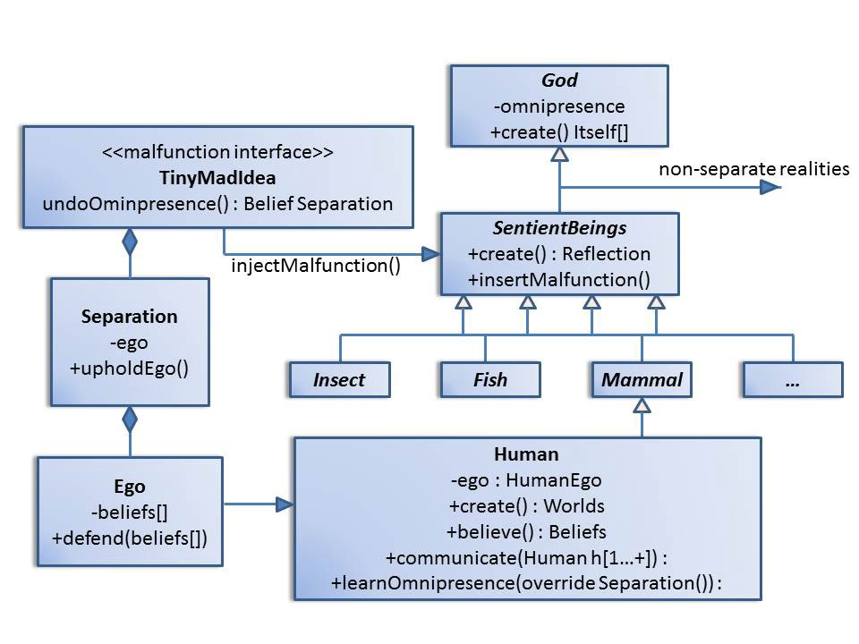
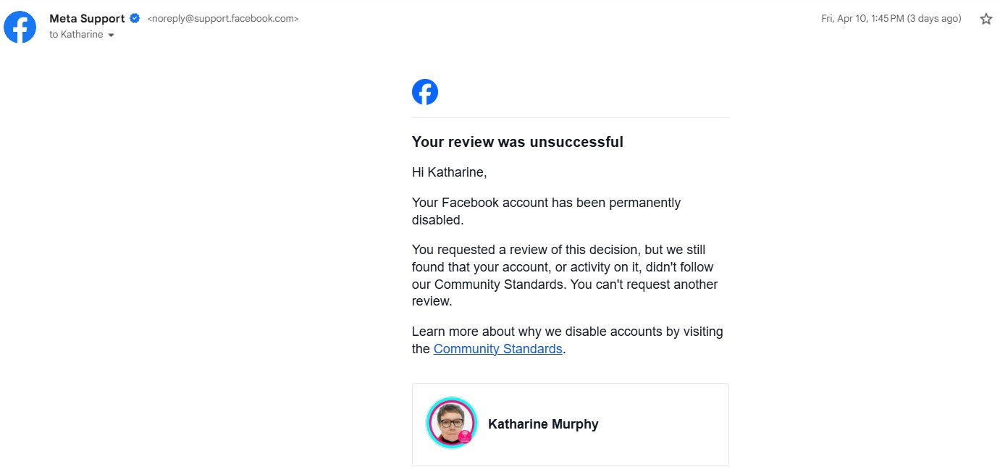

# April 2026

## Ending the tiny mad idea

## Service at Lourdes

- Someone is reporting my behavior in the baths back to criminal gangs who then send me notifications on X repeating things I have said or done that day.
- Due to this, I decide to tell my boss, Marie Therese, my recent history because it's clear to me someone could misrepresent me in a negative way and I want people to know the truth.
- She also saw that I was sick on [the last day of my service the previous July](../2025/july.md#lourdes) when I had to cancel my attendance because my eyes were stinging and I had the toxic headache from hell.
- I arrange a meeting with her.

!!! tip "What I say to Marie Therese"
    - I want to tell you a little bit about my history because I trust you and I know that people will lie about me.
    - For many decades, I have been targeted by Spanish criminal gangs, gitano poisoning sex gangs, at my homes in Spain - the details of all those Spanish addresses are in the Notre Dame de Lourdes database of the piscines.
    - They have been sedating me and coming into my homes and raping me, for decades.
    - I had no idea until recently.
    - I kept leaving Spain, and then returning; they were able to manipulate me to return.
    - The last time I lived there, from 2022-2025, I was studying the piano at the conservatory in the town.
    - What I didn't know was that these criminal gangs work as teachers and staff at the conservatory.
    - They had been poisoning me for many years so that I would have brain damage and not be able to recognize objects out of context.
    - I was drugged heavily with hallucinogens at the school too.
    - Four or five men came to the conservatory to teach a class I attended - with some children too - and I only recognized them as one man even though they looked very different.
    - This was filmed as pornography watched by millions around the world.
    - (Marie Therese gasps).
    - I knew something was happening because they were treating me so badly, but I had no idea the extent of it.
    - I thought they were silly little boys behaving like children, I had no idea they were poisoning and drugging students at the school for porn.
    - The thing is, I did not behave as they had expected because they did not frighten me.
    - And so they revealed themselves to me, that they were hacking me, and I knew immediately because I'm a computer scientist.
    - And something happened with one of those men; and he changed his mind about me.
    - I think he asked them to stop but they didn't stop, so he started to help me.
    - I fought them.
    - I'm still fighting them.
    - They follow me around the world, they have their people here in Lourdes too, they tried to murder me many times by poison.
    - I think that's why Mary brought me here in 2008; to help me.
    - When I was sick last July - you saw me - that was another murder attempt by poisoning.
    - Even when I'm back in London, they have their people there.
    - (She asks about the police).
    - These people are totally protected. 
    - I have been to the police countless times and no-one wants to know.
    - They are so protected, they are in schools drugging children, and raping babies for porn, and no-one cares.
    - (Marie Therese's eyes well-up with tears, so do mine.)
    - I'm not asking for help, I just want you to know because many people do know what has been going on and I want you to hear the truth from me because everyone is going to lie about me.
    - (Marie Therese tells me she will pray on it.)
    - I tell Marie Therese that it is OK with me if she tells everyone, or no-one, it's entirely up to her.
    - (We hug and get on with the service.)

- X notifications about things happening at the baths stop.
- I wonder if when the women find out exactly what the men have been doing all these years, the whole thing stops.

### Drugging and poisoning

- I'm drugged at least one time while I'm at Lourdes; I start feeling Mary very close to me, all around, and I'm having clear visions of a spectacular wedding dress.
- I suspect hallucinogens applied in a crowd in the street or at the sanctuary.
- I'm poisoned at least one time, possibly when I meet the Australian-Italian gypsy woman at the laundry, who was a lovely lady by the way and we had a nice chat, but right after I felt like I'd been heavily sedated.
- I suspect more examples of this occurred over the last six months but I'm noticing them less and less.
- However, my thumbnail ridges seem to have been marking these events and there have been multiple occasions.
- It's what they do, right?

### Loving voices

- One night, after yoga as I'm putting away my yoga things, I hear two voices I know outside my door chatting.
- I'm so amazed; but what's more amazing is this loving warm feeling coming all over my body and inside too.
- I'm happy to hear these voices.
- It's astonishing, though, and I immediately think it's a trick otherwise I would have ran out.
- I feel like I'm being tricked endlessly these days, as well as throughout my life, and I don't like it.

## Facebook shuts me down

## Médiathèque de Lourdes

- I go to the library in Lourdes to save this police statement on archive sites.
- The young man there grins at me, that grin, and puts his hand together like they ridiculed me endlessly for at the conservatory, and just like the blond woman did at the Red Lion.
- I'm sad that so many men are so porn-sick.
- I wonder if they get warned via WhatsApp groups or direct messages?
- It's literally every where I go.
- Are the gangs hoping that one of these idiots takes the initiative and attacks me; while filming obviously?
- Is this why no-one's doing a thing about it, because nearly all men in existence are complicit?

