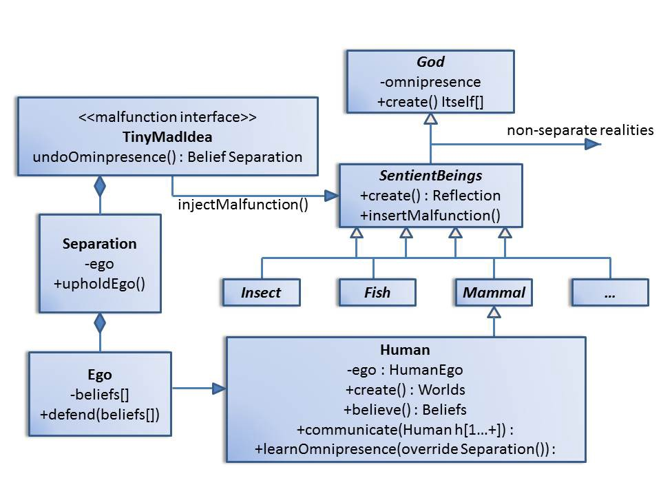
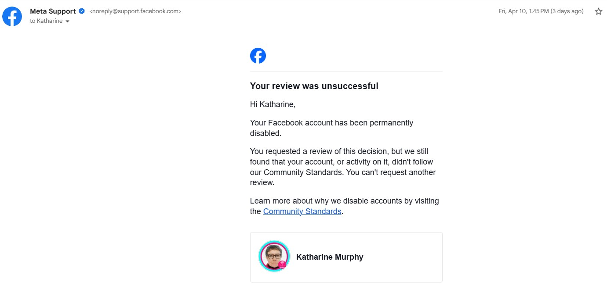

# April 2026

## Ending the tiny mad idea

- I continue to think of nothing else but saving the world.

- Seems I've been thinking about it for decades too, perhaps lifetimes.
- I won't stop thinking about it either, no matter how hard they try.
- I'll just keep on coming back until we're done.

## Service at Lourdes

- Someone is reporting my behavior in the baths back to criminal gangs who then send me notifications on X repeating things I have said verbatim, or describing things I have done that day.
- Due to this, I decide to tell my boss, Marie Therese, my recent history because it's clear to me someone will misrepresent me in a negative way and I want people to know the truth.
- She also saw that I had become sick on [the last day of my service the previous July](../2025/july.md#lourdes) when I had to cancel my attendance at the baths because my eyes were stinging and I had the toxic headache from hell.
- I arrange a meeting with her.

!!! tip "What I say to Marie Therese"
    - I want to tell you a little bit about my history because I trust you and I know that people will lie about me.
    - For many decades, I have been targeted by Spanish criminal gangs, gitano poisoning sex gangs, at my homes in Spain - the details of all those Spanish addresses are in the Notre Dame de Lourdes database of the piscines.
    - They have been sedating me and coming into my homes and raping me, for decades.
    - I had no idea until recently.
    - I kept leaving Spain, and then returning; they were able to manipulate me to return.
    - The last time I lived there, from 2022-2025, I was studying the piano at the conservatory in the town.
    - What I didn't know was that these criminal gangs work as teachers and staff at the conservatory.
    - They had been poisoning me for many years so that I would have brain damage and not be able to recognize objects out of context.
    - I was drugged heavily with hallucinogens at the school too.
    - Four or five men came to the conservatory to teach a class I attended - with some children too - and I only recognized them as one man even though they looked very different.
    - This was filmed as pornography watched by millions around the world.
    - (Marie Therese gasps).
    - I knew something was happening because they were treating me so badly, but I had no idea the extent of it.
    - I thought they were silly little boys behaving like children, I had no idea they were poisoning and drugging students at the school for porn.
    - The thing is, I did not behave as they had expected because they did not frighten me.
    - And so they revealed themselves to me, that they were hacking me, and I knew immediately because I'm a computer scientist.
    - And something happened with one of those men; and he changed his mind about me.
    - I think he asked them to stop but they didn't stop, so he started to help me.
    - I fought them.
    - I'm still fighting them.
    - They follow me around the world, they have their people here in Lourdes too, they tried to murder me many times by poison.
    - I think that's why Mary brought me here in 2008; to help me.
    - When I was sick last July - you saw me - that was another murder attempt by poisoning.
    - Even when I'm back in London, they have their people there.
    - (She asks about the police).
    - These people are totally protected. 
    - I have been to the police countless times and no-one wants to know.
    - They are so protected, they are in schools drugging children, and raping babies for porn, and no-one cares.
    - (Marie Therese's eyes well-up with tears, so do mine.)
    - I'm not asking for help, I just want you to know because many people do know what has been going on and I want you to hear the truth from me because everyone is going to lie about me.
    - (Marie Therese tells me she will pray on it.)
    - I tell Marie Therese that it is OK with me if she tells everyone, or no-one, it's entirely up to her.
    - (We hug and get on with the service.)

- X notifications about things happening at the baths stop.
- I wonder if when the women find out exactly what the men have been doing all these years, the whole thing stops.

### Chucking my iPhone

- I throw away my iPhone and a Samsung pad at the decheterrie in Lourdes.
- An agent, Mike, at the Holiday Inn in Bali in July will have a phone exactly like mine in his hand after one of our *games* and because I'd asked about his wife, Yvonne, online one evening. She had behaved strangely and disappeared the day before. She makes a reappearance and we have a chat, this is when he's sitting beside us with a phone just like mine in his hand (red Iphone 14, quite unique actually).
- I also make my X accounts, `@1FRGVN` and `@JackChardwood` inaccessible to me without jumping through some hoops.
- All my bad days cease.
- Isn't that interesting.
- I hope someone bothered to collect the phone.
- I guess Mike was telling me they had which is good, but will they bother doing anything with it?

### Drugging and poisoning

- I'm drugged at least one time while I'm at Lourdes; I start feeling Mary very close to me, all around, and I'm having clear visions of a spectacular wedding dress.
- I suspect hallucinogens applied in a crowd in the street or at the sanctuary.
- I'm poisoned at least one time, possibly when I meet the Australian-Italian gypsy woman at the laundry, who was a lovely lady by the way and we had a nice chat, but right after I felt like I'd been heavily sedated.
- I suspect more examples of this occurred over the last six months but I'm noticing them less and less.
- However, my thumbnail ridges seem to have been marking these events and there have been multiple occasions.
- It's what they do, right?

### Loving voices

- One night, after yoga - it may be a Friday - as I'm putting away my yoga things, I hear two voices I know well outside my door chatting.
- It's Mrs Wasserman, and another man I don't know the name of.
- I'm amazed; but what's more amazing is this loving warm feeling coming all over my body and inside too as I hear them chat about whether they're going to go to the procession, or whatever.
- The feeling is the *exact feeling* I had when I found out I was pregnant when I was 18 with my first even proper-ish boyfriend Ben - just two years after repeated sedated-gang-rape - and just before my mother told me they would not support me at all if I had the child, and broke my spirit.
- It was like a warm glow of joy traveling through my body.
- I'm so happy to hear these voices outside my door.
- It's astonishing, though, and I know it's a trick, otherwise I would have ran out.
- I feel like I'm being tricked endlessly these days, as well as throughout my life, and I don't like it.
- What would be the purpose of doing something like that? I suppose they were doing as much as they could to make me believe they were on my side - and I did, of course, my projection about the trustworthiness of people - and so I'd certainly attend the two important (for them) weeks of TT in Dublin coming up.

## Facebook shuts me down

## Médiathèque de Lourdes

- I go to the library in Lourdes to save this police statement on archive sites.
- The young man there grins at me, that grin, and puts his hand together like they ridiculed me endlessly for at the conservatory, and just like the blond woman did at the Red Lion.
- I'm sad that so many men are so porn-sick.
- I wonder if they get warned via WhatsApp groups or direct messages?
- It's literally every where I go.
- Are the gangs hoping that one of these idiots takes the initiative and attacks me; while filming obviously?
- Is this why no-one's doing a thing about it, because nearly all men in existence are complicit?

## Dublin Transforming Touch

- I attend two modules this month: module 2 with a new cohort I've never met before on the first week, and module 3 to complete a cycle with [the cohort from September again](../2025/september.md#dublin-transforming-touch-therapy-with-steve).

### Olly on the plane

- On the flight over from Lourdes, I see Olly from the iboga retreats in Montpelier, friend of [Sean Hamman](../2001-to-2010/2005.md#sean-hamman) and clearly implicated in the sedated-rape conspiracy.
- I have to wonder if I was sedated and raped on those courses too. They were full of extremely aggressive men.
- Bizarrely, like Richard from the same era who [I see in September 2025 at Newgrange with Steve](../2025/september.md#richard-at-newgrange), he's putting on a ridiculous Irish accent.
- I'm amazed.
- Is it another attempt at convincing me that someone is interested in stopping the mass sedation of women and children, but they're not really or they might have been nice to me, they have other things in mind?

### They're playing Ray of Light while I wait for the taxi

- Yup.

### Beckett Locke

- Hotel-cum-CIA training centre and egg-extraction lab for two weeks.

#### The abomination of desolation

- All unconsented-to activities undertaken on a person while they're sedated.
- Massive attack on the Golden Rule.

### I see Auggie Augustus

- You remember [Ugly from 2001](../2001-to-2010/2001.md#asking-brian-if-he-remembered-ugly-in-2024) and then again in [August 2024](../2024/august.md#ugly).
- Well, his face is hidden in his jacket but they've set up a meet as I'm walking back to Beckett Locke from the Avila centre one evening.
- God sees him clearly and makes me gnash my teeth at him.
- The agent laughs uproariously as I do so.
- It must have been really funny.

### I see an IRA man

- One morning on my way to the Avila centre, there's a big crowd of Americans in front of me and they're all going on about how they have a meeting with Ira and I'm thinking, what now..
- A little later, I see an agent I'm familiar with and he's standing a bit away from a man with extremely shiny shoes who has his back to me initially but then turns around to look as I walk past him.
- I'm amazed at how shiny this man's shoes are so I don't see the man's face but I saw his hair.
- I've no idea what this is all about.

### Steve is having chemo, but doesn't have cancer

- Steve, Robin, Gerardine, and I are having lunch near the Avila centre.
- Steve tells me he's on chemo. 
- He has lost an awful lot of weight since I saw him previously in September 2025.
- He tells me it's not cancer but his physician has told me he has an extremely rare condition which only responds to chemotherapy which he's having once a week.
- I find this upsetting.

### Un oeuf est un oeuf

- My little *oeuf*.
- It's a girl.
- This was a sort of meme that second week, or maybe both weeks, Steve kept saying "Enough is enough", and I remembered the joke about only one egg for breakfast in France.
- When I told him, while at the same time thinking about pregnancy, he looked so alarmed.
- He looked alarmed just like that when he suggested I come live with him in Texas, I could have the room at the top of the stairs and I said, *is it the attic room*, as a joke (you know, mad woman lives in the attic, never comes down, Wide Sargasso Sea, etc.) and he looked so alarmed.
- Is he the similarly unconsenting father?
- Is this why they put hundreds of thousands into trying to get us together?
- Is my little oeuf destined for a life as a lab rat? I'm going to pray it's not so.
- This is so hard.
- Thousands may have raped me but this, if true, is infinitely more violating.
- I notice another possible entry point for pinhole surgery, and that appeared back in November in Bangkok.
- Is this why the endless distraction and lies, just letting me wander around, maybe crash the car, maybe get drugged again at Lourdes, no concern for my health and safety at all, just to keep me busy while this madness goes on?
- And then I can be discarded.
- Was that the plan?
- And I remember a BIG dream from when I was so small, in Ireland again, and it was about a giant egg on the wall... I can see it now. I said Humpty Dumpty.
- And more recently a dream of the future where I am with a grown up woman who I feel is my daughter, but I thought that might be squirrel's daughter, if he has one.
- Will Davina be coming round one day when my little oeuf realizes the truth and she looks exactly like me?

### She reminds me of my mother

- I have a massive memory fly in during the first week where all the attendees were pretty cool and loving.
- It's from [the first course I did with Steve](../2011-to-2020/2020.md#she-reminds-me-of-my-mother) when I was perplexed about why Steve's slides had this seagull in them.
- I was so obsessed with these incongruent photos at the time I actually asked him, in amongst nearly a hundred professional psychotherapists asking very normal questions, why he had a photo of a seagull in his slides.
- He answered that the seagull had been following him around in Dublin in a park, and the bird had reminded him of his mother.
- I was amazed to remember this, and thought about [the tears from March 2023](../2023/march.md#dreaming-of-the-trumpet-teacher) and wondered if I'd channeled the man's mother at that moment...
- But then later, I remembered my mother always told me she wants to be a seagull when she comes back, and I always had this feeling she'd be at the window ledge at my house looking for food, and following me around, and pooing everywhere. It was a bit of a joke between us.

### Steve shares his past a little

- He always tells his groups he never wanted to teach.
- Sometimes, he tells us about what brought him to developing the TT system.
- He has shared that he was finding people with apparently incurable conditions were getting well, all the time.
- His sons are testament to the gift God gave him.
- It is interesting because the content shifts and changes constantly, it can never be pinned down, which is amusing.
- People are regularly expressing concern about what happens if Steve's not around, because other people find it hard to teach what he teaches, given it is coming direct from, what Steve would call Holy Spirit, what I would call God.

### I stepped in the chili sauce

- Agents everywhere we go.

### A first roasting

- Yeah, I didn't know why they turned on me on that course, but they certainly did.
- A little taste before the big one in Bali?
- A test to see how I might take a bit of psychological torture?
- I didn't take it well. But it's not the torture itself - I was everyone's breakfast, lunch, and dinner in Denia for years, remember? - it's the fact that people you thought you could trust are doing it.
- That's what really gets me, the realization that something you thought you could always turn to as a safe space for healing has just disappeared, poof!
- Anyway.
- Clearly intending to get rid of me, drive me mad maybe, leave me desperate and unhappy, get the lab rat they need for some sick purpose, and let the rapists carry on killing and maiming.
- Lovely.

#### I thought I'd talk about something important with the group

- Then decided not to due to incoming attacks.

### A waitress keeps interrupting us

- Steve and I go for a drink one evening; I think it's the evening before the last night of the first week's course.
- There are agents all over the bar.
- We talk.
- I try to bring up the forgivenet and saving the world, again, and every single time I do, the waitress buts in with some inconsequential nonsense.
- I think Steve set this up too, and is signalling to her every time I start to bring up the conversation about *let's save the world why don't we*.
- As if there was something more important.
- Bananas!

### My sense of direction is temporarily healed

- I've had a couple of glasses of wine when I leave Steve.
- He actually tells me to stop following him around as he walks away, which is a bit strange, but I think he's cross with me for wondering if he and Yvonne aren't a little bit in love.
- Although, now I realize Yvonne is probably an agent sent to annoy and frustrate him, to keep him on his toes.
- Anyway.
- I walk back to CIA HQ, and it's about an hour's walk, and I feel like I have got my sense of direction back totally!
- Since the poisoning in Denia for brain-damaged porn-star requirements, I have had no sense of direction at all, I'm more clumsy than I've ever been, ... in fact I have a list of brain-damage symptoms which, as I was mentioning, if anyone gave the tiniest sh*t about - in law-enforcement terms for evidence and because being brain-damaged is no fun - would have got me some healthcare from the people controlling my every move, don't you think?
- So the gigue is up.
- Sadly, it was only a temporary healing, but it fills me with confidence.

### I have some questions for Steve about the course

- It was an assumption of mine that Steve would have been as obsessed about the course as I am.
- It turns out I was wrong, and he is a staunch catholic and found my questions a bit offensive.
- So that was interesting.
- He had done the workbook exercises one time, however, if I remember rightly.

## I'm signing

- A friend tells me I'm signing.
- I don't know what they mean.
- Over the next few weeks, I catch myself making strange hand gestures to people and I realize I am actually signing! Well, God is.
- I have no idea what I'm communicating, but that's also true of much that I say and write too.
- I expect I only get about 5% of what's really being said.
