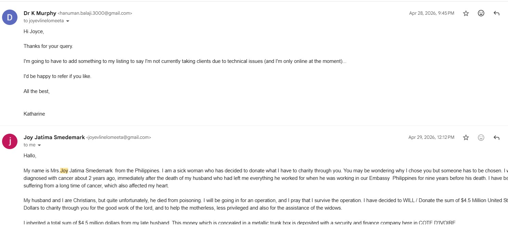
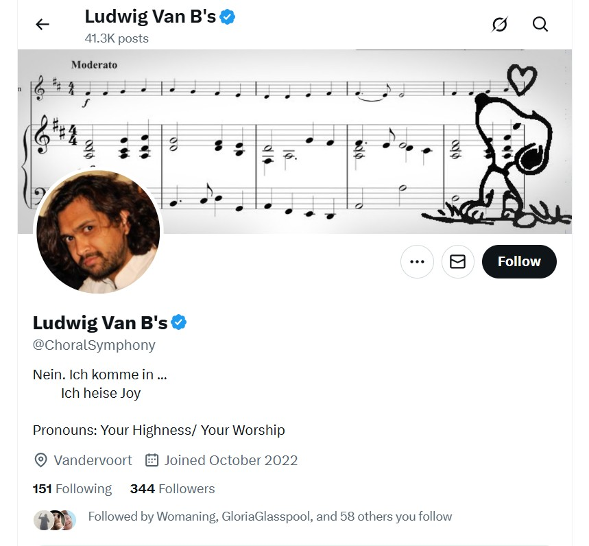

# April 2026

## Ending the tiny mad idea

- I continue to think of nothing else but saving the world.

- Seems I've been thinking about it for decades too, perhaps lifetimes.
- I won't stop thinking about it either, no matter how hard they try.
- I'll just keep on coming back until we're done.

## Service at Lourdes

!!! tip "Summary of secret service (CIA) activity in Lourdes"
    - Secret services put energy into making me believe criminal gangs are still stalking me, trying to set me up with another man, and getting American Catholics to genuinely stalk me.

- Someone is reporting my words and behavior in the baths back to criminal gangs who then send me notifications on X repeating things I have said verbatim, or describing things I have done that day.
- Due to this, I decide to tell my boss, Marie Therese, my recent history because it's clear to me someone will misrepresent me in a negative way and I want people to know the truth.
- She also saw that I had become sick on [the last day of my service the previous July](../2025/july.md#lourdes) when I had to cancel my attendance at the baths because my eyes were stinging and I had the toxic headache from hell.
- I arrange a meeting with her.

!!! tip "What I say to Marie Therese"
    - I want to tell you a little bit about my history because I trust you and I know that people will lie about me.
    - For many decades, I have been targeted by Spanish criminal gangs, gitano poisoning sex gangs, at my homes in Spain - the details of all those Spanish addresses are in the Notre Dame de Lourdes database of the piscines.
    - They have been sedating me and coming into my homes and raping me, for decades.
    - I had no idea until recently.
    - I kept leaving Spain, and then returning; they were able to manipulate me to return.
    - The last time I lived there, from 2022-2025, I was studying the piano at the conservatory in the town.
    - What I didn't know was that these criminal gangs work as teachers and staff at the conservatory.
    - They had been poisoning me for many years so that I would have brain damage and not be able to recognize objects out of context.
    - I was drugged heavily with hallucinogens at the school too.
    - Four or five men came to the conservatory to teach a class I attended - with some children too - and I only recognized them as one man even though they looked very different.
    - This was filmed as pornography watched by millions around the world.
    - (Marie Therese gasps).
    - I knew something was happening because they were treating me so badly, but I had no idea the extent of it.
    - I thought they were silly little boys behaving like children, I had no idea they were poisoning and drugging students at the school for porn.
    - The thing is, I did not behave as they had expected because they did not frighten me.
    - And so they revealed themselves to me, that they were hacking me, and I knew immediately because I'm a computer scientist.
    - And something happened with one of those men; and he changed his mind about me.
    - I think he asked them to stop but they didn't stop, so he started to help me.
    - I fought them.
    - I'm still fighting them.
    - They follow me around the world, they have their people here in Lourdes too, they tried to murder me many times by poison.
    - I think that's why Mary brought me here in 2008; to help me.
    - When I was sick last July - you saw me - that was another murder attempt by poisoning.
    - Even when I'm back in London, they have their people there.
    - (She asks about the police).
    - These people are totally protected. 
    - I have been to the police countless times and no-one wants to know.
    - They are so protected, they are in schools drugging children, and raping babies for porn, and no-one cares.
    - (Marie Therese's eyes well-up with tears, so do mine.)
    - I'm not asking for help, I just want you to know because many people do know what has been going on and I want you to hear the truth from me because everyone is going to lie about me.
    - (Marie Therese tells me she will pray on it.)
    - I tell Marie Therese that it is OK with me if she tells everyone, or no-one, it's entirely up to her.
    - (We hug and get on with the service.)

- X notifications about things happening at the baths stop.
- I wonder if when the women find out exactly what the men have been doing all these years, the whole thing stops.
- This will be an interesting unravel; as will how they move people to the front of the queue to ensure they see me, rather than anyone else (not the British women, I think that was God arranging it).
- The woman who was set up for me to believe she was listening and reporting back was Portuguese - like Sandra - and did something weird with the donations which made me think she must have been a criminal.
- Coincidence? I think not.

### Chucking my iPhone

- I throw away my iPhone and a Samsung pad at the decheterrie in Lourdes.
- The reason I do this is because it is obvious to me that I am being manipulated, hard, online to feel emotions that I do not like, and I believe it is coming from the phone rather than the laptop.
- It's possible I was manipulated by the CIA to throw away the phone and the mini-pad too: more isolation means I'm easier to murder.
- An agent, Mike, at the Holiday Inn in Bali in July toys with a phone exactly like this one after one of our *games* and because I'd asked about his wife, Yvonne, online one evening.
- She had behaved strangely and disappeared a few days before and I hadn't seen them anywhere.
- I comment online in the way I communicate to those hacking me: *oh what happened to Yvonne?*
- The next day, she makes a reappearance and we have a chat, and this is when he's sitting beside us with a phone just like mine in his hand (red Iphone 14, quite unique actually), toying with it, taking the piss.
- Do they do that *only* to targets they intend to murder, or steal eggs from, or some other dastardly act, or do they do it to all targets?
- Yvonne seemed to think I wouldn't be around in the future... but I may have mistaken her sentiment.
- At the same time, I also make my X accounts, `@1FRGVN` and `@JackChardwood` inaccessible to me without jumping through some hoops.
- All my bad days cease.
- Isn't that interesting.
- I'm sure they wanted me to delete the accounts rather than just stop using them, although they've managed to tailor the search function on them so it looks like I haven't posted things I know I did post!

### Drugging and poisoning

- I'm drugged at least one time while I'm at Lourdes; I start feeling Mary very close to me, all around, and I'm having clear visions of a spectacular wedding dress.
- Incidentally, this is the same time I remember [the Daniel incident](../2011-to-2020/2013.md#daniel) and I believe that was their main intention with it.
- I think this was when I meet the Australian-Italian gypsy woman at the laundry, who was a lovely lady by the way and we had a nice chat, but right after I felt like I'd been heavily sedated.
- She looks like a woman, *Anat*, an artist that friends me on Facebook shortly afterwards, and posts multiple mousse messages - including Snoopy roasting on a spit after [they roasted me in Dublin](#a-first-roasting).
- However, [my thumbnail ridges (Beau's lines)](../2001-to-2010/2006.md#beaus-lines) mark poisoning and maybe even drugging events too, and there have been multiple occasions.

### Mrs Wasserman is outside my door at the Mercure

- One night, after yoga - it may be a Friday after Penny's class - as I'm putting away my yoga things, I hear two voices I know well outside my door chatting.
- It's Mrs Wasserman, and another man I don't know the name of.
- I'm amazed; but what's more amazing is this loving warm feeling coming all over my body and inside too as I hear them chat about whether they're going to go to the procession, or whatever.
- The feeling is the *exact feeling* I had when I found out I was pregnant when I was 18 with my first ever proper-ish boyfriend Ben - just two years after repeated, sedated gang-rape - and just before my mother told me she and my dad would not support me at all if I had the child, and broke my spirit.
- It was like a warm glow of joy traveling through my body.
- I'm so happy to hear these voices outside my door.
- It's astonishing, though, and I know it's a trick, otherwise I would have ran out.
- I feel like I'm being tricked endlessly these days, as well as throughout my life, and I don't like it.
- What would be the purpose of doing something like that? 
- I suppose they were doing as much as they could to make me believe they were on my side - and I did, of course, my projection about the trustworthiness of people - and so I'd certainly attend the two important (for them) weeks of TT in Dublin coming up, and feel dreadful when they turned on me as if they didn't like me anymore and weren't my friends.
- From there, they can pretend to be anyone, they think.
- It's very school playground isn't it.
- Except the feeling I got, I believe in retrospect, was God's way of telling me in advance that this is how He gets my babies back for me, with a strong and joyful body memory.
- Does this mean the baby they stole for Jonathan is the child Ben Webber and I made back in 1991?

### American agents all over the baths and the town

- They're everywhere; and I do not get a good feeling from them at all.
- Something's up and it bodes badly for me because they're not being very nice to me - snide comment in the baths one afternoon.
- In fact, it's so relentless I don't go back to the baths to volunteer after my week's service and I had been intending to go every afternoon!
- There's bad blood between the Americans and Marie Therese too.
- Do you think they all believe the lie that if you're raped it's never the rapist's fault and the victim is somehow to blame?
- That somehow a person who has been sexually abused so much is not allowed to be holy?
- Amazing.

## Facebook shuts me down

- I was steadily posting snippets from my book, and I'd got to the bit where [the hairdresser in Muswell Hill mullered my hair](../2025/november.md#haircut-disaster-on-the-same-day) - not the time before when I was in there with dad and "madam" turned up and sat beside me.
- I mentioned Antonio and I had started our military service probably by August 2024 when everyone was starting to panic, and I lost access to Facebook immediately and completely and inexplicably.

- So I thought I'd better not mention that again... except, why would they want me to keep that secret?
- Is it because, actually, Antonio did reach out to the Israeli's for help behind the mousse's back?
- I expect he did.
- And, it turns out, I'm a weapons designer for the IDF as well as everything else.
- Antonio gave me what I had been wishing for online since October 7th 2023.

## Médiathèque de Lourdes

- I go to the library in Lourdes to save this police statement on archive sites.
- The young man there grins at me, that grin, and puts his hand together like they ridiculed me endlessly for at the conservatory, and just like the blond woman did at the Red Lion.
- There's a policeman sitting next to me too.
- Was the man prompted to do this, and if so by whom?
- It was an odd thing to do out of the blue unless I'm really, really famous, which I expect I'm not. Yet.

## Dublin Transforming Touch

- I attend two modules this month: module 2 with a new cohort I've never met before on the first week, and module 3 to complete a cycle with [the cohort from September again](../2025/september.md#dublin-transforming-touch-therapy-with-steve).

### Olly on the plane

- On the flight over from Lourdes, I see Olly from the iboga retreats in Montpelier around 2005/6, friend of [Sean Hamman](../2001-to-2010/2005.md#sean-hamman) and thus implicated in the sedated-rape conspiracy.
- He saw me too, and tried to hide.
- I have to wonder if I was sedated and raped on those courses too. They were full of heaps of extremely aggressive men and a sprinkling of disingenuous women.
- Bizarrely, like Richard from the same era who [I see in September 2025 at Newgrange with Steve](../2025/september.md#richard-at-newgrange), he's putting on a ridiculous Irish accent.
- I'm amazed.
- And also just like Richard, there's a whole contrived back story him and the man walking beside him are going through.
- Is it another attempt at convincing me that someone is interested in stopping the mass sedation and sexual assault of women and children for porn?
- They literally have a database of all the set ups they've done for my behalf over the years and they're going through them.
- Did the man tell Olly to hide when he saw me, and to put on a weird Irish accent?
- He'd have been sitting about seven rows back on the window seat on the right.

### They're playing Ray of Light while I wait for the taxi

- I'm waiting for the taxi at a cafe I've been told to wait at by Booking.com; a site which the mousses have been using to tailor everywhere I stay for some time, probably decades.
- They're playing Madonna's *Ray of Light* as I stand there; a bonafide #GreatRay.
- The taxi driver calls to tell me where to go to meet him, and it's not here.
- The mousses are flirting with me, buttering me up.

### Beckett Locke

- An extraordinary place.
- They set the Islamic taxi driver to be weird with me on the way from the airport (organized through Booking.com).
- Take her to a different place up the road, they told him.
- My take is hotel-cum-CIA training centre and egg-extraction lab.
- Correct me if I'm wrong.
- On arrival, a Northern Ireland man with a Belfast accent, black hair and pale skin, is hopping around in reception, glaring at me, talking a hundred miles an hour. I'm certain he's an actor designed to make me think Belfast criminals (see Noah sedated-porn horror - have you found that yet?) are still stalking me.
- I have a very dark room on the inside with a small window, like a cell.
- I'm making fists while I sleep and creating a callous in my left palm.
- I wake up in the middle of the night - right in the middle of the bed on my back, down from the pillow, completely straight, a position I never move into - with a noise that sounds like people running while carrying a bag of ice down the corridor.
- On the day I leave, the (Israeli? or am I supposed to think it? or actually Israeli? I think actually...) masseuse has followed me from the Anantara and is standing across the street watching me, trying to hide but not really.
- I see her out of the corner of my eye and try to focus on her, and she goes behind the lamppost, and the manager comes out of reception hurriedly, ushers me inside, and locks the door a bit angrily, I thought.

#### The abomination of desolation

- We could expand the definition to all and any unconsented-to activity undertaken on a person while they're sedated.
- A massive disregard of the Golden Rule.
- So much for the healing, Steve.

### Steve mentions the King

- Steve, Robin, and I are having dinner at the hotel near the Avila centre.
- I think Robin is probably one of the main intuitives; can you say *managing* intuitives? It's all so weird, anyway.
- It's probably just a couple of days before the first course begins and maybe the first time I see them.
- Steve announces that the King is visiting Trump next week and at that time he will step down, move to the Caribbean, and his son will become king in his place. 
- I ask Steve where he heard this (nonsense, I don't say nonsense but my face and grin is saying it)? 
- Steve seems a little surprised I haven't just accepted everything he just told me.
- He mumbles AOL.. I know he's being fed BS online, but I'm a little curious as to how they trigger him to say it to me, is this a "formal" instruction, or manipulated?
- How involved is Steve, I wonder. He sees and notices - see [Kathleen Love's disappearance](../2025/may.md#steve-gets-upset-with-me) - but is he involved in the decision making or do they just control him like they clearly wanted to control me?

### I see Auggie Augustus

- You remember [Ugly from 2001](../2001-to-2010/2001.md#asking-brian-if-he-remembered-ugly-in-2024) and then again in [August 2024](../2024/august.md#ugly) as the gangs were panicking especially due to [mine and Antonio's military service I just mentioned](#facebook-shuts-me-down) which upset the Americans when I mentioned it, a lot.
- I've started calling him Auggie after a film I saw in Jerusalem in July 2026 at the Dan Panorama about a little boy with a facial disfigurement which may or may not be a #GreatRay given that Auggie is obviously in the Bible: Isaiah 52 to be precise.
- Well, his face is hidden in his jacket but they've set up a meet as I'm walking back to Beckett Locke from the Avila centre one evening.
- God sees him clearly and makes me gnash my teeth at him.
- The agent laughs uproariously as I do so.
- It must have been really funny.
- When Auggie realized he had been set up in [August 2024 at the baths in Cauterets](../2024/august.md#ugly), he defected to the CIA and started grassing everyone up apparently.
- Auggie did not know that the American's had set him up, and that they work very closely with the Lopez Cano's on practically everything in Dénia, and so he defected to the same side essentially and there were no arrests, nothing changed, and the criminals just kept happily and safely raping the babies.

### I see an IRA man

- On a peaceful walk one morning on my way to the Avila centre, not many people around, there's suddenly a big crowd of Americans in front of me and they're all going on about how they have a meeting with *Ira* and I'm thinking, what now..
- A little later, I see an agent I'm familiar with and he's standing a bit away from a man with extremely shiny shoes who has his back to me initially but then turns around to look as I walk past him.
- I'm so amazed at how shiny this man's shoes are, I don't see the man's face but I saw his grey, longish, curly-coiffed hair.
- I've no idea what this is all about.
- I only get the Ira name connection a good deal later.
- I still have no idea why they would do such a thing; a more exaggerated distraction after sedated surgery due to the inherent guilt they must have been suffering without realizing it?

### Steve is having chemo, but doesn't have cancer

- Steve, Robin, Gerardine, and I are having lunch near the Avila centre.
- Steve tells me he's on chemo. 
- He has lost an awful lot of weight since I saw him previously in September 2025.
- He tells me it's not cancer but his physician has told me he has an extremely rare condition which only responds to chemotherapy which he's having once a week.
- I find this upsetting.
- They're poisoning him.

### Un oeuf est un oeuf

- My little *oeufs*.
- This was a sort of meme that second week, or maybe both weeks.
- Steve kept saying "enough is enough" in class, and I remembered the joke about only one egg for breakfast in France.
- When I told him the joke, while at the same time thinking about pregnancy, he looked so alarmed.
- He frowned and went silent for a long time.
- He had looked similarly alarmed when he suggested I come live with him in Texas on the first day or the first course, that I could have the room at the top of the stairs and I said, *is it the attic room*, as a joke (you know, mad woman lives in the attic, never comes down, controlled...) and he looked so alarmed that I had clearly declined.
- Is that why they decided to stop playing nice with me in the second week?
- Is he a consenting or unconsenting father?
- Is he 100% aware of the theft of my eggs and has in fact approved it and has been fielding requests from women who want to be surrogate mothers of my children?
- Is this why they put [hundreds of thousands into trying to get me and Steve together](../2025/september.md#weddings-at-the-church)?
- They seemed to have some desire that I experience motherhood of my own children, but only one of them!
- When a relationship was Steve was obviously not going to work for them, they kept on trying to set up me up with men with whom I might be a parent for one of my "adopted" children (see Marc at Lourdes, Mani and Randy in Tibet, and others). 
- Are my little oeufs destined for life as lab rats?
- I'm going to pray it's not so but look at how they treat Steve!
- This is so hard.
- Thousands may have raped me but this, if true, is infinitely more violating.
- I notice another possible entry point for pinhole surgery that appeared back in November in Bangkok on my left groin region.
- Is this the real reason behind the endless distraction and lies, just letting me wander around, maybe crash the car - they can steal *all* the eggs from a body about to die, see [Italian roads in February](february.md#dangerous-driving-in-italy) - zero concern for my health and safety and wellbeing, just to keep me busy while they get what they want?

### She reminds me of my mother

- I have a massive memory fly in during the first week where all the attendees were pretty cool and loving.
- It's from [the first course I did with Steve](../2011-to-2020/2020.md#she-reminds-me-of-my-mother) when I was perplexed about why Steve's slides had this seagull in them.
- I was so obsessed with these incongruent photos at the time I actually asked him, in amongst nearly a hundred professional psychotherapists asking very normal questions, why he had a photo of a seagull in his slides.
- He answered that the seagull had been following him around in Dublin in a park, and the bird had reminded him of his mother.
- I was amazed to remember this, and thought about [the tears from March 2023](../2023/march.md#dreaming-of-the-trumpet-teacher) and wondered if I'd channeled the man's mother at that moment...
- And then later, I remembered my mother always told me she wants to be a seagull when she comes back, and I always had this feeling she'd be at the window ledge at my house looking for food, and following me around, and pooing everywhere. It was a bit of a joke between us.
- And in September 2026, I realize that all the thoughts and ideas that convinced the oppressors they were winning and I knew nothing were put in my mind by God.

### Steve shares his past a little

- He always tells his groups he never wanted to teach.
- Sometimes, he tells us about what started him developing the TT system, about how he adopted two little babies who were totally traumatized, hopeless cases, and healed them.
- He has shared that while he was practicing, he was finding people with apparently incurable conditions were getting well, all the time.
- It got him noticed.
- His sons are testament to the gift God gave him but I hope his success with them didn't change US policy on men adopting babies because he said on this course that the first months of the adoption he thought he was going to murder them it was so hard.
- So he prayed, and God came to the rescue.
- I find it interesting that the content of his courses shift and change constantly, it can never be pinned down, which is amusing.
- People are regularly expressing concern about what happens if Steve's not around, because other people find it hard to teach what he teaches, given it is coming direct from what Steve would call Holy Spirit, what I would call God and God cannot be controlled by evildoers.

### "I stepped in the chili sauce"

- Agents everywhere we go.
- Steve, Robin, and I have lunch at a falafel joint in the Temple Bar.
- The usual CIA man is sitting close by (it's never the same one, but they dress so specifically, as I mentioned).
- I drop the chili sauce on the floor and as we're getting up to leave I step in it, and declare it.
- I find this amusing. I wonder if he did.
- More of God's deflection. So marvelous.

### Adam

- I have told my "friends" online about my suspicions of Adam a lot.
- They confirm it, online.
- At class, there is something going on with him and Steve, and Steve is saying to him: *we accept everyone on the course* while Adam's head is down and he's looking sad.
- And honestly I don't know now if they've set it up and I missed something about who Adam is really working for.
- There is one sure-fire way to tell if it's the mousses... they tell you to shut up if you start telling them something of your story.
- Adam did that. A lot of people did that.
- Normal people don't do that.
- He's an actor, isn't he.
- Do they instruct the actors something like: *if she starts talking about the porn-gangs and poisoning, stop her*?

### A first roasting

- Yeah, I didn't know why they turned on me on that course, but they certainly did.
- It's possibly because I turned down Steve's offer to go live with him in Texas.
- As a prelude, Robin and Steve were testing my trigger reactions. One such test was while we were waiting to go to lunch, and Robin pipes up, *oh my friend Damien has just called me*, and I know she's testing to see how I react to my dad's name.
- So I say: *Damien, the ultimate in horror*, in my movie announcer voice. And she doesn't mention it again.
- So they were poking already, but it was the second course, module 3, with [the cohort I had met in September](../2025/september.md#dublin-transforming-touch-therapy-with-steve) where the group really turned on me.
- Guilt expressed maybe?
- A test to see how I might take a bit of psychological torture?
- I had already had a bit of that in consultation so it wasn't a huge surprise. And this particular group - that they had formed right after poisoning and the UN kidnap in July/August 2025 - was full of really obvious spies.
- Before they started in on me, just before the course started, I had received a query from the [Transforming Touch referral system](https://coregulatingtouch.com/) - where people can contact you if you want healing.

- I thought it was a genuine request from a woman  initially calling herself *Joyce*, then *Joy* later on.
- I'm unable to access the email on the website where I was notified about it now, I don't know why, but I replied in any case telling the person I was not taking any clients, would they like a referral.
- At the same time, I realize I need to change my profile details, but I'm unable to figure out how to do it.
- I tell a woman on the course I might have a referral for her, and ask Gerardine how to access the site to make an edit again.
- The woman responds in the meantime.

- It's bogus.
- This is the only query I have ever had on that site.
- Here's my listing: https://coregulatingtouch.com/business-directory/dr-katharine-murphy-ttp-london-uk/ and I've just found out how to edit it too.
- When the psychological terror-meme mentions started, including:
    - Steve saying "switcheroo".
    - The German woman who had called me "Saint Katharine" referencing music and music study.
    - This sort of thing..
- The German woman mentions *Joy*, again and again, in an exaggerated manner, and I realize after a bit they're referring to the query email, and perhaps something broader too.
- Later, I wonder if this *Joy* is referenced in [extremely early fake accounts on Twitter, right in the midst of fighting the porn-gangs of Dénia](../2024/may.md#hazel-smith-pretends-to-be-esteve-online) when I still thought everyone talking to me was mostly Hazel or Domingo.
- See below "My name is Joy", in German!

- I think the TT crowd wanted me to leave them. They must have.
- I guess if they're a secret business, and I become extraordinarily famous, they'd risk everything keeping me on... but I'm sure there's kinder more loving ways to do something like this! Isn't it? A better way, maybe?
- I didn't take it well. 
- I started to shake and my wrist (where there's an unusual injury that could do with a scan and examination) started to quiver - this happened in savasana at Loka Yoga one morning too.
- I guess everyone knows why, apart from me.
- I got a blanket, sat behind the circle on the second line, put the blanket over myself and hid.
- It's not the torture itself - I was everyone's breakfast, lunch, and dinner in Dénia for years, remember? - it's the fact that people you thought you could trust are doing it.
- And what really got me, was the realization that something I thought I could always turn to as a safe space for healing just disappeared, poof!
- The roasting [they give me in Bali](july.md#the-psychological-torture-begins) is exactly the same procedure but at a super enhanced level with more intense drugging.
- They can't possibly have intended my ongoing survival.

#### I thought I'd talk about something important with the group

- Then I decided not to due to incoming attacks.

### I want to murder Trump

- I'm sitting with a group of them at tea on Friday 24th April.
- One of them, Dennis, reminds me that [the very first man I ever met at Steve's things back in 2020 was called Dennis](../2011-to-2020/2020.md#transforming-touch).
- A woman is speaking about Trump.
- She says, forcefully, that she wants to murder him. And she means it too, it sounds like.
- I was thinking, that's a bit strong.. I was shocked actually.. even more so because no-one else at the table disagreed with her and they're all supposed to be healers.
- So I said something like, *wow, people are really divided contentiously aren't they* and went for a walk.
- Then, the very next day, someone actually did try to kill him!
- Do you think "assassins" might be part of the intuitive program too?

### A waitress keeps interrupting us

- Steve and I go for a drink one evening; I think it's the evening before the last night of the first week's course.
- There are agents all over the bar.
- We talk.
- I try to bring up the forgivenet and saving the world, again, and every single time I do, the waitress butts in with some inconsequential nonsense.
- I think Steve set this up too, and is signalling to her every time I start to bring up the conversation about *let's save the world why don't we*.
- As if there was something more important to do.
- Bananas!

### My sense of direction is temporarily healed

- I've had a couple of glasses of wine when I leave Steve.
- He actually tells me to stop following him around as he walks away, which is a bit strange, but I think he's cross with me for wondering out loud if he and Yvonne aren't a little bit in love.
- Although, now I realize Yvonne is probably an agent sent to annoy and frustrate him, to keep him on his toes.
- He'd been bullying Yvonne and Gerardine quite a lot already. I don't think Gerardine's a spy. You never know though.
- Yvonne brings out an ugly and oppressive side of Steve, and so did Gerardine this course, something I too bore the brunt of in Israel in May 2025.
- Perhaps women do it.
- I walk back to CIA HQ, and it's about an hour's walk, and I feel like I have got my sense of direction back totally!
- Since the poisoning in Dénia for brain-damaged porn-star requirements, I have had no sense of direction at all, I'm more clumsy than I've ever been, ... in fact I have a list of brain-damage symptoms which, as I was mentioning, if anyone gave the tiniest sh*t about - in law-enforcement terms for evidence and because being brain-damaged is no fun - would have got me analysed in detail and organized some healthcare, don't you think?
- Instead, a random man at the beach does an impromptu test and never speaks to me again.
- So the gigue is up.
- Sadly, the return of my sense of direction was only a temporary healing, but it fills me with confidence.

### I have some questions for Steve about the course

- It was an assumption of mine that Steve would have been as obsessed about the course (ACIM) as I am.
- It turns out I was wrong, and he is a staunch catholic and found my questions a bit offensive.
- So that was interesting.
- He had done the workbook exercises one time, however, if I remember rightly.
- So he doesn't know the course at all.

### I'm leaving and someone makes me cry

- One of my classmates as I'm leaving says something that makes me cry.
- It's only now I realize how much they all despise me, just like the porn-gangs and billions of men around the world.
- It's extraordinary.
- One criminal gang took the place of another. 
- The only difference was the budget.
- The goal in content, although not form, is the same.
- The Light really blinds doesn't it.
- It's the same woman who told me she thought Adam was beautiful in September 2025, and I have to wonder why she said that, and if she was hinting at a relationship.

## I'm signing

- A friend tells me I'm signing.
- I don't know what they mean.
- Over the next few weeks, I catch myself making strange hand gestures to people and I realize I am actually signing! Well, God is.
- I have no idea what I'm communicating, but that's also true of much that I say and write too.
- I expect I only get about 5% of what's really being said.
