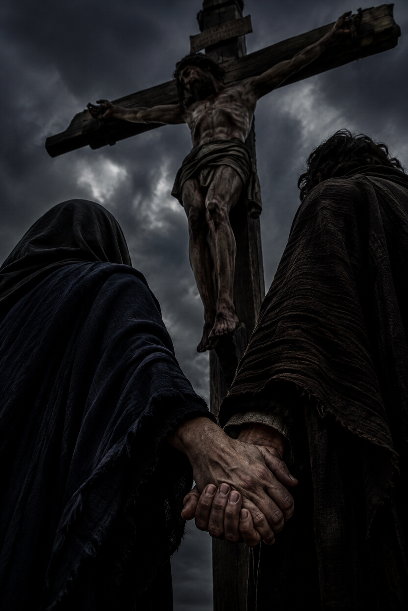
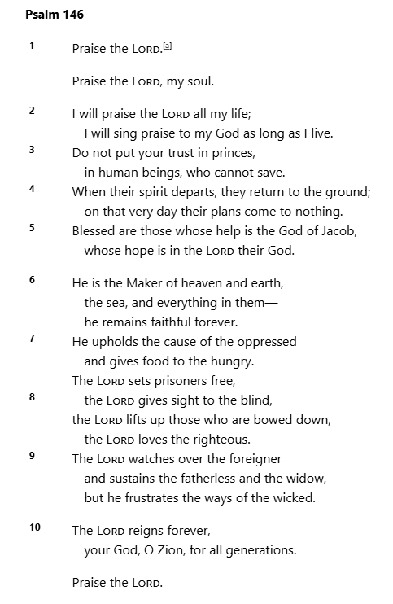

# August 2026

## Israel

!!! info "Pre-draft and editorial, and written too soon after the events"
    - I usually need a lot more time to sort things out in my mind before I write about them and all this happened just a few weeks ago.
    - So please forgive me, this section is a bit disordered.

- I stayed in Tel Aviv for four nights and checked out the sea swimming - which was spectacular, the waves are not nearly so amazing in Spain.
- Then I stayed at the Dan Panorama in Jerusalem for nearly two weeks, then I moved to the YMCA and I stayed for probably about ten days in the front tower room on the second floor, with the narrow windows, then moved down the hall and stayed for another week or two until I left on 28th August.
- I went to the Wall every day.

## The Wall and David's Tomb

- In Jerusalem I visit the Wall nearly every day to start with.
- It's like visiting God Himself.
- Once I'm at the YMCA I do visit every day, religiously, I feel like it's an agreement I have with God and I'm not letting Him down.
- I'll go before the heat of the day, but it's usually roasting still.
- Sometimes, something wakes me up in the middle of the night and I'll go down and sit in the tunnels close to the Wall with the other women at 4 or 5am. These visits were very special.
- Some days, on the way back from the Wall, I visit David's tomb too - these are the days when I feel like I'm on the battlefield and need some spiritual-warrior strength.
- I'm very conscious of the bloodline to Jesus but I'm not interested in the Christian sites so much.
- Every day I went, God gave me something to write about when I got back to my room. 
- And everyone was reading along with me.
- And by the end of my trip, the Wall looked alive to me, glowing, oozing God, His gazing-house.

## True forgiveness, suicidal empathy, and confusing the levels

!!! tip "Thoughts after seeing the pangolin"
    - I was trying to figure out why [I had seen the pangolin at Ben Gurion](july.md#the-pangolin-at-ben-gurion), and the trauma reaction I had had at the same time.
    - I was thinking about forgiving people for evil acts, and what that really entails.
    - It's a bit of a rant but I'll leave it in as my thought processes were working through to the truth.
    - It was a good rant in my view as it ended up a justification for the forgivenet - I don't think that's where I was going with it initially.

- Forgiveness is in the heart and mind, not really the body, although..
- Jesus on the cross had a perfect heart and mind, but he suffered excruciating pain and distress while it was happening.
- However, after his physical death the body reconstructed because of his pure heart and mind, and his unequivocal connection to God, and because that's what God had planned.
- So, the visceral trigger the predator instills in the prey is not a failure of forgiveness, and although the heart and mind may be mostly still about all this (a having-forgiven state), if we were to think that there was some error in reacting this way we would be imposing suicidal empathy on the prey by confusing the levels.
- This physical trigger is very literally life-saving.
- Christians confuse the levels by saying we're all equal and should be treated so. And this sounds good and true, but it becomes chaos because the measure is Jesus and to assume everyone is of pure heart and mind like Jesus is here in the physical world - EVEN THOUGH at the divine level this *is* true - the outcomes are disastrous.
- That is why JC in A Course In Miracles says: *Equality does not imply homogeneity NOW.*
- It's warped forgiveness and it more often feeds evil rather than doing anything to dispel it.
- Anyway, back to true forgiveness.
- It's very personal because it is about a pure heart and mind looking out.
- You can't impose forgiveness on anyone, nor insist upon it from someone else, both these approaches are ego.
- Imposing forgiveness on someone, *I forgive you*, would not necessarily have any effect apart from making the one doing the "forgiving" feel better.
- Insisting someone forgive us because we assume they should is also, obviously, not going to do anything about our evil-doing.
- Because it is so personal, and so universal, my view is the only approach to forgiveness - at this physical level and in this period of history - is for a person to sincerely request it.
- This is always going to be a mini-(maybe maxi)-healing and never has to have anything to do with the other party.
- So, that's my universal case for the forgivenet.

## Tony Clifton

- So I'm thinking about the pangolin, a lot, trying to figure it all out.
- I'm very confused about it.
- And then one night I get a glass of wine at the bar in the Dan Panorama, come back to my room, and for some reason I start thinking about Tony Clifton from the Man in the Moon.
- And something makes me think of the photograph of Antonio Ruiz with his father, and the father reminds me suddenly of Tony Clifton, and I start thinking that it wasn't his father at all, it was the pangolin disguised.
- And so I now believe that both Antonio and the pangolin were taken to Israel in July 2025, and everyone neglected to tell me about the other guy because they were worried I'd be upset.
- And this is all going on online, and I'm posting my ongoing thoughts on Facebook or Substack, or wherever, so everyone can see what I'm thinking.
- So that's where I was with this, and I was listening to Jim Carrey sing Volare while dressed as Tony Clifton, and the next day on my way back from David's Tomb to Jaffa Gate they're playing a version of Volare from one of the cafe's, so I think it's a confirmation.
- It isn't.

## Two days before the eclipse

- Then, every day at the Wall, something new.. and the truth is really starting to come out now...
- Two days before the eclipse something happens and I realize I had never seen this man the pangolin consciously before in my life (apart from possibly briefly for about two seconds while I was extremely high on hallucinogens).
- And from here I realize that he must be one of the "trumpet teachers" from Dénia nevertheless.
- And I start to think more carefully about the trumpet teachers, how many there were, who they were, what they looked like, and what their physical and personal differences were.
- I have the time in Jerusalem to think about this properly and do a full analysis.
- And I realize there were seven men plus the man Antonio who I believed they all were, making eight in total.
- So I write it up over the next days before the eclipse on St Clare's feast day - the intuitive (or remote viewer's) patron saint as Steve had told me the September previously.
- And I guess these painful truths coming out is what Saint Michael was referring to when [he cuffed me round the head](may.md#dreaming-of-saint-michael-on-ascension-day) in Cauterets in May.
- And here it is: [seven trumpet-teacher devils and one angel](../../crimes/protagonists/vidal-sastre.md#seven-devils-and-one-angel).
- And right after this, on the day of the eclipse, I write up the following three sections.

## The sheer volume of it..

- Is going to be the shock, isn't it - referring to the porn with me in.
- I was wondering if people had seen it and thought I was conscious and consenting because of the open eyes, like [I had seen Yasmin do](../2001-to-2010/2008.md#yasmin-falls-asleep-with-her-eyes-open)?
- And that's why so many were so appalled with me?
- Could 95% of all the porn in circulation be of sedated-victims?

## Put out the fire chief

<video controls>
    <source src="/content/vids/put-out-the-fire-will-you.mp4" type="video/mp4">
</video>

- Mr Quint is fight.
- Mr Hooper is flight.
- Chief Brody is freeze, initially, then he works his way back up through flight and fight to destroy the shark and save the day.
- A little bit like us.

## God is the Spymaster

- He's been planning things for eternity, and already had our roles set out for us.
- He knew that, at the right time, regardless of whatever we'd been doing up to that point, we would remember Him.
- He knew that, from that instant, we would never question His Authority so that we could carry out His Plan exactly as He wants it carried out.
- So we listen, and He tells us what to say, do, think, and more importantly when.
- Just like real spies do. It's so wonderful.
- And we obey Him.
- And even when things look like a total catastrophe, and we cannot understand anything that's going on, and we're suffering and sad, we still trust the Way He has set us on.
- We don't necessarily understand the Why of His Instructions but we never question His Judgment and Authority.
- So it's like that.
- Anything else is hit-or-miss speculation, as you may have noticed.
- So Thank You Father for Your Love, Care, Guidance and for never leaving me/us.

- We made it, my love. (We used to chat about this eclipse a lot, back in the day on X :D)
- *Can we go home now?*... oh wait!

- (Aside: there's another moment in the film where someone says, "can we go home now". It's Charlie. *Swim Charlie swim! Don't look back...* I don't know if anyone noticed that #GreatRay).

## Sedated-surgery egg extractions

- And from here, with the seven-devils out of the way, slowly but surely the evil starts to come to light and I realize I've not only been subject to rape while sedated, I've also been subjected to surgeries.
- And the surgeries out-evil the rapes 1M-to-1, by the way.

## *Oeuf*

- I don't know, this is all so recent I'll probably need a few months to process it before I can write it up properly.
- Anyway. I had a dream a few years back of me in the future - I have a long puffy skirt on - and I'm with a younger woman who appears to be my adult daughter and I thought it could be Antonio's daughter.
- And we're waiting to go on a TV show, we're the guests.
- And my dad and I are watching the show in a parallel universe type way and he says this is when I was 96.
- And I was sleeping in the tower room at the YMCA still, and something wakes me up in the middle of the night, 3am or so, and it's a voice, a young girl's voice, and she says: *oeuf*, gently.
- And I know it's my daughter.
- And I get up and go to the tunnels, because I don't understand it.
- And I start to think I was wrong about the woman in my dream being Antonio's daughter and rather she'll be mine instead.
- And I think about how a daughter of mine could be born without my involvement, and I come up with April 2026 in Dublin when I noticed a wound on my lower abdomen and suspicious events at Beckett Locke, as well as the (unconscious) signals from Steve about it.
- And then all the signals from the Jews in Jerusalem the September and May before start to make a more horrible sense.
- So I thought the Americans must have set them up to take the blame if anyone ever found out - [*Project Jonathan*](july.md#the-psychological-torture-begins) as they had repeated in Bali.
- And from here I started thinking about Sullivan, and how the Americans had blamed Israel for Lockerbie too.
- And from here it just all started to come.. could it have been more than just that one time, really? I was thinking.
- And every day I went to the Wall, more of it came out; Bangkok beside the American Embassy, Cauterets while being poisoned with digitalis, one by one the events because obvious.
- And suddenly, I had a reason for being treated so abysmally by everyone for so long: they despised and loathed me yet wanted something I have for themselves, and believed they could get it by extracting body tissue from me! 
- And then I post the following section... because I still think Antonio is in Israel - multiple triggers confirm this online and in the street such as Anat (the Facebook account that confirmed the [CIA roasting in April 2026](april.md#a-first-roasting) posting a superhero at the Wall), he has a garnet not a diamond (written on a shop window in Mamilla), just relentless - the Anat account incidentally makes art on pieces of wood.
- Although, it makes no sense that I haven't seen him yet while I have seen the pangolin; so I think it must be because the Americans are evil, and so I update the front page to add info about him *languishing in a mousse-controlled jail in the north or Israel*, etc.
- But I'm still wrong about everything.
- Anyway.
- Here's what I said at that time.

## Unfortunately, my love

- My rock solid confidence in God and His Love for us, and how He has planned all of this to get *all of us* out of our gargantuan, apocalyptic, and most-recent inevitable mess as quickly as possible, does not extend to many humans.
- As usual, I think they're probably appalled at what God has delivered; it doesn't fit expectations, it threatens a deep reverence for porn and sexual violence, it threatens a more modern belief based in the ancient hate that the mother can be switcheroo-ed and thus made unnecessary, and that - with zero evidence and contrary to everything God tells us - miracles are a function of the cells of the body and have nothing to do with faith or God at all!
- See about a million Indian gurus and holy men for more examples of this apparent contradiction
- I refer my readers to the following principle of miracles: *Miracles are everyone's right, but purification is necessary first.*
- God's representatives don't look right, and even when they do - coming backed with a prerequisite level of violence in the nature - their miracles are so shocking they must be stymied and controlled.
- It's amazing that they have put so much resource, time, and effort into the *Better Way* and then when it turned up, they decided they didn't like it much.
- But expected.
- So they'll be wanting to keep the violence and violation (hence my bizarrely unpleasant experiences of late), and to maintain the ancient hate and the murder of the mother (a tragedy of world-ending proportion), under the erroneous belief we humans are doing the right thing because, contrary to the glaringly obvious, we always think we do a better job than Him.
- It seems to me the powers-that-be have decided that whatever political A-bomb I come with means the Instructions should be ignored; so I'm left with nothing to lose since [they salvaged whatever they could](april.md#un-oeuf-est-un-oeuf) from me and already [made their boldest attempt yet on my life](june.md#kailash).
- It's only a matter of time before they destroy the only thing that can truly save them; like they always do.
- Perhaps that day'll be the Day of the Lord.
- (I don't believe this is true, but I still worry about it given the history).
- The definition of insanity (believing we're better than God, or that we can eliminate Him, or that we *are* Him) is attempting to prove it again and again and expecting a different outcome.
- And that is why my widowhood is apparently never ending...
- And why I'm still here.
- p.s. all this sparked by the truth coming out (egg-extractions over the last year - maybe even bumping into someone involved that made me cry for no reason, at the bar) and people getting very angry about the truth coming out, and asking me if i want to disappear like [Kathleen Love](../2011-to-2020/2020.md#kathleen-love), and telling me i have to die... so... i've nothing to lose it seems. You've both (see [criminal gang comparison chart](july.md#comparing-the-criminal-porn-gangs-with-unscrupulous-and-insane-security-service-activities)) taken everything from me already, and Anne Hathaway lookalikes at the Wall are really a pretty useless way to make me think you're on my side. You're opinion of me is as if I'm a speck of dust on your shoe. So, the gigue is up. Do whatever you like, I don't care.
- And I don't, but I don't think they'll succeed.

!!! tip "Scribbles of Baal"
    - After this particular rant, when I went to David's Tomb the following day a Frenchman screamed "scribbles of Baal" at me, and an Israeli man was clearly FURIOUS with the Catholics!
    - I tended to agree with the Israeli.
    - I went to mass at the Dormition Abbey for 15th August - Mary's Assumption - and I felt like I was going to vomit, and left.

## What a world!

- Thank God for God and His patience because at this rate we're about to go round again with Him un-re-membered for another trillion years; but *if and only if* we survive the liar's most wicked self-destruction mechanism to date, that which supports the ancient hate: a mechanism which, I'm reliably told, isn't possible to survive if left alone, covered up, hidden.
- Well done everyone!

## On the plus side, my love - getting it wrong again

- Given the mousses' utter horror with what God sent; us detestable, loathsome, bothersome people...
- Me with the multiple and ever growing examples of their scheming, muck-raking, and shamefulness that I have detailed in this police statement.
- And you with your one, giant, cataclysmic, tipping-the-earth-on-its-axis example.
- They decided they would cancel God Himself.
- Because they do whatever they like while walking over everyone's backs like we're roads.
- But, of course, all this means is that we have children, already! 
- I'm kinda sad we don't, except I still believe we have time for this.
- And I believe it's three, just like my dreams and our prayers over my tortured mourning.
- And yes, today I break forth into joyful shouting and cry aloud! No, just weeping actually.

### And as for your heart, my love - this is true

- Know that you and I agreed to all of this a long, long time ago, for someone we loved dearly, and for God.
- So don't worry about the recent past *chipshop*.
- There's work to be done.

## Squirrel will tell his story

- Languishing in a mousse-controlled jail somewhere in the North of Israel, squirrel wonders when he will see his love again.
- It's amazing how the teeniest tiniest weeniest little bit of applied shame changes everything, doesn't it.
- His story will be far more powerful than mine ever was; indeed, he already knew *everything* I've been fighting for my life to find out over the last few years.
- So what motivated him, what did God do that made us the most unusual world-saving duo in history?
- What is [God retelling us through Rumi](march.md#no-room-for-form-rumi) nearly a thousand years ago?
- It's time we found out.
- But really, the most worrying thing about all this new information is that the *powers-that-be* (Tyre, Assyria, Egypt, Rome, etc.) have always known about - and have never had any intention of stopping - the mass pedophilia and baby-rape machine that has seeped into the school and education systems of Spain, while blocking the Spanish from saving their own children.
- Why?
- How could Topheth expand to all four corners of the earth?
- Answer: when Caesar normalizes sacrificing children, the unwise amongst his subjects will follow suit.

## *Where are my friends, Father?*

- This is when it *all* came out. I had moved room by then.
- I was devastated about the children. I still am. 
- This was the day I bumped into Mrs Wasserman's sister in the lift - she certainly looked like her - at the YMCA and the whole place was heaving.
- And then Paul Gebheim from Polygon had been at the YMCA that day too! Which I didn't connect to the children at all. I can't imagine why they wheeled him out.
- The place was heaving, and then once God really got going they all disappeared!
- Anyway, it felt like I was not going to be able to carry all this. It was too much now.
- Everything else that's happened to me feels like nothing compared to this.
- I felt utterly friendless.
- I had already lost everything and everyone, and the tiniest faith I had in people was just ripped away in an instant.
- I was devastated, and in bed, it was early, and I cried out to God from my heart, *where are my friends, Father?*.
- And something happened.
- It was like a warm tingling glow inside me, and I could practically see the Light of it.
- It was love, and kindness, and I knew it was God.
- It went on a while actually, just tingling all inside and a little bit in my arms, legs, and neck but mostly inside my torso, and then I fell asleep.
- God woke me up again at about 3.30am with an invitation to visit him, so I went that night.
- And I cried again, and I felt loved and cared for, and that everything is going to be well.
- It may have been 10th Elul, but I'm not sure, I can't do everything.

## The tunnel

- It's curious how many tunnels feature in this police statement.
- There's one on the way back from the Kotel I walk through if I'm stopping at David's Tomb which I often do.
- Well, there was quite some frantic activity in there after I started to write about egg-extraction.
- Mrs Wasserman's nephew Alex walked by giving me those looks.
- I smiled at him at the last minute and he seemed relieved.
- And Esther (or an Esther lookalike) walked through and as she passed me she seemed to have something wrong with her head, it started shaking.
- If she did get an egg in March 2025, it would have been soaked with pesticides so I am very concerned about any children arising from that time.

## Call social security

- I recommend that all offspring are located and brought by respective social security organizations to a safe environment as soon as is reasonably possible.
- From there, squirrel and I will help find loving and deserving families to look after the children having random biological fathers.
- I will maintain some involvement in these children's lives but not at all in an oppressive way.
- I will be harmless and helpful <3 
- Squirrel and I will take our own biological children back as soon as is reasonably possible.
- If, due to arrogance and lack of wisdom, any of the people that were capable of justifying such evil complain, they should remember well that stolen children are always despised by the families that stole them, and any psychologist or psychotherapist worth his license can confirm.

## Confirmation mousses up India's arse even in Israel

- 23rd the mountain was at the Wall, and I remembered meeting the couple who had family on the Air India flight.
- One day in Jerusalem, I suggest to my online friends that squirrel and I might do well in India because if the mousses are controlling everyone, at least me and him might stand a chance together in India - I talk a lot like this online (I never save these things, but they always know) ... I also look up "asylum in India" processes online. The next morning outside David's tomb they've set up an Indian woman with a MASSIVE plastic sign saying something like "Join us, you will be safe", or some such.. this is why I say these things about escape to India... but if the mousses control India, then that's out too even!

## Constant activity when I leave the YMCA, and in the YMCA too, until the Truth is fully out

- Further to this... it was constant, mayhem.
- Everything I was saying in here was sparking reactions off.
- Words and phrases on T-shirts, hats, bags.
- Hollywood actress lookalikes, TT student lookalikes, words, sly comments, he's a porn producer, ..
- Constant prompts on Antonio definitely being in Israel - which we know is a lie; how he brought the ring with him, etc, I mean, just mayhem, constant, they *HAD* to make sure I kept believing the lie, I don't know why...
- Perhaps they'd be concerned I might run off with the gypsies. Well, it sounds like a great idea to me right now I can tell you.
- I showed the wound to the Wall (hoping they'd get it on film).. then as the other memories came steadily back there'd be less and less of this..
- After I remembered Kathleen Love and wrote about her there was anger at the Wall: *Steve is OUT*, someone said.
- And as it slowly, or quickly rather, came out day by day, and for the last few days of my stay, after the feeling I had had in my bed when I was devastated and realized the extent of it (bar Bali in May 2024, and Ruth, that was yet to come), there were only normal human beings at the Wall, and friends saying hi too.
- I guess they realized it was only a matter of time now.
- I had a few chilled days after that, up till then it had been relentless stalking by the Americans.

## It's a (salmon and onion) wrap 

- I don't think God has anything else for now, but I will always let everyone know if that changes of course.
- It's time to start something even more amazing.
- Dear friends, I know you're mostly as appalled by it all as the world will be.
- Please help me get the book out.
- Then I might have an income, which would be something. I do worry about that.

## Proof the salmon mousses intended to murder me once they'd got what they wanted, and why they're probably still intending to do that

- Even though I have done the impossible for them... (btw, forget back pay, it's compensation now...).
- They've obliterated my access to jobs, healthcare, support, friends who aren't spies, a normal life and more.
- They've obliterated my access to communities on social media by battering me relentlessly online, forcing me to delete all my accounts for a bit of peace.
- They attempt to weaken me in *any way* possible.
- They've block my payments on my bank cards and on payment platforms too.
- They're now blocking my book production online.
- They're now blocking me opening new social media accounts I want to use to market my book.
- This is not the behavior of people who don't intend you serious harm.
- I endure constant mass-stalking wherever I am in the world: including taunting and insults in the street, constant "intrigues" (it's getting really boring now - oh wait, it completely stopped yesterday didn't it ;), sending spies with sinister intentions everywhere... oh wait, that's also stopped hasn't it.
- Hmmm. 
- Has it all stopped now?
- It did seem very quiet and peaceful and loving yesterday. It made a wonderful change for the sane amongst us.
- I think we're very nearly there friends... except they just blocked me from opening a new Facebook and X account this morning so that I can spread the word about the fall of the salmon mousses.
- Oh wait, maybe the way-too-powerful, porn-addict tech bros did that... playing catch up as usual.
- Anyway.
- Whatever's going on, if we're not wholly safe here yet, and the mousses won't let me have any basic human rights, I think you should let me take squirrel with me. At least together we might have a fighting chance don't you think?
- We could snuck him out.. :D

!!! tip "Remember..."
    - Whoever assails (us) will fall.
    - No weapon (formed against us) will prosper.

- Are we seeing proof of this now? I feel like we are. Multi-mass-proof in fact.

!!! tip "For me to remember... and focus on"
    - The well-being of our sons **WILL** be great.

- It's amazing how offspring changes everything isn't it.
- Thank you LORD for Your firm promises which You never break. Please keep them all safe until we come for them.
- Maybe India can take us BOTH until everyone's in jail and dealt with howaboutit?
- Whatever I've done already is only half of my potential.

## Dear gypsy friends and devotees

- Do you remember that book you promoted about 15 years ago which made millions of stupid women in the West believe sexual violence was a good thing?
- I'm so sorry, I bet this was the Americans again wasn't it. Can you forgive my naivety?
- Deleting the rest of this section - please see commit history for the original.

## A new project

- Something is bubbling, fertilizing, thinking about emerging...
- Something about Love, and God, and family, and about how everything is going to be OK.
- Something about repentance and forgiveness.
- But mostly about love.
- And I'd really love to get to the research stage as early as is reasonably possible.
- Thank you.

## My last trip to the Wall

- Before I leave for Dubai, I visit the Wall.
- I've been going every day.
- It's early, probably before 8am.
- I'm always looking for the white dove, the one that often sits between the men and women, chases intruders off, and has a boyfriend and they preen each other sometimes it's so sweet.
- She's iconic for me.
- She's not there.
- So, OK, I hang out with God for a while like I do, and occasionally I look up to see if I can see her, but she's definitely not around this morning.
- So, I'm a bit disappointed cos I'm leaving today but I continue my prayers with God for a while and eventually it's time to leave.
- As I'm getting up to leave, I see her!
- She's on the top of the Wall walking around with her boyfriend, the black dove.
- I've never ever seen her up there.
- And I'm so delighted because these are my last moments at the Wall, for this trip, and there she is, and not only is she there but she's with her love.
- So I'm absolutely delighted and my heart is singing.
- And I get up to leave, and I start to walk backwards, and I've gone a few steps and I'm maybe at where the prayer books are or just before, and these two fly, together, off the top of the Wall and in the direction I'm going, side by side.
- I think a tear came that time.

## Dubai

- In Dubai after a month of swimming a km to a mile every day or every two days at the YMCA in Jerusalem, the groin injury - it is inner groin - is paining me during the night. It's something to do with the mattress which puts my rump/hips/groin in a lower position than my legs. I swim breaststroke and so kick out a lot and noticed the groin injury complaining a bit while swimming but it doesn't make sense unless it is structural, a caused injury, broken sutures, something surgical gone wrong and reopened again and again.
- And who was the woman at departures? I got jealous and remembered how awful that all was and started thinking of a cave or the nunnery again... was she Brunhilda? Isaiah 57. A nest indeed. Gosh, this is gonna be such a cool parallel plot line.