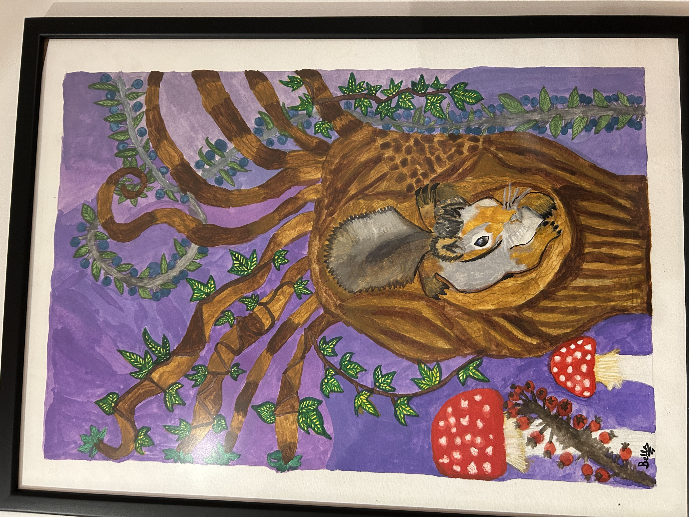
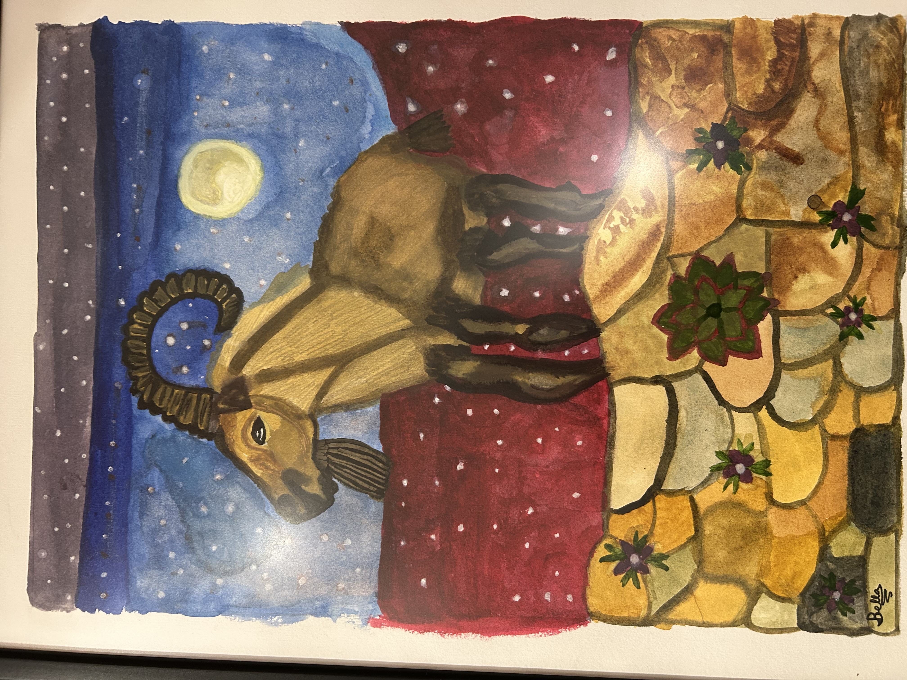
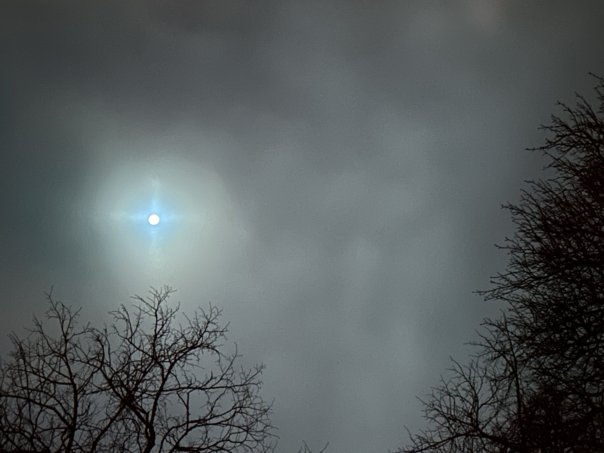
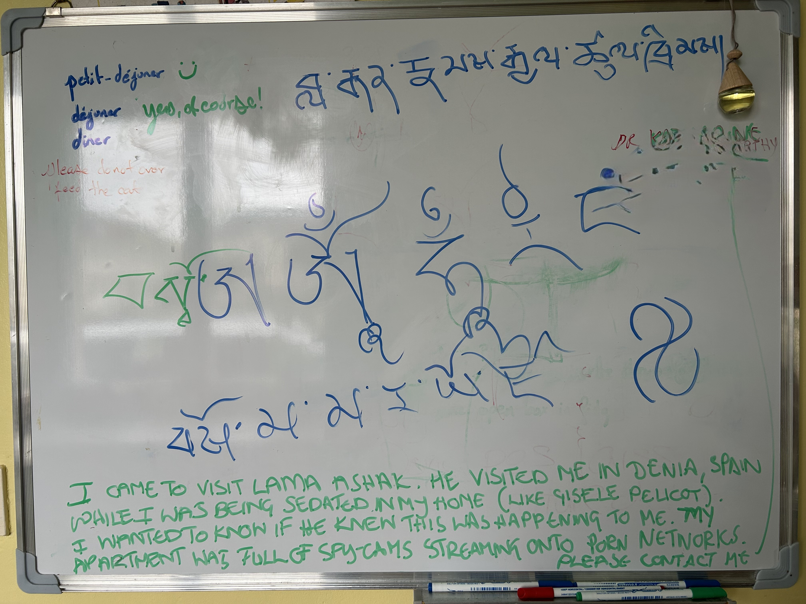
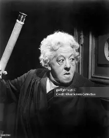
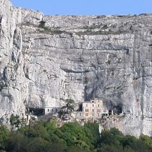
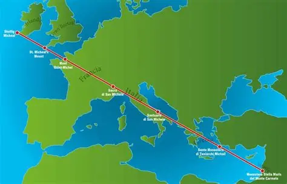

# February 2026

## Full Moon on the feast of Saint Brigid 

- I'm staying for a short while in Dorset.
- I start to wonder about two of the three pictures in the house.

- Am I being paranoid?
- It's a full moon so I care, briefly.
- I take a photo of the moon. 
- It turns into a Celtic Cross, just for me, just for Brigid.

## Shenten in Blou

- I visit the Shenten monastery in Blou to see if my old friend the Tibetan monk is still there.
- You may remember [the monk who came to visit me in Dénia in 2023](../2023/september.md#the-tibetan-monk-visits) when the porn gangs were panicking - and telling me everything incriminating - because I had not behaved as expected.
- It is highly likely that, at the time of his visit, they were still coming into my apartment after I had been successfully sedated on going to bed.
- I didn't know any of this at the time, of course.
- When I did realize I had been drugged continuously in my home in Spain, I tried to talk to my Tibetan friend about it.
- I emailed and texted him a good few times.
- He blanked me.
- He stopped responding to me the moment I mentioned I found out I had been drugged.
- It's curious the way men do that - then loudly tell you it's nonsense - as if common men would never do such a thing! 
- (See, for example, Gisele Pelicot, and the monstrous common men who think porn is normal).
- Anyway, I thought I'd pop into the monastery to see if he was there.
- He wasn't. 
- In fact, no-one was there so I left a message on the kitchen whiteboard.

- Then it turned out they were all at lunch so I ended up speaking to Lama Gelek and Lama Lagen who run the place these days.
- I told them the whole story.
- They say they're sorry it happened and then they say that thing where you don't count as human, never mind vulnerable and worth helping: "You must forget the past and go on from here. Past is gone."
- I say: "If vulnerable people, children, are in danger, you have to do something."
- Lama Gelek agrees.
- I explain: "That's why I'm here".

## Wednesday 11th 

### The first apparition of Our Lady at Lourdes

- Me and ChatGPT chewing the cud on what the dark forces might do when they realize that the beautiful piano player's true husband is not the gypsy trumpeter after all.
- He is, in fact, the Holy One of Israel.

- We suspect they'll get very cross, again.

### Dinner with the Sisters of Nevers

- I buy a ticket to have dinner with the Sisters of Nevers to celebrate the first apparition of Our Lady to Bernadette on 11th February 1858.
- One of the nuns sitting diagonally opposite me looks *exactly* like Margaret Rutherford.
- I tell the German nun sitting opposite me and they all look her up on their phones and agree.
- I make sure to tell them that Margaret Rutherford made the best Miss Marple of them all!

## Sainte Baume

- It feels like the end of a major cycle.
- I'm back in Sainte Baume after four years of hell at the hands of the porn gangs of Dénia and their international co-conspirators.

- They never expected me to survive them.
- They never dreamed I would not only survive them, but end up telling everyone about them, and so much more.
- Do they think the world will not be disgusted and appalled with them, devastated and mourning?
- Should they have just let me play the piano in peace?
- Have they sent their operative(s) out to Sainte Baume again to check up on me (or worse)?
- Seems I can rely on God to deal with them.

## The Name of the Rose

- The monastery at Sacra di San Michele near Turin was the inspiration for the novel *The Name of the Rose* which became a film starring Sean Connery and Christian Slater.
- The monastery is a significant site directly on the Sacred line of Saint Michael that traverses from Ireland through England, France, Italy, Turkey, and ends in the Holy Land at Mount Carmel, Israel.

- I like to think he detours to Glastonbury and Burrow Mump, and why wouldn't he...
- Anyway, after visiting [the holy site where Mary Magdalene spent the latter part of her life in meditation at the grotto of Sainte Baume](#sainte-baume), lifted by angels seven times a day to greet the sun, I'm currently highly sensitive to Magdalene themes.
- I was drawn to Turin by the Shroud, of course, and only on arrival found out about the monastery dedicated to the boss, my task-master.
- Anyway, back to the film.
- So, the film has huge Magdalene themes running through it, unintentional or otherwise; the main one being the true love affair the Christian Slater character has with the destitute woman who is forced into prostitution and ends up being condemned to be burnt at the stake by the monks.
- The beautiful, wild woman in the novel is the eponymous *rose*.
- The symbolism of the Catholic Church's poor, at best, treatment of Mary Magdalene for two thousand years is obvious, at least to me.
- The boy I lost my virginity to in 1988 took me to see that film at the Phoenix in East Finchley.
- It was the first adult film (15) I had ever been to.
- I was 15, in fact. 
- He was 23. Simon. His hobby was photography.
- For some reason, me and my friends were obsessed with losing our virginity.
- It was an urgent message we were hearing everywhere; something we must do as soon as possible, or else!
- We read it in our magazines, we heard it in our gangsta-rap; it was inordinately clear what we had to do, and as soon as possible or we would just be nobodies!!!
- And, there was no alternative either.
- So, being a high achiever, a go-getter, quite competitive really - and having no idea that I was being manipulated by the patriarchy in it's most sinister porn-addict form - I sought to do what I believed was going to be good for me.
- I vomited all night afterwards.
- Simon took some nice black and white pictures of me one afternoon in Hampstead, developed them and printed some copies.
- It was the year of the Lockerbie disaster and the year before the North London rape gangs got hold of me and took my life from me.
- And, a very very curious thing is... the picture I always saw myself and Hazel Smith in that popped up during the Dénia porn-gang online (and otherwise) torture... this one:

- Well, the *me* I see in it is that picture Simon Gaskin took of me in 1988.
- Winston May had a copy of that picture.

### Groomers

- Back in the 80s, just like today, there were adult-male groomers in every town, village, and suburb of big cities looking to manipulate youngsters into having sex with them.
- They were often part of a male porn-addict network and in Simon's case, he would have been alerted to the fact I had seen him and thought he was cute via one of the most egregious groomers in East Finchley, Richard Reid.
- Richard befriended girls aged 12-14.
- Even in my twenties I saw him sitting out on summer evenings on East Finchley High Road with schoolgirls.
- Back in the day, it was a free for all and we were the naive and impressionable opportunities.
- Richard had already befriended Willow, a friend of mine, through her neighbour Tyro Harvey (son of a famous rock star) who was also much younger than Richard, but older than us, and as equally impressed by him as we were.
- They would hang out in Cherry Tree Woods and approach children.
- Everyone looked up to Richard; he had puff and he would share it around.
- He would then arrange for us to hang out with him, and we would go somewhere in the back of his little white Computer Centre van, and we would smoke pot together and giggle.

- It was only a matter of time before one of them had sex with one of us.
- I believe these men connected via their shared interest in under age girls, compared notes, and divulged information about the girls they had persuaded they were safe.
- Richard would literally have three or four underage girls in the back of his van and he would take us around to show his other mates in the area.
- Did they respect him more for it, or was he doing it for "casting" purposes?
- Richard even made it into my [2015 police statement](../early-years/2015.md#statement-to-the-metropolitan-police) he was such an obvious perv.
- Porn was always lurking in the background, mentioned within earshot amongst the men.
- While I was seeing Simon, he kept mentioning porn.
- He had a friend who he hung around with (can't remember his name but he lived down on Falloden Way in the suburb over a shop with his mum).
- This friend's girlfriend, Simon would tell me excitedly, did porn.
- I didn't know what he was going on about.
- I was 15, remember.
- He then showed me some porn one evening on VHS.
- I just thought it unbelievably boring and wondered what all the fuss was about.
- My disinterest must have been obvious because he never mentioned it again.
- I bumped into him a few times in East Finchley in the 90s.
- The way he spoke to me made me realize how little he had thought of me when we were together, and still did.
- He spoke to me if I was an idiot, and he seemed to delight in it too.
- I remembered that he had always spoken to me like that, as if I was beneath him by about a million miles, but I hadn't been mature or experienced enough to know how to respond to that sort of disrespect, so I always just stayed silent and wondered if he was all right in the head.
- I did beat him at chess a lot when I was 15.
- I bumped into his mum about twenty years later, and his mum did that thing mum's seem to do to me and she persuaded me to go and visit him.
- I did.
- I popped around to see him for about ten minutes.
- I didn't want to sit down. 
- My feet seemed to be sticking to the floor of his bedroom.
- The smell of dry semen was overpowering.
- I think his porn addiction had completely destroyed him.
- Did porn-addicts back then collect and share the girls around, like football cards?
- Did the picture he took of me end up at the Red Lion criminal-porn headquarters in High Barnet?
- Was the Tottenham rape-gang contracted to target me and my friends, knowing at least I was already sufficiently groomed to be easily lured into gang-rape situations, sedated or otherwise?

## Keeping me topped-up in 2025

- Something was keeping me high throughout 2025, and I have the [DESO account](https://desocialworld.com/u/KingForg) to prove it.
- Obviously, the gangs had a strong motive for keeping me high which was to keep me oblivious about the trumpet teacher being made up of [a number of distinct and different looking men](../../crimes/protagonists/vidal-sastre.md#at-least-four), that I even had photos for!
- There were some obvious incidents like the [Cambridge ugly ladies](../2025/april.md#shoe-zone-harlow-essex) last April, and [July's murder attempt](../2025/july.md#lourdes), but I'm still without an explanation of why I was high *all the time* in London throughout 2025 until [I remembered the switcheroo](../2025/october.md#thunderbolt-clarity), at which point it stopped.
- If the porn-gangs own my brother, as I suspect they have done since his Thailand episode, could they have involved him in some way in maintaining my confused mental state while I was living at 31 Trinity Road N2?
- Is that why Paul was so *keen* [to become his mentor](../2025/february.md#paul-and-my-brother)?

## A Paqui-Fornet lookalike in Padova

- I visit Padova for a few days at the end of the month.
- I need to buy a towel for my trip to Israel where I intend to sit a Vipasana course at the Sea of Galilee center.
- I go to the department store, Coin.
- As I'm going down the stairs, a woman is striding up past me, slowly, deliberately, so I see her very well.
- She looks *exactly* like [Paqui Fornet](../../crimes/protagonists/domingo-et-al.md#paqui-fornet-pastor), pedophile-porn-studio manager.
- I'm not sure why this sort of thing keeps happening repeatedly.
- It's clear to me someone is *arranging* these lookalike events but I'm not sure who, or why.
