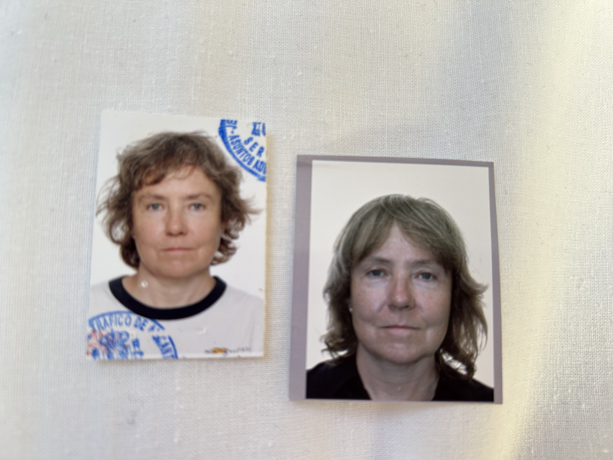
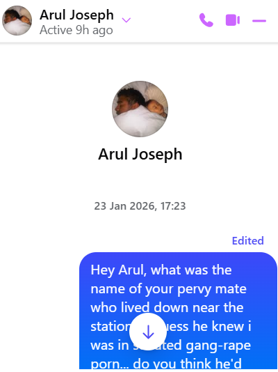
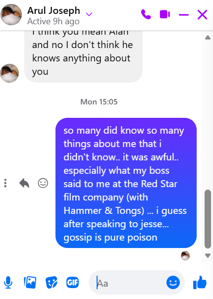
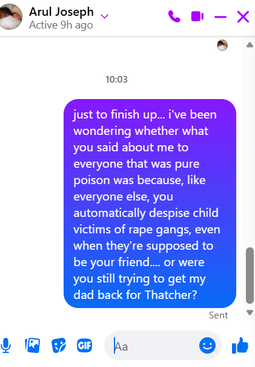
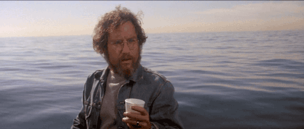

# January 2026

## A "date" in Barcelona

- Word on the street is I had a "date" in Barcelona: meaning yet another sedated rape event I'm only now aware of having occurred.
- I'm wondering when that could have been.
- I was up and down to Barcelona so many times between 2005-2016 when I lived in Dénia and Madrid.
- Let's list those visits here - as much as possible - and see which of them are the most likely.
- I'll add any more I remember as we go along.
    
    1. I visited Barcelona in 2016 to do a yoga class with Pattabhi Jois's daughter who had flown in from India. I stayed at the Gran Hotel Rey Don Jaime, just outside the city in a small town called Castelldefels, which had the most expensive parking meters in Spain. This is the favorite as I was living at spy-cam-networked Joan Fuster at the time and I was likely being sedated and filmed two or three times a week. I was also slipping into a severe depression.
    1. I had an extremely suspicious time at the Amma retreat in Barcelona in October 2015. The Spanish organizer became apoplectic with me for asking, politely, for a private room. She raged at me for days and even told me she hoped I would crash the car on the way home! If a sedated event had happened there, it would have been with another person as I was sharing with an Angolan woman. Sandra Rita Diaz had been interested in all this.
    1. Then there was the Cleargreen retreat where [I met Gammadian Freeman/Richard](../early-years/2011.md#gammadian-freeman-and-his-mate), probably late 2008 or early 2009. I was sharing with others in the rented apartment if something had happened there. Was Jess from the [Avila meditation-retreat-centre-cum-porn-studio in December 2023](../2023/december.md#vipasana-meditation) at the Cleargreen retreat also?
    1. Of course, there was [the invitation from Grace to meet her and Nadim](../2023/november.md#starting-my-new-job) (and others I suppose) in Barcelona just after I started at Polygon; which didn't happen because I found out online that [Nadim is an actor](../2023/november.md#nadim-kobesi) - and everyone knew I had found out due to constant hacking - and he got himself fired immediately.
    1. In October 2007, I traveled by bus to Barcelona to attend a Kabbalah conference. I shared a hotel room with my friend Richard so there's no chance of any funny business on this occasion.
    1. In early 2006, I traveled to Barcelona to attend a Vipasana course which I got thrown out of for being utterly depressed and irreverent (I had just remembered gang-rape at an Iboga retreat in Montpelier). I don't remember where I stayed before and after the course but I got the train to Barcelona from Madrid that time.
    1. In January 2005, I traveled to Barcelona to attend a women's well-being retreat with [Sat Santokh](../early-years/2005.md#womens-retreat-with-sat-santokh) and three other women, but we all slept on the floor in the Kundalini yoga studio... you never know though.
    1. On Thursday 1st December 2005, on my way to the Iboga retreat near Montpelier from Madrid, where I would remember, for the first time, sedated gang rape by Jamaican rape-gangs in Tottenham in 1989, I stayed one night at the hotel inside the main train station. My room had a picture of a lounging devil with a huge phallus over the bed which I found sinister and unsettling. I had a terrible bunch of dreams that night. I dreamt of [Jitendra Das's teeth](../early-years/2010.md#why-i-decided-to-be-celibate-for-the-rest-of-my-life) (realizing this was so when I meet him five years later). I also dreamt of a young Spanish man at the foot of the bed on his knees and pleading for his life with a bunch of horrible men standing over him pointing guns at his head and threatening to kill him. Was he going to be someone I know? I guess this night is also a favorite.

    !!! tip "Iboga retreats"
        - The gangs would have been aware I was going on these retreats, and aware that Iboga often surfaces hidden events from the past. Many attendees are curing hard-drug addictions this way.
        - I wonder if they felt it imperative to attempt to undermine any healing I might have had from attending the Iboga retreat.
        - In retrospect, the criminal-element I oftentimes met on some of these shamanic retreats I was going on to try to access hidden memories - and the numerous odd experiences I had with these people - could well have been part of the distract-and-discredit criminal protocol for child rape-gang survivors, don't you think.

## Could Brian have known who Ugly was back in 2001?

- Pathologically inclined to think the best of everyone - not a bad thing - I start to wonder if the [weird occurrence with the ugly man](../early-years/2001.md) in Amsterdam in 2001 implies that Brian - my boyfriend at the time - knew who he was?
- In November 2024, Brian and I had a long forgiving chat about the past on Facebook which was really healing.
- A few days later, [I remembered Ugly in the back of the car at the Holiday Inn in Amsterdam](../2024/december.md#unable-to-access-my-laptop) after a stalker account posted a triggering picture on X.
- I continue the Facebook chat with Brian, and I ask him if he remembered the weird event with the ugly man, or even me telling him about it?
- He answers: *we were very high in those days*, or similar, and nothing else.
- Not a: *no, what was that all about, that's weird*, or *mm, maybe I remember you saying something about that*... no.
- "We were very high in those days."
- He has now blocked me - also interesting - so I cannot quote him.
- Brian did have a dreadful coke habit at that time, which is also, perhaps, significant.
- I just followed along really... anyway.
- If Brian does know Ugly, that puts our relationship into an ugly place.
- Was there a sedated session that night in our hotel room in Amsterdam?
- I have vague recollections of being in the bar, drunk with Brian, perhaps chatting with people there, and then nothing until waking up in the middle of the night in our room apparently after going to bed and sleep.
- If Ugly was playing a part in our lives without my knowledge, did he also interact with Niall Brian's brother, [Paul](../2025/january.md#paul), yes *the* Paul, and even a common friend Simon who came to visit with the boys one evening (me the lone female in the house)?
- I have a feeling I remember Brian and Niall talking about a man they called "Ugly"... 
- "Who's Ugly", I asked them..

## Continuing threats

### Strange messages about dying for friends

- Over the last week or so, I have seen, repeatedly, a quote from the bible in the Gospel of John about friends who are willing to die for their friends.
- I even looked it up to see if it really existed as the language was a bit strange and I hadn't heard this quote before, nor at all since about two days ago.
- It is from John 15, verse 13.
- Seeing this every day feels like a threat of some sort, a message, but I'm not sure what it's about.
- I haven't been watching the news.
- When I see the news about the Spanish train derailment I start to worry about Inma.
- I tried to email her from my `katharinejchardwood@gmail` account and as I was responding to one of her emails, I instantly lost access to the account.
- I try to access the gmail account, but I'm blocked from doing so, the normal options are not appearing.
- I get a response from her from a different email which is good.
- The email I cannot access has so much porn-gang data in it; I wonder if Google backend developers are blocking my access.

### A sinister man in the newsagents

- Back in London I feel, again, like if I leave the house anything could happen to me.
- I pop up the road to get pizza and a loaf of bread.
- A sinister cockney man comes into the newsagents right behind me and growls at my shoulder; "nice weather for ducks".
- The shopkeeper is concerned about him and is watching his every move.
- I wonder if he is suggesting I'm a sitting duck.

### Have the caliphate found out about me

- I'm in Decathlon paying for my items.
- A man dressed in traditional Islamic gear - plus trainers and a coat - comes in asking all the staff if they're Indian.
- I hurry off.

## During, after, now

- Here's two pictures of me, taken just two years apart.

- The picture on the left was taken in September 2023, just after [the Dénia hackers revealed themselves](../2023/august.md#the-hackers-reveal-themselves) and I was so terrified about going back to my home in Carrer Furs [I go public on Twitter](../2023/september.md#going-public-on-twitter).
- The cyber-and-in-person stalking at that time was intense and relentless.
- I can see fear and frustration in my expression.
- At that time, I had no idea I had been starring in [sedated switcheroo porn at the music school](../../crimes/protagonists/vidal-sastre.md#four-distinct-men) between 28th November 2022 and June 12th 2023.
- I also had no idea I was being poisoned and drugged continually in my apartments in Dénia, over decades, and wherever the Dénia gypsy gangs could access my room, my toiletries, and my food while I was away traveling.
- I find out later that the purpose behind that was regular episodes of sedated rape, live-streamed on criminal porn networks.
- No-one expected me to [not have stopped at Alicante airport](../2023/june.md#sunday-18th-june-alicante-airport) for the [third trumpet teacher](../../crimes/protagonists/vidal-sastre.md#an-unknown-man-i-may-have-a-picture-of) just after the conservatory switcheroo-porn-special ended; with me eventually running around naked in a field after a horse, live-streamed to the paying perverts, and then murdered and fed to the pigs.
- I hadn't behaved like the thousands of other victims, and the porn gangs of Dénia were in a state of pure panic.
- The picture on the right was taken in September 2025, after at least three serious attempts at poisoning me with the intention of murder and/or severe maiming, all of which failed.

    - [Halloween 2023's exploding kidney](../2023/october.md#halloween).
    - [Halloween 2024's intense poisoning at my apartment](../2024/october.md#serious-poisoning-with-intent-to-harm-or-kill).
    - [July 2025's even more intense poisoning of my bathroom products and food supplies at Lourdes](../2025/july.md#lourdes).

- Now, my situation is unlike anyone in the world you can imagine due, wholly, to how famous I am in the world of criminal-porn-subscribers.. 1 in 3, I'm told.
- Two years ago I was earning more than £200K a year. 
- Today, I cannot work for any tech company (my profession), or any company, for a few reasons:
    - I'm hacked by criminal gangs: they can rewrite my UI, they can control my cameras, they can add calendar dates to my Google calendar, they have total admin access to all my devices, they can jump from my devices to my colleague's, they can do whatever they like.
    - Any company I work for is guaranteed to have a criminal-porn-subscriber working there who will be contacted by the criminal gangs and given instructions (which he cannot refuse because... well he's been looking at criminal porn hasn't he).
- I cannot access healthcare like a normal person:
    - Given I've been poisoned so badly for such a long time, I do have some health issues around that.
    - For example, my eyesight suffered and I was diagnosed with a pre-glaucoma condition in Thailand.
    - On returning to the UK, I requested the same investigation at [Moorfields in Brent Cross](../2025/march.md#moorfields-eye-hospital). 
    - The men there snickered at me and told me there was no issue.
    - It turns out I was brain-damaged by poison and this did affect my eyesight, but in a neurological manner (I cannot distinguish between objects out of context - a brain injury that made it possible for the gangs to manipulate me into believing four very different men were the same one man).
    - Is that why the men at Moorfields were so sure I had no vision issue they could help me with; they know what the gangs do to women and it's amusing to them?
    - I have [told my GP](../2025/september.md#rutland-house-surgery-muswell-hill) the full extent of the poisoning and they did a blood test, and that's it.
    - If I insist on full neurological analysis, will the technician be snickering at me?
- If something bad happens to me, I cannot call any law enforcement organization because they will ignore me.
    - Spanish police didn't care at all about what was happening to me. 
    - I reported to them three times about:
        - [Cyber stalking in February 2024](../2024/february.md#my-first-trip-to-the-spanish-police-in-denia)
        - [Gang stalking and hacking in March 2024](../2024/march/13-end.md#reporting-the-crimes-to-the-police-in-madrid)
        - [Poisoning and attempted murder in January 2025](../2025/january.md#madrid-policia)
    - I was told initially it was a civil matter, and then I was told I'd have to pay for expensive private analysis of hacked devices and poison samples before they would investigate.
    - I have spoken to the UK police countless times about what has been happening to me. They ignore me or [suggest it's nothing](../2025/january.md#i-call-the-police).
- I have spoken to embassies, newspapers, famous people... no-one wants to help me.
- It's difficult to know what to do with myself.
- I turns out even [my family members](../early-years/2015.md#inexplicable-anal-fissure) were targeted by North London gangs working closely with Domingo's family gang (my piano teacher - you can see him sitting proudly and triumphantly with his Lourdes poisoning associate to the far left, and a new victim beside him in [the first picture in this section](../2025/july.md#lourdes)) to conspire in sedated porn events with me and, you can't imagine how horrifyingly, even my mother.
- We know this sort of porn is readily available. It has to have come from somewhere. 
- I believe the porn gangs of Dénia, with hacking capabilities that put them in equal place to global security services, were left to blossom and bloom by law enforcement everywhere (protect-our-porn.com) and they now control the world, more or less; at least, anyone with a criminal porn subscription (1 in 3 I'm told), they own.
- What can they not do?
- And what stupidity might their evil be wreaking on our beautiful world?
- I know what I think they've done. And it's horrific yet unsurprising.
- I believe the porn gangs of Dénia sold their very effective manipulation tech to the caliphate and blackmailed multiple product-less startup tech-bros, distracted by porn genres like *the-female-tech-colleague-you-despise*, so that they are now running the caliphate's manipulation tech on their mass AI backend systems, direct from London and California.
- I also believe it is no accident that the mass manipulation of vulnerable girls into believing they're boys happened at the same time, and was essentially a porn-genre, and now a (single-figure-years-old) ideology that has infested Western legislation, top to bottom.
- Doesn't anyone else see what I'm seeing?
- Isn't it so obvious?
- Perhaps neurological-brain-damaging a PhD in Computer Science takes the physical sight function inside...
- Anyway...
- God I'm so cross.
- I believe we're worth fighting for; the West, Great Britain my country, Ireland my other country, America where my buddies live, Israel which is holding everything together for all of us, so precariously and under so much manipulated fire, while the porn gangs of Dénia have literally handed the keys over to the caliphate on the basis that more erections make them more money.
- God help us please.
- A miracle, please, for Your beautiful world that dark forces amongst us are so successfully threatening.
- A miracle, please, for me, so I know what to do next.

!!! quote "No order of difficulty in miracles"
    There is no order of difficulty in miracles. 
    One is not “harder” or “bigger” than another. 
    They are all the same. 
    All expressions of love are maximal. 

- As I said to my military friend last summer, *I am a miracle*.
- She didn't disagree.
- A little later I said, *I believe miracles can save the world*.
- She said, *yes, but one miracle's not probably going to be enough*.
- And I said, *well, if miracles exist, and given I'm an example of one of them they do, then God's hardly gonna just give us one each... if they exist, they must be unlimited*.
- Any maybe that fact will save us.

## A message to Arul

- I start remembering more and more evil that took place over the years that served to protect North London's Jamaican rape-gangs and their porn-gang bosses.
- I message an old friend Arul on Facebook.

!!! tip "Question about Alan..."

    Me: Hey Arul, what was the name of your pervy mate who lived down near the station... i guess he knew i was in sedated gang-rape porn... do you think he'd seen it? or just heard about it? the way he spoke to me on the bus that day was as if i had been conscious and consenting to be gang-raped by loads of black men, and was likely to jump into bed with him... what was his name again, you spoke about Castaneda with him if i remember rightly ...
    
    Me: i'll probably remember it at some point...
    
    Me: was it Alan?

    Arul: I think you mean Alan and no I don't think he knows anything about you

- Arul and Alan had been good friends.
- I was 17 and on the bus going to Brent Cross with some friends.
- Alan got on, he was in his twenties.
- He saw me and the expression on his face was as if he'd seen his favorite food and he was excited about devouring it; that grin again.
- He made a beeline for me and was extremely pervy.
- My mates, boys my age - Robin and the electrician's apprentice - were a bit surprised.
- We all decided Alan was a pervert due to his behavior.
- He seemed to be following us around the shops, and whenever we saw him we laughed and hid from him.

!!! tip "Message about Jesse Brough"
    Me: so many did know so many things about me that i didn't know.. it was awful.. especially what my boss said to me at the Red Star film company (with Hammer & Tongs) ... i guess after speaking to jesse... gossip is pure poison

- This is in reference to over 5 years later when I was working for a company called Red Star Films in West London as a runner. 
- Incidentally, this is where I met Garth Jennings and Nick Goldsmith who were running their film company, Hammer & Tongs, from the same offices.
- Garth Jennings witnessed me go into PTSD freeze one morning in a meeting; he couldn't understand it. Neither could I. I was just holding onto life as best I could those days, for 35 years actually, and sometimes things would trigger me which I had no resources to manage and I went into a freeze state.
- Anyway, it was my first job after graduating.
- I had been given a responsible role leading a film shoot for a band in Soho.
- We already had a successful full day's filming in Essex.
- Arul had turned up with Jesse Brough who was going to be camerawoman for the evening. 
- They were seeing each other romantically at the time.
- Everything had been going well until they arrived.
- Then, out of the blue, I was cold-shouldered by everyone, everyone; literally during the shoot!
- Jesse Brough took over and told me to leave.
- I could not understand it at all, and I was not able to manage the situation to my benefit.
- I went home with Arul and left them to it, but I always had a strong suspicion that he had been instrumental somehow in darkening my name with everyone that night.
- The same happened at Red Star films when I went back to the office.
- I was cold-shouldered by everyone, so I left.
- Gavin Piggott, the boss, started talking to me as if I was dirt on his shoe.
- Incidentally, Jesse Brough ended up going out with Garth Jennings.
- A year or so later, randomly, I was working for a property company in Finchley Central, Newcrest.
- I took calls from people looking to rent flats.
- A woman rang up about a flat in Ladbroke Grove and told me she worked for Red Star Films.
- I was amazed and told her I used to work there, gave her my name, and said to say hi to everyone.
- Ten minutes later, the phone rings again.
- I pick it up.
- It's Gavin Piggott.
- He shouts: "SLUT!".
- And slams the phone down.

- It's so curious to me how I was viciously bullied as a child by everyone, including my close friends.
- There was never a good reason for it; it was so vile.
- My girlfriends use to run after me in the school playground when I was about 7, corner me somewhere, and start singing "Die, Die, Die" at me while swinging their hands in prayer, left to right.
- Curiously, in my pathologically-inclined-to-think-the-best-of-everyone's mind, I didn't realize they were wishing me dead until decades later.
- I thought it was just a silly song, but it was obvious they hated me.
- Anyway, there was no reason for it really, unless they had been instructed or manipulated against me by the Labour-party parents, because of my dad's obvious behavior in scuppering the East Finchley Labour candidate's chances against Margaret Thatcher in 1979... which is ridiculous anyway, there's no way she wouldn't have got in.
- But even world-famous serial-killing poisoner [Hazel Smith](../early-years/2007.md#hazel-smith) knew about that, somehow, didn't she, so it is important to the story, and I'll keep tying it all together in the hope that I may continue to avoid murder and maybe, one day, someone will help the women and children of the Marina Alta, Spain.
- Incidentally, I really fancied the Labour Party guy... he looked like Mr Hooper from Jaws.

