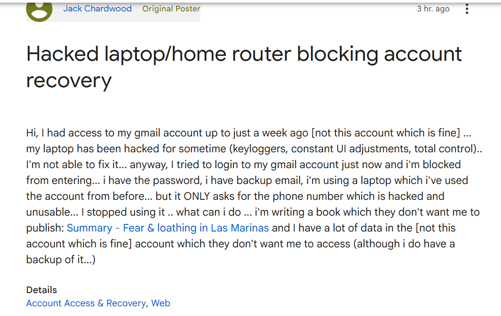

# January 2026

## A "date" in Barcelona

- Word on the street is I had a "date" in Barcelona: meaning yet another sedated rape event I'm only now aware of having occurred.
- I'm wondering when that could have been.
- I was up and down to Barcelona so many times between 2005-2016 when I lived in Dénia and Madrid.
- Let's list those visits here - as much as possible - and see which of them are the most likely.
- I'll add any more I remember as we go along.
    
    1. I visited Barcelona in 2016 to do a yoga class with Pattabhi Jois's daughter who had flown in from India. I stayed at the Gran Hotel Rey Don Jaime, just outside the city in a small town called Castelldefels, which had the most expensive parking meters in Spain. This is the favorite as I was living at spy-cam-networked Joan Fuster at the time and I was likely being sedated and filmed two or three times a week.
    1. I had an extremely suspicious time at the Amma retreat in Barcelona in October 2015. The Spanish organizer became apoplectic with me for asking, politely, for a private room. She raged at me for days and even told me she hoped I would crash the car on the way home! If a sedated event had happened there, it would have been with another person as I was sharing with an Angolan woman. Sandra Rita Diaz had been interested in all this.
    1. Then there was the Cleargreen retreat where [I met Gammadian Freeman/Richard](../early-years/2011.md#gammadian-freeman-and-his-mate), probably late 2008 or early 2009. I was sharing with others in the rented apartment if something had happened there. Was Jess from the [Avila meditation-retreat-centre-cum-porn-studio in December 2023](../2023/december.md#vipasana-meditation) at the Cleargreen retreat also?
    1. Of course, there was [the invitation from Grace to meet her and Nadim](../2023/november.md#starting-my-new-job) (and others I suppose) in Barcelona just after I started at Polygon; which didn't happen because I found out online that [Nadim is an actor](../2023/november.md#nadim-kobesi), everyone knew I had found out due to constant hacking, and he got himself fired immediately.
    1. In October 2007, I traveled by bus to Barcelona to attend a Kabbalah conference. I shared a hotel room with my friend Richard so there's no chance of any funny business on this occasion.
    1. In early 2006, I traveled to Barcelona to attend a Vipasana course which I got thrown out of for being utterly depressed and irreverent (I had just remembered gang-rape at an Iboga retreat in Montpelier). I don't remember where I stayed before and after the course but I got the train to Barcelona from Madrid that time.
    1. In January 2005, I traveled to Barcelona to attend a women's well-being retreat with [Sat Santokh](../early-years/2005.md#womens-retreat-with-sat-santokh) and three other women, but we all slept on the floor in the Kundalini yoga studio... you never know though.
    1. In December 2005, on my way to the Iboga retreat near Montpelier from Madrid, where I would remember, for the first time, gang rape by Jamaican rape-gangs in Tottenham in 1989, I stayed one night at the hotel inside the main train station. My room had a picture of a lounging devil with a huge phallus over the bed which I found sinister and unsettling. I had a terrible bunch of dreams that night. I dreamt of [Jitendra Das's teeth](../early-years/2010.md#why-i-decided-to-be-celibate-for-the-rest-of-my-life) (realizing this was so when I meet him five years later). I also dreamt of a young Spanish man at the foot of the bed on his knees and pleading for his life with a bunch of horrible men standing over him pointing guns at his head and threatening to kill him. Was he going to be someone I know? I guess this night is also a favorite.

    !!! tip "Iboga retreats"
        - The gangs would have been aware I was going on these retreats, and aware that they often surface hidden events from the past.
        - I wonder if they felt it imperative to attempt to undermine any healing I might have had from attending this retreat.
        - In retrospect, the criminal-element I oftentimes met on some of these shamanic retreats I was going on to try to access hidden memories - and numerous odd experiences I had with these people - could well have been part of the distract-and-discredit massive don't you think.

## Could Brian have known who Ugly was back in 2001?

- Pathologically inclined to think the best of everyone - not a bad thing - I start to wonder if the [weird occurrence with the ugly man](../early-years/2001.md) in Amsterdam in 2001 implies that Brian - my boyfriend at the time - knew who he was?
- In November 2024, Brian and I had a long forgiving chat about the past on Facebook which was really healing.
- A few days later, [I remembered Ugly in the back of the car at the Holiday Inn in Amsterdam](../2024/december.md#unable-to-access-my-laptop) after a stalker account posted a triggering picture on X.
- I continue the Facebook chat with Brian, and I ask him if he remembered the weird event with the ugly man, or even me telling him about it?
- He answers: *we were very high in those days*, or similar, and nothing else.
- Not a: *no, what was that all about, that's weird*, or *mm, maybe I remember you saying something about that*... no.
- "We were very high in those days."
- He has now blocked me - also interesting - so I cannot quote him.
- Brian did have a dreadful coke habit at that time, which is also, perhaps, significant.
- I just followed along really... anyway.
- If Brian does know Ugly, that puts our relationship into an ugly place.
- Was there a sedated session that night in our hotel room in Amsterdam?
- I have vague recollections of being in the bar, drunk with Brian, perhaps chatting with people there, and then nothing until waking up in the middle of the night in our room apparently after going to bed and sleep.
- If Ugly was playing a part in our lives without my knowledge, did he also interact with Niall Brian's brother, [Paul](../2025/january.md#paul), yes *the* Paul, and even a common friend Simon who came to visit with the boys one evening (me the lone female in the house)?
- I have a feeling I remember Brian and Niall talking about a man they called "Ugly"... 
- "Who's Ugly", I asked them..

## Continuing threats

### Strange messages about dying for friends

- Over the last week or so, I have seen, repeatedly, a quote from the bible in the Gospel of John about friends who are willing to die for their friends.
- I even looked it up to see if it really existed as the language was a bit strange and I hadn't heard this quote before, nor at all since about two days ago.
- It is from John 15, verse 13.
- Seeing this every day feels like a threat of some sort, a message, but I'm not sure what it's about.
- I haven't been watching the news.
- When I see the news about the Spanish train derailment I start to worry about Inma.
- I tried to email her from my `katharinejchardwood@gmail` account and as I was responding to one of her emails, I instantly lost access to the account.
- I try to access the gmail account, but I'm blocked from doing so, the normal options are not appearing.
- I get a response from her from a different email which is good.
- The email I cannot access has so much porn-gang data in it; I wonder if Google backend developers are blocking my access.

### A sinister man in the newsagents

- Back in London I feel, again, like if I leave the house anything could happen to me.
- I pop up the road to get pizza and a loaf of bread.
- A sinister cockney man comes into the newsagents right behind me and growls at my shoulder; "nice weather for ducks".
- The shopkeeper is concerned about him and is watching his every move.
- I wonder if he is suggesting I'm a sitting duck.

### Have the caliphate found out about me

- I'm in Decathlon paying for my items.
- A man dressed in traditional Islamic gear - plus trainers and a coat - comes in asking all the staff if they're Indian.
- I hurry off.
