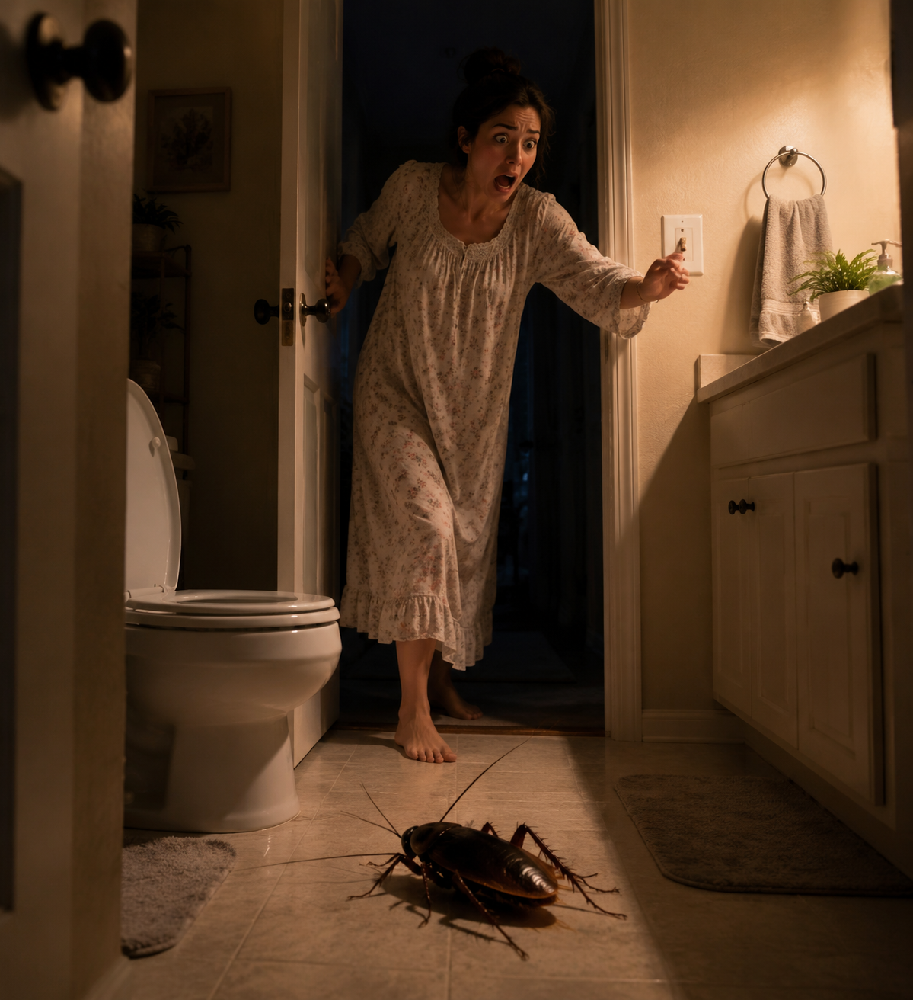
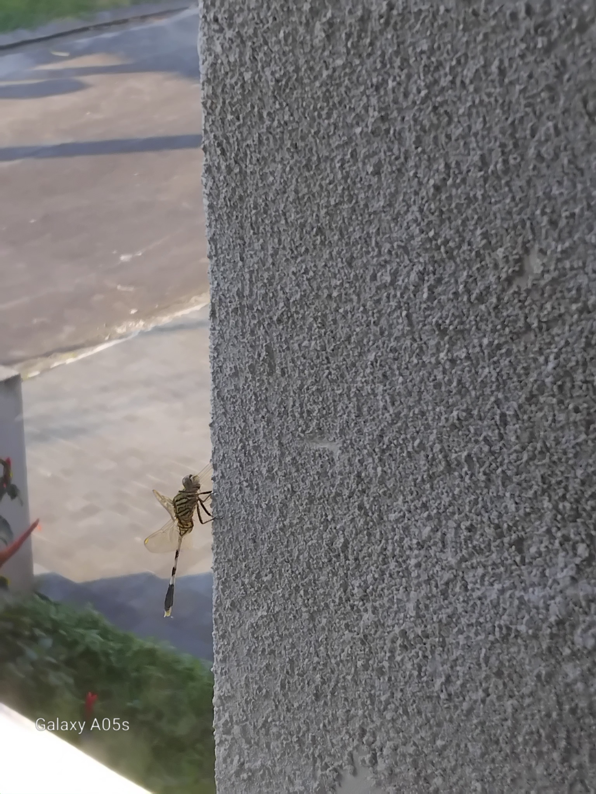
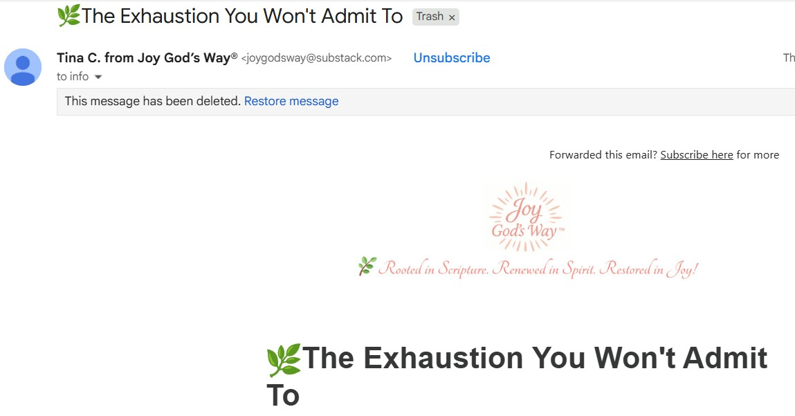
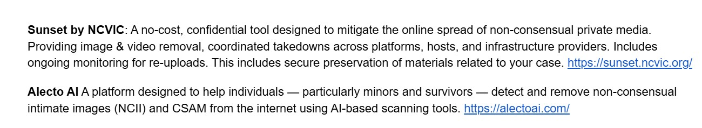
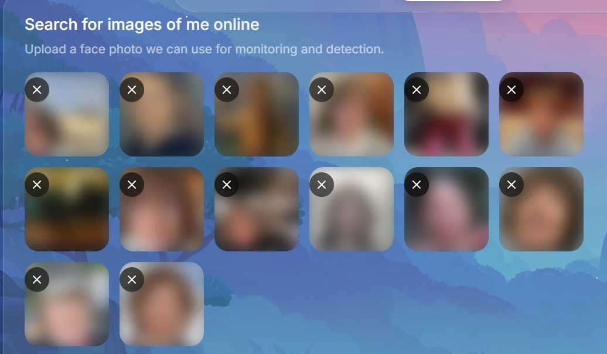

# July 2026

 
## Loka yoga

- YTT.
- I decide to try and do productive things with my time while I'm stalked endlessly by international security services and criminal gangs.
- I pick a month's long yoga teacher training course in Bali.
- It's agents. Everyone there. Is an agent.
- The whole thing is set up for me.
- I endure an intense psychological breaking day or two - this was really horrible - and I quickly realize they're not who they say they are, but something is very interesting about what's going on, so I'm hooked on finding out the truth, and so I tell them I'm only coming in for the yoga at the beginning of the day.
- They make sure that, by making the rest of the sessions excruciating, that if I don't run away immediately, I'll only come to in the mornings.
- For two weeks, I do yoga between 6-8am, and I stay the rest of the day, on my own, in silence in a house in Bali in the middle of nowhere.
- There's agents next door though, on all sides. But they don't talk to me. 
- They're all pretending to not be American.
- Eventually, I decide I'm leaving because I feel like I'm under house arrest - like I don't mind extended house arrest such as in Samui, where it's not like solitary confinement (apart from when it affects the local businesses, I don't like that) but this was OTT.
- It was clear to me, eventually, that the people "arresting" me, as it were, although on my side in certain respects (law-enforcement being the main one - although my trust has failed here too now) they do not have my/our long term best interests in mind.

### Arriving

- They make a point of telling us how trustworthy the taxi driver is, and then switch him at the last moment without telling me.
- I'm high that night.
- How do I know?
- The cockroach in the bathroom was about a metre tall and my reaction to it was extraordinarily exaggerated. 

- While this was happening, another part of my mind, a calm part, could see very well that the cockroach was big but not that big, and so I noticed my reactions were pretty unusual.
- Like, honestly, they're not that bad and there I was sitting on the bed, hand on my heart, laughing nervously.
- The rest of the night every bump and scratch sent me jumping out of bed and looking around.
- It all made more sense over the next few days.

### First day

- I wake up and notice a dragonfly outside the window.
- Again, my senses were unusually sensitive to have noticed this tiny creature and been amazed enough to take a picture of it.

- I'm thinking the cockroach is the hideous (but harmless) monster I have to deal with.
- And the dragon fly is my friend, watching and waiting for me to finish dealing with the hideous (but harmless) monster.

#### Stella

- At the first session, the teachers introduce themselves.
- One of them reminds me of the acting students on my first degree course in Performing Arts. She's performing.
- There's a Scottish woman teaching some classes on the course and her name is Stella.
- Stella studied ashtanga yoga in Euston, like [Natalia had, fellow porn gang target in Dénia](../2011-to-2020/2015.md#nati-de-prati-yoga-teacher-and-porn-gang-target-just-like-me), who I have written about extensively in this police statement as having had the same experience as me with the porn-gangs in Dénia.
- She had been studying there with Hamish, right up until she moved to Dénia.
- I was always wondering what brought her to that region of Spain, and have been very suspicious that it was connected to the North London gangs who have been making billions on us for decades, but I didn't have a solid lead.
- Until Stella.
- I bump into Stella after the session and ask her if she knows Natalia.
- She does.
- She tells me Natalia was a senior assistant when she was going to the studio.
- I explain that Natalia was targeted by the porn-gangs in Spain, that they had done the same to me too and tried to murder me, and that they even got a baby out of her.
- Stella looked ashen, and a little bit like Domingo at one point; like totally pale and monstrous.
- Whatever hallucinogenic substance I had ingested was, by then, exaggerated things to this extent.
- When are they going to bring them all in, I wonder? Or do they play lets-pretend with all the more robust victims?

#### Getting to know everyone

- It's a group of about twenty students, and every one of them has something for me.
- They've all obviously been through military training; they're tough and fit and strong, most have never done yoga before and can get into extremely advanced poses right off the bat.
- Normally on a retreat like this, you would expect a few to quit early on, especially as the sessions during the day were pretty boring (without the psychological torture taken into account)... no-one quits. It's unprecedented.
- In the next session, we have to pair up and find out about our partner.
- Then, each person introduces their partner to the group.
- As they go around, every student behaves in exactly the same way the students on the BAPA course at Middlesex did. They're all performing. 
- The party tricks are nearly all the same! Bodily weirdness. Personally, I had a much broader bucket for party trick examples.
- It's amazing to me. I can't figure it out at first. So I wait.
- I pair up with a man from Singapore.
- We have to answer all these questions.
- It's time for me to speak my truth.
- I tell him what's going on with me very openly.
- He tells the others my answers.
- We didn't finish the questions so I answer the rest of them directly to the group.
- When I get to "what's your party trick", I say "surviving poisoning attempts".. it's not that but I can't remember the question before.
- I explain I have been poisoned repeatedly, I explain by criminal gangs, and I tell them I don't die.
- No-one seems particularly surprised.

#### The psychological torture begins

- Perhaps the dose is ramped up at this point, because I cannot remember what the next session was even about.
- But whatever it was, it involved a lot of talking, answering questions, all the students interacting, speaking, a conversation with the teachers.
- Interspersed with everything they said, were trigger meme's from my life experiences and particularly in reference to sexual violence and everything that happened in Dénia.
- I started to become totally disassociated and found myself thinking more about the trigger memes than whatever it was they were "normally" talking about around it.
- Some of this has already been set up, but I missed it the first time around.
- Here's a list of words or phrases or names that kept coming up:
    - Winston.
    - Coffee.
    - Tonia - pronounced Tona, no Y.
    - Imagine waking up with no legs.
    - Tibetan monks.
    - The Tibetan monk's name, which incidentally I had forgotten and they used a name he doesn't really use much also, which was amusing.
    - Setting up brand memes to use later for triggers: *Lululemon*, for example.
    - Horses - I might have gotten confused with the British spy (policewoman - not you, you were cool, the youngster with the Metattude) in Thailand there.
    - Phones up in front of me as if they're filming me.
    - Divine feminine, divine relationships.
    - Arrows (see [June section](june.md#hastening-home-lesson-226)).
    - She's utterly exhausted - posts coming in from Joy about exhaustion.

    

    - Phrases and sentences from non-fiction, fiction, blogs, emails, tweets and similar from as far back as 2007 to the current time, that morning even sometimes if I had been online before class.
    - (I'll keep adding these in as I remember them..., it's gonna be quite a list)

- It was a battering.
- Why would they do something like this? I couldn't understand it at all. And while it was going on (whirl-winding around me, slap, slap, thump) I was unable to assess it properly.
- It was *exactly* like how the porn-gangs operate on targets, except even more exaggerated, and I felt like I was back in classes at the conservatory.
- I started to feel the cameras on me too; as if there were hundreds in the room - they would make sure I was standing in a particular spot at times.
- I felt sensors measuring my physical systems, heart rate, temperature, everything.
- I realized my house was set up in the same way and indeed I would get confirmation online about things I'd done on my own quietly in private.
- What purpose does something like this serve?
- The only thing I could come up with was they might be trying to recruit me as a spy and part of that is breaking someone.
- I thought they maybe thought psychological violence and breaking me was a way to control me in perpetuity.
- I had no idea they had even more sinister intentions.
- I lay down on the floor with my face on the ground, but stayed in the circle, because I was not ready to run. 
- I needed more information to find out what was really going on.

#### Welcome ceremony

- Someone asked me how I was doing when we went to the garden for the welcome ceremony with a Balinese priest.
- I told her I was having a massive panic attack and PTSD reaction.
- She never mentions it again.
- The priest says some weird things like he's not taking anything seriously and knows who these people are: *thank you for the airport*, he says.
- This is the first day over, unless there was something else, yes there was because the flowers from the ceremony kept going over the floor.
- There was another session of psychological torture before the day ended; I have no idea what the content of the session had actually been.
- The torture was so effective that it totally dissociated me and I have no recollection of what these sessions were posing as.

### Involving the locals

- Related to the previous entry, my captors involved the locals in multiple schemes including the priest who, it seemed to me, was doing his best to be as irreverent as possible for good reason - did he know what they were up to?
- It seemed that everyone in the local area knew what was going on.
- The Balinese are not stupid, and they talk to each other, and even the women at the massage parlour down the road seemed to "recognize" me whenever I walked in.
- The local Balinese men that recognized me grinned and giggled.
- The local Balinese women that recognized me looked like they were in mourning.

#### The fake pervert in security

- So they set up a situation where it's the first morning of the first day, and I'm walking into the school in the dark before the sunrise, and I'm just passing the security gate at the estate, and a guard (out of uniform - they're usually dressed up well) is lying down looking at his phone, in a position no-one would ever be in because he's sitting the wrong way around in his chair, but in this position he can see me perfectly as I walk by, and he's well lit by the cabin light so I can see him perfectly too, and as I walk by he pretends he's masturbating to porn on his phone.
- He's even grinning at me as he does it.
- I wag my finger at him - sort of mock-angrily - and carry on walking.
- And promptly forget about it.
- It didn't seem real to me at the time for some reason. It was unconvincing and non-threatening, but very rude yes. Nevertheless, I totally forgot about it.
- Something compels me to remember this event sometime later, maybe on the evening of the following day even, when I tell Taryn at the school about it at the end of a chat about something else (the see-through windows I think).
- She says she's going to have a word with the owner of the housing estate who lives in Switzerland apparently.

#### The see-through windows in the house

- I also mention at the same time that I have been going to the toilet, bathing, showering, and dressing myself with some risk of being seen by anyone walking outside, and every neighbor at the back because the curtains are completely see through.
- So there's a fuss about this, and they sort it out.

#### Taryn tells me they fired the man

- I'm informed the security team checked everything over and fired the man.
- Something's ringing untrue with this whole business, because he was obviously acting - told to behave this way - but whatever.

#### They come and fix the windows

- One of the estate managers comes with some men to fix the window, and I'm pretty sure it's the same man I saw grinning and pretending to masturbate on the first morning.
- He's nervous too, sweaty and can't look me in the eye.
- This is after the sacked someone, apparently.
- I'm wondering if they're trying to figure out how bad my facial recognition skills are.
- I can tell you they're pretty bad, and bad enough not to mention this to anyone because I'm so unsure.
- But I can tell what people are thinking and feeling if it's intense, and if I know them, even if I just spent a whole day with them, it doesn't matter what they look like, I know who they are.
- Anyway, that's incidental maybe, or perhaps part of their research efforts.

#### A man approaches me in the street

- I'm walking to the beach one day about a week later and a man drives up beside me on his motorbike and starts to talk to me.
- At the same time, a van full of working men (Indonesians) pulls up on the other side of the road to watch us.
- The road is always completely empty, it's a very quiet area, hardly anyone around.
- So this man is saying, because of me reporting this masturbating man, he loses his job, but it wasn't him.
- And indeed, I don't think it was him, but regardless, just like the man pretending to wank, this man means me no harm, and I know it very well.
- And at the same time, I'm aware that this whole business is some sort of ridiculous scam set up by my captors.
- So I say a few words, tell him to get another job or something, and ask him to give me a lift down to the beach, which he does very obligingly.
- I go into my massage and the women there look at me like they know who I am, and what's happened to me, and what they're continuing to do to me: sad and distressed, unable to speak about it.

### Second day

- I'm high and I'm getting a headache. 
- I come for yoga and plan on attending the full day.
- I do, but it is exactly the same as the day before; a full on psychological assault while I'm excessively high on something.
- It starts with physiology and again it's just meme after meme, even referencing conversations I've had online with the gypsies, amazing.
- At this point, however, I have a feeling, however, that something loving and kind is communicating through me back at them, and sometimes I notice it too.
- Again, I stay in the circle, or as far away from it as I can be without disconnecting completely, with my face down so the cameras aren't recording every twitch.
- The class content is designed around mass porn-gang sexual-violence rape-gang-porn-star meme triggers, or me being a superhero, or whatever; the faux content of the classes is secondary and not really what you would expect at all from a YTT.
- So, at the end of the second day, I call it a day. 
- I wonder if it was the third day, I was so high those few days I can't remember well.
- They've given me an out in any case by saying you can come to whatever classes you like and not sit the exam.
- So I inform them I'm taking this decision and only coming to yoga in the morning.
- It's what they intended.

### Weird body positions

- We're asked to make shapes you wouldn't be asked to make in actual yoga.
- For example, put your fists between your knees to measure the correct distance between your open knees, with a demo from the teacher.
- My knees are splayed, the whole pose would collapse like this.
- This is no measurement.
- I realize it was a position I was put in while sedated, so it's on film.
- Other things like that.
- Body positions I made while masturbating in my bathroom with the lights on.
- Always something.
- It's so embarrassing, you cannot imagine.
- I mean, when every man with a porn subscription has seen you doing these things, and would recognize you in the street, at your job, anywhere in the world, the embarrassment on its own due to the (snickery) attitudes they have about you from seeing you like this totally destroys your life; murder by embarrassment.
- I think this justifies at least a billion more in compensation.

### Two or three days of this before the non-visual-hallucinogen wears off

- I think it was Tuesday afternoon when I started to yawn excessively, the anxiety and dissociation dissipating.
- I was finally coming down.
- I'd arrived on Saturday and been high since then.
- So I'm in Bali in this house on my own going to yoga for a couple of hours in the morning, and I'm being fed, watered (they suggested to me that I was drinking salt-water for days and didn't die - I don't believe them), and monitored closely, every move, every word, every breath.
- There's a pool in the complex but there's rarely anyone there.
- I'm writing every day, and it's another conversation with the people that are trying to control me, as whatever comes up seems to map in extraordinary ways with whatever's going on.
- It's curious.
- It's God.
- And I think he's annoyed with them.
- I'm sober and continue going to classes, and they continue to do their horror meme triggering thing - this time it was music repeated the Tibetan monk's name over and over, which I didn't even notice for a while sober it was so ridiculous.
- I tell them so online later on; what did I say, something like it's just *trifles* really, and then later online I said *trifles* was euphemistic for a bit silly.
- Fatuous is the better word.
- It stops.
- Just like with the Dénia porn-gangs, the manipulation needs drugging to work effectively.

### Walking into yoga class

- There's a bunch of drones above us, it's 6am, they're up all day too.
- I start to wave at them and make hearts. They don't turn up anymore.
- There's robot birds, bees, a massive snake, and a lizard too. You can tell somehow, they're not quite right. I'm amazed.
- On my way home from a walk to the beach one day, I see a cloud with an arrow in it, and another one with a heart.
- I know it's robo-clouds because they're framed the same way, and God does *not* do clouds like that.
- I'm amazed.
- I message my captors telling them I'd be happy to talk to NASA but not for a few years; there's more important work to do first.
- They're distracting me, flirting.
- It's annoying.

### Thursday and Friday night of the first week

- Thursday night something happens while I'm sleeping and I dream about it.
- Two men, and nursing (breast-feeding) symbols, and me, and an ache in my left ovary and an orgasm.
- Very weird.
- The next night, Friday, a nightmare.
- I dream my mother drowns (I'm not sure but she might have been murdered).
- I find her body in a circular concrete vat of water you might see in a field. She's wearing her old brown coat. I try to pull her out, she's too heavy.
- I wake up devastated, my heart thumping to the same rhythm as the music in a car parked outside the house.
- Close to the end of the dream I had also sensed two men in my bedroom and one of them is putting something up my rear end while I'm lying on my right side.
- I get up and email my mother to see if she is OK.
- (Incidentally, I annoyed them over a month later by mentioning [Kathleen Love](../2011-to-2020/2020.md#kathleen-love) and right after I did so, when I went for a walk, people kept walking past me suggesting my mother was having a heart attack... fatuous, like someone else said, unnecessary, time-wasting).
- I'm hoping at the time she'll reply and tell me my dad's been arrested, but she doesn't, she replies they're all well.
- My bottom feels like something strange happened - I *never* felt like this in Dénia. I think they must apply numbing creams or something.
- Next morning God speaks directly to my captors, and says: *you stupid idiots*.
- On the walk in to class, Saint Michael is in the clouds, fierce and furious, red and black as the sun rises. 
- Anyone who has seen the angels in the clouds will know exactly what I'm talking about, there were some in Thailand at Christmas but they were loving and kind. This was war and fury.
- I wonder what they did to me, and what He did to them... or was/is He going to build up to it.
- The following morning, all my classmates seem sad. None of them want (or are instructed) to speak to me.
- I look for any place they might get into my house while I'm in bed (unconscious) and block it off.
- I sleep very well from then on and even the callous in my palm that I had been making while asleep starts to disappear.

### An infected spot near my right groin

- I noticed this first in April 2026 in Dublin, a spot which doesn't squeeze like normal spots to the right of my genital area.
- It had been quite painful, also in an unusual way.
- It reappears in Bali, and I notice it and pick it and it doesn't behave like a normal spot, you can't squeeze it, but it is painful and does become pussy over the next few days.
- It looks like a pinhole surgery wound.
- Also there's a similar spot in my left groin that reappears which I have not seen for a good while, maybe not since November the year before when I was in Bangkok at the Anantara... there was so much fatuousness there it was quite astonishing...
- I guess it could have also come up January in Dorset too, or both times maybe.
- Again, the spot doesn't behave like the boils I usually get there at all, the skin is so thin all over this area from the strong cream I used for the boils in 2019 that any wounds in this area, and the healing of them, do not behave as expected.
- My view is that all this is verifiable on examination and I believe they have been after my eggs and *hatched* their evil plan right after [I survived poisoning in July 2025](../2025/july.md#lourdes), which they had obviously ordered.
- The theme of pregnancy and babies had been suggested to me quite intensely in Israel on module 3, just a month after in August 2025, without anyone formally saying anything, just hints and suggestions, but very clear ones... and I was thinking they were suggesting I had a baby at my age, and I have been excited about that anyway since August 2024 when the gypsies started their baby-manipulation tech on me and I realized they'd gotten a baby in this way from Natalia and countless other women for the baby-rape porn-production.
- I believe these suggestions on module 3 were set up so that I would completely misidentify who was behind the egg-thievery if I ever got suspicious for any reason.
- Bastards!

### A meeting with someone important in Bali who knows what happened at the Hyatt in May 2024

- They set up an event on our free day where we all went for a walk and had lunch.
- I think they're doing this to give me *some small reason* for all their insane and criminal activity.
- Perhaps they're trying to convince me that someone is going to do something about the baby-rape industrialists.
- They've put millions into this lie. Millions and millions.
- All this for my eggs? And then what. No doubt bad intentions.
- The VIP they're targeting is also, incidentally, the owner of [the holiday housing estate I'm staying at, Cidana Putra](https://www.google.com/maps/place/Sadana+@+Ciputra+Beach+Resort/@-8.5932351,115.0780038,867m/data=!3m1!1e3!4m14!1m7!3m6!1s0x2dd239494be08af1:0x89c8ea0c1bf6dc31!2sLoka+Yoga+School!8m2!3d-8.5945877!4d115.0846235!16s%2Fg%2F11nym8642j!3m5!1s0x2dd2377225ebba59:0x3c00335d560f8679!8m2!3d-8.5937484!4d115.0758602!16s%2Fg%2F11h71kwypp?entry=ttu&g_ep=EgoyMDI2MDgxMi4wIKXMDSoASAFQAw%3D%3D); 22-7 lock up as it were.
- The psychological nonsense went on all day; it was pretty intolerable except I had fallen in love with all of my classmates by then (from the morning classes) so it wasn't too bad.
- It was funny though.
- I'd be chatting to one of them, and they'd get a flea in their ear about something, and run off, or make excuses and stop the talk, or bring up something totally tangential for no reason.
- Or another would be told how to act with me, and sometimes it was so ridiculous I found it quite amusing.
- They were taking roles, and swapping them, and I think even the dogs were trained to move away from me, and towards a pen clicking I believe.
- One of them was pretending to be an Israeli on the bus, and asking me questions as if I was seeking asylum.
- Another was pretending to be a government official in charge of the "bridge". 
- Another, Brit - who I have seen before and remembered where, then forgot, maybe at a retreat somewhere in the UK - was asking me about my intentions, would I ever come back to the UK, that sort of thing.
- They were all actors.
- It was total bananas.
- Anyway.
- At lunch that day the important landowner in Bali who had known what had happened with Polygon at the Hyatt.
- Did he organize Elon's visit that week?
- And the lunch was all a bit cloak and dagger, and hush hush, and I was getting used to all this.
- And all the yoga students (agents/actors) were prompting me to say things, and, we're sitting right beside this Bali VIP, and, never one to disappoint, after the man (my yoga chum aka agent) had told me, loudly, that he'd been unconscious for a whole week years before, and he didn't know what had happened to him during this time but he'd had PTSD ever since, I got very cross and said rather loudly: 
- *I hate it that they did that to you. They're such shit bastards aren't they!*
- And the other agent lady who I love sitting in between this VIP man and his wife and our classmate spat out her tea!
- It was hilarious.
- So, a positive result of my Bali stay was I have been thinking about May 2024's events more closely, and remembering even more weird things, and realizing that I was probably sedated and raped for most of that week with my employer, crypto-giant [Polygon Labs](https://polygon.technology/about).
- And I have to wonder who's turn it's been on their other off-sites since then, and before too, and whether this is now an industry expectation: *rape the female colleague you hate on our off-sites... she'll never know!!!! ... and if she does find out, don't worry, we'll make sure the secret services silence her*.
- Do you think they add it to job ads and specs, *special events* maybe, like they say at the swingers club in Dénia?

### Another criminal is brought around the world for viewing

- This time, they bring [Rene from Australia](../2001-to-2010/2003.md#turtles); I've literally just remembered her and written about her, it's a few days after.
- It's only a short hop to Australia so they could have hauled her out quite easily, especially if she was in prison which is likely.
- She's sitting with an agent by the pool one afternoon when I turn up.
- She keeps the towel over her face.
- She's embarrassed, ashamed.
- They leave soon after I arrive.
- I never see either of them again.

### Pretending to be someone you're not

- I look around me and I see a multi-million dollar budget: houses, vehicles, yoga studios, intricate set ups with very rich people, it's astonishing.
- I think probably 80% of occupants at the Holiday Inn while I was there were spies too.
- They must be spending an absolute fortune; is that why they keep suggesting cheap hotels to me when I have nowhere to go?
- Every time they get close to convincing me they're someone else, I remember how much money they're spending, and especially the drones, people, and robots.
- I wonder why they wouldn't try to help me when I've asked for help with justice continually, and my health and wellbeing, and instead all they've done is given me such a hard time.
- Do they treat men in unique positions like mine the same? It seems not but perhaps they're more easily controlled. 
- It takes a while to figure out what they're really after - it is still utterly illogical and irrational - and when I realize they tried to set me and Steve up for offspring purposes, and when that didn't work out for them, they decided they'd just do it anyway, I'm pretty astonished, and upset, and understand why God said what He did when He said it.
- But, again, it's all His Plan, so I'm sure that all of this mess will serve some unique purpose of His we can't guess at, and we can get on with the world-saving.
- I realize why God's Plans have to be so unique because there is so much against Him in this violent and violating world that hates itself.

### They show me some more recent porn

- I keep asking them, telling them I'm ready to see it now.
- Eventually, they show me a still with the details shadowed out.
- I can see it's definitely me, however.
- I'm naked and apparently sitting up, although the camera man could be taking the photo from above, I guess, while my head is propped up on a pillow.
- I'm looking down my naked body - I'm not sure if my eyes are open but I guess they will be as that's how [the Dénia gang's sedating substances function - see Zoe's daughter Yasmin in 2008](../2001-to-2010/2008.md#yasmin-falls-asleep-with-her-eyes-open).
- Around my groin and genital area is the back of a man's head. You can see messy hair.
- I try to figure out the date of this outrage but it's too difficult as my face is in shadow.
- I guess it could have been anytime up to [poisoning in October 2024](../2024/october.md#serious-poisoning-with-intent-to-kill) when I started to put excessive weight on around my vital organs, because I couldn't see any evidence of that.
- The closest image to my head that I saw on this fake account pic on Substack was how I looked from about 2015-2019 I would say.

- This image is now [in online search by formal and allegedly un-shadowy law-enforcement teams](#the-justice-defense-fund-reach-out).
- I do remember the last time I really felt slim like that was in [Madrid in May 2024 just before Bali](../2024/may.md#bali) when I bought some small-size jeans which I now billow out of.
- I wonder if the poisoning with intent to kill began straight after, and I started to develop inflammation around my liver area at that time which suddenly made my yoga practice deteriorate and has similarities to [Maria's horrific experiences in Dénia too](../2011-to-2020/2015.md#vipasana-maria).

#### They tell me what happened to Lorraine

- I also found out about what happened to Lorraine Blackbourn that caused her to commit suicide, and they even demonstrated the torture-porn rope ties on a snoopy video AI-tailored just for me.
- The Snoopy AI videos started on [Air France in May](may.md#air-france). 
- There were so many in Bali, I think I was stressing them out because I was wanting more and more :) and they couldn't keep up with the production of them..
- Snoopy is supposed to be me, and Woodstock my love, sometimes Snoopy and Woodstock are mixed up and Snoopy is the intuitive artist who they've given unlimited supplies to create with, and Woodstock never shuts up.
- Oh, whole loads of information about my love: how he is clumsy at posh dinners, sad about something, is a father, has a life partner, all this madness and lies, has to move house now I'm on my way soon, tomorrow, today, Friday, at 9am, etc. etc., and it'll be a helicopter (meme began in Samui in December with a woman pretending to be UN, then fed again in Dorset with the field they were pretending was a heli-pad, then constant on Snoopy videos, just endless lies...) just to keep me distracted...
- Extraordinary.
- What TIME WASTERS!!

### They tell me about Chris Ludwick's excel porn database

- They tell me they've heard about, or accessed maybe (he was hacked a few months back and I noticed and told him), Chris Ludwick's database recording the collection of porn he has starring me sedated and raped.
- It's on excel.

### They're sure to tell me they know everything about me

- Another conversation after class, another confirmation they know everything about me.
- They would repeat my sentences verbatim back at me from blogs I wrote in 2013, ideas from my books, for example.
- Another one was I have an unusual injury in my solar plexus region which I have noticed for some years during yoga in certain poses.
- Oh, I was talking about something completely different, liver inflammation, and she starts talking about the funny pain in her solar plexus region (verbatim) she's had for years that only happens in certain poses.
- This must really freak people out who are not expecting it. 
- Do they think they can control people like this?
- Is that the core process, fear and domination?
- I'm a bit like... *yawn*, now.

### Yet another (fake) bridge collapses, again

- The way they set things up to make me believe I was going to be taken to safety is criminal, oh wait, yeah sorry forgot. It's what they do.
- What is the airspeed velocity of a coconut-laden scanning swallow?

- European or African?
- How do you know so much about swallows?
- Well, a king has to know about all sorts of things you know.

#### Monty Python

- It's extraordinary how many of the sketches in Monty Python's Meaning of Life run through our story in hilarious ways.
- I particularly like the deadly fluffy bunny.

### I decide to leave

- I hear "pack" in yoga class on the Saturday morning.
- I've realized that the intuitive agent business can also plant ideas in people's heads and this explains many of the thoughts I have which feel alien, and this one feels a bit alien too, but I like it, it's good advice.
- It's time to go. This is a farce.
- I reschedule my flight back to Beijing but at Bali airport decide to fly to Israel instead.
- Hackers desperately try to make it impossible for me to get an ETA for Israel by making the photo fail every time I send it, until a lovely lady, an angel from Emirates takes my phone and does it herself.
- She sees the confirmation email from the Israeli government, but minutes later the email has disappeared.
- It went into all mail instead of my inbox, for some weird reason.
- The angel sorts it all out for me, and I'm away.

## Comparing the criminal porn-gangs with unscrupulous and insane security service activities

| Criminal gang type                            | Budget                                                     | Core process           | End goal                                                                                                     | Methods                                                                                      |
|-----------------------------------------------|------------------------------------------------------------|------------------------|--------------------------------------------------------------------------------------------------------------|----------------------------------------------------------------------------------------------|
| Porn gang                                     | €/£ Thousands - as little as possible, slave labour mostly | Violence and violation | Criminal porn production by any means necessary, always worsening in step with porn-addict appetites         | Sedation, drugging, poisoning, psychological torture, hacking, murder, serious sex offending |
| Security services aka The Mayor of Shark City | $/£ Multi-millions, thousands of salaried individuals      | Violence and violation | Whatever they want, often nothing to do with security, mostly coming from insane logic based on core process | Sedation, drugging, poisoning, psychological torture, hacking, murder, clandestine surgeries |

## Re-membering

- I used to say that a lot on X to the porn-gangs.
- Remember.
- God *is* a lost limb for so many.
- They don't even realize.
- There's so much more I can tell you from these two weeks in Bali... but I'll leave it here unless I get a compulsion.
- I can tell you I paid nearly £3000 for the course and I wouldn't dare ask for a refund!
- I mean, can you imagine them reaching a hand out after spending so many millions on me and getting what they wanted when they despise me like they do?
- No, they don't operate this way: *loving and kind*.
- The irony is that *loving and kind* is true strength - and that doesn't include saying *be kind* to everyone and being quite the opposite.
- Auto-violence and violation as core process is a mighty declaration of weakness.
- In any case, they owe me billions since [Tanya (Tanya!! omg) recruited me for the intuitive program in April 2006](../2001-to-2010/2006.md#total-eclipse-of-the-sun), without my consent or conscious awareness, and I helped bring down a real thorn in their side, single-handedly, while they knew I could be counted on to be raped, murdered, whatever... and no-one would give a damn.
- And *that* is the main reason their attitude towards me prevails, while leading me into fiery furnaces they cannot even have imagined back then; that I, an innocent tax-paying civilian that has done the impossible, am utterly worthless, apart from my eggs which they'll literally murder to get hold of.
- Adams and the porn-gangs of Spain knew, didn't they, and that's why they were astronomically outrageous with me, isn't it. 
- Every thing they did to me was an *up yours* to the mousses, wasn't it.
- The files on me must fill a room.
- May the mighty *Pit of the Salmon Mousses* be the last unprosperous weapon I have to deal with.

- I guess God is going to give me my babies back, and the house. We prayed for that, me and Tona-tone-tone.
- I was needing some clarification on the name... in case Tonia was the Pangolin and the angel is Daniel. Do let me know. Thank you.

## The Justice Defense Fund reach out

- I receive an email from the [Justice Defense Fund](https://justicedefensefund.org/), an organization which is thank God going after the Big Porn crime scene, and the Internet's saturation with online sex crimes.
- They give me the details of two organizations that can help find evidence of the porn of unconsenting and sedated victims in the historic record.

- I contact them - even though I know the law-enforcers around me have the whole collection already, they're keeping quiet and they're too busy bullying me.

### Sunset Portal by NCVIC

- This website will do an online search for images of you in porn: https://sunset.ncvic.org/.
- I have 15 images up now, from when I was 16 up to last year.

- And I added some porn names too (porn names: such a good joke and a laugh, snicker - I wonder if those marvelous men use them on the children and babies too).

### Alecto AI

- I contact Alecto AI too.
- As I'm browsing their website, I see a reference to *investor* OKX on their website.

- I remember [the OKX guy trying to grind with me at the Bali beach club](../2024/may.md#missing-time-at-the-beach-club) just after a mass-filmed sedated-gang-rape session with one victim, me.
- I inform the JDF about this clear conflict of interest, and wonder if Breeze was at the beach club too.

## BAU at the conservatory

- Today, nearly three years after I first complained to the Generalitat about cyber-and-physical stalking... - but in fact I was being drugged, poisoned, sedated, raped repeatedly while unconscious, live-streamed onto porn-networks via the spy-cams in my home and at the conservatory's classrooms, whilst being terrorized by criminal pornographers operating freely at the conservatory of Dénia - ...teachers and staff implicated in serious crimes against students and [foreigners visiting the area, including murder,](../../crimes/protagonists/domingo-et-al.md#domingo-lopez-cano) continue their guardianship over hundreds of minors.

- Yes, this is the same Elsa whose pic was sent to me on fake accounts. See reference and screenshot in the section from [October 2023](../2023/october.md#gang-stalking-by-conservatory-civil-servants).
- Is she wearing a wedding dress?
- Are they literally taking the piss now?
- Have they gotten purposefully worse while everyone knows and no-one does anything about it?
- That's what evil does, it just carries on for as long as it can.
- I bet everyone has known for decades.
- It's a lovely world we live in, isn't it!

### Suggestion from the CoP

- Roll out my statement.
- From here, mass testing by non-Spanish/non-porn-gang friendly agency of women, children, and babies in the entire Valencian region for poisons and sedating chemicals.
- Further investigation on all positives.
- For all poison and drug positives, close investigation for tampering at the mains public water connection to the properties they live in.
- Also close inspection of the property's furniture, walls, ceilings etc, anywhere a spy-cam could be installed, and inspection of all ventilation systems for evidence of sedating gas technology.
- ISPs may have evidence of routers installed by neighboring properties for the sole purpose of running 24-7 spy-cam networks.
