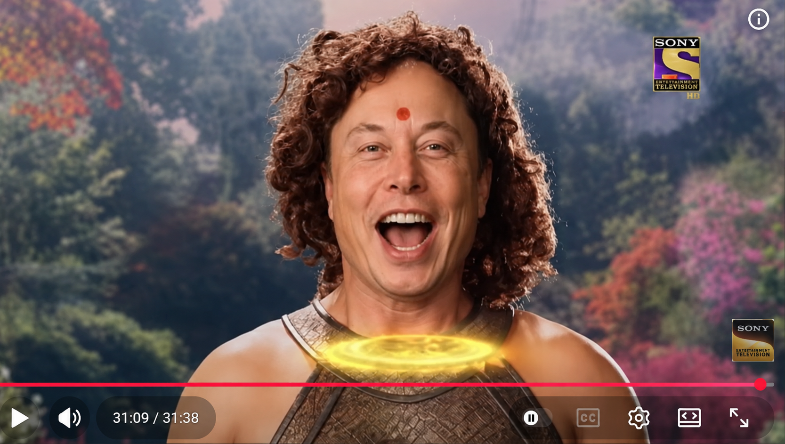

# June 2026

## Kailash

- I'm starting to realize that being homeless, not being able to settle and work because of sedated rape-porn stardom, not having any support at all from anyone, and finding out exactly how much my family despise me is now taking a toll on my health and wellbeing.
- Also, roaming relatively freely means anyone can have a pop at murdering me and perhaps, given recent miraculous events, certain folk might feel like trying is a valid *challenge*.
- Well, just STOP IT. I'm not asking.
- A sudden death at Everest Base Camp would be a good place to get rid of someone without question, I expect, and I wonder about how ill I got there.
- I started feeling unwell on the journey up to Everest Base Camp from Shigatse.
- My rib was playing up - weakened by continued drugging and poisoning over many years in Spain - and worsening every time I lifted my bag - it had re-opened during a yoga class just a week before which felt so totally unlucky to me.
- At Everest, I was really unwell and I thought I had Acute Mountain Sickness.
- Except my oxygen levels were always ok!!! About 85%... or more.
- My heart rate however was 130 and I was getting a chest infection but the worse thing of all was the elevated eye pressure, it must have been heading towards 30 ... I couldn't see at all.
- I thought this must be the sudden-blindness glaucoma signs the ophthalmologist in Bangkok warned me about... every light had a slither moon halo impossible to look at it was so bright.
- My eyes took days to recover.
- Whenever I looked at the color white I saw pink.
- My kidneys, too, were screaming just like they used to do whenever someone tried to kill me at home, or in Lourdes.
- Then the fatigue kicked in.. could I have been poisoned again? 
- I gave up on my hopes for Kailash kora pretty quickly, but then it turned out the weather was so bad they closed the kora for everyone.
- I don't feel I missed out on anything, I spent a good few days at the holy feet of God Himself, but I might return in my 60s God willing.
- In any event, the chest infection started to remind me of [being smothered with pillows and my duvet at my home on 13th March 2024](../2024/march/13-end.md#the-pillow-game) and I realize that my legs must have been free while that was happening and I tried to free myself from being suffocated under the weight being pushed down on me... for sure Maria hontanilla was there... Bruno's younger brother, probably Gloria... another man or two to apply the weight to my face so I couldn't breathe ... while my legs went around and around trying to get free, and they all laughed at me, all these memories came back with the chest infection at Kailash.

### Sedating drugs and my dream of the forest

- These drugs are zombification herbs.
- They detach the higher mind from the lower mind completely and temporarily (although probably they have caused some humans to go into a permanent vegetative state).
- The human still has the lower functions available; movement, breathing, etc, and this is how the rapists are able to lead women and children around - and rape babies who show no response on the porn films they make of them - while they're completely unconscious and devoid of any memory.
- No speech, or thought, or higher brain activity is possible while under the influence of these herbs.. although it transpires that memories of these events do return after significant amounts of time, which I hope is terrifying millions of shameful men who need to be in jail.
- My recurring dream of being in the forest and having no identity that started in 2011 in India and was ongoing into 2024 in Dénia is significant and indicative of being drugged in this way on a *very* regular basis.
- Online stalkers would mention *the forest*, often, as if they wanted me to know what they were doing to me.
- They mentioned other things as well; such as a razor sharp insert for the vagina which would rip men's penises into shreds, a long tale about someone's girlfriend asking her man if he would sedate her like he does the other girls, outrageous things like this, and I never got it while they were spiking me with hallucinogens and other drugs right on up to October 2025.
- Letting these people carry on regardless is a crime against humanity.
- And anything a bit like, *they told us they'd stop*, which appears to be law-enforcement protocol across our brave new world of protected rapists, is an even bigger crime against humanity.

## My current view on the world

- Hopeless.
- I can see no hope at all for anyone if women, children, and babies are to be sacrificed at the altars of porn which are wholly protected by our elected governments and police services.
- It's difficult to know what to do.
- I thought I might just go and volunteer for the rest of my life at orphanages in India maybe, something like that.
- I don't think the world has had enough horror to make it ready for healing and we're all too worshipful of the penis and it's mighty owners.
- My guess is there's a million years more to go before anyone's truly had enough of this hellscape.
- Perhaps God's Presence's removal of the Y chromosome will sort it all out. I expect so.
- My view is that the *queer* business ensured everyone's total OK'ness about the sexualization of minors and it is my view that this was a very intentional weapon forged against the West with the help of the gitano manipulators making money off the caliphate's oil barons since 2012 and earlier.
- My view is that the Islamicists know very well the arrogance of the West and it's adherents' inability to admit being tricked in this way, to it's continued detriment.
- Very smart indeed from the Islamicists, and supported by their terrified attitudes towards their own women and children, hiding them away from everything, just in case the same might happen to them... I guess.

## I am Rohini

- Perhaps it's not all hopeless.
- But it does feel like we are at a global state as perilous as when the asuras nearly got hold of the amrit, the elixir of God, and the world was about to descend into total chaos.
- This time around, they've all turned into brazen rapists, happy to let the world descend into rape chaos while fighting to sterilize everyone's children or ignoring it while everyone goes mad on the Las Marinas manipulation tech.
- They don't even know how evil they've become, they think they're winners, but God sees everything and they can't look women in the eye anymore at all.
- Rohini tricked them all, and thus saved the world, thank God.

- Fortunately only Rahu got a little bit of amrit, by lies, and then Rohini had to deal with him with Sudarshan - a sword not of man - and he lost his head and gave birth to eclipses where *very big things* happen, especially on Fire Horse years.

<!---->

!!! tip "Important question about Mars"
    - How long before the mass raping begins as Elon and co head off to Mars, 1 woman to every 300 men on board, just like their sedating-and-raping work conferences?
    - My guess is they won't be outside the earth's atmosphere before they all lose their minds, again, and start raping the women.
    - They'll be lucky to arrive with any still alive.

<!---->
