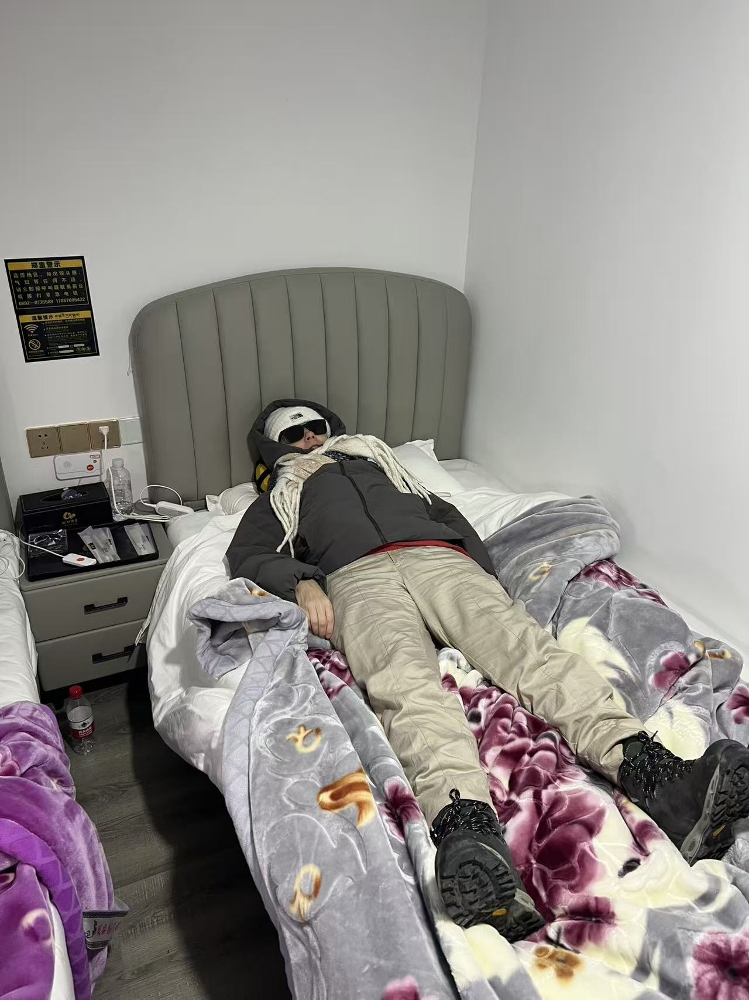
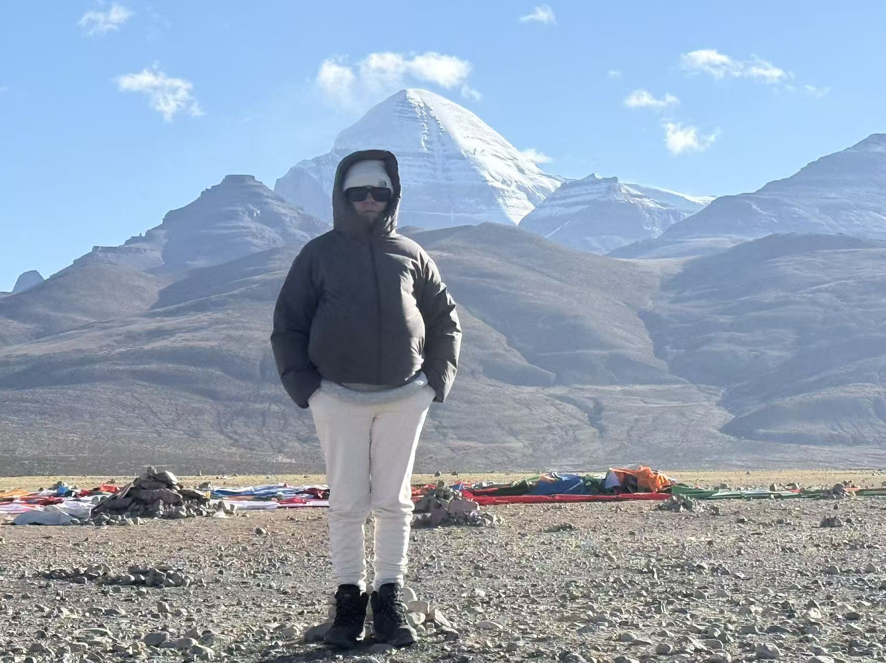

# June 2026

## Kailash

- I'm starting to realize that being homeless, not being able to settle and work because of sedated rape-porn stardom, not having any support at all from anyone, and finding out exactly how much my family despise me, and for how long, is unsurprisingly taking a toll on my health and wellbeing.
- Also, roaming relatively freely means anyone can have a pop at murdering me and perhaps, given recent miraculous events, certain folk might feel like trying is a valid *challenge*.
- Well, just STOP IT. I'm not asking.
- A sudden death at Everest Base Camp would be a good place to get rid of someone without question, I expect, and I wonder about how ill I got there.
- I started feeling unwell on the journey up to Everest Base Camp from Shigatse.
- My rib was playing up - weakened by continued drugging and poisoning over many years in Spain - and worsening every time I lifted my bag - it had re-opened during a yoga class just a week before which felt so totally unlucky to me.
- At Everest, I was really unwell and I thought I had Acute Mountain Sickness.
- Except my oxygen levels were always ok!!! About 85%... or more.
- My heart rate however was 130 and I was getting a chest infection but the worse thing of all was the elevated eye pressure, it must have been heading towards 30 ... I couldn't see at all.
- I thought this must be the sudden-blindness glaucoma signs the ophthalmologist in Bangkok warned me about... every light had a slither moon halo impossible to look at it was so bright.
- My eyes took days to recover.
- Whenever I looked at the color white I saw pink.
- My kidneys, too, were screaming just like they used to do whenever someone tried to kill me at home, or in Lourdes.
- Then the fatigue kicked in.. could I have been poisoned again? 
- Here I am half dead at Everest Base Camp.

- I gave up on my hopes for Kailash kora pretty quickly, but then it turned out the weather was so bad they closed the kora for everyone.
- I don't feel I missed out on anything, I spent a good few days at the holy feet of God Himself, but I might return in my 60s God willing.
- In any event, the chest infection started to remind me of [being smothered with pillows and my duvet at my home on 13th March 2024](../2024/march/13-end.md#the-pillow-game) and I realize that my legs must have been free while that was happening and I tried to free myself from being suffocated under the weight being pushed down on me... for sure Maria hontanilla was there... Bruno's younger brother, probably Gloria... another man or two to apply the weight to my face so I couldn't breathe ... while my legs went around and around trying to get free, and they all laughed at me, all these memories came back with the chest infection at Kailash.

- Here's me six-months pregnant with triplets at Kailash. 
- You can see Nandi too.

### Sedating drugs and my dream of the forest

- These drugs are zombification herbs.
- They detach the higher mind from the lower mind completely and temporarily (although probably they have caused some humans to go into a permanent vegetative state).
- The human still has the lower functions available; movement, breathing, etc, and this is how the rapists are able to lead women and children around - and rape babies who show no response on the porn films they make of them - while we're completely unconscious and devoid of any memory.
- No speech, or thought, or higher brain activity is possible while under the influence of these herbs.. although it transpires that memories of these events do return after significant amounts of time, which I hope is terrifying millions of shameful men who need to be in jail.
- My recurring dream of being in the forest and having no identity that started in 2011 in India and was ongoing into 2024 in Dénia is significant and indicative of being drugged in this way on a *very* regular basis.
- Online stalkers would mention *the forest*, often, as if they wanted me to know what they were doing to me.
- They mentioned other things as well; such as a razor sharp insert for the vagina which would rip men's penises into shreds, a long tale about someone's girlfriend asking her man if he would sedate her like he does the other girls, outrageous things like this, and I never got it while they were spiking me with hallucinogens and other confusing drugs right on up to October 2025 when I realized the whole thing was because they had set up porn-studios in Spanish schools already, and had performed [a switcheroo porn-scam running live from the conservatory](../../crimes/protagonists/vidal-sastre.md#at-least-six) which required brain-damaging a music school student; not the first nor last time they will have done this either given no one appears to care about the porn-horrors that have been going on in Spain for decades, rather the powers that be are hoping they can keep their porn-horror, they love it so.
- Nevertheless, and aside from total important-male insanity, letting these people carry on regardless is a crime against humanity.
- And anything a bit like, *they told us they'd stop, they pwomised us*, which appears to be law-enforcement protocol across our brave new world of protected rapists, is an even bigger crime against humanity.

## Post Kailash
### My current view on the world

- Hopeless.
- I can see no hope at all for anyone if women, children, and babies are to be sacrificed at the altars of porn which are wholly protected by our elected governments and police services.
- It's difficult to know what to do.
- I thought I might just go and volunteer for the rest of my life at orphanages in India maybe, something like that.
- I don't think the world has had enough horror to make it ready for healing and we're all too worshipful of the penis and its mighty pip-squeak owners.
- My guess is there's at least a million years more to go before anyone's truly had enough of this hellscape.
- Perhaps God's Presence's removal of the Y chromosome will sort it all out. I expect so.
- My view is that the *queer* business ensured everyone's total OK'ness about the sexualization of minors and it is my view that this was a very intentional weapon forged against the West with the help of the gitano manipulators making money off the caliphate's oil barons since 2012 and earlier.
- My view is that the Islamicists know very well the arrogance of the West and it's adherents' inability to admit to being tricked in this way, to it's continued detriment.
- Very smart indeed from the Islamicists, and supported by their terrified attitudes towards their own women and children, hiding them away from everything, just in case the same might happen to them... I guess.

### Brain-wipe

- Obsession has disappeared, I wonder if I imagined everything.
- I guess I got a MASSIVE dose of something, again.
- But I'm wondering, is my love dead? Or was I so ill that I used every resource in my body to stay alive, and that included my fire, my passion.
- I start thinking about going back to my old life, getting a job, what job, and suddenly all my emails are offering me jobs.
- Not the first time this happened.
- Why. Who. How. What happened in Kailash I don't know about?
- Who is determined to bring on porn-world mainstream - not that it already isn't?

## I am Rohini

- Perhaps it's not all hopeless.
- But it does feel like we are at a global state as perilous as when the asuras nearly got hold of the amrit, the elixir of God, and the world was about to descend into total chaos.
- This time around, they've all turned into brazen rapists, happy to let the world descend into rape chaos while fighting to sterilize everyone's children or ignoring it while everyone goes mad on the Las Marinas manipulation tech.
- Maybe the churning of the ocean of milk refers to a similar assault on the feminine back in antiquity which threatened the stability of the universe in a similar way.
- Who knew that the most egregious of lies (raping-and-murdering-women-is-a-good-thing) would cause apparently sane people to go quite mad in defense of it. It's not like we haven't seen that happen before now have we.
- There's so many of us, so insane, it's difficult to see how we might pull ourselves back from the brink of the hell we've been happily creating for ourselves.
- The porn-addicts don't even know how evil they've become, nor care; they think they're the great winners of everything.
- But God sees it all and they can't even look women in the eye anymore at all; perhaps this serves to make them even more murderous towards us.
- They must be so annoyed at all the criminals who assured them, repeatedly, that there'd be no victim alive very shortly after they'd all *had a go* at her, him, whoever, and they believed them. Fools!
- Nevertheless, back in the day, and perhaps today too, Rohini tricked them all, and thus saved the world, thank God.

- Fortunately only Rahu got a little bit of amrit, by lies, and then Rohini had to deal with him with Sudarshan - a sword not of man - and he lost his head and gave birth to eclipses where *very big things* happen, especially on Fire Horse years.

!!! tip "Important questions about Elon's Mars intentions"
    - How long before the mass raping begins as Elon and co head off to Mars, 1 woman to every 300 men onboard, just like their sedating-and-raping work conferences?
    - My guess is they won't be outside the earth's atmosphere before they all lose their minds, again, and start raping the women.
    - They'll be lucky to arrive with any woman still alive.
    - Pretty sure Elon is our Rahu of the times, and the elixir is the manipulation-and-lies tech which, for Elon and the tech-bros states *porn-is-very-good* and *women-are-evil-and-must-be-murdered-after-being-sedated-and-raped*, and they believe it and are ready to go to jail for ever, it appears, to defend such lies.

    

    - I mean, poor ole Elon, they went for his son knowing he'd still support them in any way he could against the women they manipulate and sedate for the tech-bros.

- If only God could get his hands on that tech. We might be able to fix our colossal mess. 
- Perhaps this is *all* this story is about.
- Perhaps God needed a very special person for this, someone who wouldn't even know the task themselves till they'd achieved it.
- It's been too easy to get distracted by the hoards of evil demons pretending to be human to think about these higher ideas mostly.
- And some people (most people) clearly don't give a damn about our beautiful world that God gave us to take care of in perpetuity.

- I'll get back to work now but this has been fun, and I needed some.

## Dreams

- Last night I dreamt about blue rope (Melanie Hall made the news again this morning).
- It was part of another dream.
- Willow was making a film, and I was helping her.
- The film was about a massive tidal wave coming, and I realized the film *had* to be called *Closing In*.
- I told Willow this, and assured her if there was a better name I'd be happy to listen.
- We were heading to Nottingham for filming, I'm not sure why, and I was going to take the pushbike and I was trying to get it all ready, but I was going to have to shift it up and down the station stairs, and in the end we decided to drive anyway.
- There was *blue rope* holding all the doors shut at the film editing room, which we were opening, all of them, all the doors were opening, the blue rope losing its tautness and falling to the ground.
- I thought this must mean there's *a lot* of wiretap evidence (I bet there's reams of it) but I was also surprised to hear about Melanie Hall this morning found tied with blue rope.
- Interesting.
- I am, after all, a law-enforcing intuitive, and have been for some time (mostly without my knowledge until very recently) and we're now poised to save the world from it's mass-raping and woman-murdering fiefdoms, cos someone had to do it, didn't they.
- Oh, and while we're at it, I'm happy to work for anyone devoted to making the world a better place, a safe place, a place with a shining loving future, which is why I love you all, but I absolutely *detest* being bullied.
- As you might imagine.
- I do not like it at all.

### Disclosure Day

- There's a film I want to see but I'm reluctant because I have the feeling I might weep all the way through...
- Maybe I need that, though.

### Beautiful things every day

- Yesterday I saw the sweetest little girl. She was in her swimming costume, swimming hat, and had her rubber ring on.
- She was holding her mummy's hand as they went to the pool.
- As I passed her she exclaimed, "Look, I am going swimming now!".
- She made my whole day.
- Let's have an amazing day today good people.
- Let all evil people find their way quickly, very quickly, swiftly even, to justice and redemption and the saving of the world.

## Quoting Don Juan every morning

- Every morning, I quote Don Juan from Castaneda..
- *If it farts, it lives,* he famously said as Carlos came back from a wild datura experience or similar.
- And I am most grateful.
- I adjust a little too.
- I say, if it's fat, it lives, as my appetite returns.
- And I am most grateful.
- I guess I'm exactly where God needs me... it's always curious to me how that happens.
- Who thinks I'm here because some awful memory is about to return?
- Is anyone gonna do anything now? Or is this what women and girls and boys and babies can expect until Mother Nature whoops our arses?

## Bali ugly -wip

### I was right about Elon's spy, wasn't I

- Is that why he desperately ran after Trump to China, committing a crime by doing so?
- Well, I guess the gypsies care not at all about it - apart from the multitude of squirrels ready to cash in - but I'm sure Elon does now, doesn't he.
- Perhaps even [the Russian](../2024/may.md#the-russian-porn-star) was filming? 
- Well, you would wouldn't you, if you were a cold-hearted pervert with nothing to lose.
- Wouldn't it be crrazzzyyyy if the old *we tell no-one about what we do to women and children and babies* promise back-forward-fires into the millennia to come...
- I'll pray for that, then hasten home.

## The victims

- Let's make a list... from the 80s and earlier to now.
- Women and young girls (all nationalities) manipulated into porn and prostitution via honey-trapping, drugging, and since about 2005 online manipulation.
- Successful business women (all nationalities) they don't like because they earn a lot of money honestly, manipulated into sexual relationships then blackmailed with the films (which they put on the porn networks anyway whether they get paid or not).
- Women already manipulated into porn and running businesses for the gangs who are then manipulated into having babies for the pregnancy porn, live-birth porn, and more product for the baby-rape machine.
- Porn-gang members' small children and babies sent to hair and makeup in Las Marinas before being drugged for the pedo-rape-porn.
- All children at schools in the Marina Alta region - probably started with the conservatories and the dance schools and then spread out - drugged and sedated at classes for porn, teachers paid for delivering ready children.
- The older ex-pat community of British and Irish (and other foreign) people owning property, met at the funeral parlour while burying their partners, or at the U3A classes riddled with porn-gang operatives, or at other societies, churches, choirs, etc. set up solely to make connections with wealthy foreigners for the intention of murdering and robbing them.
- When they realized no-one was gonna help the British, at all - thousands of complaints already made about murder, theft, rape, etc - literally taking people's houses from them - porn, poisoning, drugging... they started to target British women for bestiality (the horse porn which they ensured the UK police would find hilarious) and snuff porn (probably did the same with the UK police on this too but likely the male officers didn't so readily share their amusement about this with the female officers like they do with the horse porn, female officers obligingly finding it all so hilarious too).
- These vile acts on manipulated innocent people require poisoning over very long periods to provide brain-damage stroke-like symptoms, and worse to the nervous system and sensory perception: they have to mentally-disable victims for it to work.
- There are thousands of complaints from families about British women going missing in Spain, dying in weird circumstances, marrying a dodgy Spanish bloke and ending up dead just week's later, *slipping* over a mountain ravine while walking with their dodgy Spanish husband who then inherits millions, ending up in porn and prostitution then dead.. obviously targeting the Brits became the gang's safest form of robbery, cos for some strange reason the Brits were fair game, and so they did it the most to us.
- Then they start looking for other sort of victims... the tech-bro woman-hating must have tickled them pink when they realized how much tech CEOs are prepared to pay to have the female tech colleagues they despise poisoned, drugged, and set up in sex-slave spy-cam apartments.
- And then, of course, they can blackmail the tech CEOs (stupid boys).
- The manipulation tech has a trillion uses (some good if we could get our hands on it, the rest useless and eventually, sometimes very quickly, world-destroying) and selling it to the Islamicist oil-barons for billions was gonna be their obvious next step.
- I wonder if Zoe's dad really died? Or if he's relaxing on an island he bought in the Caribbean somewhere?
- Or maybe he's gone into hiding... what with Zoe's cousins being beheaded and all, something she likes to tell everyone about... perhaps the Islamicists didn't get what they paid for - the way it always goes when you do business with the gypsies.
- Perhaps the fact that the only people who really support the Islamicists fully are the blue-hairs, the perverts, those that'll believe anything you tell em, including it's good to sterilizing your children, yes, those people the Islamicists would throw out the top-floor window seem to be the only ones that support them.
- Perhaps they're pissed about that.
- Perhaps they argue about it... [in very low tone scratchy angry Arabic accent] *you told us they'd all support us but all we see is Greta and her pink-haired gay perverts*... 
- It's a beautiful irony.
- The amount of energy they put into telling me I'd f*cked up online is, of course, a projection of Biblical proportions.
- You never know what might happen when your product is lies; you can be certain of this, and you can be certain the outcome won't be good for the liars either.
- Who else? They've targeted old, young, toddler, baby, pensioner, woman, gay men, anyone deemed vulnerable, or famous, or very very rich, or just a little bit rich, or family and friends of the rich and famous or a little bit rich and famous, all filmed for sexploitation and blackmail and doing-what-theyre-told for all eternity.
- They have thousands of men and women helping them: meeting people, gaining trust, hair and make up for the porn, setting up the spy-cam networks in schools, hotels, apartments; managing the manipulation tech across international hacked phones for specific targets, and fielding endlessly for new ones especially toddlers.
- Porn gang operatives, male and female, *working directly with* targets online and offline to get them to *do stuff*.
- A non-exhaustive list... of course.

## Hastening home - lesson 226

- *But if I see no value in the world as I behold it, nothing that I want to keep as mine or search for as a goal, it will depart from me.*
- Justice for innocents is a worldly goal, isn't it?
- The sort of goal you can't just take off and put on, like an old coat.
- I wish I could. 
- I'd be out of here like a shot.
- I mean truly, the speed of it would be unprecedented.
- At this rate, I'll be here another thousand years.
- If I feel as full of love as I do from time to time - is it after a good dinner? - more often the more I think about God and nothing else, I wouldn't mind so much.
- When the overwhelming evil creeps in... I mean, how is one supposed to deal with such a nightmare without Him.
- I don't believe it possible.
- Thank you God, my Father, Jai Shri Ram.
- Thank you brother Jesus for never leaving me.
- Thank you Mary for everything You do for me.
- Thank you God in all Your Marvelous forms.
- Let the arrow fly.

- It worked!

## CICA submission

- David Greenwood, lawyer for the UK Rape Gang inquiry, has made an application for a criminal injury award with the [UK government's criminal injuries award department](https://www.gov.uk/government/organisations/criminal-injuries-compensation-authority), something I had tried to do before twice and it was refused.
- In our communications, I explain criminal injuries I have suffered related to being sedated-and-raped for years in UK, Spain, and elsewhere, UK criminal gangs involvement, UK and Spanish criminal gangs conspiring with my tech employers, constant harassment from criminal gangs in UK, Northern Ireland, France, and Spain, and Bali, how it all started with Winston May's rape-gang porn production in North London in 1989, the depression and anxiety arising from all of this and the eventual suicidal feelings arising from my family's involvement.
- I won't publish the letters, but I'll add them to the files.

## After yesterday's beach-side antics... a confession?

<!--#RAMRAM.-->
- The mentions of Noah..
- And then how they get all suddenly active... ooo speculation, ooo we weren't even there, ooo we never came into the Obel Tower, oooo, etc..
- Well, as you know, I have been researching them for a few years now, and we have all noticed how these people only ever make the effort to communicate so quickly and whiningly in response to something is when they're guilty.
- We see this often surprisingly defensive talk from them instead of the usual intrigue, insult, and offense.
- They don't even notice the other multitude of opportunities they could do the same with flying by, either.
- So, that's that then. 
- I was right about Noah.

!!! quote "Principle of miracles number 19"
    - Miracles rest on the law and order of eternity, not of time.
