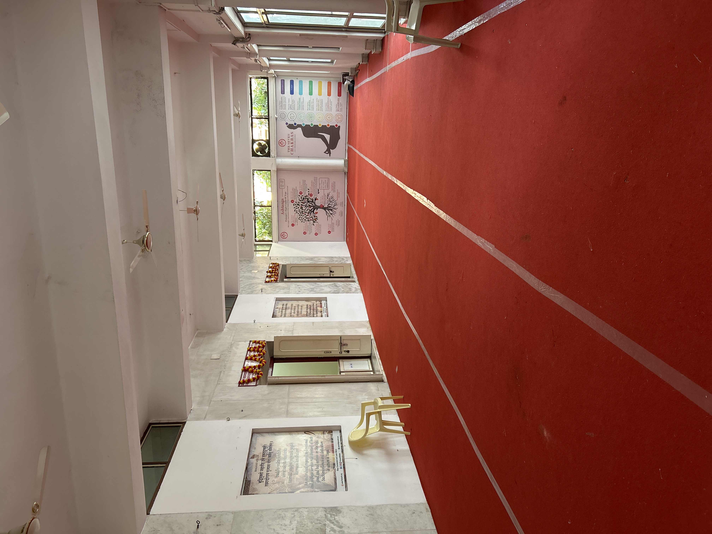

# March 2026

## Samadhi mandir Parmarth Niketan

- It's no accident I'm writing today from the samadhi mandir at Parmarth.

- In fact, I gulped when I realized where they were suggesting I go to write quietly because I'm low-energy and have some injuries so full on yoga classes are not so desirable.
- I also find myself hugely overwhelmed by the masses of people, lights, and sound and I think this must be post-trauma effects and possibly effects of brain-damaging too.
- I wanted to just sit quietly somewhere and write, so I asked the help desk at the International Yoga Festival if they could suggest somewhere and they told me to come here.
- It was only when I looked on the map I realized this is where they had sung the Ramayana all those years ago, my bedroom just overlooking, and how the experience had changed my life for the better.
- And, like Angalimala Baba, how I had mentioned it regularly during those intense battles with online-stalkers where my approach tended to be to bombard them with God as much as possible.
- I think it worked!

### Alberto

- The Italian, apparently, who looked very familiar, like a film star.

## Thalazur Bandol

- I stay a few days at the Thalazur Bandol before driving to Lourdes.

- I'd happily live here for a while I reckon, it's gorgeous.
- Can we stay a month or two here please? 
- I know squirrel will love it.
- However, on this visit, there seemed to be some already alerted porn-addicts there.
- The technician enters my room repeatedly without knocking, knowing I am inside.
- He makes a silly excuse and snickers when I'm upset about it, then does it again.
- I tell reception about this and ask the receptionist, who has his name printed on a card at the desk as [*Mr Banga*](../2024/august.md#4), to tell the management about how I found the technician's behavior threatening.
- I wonder if he did.
- The concierge pack my bags into my car as if they're taking the piss, and after I asked them not to.
- It's not clear why this is still happening.
- I don't think they recognize me as such; I think they've been told about me, maybe via their porn subscriptions like [the medics at Moorfields Brent Cross](../2025/march.md#moorfields-eye-hospital).
- What could be the reason?
- Father. Are You having me collect the horrific scale of what's happened to men as a preliminary step for the tidal wave of healing to come?

### Thalazur Saint Jean de Luz

- I'm just wondering about the Thalazur because I used to visit their hotel in Saint Jean de Luz regularly and I wonder if there had been any "date nights" on those visits.
- This was when I was very depressed and using valium that I bought online and was delivered by mail; the same as my mother uses.
- I was only using tiny bits of it, however, but I was extremely addicted.
- I wonder what else was in those pills.
