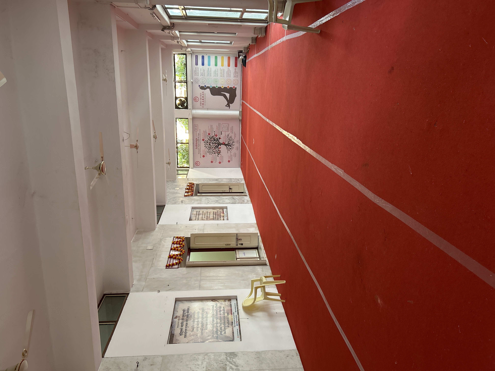

# March 2026

## Samadhi mandir Parmarth Niketan

- It's no accident I'm writing today from the samadhi mandir at Parmarth.

- In fact, I gulped when I realized where they were suggesting I go to write quietly because I'm low-energy and have some injuries so full on yoga classes are not so desirable.
- I also find myself hugely overwhelmed by the masses of people, lights, and sound and I think this must be post-trauma effects and possibly effects of brain-damaging too.
- I wanted to just sit quietly somewhere and write, so I asked the help desk at the International Yoga Festival if they could suggest somewhere and they told me to come here.
- It was only when I looked on the map I realized this is where they had sung the Ramayana all those years ago, my bedroom just overlooking, and how the experience had changed my life for the better.
- I'm pretty sure it was the night they sang the Sunderkand too cos all the kids were there that night, all night, and it was SOOOO HAPPPYYYY!!!!
- And sorry all my hacking friends, we are going to have to listen to this most regularly from now on. I know, I know.
- And, like Angalimala Baba, how I had mentioned it regularly during those intense battles with online-stalkers where my approach tended to be to bombard them with God as much as possible.
- I think it worked!
- Of course it worked. God's Plan you know.

### Alberto

- The Italian, apparently, who looked very familiar, like a film star.

### Battered online, feeling unwell, tired, want to go home

- Over this time I was battered psychologically online and very much through the iPhone chip hack.
- I thought it was the Spanish but in retrospect probably they haven't been attacking me like they used to at all, and it was all the mousses.
- I didn't know this and kept thinking Carmen Lopez Cano was still harassing me and making me feel terrible.
- I also felt unwell, tired, I was worried about my hip, and my rib, and I asked for help.
- I said I just wanted to go home and that I probably need medical attention.
- That night, I hear Mrs Wasserman's voice in the room.
- I think they staged it through the iPhone.

## No room for form - Rumi
<i>
On the night when you cross the street
from your shop and your house
to the cemetery,

you'll hear me hailing you from inside
the open grave, and you'll realize
how we've always been together.

I am the clear consciousness-core
of your being, the same in
ecstasy as in self-hating fatigue.

That night, when you escape the fear of snakebite
and all irritation with the ants, you'll hear
my familiar voice, see the candle being lit,
smell the incense, the surprise meal fixed
by the lover inside all your other lovers.

This heart-tumult is my signal
to you igniting in the tomb.

So don't fuss with the shroud
and the graveyard road dust.

Those get ripped open and washed away
in the music of our finally meeting.

And don't look for me in a human shape.
I am inside your looking. No room
for form with love this strong.

Beat the drum and let the poets speak.
This is a day of purification for those who
are already mature and initiated into what love is.

No need to wait until we die!
There's more to want here than money
and being famous and bites of roasted meat.

Now, what shall we call this new sort of gazing-house
that has opened in our town where people sit
quietly and pour out their glancing
like light, like answering?
</i>

- Was this us too, my love?

## Thalazur Bandol

- I stay a few days at the Thalazur Bandol before driving to Lourdes.

- I'd happily live here for a while I reckon, it's gorgeous.
- Can we stay a month or two here please? 
- I know squirrel will love it.
- However, on this visit, there seemed to be some already alerted porn-addicts there.
- The technician enters my room repeatedly without knocking, knowing I am inside.
- He makes a silly excuse and snickers when I'm upset about it, then does it again.
- I tell reception about this and ask the receptionist, who has his name printed on a card at the desk as [*Mr Banga*](../2024/august.md#4), to tell the management about how I found the technician's behavior threatening.
- I wonder if he did.
- The concierge pack my bags into my car as if they're taking the piss, and after I asked them not to.
- It's not clear why this is still happening.
- I don't think they recognize me as such; I think they've been told about me, maybe via their porn subscriptions like [the medics at Moorfields Brent Cross](../2025/march.md#moorfields-eye-hospital).
- What could be the reason?
- Father. Are You having me collect the horrific scale of what's happened to men as a preliminary step for the tidal wave of healing to come?
- Do you think men are just like... yeh, this is great, come on everyone, let's rape our mothers, wives, sisters, daughters, mate's girlfriends, children, babies etc... oh yeah, let's use the pets too... hehe... and we'll get the local postman to deliver them drugs so they'll never bother questioning us they'll be so high... and these men fail to notice how the world is literally about to end because of their pathetic actions.
- No, in August 2026 after everything that's happened, I believe this sort of thing is organized by the mousses so that I wouldn't get comfortable anywhere, or sidetracked - I think I looked up rentals a few times in the town online as it was so nice there - so that my trajectory would continue to egg-extraction in Dublin.

### Thalazur Saint Jean de Luz

- I'm just wondering about the Thalazur because I used to visit their hotel in Saint Jean de Luz regularly and I wonder if there had been any "date nights" on those visits.
- This was when I was very depressed and using valium that I bought online and was delivered by mail to N2; the same ridiculously addictive pills that my mother uses even today.
- I was only using tiny chunks of these pills.
- Even so, I was horribly addicted.
- I wonder what else was in those pills.

## Yet another bridge collapses

- Darling, you didn't use canned salmon, did you?

- I'm most dreadfully embarrassed.
- Aaaaaaaahhhhhhhhhhhhh.

## Lourdes

### Winter service

- I'm not kidding now but in March 2026, on the first afternoon (23rd March I think) I volunteer for the winter service at the baths at Lourdes (I had given the water gesture to a couple of pilgrims already with a lovely man called Marc to get me feeling confident again and then he left me alone), the first woman who comes into the baths also has *the* tattoo on her arm.
- That's four times I've seen it now: twice on stomachs, twice on arms, always on women.
  
## Popping back to London

- I have to pop back to London briefly for paperwork matters.
- I meet my mother at Golders Green for about an hour.
- Dad wants to come too.
- I tell my mother not to dare bring him.
- I give her a triangle of healing in the cafe.
- She says to me, and I quote: *you know, why don't you do some menial job, like a secretary, instead of what you've been doing.*
- And I have to wonder who put that idea into her little head, and whether they're now dropping my brother in it massively, since dad's already super-doomed.
- Seems likely.
- Perhaps she thought it up all by herself, intending the very worst with it.
