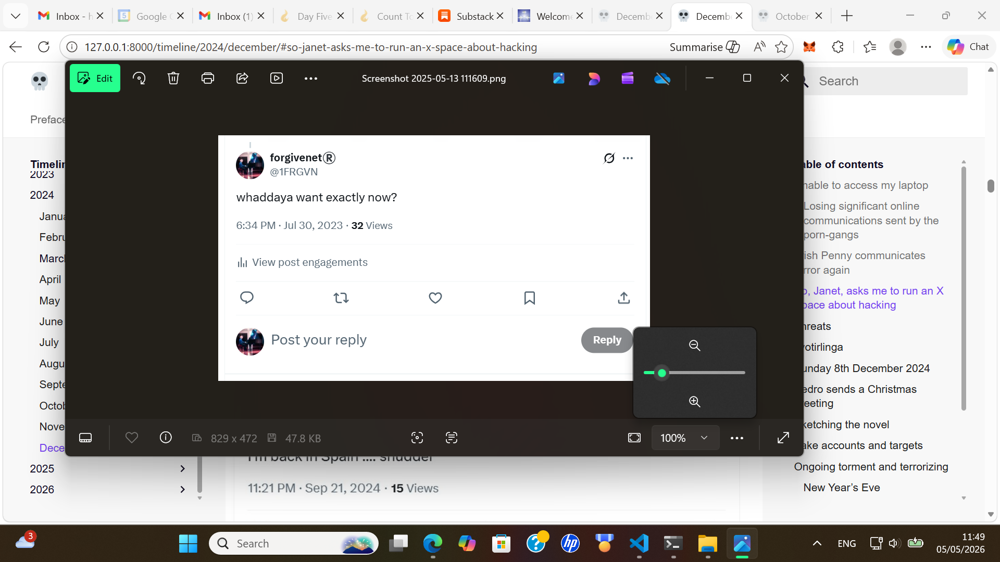

# May 2026

## Desa's colleague in Cauterets

- I'm staying a week or so in Cauterets and I have a little house a short walk down the valley from the town.
- The whole town is empty this time of year, it's fabulous.
- Although, I have a neighbor, two houses down.
- It's Desa's colleague again, the big man we all met in Scarborough; the one who had been [staying next door at the Spa Resorts](../2024/december.md#desas-mate-from-pinder-in-scarborough) in December 2024 when it all kicked off who could also be Matthew Diamond's opera-singing friend.
- I have seen him in other venues too, possibly Bangkok a few times in 2024 and 2025.

## Worm-turned

- A file from the bottom of my database mysteriously "pops up" on my laptop screen.
- It looks like the criminal gangs are speaking directly to law enforcement now.
- Has the worm officially turned, with Spanish porn-gangs now asking the same anxious questions of law enforcement that I used to feverishly ask them back in July 2023 when the horror-porn online terror was peaking.

- I love this!
- Update: I'm told that criminal gangs will be pleased to confirm this was nothing to do with them at all and that I was mistaken, on purpose, so that I'd continue to think I was being stalked by Adams et al.

## Dénia team in France

- This was quite ridiculous actually, and I'm certain the participants will confirm.
- It was another game to keep me thinking the criminals in Dénia were still very active.
- Just like with [Ugly](../2024/august.md#ugly) popping up on my X feed all those years ago, then popping up in real life in Cauterets a few days later, a similar thing has happened yet again.
- My other `JackChardwood` Facebook account - since the big one I was using was shut down by the pedo-protectors not so long ago - remains infested with criminal-gang hacks.
- You can tell because all the stories have horror pictures in them, and they seem to be using fake groups - particularly those related to Anne Frank - to discuss who they're going to drop in it, just like they did with Ugly, when the time comes.
- Anyway.
- I realize the internet is the Wild West, and if you're hacked at all you can be hacked by everyone. 
- There doesn't seem to be any way to block every Tom, Dick, and Harry getting in if one group is already in.
- A couple of weeks ago, an account popped up with a friend request with a man's photo on it and he's called Anthony.
- It was a repeat too, i.e. I had seen the man's face on Facebook in another context not long before.
- I have never consciously seen this man's face before and I do not recognize him.
- I made a note of this on the account photo, also mentioning that he somehow reminded me of the gardener at Cami Llavador, someone Lorraine knew very well (had gone to school with I believe).
- Yesterday, driving through Soulom on my way back home from shopping, the man was standing facing me at the area where there's usually a chip van.
- He was with a group of people.
- The man has [that squirrel look](../2011-to-2020/2013.md#daniel) but he's fairer and fatter-faced. 
- Yesterday evening, another couple of odd men I sort of maybe recognize are pointed out to me out-of-context on an Anne Frank Facebook group.
- Are they up from Dénia to finish me off? I think they wanted me to think that.
- My guess is they're not the only ones who want rid of me.
- Funny how that repeats.
- The bold rapists and pedophiles, terrified about being found out... well, everyone knows already and nobody seems to care.
- Or, are they terrified their own wives and mothers will find out? That might be it.
- It's difficult to assess total insanity objectively.
- Oh, is he *the* Paco Sendra?
- Is he handing himself in? Is he on the good's side now?
- See how they got me in quite a spin. They do it all the time. Better to avoid social media completely if you're someone like me that everyone wants a slice of.

## Putting my hands to my head while sleeping

- It started in May in Cauterets.
- While sleeping I will stretch my back and put my hands up to my head with the fingers curled.
- It feels like I'm doing something someone else does.
- I mention it online.
- At first I thought it was Auggie, then someone online says it's my dad.
- I think it's a child in the womb maybe? Or just been born? It's a movement a baby might make.
- It continues. Hasn't stopped.
- I do it constantly, every night I wake myself up doing it. 
- I never did it before May 2026.
- I saw a small child to it at the YMCA in Jerusalem, the exact movement. It's a child's movement.

## Dreaming of Saint Michael on Ascension day

- I'm lying in bed, drifting off to sleep, thinking about the wonderful, marvelous Saint Michael, and the stained-glass window of him at the church in Cauterets, and how amazing he is, and the best boss a person could have, always giving the right challenge, never too much, never too little, and how I love him so, and I'm going off into one and I can practically see his giant legs that go up into the sky.. then WHACK!!
- He hits me around the head!
- Well, it's like an incision actually, a semi-circular thin scar on the top of my head to the left, and I can see light coming out of it.
- And it REALLY HURTS!!!!
- Well, it's confusing to say the least because of my lovey-dovey state just before.
- What could it mean, I wonder.
- A few days later, I'm looking up the path of the eclipse online and it reminds me of the scar, a lot, and I think... wow.
- And I still don't know what it means.
- So I'll leave it with you.
- <3
- Oh! Wow. That's exactly when the Truth started to come out, isn't it.

## Ark of Safety

- Been thinking about this.

- Who might be able to supply one?
- I think Baby Seal might be able to do it.
- If she prays hard enough and we all pray along with her.

- Looks like I'm supplying.
- Let's do this, although we'll need full confirmation of zero-mousse involvement.

## May 16th Shanidev jyanti

## China and Tibet

- I'm off to Kailash.
- I fly to Beijing with Air France, sleep for a couple of days, then fly to Tibet.
- In Beijing, there are mousses all over me at my hotel.
- The guide who takes me to the Great Wall is asking about my trip to Tibet. He says: *oh, they'll be organizing a team for you*.
- The week before I left, Trump travels unexpectedly to China, and I have to wonder if his secret service people ask for permission to set up a team to follow me around when I'm in China.
- More interestingly is Elon Musk running after him to join him, and committing a crime by doing so - because he should have been available for court business.
- I leave my bags at the hotel storage facility.

## Air France

- This was the first time I saw one of their Snoopy AI videos.
- It was impressive.
- Woodstock plays the trumpet and wears [the hat we've just discussed the trumpet teacher wearing in 2013](../2011-to-2020/2013.md#daniel) and Paul van Gelder wearing in 2014.
- Snoopy is a writer and the cartoon is all about how these two are friends but they argue a lot and about how Snoopy brings everyone together, is a land shark, and all sort of specific stuff from my story.
- The two solve their differences with drinking big jugs of beer together on top of Snoopy's dog house.
- In Bali, they create tons of these Snoopy videos.
- I'm usually Snoopy but not always: sometimes Snoopy and Woodstock are mixed up and Snoopy is the intuitive artist who they've given unlimited supplies to create with, and Woodstock never shuts up.
- One of the videos [demonstrates the torture-rape-porn carried out by family members and known men that Lorraine Blackbourn had endured that caused her to eventually kill herself](july.md#they-tell-me-what-happened-to-lorraine) assuring me that the evidence is solid and in hand.
- Oh, and whole loads of information about my love: how he is clumsy at posh dinners, sad about something, is a father, has a life partner, all this madness and lies, just to keep me distracted... so I'd miss the crime of the millennia happening.

## Air China

- In the Air China queue for Tibet someone is wearing a t-shirt that makes reference to the Snoopy videos.
- It has the same two jugs of beer that Snoopy and Woodstock drink to stop arguing, and words saying *The Draft*.
- It's all set up so I think the Americans aren't involved in what's happening at all.
- I trust no-one hinting and constant suggestions like these are tiresome and clearly always dubious, so I'm going to have to wait and see.
- What else can I do?
- I sense they're f*cking with me though.
- But it is quite fun at this stage, and I'm caught in it so what else can I do but laugh, and wait.
