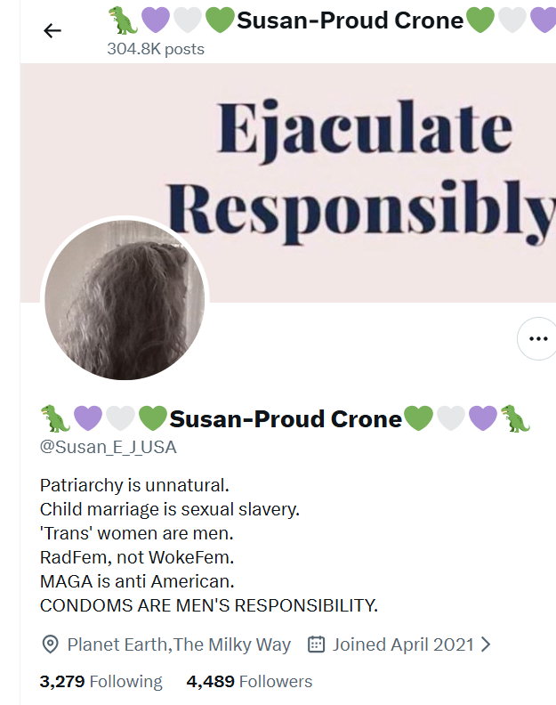
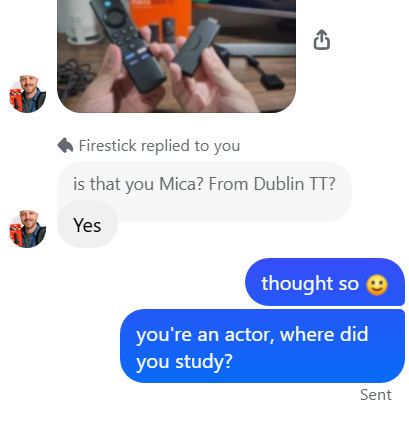

# September 2026

## KLM from Beijing to Amsterdam

- I drink too much, watch too many Monty Python snippets, and *REALIZE* with a massive start, biting my lip horribly when I do, that the American salmon-mousses tasked the Lopez Cano's with the crime of the late 20th century, and then blamed the British for it!
- I'm astounded.
- And then it all makes sense.
- If everyone believes this lie, and the Lopez Cano's became untouchable because of it, then they can do whatever they want, and have been doing so for the last thirty years going quietly then loudly criminally insane.
- Except, the Americans had planned to pay the Lopez Cano's for their efforts back in 1997, but the huge public response to the murder of Diana spooked them.
- So they didn't pay them, knowing that their budgets would be viewable at some time in the future, and even a thousand years of redaction wouldn't save them; so they didn't pay them and blamed it on the British royals who had absolutely no idea about this until the Queen died, at which point the mess was so tangled - multiple criminal enterprises having taken advantage of the lie - that no-one knew what to do about it.
- And no-one really knows how to stand up to the Americans and, not only that, the British press have been so good at muck-raking they practically set the stage for everyone to believe it!
- The sex-crime epidemic in Dénia and the region, and indeed the whole entire world, now makes total sense and the Americans have been blocking any and all help for these people since then to protect the lie and maintain their innocence.
- It's all so obvious, and so catastrophic.
- From here, everything unravels; Auggie's mistaken loyalties, no-one ever helping me, murdered British women, no-one seeming to care, townsfolk gone porn mad, everything.
- I realize too that the Americans must be, with the help of the UN, trying to pin all the sex crimes onto another group in the region represented by those they kidnapped and took to Israel so that the Lopez Cano's won't make a big fuss and everyone get suspicious.
- I write it all up, amazed.

## Heather emails me

- "Heather" wants to know if I'm coming to Dublin for Transforming Touch.
- I write to [the whole cohort](../../content/documents/emails/why-you-wont-see-me-at-tt-again.pdf) explaining why they'll never see me again at class.
- Steve responds in an helpful manner about maintaining my "privacy", which is amusing.

## Is Richard Free Paloma's boss?

- I email Inma asking her if Richard Freed is Paloma's boss. 
- She does not reply.

## Cauterets

- Because the mousses made such a fuss over me [in July/August 2025 when I stayed here and survived another round of poisoning by the Lopez Cano's](../2025/july.md#poisoning-ordered-by-the-americans), it seems everyone in the village thinks I'm famous!
- I guess the *organizers* had no option but to make themselves known.. did they say they were security or something like that?
- The town was heaving with salmon mousses that summer and they followed me everywhere I went.
- Although there might still be remnants of [poison from Sandra](../2024/september.md#the-hairdresser), I expect. It'd be nice to clear that up. The man is a great hairdresser; what on earth did she tell them?
- Also, I wonder if the creams and toiletries I left in the car while I went off to be murdered in Tibet/Bali had been tampered with, cyanide and things like that added, that'd pretty much assure us the salmon mousses meant me great harm, don't you think? Or just making sure and carrying on the lie still if I managed to make it back...
- When I arrived back in Cauterets, the first morning I used my Clarins toner I'd kept here, and I'm 100% it had something dreadful in it, my skin hasn't been right since, and when I went to the thermal centre about my cure, the woman was *horrified* when she saw me. *Tu cara*, she said in horror! Really she was asking if I'd eaten something poisonous. You should check the CCTV on that, I think she saw something "spiritual" going on - i.e. light body dealing with cyanide applied to the face. I had to go back the next day with a better face to reassure her. The rental woman saw the same thing, but wasn't quite so horrified, but did look away quickly. The cure woman knows me for a long time and had a good look at it.
- It looks like my eyebrows either stopped growing or fell out!
- I've just thrown everything else from those times (a few months ago) away too now. It's really a huge hassle you know. I wish it would stop. I hope it has stopped now.
- Again, just like my pesticide-soaked belongings making it to the public dump in North Finchley in 2025, no-one giving the tiniest sh*t about regular people and pets and animals, all those items are now ending up God knows where and putting normal folk and wildlife in danger.

### Madame Sordes

- Just like [the futarderie](../2025/august.md#the-futarderie) from July 2025.

### I see uncle Lopez Cano

- I absolutely 100% thought he would look exactly like that.
- I don't think I *recognized* him but I guess anything's possible.

## I see Antonio in Lourdes

- I do a double take, triple take and he's gone.
- I make a quip on X about how he's already bilocating and the next day, when I'm in the mountains, I realize he never went to Israel at all.
- He was hiding.
- I remember a dream I had about that. I think I even know where he was. But I didn't realize till now.
- Another huge unravel right here.
- Every time I go up into the mountains, I come back with truths for the book, rather like when I went to the Wall every day in Jerusalem.
- I guess, as I already knew, God is everywhere but He is *always* in the mountains.
- Up in the high mountains, where God is, there's a crow. And he's quite relaxed this year, and said hi, and dropped feathers for me, and old grey feather or his and three baby feathers.

## Two Announcements

I have two important announcements to make.

1. I hereby redefine the collocation *Salmon Mousse* to exclude ALL Brits (except perhaps some recalcitrant ones with Aries rising maybe...).

    <iframe width="839" height="472" src="https://www.youtube.com/embed/2LFZ-MssIbA" title="Dennis Moore | Monty Python (Official Sketch)" frameborder="0" allow="accelerometer; autoplay; clipboard-write; encrypted-media; gyroscope; picture-in-picture; web-share" referrerpolicy="strict-origin-when-cross-origin" allowfullscreen></iframe>

2. I hereby state that *nothing important* happens now without Antonio's unconditional safety, support, and counsel - cos we're a team.

## Joy

- *Joy* is the codename, or real name, of the spy intuitive program that US trauma therapy groups, such as Transforming Touch and Somatic Experiencing, recruit through.
- Steve even told us this formally (or just me and maybe one or two others of that cohort) on a course sometime in 2025.
- I was out of my mind with panic and anxiety (so probably January 2025) and Steve describes how security services like to recruit people with histories of severe trauma for a number of reasons, one being their ability to withstand hugely intense situations in ways that other people can't. So much for healing, Steve.
- In April 2026, Joy started to reveal themselves to me more directly; for example through the [bogus email request for healing](april.md#a-first-roasting) and the consequent "roasting" I went through - confirmed online on a Facebook account (Snoopy on a spit roast).
- I realized they had already been building up to revealing themselves through [Steve's consultations](march.md#transforming-touch-consultations), which I found so utterly unappealing I decided never to return.
- Then in [Bali at Loka Yoga](july.md#loka-yoga), they dropped the mask completely - I believe most if not all of the class participants were "intuitives" and many of them had visible signs of extreme trauma.
- It's not clear, however, how connected Joy is to the original A Course In Miracles program, Shield - part of Columbia University's activities in New York (incidentally Columbia is planning or is even ready to open four new centres in Israel).
- Shield, while researching LSD in the 60s, became loving enough to let the Light in a little bit and the Course was born.
- But something happened to shut it out again because there's clearly more darkness around than Light at the moment.
- So I'm not sure Joy is anything to do with A Course In Miracles and the original efforts; or if it was once and then lost it's way.
- It's difficult to figure out but there are clearly two paths for spy-intuitive recruitment (neither of which the candidate may ever know they've been part of):
    1. Highly intuitive people with massive trauma histories that have no spiritual practice - these people are likely ideal for the more sinister tasks required of spies.
    1. God's chosen teachers described by Jesus in A Course In Miracles who may or may not have trauma histories - these people are probably not quite so easy to control.
- Sadly, it looks like at least some of God's chosen teachers - once discovered - have been murdered, and it would be good to understand how that was at all justifiable.
- So, we have Joy (intuitive program), then Shield (ACIM program), and then the wider American security services who probably muscled in early on, after some obvious "results" probably, and made it impossible to maintain the *better way*.
- And today, these programs are doing more to protect evil than to bring the Light into the world, and that *mission*, as it were, is totally unhidden and universally accepted.

### Joy's fake accounts

- So, understanding I'm part of this historical phenomena - without ever having realized I was (suspected from time to time perhaps but never understood the fuller implications of it) - I can now look back over the years of torture I endured in Dénia and see that, peppered throughout the online communications I was having with criminal gangs, there is evidence that the CIA, via these programs, were very much part of the torturing process.
- They were totally disinterested in my horrific experiences, online and in person, and moreover totally disinterested in whatever has been happening to British and other foreign women, and now the children and babies, in the region - and we can assuredly say this is due to their lies.
- This is clear because the attacks on the vulnerable and innocent continue, and they *do* have the power to stop them, in the same way they've been *forbidding* anyone to do anything about them.
- Anyway, here's a a list, and I'll keep adding to it as they come up - maybe you good folk tasked with abominations-without-your-knowledge can help me:

#### Susan

- Remember this one?
- Previously, the profile pic was an AI mix of the face of Bruno the trumpet teacher, and Gloria the school receptionist - his sister, and others, all the way back in 2023. 
- Here it is:

- The Americans know names, faces, everything about these people and they simply do not care that they've gone totally porn mad because of their *LIE* that keeps them untouchable.

#### Ich heisse Joy

- With a conservatory teacher's face in the profile pic.

- Taking advantage of my belief that this account was managed by Hazel Smith, the Americans rampaged over my hacked browser talking endlessly to the Spanish gangs.
- I mean, what exactly were they trying to do at that time?
- It makes no sense apart from an inability to leave people in peace, I guess, because they are certainly not interested in law enforcement at all, we know this.
- Oh look, Snoopy's there too! Who'd a thunk it.

#### Mary G

- I thought this account was run by Domingo Lopez Cano.

#### More

- `@TaruAnn` God love her/him/etc.

#### Mica from Transforming Touch in Dublin

- It looks like a good proportion of the TT cohorts are actors too, and some of them are now coming out of the woodwork.
- Here's Mica, [the man tasked with making a fumbled pass at me](../2025/september.md#dublin-transforming-touch-therapy-with-steve) in September 2025.

- I guess that means [Nadim Kobesi](../2023/november.md#nadim-kobesi), the [Pakistani Yorkshireman](../2024/may.md#the-pakistani-yorkshire-man), even Ben, Grace, and others from Polygon are also CIA-paid actors. 
- And I bet those sorts of invoices aren't redacted either.

#### Moving this content out to have a page all its own

- In progress.

## Today, I remain amazed at the levels of evil you have been able to justify behind your mask of arrogance and faux-goodness! It's just mind-blowing.

- So why the frantic, panicky, constant interference in other people's lives?
- There's two reasons, both of which include, or require even, the TOTAL DISINTEREST in the out-of-control, sexually-psychotic evildoing going on in the region and the world:
    1. The need to protect a lie so gargantuan that if anyone found out about it utter and complete disintegration would be inevitable - even 300 years of redaction wouldn't save them if they had paid the Lopez Cano's, and they know it too.
    1. The desire to steal a weapon. And let's be clear, people like this, who forgot about God - if they had such a weapon - would destroy the whole world with it, including themselves, in less than a decade (oh wait..).
- And I'd like to be very clear here, if you think Jesus came down with the Course when that tiny sliver of Light got in in the 60s, without knowing you'd all f*ck up so tragically, so spectacularly, in every way possible, without knowing that one of his followers would side with evil against him again, and a good chunk of them would get to carousing, you really have no idea about God.
- I hope you're ashamed of yourselves. At least that would imply some retention of humanity.
- The irony being, of course, anyone who can't look me in the eye has retained some.
