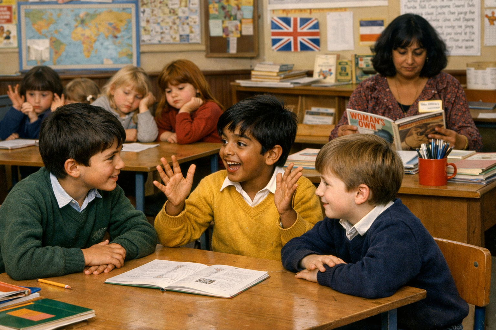

# 1984

## Abid Khan tells the class about the criminal porn his big brother shows him

- He's shouting now.
- "She was in a field with a pig", he declares.
- Tasos and Paul are animated and excited.
- Tasos tries to top Abid with the porn his big brother has shown him.
- "There were six of them", he says.
- Abid shouts louder still.
- I'm horrified.
- I feel a dark coldness come over me from head to foot.
- All the girls are quiet, looking down in silence.
- Something's very wrong, but we don't understand it.
- He's talking about snuff now.
- "Snuff, what's that?", asks Tasos.
- "You haven't seen snuff?", jeers Abid, "you're rubbish Tas".
- Tasos looks ashamed.
- "It's when they kill them, I saw it just yesterday, same field as the pig."
- Abid is triumphant.

- This was 1984 and eleven-year-old boys were already consuming murder-porn.
- 42 years later and men are still desperately protecting their porn.
- Dénia was a disaster waiting to happen.
- See also trans ideology, male-suicide rates, low birth rates, end of the world, etc.
